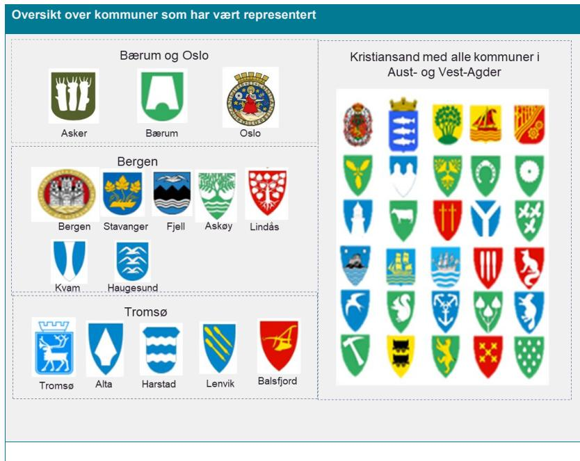

# Sentralt styringsdokument

Akson: Helhetlig samhandling og felles  
kommunal journalløsning

Vedlegg B

## Organisering av arbeidet

### **Publikasjonens tittel:**

Sentralt styringsdokument

Akson: Helhetlig samhandling og felles kommunal journalløsning

Vedlegg B Organisering av arbeidet

### **Rapportnummer**

IE-1056

### **Utgitt:**

Mars 2020

### **Utgitt av:**

Direktoratet for e-helse

### **Kontakt:**

postmottak@ehelse.no

### **Postadresse:**

Postboks 6737 St. Olavs plass, 0130 OSLO

### **Besøksadresse:**

Verkstedveien 1, 0277 Oslo

Tlf.: 21 49 50 70

Publikasjonen kan lastes ned på:

[www.ehelse.no](http://www.ehelse.no)

## Innhold

|                                                       |           |
|-------------------------------------------------------|-----------|
| <b>1 Innledning .....</b>                             | <b>4</b>  |
| <b>2 Organisering av arbeidet .....</b>               | <b>5</b>  |
| 2.1 Nærmere om arbeidet med KS og kommunene .....     | 8         |
| KS-programmet.....                                    | 8         |
| Referansekommunegrupper .....                         | 8         |
| 2.2 Løsningsomfang og arkitektur .....                | 11        |
| Arkitektur, personvern og informasjonssikkerhet ..... | 13        |
| Forsvarets sanitet.....                               | 14        |
| 2.3 Prosjektstrategi .....                            | 14        |
| 2.4 Tidsbrukskartlegging .....                        | 15        |
| 2.5 Erfaringsinnhenting .....                         | 16        |
| Erfaringsutveksling med Helseplattformen .....        | 16        |
| Erfaringsinnhenting i Norge.....                      | 18        |
| Erfaringsinnhenting i Norden og England .....         | 18        |
| 2.6 Leverandør- og markedsdialog.....                 | 20        |
| <b>3 Møte- og intervjuoversikt .....</b>              | <b>22</b> |
| 3.1 Tidsbrukskartlegging og intervjuer.....           | 22        |
| 3.2 Møteoversikt .....                                | 23        |

# 1 Innledning

Dette dokumentet er et vedlegg til Sentralt styringsdokument for Akson.

Sentralt styringsdokument er utarbeidet av Direktoratet for e-helse i samarbeid med sektoren og med stort bidrag fra KS og kommunesektoren, utøvende helsepersonell, pasient- og brukerforeninger, spesialisthelsetjenesten og nasjonale helsemyndigheter. Nasjonalt e-helsestyre har vært styringsgruppe for arbeidet. Formålet med dokumentet er å gi en beskrivelse av hvordan arbeidet er organisert og hvordan aktørene er involvert, samt gi en oversikt over gjennomførte møter, referansebesøk og intervjuer. Prosess og metode for enkelte områder er beskrevet nærmere i tilhørende vedlegg.

# 2 Organisering av arbeidet

Direktoratet for e-helse er ansvarlig for gjennomføring av oppdraget. Arbeidet har i stor grad vært en videreføring av organiseringen i konseptvalgutredningen, med en prosjektorganisasjon i direktoratet, et prosjektstyre og med Nasjonalt e-helsestyre som styringsgruppe.

Styringsgruppen for Akson ga i møte 19. juni sin tilslutning til plan for og organisering av forprosjektet. Plan og organisering ble i forkant av dette drøftet med sentrale interessenter, herunder KommlT-rådet og KS, Prosjektstyret, Legeforeningen, Helsedirektoratet og spesialisthelsetjenesten.

Figur 1 illustrerer utgangspunktet for organiseringen av forprosjektet. Organiseringen har blitt noe justert underveis i forprosjektet, særlig for arbeidet med prosjektstrategi og løsningsomfang og arkitektur.

Diagrammet illustrerer organiseringen av arbeidet i forprosjektet. Det er strukturert i flere nivåer og sektorer:

- Top nivå:** FIN, HOD, og KMD.
- Styringslinjer:**
  - Ordinær styringslinje (ledet av **Direktoratet for e-helse**)
  - E-helse samstyringsmodell (ledet av **NEHS**)
- Kommunesektor:**
  - Kommuner og KS
  - KommlT-rådet** (med **NUIT** og **NUFA** som medlemmer)
  - Saksforberedende arbeidsutvalg og Kjerneteam
  - Digitaliseringsutvalget og Faggruppe e-helse
  - Fagråd Info sikkerhet og personvern og Fagråd Arkitektur
- Spesialisthelsetjenesten:** Helse Sør-Øst RHF, Helse Vest RHF, Helse Midt-Norge RHF, Helse Nord RHF.
- Nasjonale myndigheter og virksomheter:** Helse-direktoratet, Folkehelseinstituttet, Statens legemiddelverk, NHN.
- Pasient- og brukerforeninger:** FFO, Kraftforeningen, ...
- Fag- og profesjonsforeninger:** Den Norske Legeforening, Fagforbundet, Fysioterapi, Norsk Sykepleierforbund, Tannlegeforeningen, ...
- Arbeidsgrupper:**
  - Arbeidsgrupper i møter: Løsningsomfang og Arkitektur
  - Arbeidsgruppe Prosjektstrategi
  - Kommunegrupper

Organiseringen av arbeidet i forprosjektet. Diagrammet viser hierarkien fra FIN og HOD til KMD, og deretter til ulike sektorer som Kommunesektor, spesialisthelsetjenesten, nasjonale myndigheter, pasient- og brukerforeninger, og fag- og profesjonsforeninger. Det inneholder også en detaljert oversikt over prosjektstyret, prosjektgruppen, og arbeiderne i løsningsomfang og arkitektur.

**Figur 1 Organisering av arbeidet**

Forprosjektet har involvert helse- og omsorgssektoren gjennom arbeidsgrupper, møter, intervjuer og innspillsrunder. Sektoren ble involvert i arbeidsgrupper og arbeidsmøter knyttet til områdene Prosjektstrategi og Løsningsomfang og arkitektur. Arbeidet er nærmere beskrevet i kapittel 2.2 og 2.3. Sentrale tema som er behandlet i styringsgruppen for Akson har, så langt det har vært mulig, først vært behandlet i Prosjektstyret. Prosjektet har også drøftet sentrale tema med NUIT og NUFA i sektorens samstyringsmodell for e-helse og med råd og utvalg underliggende til KommlT-rådet. Prosjektet har særlig samarbeidet tett med KS, et kjerneteam og fire kommunegrupper. I kapittel 2.1 gis det en nærmere beskrivelse av samarbeidet med KS og kommunene.

I Tabell 1 gis en beskrivelse av hvordan de ulike aktørene har vært involvert, og i kapittel 0 oppsummeres alle gjennomførte møter og intervjuer.

Prosjekts arbeidsform kan overordnet beskrives slik:

1. **Innhenting av erfaringer og innspill**  
Prosjektet har innhentet erfaringer fra andre aktører i offentlig sektor og andre e-helseprosjekter i Norden, inkludert Helseplattformen. Det er gjennomført en markedsdialog for å få innspill fra norske og internasjonale leverandører.
2. **Forberedende vurderinger**  
Prosjektet utarbeidet foreløpige vurderinger for sentrale tema.
3. **Arbeidsgrupper og arbeidsmøter**  
Prosjektet har fått bidrag og innspill fra arbeidsgrupper og møter i sektor og direktoratet. Hovedaktiviteten har vært innen prosjektstrategi og løsningsomfang og arkitektur.
4. **Etablerte samstyringsfora**  
Prosjektet har gjennom orienterings- og drøftingssaker fått innspill fra NUFA, NUIT og råd og utvalg i KS' samstyringsmodell for digitalisering.
5. **Prosjektstyre, KommlT-rådet og Nasjonalt e-helsestyre**  
Prosjektet har drøftet alle sentrale tema før forprosjektets rapport og anbefalinger oversendes HOD.
6. **Direktoratet for e-helse, ledermøte**  
Endelig godkjennelse før oversendelse til HOD.

**Tabell 1 Aktører som har vært involvert i forprosjektet**

| Oversikt over aktører som har vært involvert i gjennomføringen av forprosjektet                    |                                                                                                                                                                                                                                                                                                                                                                                                                                                                                                                                                                                                                                          |
|----------------------------------------------------------------------------------------------------|------------------------------------------------------------------------------------------------------------------------------------------------------------------------------------------------------------------------------------------------------------------------------------------------------------------------------------------------------------------------------------------------------------------------------------------------------------------------------------------------------------------------------------------------------------------------------------------------------------------------------------------|
| <b>Helse- og omsorgsdepartementet</b>                                                              | <ul style="list-style-type: none"> <li>• Fag- og eierdepartement.</li> <li>• Prosjektet har gjennomført jevnlige møter for å rapportere om fremdrift og status i behandling av sentrale tema.</li> </ul>                                                                                                                                                                                                                                                                                                                                                                                                                                 |
| <b>Direktoratet for e-helse</b>                                                                    | <ul style="list-style-type: none"> <li>• Ansvarlig for oppdraget.</li> <li>• Sentrale spørsmål er behandlet i ordinære ledermøter og ukentlige prosjekteiermøter.</li> <li>• Arbeidsgruppe (SPA) med representanter fra funksjonene Strategi, Portefølje og Arkitektur, inkludert representanter fra nasjonale e-helseløsninger og relevante prosjekter. For øvrig arbeidsmøter ved behov.</li> </ul>                                                                                                                                                                                                                                    |
| <b>Nasjonal styringsmodell (Nasjonalt e-helsestyre, NUIT og NUFA)</b>                              | <ul style="list-style-type: none"> <li>• Nasjonalt e-helsestyre er prosjektets styringsgruppe.</li> <li>• Arbeidet er presentert og drøftet i NUIT (prioriteringsutvalget) og NUFA (utvalg for fag og arkitektur).</li> </ul>                                                                                                                                                                                                                                                                                                                                                                                                            |
| <b>Prosjektstyret</b>                                                                              | <ul style="list-style-type: none"> <li>• Det ble i 2016 etablert et prosjektstyre for arbeidet med én innbygger – én journal. Prosjektstyret er videreført som prosjektstyre for Akson forprosjekt. Prosjektstyret har deltakelse fra kommuner, KS, spesialisthelsetjenesten, pasient- og brukerorganisasjoner, fag- og profesjonsforeninger, Helsedirektoratet, Folkehelseinstituttet og Norsk Helsenet.</li> <li>• Sentrale tema som er behandlet i Nasjonalt e-helsestyre er i all hovedsak først behandlet i Prosjektstyret.</li> <li>• Prosjektstyret har fått dokumenter på innspillsrunder.</li> </ul>                            |
| <b>KS, kommuner og kommunale fora inkl. helsepersonell fra kommunal helse- og omsorgstjenesten</b> | <ul style="list-style-type: none"> <li>• Representert i Nasjonalt e-helsestyre med underutvalg og Prosjektstyret.</li> <li>• Det er gjennomført jevnlige arbeids- og temamøter med tilstøtende program i KS og kjerneteamet som er etablert på kommunesiden.</li> <li>• KS programledelse har deltatt i markedsdialog.</li> <li>• Gjennom KS inviteres kommuner til å delta i arbeidsgruppe og -møter knyttet til <i>Prosjektstrategi</i> og <i>Løsningsomfang og Arkitektur</i>.</li> <li>• Prosjektet har i tillegg drøftet sentrale spørsmål med råd og utvalg i kommunesektoren knyttet til digitalisering (KommlT-rådet,</li> </ul> |

|                                                        |                                                                                                                                                                                                                                                                                                                                                                                                                                                                                                                                                                                                                                                                                                                                                                                                                                                                                                                                                                                                                               |
|--------------------------------------------------------|-------------------------------------------------------------------------------------------------------------------------------------------------------------------------------------------------------------------------------------------------------------------------------------------------------------------------------------------------------------------------------------------------------------------------------------------------------------------------------------------------------------------------------------------------------------------------------------------------------------------------------------------------------------------------------------------------------------------------------------------------------------------------------------------------------------------------------------------------------------------------------------------------------------------------------------------------------------------------------------------------------------------------------|
|                                                        | 
Digitaliseringsutvalget, Fagråd arkitektur og Fagråd informasjonssikkerhet og personvern, Faggruppe for e-helse), samt K10 Helse Velferd og Storbymnettverket.
 <ul style="list-style-type: none"> <li>• KS og direktoratet samarbeider om kommunikasjonsplan og -aktiviteter.</li> </ul> 
Referansekommuner
 <ul style="list-style-type: none"> <li>• Våren 2017 ble det etablert fire referansekommunegrupper med utgangspunkt i Bergen, Bærum, Kristiansand og Tromsø og tilsammen totalt 45 samarbeidskommuner. Referansekommunegruppene er videreført i forprosjektet. Fra juni 2019 ble også Oslo kommune pekt på som en referansekommune.</li> <li>• Det er gjennomført en rekke arbeidsmøter med referansekommunene.</li> <li>• Referansekommuner har fått dokumenter på innspillsrunder.</li> <li>• Jevnlig koordinering og oppdatering mellom prosjektet og koordinatorene i referansekommunene.</li> </ul> 
Det vises til kapittel 2.1 for nærmere beskrivelse av samarbeidet med KS og kommuner.
 |
| <b>Fastlegjetjenesten</b>                              | <ul style="list-style-type: none"> <li>• Fastlege utpekt av Legeforeningen er representert i Nasjonalt e-helsestyre. Fastlege er også representert i Prosjektstyret.</li> <li>• Det ble i 2017 etablert en arbeidsgruppe med fastleger og helsesekretærer gjennom Legeforeningen (ved Norsk forening for allmenntmedisin) og Helsesekretærforbundet</li> <li>• Det er i forprosjektet gjennomført flere arbeidsmøter med fastlegegruppen.</li> <li>• Fastleger har deltatt i arbeidsmøter i referansekommuner.</li> </ul>                                                                                                                                                                                                                                                                                                                                                                                                                                                                                                     |
| <b>Spesialisthelsetjenesten, inkl. helsepersonell</b>  | <ul style="list-style-type: none"> <li>• Representert i Nasjonalt e-helsestyre med underutvalg og Prosjektstyret.</li> <li>• Det er gjennomført flere arbeidsmøter med IKT-ledelsen i spesialisthelsetjenesten</li> <li>• IKT-ledelsen har deltatt i arbeidsgruppe for <i>Prosjektstrategi</i></li> <li>• Det er gjennomført møte med fagdirektører</li> <li>• Det er gjennomført arbeidsmøter med kliniske fagmiljø.</li> <li>• Har deltatt i felles arbeidsmøter med kommunesektoren knyttet til arbeid med <i>Løsningsomfang og Arkitektur</i>.</li> </ul>                                                                                                                                                                                                                                                                                                                                                                                                                                                                 |
| <b>Helseplattformen</b>                                | <ul style="list-style-type: none"> <li>• Det er inngått samarbeidsavtale vedrørende Helseplattformen mellom Helseplattformen AS, Helse Midt-Norge RHF og Direktoratet for e-helse.</li> <li>• Direktoratet følger opp og bistår Helseplattformen og Helse Midt-Norge RHF, som regional utprøving av det nasjonale målbildet.</li> <li>• Helseplattformen bistår Direktoratet for e-helse med erfaringsdeling, herunder deling av informasjon og dokumentasjon.</li> <li>• Relatert til arbeidet med Helseplattformen er det i perioden gjennomført jevnlige erfaringsutvekslingsmøter med Helseplattformen, Trondheim kommune og representanter for øvrige opsjonskommuner i Midt-Norge, samt Helse Midt-Norge RHF</li> </ul>                                                                                                                                                                                                                                                                                                 |
| <b>Pasient- og brukerrepresentanter</b>                | <ul style="list-style-type: none"> <li>• FFO og Nasjonalforeningen for folkehelse er representert i Nasjonalt e-helsestyre og FFO i Prosjektstyret.</li> <li>• Pasient- og brukerrepresentanter deltok i arbeidsmøter knyttet til <i>Løsningsomfang og Arkitektur</i> samt <i>Prosjektstrategi</i>.</li> <li>• Dialogmøte med Forbrukerrådet.</li> </ul>                                                                                                                                                                                                                                                                                                                                                                                                                                                                                                                                                                                                                                                                      |
| <b>Helsepersonell Fag- og profesjonsforeninger</b> | <ul style="list-style-type: none"> <li>• Deltakere i arbeidsmøter knyttet til Løsningsomfang og arkitektur er i stor grad utøvende helsepersonell og administrativt personell som representerer ulike tjenesteområder og profesjonsgrupper i primærhelsetjenesten og spesialisthelsetjenesten. Prosjektet har bestilt/gitt innspill på hvilke fagområder og funksjoner som burde være representert og virksomheten velger ut sine deltakere</li> <li>• Legeforeningen er representert i Nasjonalt e-helsestyre og er invitert til å delta i arbeidsgruppe knyttet til <i>Prosjektstrategi</i></li> </ul>                                                                                                                                                                                                                                                                                                                                                                                                                      |

|                                              |                                                                                                                                                                                                                                                                                                                                                                                                                                                                                                                                                                                                                                           |
|----------------------------------------------|-------------------------------------------------------------------------------------------------------------------------------------------------------------------------------------------------------------------------------------------------------------------------------------------------------------------------------------------------------------------------------------------------------------------------------------------------------------------------------------------------------------------------------------------------------------------------------------------------------------------------------------------|
| <b>Nasjonale fagmyndigheter</b>              | <ul style="list-style-type: none"> <li>• Legeforeningen er representert i Nasjonalt e-helsestyre.</li> <li>• Legeforeningen, Sykepleierforbundet, Fagforbundet, Tannlegeforeningen og Norsk Fysioterapeutforbund er representert i Prosjektstyret.</li> <li>• Involvering av fag- og profesjonsforeninger er drøftet i Nasjonal arena for fag- og profesjonsforeninger.</li> </ul>                                                                                                                                                                                                                                                        |
| <b>Norsk Helsenett</b>                       | <ul style="list-style-type: none"> <li>• Helsedirektoratet og Folkehelseinstituttet er representert i Nasjonalt e-helsestyre og Prosjektstyret.</li> <li>• Helsedirektoratet er invitert inn på relevante saker i arbeidet med Prosjektstrategi.</li> <li>• Helsedirektoratet samarbeider med prosjektet om vurdering av regelverk.</li> <li>• Helsedirektoratet, Statens legemiddelverk og Folkehelseinstituttet deltok i arbeidsmøter om helsefaglig standardisering.</li> <li>• Dialogmøter med Helsedirektoratet, Folkehelseinstituttet og Helseilsynet, Datatilsynet og Barne-, ungdoms- og familiedirektoratet (Bufdir).</li> </ul> |
| <b>Leverandører/industriaktører</b>          | <ul style="list-style-type: none"> <li>• Representert i Nasjonalt e-helsestyre (observatør) med underutvalg og Prosjektstyret.</li> <li>• Det er gjennomført arbeidsmøter for å avklare beskrivelser, vurderinger og anbefalinger.</li> </ul>                                                                                                                                                                                                                                                                                                                                                                                             |
| <b>Forsvarets sanitet</b>                    | <ul style="list-style-type: none"> <li>• Det er gjennomført en markedsdialog med norske og internasjonale leverandører.</li> <li>• Arbeidet er presentert i Direktoratet for e-helse sine faste møter med IKT-leverandører.</li> <li>• Presentasjon i IKT Norges eHelseforum.</li> <li>• Direktoratet har deltatt i Norway Health Tech dialogmøte om Akson.</li> </ul>                                                                                                                                                                                                                                                                    |
| <b>Referansebesøk og erfaringsinnhenting</b> | <ul style="list-style-type: none"> <li>• Forsvarets sanitet (FSAN) tok kontakt med forprosjektet for å kunne gjøre vurdering av mulig deltakelse i felles kommunal journalløsning. Det ble arrangert tre arbeidsmøter i perioden oktober 2019 til januar 2020.</li> <li>• Prosjektet har innhentet erfaringer fra andre aktører i offentlig sektor og andre e-helseprosjekter i Norden, inkludert Helseplattformen.</li> </ul>                                                                                                                                                                                                            |

## 2.1 Nærmere om arbeidet med KS og kommunene

### KS-programmet

KS og kommunesektoren er invitert til et tett samarbeid som omfatter prosjektledelse, samarbeid om oppgaver i oppdraget og deltakelse i arbeidsgrupper og arbeidsmøter. KS har opprettet et program som skal samordne innspill, posisjoner og behov fra kommunesektoren. Under KS-programmet er det organisert et kjerneteam og et saksforberedende utvalg med deltakelse fra kommunene som skal gi innspill og råd til sakene som skal behandles i den nasjonale samstyringsstrukturen. KS-programmet har samtidig sørget for løpende forankring i KommIT-rådet som er det øverste organet i KS sin styringsmodell på digitalisering. KS og Direktoratet for e-helse har koordinert planer og aktiviteter knyttet til kommunikasjon.

### Referansekommunegrupper

I samarbeid med KS ble det våren 2017 etablert fire kommunegrupper med utgangspunkt i Bergen, Bærum, Kristiansand og Tromsø. Fra juni 2019 ble Oslo kommune pekt på som

egen referansekommune. Tilsammen har 45 kommuner vært representert og involvert i det forberedende arbeidet i 2017, i konseptvalgutredningen i 2018 og i forprosjektet i 2019 og 2020. I tillegg har KS bidratt for å sikre forankring mot øvrige kommuner. Se Figur 2 for oversikt over referansekommunegruppene.

**Oversikt over kommuner som har vært representert**

The figure displays a collection of municipal coats of arms, organized into four distinct groups:

- Bærum og Oslo:** Includes the coats of arms for Askøy, Bærum, and Oslo.
- Bergen:** Includes the coats of arms for Bergen, Stavanger, Fjell, Askøy, Lindås, Kvam, and Haugesund.
- Tromsø:** Includes the coats of arms for Tromsø, Alta, Harstad, Lenvik, and Balsfjord.
- Kristiansand med alle kommuner i Aust- og Vest-Agder:** A large group containing 25 different municipal coats of arms from the Kristiansand region and the surrounding areas of Aust- and Vest-Agder.

A grid of municipal coats of arms categorized into four groups: Bærum og Oslo, Bergen, Tromsø, and a large group for Kristiansand and all municipalities in Aust- and Vest-Agder.

**Figur 2 Oversikt over kommuner som har vært representert**

I forprosjektperioden har det vært omfattende involvering av referansekommunegrupper. Formålet med involveringen har i hovedsak vært å innhente informasjon, kvalitets sikre og drøfte sentrale problemstillinger og vurderinger rundt Løsningsomfang og arkitektur. I overkant av 200 helsepersonell, teknisk personell, ledere fra den kommunale helse- og omsorgssektoren m.fl. har totalt sett vært involvert i arbeidsmøter i forbindelse med Løsningsomfang og arkitektur.

**Tabell 2 Oversikt over møter med referansekommunegrupper**

| Oversikt over møter med referansekommunegrupper |                                                                                                                                        |                                                                                                                                                                                                                                               |
|-------------------------------------------------|----------------------------------------------------------------------------------------------------------------------------------------|-----------------------------------------------------------------------------------------------------------------------------------------------------------------------------------------------------------------------------------------------|
| Dato                                            | Aktør                                                                                                                                  | Hovedtema                                                                                                                                                                                                                                     |
| 18.06.2019                                      | Bergen Bærum Agder Oslo Tromsø Helse Nord Helse Vest Helse Sør- Øst Kreftforeningen Den Norske Legeforening | <b>Møte med spesialisthelsetjenesten og referansekommunegrupper</b> Samhandlingsløsningen(e) Innspill til innhold og prioritering av innhold i samhandling med spesialisthelsetjenesten                                                 |
| 25.06.2019                                      | Bergen Bærum Agder Oslo Tromsø Kreftforeningen FFO Helsedirektoratet Fylkesmannen KS                        | <b>Felles møte med referansekommunegrupper</b> Gjennomgang av konsept felles kommunal journalløsning og helhetlig samhandling. Tildelingsbrev og sentralt styringsdokument. Gevinstarbeid                                            |
| 27.08.2019                                      | Bærum Oslo Oslo universitetssykehus Diakonhjemmet Den Norske legeforening                                                  | <b>Møte med spesialisthelsetjenesten og referansekommune Oslo og Bærum</b> Samhandlingsløsningen(e) Innspill til innhold og prioritering av innhold i samhandling mellom kommunal helse- og omsorgstjeneste og spesialisthelsetjenesten |
| 02.09.2019                                      | Bærum Oslo KS                                                                                                                    | <b>Møte med referansekommune Bærum og Oslo</b> Informasjonsbehov ved samhandling i felles kommunal journalløsning                                                                                                                          |
| 04.09.2019                                      | Agder-kommuner Norsk Fysioterapeutforbund                                                                                           | <b>Møte med referansekommunegruppe Kristiansand</b> Informasjonsbehov ved samhandling i felles kommunal journalløsning                                                                                                                     |
| 10.09.2019                                      | Bærum Agder Oslo Helse Vest Helse Sør-Øst Den Norske legeforening Norsk sykepleierforbund                            | <b>Møte med spesialisthelsetjenesten og referansekommunegrupper</b> Samhandlingsløsningen(e) Prioritering av samhandling med spesialisthelsetjenesten Forventninger til aktører som står utenfor samhandlingsløsningen               |
| 17.09.2019                                      | Bergen                                                                                                                                 | <b>Møte med referansekommune Bergen</b> Samhandlingsløsningen(e) Prioritering av samhandling med spesialisthelsetjenesten Prioritering av innhold i samhandling med andre statlige og kommunale tjenester                            |

|            |                                                                                                                                                                                                         |                                                                                                                                                                                                                    |
|------------|---------------------------------------------------------------------------------------------------------------------------------------------------------------------------------------------------------|--------------------------------------------------------------------------------------------------------------------------------------------------------------------------------------------------------------------|
| 19.09.2019 | Tromsø                                                                                                                                                                                                  | <b>Møte med referansekommune Tromsø</b> Samhandlingsløsningen(e) Prioritering av samhandling med spesialisthelsetjenesten Prioritering av innhold i samhandling med andre statlige og kommunale tjenester |
| 10.10.2019 | Bergen Bærum Agder Tromsø Oslo Den Norske legeforening Norsk sykepleieforbund Den Norske tannlegeforening Norsk Fysioterapeutforbund Helsedirektoratet Fylkesmannen KS | <b>Felles møte med referansekommunegrupper, KS m.m</b> Felles forståelse av løsningsomfang for journalløsningen og samhandlingsløsningen(e)                                                                     |

## 2.2 Løsningsomfang og arkitektur

Forprosjektet skal beskrive tiltakets løsningsomfang og arkitektur, og beskrive alle sentrale grensesnitt og avhengigheter. Direktoratet etablerte en arbeidsgruppe med representanter fra direktoratets funksjoner for Strategi, Portefølje og Arkitektur (SPA), samt representanter fra eksisterende nasjonale e-helseløsninger og relevante pågående prosjekter. SPA-gruppen behandlet spørsmål i oppdragsbrevet knyttet til prioriteringer i e-helseporteføljen og endringer som er hensiktsmessig å gjøre i dagens løsninger før en eventuell innføring av ny journalløsning og investeringer i samhandlingsløsning.

I tidlig fase i arbeidet med å definere løsningsomfang for Akson, var det nødvendig å dele opp analysen i seks temaer og det ble utarbeidet et bilag for hvert tema:

- Tema 1: Funksjonalitet og samhandling i felles journalløsning
- Tema 2: Samhandling mellom helsepersonell med ulike journalløsninger
- Tema 3: Samhandling mellom helsepersonell og andre kommunale og statlige tjenester
- Tema 4: Samhandling med innbygger
- Tema 5: Identitets- og tilgangsstyring, informasjonssikkerhet og personvern
- Tema 6: Administrative funksjoner i kommunal helse- og omsorgstjeneste.

Temabilagene ble sendt ut til referansekommunegrupper, pasient- og brukerforeninger, Helsedirektoratet og KS.

Innspill ble innarbeidet og dokumentene bearbeidet og etter første innspillsrunden ble temaene slått sammen til et vedlegg til styringsdokumentet med to bilag:

- Vedlegg G Løsningsomfang og arkitektur
- Bilag G1 Felles kommunal journalløsning
- Bilag G2 Helhetlig samhandling

Innspillsrunder knyttet til løsningsomfang og arkitektur fremgår i Tabell 3.

**Tabell 3 Skriftlige innspill på vedlegg og bilag knyttet til løsningsomfang og arkitektur**

| Oversikt over skriftlige innspill på vedlegg og bilag knyttet til løsningsomfang og arkitektur |                                                                                                                                                            |                                                                                                                                                                                                                                                      |
|------------------------------------------------------------------------------------------------|------------------------------------------------------------------------------------------------------------------------------------------------------------|------------------------------------------------------------------------------------------------------------------------------------------------------------------------------------------------------------------------------------------------------|
| Dato sendt                                                                                     | Aktør                                                                                                                                                      | Hovedtema                                                                                                                                                                                                                                            |
| 28.06.2019                                                                                     | Kreftforeningen Funksjonshemmedes fellesorganisasjon Helsedirektoratet Kristiansand og Agder-kommunene Bergen Oslo Bærum Tromsø KS | Tema 5: Identitets- og tilgangsstyring, informasjonssikkerhet og personvern                                                                                                                                                                          |
| 03.07.2019                                                                                     | Kreftforeningen Funksjonshemmedes fellesorganisasjon Helsedirektoratet Kristiansand og Agder-kommunene Bergen Oslo Bærum Tromsø KS | Tema 1: Funksjonalitet og samhandling i felles journalløsning Tema 2: Samhandling mellom helsepersonell med ulike journalløsninger Tema 4: Samhandling med innbygger Tema 6: Administrative funksjoner i kommunal helse- og omsorgstjeneste |
| 17.10.2019                                                                                     | Kreftforeningen Funksjonshemmedes fellesorganisasjon Helsedirektoratet Kristiansand og Agder-kommunene Bergen Oslo Bærum Tromsø KS | Tema 3: Samhandling mellom helsepersonell og andre kommunale og statlige tjenester                                                                                                                                                                   |
| 02.12.2019                                                                                     | Kreftforeningen Funksjonshemmedes fellesorganisasjon Helsedirektoratet Kristiansand og Agder-kommunene Bergen Oslo Bærum Tromsø KS | Vedlegg G Løsningsomfang og arkitektur. Bilag G1 Felles kommunal journalløsning. Bilag G2 Helhetlig samhandling.                                                                                                                               |
| 24.01.2020                                                                                     | Kristiansand og Agder-kommunene Bergen Oslo Bærum Tromsø KS                                                                                 | SSD versjon 08, Notat Akson Arkitektur                                                                                                                                                                                                               |

### Arkitektur, personvern og informasjonssikkerhet

Det er også gjennomført en omfattende prosess med KS fagråd arkitektur, fagråd informasjonssikkerhet og kjerneteam for å lande en målarkitektur for felles kommunal journalløsning, jf. Tabell 4. Det har i fellesskap vært arbeidet frem arkitekturbeskrivelser og beskrivelser rundt informasjonssikkerhet, vurdering av personvern samt vurdering av risiko og sårbarhet (ROS). Resultatet fra arbeidet rundt arkitektur er blant annet beskrevet i vedlegg Q Felles dokument fra KS, Direktoratet for e-helse og utvalgte kommuner vedrørende arkitektur for Akson, og er innarbeidet i sentralt styringsdokument. Resultat fra arbeidet rundt informasjonssikkerhet, ROS og personvern er beskrevet i vedlegg L Sikkerhetsarkitektur, vedlegg M Overordnet personvernvurdering og vedlegg N Overordnet risiko- og sårbarhetsvurdering.

**Tabell 4 Gjennomførte eksterne møter knyttet til arkitektur, personvern og informasjonssikkerhet**

| Date                            | Organization                                                                       | Meeting Description                                                                                       |
|---------------------------------|------------------------------------------------------------------------------------|-----------------------------------------------------------------------------------------------------------|
| informasjonssikkerhet           | og kjerneteam                                                                      | for å lande en målarkitektur for felles kommunal                                                          |
| journalløsning, jf.             | Tabell 4. Det har i fellesskap vært arbeidet frem arkitekturbeskrivelser og        |                                                                                                           |
| Sikkerhetsarkitektur, vedlegg M |                                                                                    | er beskrevet i vedlegg L Overordnet personvernvurdering og vedlegg N Overordnet                           |
| risiko-                         | og sårbarhetsvurdering. og sårbarhetsvurdering.                                    |                                                                                                           |
| Dato                            | informasjonssikkerhet Aktør                                                        | Hovedtema                                                                                                 |
| 22.10.2019                      | KS Kjerneteam m.fl.                                                                | Forberedelse til temamøte vedr. arkitektur og identitets- og tilgangsstyring                              |
| 01.11.2019                      | KS fagråd informasjonssikkerhet og                                                 | Temamøte arkitektur, informasjonssikkerhet og                                                             |
|                                 | personvern og KS Fagråd arkitektur personvern og KS Fagråd arkitektur              | personvern personvern                                                                                     |
| 01.11.2019                      | KS kjerneteam                                                                      | Organisering og ansvarsdeling                                                                             |
| 08.11.2019                      | KS fagråd informasjonssikkerhet og personvern, KS fagråd arkitektur, KS kjerneteam | Oppfølgingsmøte om arkitektur og informasjonssikkerhet                                                    |
| 13.11.2019                      | KS kjerneteam m.fl.                                                                | Temamøte dataansvar og overordnede personvernkonsekvenser                                                 |
| 19.11.2019                      | KS fagråd personvern og informasjonssikkerhet, KS kjerneteam m.fl.                 | Temamøte arkitektur og personvernkonsekvenser                                                             |
| 20.11.2019                      | KS kjerneteam m.fl.                                                                | Temamøte informasjonssikkerhet og personvern                                                              |
| 29.11.2019                      | KS kjerneteam m.fl.                                                                | Temamøte arkitektur, velferdsteknologi inkl. medisinsk avstandsoppfølging                                 |
| 10.01.2020                      | KS fagråd arkitektur, KS kjerneteam m.fl.                                          | Temamøte arkitektur                                                                                       |
| 15.01.2020                      | KS fagråd arkitektur                                                               | Arkitektur, oppfølgingsmøte                                                                               |
| 21.01.2020                      | KS fagråd arkitektur                                                               | Arkitektur, oppfølgingsmøte                                                                               |
| 22.01.2020                      | KS fagråd arkitektur                                                               | Arkitektur, oppfølgingsmøte                                                                               |
| 23.01.2020                      | Oslo kommune og KS                                                                 | Gjennomgang av foreløpige vurderinger knyttet til arkitektur og behov for fleksibilitet i konseptet (K7). |
| 29.01.2020                      | Oslo kommune og KS                                                                 | Oppfølging fra møte 23.01                                                                                 |
| 07.02.2020                      | KS, Oslo kommune                                                                   | Formøte – Sikkerhetsstrategi, ROS samt vurdering av informasjonssikkerhet og personvern                   |
| 19.02.2020                      | KS og Oslo kommune                                                                 | Innspill – Sikkerhetsstrategi, ROS samt vurdering av informasjonssikkerhet og personvern                  |
| 25.02.2020                      | KS kjerneteam                                                                      | Gjennomgang av innspill til sentralt styringsdokument versjon 0.95, inkl. arkitektur                      |

### Forsvarets sanitet

Forsvarets sanitet (FSAN) kontakt forprosjektet for å kunne gjøre vurdering av mulig deltakelse i felles kommunal journalløsning. Det ble gjennomført tre møter i perioden oktober 2019 til januar 2020. I vurdering av fremtidig journalløsning for Forsvaret har representanter fra Forsvarets sanitet gjort en foreløpig vurdering av at deltakelse i felles journalløsning i Akson kan være hensiktsmessig og ønsker å følge dette opp i videre arbeid.

Det ligger utenfor forprosjektets omfang å vurdere Forsvarets behov for journalløsning, og det har derfor ikke vært estimert kost/nytte eller vurdert øvrige konsekvenser. Eventuelle styringsmessige føringer, konsekvenser for informasjonssikkerhet og personvern samt ulike alternativer for implementasjon og drift bør også vurderes. Dette kan eventuelt følges opp i samarbeid med Forsvaret på et senere tidspunkt.

## 2.3 Prosjektstrategi

Forprosjektet opprettet i juni 2019 er arbeidsgruppe for prosjektstrategi (jf. Figur 1). Medlemmene i arbeidsgruppen var representanter fra KS, kommunene, de regionale helseforetakene, Norsk Sykepleierforbund, Den Norske Legeforeningen, Helsedirektoratet, Folkehelseinstituttet og Norsk Helsenet SF. Formålet med arbeidsgruppen å gi innspill og råd til tiltaket på hvordan tiltaket samlet sett skal gjennomføres for å nå sine mål.

Det ble gjennomført til sammen tre arbeidsmøter med gruppen der følgende tema ble drøftet: organisering og ansvarsdeling, gjennomføringsstrategi og kontraktstrategi. Innspillene fra arbeidsgruppen har vært en viktig del av anbefalingene forprosjektet har gitt til Prosjektstyret og Nasjonalt e-helsestyre. I november 2019 ble forprosjektet Akson i samråd med KS og kommunene enige om å avvikle arbeidsgruppen for prosjektstrategi da det ikke var den mest hensiktsmessige arbeidsformen, særlig som følge av innretning mot stegvis utviklingsretning for løsningsomfang knyttet til helhetlig samhandling. Det ble besluttet at tema knyttet til prosjektstrategi i det videre skulle drøftes i kortere og hyppigere temamøter sammen med representanter fra kommunene og KS og andre aktører ved behov. Oversikt over gjennomførte temamøter fremkommer av tabellen 5.

**Tabell 5 Oversikt over temamøter med KS kjerneteam og andre aktører**

| Oversikt over temamøter med KS kjerneteam og andre aktører |                                                                                    |                                                                    |
|------------------------------------------------------------|------------------------------------------------------------------------------------|--------------------------------------------------------------------|
| Dato                                                       | Møte/aktør                                                                         | Hovedtema                                                          |
| 01.11.2019                                                 | KS fagråd informasjonssikkerhet og personvern og KS Fagråd arkitektur              | Temamøte arkitektur, informasjonssikkerhet og personvern           |
| 01.11.2019                                                 | KS kjerneteam                                                                      | Temamøte organisering og ansvarsdeling                             |
| 08.11.2019                                                 | KS fagråd informasjonssikkerhet og personvern, KS fagråd arkitektur, KS kjerneteam | Oppfølgingsmøte om arkitektur og informasjonssikkerhet             |
| 13.11.2019                                                 | KS kjerneteam m.fl.                                                                | Temamøte dataansvar og overordnede personvernkonsekvenser          |
| 15.11.2019                                                 | KS kjerneteam m.fl.                                                                | Temamøte gjennomføringsstrategi for felles kommunal journalløsning |

| Date       | Organization                                                       | Meeting Description                                                                                                        |
|------------|--------------------------------------------------------------------|----------------------------------------------------------------------------------------------------------------------------|
| 19.11.2019 | KS fagråd personvern og informasjonssikkerhet, KS kjerneteam m.fl. | Temamøte arkitektur og personvernkonsekvenser                                                                              |
| 20.11.2019 | KS kjerneteam m.fl.                                                | Temamøte informasjonssikkerhet og personvern                                                                               |
| 21.11.2019 | KS kjerneteam, fag- profesjonsforeninger, helsemyndigheter         | og Temamøte helsefaglig standardisering                                                                                    |
| 22.11.2019 | KS kjerneteam m.fl.                                                | Temamøte gjennomføringsstrategi for steg 1 i utviklingsretningen for helhetlig samhandling, samt temamøte kostnadsoverslag |
| 27.11.2019 | KS kjerneteam m.fl.                                                | Temamøte kontraktstrategi for felles kommunal journalløsning                                                               |
| 29.11.2019 | KS kjerneteam m.fl.                                                | Temamøte organisering og ansvarsdeling for Programmet Akson journal                                                        |
| 29.11.2019 | KS kjerneteam m.fl.                                                | Temamøte arkitektur, velferdsteknologi inkl. medisinsk avstandsoppfølging                                                  |
| 06.12.2019 | KS kjerneteam m.fl.                                                | Temamøte oppdatert samfunnsøkonomisk analyse                                                                               |
| 10.12.2019 | KS kjerneteam, fag- profesjonsforeninger, helsemyndigheter         | og Temamøte helsefaglig standardisering                                                                                    |
| 12.12.2019 | KS kjerneteam m.fl.                                                | Temamøte prosjektstrategi, prosjektstrategi v0.6                                                                           |
| 20.12.2019 | KS kjerneteam m.fl.                                                | Temamøte grensesnitt og gevinstrealiseringsplan                                                                            |
| 10.01.2020 | KS kjerneteam m.fl.                                                | Temamøte kostnadsoverslag                                                                                                  |
| 10.01.2020 | KS fagråd arkitektur, KS kjerneteam m.fl.                          | Temamøte arkitektur                                                                                                        |
| 16.01.2020 | KS kjerneteam, kommunerepresentanter og KS                         | Temamøte sentralt styringsdokument v0.8                                                                                    |
| 17.01.2020 | KS kjerneteam m.fl.                                                | Temamøte oppdatert samfunnsøkonomisk analyse                                                                               |
| 30.01.2020 | KS og kommuner                                                     | Styringsmodell                                                                                                             |
| 25.02.2020 | KS kjerneteam                                                      | Gjennomgang av innspill til sentralt styringsdokument versjon 0.95                                                         |
| •          |                                                                    | Prosjektstrategi (utvalgte deler) versjon 0.6 – Sendt til KS kjerneteam                                                    |
| •          | SSD versjon 0.8 –                                                  | KS kjerneteam                                                                                                              |
| •          | SSD versjon 0.9 -                                                  | Sendt til Nasjonalt e-helsestyre, Prosjektstyret og KS kjerneteam                                                          |
| •          | SSD versjon 0.95 - 2.4 Tidsbrukskartlegging                        | Sendt til Nasjonalt e-helsestyre, Prosjektstyret og KS kjerneteam                                                          |

Forprosjektet har sendt dokumentasjon på foreløpige vurderinger og anbefalinger på innspillsrunde til sektor. Det har blitt sendt ut følgende versjoner med vurderinger og anbefalinger gjennom forprosjektet:

- Prosjektstrategi (utvalgte deler) versjon 0.6 – Sendt til KS kjerneteam
- SSD versjon 0.8 – KS kjerneteam
- SSD versjon 0.9 - Sendt til Nasjonalt e-helsestyre, Prosjektstyret og KS kjerneteam
- SSD versjon 0.95 - Sendt til Nasjonalt e-helsestyre, Prosjektstyret og KS kjerneteam

## 2.4 Tidsbrukskartlegging

Arbeidet med den samfunnsøkonomiske analysen bygger på forankringsarbeidet i konseptvalgutredningen og har i forprosjektfasen involvert helsepersonell fra både spesialist- og kommunehelsetjenesten. Resultatene er gjennomgått med KS kjerneteam.

Det vises til kapittel 3.1 for oversikt over de intervjuer, møter og observasjoner som er blitt gjennomført i forbindelse med den samfunnsøkonomiske analysen i forprosjektet.

For øvrig vises det til nærmere bekrivelse av metode og prosess i vedlegg J Oppdatert samfunnsøkonomisk analyse.

## 2.5 Erfaringsinnhenting

### Erfaringsutveksling med Helseplattformen

Helseplattformen skal gjennomføres som et regionalt utprøvingsprogram for det anbefalte nasjonale målbildet «Én innbygger – én journal». Helseplattformen skal anskaffe og innføre ny, felles pasientjournal (PAS/EPJ) ved sykehus og kommuner i hele Midt-Norge.

Direktoratet for e-helse skal følge opp og bistå Helse Midt-Norge RHF, som regional utprøvning av det nasjonale målbildet.

Det er inngått samarbeidsavtale vedrørende Helseplattformen mellom Helseplattformen AS, Helse Midt-Norge RHF og Direktoratet for e-helse. Knyttet til samarbeid for det nasjonale målbildet om én innbygger – én journal er det beskrevet at Direktoratet skal fortsette å følge opp og bistå Helseplattformen og Helse Midt-Norge RHF, som regional utprøvning av det nasjonale målbildet. Helseplattformen skal bistå Direktoratet for e-helse med erfaringsdeling, herunder deling av informasjon og dokumentasjon, som er relevant for realisering av én innbygger – én journal.

Oversikt over møter knyttet til Helseplattformen viser oversikt over møter knyttet til Helseplattformen. Samarbeidsavtalen har vært fulgt opp med styringsgruppemøter hver 6. uke. I tillegg har forprosjektet hatt egne møter for erfaringsutveksling med Helseplattformen ca. hver 4 uke. I perioden har det vært holdt temamøter med ulike aktører knyttet til tema relatert til arbeidet med Helseplattformen.

**Tabell 6 Oversikt over møter knyttet til Helseplattformen**

| Oversikt over møter knyttet til Helseplattformen |                                                |                                                                                                                             |
|--------------------------------------------------|------------------------------------------------|-----------------------------------------------------------------------------------------------------------------------------|
| Dato                                             | Aktør                                          | Hovedtema                                                                                                                   |
| 21.01.2019                                       | Helseplattformen                               | Gjennomgang Helseplattformens funksjonalitetsmodell                                                                         |
| 12.03.2019                                       | Helseplattformen                               | Forskning og kunnskapsbehov i Helseplattformen                                                                              |
| 18.03.2019                                       | Helseplattformen                               | Informasjonshåndtering, identitet- og tilgangsstyring i Helseplattformen                                                    |
| 27.03.2019                                       | Trondheim kommune/opsjonskommuner i Midt-Norge | Helse- og omsorgsdepartementet på besøk hos Trondheim kommune og med representanter fra øvrige opsjonskommuner i Midt-Norge |
| 25.04.2019                                       | ROR IKT                                        | Organisering av kommunesiden i Helseplattformen (opsjonskommunene). Skype-møte med representant for ROR                     |
| 20.05.2019                                       | Helseforetak og kommuner i Møre og Romsdal     | Dialogkonferanse i Molde med representanter fra kommuner og helseforetak                                                    |
| 03.06.2019                                       | Helseplattformen                               | Styringsgruppemøte for samarbeidsavtale. Sak erfaringsinnhenting                                                            |

|            |                                                       |                                                                                                                                                                                                                                                                                                                                                                         |
|------------|-------------------------------------------------------|-------------------------------------------------------------------------------------------------------------------------------------------------------------------------------------------------------------------------------------------------------------------------------------------------------------------------------------------------------------------------|
| 14.06.2019 | Helseplattformen                                      | Planlegging av erfaringsutveksling for høsten og oppfølging fra styringsgruppmøte samarbeidsavtale                                                                                                                                                                                                                                                                      |
| 16.08.2019 | Helseplattformen                                      | Erfaringsinnhenting vedrørende anskaffelsene i Helseplattformen                                                                                                                                                                                                                                                                                                         |
| 29.08.2019 | Trondheim kommune                                     | Heldags arbeidsmøte for erfaringsutveksling med Trondheim kommune vedr. Helseplattformen. - Styring, organisering - Gevinstarbeid og nyttevurderinger - Forankring, involvering og virkemiddelapparat. - Tilpasning av løsning til ulike brukergrupper - Saksbehandling av kommunale helse- og omsorgstjenester. - Velferdsteknologi og responssenter |
| 30.08.2019 | Helseplattformen                                      | Heldags arbeidsmøte med Helseplattformen. - Styring, organisering og ansvarsdeling - Innføringsprosjekt - Gevinstarbeid - Løsningsvalg, inkl. saksbehandling - Krav til samhandlingsløsning/øvrig IKT-utvikling - Erfaringer fra anskaffelsen                                                                                                         |
| 03.09.2019 | Helseplattformen                                      | Identitet og tilgangsstyring (oppfølgingsmøte)                                                                                                                                                                                                                                                                                                                          |
| 06.09.2019 | Helseplattformen og HMN RHF                           | Arbeidsmøte samhandlingsløsning, informasjons-tjenester, transisjonsarkitektur og avhengigheter                                                                                                                                                                                                                                                                         |
| 18.09.2019 | Trondheim kommune                                     | Trondheim kommune, kostnadsestimater                                                                                                                                                                                                                                                                                                                                    |
| 14.10.2019 | ROR IKT og Helseinnovasjonssenteret i Møre og Romsdal | Møte (video) med representant for ROR og Helseinnovasjonssenteret i Kristiansund/Møre og Romsdal. Orientering om arbeidet, tema forskning                                                                                                                                                                                                                               |
| 15.10.2019 | Helseplattformen                                      | Erfaringsutveksling med Helseplattformen: - Hovedtema systemoversikt og grensesnitt. - Forøvrig folkehelse, samhandling Skatt og folkeregister, vederlagsberegning, erfaringsinnhenting Norden.                                                                                                                                                                   |
| 18.11.2019 | Helseplattformen                                      | Erfaringsutveksling med Helseplattformen: - Løsningsomfang (strukturering og deling av informasjon, tilpassede arbeidsflater, ansvarsoverføring, tvang og mak, særskilte behov primærhelsetjenesten, innføring og opplæring) - Spm. fra Helseplattformen knyttet til helsefaglig standardisering, vedtakshåndtering, pasientens fastlege og vederlagsberegning.   |
| 19.12.2019 | RoR-samarbeidet                                       | Arbeid med gevinster i Helseplattformen/RoR-samarbeidet                                                                                                                                                                                                                                                                                                                 |
| 14.01.2020 | Helseplattformen                                      | Erfaringsutveksling med Helseplattformen: - Status i arbeidet - Nye momenter ifht. løsningsomfang og arkitektur - Tilgangsstyring - Informasjonssikkerhet                                                                                                                                                                                                   |

### Erfaringsinnhenting i Norge

Det ble i februar og mars 2019 gjennomført referansebesøk hos andre statlige aktører for å hente læring og erfaring. Tilsvarende ble det i august og september 2019 gjennomført referansebesøk til utvalgte prosjekter i helse- og omsorgssektoren. Tabell 7 gir en oversikt over de ulike aktørene det er gjennomført møter med.

I forkant av møtene ble det sendt ut en detaljert intervjuguide med spørsmål innenfor følgende temaer:

I forkant av møtene ble det sendt ut en detaljert intervjuguide med spørsmål innenfor følgende temaer:

- Organisering og ansvarsdeling
- Innføring og gevinstrealisering
- Involvering av brukere
- Kontraktstrategi
- Håndtering av risiko (teamet ble lagt til ved referansebesøket til aktørene i helsesektoren)

**Tabell 7 Oversikt over gjennomførte referansebesøk i Norge**

| Oversikt over gjennomførte referansebesøk i Norge |                             |                                                            |
|---------------------------------------------------|-----------------------------|------------------------------------------------------------|
| Dato                                              | Aktør                       | Navn på prosjekt/program                                   |
| 27.02.2019                                        | Statens pensjonskasse (SPK) | PERFORM og videre arbeid                                   |
| 05.03.2019                                        | Bane NOR                    | ERTMS-programmet                                           |
| 07.03.2019                                        | Skatteetaten                | Modernisering av Folkeregisteret                           |
| 07.03.2019                                        | Lånekassen                  | Moderniseringsprogrammet i Lånekassen (LØFT)               |
| 14.03.2019                                        | NAV                         | Modernisering av IKT i NAV/Moderniseringsprogrammet        |
| 26.03.2019                                        | Politidirektoratet          | Merverdiprogrammet og generelt                             |
| 27.03.2019                                        | Brønnøysundregistrene       | Altinn                                                     |
| 23.08.2019                                        | Oslo kommune                | Spredningsprosjektet for velferdsteknologi, FASIT og Origo |
| 04.09.2019                                        | Helse Sør-Øst RHF           | Digital fornying                                           |
| 17.09.2019                                        | Bergen kommune              | Smart Omsorg                                               |
| 18.09.2019                                        | Bærum kommune               | Profil-prosjektet                                          |

### Erfaringsinnhenting i Norden og England

Forprosjektet for Akson har gjennomført referansebesøk i Norden fra et utvalg større journalprosjekter for å innhente erfaringer knyttet til prosjektstrategi. Det er gjennomført besøk til Sundhedsplattformen/Region Hovedstaden, Region Skåne, Region Stockholm, Apotti/Helsinki-regionen, Region Syddanmark samt Sussa samverkan.

I forkant av møtene ble det sendt ut en intervjuguide med spørsmål innenfor følgende temaer:

- Generelt om tiltaket: Planer, omfang, nøkkeltall, organisering, risiko
- Involvering av helsepersonell, pasienter og innbyggere i arbeidet
- Planer for innføring og gjennomføringsstrategi

- Gevinstrealisering og nyttevurderinger
- Løsningsomfang for tiltaket. Problemstillinger knyttet til å tilpasse til nasjonale krav og løsninger
- Anskaffelsesstrategi og erfaringer fra anskaffelsene

Det ble i tillegg våren 2019 gjennomført referansebesøk til Wirral og Trafford, England.

Tabell 8 gir en oversikt over de gjennomførte referansebesøkene og karakteristika for de ulike prosjektene.

**Tabell 8 Oversikt over gjennomførte referansebesøk i Norden og England**

| Oversikt over gjennomførte referansebesøk i Norden og England |                             |                                            |                                                                                                                                                                                         |                         |                                                     |
|---------------------------------------------------------------|-----------------------------|--------------------------------------------|-----------------------------------------------------------------------------------------------------------------------------------------------------------------------------------------|-------------------------|-----------------------------------------------------|
| Dato                                                          | Område                      | Prosjekt                                   | Omfang                                                                                                                                                                                  | Fase                    | EPJ-leverandør                                      |
| 15.01.2019                                                    | Wirral, England             | Wirral University Teaching Hospital (WUTH) | Journalsystem for sykehus, HIE løsning for fastleger. Planlegging av nytt HealthIntent løsning                                                                                          | I drift/tilpasning      | Cerner, EMIS og andre GP-løsninger,                 |
| 16.01.2019                                                    | Trafford, England           | Trafford Care Co-ordination Centre (TCCC)  | Care coordination for brukere med særskilte behov. Benytter HIE løsning som henter informasjon fra GP og sykehus i Trafford Clinical Commissioning Group                                | I drift                 | DXC/CSC (TCCC), EMIS/Vision (GP), Lorenzo (sykehus) |
| 25.09.2019                                                    | Region Hovedstaden, Danmark | Sundhedsplatformen                         | Alle sykehus i regionen                                                                                                                                                                 | I drift                 | Epic                                                |
| 26.09.2019                                                    | Region Skåne, Sverige       | Skånes Digitala Vårdsystem (SDV)           | Helse- og sjukvård med alle vårdsentraler og sykehus, i tillegg opsjon for kommunal helse og omsorg                                                                                     | Tilpasning              | Cerner                                              |
| 09.10.2019                                                    | Region Stockholm, Sverige   | Framtidens vård-informationsmiljö (FVM)    | Helse- og sjukvård med vårdsentraler og sykehus. I tillegg opsjon for kommunal helse/omsorg og private.                                                                                 | Anskaffelse             | (Ikke avgjort)                                      |
| 16.10.2019                                                    | Helsinki-regionen, Finland  | Apotti                                     | Kommunale helse- og omsorgstjenester, tannhelse, spesialisthelsetjenester, sosialtjenester inkl. pensjon, barnevern. Alle sykehus med, mange kommuner, opsjon for enkelte av kommunene. | Under innføring/i drift | Epic                                                |
| 25.10.2019                                                    | Region Syddanmark, Danmark  | EPJ SYD                                    | Alle sykehus i regionen                                                                                                                                                                 | Tilpasning              | Systematic                                          |
| 11.11.2019                                                    | Sussa samverkan, Sverige    | Framtidens vård-informationsstöd (FVIS)    | Samarbeid mellom 5 mindre regioner i Sverige (og fire til med opsjon). Løsningen skal dekke deres helse- og sjukvård med vårdsentraler og sykehus.                                      | Tilpasning              | Cambio                                              |

## 2.6 Leverandør- og markedsdialog

Forprosjektet har gjennomført en markedsdialog for å innhente oppdatert informasjon om leverandørenes produkter, tjenester og markedsstrategier. I dialogen er leverandørene også bedt om å gi innspill til kontraktstrategien, hvordan anskaffelsen bør deles opp og andre sentrale tema. Invitasjon ble sendt til norske og internasjonale leverandører av journalløsninger, leverandører av samhandlingsløsninger, systemintegratorer og leverandørenes bransjeorganisasjoner. Informasjon ble også lagt ut på ehelse.no. I tillegg til deltakere fra forprosjektet og representanter fra direktoratets leverandørstyringsfunksjon, har programleder for KS vært invitert til og deltatt på de aller fleste dialogmøter.

Den 24. mai 2019 ble det avholdt et åpent informasjonsmøte hvor det ble informert om oppdraget og markedsdialogen.

Det ble gjennomført individuelle møter med alle som ønsket å delta i dialogen i perioden juni til september, samt med ytterligere en aktør i februar, totalt 21 leverandører. Det har vært oppfølgingsmøter med enkelte når de har bedt om det. Leverandørene ble bedt om å gi skriftlige innspill i etterkant av møtet.

Den 21. januar ble det avholdt et nytt åpent informasjonsmøte hvor det ble orientert om status i arbeidet samt at foreløpige anbefalinger knyttet til sentrale tema ble presentert.

I tillegg til markedsdialogen har prosjektet deltatt på direktoratets fellesmøter for journalleverandører, samt på IKT Norges eHelseforum. Direktoratet deltok også på dialogmøte om Akson i regi av Norway Health Tech i desember 2019, som samlet rundt 150 deltakere fra industrien, kommuner og andre interessenter.

**Tabell 9 Oversikt over møter med leverandører og industriaktører**

| Oversikt over møter med leverandører og industriaktører |                      |                                                              |
|---------------------------------------------------------|----------------------|--------------------------------------------------------------|
| Dato                                                    | Aktør                | Hovedtema                                                    |
| 19.03.2019                                              | EPJ-leverandørmøte   | Orientering om status i arbeidet                             |
| 05.04.2019                                              | Intersystems         | Dialogmøte                                                   |
| 24.05.2019                                              | Åpent leverandørmøte | Orientering om forprosjektet og invitasjon til markedsdialog |
| 12.06.2019                                              | Pridok               | Dialogmøte, innspill til sentralt styringsdokument           |
| 12.06.2019                                              | Fürst                | Dialogmøte, innspill til sentralt styringsdokument           |
| 13.06.2019                                              | IBM                  | Dialogmøte, innspill til sentralt styringsdokument           |
| 14.06.2019                                              | Siemens Healthcare   | Dialogmøte, innspill til sentralt styringsdokument           |
| 17.06.2019                                              | Aspit                | Dialogmøte, innspill til sentralt styringsdokument           |
| 19.06.2019                                              | MyClinic             | Dialogmøte, innspill til sentralt styringsdokument           |
| 20.06.2019                                              | Intersystems         | Dialogmøte, innspill til sentralt styringsdokument           |
| 26.06.2019                                              | DXC                  | Dialogmøte, innspill til sentralt styringsdokument           |
| 27.06.2019                                              | Cerner               | Dialogmøte, innspill til sentralt styringsdokument           |
| 28.06.2019                                              | CGM                  | Dialogmøte, innspill til sentralt styringsdokument           |
| 01.07.2019                                              | DNV GL               | Dialogmøte, innspill til sentralt styringsdokument           |
| 02.07.2019                                              | Capgemini            | Dialogmøte, innspill til sentralt styringsdokument           |
| 03.07.2019                                              | Tieto                | Dialogmøte, innspill til sentralt styringsdokument           |
| 05.08.2019                                              | Systematic           | Dialogmøte, innspill til sentralt styringsdokument           |
| 07.08.2019                                              | Pasientsky           | Dialogmøte, innspill til sentralt styringsdokument           |

|            |                                         |                                                                                |
|------------|-----------------------------------------|--------------------------------------------------------------------------------|
| 08.08.2019 | Epic                                    | Dialogmøte, innspill til sentralt styringsdokument                             |
| 19.08.2019 | Infodoc                                 | Dialogmøte, innspill til sentralt styringsdokument                             |
| 20.08.2019 | DIPS                                    | Dialogmøte, innspill til sentralt styringsdokument                             |
| 09.09.2019 | Visma                                   | Dialogmøte, innspill til sentralt styringsdokument                             |
| 10.09.2019 | EPJ-leverandørmøte                      | Status i arbeidet med forprosjektet                                            |
| 26.09.2019 | IKT Norge eHelseforum                   | Status i arbeidet med forprosjektet, foreløpige vurderinger knyttet til omfang |
| 09.10.2019 | DIPS                                    | Oppfølging fra dialogmøte                                                      |
| 22.10.2019 | Visma                                   | Oppfølging fra dialogmøte                                                      |
| 04.12.2019 | CGM                                     | Oppfølging fra dialogmøte                                                      |
| 12.12.2019 | Norway Health Tech                      | Dialogmøte/konferanse om Akson                                                 |
| 21.01.2020 | Åpent informasjonsmøte for leverandører | Status i arbeidet, presentasjon av foreløpige anbefalinger                     |
| 22.01.2020 | Gartner                                 | Internasjonale erfaringer                                                      |
| 14.02.2020 | Imatis                                  | Dialogmøte, innspill til sentralt styringsdokument                             |
| 25.02.2020 | CGM                                     | Oppfølging fra dialogmøte                                                      |

# 3 Møte- og intervjuoversikt

I dette kapitlet gis en samlet oversikt over alle møter, referansebesøk, observasjoner og intervjuer som ble gjennomført i perioden februar 2019 til februar 2020.

## 3.1 Tidsbrukskartlegging og intervjuer

Arbeidet med den samfunnsøkonomiske analysen bygger på forankringsarbeidet beskrevet i tiltakets konseptvalgutredning og har i forprosjektfasen involvert helsepersonell fra både spesialist- og kommunehelsetjenesten. Tabell 10 viser intervjuer, møter og observasjoner som er blitt gjennomført i forbindelse med den samfunnsøkonomiske analysen i forprosjektet.

**Tabell 10 Gjennomførte intervjuer, møter og observasjoner i den samfunnsøkonomiske analysen**

| Oversikt over gjennomførte intervjuer, møter og observasjoner i den samfunnsøkonomiske analysen i forprosjektet |                                                                                                                                                 |                                                                                                                         |
|-----------------------------------------------------------------------------------------------------------------|-------------------------------------------------------------------------------------------------------------------------------------------------|-------------------------------------------------------------------------------------------------------------------------|
| Dato                                                                                                            | Intervjuobjekter                                                                                                                                | Tema                                                                                                                    |
| <b>Helsepersonell i kommunal helse- og omsorgstjeneste</b>                                                      |                                                                                                                                                 |                                                                                                                         |
| 19.06.2019                                                                                                      | Observasjon av helsesekretær på helsestasjon                                                                                                    | Verifisere anlagene knyttet til tidsbruk i konseptvalgutredningen og få et sikrere estimat av de potensielle gevinstene |
| 19.06.2019                                                                                                      | Observasjon av helse sykepleier på helsestasjon                                                                                                 |                                                                                                                         |
| 20.06.2019                                                                                                      | Observasjon av lege på kommunal akutt døgnet                                                                                                    |                                                                                                                         |
| 20.06.2019                                                                                                      | Observasjon av sykepleier på kommunal akutt døgnet                                                                                              |                                                                                                                         |
| 01.07.2019                                                                                                      | Observasjon av fastlege                                                                                                                         |                                                                                                                         |
| 22.08.2019                                                                                                      | Observasjon av sykepleier i hjemmetjenesten                                                                                                     |                                                                                                                         |
| 22.08.2019                                                                                                      | Observasjon av koordinator i hjemmetjenesten                                                                                                    |                                                                                                                         |
| 01.10.2019                                                                                                      | Observasjon av sykepleier i hjemmetjenesten                                                                                                     |                                                                                                                         |
| 14.10.2019                                                                                                      | Observasjon av saksbehandler på mottak for helse og mestring                                                                                    |                                                                                                                         |
| 16.10.2019                                                                                                      | Observasjon av sykepleier i hjemmetjenesten                                                                                                     |                                                                                                                         |
| 23.10.2019                                                                                                      | Observasjon av sykepleier i hjemmetjenesten                                                                                                     |                                                                                                                         |
| 04.11.2019                                                                                                      | Observasjon av helsesekretær på fastlegekontor                                                                                                  |                                                                                                                         |
| 04.11.2019                                                                                                      | Observasjon av fastlege                                                                                                                         |                                                                                                                         |
| 18.11.2019                                                                                                      | Observasjon av sykepleier i hjemmetjenesten                                                                                                     |                                                                                                                         |
| 19.11.2019                                                                                                      | Observasjon av helsesekretær på fastlegekontor                                                                                                  |                                                                                                                         |
| 19.11.2019                                                                                                      | Observasjon av fastlege                                                                                                                         |                                                                                                                         |
| 20.11.2019                                                                                                      | Observasjon av helsesekretær på fastlegekontor                                                                                                  |                                                                                                                         |
| 20.11.2019                                                                                                      | Observasjon av fastlege                                                                                                                         |                                                                                                                         |
| <b>Pasienter, brukere og pårørende</b>                                                                          |                                                                                                                                                 |                                                                                                                         |
| 07.11.2019                                                                                                      | Møte med Kreftforeningen om dagens situasjon for pasienter i møte med kommunal helse- og omsorgstjeneste og vurdering av virkninger av tiltaket |                                                                                                                         |
| <b>Helsepersonell i spesialisthelsetjenesten</b>                                                                |                                                                                                                                                 |                                                                                                                         |
| 19.06.2019                                                                                                      | Observasjon av samhandlingssykepleier på sykehus                                                                                                | Identifisere, validere og kvantifisere virkninger for spesialisthelsetjenesten.                                         |
| 11.10.2019                                                                                                      | Intervju med sykepleier i spesialisthelsetjenesten                                                                                              |                                                                                                                         |
| 18.10.2019                                                                                                      | Intervju med sykepleier i spesialisthelsetjenesten                                                                                              |                                                                                                                         |

|            |                                                    |
|------------|----------------------------------------------------|
| 23.10.2019 | Intervju med lege i spesialisthelsetjenesten       |
| 23.10.2019 | Intervju med sykepleier i spesialisthelsetjenesten |
| 30.10.2019 | Intervju med lege i spesialisthelsetjenesten       |
| 30.10.2019 | Intervju med lege i spesialisthelsetjenesten       |
| 04.11.2019 | Intervju med lege i spesialisthelsetjenesten       |
| 04.11.2019 | Intervju med lege i spesialisthelsetjenesten       |
| 04.11.2019 | Intervju med sykepleier i spesialisthelsetjenesten |
| 04.11.2019 | Intervju med lege i spesialisthelsetjenesten       |
| 04.11.2019 | Intervju med sykepleier i spesialisthelsetjenesten |
| 06.11.2019 | Intervju med sykepleier i spesialisthelsetjenesten |
| 06.11.2019 | Intervju med lege i spesialisthelsetjenesten       |
| 06.11.2019 | Intervju med lege i spesialisthelsetjenesten       |
| 07.11.2019 | Intervju med sykepleier i spesialisthelsetjenesten |
| 08.11.2019 | Intervju med lege i spesialisthelsetjenesten       |
| 08.11.2019 | Intervju med lege i spesialisthelsetjenesten       |
| 08.11.2019 | Intervju med sykepleier i spesialisthelsetjenesten |
| 11.11.2019 | Intervju med sykepleier i spesialisthelsetjenesten |
| 20.11.2019 | Intervju med sykepleier i spesialisthelsetjenesten |
| 21.11.2019 | Intervju med lege i spesialisthelsetjenesten       |

## 3.2 Møteoversikt

Tabell 11 gir en oversikt over alle møter gjennomført i forprosjektet. I tillegg er besøk til referanseprosjekter inkludert i oversikten. Utover oversikten under er det gjennomført regelmessige møter med Helse- og omsorgsdepartementet for å rapportere om fremdrift og status i behandling av sentrale tema. I tillegg kommer møter internt i Direktoratet for e-helse.

**Tabell 11 Møteoversikt**

| Oversikt over gjennomførte møter og referansebesøk i forprosjektperioden |                                              |                                                       |
|--------------------------------------------------------------------------|----------------------------------------------|-------------------------------------------------------|
| Dato                                                                     | Møte/aktør                                   | Hovedtema                                             |
| 15.01.2019                                                               | Wirral University Teaching Hospital, England | Erfaringsinnhenting                                   |
| 16.01.2019                                                               | Trafford Care Co-ordination Centre, England  | Erfaringsinnhenting                                   |
| 21.01.2019                                                               | Helseplattformen                             | Gjennomgang Helseplattformens funksjonalitetsmodell   |
| 27.02.2019                                                               | Statens pensjonskasse (SPK)                  | Erfaringsinnhenting                                   |
| 05.03.2019                                                               | Bane NOR                                     | Erfaringsinnhenting                                   |
| 07.03.2019                                                               | Skatteetaten                                 | Erfaringsinnhenting                                   |
| 07.03.2019                                                               | Lånekassen                                   | Erfaringsinnhenting                                   |
| 12.03.2019                                                               | Helseplattformen                             | Forskning og kunnskapsbehov i Helseplattformen        |
| 14.03.2019                                                               | NAV                                          | Erfaringsinnhenting                                   |
| 18.03.2019                                                               | Helseplattformen                             | Informasjonshåndtering, identitet- og tilgangsstyring |

| Date       | Organization                              | Meeting Description                                                                                                  |
|------------|-------------------------------------------|----------------------------------------------------------------------------------------------------------------------|
| 19.03.2019 | EPJ-leverandørmøte                        | Orientering om status i arbeidet                                                                                     |
| 26.03.2019 | Politidirektoratet                        | Erfaringsinnhenting                                                                                                  |
| 27.03.2019 | Brønnøysundregistrene                     | Erfaringsinnhenting Helse- og omsorgsdepartementet på besøk hos                                                      |
|            | Trondheim kommune/ Trondheim kommune/     | Trondheim kommune og med representanter fra øvrige Trondheim kommune og med representanter fra øvrige                |
| 27.03.2019 | opsjonskommuner i Midt-Norge              | opsjonskommuner i Midt-Norge                                                                                         |
| 05.04.2019 | Intersystems                              | Dialogmøte Organisering av kommunesiden i Helseplattformen                                                           |
| 25.04.2019 | ROR IKT                                   | (opsjonskommunene)                                                                                                   |
|            | Nasjonal arena for fag-                   | og Informasjon om anbefalt konsept                                                                                   |
| 26.04.2019 | profesjonsforeninger profesjonsforeninger |                                                                                                                      |
| 07.05.2019 | Helsedirektoratet                         | Samarbeidsmøte jus                                                                                                   |
| 07.05.2019 | Helsedirektoratet                         | Helsestasjon og skolehelsetjeneste i KPR                                                                             |
| 09.05.2019 | Nye Viken fylkeskommune og Oslo kommune   | Offentlig tannhelsetjeneste                                                                                          |
| 10.05.2019 | Helsedirektoratet                         | Dialogmøte                                                                                                           |
| 15.05.2019 | Legeforeningen                            | Dialogmøte vedr. organisering                                                                                        |
| 16.05.2019 | Arbeidsmøte kommunerepresentanter         | Organisering i forprosjektet                                                                                         |
| 20.05.2019 | Helseforetak og kommuner i Møre og        | Dialogkonferanse i Molde med representanter fra                                                                      |
|            | Romsdal Romsdal                           | kommuner og helseforetak kommuner og helseforetak                                                                    |
| 20.05.2019 | Helsedirektoratet                         | Finansieringsmodeller for fastlegetjenesten                                                                          |
| 22.05.2019 | Prosjektstyre                             | Oppdrag om forprosjekt, markedsdialog, innretning av arbeidet innen sentrale tema                                    |
| 23.05.2019 | KS e-Komp (tidligere KomUT)               | Orientering om oppdrag                                                                                               |
| 23.05.2019 | KommIT-rådet                              | Oppdrag, plan og organisering                                                                                        |
| 24.05.2019 | Åpent leverandørmøte                      | Informasjon om forprosjekt og invitasjon til markedsdialog                                                           |
| 27.05.2019 | NUIT                                      | Orientering om oppdrag, plan og organisering                                                                         |
| 27.05.2019 | Møte med RHF AD-ene                       | Plan og organisering, involvering av spesialisthelsetjenesten                                                        |
| 03.06.2019 | Helseplattformen                          | Styringsgruppemøte for samhandlingsavtale, sak vedrørende erfaringsutveksling                                        |
| 07.06.2019 | Strategikonferanse Kongsbergregionen      | Orientering om status og oppdrag                                                                                     |
| 12.06.2019 | Pridok                                    | Dialogmøte, innspill til sentralt styringsdokument                                                                   |
| 12.06.2019 | Fürst                                     | Dialogmøte, innspill til sentralt styringsdokument                                                                   |
| 13.06.2019 | IBM                                       | Dialogmøte, innspill til sentralt styringsdokument                                                                   |
| 13.06.2019 | Helse Vest IKT                            | Dialogmøte om innretning av forprosjektet og overordnet gjennomgang av Helse Vest IKTs prosjektportefølje og         |
| 13.06.2019 | Digitaliseringsrådet                      | prioriteringer. Presentasjon av konseptvalg (K7), aktørbildet, sentrale problemstillinger og status i forprosjektet. |
| 14.06.2019 | Helseplattformen                          | Planlegging av erfaringsutveksling for høsten og oppfølging fra styringsgruppemøte samarbeidsavtale.                 |
| 14.06.2019 | Siemens Healthcare                        | Dialogmøte, innspill til sentralt styringsdokument                                                                   |
| 17.06.2019 | Aspit                                     | Dialogmøte, innspill til sentralt styringsdokument                                                                   |

| Date       | Organization                                                                  | Meeting Description                                                                                      |
|------------|-------------------------------------------------------------------------------|----------------------------------------------------------------------------------------------------------|
| 18.06.2019 | Møte med spesialisthelsetjenesten og                                          | Ambisjonsnivå samhandlingsløsning mellom kommunal                                                        |
|            | referansekommunegrupper                                                       | helse- og omsorgstjeneste og spesialist                                                                  |
| 18.06.2019 | Styringsgruppemøte EPJ-løftet fysio-                                          | Orientering om oppdraget, konseptet og organisering og                                                   |
|            | og manuellterapeuter                                                          | plan for forprosjekt inkl. markedsdialog.                                                                |
| 19.06.2019 | Nasjonalt e-helsestyre                                                        | Plan for og organisering av forprosjektet, utgangspunkt for videre arbeid                                |
| 19.06.2019 | Tidskartlegging helsestasjon                                                  | Tidskartlegging                                                                                          |
| 19.06.2019 | Tidskartlegging sykehuset i Vestfold                                          | Tidskartlegging                                                                                          |
| 19.06.2019 | MyClinic                                                                      | Dialogmøte, innspill til sentralt styringsdokument                                                       |
| 20.06.2019 | Intersystems                                                                  | Dialogmøte, innspill til sentralt styringsdokument                                                       |
| 20.06.2019 | Helsedirektoratet                                                             | Samarbeidsmøte jus                                                                                       |
| 20.06.2019 | Tidskartlegging KAD                                                           | Tidskartlegging                                                                                          |
| 21.06.2019 | Intern arbeidsgruppe i direktoratet - SPA (Strategi, Portefølje, Arkitektur)  | Introduksjon til Akson og presentasjon av sentrale tema                                                  |
| 21.06.2019 | KommIT-rådet                                                                  | Status og organisering av forprosjektet                                                                  |
| 25.06.2019 | Referansekommunegrupper                                                       | Introduksjon til forprosjektet                                                                           |
| 26.06.2019 | Regionalt IKT-ledermøte Helse Sør-                                            | Orientering om konseptet, oppdraget, organisering og                                                     |
|            | Øst Øst                                                                       | plan for forprosjektet, ambisjonsnivå for plan for forprosjektet, ambisjonsnivå for samhandlingsløsning  |
| 26.06.2019 | Arbeidsgruppe prosjektstrategi                                                | Oppstartsmøte, introduksjon til forprosjektet, innledende drøfting av organisering og ansvarsdeling samt |
| 26.06.2019 | DXC                                                                           | kontraktstrategi Dialogmøte, innspill til sentralt styringsdokument                                      |
| 27.06.2019 | Cerner                                                                        | Dialogmøte, innspill til sentralt styringsdokument                                                       |
| 28.06.2019 | CGM                                                                           | Dialogmøte, innspill til sentralt styringsdokument                                                       |
| 01.07.2019 | Tidskartlegging fastlege                                                      | Tidskartlegging                                                                                          |
| 01.07.2019 | DNV GL                                                                        | Dialogmøte, innspill til sentralt styringsdokument                                                       |
| 02.07.2019 | Capgemini                                                                     | Dialogmøte, innspill til sentralt styringsdokument                                                       |
| 03.07.2019 | Tieto                                                                         | Dialogmøte, innspill til sentralt styringsdokument                                                       |
| 05.08.2019 | Systematic                                                                    | Dialogmøte, innspill til sentralt styringsdokument                                                       |
| 07.08.2019 | Pasientsky                                                                    | Dialogmøte, innspill til sentralt styringsdokument                                                       |
| 08.08.2019 | Epic                                                                          | Dialogmøte, innspill til sentralt styringsdokument                                                       |
| 19.08.2019 | Infodoc                                                                       | Dialogmøte, innspill til sentralt styringsdokument                                                       |
| 20.08.2019 | DIPS                                                                          | Dialogmøte, innspill til sentralt styringsdokument                                                       |
| 12.08.2019 | Fysio- og manuellterapeutforeningene,                                         | Dialogmøte, orientering om forprosjektet og involvering                                                  |
|            | dialogmøte                                                                    | av fysio- og manuellterapeuter i arbeidet                                                                |
| 13.-       | Intern arbeidsgruppe i direktoratet -                                         | Løsningsarkitektur samhandling og tekniske                                                               |
| 14.08.2019 | SPA (Strategi, Portefølje, Arkitektur)                                        | kapabiliteter, plattform og økosystem, hvordan understøtte innovasjon og næringsutvikling,               |
| 15.08.2019 | KS Kjerneteam                                                                 | innbyggertjenester Oppstartsmøte                                                                         |
| 16.08.2019 | Helseplattformen                                                              | Erfaringsinnhenting vedrørende anskaffelsene i Helseplattformen                                          |
| 20.08.2019 | Fastlegegruppe arbeidsmøte                                                    | Prioritering av innhold i samhandlingsløsning overfor spesialisthelsetjenesten                           |
| 21.-       | Intern arbeidsgruppe i direktoratet -                                         | Gjennomføringsstrategi og transisjon                                                                     |
| 22.08.2019 | SPA (Strategi, Portefølje, Arkitektur) SPA (Strategi, Portefølje, Arkitektur) |                                                                                                          |
| 23.08.2019 | Oslo kommune                                                                  | Referansebesøk                                                                                           |

| Date       | Organization                                                        | Meeting Description                                                                                                 |
|------------|---------------------------------------------------------------------|---------------------------------------------------------------------------------------------------------------------|
| 23.08.2019 | KS Kjerneteam                                                       | Arbeidsmøte                                                                                                         |
| 26.08.2019 | Arbeidsgruppe Prosjektstrategi                                      | Omfang av tiltaket, prinsipper for gjennomføringsstrategi i anskaffelsesfasen, diskutere programorganisering for    |
| 27.08.2019 | Helsedirektoratet                                                   | sektor i de ulike fasene Erfaringsoverføring knyttet til indikatorarbeid                                            |
| 27.08.2019 | Informasjonsmøte for SFI-søkere (Senter for forskningsdrevet        | Orientering om Akson                                                                                                |
| 27.08.2019 | innovasjon) Møte med spesialisthelsetjenesten og                    | Ambisjonsnivå samhandlingsløsning kommune og                                                                        |
|            | referansekommuner Oslo og Bærum referansekommuner Oslo og Bærum     | spesialist spesialist                                                                                               |
| 28.08.2019 | Prosjektstyre                                                       | Generell status og status på sentrale tema                                                                          |
| 29.08.2019 | Trondheim kommune                                                   | Heldags arbeidsmøte for erfaringsutveksling med Trondheim kommune vedr. Helseplattformen                            |
| 30.08.2019 | Helseplattformen                                                    | Heldags arbeidsmøte for erfaringsutveksling                                                                         |
| 02.09.2019 | Referansekommunemøte Bærum/Oslo                                     | Informasjonsbehov ved samhandling i felles kommunal journalløsning                                                  |
| 03.08.2019 | Helseplattformen                                                    | Erfaringsinnhenting identitets- og tilgangsstyring                                                                  |
| 04.09.2019 | Referansekommune Kristiansand                                       | med Informasjonsbehov ved samhandling i felles                                                                      |
|            | kommunegrupper kommunegrupper                                       | kommunal journalløsning kommunal journalløsning                                                                     |
| 04.09.2019 | NUFA                                                                | Generell status og status sentrale tema (løsningsomfang, grensesnitt og avhengigheter,                              |
| 04.09.2019 | Helse Sør-Øst                                                       | kontraktstrategi, gjennomføringsstrategi) Erfaringsinnhenting                                                       |
| 06.09.2019 | Helseplattformen, Helse Midt RHF                                    | Arbeidsmøte samhandlingsløsning, informasjons- tjenester, transisjonsarkitektur og avhengigheter                    |
| 09.09.2019 | Visma                                                               | Dialogmøte, innspill til sentralt styringsdokument                                                                  |
| 10.09.2019 | Helsedirektoratet,                                                  | Samarbeidsmøte jus                                                                                                  |
| 10.09.2019 | Møte med spesialisthelsetjenesten og referansekommuner Oslo, Bærum, | Ambisjonsnivå samhandlingsløsning                                                                                   |
| 10.09.2019 | Kristiansand med kommunegrupper Helsedirektoratet                   | Dialogmøte                                                                                                          |
| 10.09.2019 | EPJ-løftet felles leverandørmøte                                    | Generell status og status sentrale tema (løsningsomfang, grensesnitt og avhengigheter,                              |
| 12.09.2019 | Nasjonalt e-helsestyre                                              | kontraktstrategi, gjennomføringsstrategi) Generell status, status og foreløpige vurderinger på sentrale tema        |
| 13.09.2019 | Legevaktkonferansen                                                 | Informasjon om Akson og målbildet om én innbygger – én journal                                                      |
| 13.09.2019 | KommIT-rådet                                                        | Status og veien videre                                                                                              |
| 16.09.2019 | Helsenorge produktstyre                                             | Informasjon om Akson, foreløpige vurderinger knyttet til samhandling med innbygger i rammen av forprosjektet        |
| 17.09.2019 | Referansekommune Bergen                                             | Akson Samhandlingsløsningen(e), prioritering av samhandling med spesialisthelsetjenesten, prioritering av innhold i |
| 17.09.2019 | Referansekommune Bergen                                             | Erfaringsinnhenting                                                                                                 |
| 18.09.2019 | Trondheim kommune                                                   | Erfaringsinnhenting kostnadsestimering                                                                              |

| Date       | Organization                                                                               | Meeting Description                                                                                                           |
|------------|--------------------------------------------------------------------------------------------|-------------------------------------------------------------------------------------------------------------------------------|
| 18.09.2019 | Referansekommune Bærum                                                                     | Erfaringsinnhenting                                                                                                           |
| 19.09.2019 | Referansekommune Tromsø                                                                    | Samhandlingsløsningen(e), prioritering av samhandling med spesialisthelsetjenesten, prioritering av innhold i                 |
| 23.09.2019 | Norsk pasientskadeerstatning                                                               | samhandling med andre statlige og kommunale tjenester Eventuell bruk av NPE-statistikk til vurdering av feil, svikt og skader |
| 24.09.2019 | Intern arbeidsgruppe i direktoratet - SPA (Strategi, Portefølje, Arkitektur)               | Oppsummere omfang, løsningsarkitektur og transisjon                                                                           |
| 25.09.2019 | Region Hovedstaden, København                                                              | Erfaringsinnhenting Sundhedsplatformen                                                                                        |
| 26.09.2019 | Region Skåne, Lund                                                                         | Erfaringsinnhenting Skånes Digitala Vårdsystem (SDV)                                                                          |
| 26.09.2019 | KS e-helse faggruppe                                                                       | Status og drøfting av sentrale tema                                                                                           |
| 26.09.2019 | IKT Norge eHelseforum                                                                      | Status i arbeidet og planer fremover                                                                                          |
| 30.09.2019 | Folkehelseinstituttet (FHI)                                                                | Dialogmøte. Generelt om arbeidet, gjennomgang grensesnitt og avhengigheter                                                    |
| 01.-       | Arbeidsgruppe Prosjektstrategi                                                             | Løsningsomfang og arkitektur, drøfting av                                                                                     |
| 02.10.2019 |                                                                                            | kontraktstrategi, organisering av arbeidet, innføring kontraktstrategi, organisering av arbeidet, innføring                   |
| 07.10.2019 | Fürst Medisinsk Laboratorium                                                               | Samhandling med laboratorier                                                                                                  |
| 08.10.2019 | Prosjektstyre (møtet ble avlyst i Prosjektstyre (møtet ble avlyst i samråd med medlemmer i |                                                                                                                               |
| 09.10.2019 | som også sitter i Prosjektstyret) Region Stockholm                                         | Erfaringsinnhenting Framtidens vårdinformationsmiljö (FVM)                                                                    |
| 09.10.2019 | DIPS                                                                                       | Oppfølging fra dialogmøte                                                                                                     |
| 10.10.2019 | Fellesmøte referansekommunegruppe KS o.a. interessenter                                    | Forankring og innspill til omfangsvurdering                                                                                   |
| 11.10.2019 | Datatilsynet, direktørmøte                                                                 | Direktørmøte med Datatilsynet, sak om Akson                                                                                   |
| 11.10.2019 | KS kjerneteam                                                                              | Arbeidsmøte                                                                                                                   |
| 14.10.2019 | IKT-ledere i RHF-ene                                                                       | Dialogmøte om status i forprosjektet og foreløpige vurderinger.                                                               |
| 14.10.2019 | ROR IKT og Helseinnovasjonssenteret                                                        | Orientering om e-helse og Akson. Forskning knyttet til                                                                        |
|            | Møre og Romsdal Møre og Romsdal                                                            | Helseplattformen Helseplattformen                                                                                             |
| 15.10.2019 | Helseplattformen                                                                           | Erfaringsoverføring, hovedtema systemoversikt og grensesnitt                                                                  |
| 16.10.2019 | Apotti (Helsinki)                                                                          | Erfaringsinnhenting fra felles journal helse, sosial og barnevern                                                             |
| 16.10.2019 | KommIT-rådet                                                                               | Status og veien videre                                                                                                        |
| 17.10.2019 | eKommune-konferansen                                                                       | Informasjon om Akson                                                                                                          |
| 17.10.2019 | Norsk Helsenett og ledelse i Direktoratet for e-helse sin                                  | Samhandling, arkitektur og realiseringsstrategier                                                                             |
| 18.10.2019 | utviklingsdivisjon Forsvarets sanitet                                                      | Dialogmøte Forsvarets sanitet, hva er Akson og gjennomgang ev. grensesnitt og avhengigheter                                   |
| 18.10.2019 | KS kjerneteam                                                                              | Arbeidsmøte                                                                                                                   |
| 21.10.2019 | Helsedirektoratet, avd. velferdsteknologi og rehabilitering                                | Informasjon om Akson                                                                                                          |
| 22.10.2019 | Visma                                                                                      | Oppfølging fra dialogmøte                                                                                                     |
| 22.10.2019 | Fastlegegruppen                                                                            | Arbeidsmøte                                                                                                                   |

| Date       | Organization                                                            | Meeting Description                                                                                              |
|------------|-------------------------------------------------------------------------|------------------------------------------------------------------------------------------------------------------|
| 22.10.2019 | KS Kjerneteam m.fl.                                                     | Forberedelse til temamøte vedr. arkitektur og identitets- og tilgangsstyring                                     |
| 24.10.2019 | Helsetilsynet                                                           | Dialogmøte. Generelt om arbeidet, gjennomgang grensesnitt og avhengigheter.                                      |
| 24.10.2019 | Nasjonal arena for fag-                                                 | og Informasjon om Akson, løsningsomfang, innspill til                                                            |
|            | profesjonsforeninger                                                    | involvering av fag- og interesseorganisasjoner                                                                   |
| 25.10.2019 | Region Syddanmark, Odense                                               | Erfaringsinnhenting EPJ SYD                                                                                      |
| 28.10.2019 | Nasjonalt e-helsestyre                                                  | Generell status, drøfting av sentrale tema (løsningsomfang og arkitektur, ansvarsplassering i                    |
| 29.10.2019 | Tannlegeforeningen, Viken og Oslo                                       | felles kommunal journal) Offentlig tannhelsetjeneste, status i arbeidet,                                         |
|            | kommune kommune                                                         | løsningsomfang løsningsomfang                                                                                    |
| 01.11.2019 | KS fagråd informasjonssikkerhet og                                      | Temamøte arkitektur, informasjonssikkerhet og                                                                    |
|            | personvern og KS Fagråd arkitektur personvern og KS Fagråd arkitektur   | personvern personvern                                                                                            |
| 01.11.2019 | KS kjerneteam                                                           | Temamøte organisering og ansvarsdeling                                                                           |
| 07.11.2019 | NUFA                                                                    | Generell status, løsningsomfang                                                                                  |
| 07.11.2019 | Rådmannsutvalg Vestfold                                                 | Informasjon om Akson                                                                                             |
| 08.11.2019 | Rådmannsutvalg Agder                                                    | Informasjon om Akson                                                                                             |
| 08.11.2019 | KS fagråd informasjonssikkerhet og personvern, KS fagråd arkitektur, KS | Oppfølgingsmøte om arkitektur og informasjonssikkerhet                                                           |
| 11.11.2019 | kjerneteam Sussa Samverkan, Örebro                                      | Erfaringsinnhenting Framtidens vårdinformationsstöd                                                              |
|            | (representerer 9 svenske                                                | regioner/län) (FVIS)                                                                                             |
| 12.11.2019 | Konferanse for kommunesektoren i tilknytning til EHiN                   | Konferanse om Akson                                                                                              |
| 13.11.2019 | KS kjerneteam m.fl.                                                     | Temamøte dataansvar og overordnede personvernkonsekvenser                                                        |
| 14.11.2019 | Rådmannsutvalg Hedmark og Oppland                                       | Informasjon om Akson                                                                                             |
| 15.11.2019 | KS kjerneteam m.fl.                                                     | Temamøte gjennomføringsstrategi for felles kommunal journalløsning                                               |
| 15.11.2019 | Helse- og omsorgssjefer, Sogn og Fjordane                               | Informasjon om Akson                                                                                             |
| 18.11.2019 | Spesialisthelsetjenesten, interregionalt fagdirektørmøte                | Målbilde for samhandling og prioriterte behov                                                                    |
| 18.11.2019 | Helseplattformen                                                        | Erfaringsutveksling med Helseplattformen.                                                                        |
| 19.11.2019 | NUIT                                                                    | Status i arbeidet, foreløpige vurderinger                                                                        |
| 19.11.2019 | KS fagråd personvern og informasjonssikkerhet, KS kjerneteam            | Temamøte arkitektur og personvernkonsekvenser                                                                    |
| 20.11.2019 | m.fl. KS kjerneteam m.fl.                                               | Temamøte informasjonssikkerhet og personvern                                                                     |
| 20.11.2019 | Prosjektstyre                                                           | Status, drøfting av løsningsomfang og arkitektur, styring og organisering for Programmet Akson journal, strategi |
| 21.11.2019 | Helse- og omsorgssjefer Hedmark og Oppland                              | journalløsning Informasjon om Akson                                                                              |

| Date       | Organization                                                  | Meeting Description                                                                                                                       |
|------------|---------------------------------------------------------------|-------------------------------------------------------------------------------------------------------------------------------------------|
| 21.11.2019 | KS kjerneteam, fag- og profesjonsforeninger, helsemyndigheter | Temamøte helsefaglig standardisering                                                                                                      |
| 22.11.2019 | KS kjerneteam m.fl.                                           | Temamøte gjennomføringsstrategi for steg 1 i utviklingsretningen for helhetlig samhandling, samt temamøte kostnadsoverslag                |
| 25.11.2019 | Rådmannsutvalg Nordland                                       | Orientering om Akson                                                                                                                      |
| 26.11.2019 | Fellesmøte spesialisthelsetjenesten                           | Forankring og innspill til omfangsvurdering                                                                                               |
| 27.11.2019 | KS kjerneteam m.fl.                                           | Temamøte kontraktstrategi for felles kommunal journalløsning                                                                              |
| 28.11.2019 | KS e-helse faggruppe                                          | Status i arbeidet, løsningsomfang og gjennomføringsstrategi                                                                               |
| 29.11.2019 | KS kjerneteam m.fl.                                           | Temamøte organisering og ansvarsdeling for Programmet Akson journal                                                                       |
| 29.11.2019 | KS kjerneteam m.fl.                                           | Temamøte arkitektur, velferdsteknologi inkl. medisinsk avstandsoppfølging                                                                 |
| 02.12.2019 | Nasjonalt e-helsestyre                                        | Generell status, drøfting av sentrale tema (gjennomføringsstrategi, løsningsomfang og arkitektur, organisering og ansvarsdeling)          |
| 21.11.2019 | EPJ-løftet fysioterapeut, styringsgruppemøte                  | Status i arbeidet                                                                                                                         |
| 03.12.2019 | Fastlegegruppen arbeidsmøte                                   | Status i arbeidet, helsefaglig standardisering                                                                                            |
| 04.12.2019 | CGM                                                           | Oppfølging fra dialogmøte                                                                                                                 |
| 04.12.2019 | Rådmannsutvalg Troms                                          | Informasjon om Akson                                                                                                                      |
| 05.12.2019 | Pressefrokost om Akson                                        | Informasjon om Akson, foreløpige vurderinger                                                                                              |
| 06.12.2019 | KS kjerneteam m.fl.                                           | Temamøte oppdatert samfunnsøkonomisk analyse                                                                                              |
| 06.12.2019 | Pasient- og brukerforeninger                                  | Dialogmøte Brukerrepresentanter i NEHS, NUIT, NUFA, inkl. Kreftforeningen sine tidligere representanter. Møte om møte om e-helse og Akson |
| 09.12.2019 | Forsvarets sanitet                                            | Dialogmøte Forsvarets sanitet, eventuell deltakelse og avhengigheter til arbeid med felles kommunal journal                               |
| 10.12.2019 | KS kjerneteam, fag- og profesjonsforeninger, helsemyndigheter | Temamøte helsefaglig standardisering                                                                                                      |
| 12.12.2019 | KS kjerneteam m.fl.                                           | Temamøte prosjektstrategi, prosjektstrategi v0.6                                                                                          |
| 12.12.2019 | Norway Health Tech                                            | Dialogmøte/konferanse om Akson                                                                                                            |
| 19.12.2019 | RoR-samarbeidet                                               | Gjennomgang av arbeid med gevinster i Helseplattformen/RoR-samarbeidet                                                                    |
| 20.12.2019 | KS kjerneteam m.fl.                                           | Temamøte grensesnitt og gevinstrealiseringsplan                                                                                           |
| 08.01.2020 | Forsvarets sanitet                                            | Dialogmøte Forsvarets sanitet, behov for eventuell deltakelse i felles kommunal journal og videre prosess                                 |
| 09.01.2020 | Tannlegeforeningen                                            | Innspill til løsningsomfang                                                                                                               |
| 09.01.2020 | Forbrukerrådet                                                | Informasjon om Akson                                                                                                                      |
| 10.01.2020 | KS kjerneteam m.fl.                                           | Temamøte kostnadsoverslag                                                                                                                 |
| 10.01.2020 | KS fagråd arkitektur, KS kjerneteam m.fl.                     | Temamøte arkitektur                                                                                                                       |
| 14.01.2020 | Helseplattformen                                              | Erfaringsutveksling med Helseplattformen                                                                                                  |
| 15.01.2020 | KS fagråd arkitektur                                          | Arkitektur, oppfølgingsmøte                                                                                                               |

| Date       | Organization                               | Meeting Description                                                                                                  |
|------------|--------------------------------------------|----------------------------------------------------------------------------------------------------------------------|
| 16.01.2020 | KS kjerneteam, kommunerepresentanter og KS | Temamøte sentralt styringsdokument v0.8                                                                              |
| 17.01.2020 | KS kjerneteam m.fl.                        | Temamøte oppdatert samfunnsøkonomisk analyse                                                                         |
| 17.01.2020 | K10 Helse Velferd                          | Dialogmøte om status og foreløpige anbefalinger.                                                                     |
| 21.01.2020 | KS fagråd arkitektur                       | Arkitektur, oppfølgingsmøte                                                                                          |
| 21.01.2020 | Åpent informasjonsmøte for leverandører    | Status, foreløpige vurderinger                                                                                       |
| 22.01.2020 | Gartner                                    | Internasjonale erfaringer                                                                                            |
| 22.01.2020 | KS fagråd arkitektur                       | Arkitektur, oppfølgingsmøte                                                                                          |
| 22.01.2020 | Helse Sør-Øst RHF                          | Gjennomgang av innspill til sentralt styringsdokument, Vedlegg og Bilag knyttet til løsningsomfang.                  |
| 23.01.2020 | Oslo kommune og KS                         | Gjennomgang av foreløpige vurderinger knyttet til arkitektur og behov for fleksibilitet i konseptet (K7)             |
| 24.01.2020 | Norsk Helsenett                            | Drøfting om foreløpige anbefalinger.                                                                                 |
| 24.01.2020 | KS kjerneteam                              | Kommunikasjons- og møteplan, status og plan for temamøter, status og plan for SSD                                    |
| 28.01.2020 | Rådmannsutvalg Vestland                    | Informasjon om Akson                                                                                                 |
| 29.01.2020 | Oslo kommune og KS                         | Oppfølging fra møte 23.01                                                                                            |
| 30.01.2020 | KS og kommuner                             | Styringsmodell                                                                                                       |
| 31.01.2020 | Prosjektstyre                              | Status, drøfting av foreløpige vurderinger                                                                           |
| 05.02.2020 | EPJ-løftet fysioterapeut,                  | Status, styring og organisering, gjennomføringsstrategi                                                              |
|            | styringsgruppemøte styringsgruppemøte      | samhandling samhandling                                                                                              |
| 06.02.2020 | KS e-helse faggruppe                       | Status, foreløpige vurderinger                                                                                       |
| 07.02.2020 | KommIT-rådet                               | Status og veien videre                                                                                               |
| 07.02.2020 | KS, Oslo kommune                           | Formøte – Sikkerhetsstrategi, ROS samt vurdering av informasjonssikkerhet og personvern                              |
| 13.02.2020 | Nasjonalt e-helsestyre (ekstra møte)       | Generell status, drøfting av sentrale anbefalinger knyttet til realisering av felles kommunal journalløsning og steg |
| 14.02.2020 | Imatis                                     | for helhetlig samhandling 1 i utviklingsretningen Dialogmøte, innspill til sentralt styringsdokument                 |
| 19.02.2020 | Kommunedirektørutvalget Troms og Finnmark  | Informasjon om Akson                                                                                                 |
| 19.02.2020 | KS og Oslo kommune                         | Innspill – Sikkerhetsstrategi, ROS samt vurdering av informasjonssikkerhet og personvern                             |
| 25.02.2020 | KS kjerneteam                              | Gjennomgang av innspill til sentralt styringsdokument versjon 0.95                                                   |
| 25.05.2020 | CGM                                        | Oppfølging fra dialogmøte                                                                                            |
| 27.02.2020 | Nasjonalt e-helsestyre (ekstra møte)       | Behandling av sentralt styringsdokument                                                                              |
| 28.02.2020 | Samarbeid om velferdsteknologi Agder       | Presentasjon av Akson                                                                                                |

### **Besøksadresse**

Verkstedveien 1  
0277 Oslo

### **Postadresse**

Postboks 6737  
St. Olavs plass  
0130 OSLO