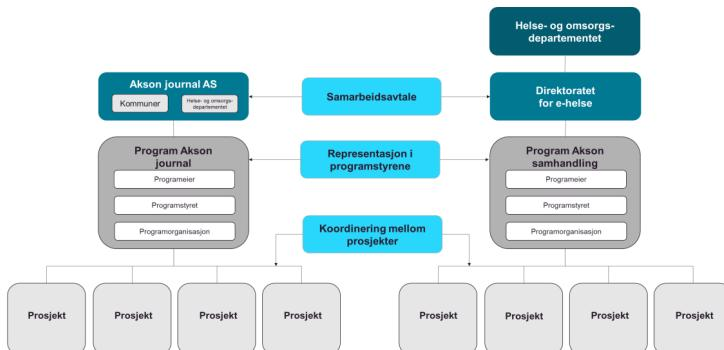
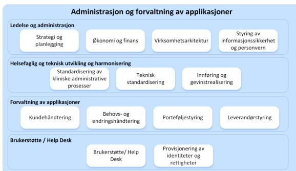
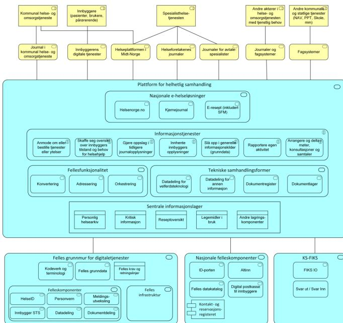

Logo of the Norwegian Health Data Authority (DHI) consisting of a grid of white dots of varying sizes on a blue background.

Direktoratet for  
e-helse

# Sentralt styringsdokument

Akson: Helhetlig samhandling og felles  
kommunal journalløsning

Vedlegg E

## Kontraktstrategi

## **Publikasjonens tittel:**

Sentralt styringsdokument

Akson: Helhetlig samhandling og felles kommunal journalløsning

Vedlegg E Kontraktstrategi

## **Rapportnummer**

IE-1056

### **Utgitt:**

Mars 2020

### **Utgitt av:**

Direktoratet for e-helse

###### **Kontakt:**

[postmottak@ehelse.no](mailto:postmottak@ehelse.no)

### **Postadresse:**

Postboks 6737 St. Olavs plass, 0130 OSLO

### **Besøksadresse:**

Verkstedveien 1, 0277 Oslo

Tlf.: 21 49 50 70

## Innhold

|                                                                                                 |           |
|-------------------------------------------------------------------------------------------------|-----------|
| <b>1 Innledning .....</b>                                                                       | <b>5</b>  |
| <b>2 Bakgrunn, mål og rammebetingelser for tiltaket .....</b>                                   | <b>7</b>  |
| 2.1 Bakgrunn.....                                                                               | 7         |
| 2.2 Generelle rammer og føringer .....                                                          | 7         |
| 2.3 Mål for tiltaket.....                                                                       | 8         |
| 2.4 Rammebetingelser for tiltaket.....                                                          | 9         |
| 2.5 Overordnet gjennomføring av tiltaket.....                                                   | 10        |
| 2.6 Virksomhetene som skal gjennomføre tiltaket .....                                           | 11        |
| 2.7 Resultatmål for Fase 1 av Programmet Akson journal.....                                     | 12        |
| 2.8 Føringer og rammebetingelser for anskaffelsesfasen for felles kommunal journalløsning ..... | 12        |
| <b>3 Kontraktstrategi for felles journalløsning.....</b>                                        | <b>16</b> |
| 3.1 Anskaffelsesområder for felles kommunal journalløsning .....                                | 16        |
| 3.1.1 Arkitekturprinsipper for felles kommunal journal .....                                    | 17        |
| 3.1.2 Journalplattform (kjernefunksjonalitet) .....                                             | 19        |
| 3.1.3 Forvaltning av identiteter og tilganger.....                                              | 24        |
| 3.1.4 Utvikling av grensesnitt og integrasjoner .....                                           | 25        |
| 3.1.5 Applikasjonsdrift og forvaltning .....                                                    | 25        |
| 3.1.6 Driftsplattform .....                                                                     | 26        |
| 3.1.7 Kompetanse og kapasitetsforsterkning i «Akson journal AS» .....                           | 26        |
| 3.1.8 Tilleggsfunksjonalitet .....                                                              | 26        |
| 3.2 Hensyn som kan tilsi ulike strategier .....                                                 | 27        |
| 3.2.1 Behovet for å sikre tilstrekkelig konkurranse (Marked og markedsusikkerhet) .....         | 28        |
| 3.2.2 Behovet for å ivareta helheten i tiltaket .....                                           | 35        |
| 3.2.3 Vurderingskriterier .....                                                                 | 38        |
| 3.3 Erfaring fra andre prosjekter.....                                                          | 39        |
| 3.4 Strategialternativer og anbefaling .....                                                    | 40        |
| 3.4.1 Alternative kontraktstrategier for felles journalløsning.....                             | 40        |
| 3.4.2 Samlet vurdering av strategialternativene.....                                            | 50        |
| 3.4.3 Konkurranseform.....                                                                      | 51        |
| 3.4.4 Kompensasjonsformat.....                                                                  | 53        |
| 3.4.5 Enkeltkontrakters kritikalitet.....                                                       | 55        |
| 3.4.6 Insentiver og sikringsmekanismer .....                                                    | 61        |
| 3.4.7 Kvalifikasjonskrav, utvelgelseskriterier og tildelingskriterier .....                     | 63        |

|          |                                                                                                                                |           |
|----------|--------------------------------------------------------------------------------------------------------------------------------|-----------|
| 3.4.8    | Rekkefølgen på anskaffelsene .....                                                                                             | 63        |
| <b>4</b> | <b>Kontraktstrategi – steg 1 i utviklingsretningen for samhandling .....</b>                                                   | <b>64</b> |
| 4.1      | Anskaffelsesområder for steg 1 .....                                                                                           | 64        |
| 4.1.1    | Overordnet gjennomføringsstrategi for helhetlig samhandling .....                                                              | 64        |
| 4.1.2    | Anskaffelsesområder for steg 1 .....                                                                                           | 69        |
| 4.2      | Hensyn som kan tilsi ulike strategier .....                                                                                    | 71        |
| 4.2.1    | Hensynet til å ivareta helheten i komponentene i steg 1 og at disse skjer i tråd med målbildet for helhetlig samhandling ..... | 72        |
| 4.2.2    | Hensynet til å sikre seg tilstrekkelig kapasitet med riktig kompetanse til å foreta utviklingen og sikre leveransene .....     | 73        |
| 4.3      | Strategialternativer og anbefaling .....                                                                                       | 74        |
| 4.3.1    | Alternative kontraktstrategier for steg 1 .....                                                                                | 74        |
| 4.3.2    | Vurdering og anbefaling .....                                                                                                  | 76        |
| 4.3.3    | Samlet vurdering av alternativene .....                                                                                        | 77        |
| 4.3.4    | Konkurranseform .....                                                                                                          | 77        |
| 4.3.5    | Kompensasjonsformat .....                                                                                                      | 78        |
| 4.3.6    | Enkeltkontrakters kritikalitet .....                                                                                           | 79        |
| 4.3.7    | Insentiver og sikringsmekanismer .....                                                                                         | 82        |
| 4.3.8    | Kvalifikasjonskrav, utvelgelseskriterier og tildelingskriterier .....                                                          | 82        |
| <b>5</b> | <b>Andre vurderinger .....</b>                                                                                                 | <b>83</b> |
| 5.1      | Utdordringer ved ubalanse i markedet .....                                                                                     | 83        |
| 5.1.1    | Hvordan endres strukturen i leverandørmarkedet .....                                                                           | 83        |
| 5.1.2    | Hvordan endres attraktiviteten til å håndtere endringer som er påkrevd i eksisterende journalløsninger .....                   | 83        |
| 5.1.3    | Hvordan endres attraktiviteten til å bidra til innovasjon og tjenesteutvikling .....                                           | 84        |
| 5.2      | Informasjonssikkerhet og personvern .....                                                                                      | 84        |
| 5.3      | Særlig om bruk av utenlandske leverandører .....                                                                               | 86        |
| 5.4      | Anbefalinger for det videre arbeidet .....                                                                                     | 87        |
| <b>6</b> | <b>Strategiutviklingsprosessen .....</b>                                                                                       | <b>89</b> |
| <b>7</b> | <b>Referanser .....</b>                                                                                                        | <b>90</b> |

# 1 Innledning

Direktoratet for e-helse fikk 26. april 2019 i oppdrag<sup>1</sup> fra Helse- og omsorgsdepartementet å gjennomføre et forprosjekt for tiltak knyttet til helhetlig samhandling og felles kommunal journal. Tiltaket tar utgangspunkt i konseptet og målbildet som ble vedtatt av regjeringen våren 2019 og som siden har fått arbeidstittelen "Akson". Omfanget av tiltaket er av Helse- og omsorgsdepartementet definert som en nasjonal løsning for helhetlig samhandling (helhetlig samhandling/samhandling) og en felles kommunal journalløsning for alle kommuner utenfor Midt-Norge (felles kommunal journalløsning).

Konseptvalgutredningen (1) som ligger til grunn for oppdraget, gav blant annet følgende føringer for forprosjektet:

En anskaffelse av konsept 7, vil ha høy gjennomføringsrisiko av flere grunner. [...] Det vil [...] være viktig å gjøre en analyse av partenes risikoeksponering og evne til å bære risiko, og å tilpasse kontraktsdokumentene i forhold til dette.

Utredningen peker videre på betydningen av god informasjonssikkerhet, bruk av dialogbaserte anskaffelser og åpne behovsbeskrivelser, samt viktigheten av at kontraktene inneholder relevante opsjoner på utvidelser for å sikre fleksibilitet og å unngå kostnader ved gjentatte anskaffelser.

Videre ble det i konseptvalgutredningen utelukket å vurdere konsepter der den kommunale journalløsningen etableres hovedsakelig gjennom nytutvikling. Grunnlaget for denne vurderingen var at det eksisterer et velfungerende leverandørmarked for journalløsninger og samhandlingsløsninger, nasjonalt og internasjonalt.

Konseptvalgutredningen ble underlagt ekstern kvalitetssikring i henhold til statens prosjektmodell for store statlige investeringer. Rapporten fra ekstern kvalitetsikrer gav følgende anbefalinger for arbeidet med kontraktstrategien:

- Bruke erfaringer fra Helseplattformen. [...]
- Vurdere å gjennomføre en markedsdialog i forbindelse med utarbeidelse av konkurransegrunnlaget, for blant annet å evaluere om kravene som stilles harmonerer med utviklingsretningen innen leverandørmarkedet.
- Vurdere på hvilken måte samhandlingsløsningen kan bygge videre på dagens nasjonale samhandlingsløsninger, og de samhandlingsløsninger som eventuelt er under utvikling eller anskaffelse. Basert på dette bør det besluttes om samhandling skal anskaffes som en egen plattform (HIE) eller om den skal komplettere eksisterende løsninger.
- Strukturere anskaffelsen slik at EPJ/PAS og samhandlingsløsningen kan anskaffes felles fra en leverandør, men uten at det ekskluderer muligheten for å anskaffe en samhandlingsløsning eller HIE separat fra en annen leverandører.
- Tilstrebe uavhengighet i teknologi og arkitektur mellom EPJ/PAS og HIE (frikobling), samt at løsningene benytter en teknologi og har en arkitektur og åpne grensesnitt som innebærer en utvikling i retning av en plattformbasert løsning (EHR 2.0).

---

<sup>1</sup> Tillegg til tildelingsbrev nr. 3 2019.

- Bygge inn realopsjoner om fleksibilitet i kontrakten (ref. Vedlegg F til KVU), med særskilt vekt på å kunne variere løsningen og avslutte tiltaket [...]
- Sikre at kontraktstrategien understøtter innovasjon i hele investeringsperioden

I arbeidet med kontraktstrategien, har prosjektet lagt til grunn de retningslinjene som følger av Finansdepartementets rundskriv R-108/19 med tilhørende veiledere. Begrepsbruk og dokumentstruktur tar utgangspunkt i Veileder nr. 7 "Kontraktstrategi". (2) Kontraktstrategien skal, i henhold til veilederen, beskrive hvordan man sikrer hensiktsmessig konkurranse i utvelgelsesfasen, hvordan man fordeler oppgaver, ansvar og usikkerhet, og hvilke kontraktuelle virkemidler som bør være etablert for å understøtte styring i gjennomføringsfasen. Også veilederen for Digitaliseringsprosjekter i statens prosjektmodell (3) er lagt til grunn for arbeidet.

Kontraktstrategien er basert dagens markedssituasjon og risikobilde, og bør tilpasses ved endrede forhold.

# 2 Bakgrunn, mål og rammebetingelser for tiltaket

## 2.1 Bakgrunn

Helse- og omsorgsdepartementet ga i 2018 Direktoratet for e-helse i oppdrag å utarbeide en konseptvalgutredning for å løse behov knyttet til klinisk dokumentasjon og pasient- og brukeradministrasjon i kommunal helse- og omsorgstjeneste, og samhandlingen med øvrig helsetjeneste. Arbeidet skulle også ta høyde for behovet for samhandling mellom helsetjenesten og andre kommunale og statlige tjenesteområder.

Konseptvalgutredningen ble overlevert Helse- og omsorgsdepartementet i juli 2018. Holte Consulting gjennomførte høsten 2018 en ekstern kvalitetssikring (KS1). KS1-rapporten anbefalte i samsvar med konseptvalgutredningen konsept 7, "Nasjonal kommunal løsning for pasientjournal med helhetlig samhandling".

Direktoratet for e-helse fikk i april 2019 i oppdrag av Helse- og omsorgsdepartementet å gjennomføre et forprosjekt med utgangspunkt i konsept 7. Konseptet har fått arbeidsnavnet Akson.

## 2.2 Generelle rammer og føringer

Gjennomføringen av tiltaket vil måtte skje i henhold til en lang rekke **lover og forskrifter**. De viktigste fremgår av Sentralt styringsdokument, Hovedrapport kapittel 1.5 Rammebetingelser. I anskaffelsesfasen vil særlig Lov om offentlige anskaffelser av 17. juni 2016 og Forskrift om offentlige anskaffelser av 12. august 2016 (anskaffelsesforskriften) være sentrale.

Det følger av anskaffelsesforskriften § 8-12 (1) at "Der det finnes fremforhandeled og balanserte **kontraktstandarder**, skal oppdragsgiveren som hovedregel bruke disse." Det foreligger ikke fremforhandeled kontraktstandarder som er relevante for de anskaffelsene som vil omfattes av tiltaket. Men Statens standardavtaler (SSA) for kjøp av IT og konsulenttjenester er mye brukt av offentlige virksomheter ved IT-relaterte anskaffelser. De er godt kjent blant leverandørene og oppfattes som forholdsvis balanserte. Bestemmelsen har i praksis blitt tolket som en "ordensregel", det vil si at det ikke foreligger et brudd på regelverket dersom det ikke benyttes fremforhandeled og balanserte kontraktstandarder.

**Krav til bruk av standarder** er regulert i forskrift om IKT-standarder i helse- og omsorgssektoren (IKT-forskriften). IKT-forskriften angir hvilke standarder det er obligatorisk å benytte, mens Referansekatalogen for e-helse angir både obligatoriske og anbefalte standarder. Realiseringen av målbilde for samhandling forutsetter at det stilles flere krav til journalløsningene hos alle aktørene i helse- og omsorgssektoren. Dette er beskrevet i Vedlegg O Funksjonelle standarder og tekniske krav til journalløsningene for aktører i helse- og omsorgssektoren. For aktører i kommunal helse- og omsorgstjeneste som tar i bruk felles kommunal journalløsning, vil kravene måtte tilfredsstilles gjennom denne løsningen. Øvrige aktører må oppfylle kravene ved å påse at deres løsninger videreutvikles slik at de oppfyller kravene.

Direktoratet for e-helse har etablert en funksjon for nasjonal arkitekturstyring. Nasjonal arkitekturstyring skal utøves med grunnlag i fastsatte arkitekturprinsipper, referansearkitekturer, standarder, målbilder, veikart og annet nasjonalt styringsgrunnlag.

Direktoratet for e-helse vil ha ansvar for å utarbeide og forvalte grunnlaget for arkitekturstyringen og å gi sektoren informasjon og veiledning i bruken av dette.

Blant generelle føringer fra Stortinget og regjeringen, har særlig **politiske mål om innovasjon og næringsutvikling** betydning for kontraktstrategien. Regjeringen la 5. april 2019 frem en stortingsmelding om helsenæringen (4), og Stortinget har senere sluttet seg til målene i meldingen. I tildelingsbrevet for Direktoratet for E-helse for 2020 er de mest relevante målene oppsummet som følger:

I tråd med Meld. St. 18 (2018-2019) Helsenæringsmeldingen skal markedet i størst mulig grad benyttes til utvikling av nye tjenester og løsninger. For å stimulere til næringsutvikling skal næringslivet involveres i planlegging og utforming av planer og veivalg for å sikre best mulig utnyttelse av næringslivets kompetanse og ressurser. [...] Det skal benyttes innovative offentlige anskaffelser der dette er relevant.

## 2.3 Mål for tiltaket

Akson skal levere helhetlig samhandling og en felles journalløsning for kommunal helse- og omsorgstjeneste. Målet er at journalløsningen skal brukes av alle kommuner, fastleger og andre avtaleparter utenfor Midt-Norge. Konseptet har høye ambisjoner for samhandlingen i helse- og omsorgstjenesten.

Konseptet innebærer at:

- Det skal stilles høye krav til funksjonalitet for helsepersonell.
- Aktører (utenfor Midt-Norge) som opererer som en del av den kommunale helse- og omsorgstjenesten (§ 3-2, § 3-3, §3-5, §3-8, §3-9 og §5-5 i Helse- og omsorgstjenesteloven), samt private fysioterapeuttjenester med driftstilskudd fra kommune og offentlig tannhelsetjeneste<sup>2</sup> får tilgang til felles kommunal journalløsning. Journalløsningen er tilgjengelig på tvers for disse tjenesteområdene og kommunene.
- Gode løsninger for identitets- og tilgangsstyring sikrer at kun helsepersonell med tjenstlig behov kan se og oppdatere en innbygers journal. Innbyggere som bor i en kommune der både kommunen, fastlegen og andre avtaleparter har valgt å ta i bruk den felles journalløsningen vil oppleve en mer koordinert helsetjeneste enn i dag.
- Den felles journalløsningen integreres med kommunenes administrative systemer for å gi enklere arbeidsprosesser.
- Målbildet for helhetlig samhandling innebærer at nasjonale e-helseløsninger og felleskomponenter utvikles til å dekke behovet for samhandling for innbyggere og pårørende, helsepersonell i kommunal helse- og omsorgstjeneste, offentlig tannhelsetjeneste og spesialisthelsetjenesten, andre aktører i helse- og omsorgstjenesten og andre statlige og kommunale tjenester.

---

<sup>2</sup> Det vil vurderes på et senere tidspunkt om offentlig tannhelsetjeneste skal benytte felles journalløsning. Lovhjemmel for overføring av offentlig tannhelsetjeneste til den kommunale helse- og omsorgstjenesten fra fylkeskommunen er vedtatt, men foreløpig ikke iverksatt. Ref. Endringslov til helselovgivningen av 16. juni 2017 nr. 55.

- En plattformbasert arkitekturtilnærming skal bidra til å unngå en framtidig situasjon hvor tjenesteutvikling i kommunene bremses som følge av for sterke bindinger og avhengighet til enkeltleverandører.
- Myndighetene stiller krav og legger føringer for hvordan de ulike journalløsningene skal snakke sammen gjennom samhandlingsplattformen. Det utformes og stilles tydelige myndighetskrav som alle journalløsninger må forholde seg til.

## 2.4 Rammebetingelser for tiltaket

Helse og omsorgsdepartementet har i oppdragsbrevet til Direktoratet for E-helse gitt følgende føringer og rammebetingelser knyttet til anskaffelsesfasen:

- Forprosjektet skal vurdere om det skal gjennomføres en markedsdialog i forbindelse med utarbeidelsen av konkurransegrunnlaget. Det skal legges til rette for samfunnsøkonomisk effektiv konkurranse og innovasjon i leverandørindustrien for e-helseløsninger. En må søke løsninger som gir lavest mulig risiko og tilstrekkelig konkurranse.
- Forprosjektet bør tydeliggjøre mulighetene for at løsningen(e) tilrettelegger for fremtidig fleksibilitet, innovasjon og tjenesteutvikling, med utgangspunkt i teknologisk innovasjon og mulighetene som oppstår i markedet. Herunder vurdere nærmere muligheten for realisering av konseptet gjennom plattformtilnærminger basert på åpne standarder.
- Erfaringer fra andre nasjonale og internasjonale digitaliseringsprosjekter (både fra helse og andre sektorer) skal benyttes der det er relevant.
- Kontraktstrategien som velges skal understøtte fleksibilitet i gjennomføringen.
- Forprosjektet skal vurdere hvordan anskaffelsen(e) kan brukes for å få demonstrert løsningen(e) for de ulike helseprofesjonene.
- Forprosjektet må ivareta at det kan etableres tilpassede arbeidsflater for de ulike helseprofesjonene slik at de får verktøy som understøtter deres arbeidshverdag på en best mulig måte. Løsningen(e) må tilrettelegge for effektiv drift, og god pasientbehandling i den enkelte virksomhet og i et forløpsperspektiv. Det er videre viktig at løsninger har fleksibilitet for tilpasning til lokale kliniske behov og andre forhold. Dette må balanseres opp mot mål om å redusere uønsket klinisk variasjon.
- Kontraktstrategien må balansere behovet for tilpasning til lokale arbeidsprosesser og mål om å redusere uønsket klinisk variasjon.
- Løsning(er) for helhetlig samhandling og felles kommunal journal skal ivareta krav til bruk av åpne standarder og definert terminologi. Terminologi skal ivareta behovene til klinisk praksis i hele helsetjenesten.
- Anskaffelsesrettelig tilrettelegge for at alle virksomheter i kommunal helse- og omsorgstjeneste utenfor Helse Midt-Norge RHF sitt opptaksområde kan ta i bruk journal- og samhandlingsløsningen og at øvrig helsetjeneste i hele landet kan ta i bruk samhandlingsløsningen.
- Vurdere strategier for dekomponering og stegvis gjennomføring for å redusere risiko, kompleksitet og kostnader.
- IKT-sikkerhet og personvern skal ha høy prioritet i arbeidet.

Sistnevnte føring er gitt som føring for hele forprosjektet.

## 2.5 Overordnet gjennomføring av tiltaket

Det er valgt to ulike tilnærminger for å realisere henholdsvis felles kommunal journalløsning og målbilde for helhetlig samhandling.

1. Realisering av felles kommunal journalløsning vil gjennomføres som ett tiltak med stegvis utvikling og innføring
2. Målbildet for helhetlig samhandling realiseres gjennom en stegvis tilnærming med flere tiltak

![Diagram illustrating the implementation of the concept through two parallel tracks: 'Felles kommunal journalløsning' and 'Utviklingsretning for helhetlig samhandling'. The 'Felles kommunal journalløsning' track is shown as a single horizontal bar divided into four phases: 'Fase 1: Mobilisering og anskaffelse', 'Fase 2: Etablering, tilpasning og utvikling', 'Fase 3: Innføring', and 'Fase 4: Forvaltning, drift, vedlikehold og utvikling'. The 'Utviklingsretning for helhetlig samhandling' track is shown as a series of five blue rectangular boxes labeled 'steg 1', 'steg 2', 'steg 3', 'steg 4', and 'steg n', arranged in a descending staircase pattern from left to right. Both tracks converge into a large dark blue circle on the right labeled 'Akson'.](images/Vedlegg E Kontraktstrategi/daa4a6fa7e2ba1954258f86b4928eb32_img.jpg)

Diagram illustrating the implementation of the concept through two parallel tracks: 'Felles kommunal journalløsning' and 'Utviklingsretning for helhetlig samhandling'. The 'Felles kommunal journalløsning' track is shown as a single horizontal bar divided into four phases: 'Fase 1: Mobilisering og anskaffelse', 'Fase 2: Etablering, tilpasning og utvikling', 'Fase 3: Innføring', and 'Fase 4: Forvaltning, drift, vedlikehold og utvikling'. The 'Utviklingsretning for helhetlig samhandling' track is shown as a series of five blue rectangular boxes labeled 'steg 1', 'steg 2', 'steg 3', 'steg 4', and 'steg n', arranged in a descending staircase pattern from left to right. Both tracks converge into a large dark blue circle on the right labeled 'Akson'.

**Figur 1 Illustrasjon av tilnærmingen for å realisere konseptet**

Som følge av den stegvise tilnærmingen for helhetlig samhandling, behandler dette dokumentet kun kontraktstrategi for steg 1 i utviklingsretningen, i tillegg til for felles kommunal journalløsning.

*Ansvaret for realiseringen av felles kommunal journalløsning og steg 1 av målbildet for samhandling vil ligge hos ulike virksomheter*

Forprosjektet legger til grunn at ansvaret for å anskaffe, etablere, drifte, forvalte og videreutvikle felles kommunal journalløsning vil legges til en virksomhet eid av kommunene, med staten som medeier. Denne virksomheten er heretter omtalt som «Akson journal AS».

Organiseringen av nasjonal e-helse er nylig endret ved at den delen av virksomheten i Direktoratet for e-helse som har utviklet og forvaltet flere nasjonale e-helseløsninger ble overført til Norsk Helsenett SF fra 1.1.2020. I henhold til den nye organiseringen, vil det ansvaret for steg 1 i målbildet for helhetlig samhandling ligge hos Direktoratet for e-helse. Norsk Helsenett SF vil ha ansvaret for å gjennomføre anskaffelsene som inngår i videreutviklingen av løsningene som benyttes for nasjonal samhandling.

*Realiseringen av felles kommunal journalløsning og steg 1 i målbilde for samhandling organiseres i to ulike programmer*

Ulike interessentbilder og finansieringsmodeller for felles kommunal journalløsning og steg 1 i målbildet for samhandling, gjør det naturlig også å dele organiseringen i ulike programmer. To programmer vil gi tydeligere styringslinjer og mer entydig ansvars plassering innad i programmene.

### *To programmer medfører behov for å sikre helhetlig styring av tiltaket*

Det er nødvendig å ivareta helheten i tiltaket fordi det eksisterer flere grensesnitt og avhengigheter mellom løsningene. Samhandlingsfunksjonalitet utviklet i steg 1 skal integreres med felles kommunal journalløsning, og Programmet Akson journal vil innføre denne samhandlingsfunksjonalitet som en integrert del av felles kommunal journalløsning.

For å sikre helhetlig styring av tiltaket vil det utformes en samarbeidsavtale mellom "Akson journal AS" og Direktoratet for e-helse. Avtalen vil beskrive grensesnittene nærmere og hvordan avhengighetene mellom programmene skal håndteres og følges opp. En viktig koordinering på programnivå vil være gjensidig representasjon i programstyrene. På prosjektnivå vil det være behov for flere former for koordinering mellom ulike prosjekter.

Helse- og omsorgsdepartementet vil i tillegg ha en viktig rolle som øverste myndighet innenfor helse- og omsorgssektoren, medeier i "Akson journal AS", eeneier i Norsk Helsenet SF og etatstyreer av Direktoratet for e-helse. Mekanismene for helhetlig styring er illustrert i Figur 2.

Programmet Akson journal og Programmet Akson samhandling har også avhengigheter til fremdrift og leveranser fra andre tiltak, særlig til Helseplattformen og spesialisthelsetjenestens modernisering av løsninger for EPJ/PAS/curve. Alle sentrale aktører foreslås derfor representert i Programstyret for Akson samhandling.

I tillegg til koordineringsmekanismene beskrevet ovenfor, legges det til grunn at både Programmet Akson journal og Programmet Akson samhandling vil melde inn sine tiltak i den nasjonale porteføljestyringsprosessen som skal koordinere, prioritere og følge opp tiltak av nasjonal betydning.



```

graph TD
    HOD[Helse- og omsorgsdepartementet] --> DEH[Direktoratet for e-helse]
    AKJ[Akson journal AS  
Kommuner | Helse- og omsorgsdepartementet] --> SA[Samarbeidsavtale]
    SA --> DEH
    AKJ --> PAJ[Program Akson journal  
Programleder  
Programstyret  
Programorganisasjon]
    PAJ --> PR1[Prosjekt]
    PAJ --> PR2[Prosjekt]
    PAJ --> PR3[Prosjekt]
    PAJ --> PR4[Prosjekt]
    DEH --> PAS[Program Akson samhandling  
Programleder  
Programstyret  
Programorganisasjon]
    PAS --> PR5[Prosjekt]
    PAS --> PR6[Prosjekt]
    PAS --> PR7[Prosjekt]
    PAS --> PR8[Prosjekt]
    PAJ <--> PRS[Representasjon i programstyrene]
    PAS <--> PRS
    PAJ <--> KMP[Koordinering mellom prosjekter]
    PAS <--> KMP
  
```

Organigram for helhetlig styring som viser relasjonene mellom Helse- og omsorgsdepartementet, Akson journal AS, Direktoratet for e-helse, og de ulike programmenne og prosjektene.

**Figur 2 Helhetlig styring**

## 2.6 Virksomhetene som skal gjennomføre tiltaket

Som beskrevet i det forrige kapitlet vil anskaffelsene som omfattes av denne kontraktstrategien foretas av tre virksomheter.

- "Akson journal AS" vil ha ansvar for å gjennomføre anskaffelsene av de komponenter og tjenester som er nødvendige for å etablere felles kommunal journalløsning. "Akson

journal AS" er per dags dato ikke en eksisterende virksomhet og har derfor ikke en etablert innkjøpsstrategi.

- Direktoratet for e-helse vil ha ansvar for å gjennomføre eventuelle anskaffelser knyttet til Forprosjekt for steg 2 i utviklingsretningen for helhetlig samhandling. Anskaffelsene vil ta utgangspunkt i direktoratets rammeavtaler for konsulenttjenester.
- Norsk Helsenet SF vil ha ansvar for å gjennomføre eventuelle anskaffelser for etablering/utvikling av komponentene som inngår i Steg 1 i utviklingsretningen for helhetlig samhandling. Anskaffelsene vil ta utgangspunkt i Norsk Helsenet SFs rammeavtaler.

## 2.7 Resultatmål for Fase 1 av Programmet Akson journal

Resultatmålene for Anskaffelsesfasen skal bidra til å realisere effektmålene for programmet og er knyttet til løsningen som prosjektet skal etablere.

Tabell 1 definerer resultatmål for Anskaffelsesfasen.

**Tabell 1 Resultatmål for anskaffelsesfasen i Programmet Akson journal**

| Resultatmål          | Beskrivelse                                                                                                                                                                                                                                                                                                                                                                                                                                                                                                                                                                                                                                                                                                                                   |
|----------------------|-----------------------------------------------------------------------------------------------------------------------------------------------------------------------------------------------------------------------------------------------------------------------------------------------------------------------------------------------------------------------------------------------------------------------------------------------------------------------------------------------------------------------------------------------------------------------------------------------------------------------------------------------------------------------------------------------------------------------------------------------|
| <b>Resultatmål 1</b> | <p>Ferdig(e) signert(e) kontrakt(er) for anskaffelse av løsninger og tjenester for etablering av felles kommunal journalløsning for kommunal helse- og omsorgstjeneste (utenfor Midt-Norge) i henhold til vedtatt kontraktstrategi.</p> <p>Inkludert i dette resultatmålet ligger det følgende delmål:</p> <ul style="list-style-type: none"> <li>• Anskaffelsesfasen er gjennomført innenfor vedtatt kostnadsramme</li> <li>• Anskaffelsesfasen er gjennomført på planlagt tid</li> <li>• Anskaffelsesfasen er gjennomført uten reelt klagegrunnlag fra leverandører</li> <li>• Den metodikk, erfaringer og kompetanse som opparbeides gjennom anskaffelsesfasen skal kunne gjenbrukes i senere anskaffelser i "Akson journal AS"</li> </ul> |
| <b>Resultatmål 2</b> | Anskaffelsen skal gjennomføres med bred involvering av ledere og medarbeidere i helsetjenesten.                                                                                                                                                                                                                                                                                                                                                                                                                                                                                                                                                                                                                                               |

## 2.8 Føring og rammebetingelser for anskaffelsesfasen for felles kommunal journalløsning

Med utgangspunkt i vedtatte effektmål, resultatmål og rammebetingelser for anskaffelsen, er det utledet følgende føring for utformingen av den merkantile delen av kontraktstrategien:

**Tabell 2 Overordnede føringer og rammebetingelser for anskaffelsesfasen for felles kommunal journalløsning**

| # | Strategisk føring                                                                                                                                                      | Forklaring/utdyping                                                                                                                                                                                                                                                                                                                                                                                                                  |
|---|------------------------------------------------------------------------------------------------------------------------------------------------------------------------|--------------------------------------------------------------------------------------------------------------------------------------------------------------------------------------------------------------------------------------------------------------------------------------------------------------------------------------------------------------------------------------------------------------------------------------|
| 1 | Anskaffelsen skal gjennomføres iht. regelverket for offentlige anskaffelser til planlagt kostnad, tid og kvalitet.                                                     | Denne føringen er en sammenfatning av sentrale resultatmål for anskaffelsen. Konkurransegrunnlaget skal legge til rette for ønsket kvalitet og gjennomføringsplan, og kontraktene skal reflektere avtalt tid, kostnad og kvalitet på leveransene.                                                                                                                                                                                    |
| 2 | Anskaffelsen skal gjennomføres med stor grad av klinikerinvolvering, og det skal i kontrakten legges til rette for at løsningen kan tilpasses kliniske behov over tid. | Det er avgjørende at brukerne av løsningen involveres gjennom hele anskaffelsen, også i de merkantile elementene. Dette er primært for å sikre riktig og brukervennlig funksjonalitet, men også for å bidra til reell forståelse hos leverandørene for hva de skal levere og forankring hos brukerne av de løsningsvalg som er foretatt, slik at forventningen til løsningen matcher det som anskaffes og implementeres.             |
| 3 | Prinsippene for sikkerhet skal ligge til grunn i anskaffelsen                                                                                                          | Informasjonssikkerhet og personvern er sentralt for etableringen av løsningen. Det er etablert overordnede sikkerhetsprinsipper som skal følges gjennom programmets og løsningens levetid. Det er avgjørende at disse sikkerhetsprinsippene (Vedlegg L – Sikkerhetsarkitektur) ligger til grunn i anskaffelsesfasen. I utarbeidelsen av konkurransekravene vil det utarbeides konkrete krav til informasjonssikkerhet og personvern. |
| 4 | Arkitekturprinsippene skal ligge til grunn for utformingen av konkurransegrunnlaget og for utvelgelsen av leverandører                                                 | Det er beskrevet høye ambisjoner mht. funksjonalitet for helsepersonell. Samtidig er det definert arkitekturprinsipper som skal ivareta åpenhet og endringsevne i løsningen, for å kunne adressere behov for innovasjon og tjenesteutvikling. Arkitekturprinsippene i Vedlegg G Løsningsomfang og -arkitektur reflekterer disse behovene. Disse skal derfor reflekteres i konkurransegrunnlag og utvelgelse av leverandører.         |
| 5 | Kjernefunksjonaliteten og plattformegenskapene i felles kommunal journalløsning skal i hovedsak baseres på helhetlige og ferdigintegrerte løsninger                    | At kjernefunksjonaliteten og plattformegenskapene leveres helhetlig, reduserer risikoen for overskridelse på tid og kostnad. Det vil også gi forutsigbarhet for robuste ytelser, videreutvikling og support innenfor en akseptabel kostnadsramme. Det antas imidlertid at det for alle tilbudte løsninger vil være nødvendig med noe utvikling for å tilfredsstille behovene knyttet til felles kommunal journalløsning.             |
| 6 | Anskaffelsene skal legge til rette for et langsiktig strategisk samarbeid mellom leverandørene og kunden.                                                              | Prosjektet skal, innenfor kravet til fremdrift, ha som mål å gjøre hver enkelt tilbyder så god som mulig i løpet av anskaffelsesfasen. Sanksjoner i kontrakten bør være på et nivå som er vanlige i markedet. Kunden bør gi leverandøren høy grad av innsikt i interne prosesser og tilgang til kunnskap gjennom involvering av relevante fagmiljøer.                                                                                |

| #  | Strategisk føring                                                                                                                                                                                                                               | Forklaring/utdyping                                                                                                                                                                                                                                                                                                                                                                                                                                                                                                                                                                                                                                                                                                                                                                                                                                                                                                                                                                                                                                                                                                                   |
|----|-------------------------------------------------------------------------------------------------------------------------------------------------------------------------------------------------------------------------------------------------|---------------------------------------------------------------------------------------------------------------------------------------------------------------------------------------------------------------------------------------------------------------------------------------------------------------------------------------------------------------------------------------------------------------------------------------------------------------------------------------------------------------------------------------------------------------------------------------------------------------------------------------------------------------------------------------------------------------------------------------------------------------------------------------------------------------------------------------------------------------------------------------------------------------------------------------------------------------------------------------------------------------------------------------------------------------------------------------------------------------------------------------|
| 7  | Kontraktene skal være fleksible nok til å legge til rette for en hensiktsmessig videreutvikling av løsningen over tid, være skalerbar i omfang og volum, samt kunne tilpasses endringer i regulatoriske krav.                                   | Utviklingen av journalløsninger vil fortsette i raskt tempo. Tilsvarende vil andre løsninger rundt journalløsningen utvikle seg. Det må i løsningsens levetid forventes endringer i måten det offentlige er organisert på og i regulatoriske krav knyttet til f.eks. pasientrettigheter og behandling av personopplysninger. Løsningene som anskaffes nå bør så langt det er mulig ta høyde for å kunne tilpasses denne utviklingen.                                                                                                                                                                                                                                                                                                                                                                                                                                                                                                                                                                                                                                                                                                  |
| 8  | Anskaffelsen skal gjennomføres slik at et representativt utvalg av kommuner deltar                                                                                                                                                              | Et representativt utvalg kommuner skal delta i spesifikasjonsarbeidet, konkurransefasen og etableringsfasen. At et bredt utvalg kommuner deltar, vil øke legitimiteten til anskaffelsesprosessen, både overfor kommunene, helsevirksomhetene og overfor tilbyderne, og også sannsynligheten for at det fremforhandles en god avtale. Det skal legges til rette for at alle kommuner, fastleger og andre relevante aktører kan ta i bruk løsningen over tid.                                                                                                                                                                                                                                                                                                                                                                                                                                                                                                                                                                                                                                                                           |
| 9  | Kontraktstrategien skal ha et tidsperspektiv der anskaffelsen anses delvis fullført ved kontrakt-signering og fullført først ved utstedelse av endelig akseptanssertifikat til leverandørene, det vil si de iste implementerte område i drift). | Det er viktig at kontraktstrategien har et tidsperspektiv som går lengre enn frem til kontraktsignering. Erfaringer viser at levert og akseptert løsning i stor grad samsvarer med det «løsningsdesign» som utvikles innledningsvis i realiseringsfasen av IT-prosjekter og som partene blir enige om før tilpasnings- og utviklingsarbeidet påbegynnes. For å ivareta nyanser som ikke er spesifisert i kontraktene, er det viktig at leverandørene forpliktes til å sikre kontinuitet på nøkkelressursene, dvs. de som styrer og leder prosjektet og som er sentrale i utarbeidelsen av detaljert løsningsdesign og i tilpasningen av løsningen. Tilsvarende må kunden sikre kontinuitet for sine nøkkelressurser, blant annet ved å sikre at interne ressurser er frikjøpt ut over perioden frem til signering, at konsulentkontrakter har tilstrekkelig lengde og volum osv. Dette tidsperspektivet vil bidra til at man under anskaffelsene og utarbeidelsen av kontraktene i større grad tenker på kontrakten som et gjennomføringsverktøy etter signering, som vil gi en mer praktisk og realistisk innretning på kontraktene. |
| 10 | Anskaffelsene skal ta høyde for tiltak knyttet til løsningsskifte hos de enheter som inngår i anskaffelsen, herunder for utfasing av eksisterende løsning og tilhørende prosessendringer                                                        | Det skal i implementeringsplanen i kontraktene legges inn tidsmessig rom for aktiviteter som er nødvendige for å innføre den nye løsningen hos deltakerne, samtidig som det gamle fases ut kontrollert. Avtaler med eksisterende leverandører må verifiseres og sikre at «exit management» kan skje ryddig og kontrollert.                                                                                                                                                                                                                                                                                                                                                                                                                                                                                                                                                                                                                                                                                                                                                                                                            |
| 11 | Det skal legges til rette for konkurranse med bred deltakelse fra leverandører på det nasjonale, nordiske og internasjonale markedet.                                                                                                           | Det eksisterer et internasjonalt marked både for journalløsninger, løsninger for identitetsstyring og andre komponenter som inngår i omfanget. Å legge til rette for konkurranse, og at alle de beste tilbyderne ønsker å delta i anskaffelsene, vil øke sannsynligheten for at den økonomisk mest fordelaktige løsningen vil bli tilbudt.                                                                                                                                                                                                                                                                                                                                                                                                                                                                                                                                                                                                                                                                                                                                                                                            |

| #  | Strategisk føring                                                                                                                                                                                                                                                         | Forklaring/utdyping                                                                                                                                                                                                                                                                                                                                                                                                                                                                                                                                                                                                                                                                                                                               |
|----|---------------------------------------------------------------------------------------------------------------------------------------------------------------------------------------------------------------------------------------------------------------------------|---------------------------------------------------------------------------------------------------------------------------------------------------------------------------------------------------------------------------------------------------------------------------------------------------------------------------------------------------------------------------------------------------------------------------------------------------------------------------------------------------------------------------------------------------------------------------------------------------------------------------------------------------------------------------------------------------------------------------------------------------|
| 12 | Anskaffelsen skal sikre "Akson journal AS" en kontroll over løsningen som begrenser avhengigheten av systemleverandørene, og som sikrer kunden fleksibilitet med hensyn til behov for endringer i løsningen og kommunikasjon med nasjonale og andre løsninger i sektoren. | De valgte løsningene skal støtte etablerte (åpne) standarder for meldingsutveksling og samhandling, og være bygd opp på en måte som gjør at den kan tilpasses nye standarder uten behov for omfattende endringer i kjerneløsningen. Både løsningen og rettighetene knyttet til komponentene i den bør være fleksible, slik at vedlikeholds- og driftsleverandør kan skiftes i løsningens levetid. Enhver digital løsning har en utløpsdato enten dette skyldes endrede behov, endrede tekniske muligheter, endrede strategier eller at eksisterende løsning og infrastruktur ikke lenger støttes. Det er viktig at kontraktene forplikter leverandørene til nødvendige bidrag når ny løsning helt (eller delvis) skal anskaffes og implementeres. |
| 13 | Anskaffelsen skal legge til rette for bruk av markedet og langsiktig leverandørutvikling                                                                                                                                                                                  | Etableringen av en felles kommunal journalløsning bør legge til rette for innovasjon og tjenesteutvikling på funksjonelle områder som ikke inngår som kjernefunksjonalitet i journalløsningen. Under anskaffelsen bør det avklares med tilbyderne hvordan valgte løsning vil understøtte utviklingen av et økosystem av innovative leverandører, for eksempel gjennom å etablere en innovasjonsarena (sandbox) og gjennom å tilby en markeds plass for videresalg av tilleggsapplikasjoner.                                                                                                                                                                                                                                                       |

# 3 Kontraktstrategi for felles journalløsning

## 3.1 Anskaffelsesområder for felles kommunal journalløsning

Kommunenes ansvar for helse- og omsorgstjenester har de siste årene økt i omfang, og forventningene til at helsetjenestene til innbyggerne er helhetlige øker. I tillegg øker innholdet av oppgaver i hver enkelt tjeneste. Det er et stort spenn på oppgavene i den kommunale helse- omsorgstjenesten, fra å yte praktisk bistand til enkelte innbyggere til å tilby plass på akutte døgneheter for å avlaste sykehusene. Det er et stort potensiale for at teknologi i større grad kan brukes for å understøtte dette spennet av tjenester, både i å dokumentere, planlegge og følge opp ytelse av helse- og omsorgshjelp, men også i form av velferdsteknologi og medisinsk-teknisk utstyr.

I behovsanalysen i konseptvalgutredningen fremkom det at dagens journalløsninger i liten grad oppfyller behovene. Det fremkom videre at å fortsette med fragmenterte anskaffelser i hver enkelt kommune for hver enkelt tjeneste, ikke raskt nok vil oppfylle kommunenes behov. Dette gjelder både for små kommuner, med begrenset kapasitet og kompetanse, og for store kommuner.

En av fordelene med å etablere en felles journalløsning, er å kunne bruke størrelsen av og vekten av en samlet kommunal helse- og omsorgstjeneste for å adressere felles behov for nåtiden og fremtiden.

Figur 3 angir overordnet de anskaffelsesområder som må vurderes med hensyn til kontraktstrategien for felles kommunal journalløsning.


The diagram illustrates the scope of procurement for a shared municipal journal solution, organized into two main categories:

**Anskaffelsesområder vurdert i alternative anskaffelsestrategier**

- 1. Journalplattform
- 2. Forvaltning av identiteter og rettigheter (IGA)
- 3. Grensesnitt og integrasjoner
- 4. Applikasjonsdrift og forvaltning  
Felles journalløsning og løsning for forvaltning av identiteter og tilganger
- 5. Driftsplattform

**Anskaffelsesområder med separate anskaffelser i alle strategialternativene**

- 6. Kompetanse- og kapasitetsforsterkning
- 7. Tilleggsfunksjonalitet

Diagram showing the scope of procurement for a shared municipal journal solution, divided into two main categories: 'Anskaffelsesområder vurdert i alternative anskaffelsestrategier' and 'Anskaffelsesområder med separate anskaffelser i alle strategialternativene'.

**Figur 3 Omfang av anskaffelsen for felles kommunal journalløsning**

Begrepet journalplattform brukes videre i dokumentet for å beskrive anskaffelsesområdet som omhandler funksjonalitet for helsepersonell og innbyggere. Begrepet felles journalløsning omhandler helheten i tiltaket, dvs. alle anskaffelsesområder.

### 3.1.1 Arkitekturprinsipper for felles kommunal journal

Det er krav om at løsningen skal gi personell i kommunale helse- og omsorgstjenester brukertilpassede og mer effektive løsninger for tildeling, administrasjon, ytelse og dokumentasjon av helsehjelp. Beskrivelsen av funksjonelt løsningsomfang beskriver det som helsepersonell mener skal være kjernefunksjonalitet i løsningen. I tillegg er det identifisert funksjonalitet som det er ønskelig at journalløsningen skal tilby.

Hovedtiltaket for å adressere denne usikkerheten er å etablere en arkitektur som gjør det mulig for «Akson journal AS» å komplementere og tilpasse funksjonaliteten slik at den passer både arbeidsoppgavene til hver helsepersonellgruppe og hver tjeneste, samtidig som nødvendig samhandling mellom de kommunale helse- og omsorgstjenestene blir ivaretatt.

Det er krav om at løsningen skal legge til rette for innovasjon og tjenesteutvikling i helse- og omsorgssektoren, samt kunne tilpasses endringer i rammebetingelser og struktur, eks. ansvarsoverføringer eller endret oppgaveløsning i helse- og omsorgstjenesten, og endret organisering i eller sammenslåing av kommuner.

Felles kommunal journalløsning vil ha lang levetid, og helse- og omsorgstjenesten vil endre seg både gjennom at nye arbeidsformer utvikles, som for eksempel digital avstandsoppfølging og teambaserte konsepter, men også gjennom at ny teknologi blir tilgjengelig. Det er derfor viktig at løsningen er tilpasningsdyktig med tanke på nye og endrede behov og muligheter.

Hovedtiltaket for å adressere denne usikkerheten er å etablere en arkitektur som er basert på en plattformtilnærming, der åpenhet og endringsevne står sentralt.

Figur 4 beskriver et logisk mål bilde for realisering av felles kommunal journalløsning.


The diagram illustrates the logical target image for the implementation of a shared municipal journal solution. It is structured as follows:

- Kommunal helse- og omsorgstjeneste** (Municipal health and care services) - This box contains several sub-components: Legevaktsentral, Legevakt, Fastlege, Hjemmetjenester, Helsestasjon/ Skolehelse-tjeneste, Sykehjem/ Annen institusjon, Helsegnis medinsk akutt beredskap, and Andre tjenester.
- Journal i kommunal helse- og omsorgstjeneste** - This box contains two sub-components: Tjeneste-/Rolle-spesifikke journaler and Felles kommunal journal.
- Ekstern tilleggs-funksjonalitet** (External additional functionality) - This box contains: Avansert beslutnings-støtte, Tjeneste-tilpasset applikasjon, and Tilrettelagt Journalbruk.
- Felles kommunal journalløsning** (Shared municipal journal solution) - This box is further detailed with:
  - Brukertilpassede arbeidsflater** (User-tailored work areas) - This box contains: Legevakts-sentral, Legevakt, Fastlege, Hjemmetjenester, Helsestasjon/ Skolehelse-tjeneste, Sykehjem, Helsegnis medinsk akutt beredskap, and Andre.
  - Intern tilleggsfunksjonalitet** (Internal additional functionality) - This box contains: Avansert beslutnings-støtte, Tjeneste-tilpasset applikasjon, and Andre komponenter.
  - Kjernefunksjonalitet** (Core functionality) - This box contains: Dokumentasjon av forløp og tilstand, Avansert planlegging, and Akuttbehandling.
  - Apne grensesnitt** (Open interfaces) and **Tjenester og integrasjon** (Services and integration).
  - Tilgangsstyring** (Access control) - This box contains: Journaldata.

Diagram illustrating the logical target image for the implementation of a shared municipal journal solution. The diagram shows a hierarchy of components: 'Kommunal helse- og omsorgstjeneste' at the top, leading to 'Journal i kommunal helse- og omsorgstjeneste', which then branches into 'Ekstern tilleggs-funksjonalitet' and 'Felles kommunal journalløsning'. The 'Felles kommunal journalløsning' box is further detailed with 'Brukertilpassede arbeidsflater' and 'Tilgangsstyring'.

Figur 4 Arkitektur for felles kommunal journalløsning

I Tabell 3 oppsummeres arkitekturprinsippene som ligger til grunn for etablering av felles kommunal journalløsning. Detaljert beskrivelse av prinsippene ligger i Vedlegg G – Løsningsomfang og -arkitektur.

Tabell 3 Arkitekturprinsipper for felles kommunal journalløsning

| Dimensjon     | Beskrivelse                                                                                                                                                                                                                                                                                                                                                                                                                                                                                                                                                                                                                                                                                                                                                                                                                                                                                                    |
|---------------|----------------------------------------------------------------------------------------------------------------------------------------------------------------------------------------------------------------------------------------------------------------------------------------------------------------------------------------------------------------------------------------------------------------------------------------------------------------------------------------------------------------------------------------------------------------------------------------------------------------------------------------------------------------------------------------------------------------------------------------------------------------------------------------------------------------------------------------------------------------------------------------------------------------|
| <b>Kjerne</b> | <p><b>Gi personell i kommunale helse- og omsorgstjenester brukertilpassede og mer effektive løsninger for tildeling, administrasjon, ytelse og dokumentasjon av helsehjelp</b></p> <p>Felles kommunal journalløsning skal fra dag én inneholde funksjonalitet i kjernen på et nivå som er høyere enn dagens og som gjør det mulig for helsepersonell i alle de helse- og omsorgstjenestene som er omfattet av tiltaket, å yte helsehjelp.</p> <p>Felles kommunal journalløsning skal i sin kjerne inneholde et datalager som understøtter informasjonsbehovet for kommunal helse- og omsorgstjeneste. Innbyggerens helseopplysninger, informasjon om virksomheten, ressurser og helsepersonell som er nødvendig for å yte helse- og omsorgshjelp, forvaltes helhetlig i kjernen. Informasjon fra grunndataløsningene i helse- og omsorgstjenesten gjenbrukes i felles journalløsning der det er nødvendig.</p> |
| <b>Kjerne</b> | <p><b>Gi innbygger mulighet til å være aktiv i prosesser og beslutninger om egen helse.</b></p> <p>Hovedstrategien er å videreføre dagens strategi med Helsenorge.no som innbyggerens vei inn til sikre digitale helsetjenester. Behov for digitale innbyggertjenester vil bli inkludert i anskaffelsen av felles kommunal journal som mulig tilleggfunksjonalitet. I hvilken grad felles journalløsning tilbyr digitale innbyggertjenester vil ikke være avgjørende for valg av leverandør(er) på felles journalløsning.</p> <p>Det forventes at felles kommunal journalløsning som en del av kjernen tilgjengeliggjør data fra kjerneløsningen gjennom APIer, for å understøtte utvikling av tilleggfunksjonalitet og integrasjon med andre løsninger (innenfor rammen av regler for taushetsplikt), herunder med helsenorge.no og kommunenes egne innbyggerportaler.</p>                                    |

| Dimensjon         | Beskrivelse                                                                                                                                                                                                                                                                                                                                                                                                                                                                                                                                                                                                                                                                                                                                                                                      |
|-------------------|--------------------------------------------------------------------------------------------------------------------------------------------------------------------------------------------------------------------------------------------------------------------------------------------------------------------------------------------------------------------------------------------------------------------------------------------------------------------------------------------------------------------------------------------------------------------------------------------------------------------------------------------------------------------------------------------------------------------------------------------------------------------------------------------------|
| <b>Kjerne</b>     | <p><b>Tilby tilgangsstyring i felles journalløsning i tråd med krav til informasjonssikkerhet og innebygd personvern.</b></p> <p>Felles kommunal journalløsning skal fra dag en inneholde funksjonalitet for ivareta identitets- og tilgangsstyring som understøtter sikkerhetsprinsippene.</p>                                                                                                                                                                                                                                                                                                                                                                                                                                                                                                  |
| <b>Utbredelse</b> | <p><b>Etabler en fleksibilitet for kommuner og virksomheter for hvilken funksjonalitet og hvilke helse- og omsorgstjenester som kan ta i bruk plattformens kjernefunksjonalitet.</b></p> <p>Gitt kjernefunksjonalitet på høyere nivå enn dagens, må det samtidig etableres en fleksibilitet for å kunne ta i bruk funksjonalitet i ulik takt og rekkefølge. Hvilken fleksibilitet plattformen vil kunne tilby vil avgjøres i anskaffelsesfasen, og leverandørenes løsningsforslag.</p>                                                                                                                                                                                                                                                                                                           |
| <b>Åpenhet</b>    | <p><b>Tilby verktøy i felles journalløsning for å kunne tilpasse arbeidsflaten til den enkelte helsepersonellgruppe og tjeneste.</b></p> <p>For å kunne realisere nytte av felles kommunal journalløsning må usikkerheten knyttet til å dekke det funksjonelle behovet for alle helsepersonellgrupper og tjenester som omfattes av tiltaket gjennom én felles journalløsning håndteres ved at løsningen har mulighet og verktøy for å kunne optimalisere arbeidsflaten.</p>                                                                                                                                                                                                                                                                                                                      |
| <b>Åpenhet</b>    | <p><b>Etabler et tydelig skille mellom data og funksjonalitet</b></p> <p>For å motvirke informasjonsblokkering er det nødvendig å utfordre leverandørmarkedet på at det etableres et tydeligere skille mellom data og applikasjoner/funksjonalitet. "Akson journal AS" må forvalte dataene og styrer bruken av disse, dvs. bestemme reglene for å gi tilgang til å lese og oppdatere dataene. I dette ligger å sikre at dataene enkelt kan hentes ut av løsningen, for eksempel for å sikre tilgjengeliggjøring av data til forskning, styring og helseovervåkning og ved fremtidig behov for overgang til en annen journalløsning.</p>                                                                                                                                                          |
| <b>Åpenhet</b>    | <p><b>Tilgjengeliggjør data fra kjerneløsningen gjennom APIer, for å understøtte utvikling av tilleggsfunksjonalitet og integrasjon med andre løsninger.</b></p> <p>For å understøtte utvikling av tilleggsfunksjonalitet og integrasjon med andre løsninger (innenfor rammen av regler for taushetsplikt), herunder med administrative løsninger i kommunene, er det nødvendig å tilgjengeliggjøre data fra kjerneløsningen gjennom åpne APIer. Grensesnittene beskrives i henhold til beskrivelsen i Direktoratet for e-helses veileder for åpne API, for å sikre tilstrekkelig åpenhet. Det skal være fokus gjennom anskaffelse og etableringen av felles kommunal journalløsning på hvilke data og funksjoner i kjernen som skal tilbys gjennom åpne grensesnitt i den videre prosessen.</p> |
| <b>Åpenhet</b>    | <p><b>Gi tilgang til tredjepartsleverandører til å tilby tilleggsfunksjonalitet for å fremme innovasjon og tjenesteutvikling.</b></p> <p>"Akson journal AS" må etablere en definert prosess og utviklingsverktøy for hvordan funksjonaliteten i og rundt den felles journalløsningen videreutvikles og tilpasses over tid. Valgt leverandør for kjernen vil ha ansvar for å videreutvikle og forbedre selve løsningen.</p>                                                                                                                                                                                                                                                                                                                                                                       |

### 3.1.2 Journalplattform (kjernefunksjonalitet)

Det funksjonelle omfanget for journalplattformen defineres av to faktorer: (1) hvilke helse- og omsorgstjenester som skal benytte felles kommunal journalløsning, herunder hvilke helsepersonellgrupper som skal bruke løsningen, og (2) hvilke oppgaver og prosesser som skal understøttes av journalløsningen.

#### 3.1.2.1 Hvilke helse- og omsorgstjenester som skal benytte journalløsningen

Figur 5 gir en oversikt over kommunale helse- og omsorgstjenester og felles funksjoner som skal støttes av felles journalløsning. Figuren er illustrerende, men er ikke fullt ut uttømmende. For å oppfylle ansvaret etter § 3-1 i helse- og omsorgstjenesteloven skal kommunen ha lege, sykepleier, fysioterapeut, jordmor, helsesykepleier, ergoterapeut og psykolog knyttet til seg. Lovkrav om at kommunene skal ha psykologkompetanse tredde i kraft fra 2020.

Offentlig tannhelsetjeneste er en fylkeskommunal helsetjeneste. Det er vedtatt lovhjemmel om overføring til den kommunale helse- og omsorgstjenesten, men det er usikkert når dette kommer til å bli iverksatt (5). Hvorvidt felles journalløsning skal støtte offentlig tannhelsetjeneste vil avgjøres senere som del av anskaffelsesprosessen.


| Kommunale helse- og omsorgstjenester |                                  |                                |                            | Felles funksjoner |                 | Kompetansekrav |  |
|--------------------------------------|----------------------------------|--------------------------------|----------------------------|-------------------|-----------------|----------------|--|
| Legevaktsentral                      | Helsestasjon/skolehelse-tjeneste | Hjemmetjenester                | Sykehjem/annen institusjon | Tildelingskontor  | Psykolog        | Sykepleier     |  |
| Legevaktsentral                      | Heldegnsmedisinsk akuttberedskap | Habilitering og rehabilitering | Fysioterapitjeneste        | Kommunelege       | Fysioterapeut   | Jordmor        |  |
| Fastlege                             | Frisklivssentral                 | Migrasjons-helse-tjeneste      | Fengsels-helse-tjeneste    |                   | Helsesykepleier | Ergoterapeut   |  |
| Offentlig tannhelsetjeneste          | Personlig assistanse             |                                |                            |                   | Tannlege        | Lege           |  |

Diagram showing the overview of municipal health and care services and common functions to be supported by the common municipal journal solution. The diagram is organized into three columns: 'Kommunale helse- og omsorgstjenester', 'Felles funksjoner', and 'Kompetansekrav'. Each column contains icons and text representing different services and roles.

**Figur 5 Oversikt over kommunale helse- og omsorgstjenester (samt offentlig tannhelsetjeneste) som skal understøttes av felles kommunal journalløsning.**

I tillegg til de ovennevnte tjenestene er det flere funksjoner en kommune må ha i tilknytning til helse- og omsorgstjenesten. Disse vil også ha behov for funksjonell støtte i felles journalløsning.

#### 3.1.2.2 Hvilke oppgaver og prosesser som skal understøttes av journalløsningen

Prosjektet har siden 2014 arbeidet med å utvikle en modell som inneholder de relevante virksomhetskapabilitetene for helse- og omsorgstjenesten (6). Kapabilitetsmodellen har blitt utviklet videre i flere omganger, senest i forprosjektet for etablering av en nasjonal løsning for helhetlig samhandling og felles kommunal journalløsning, for å kunne tilpasse innholdet til den kommunale helse- og omsorgstjenesten. I prosjektets metodikk er virksomhetskapabilitetene brukt til å organisere use-cases, og til å kontrollere at utvalget av use-cases er dekkende.

I kapabilitetsmodellen er virksomhetskapabilitetene i den kommunale helse- og omsorgstjenesten gruppert på et overordnet nivå og strukturert i fire områder: (1) Yte helse- og omsorgshjelp, (2) Gi støtte til ytelse av helse- og omsorgshjelp, (3) Administrere kommunale helse- og omsorgstjenester og (4) Planlegge, utvikle og følge opp helse- og omsorgstjenester.

**Tabell 4 Forkortelser i kapabilitetsmodellen**

| Forkortelse | Betydning                                                  |
|-------------|------------------------------------------------------------|
| <b>SH</b>   | Yte helse- og omsorgshjelp                                 |
| <b>SHS</b>  | Gi støtte til helse- og omsorgshjelp                       |
| <b>AS</b>   | Administrere kommunale helse- og omsorgstjenester          |
| <b>SR</b>   | Planlegge, utvikle og følge opp helse- og omsorgstjenester |

Figur 6 gir en oversikt over hvilke virksomhetskapabiliteter i kommunal helse- og omsorgstjeneste som forventes å understøttes av funksjonalitet i felles journalløsning, hvilke som skal understøttes med samhandling og integrasjon med nasjonale løsninger og hvilke som i liten grad forventes å understøttes av funksjonalitet eller samhandling og integrasjon.

![Diagram showing the mapping of business capabilities to functional areas and integration levels. It is divided into four main boxes: SH (Yte helse- og omsorgshjelp), AS (Administrere kommunale helse- og omsorgstjenester), SHS (Gi støtte til ytelse av helse- og omsorgshjelp), and SR (Planlegge, utvikle og følge opp helse- og omsorgstjenester). Each box contains sub-capabilities color-coded by integration level: green for central, blue for integration, light blue for partial, and red for outside scope.](images/Vedlegg E Kontraktstrategi/a3472689858b068ef469213682965325_img.jpg)

**SH. Yte helse- og omsorgshjelp**

- SH1. Planlegge og utføre helsefremmende arbeid og forebygging
- SH2. Håndtere ulykker og andre akutte hendelser
- SH3. Håndtere effektiv og sikker kommunikasjon med pasient
- SH4. Vurdere, diagnostisere, behandle, pleie og evaluere pasient

**AS. Administrere kommunale helse- og omsorgstjenester**

- AS1. Håndtere økonomi og finans
- AS2. Håndtere og lede personal
- AS3. Utvikle og forvalte informasjonsteknologi
- AS4. Sørge for anskaffelse, innkjøp og vareforsyning
- AS6. Forvalte eiendom for utførelse av helse- og omsorgstjenester

**SHS. Gi støtte til ytelse av helse- og omsorgshjelp**

- SHS1. Administrere helse- og omsorgshjelp
- SHS2. Understøtte samhandling
- SHS3. Håndtere utstyr og hjelpemidler
- SHS4. Håndtere smittevern, risikoavfall og engangsutstyr
- SHS5. Gjennomføre velferdstiltak

**SR. Planlegge, utvikle og følge opp helse- og omsorgstjenester**

- SR1. Utvikle tjenesteportefølje
- SR2. Styre helse- og omsorgstjenester
- SR3. Forbedre kvalitet og pasientsikkerhet
- SR4. Utvikle og forvalte kunnskap
- SR5. Håndtere kommunikasjon og samfunnskontakt
- SR6. Planlegge og lede helseberedskap

**Legend:**

- Sentralt at det finnes funksjonalitet i journalløsningen til å understøtte kapabiliteten
- Løses med integrasjon eller samhandling
- Løses delvis med funksjonalitet i journalløsningen, delvis med integrasjon og samhandling
- Utenfor tiltaket

Diagram showing the mapping of business capabilities to functional areas and integration levels. It is divided into four main boxes: SH (Yte helse- og omsorgshjelp), AS (Administrere kommunale helse- og omsorgstjenester), SHS (Gi støtte til ytelse av helse- og omsorgshjelp), and SR (Planlegge, utvikle og følge opp helse- og omsorgstjenester). Each box contains sub-capabilities color-coded by integration level: green for central, blue for integration, light blue for partial, and red for outside scope.

**Figur 6 Oversikt over virksomhetskapabiliteter i kommunal helse- og omsorgstjeneste**

Her følger en kort oppsummering av vurderingen.

##### • **SH. Yte helse- og omsorgshjelp.**

Dette er kjerneoppgavene til helse- og omsorgstjenesten i kommunen, og er også hovedformålet for en journalløsning. Journalplattform skal inneholde funksjonalitet for å understøtte alle kapabilitetene innen området for alle de kommunale helse- og omsorgstjenestene som står beskrevet i Vedlegg G – Løsningsomfang og -arkitektur. Unntaket er kapabiliteten *Håndtere effektiv og sikker kommunikasjon med pasient*. Her er helsenorge.no etablert som en felles digital inngang for innbyggerne (se Vedlegg G – Løsningsomfang og -arkitektur).

##### • **SHS. Gi støtte til ytelse av helse- og omsorgshjelp.**

Felles journalløsning skal inneholde funksjonalitet for å understøtte kapabilitetene *Administrere helse- og omsorgshjelp*, herunder støtte til å opprette og forvalte team, prioritere og planlegge oppgaver og aktiviteter, oppgave og ansvars- overføring, koding og avstemming, tildeling av tjenester i kommunal helse- og omsorgstjeneste, administrasjon av plasser og sengeplasser, samt administrasjon av fødsler, dødsfall og

donasjon. Felles journalløsning bør også inneholde funksjonalitet for å understøtte *Håndtere smittevern, risikoavfall og engangsutstyr* (primært å håndtere smittevern).

Kapabiliteten *Håndtere utstyr av hjelpemidler* omfatter evnen til å håndtere både utstyr som brukes i ytelse av helse- og omsorgshjelp av helsepersonell, og hjelpemidler som utleveres til og brukes av innbygger. Mange kommuner vil ha et eget utstyrssystem for hjelpemidler til personer med kortvarige medisinske behov, mens staten har ansvaret for hjelpemidler til varige medisinske behov.. Det er behov for at journalløsningen har noe funksjonalitet for å understøtte tildeling av hjelpemidler til innbygger, samt at det er tettere samhandling med NAV for å understøtte prosessen.

*Gjennomføre velferdstiltak* omfatter evnen til matforsyning, vask og renhold knyttet til ytelse av helse- og omsorgshjelp. Selve styringen av kjøkken og vask/renhold vil i mange tilfeller understøttes av administrative systemer. Det er behov for at felles journalløsning understøtter bestilling og oppfølgning av disse oppgavene, samt at disse bestillingene overføres de dedikerte kjøkken- og renholdssystemene hvis det er nødvendig.

##### - **AS. Administrere kommunale helse- og omsorgstjenester**

Felles journalløsning skal gi støtte til å trekke ut nødvendig informasjon for å håndtere betaling, økonomi og regnskap, samt for å kunne utveksle informasjon med kommunenes personal- og lønnssystem, turnussystem og ruteoptimaliseringssystem for å sikre effektiv planlegging av aktiviteter og oppgaver.

##### - **SR. Planlegge, utvikle og følge opp helse- og omsorgstjenester**

Felles journalløsning skal inneholde funksjonalitet for å kunne støtte håndtering av pasientrettede avvik. I tillegg må det være mulig å utveksle informasjon med kommunenes sentrale avvikssystem, slik at alle avvik blir fulgt opp samlet (også avvik som ikke er pasientrettede).

Felles journalløsning må også gi tilgang til uttrekk av informasjon til styring og statistikk, både det som er pålagt i rapportering til KOSTRA og Kommunal pasient- og brukerregister (KPR), men også til kommunes behov for planlegging og styring av helse- og omsorgstjenesten. Data bør også kunne avleveres til forskning.

#### **3.1.2.3 Hvilken funksjonalitet skal journalplattformen tilby**

Figur 7 gir en oversikt over de funksjonelle områdene det er vurdert som nødvendig at journalplattformen må inneholde (kjernefunksjonalitet).


Figur 7: Oversikt over funksjonelle områder som er vurdert som nødvendig at journalplattformen inneholder. Diagrammet er organisert i fem hovedkategorier: Dokumentasjon av forløp og tilstand, Pasientrettet planlegging, saksbehandling og koordinering, Administrativ støtte, and Utvikle og forvalte journalløsning. Hvert område inneholder flere spesifikke funksjonaliteter, presentert i boks- og hierarkiske diagrammer.

**Figur 7** Oversikt over funksjonelle områder som er vurdert som nødvendig at journalplattformen inneholder

Figur 8 gir en oversikt over de funksjonelle områdene som prosjektet anbefaler at bør avklares gjennom leverandørdialogen i anskaffelsesfasen (tilleggsfunksjonalitet). Dette er tilleggfunksjonalitet som er identifisert per dags dato. Helse- og omsorgstjenesten er i stor endring. I tillegg åpner ny teknologi for nye måter å levere helse- og omsorgstjenester på. Det kan derfor med sikkerhet forventes at det vil oppstå nye behov for å anskaffe eller utvikle tilleggfunksjonalitet som vi i dag ikke har identifisert.


Figur 8: Oversikt over funksjonelle områder som det anbefales avklares som en del av anskaffelsen. Diagrammet er organisert i fem hovedkategorier: Dokumentasjon av forløp og tilstand, Administrativ støtte, Støtte til analyse, Kunnskaps- og beslutningsstøtte, and Tredjeparts-applikasjoner. Hvert område inneholder flere funksjonaliteter, presentert i boks- og hierarkiske diagrammer.

**Figur 8** Oversikt over funksjonelle områder som det anbefales avklares som en del av anskaffelsen.

Her følger en kort oppsummering av de funksjonelle områdene:

##### • **Dokumentasjon av forløp og tilstand**

Dette området omfatter funksjonalitet som støtter helse- og omsorgstjenesten til å sikre at relevant informasjon om pasientens forløp og tilstand fanges, lagres og gjøres tilgjengelig ved behov. Dette er en grunnleggende funksjonalitet for at helsehjelpen skal ha den kvaliteten og sikkerheten som er nødvendig.

##### • **Pasientrettet planlegging, saksbehandling og koordinering**

Dette området omfatter funksjonalitet for å effektivt kunne planlegge og koordinere ytelse av helse- og omsorgshjelp, samt funksjonalitet for å sikre at innbyggere mottar de helse- og omsorgstjenester de har behov for. Det er derfor viktig at felles journalløsning støtter koordinering og allokering av helsepersonell og ressurser, dvs. at løsningen inneholder informasjon om hva slags ressurser som er ledig, at løsningen bidrar til at de utnyttes optimalt.

##### - **Administrativ støtte**

Dette er et område som omfatter funksjonalitet som skal understøtte de administrative oppgavene og prosessene i virksomhetene, f.eks. støtte til koding og avstemming av refusjoner og brukerbetaling. Dette er funksjonalitet som det anbefales å etterspørre som en del av felles journalløsning.

##### - **Kunnskaps- og beslutningsstøtte**

Dette området omfatter funksjonalitet som bidrar til at avgjørelser fattet av helsepersonell i forbindelse med ytelse av helse- og omsorgshjelp gjøres med grunnlag i den til enhver tid gjeldende beste medisinske praksis, kunnskap og gitte prioriteringer. Funksjonaliteten sammen med prosesstøtte kan bidra til å redusere uønsket variasjon i kommunal helse og omsorgstjeneste og gi økt kvalitet og bedre pasientsikkerhet. Standardiserte forløp gir forutsigbarhet for pasienter og høyere effektivitet.

##### - **Rapportering og kvalitetsutvikling**

Dette området omfatter funksjonalitet som understøtter muligheten til å avgi data for å støtte kommunenes egne rapporterings- og styringsbehov, samt for å kunne utlevere data til nasjonale registre. Formålsområdet omfatter funksjonalitet som understøtter helsetjenestens lovpålagte plikt til å arbeide systematisk med kvalitetsforbedring og pasientsikkerhet.

##### - **Støtte til analyse**

Dette området omfatter funksjonalitet som understøtter at analyser kan gjennomføres på populasjonsnivå for å kunne understøtte folkehelsearbeidet i kommunene. Gjennom leverandørdialogen er det avdekket at disse funksjonelle områdene løses på ulike måter og i ulik grad. Det anbefales derfor at det gjennom anskaffelsen avklares i hvilken grad denne type funksjonalitet skal inkluderes i omfanget.

##### - **Utvikle og forvalte journalplattformen**

Dette området omfatter funksjonalitet som skal understøtte en effektiv forvaltning av informasjonen i journalplattformen, f.eks. konfigurering av løsning, vedlikehold av kodeverk og terminologi, vedlikehold av strukturering av informasjon, og retter seg til systemansvarlige. Dette er funksjonalitet som det anbefales å etterspørre som en del av felles journalløsning.

##### - **Tredjepartsapplikasjoner**

Dette er applikasjoner og funksjonalitet som vil kunne utvikles eller anskaffes gjennom hele livssyklusen til felles kommunal journalløsning.

### 3.1.3 Forvaltning av identiteter og tilganger

Mange virksomheter har i dag egne løsninger for å styre tilganger på tvers av løsninger. Andre virksomheter, for eksempel mindre fastlegekontorer, gjør dette direkte i journalløsningen de benytter. Virksomhetene som er tilknyttet Helsenetet er avtalemessig forpliktet til å følge Normen (7), men legger i dag til grunn ulike fortolkninger av denne, med det resultatet at det er variasjon i hvordan tilganger styres. Ved etableringen av en felles journalløsning vil det være behov for at forvaltningen av tilganger og rettigheter harmoniseres. Det er derfor behov for å anskaffe et system med funksjonalitet for å administrere identiteter/brukere og rettigheter for alle brukere som skal bruke felles journalløsning.

![Diagram showing the architecture for identity and access management. It includes three input boxes on the left: 'Sentral koordinator for innrullering av virksomheter', 'Virksomheter uten egen løsning for identitets- og tilgangsstyring', and 'Virksomheter med egen løsning for identitets- og tilgangsstyring'. These point to a central 'Identitetsstyring' box containing modules like 'Portal for administrering', 'Identitet (sertifikat)', 'Brukerinformasjon', 'Virksomhets-informasjon', 'Autentisering', 'Provisjonering bruker->rettigheter', and 'Identitets-føderering (fra lokale IAM)'. This central box points to a 'Felles journalløsning' box on the right with modules like 'Autorisering', 'Roller og rettigheter', 'Tilgangs-føderering (til nasjonale løsninger)', and 'Policy for tilgangsstyring'. Below the central box is a 'Grunndata' box with 'Helse-personell-register', 'Person-register', and 'Virksomhets-register'. A legend indicates that green boxes are included in procurement and yellow boxes are optional.](images/Vedlegg E Kontraktstrategi/a74294f34a0c736b7ee0f5f0cdca7e28_img.jpg)

Diagram showing the architecture for identity and access management. It includes three input boxes on the left: 'Sentral koordinator for innrullering av virksomheter', 'Virksomheter uten egen løsning for identitets- og tilgangsstyring', and 'Virksomheter med egen løsning for identitets- og tilgangsstyring'. These point to a central 'Identitetsstyring' box containing modules like 'Portal for administrering', 'Identitet (sertifikat)', 'Brukerinformasjon', 'Virksomhets-informasjon', 'Autentisering', 'Provisjonering bruker->rettigheter', and 'Identitets-føderering (fra lokale IAM)'. This central box points to a 'Felles journalløsning' box on the right with modules like 'Autorisering', 'Roller og rettigheter', 'Tilgangs-føderering (til nasjonale løsninger)', and 'Policy for tilgangsstyring'. Below the central box is a 'Grunndata' box with 'Helse-personell-register', 'Person-register', and 'Virksomhets-register'. A legend indicates that green boxes are included in procurement and yellow boxes are optional.

**Figur 9 Oversikt over løsning for forvaltning av identiteter og tilganger**

Det bør anskaffes systemstøtte med funksjonalitet for å administrere identiteter/brukere og rettigheter for alle brukere som skal bruke felles kommunal journalløsning. Administrasjon av brukere vil håndteres av en egen komponent som kalles IGA (Identity Governance and Administration, eller identitetsstyringsløsning). En IGA vil ha funksjonalitet for å understøtte arbeidsflyt rundt oppretting, vedlikehold og fjerning av brukere. Den vil også kunne legge til rette for en desentralisert administrasjon av brukere.

Det vil være behov for å utvikle integrasjoner mot andre løsninger for å effektivisere arbeidsflyten og gi et godt informasjonsgrunnlag. Integrasjon mot Grunndata vil gi informasjon om personell og virksomheter som inngår i helsetjenesten, og vil understøtte behovet for å kunne regulere tilganger etter tjenstlig behov. Det vil også være essensielt å kunne integrere mot kommunenes egne IAM-systemer, HR-systemer eller brukerkataloger for å hente ut oppdatert informasjon om identitet automatisk eller semiautomatisk, med begrenset behov for manuell administrasjon.

Det vil være nødvendig å inngå avtale med en ekstern identitetstilbyder som kan levere e-IDs for autentisering på et tilstrekkelig høyt sikkerhetsnivå.

### 3.1.4 Utvikling av grensesnitt og integrasjoner

I anskaffelsen av journalplattformen og løsningen for Forvaltning av identiteter og rettigheter, bør det stilles krav om at løsningene har grensesnitt som er nødvendige for å kunne utveksle data med andre løsninger. Det forventes imidlertid at det også vil være behov for å utvikle enkelte nye grensesnitt. Det vil derfor være behov for å anskaffe tjenester og verktøy for utvikling og etablering av integrasjoner.

### 3.1.5 Applikasjonsdrift og forvaltning

Dette omfatter brukerstøtte med støtte til å håndtere tilganger, forvaltning av applikasjoner, ledelse og administrasjon. Det vil være hensiktsmessig å be om opsjoner på bistand til administrasjon og forvaltning av applikasjoner i forbindelse med systemanskaffelsene som foretas av "Akson journal AS".

### 3.1.6 Driftsplattform

Dette omfatter oppgaver og prosesser knyttet til å etablere og drifte datasentre, nettverk og servere, og eventuelt av arbeidsstasjoner som forvaltes sentralt. "Akson journal AS" må selv ta stilling til i hvilken grad dette er oppgaver det er hensiktsmessig å sette ut til eksterne leverandører, innenfor de rammer som eventuelt er gitt av eierne.

### 3.1.7 Kompetanse og kapasitetsforsterkning i «Akson journal AS»

Gjennom programmet og senere i drift- og forvaltning er det en rekke prosesser som må etableres på kundesiden for å bygge «Akson journal AS» som en robust organisasjon og for å ha evnen til å håndtere helheten i tiltaket. Figur 10 beskriver de prosessene som må etableres i «Akson journal AS». Kompetansen og kapasiteten som er nødvendig vil bygges opp gjennom programmets levetid.


Prosesser som må etableres på kundesiden

**Prosesser for å håndtere gjennomføringen**

- Ledelse og administrasjon**
  - Strategi og planlegging
  - Økonomi og finans
  - Virksomhetsarkitektur
  - Styring av informasjonssikkerhet og personvern
- Helsefaglig og teknisk utvikling og harmonisering**
  - Standardisering av kliniske administrative prosesser
  - Teknikk standardisering
  - Innføring og gevinstrealisering
- Forvaltning av applikasjoner**
  - Kundehåndtering
  - Behovs- og endringshåndtering
  - Porteføljestyring
  - Leverandørstyring
- Brukerstøtte / Help Desk**
  - Brukerstøtte/ Help Desk
  - Provisjonering av identiteter og rettigheter

Diagram showing processes for Akson journal AS, categorized into four main areas: Ledelse og administrasjon, Helsefaglig og teknisk utvikling og harmonisering, Forvaltning av applikasjoner, and Brukerstøtte / Help Desk. A vertical double-headed arrow on the left indicates these are processes to be established on the customer side.

**Figur 10 Prosesser som må etableres i «Akson journal AS» og i Programmet Akson journal**

Virksomheten som skal forestå anskaffelsene og realisere løsningen, "Akson journal AS", vil være et nyopprettet selskap. Selskapet vil i noen grad kunne få tilført ressurser og kompetanse fra aktører som har vært involvert i tidligere faser av arbeidet, men selskapets kompetanse, kapasitet og evne til å håndtere risiko og grensesnitt vil være usikker. Det vil måtte bygges opp nødvendig kapasitet som del av gjennomføringen av programmet, da særlig i sentrale styrende og strategiske roller. Men det vil være usikkerhet knyttet til i hvilken grad selskapet vil evne å rekruttere ansatte med erfaring fra sammenlignbare prosjekter.

Virksomhetens langsiktige ressursbehov vil også være mer knyttet til forvaltning og videreutvikling av løsningen enn til anskaffelse, etablering og innføring, samtidig som sistnevnte vil utgjøre de dominerende aktivitetene i de første fasene av programmet. Selskapet vil derfor ha behov for å hente kompetanse og kapasitet i leverandørmarkedet som kan støtte selskapet i kunde rollen, særlig i programmets første faser.

### 3.1.8 Tilleggsfunksjonalitet

Som det står beskrevet i kapittel 3.1.2.3, er det ønskelig å kunne anskaffe eller utvikle tilleggfunksjonalitet som enten skal inngå som en del av journalplattformen ("intern" tilleggfunksjonalitet) eller som vil være mer frikoblet fra løsningen ("ekstern" tilleggfunksjonalitet).

"Intern" tilleggsfunksjonalitet vil anskaffes ved at "Akson journal AS" inngår kontrakt med tredjepartsleverandører om å levere funksjonalitet som skal inngå som en integrert del av løsningen, og som gjøres tilgjengelig for alle brukerne. Slik tilleggsfunksjonalitet kan anskaffes i forbindelse med etableringen av løsningen og/eller på et senere tidspunkt. I tillegg vil kommuner kunne anskaffe "ekstern" tilleggsfunksjonalitet og inngå avtale med "Akson journal AS" om å få tilgang til nødvendige APIer og journaldata, innenfor rammen for de sikkerhetskrav som stilles.

Det er på nåværende tidspunkt ikke mulig å fastsette hvilken tilleggsfunksjonalitet det vil være behov for å anskaffe. Behovet vil i første omgang fremstå klarere etter at anskaffelsen av journalplattform er sluttført, og vil måtte vurderes fortløpende i FDVU-fasen.

## 3.2 Hensyn som kan tilsi ulike strategier

Det er særlig to hensyn som må adresseres gjennom kontraktstrategien.


Icon showing two hands shaking, representing competition or market security.

### Behovet for å sikre tilstrekkelig konkurranse (Marked og markedsusikkerhet)

Det er gitt føringer til forprosjektet om at det skal legges til rette for samfunnsøkonomisk effektiv konkurranse og innovasjon i leverandørindustrien for e-helseløsninger. Felles kommunal journalløsning omfatter i tillegg til selve journalplattformen, funksjonalitet for forvaltning av identiteter og rettigheter, kompetanse og kapasitet til å etablere grensesnitt og integrasjoner, applikasjonsdrift og -forvaltning, samt IT drift. I tillegg må det legges til rette for å kunne anskaffe tilleggsapplikasjoner gjennom livsløpet til programmet på områder som ikke dekkes av journalplattformen.

Beskrivelsen av funksjonelt løsningsomfang beskriver det som helsepersonell i hele den kommunale helse- og omsorgstjenesten mener skal være kjernefunksjonalitet i løsningen. Dette er omfattende og utfordrer dagens leverandørmarked.


Icon showing three overlapping circles, representing comprehensive or wholeheit.

### Behovet for å ivareta helheten i tiltaket

Det skal søkes løsninger som gir lavest mulig risiko og tilstrekkelig konkurranse. Felles kommunal journalløsning etableres gjennom et program som eies av virksomheten «Akson journal AS». Gjennomføringen av et slikt program vil være krevende for et selskap som selv er i etableringsfase, og selskapet vil måtte lene seg på leverandørene som det inngås kontrakt med.

Hovedtiltaket er å redusere antallet leverandører det inngås kontrakt med. Det foreslås å inngå kontrakt med én leverandør per område (journalplattformen, funksjonalitet for forvaltning av identiteter og rettigheter, kompetanse og kapasitet til å etablere grensesnitt og integrasjoner, applikasjonsdrift og -forvaltning, samt IT drift).

### **3.2.1 Behovet for å sikre tilstrekkelig konkurranse (Marked og markedsusikkerhet)**

En sentral usikkerhet som må ivaretas av kontraktstrategien, vil være "Akson journal AS" sitt behov for, i anskaffelsesfasen, å tiltrekke seg et tilstrekkelig antall tilbydere med nødvendig kompetanse og kapasitet til å kunne gjennomføre kontraktene. Det funksjonelle omfanget og arkitekturprinsippene for felles kommunal journalløsning vil på flere måter utfordre dagens leverandørmarked. Kontraktstrategien må derfor sette ambisjonsnivået i kontekst av leverandørmarkedene og ta høyde for markedsusikkerhet. I det følgende gis en vurdering av leverandørmarkedene.

#### **3.2.1.1 Leverandørmarkedet for plattformen rettet mot helse- og omsorgstjenester**

Journalløsninger (Electronic Health Records) har i lang tid vært den mest sentrale IT-løsningen for virksomheter som yter helse- og omsorgstjenester. Gartner introduserte i 1998 en fem-trinns Enterprise EHR generasjonsmodell for å kunne sammenligne løsninger fra ulike leverandører. På den tiden var det stor forvirring om hva en virksomhetsovergripende journalløsning skulle dekke av funksjonalitet, hva som var målet med en slik løsning, og til og med hva som skulle kalles en digital journalløsning. Leverandører og sluttbrukere brukte lignende begreper for å referere til svært ulike produkter. Den opprinnelige modellen beskrev hvordan journalløsninger ville utvikle seg fra enkle resultatrapporteringsverktøy til integrerte systemer som helsepersonell på tvers av forskjellige fagområder og tjenester ville kunne bruke til å understøtte helsehjelp til innbyggere med sammensatte behov.

Gartner reviderte generasjonsmodellen i 2016 (8), og den består nå av generasjon 1-3 og en ny klinisk plattform. Generasjon 3 omfatter journalløsninger med funksjonalitet og egenskaper som tilgjengeliggjør evidensbasert beslutningsstøtte til brukerne og støtter flere fagområder og spesialiteter, samt tilbyr funksjonalitet som muliggjør aktiv involvering av innbyggerne. En egenskap ved disse journalløsningene er at de har høyt utviklede og omfattende informasjonsmodeller, og kan håndtere både strukturerte data, semi-strukturert informasjon og tekstbasert informasjon.

Fremtidens helse- og omsorgstjenester vil stille større krav til åpenhet og samhandling på tvers av helsevirksomheter. Gartner identifiserer at mer komplekse systembehov knyttet til samarbeid, analyser og varslinger, samt persontilpasset innhold for innbyggerne, ikke kan løses basert på Generasjon 3 journalløsninger. Selv om behovene kombineres og integreres i en megasuite-løsning vil dette ikke være tilstrekkelig for å løse de mer komplekse behovene eller kunne utnytte potensialet i nye teknologier, som kunstig intelligens, avstands- og sensorteknologier og avansert beslutningsstøtte. I stedet vil det være behov for en mer robust klinisk plattform som vil være like transformativ som overgangen fra andre- til tredjegenerasjons journalløsninger.

Vurderingene fra Gartner understøttes også med trendanalyser gjennomført av andre analysebyråer. IDC definerer EHR 2.0 som en neste generasjons journalløsning basert på plattformfilosofi. IDC mener at dette vil være den eneste mulige tilnærmingen for å kunne utnytte teknologier som kunstig intelligens (AI), robotteknologi, samt data fra velferdsteknologi og andre personnære enheter. De anfører at neste generasjon EHR vil være basert på åpne grensesnitt der tredjepartsleverandører vil kunne utvikle tilleggsfunksjonalitet tilpasset ulike helsepersonellgrupper og innbyggere med ulike behov. Neste generasjons journalplattformen vil dekke ikke bare enkelte virksomheter, men et økosystem av virksomheter og helhetlige helsesystemer.

En analyse av leverandørmarkedet viser imidlertid at det per dags dato ikke finnes velutviklede plattformløsninger tilrettelagt for helse- og omsorgstjenesten. Å realisere felles journalløsning som en plattform, vil dermed måtte realiseres ved en av to mulige tilnærninger:

1. Ta utgangspunkt i en plattformteknologi, med sterke integrasjonskapabiliteter og en omfattende informasjonsmodell tilpasset behovene hos helse- og omsorgstjenestene. I denne strategien må funksjonalitet for helsepersonell og innbyggere utvikles eller settes sammen gjennom å integrere flere mindre omfattende journalløsninger.

Det finnes et fåtall leverandører som i dag kan sies å ha en plattform med en tilstrekkelig omfattende og tilpasset informasjonsmodell som kan understøtte helse- og omsorgstjenester, og som har kjernefunksjonalitet som kan understøtte et så bredt spekter av helsepersonell som de som skal benytte felles kommunal journalløsning.

2. Ta utgangspunkt i en sammenhengende journalløsning (EHR) som oppfyller generasjon 3, og som har en tydelig strategi for å utvikle plattformegenskaper. I denne strategien må det stilles krav til åpenhet og endringsevne, samt at dataene er tilgjengelige basert på en standard som er allment tilgjengelig.

De største internasjonale leverandørene har de siste årene i økende grad åpnet opp sine løsninger, for å tilby plattformegenskaper. Myndighetskrav for å redusere informasjonsblokkering er med på å fremskynde denne utviklingen. Det er imidlertid for tidlig å si hvorvidt de tradisjonelle EHR-leverandørene vil lykkes med å møte forventningene knyttet til arkitekturprinsippene om plattformegenskaper.

De store teknologileverandørene (f.eks. Google, Microsoft) tilbyr teknologier som har de grunnleggende plattformegenskapene, men de har per dags dato begrenset med funksjonalitet rettet mot helsepersonell.

#### 3.2.1.2 Leverandørmarkedet for journalløsninger

Dette avsnittet gir en oversikt over leverandørmarkedet for journalløsninger.

##### Leverandørmarkedet i Norge

EPJ-leverandørene i det norske markedet har hatt en nisjeorientert tilnærming til markedet, det vil si at de har tilbudt løsninger for utvalgte deler av helsetjenesten. Nisjeorienteringen er også et resultat av at virksomhetene historisk har anskaffet EPJ-løsninger hver for seg og for ulike tjenesteområder i kommunal helse- og omsorgstjeneste.

Ingen av dagens leverandører til det norske markedet kan alene levere en helhetlig løsning for kommunale helse- og omsorgstjenester eller på tvers av primær- og spesialisthelsetjenesten. Til sammenligning har leverandøren DIPS, som har om lag 85 prosent markedsandel i spesialisthelsetjenesten, ikke hatt en helhetlig løsning for spesialisthelsetjenesten, og kundene har derfor supplert med tilleggs løsninger, blant annet for kurve og medikasjon. Enkelte internasjonale aktører kan tilby mer helhetlige løsninger, men må gjøre tilpasninger i løsningene eller supplere disse for å ivareta den norske helsetjenestens behov.

Det forventes at Helseplattformen i Midt-Norge og gjennomføringen av det planlagte tiltaket for kommunene utenfor Midt-Norge vil endre denne situasjon. Det norske markedet vil bli mer attraktivt for internasjonale leverandører, og eksisterende leverandører til det norske markedet vil måtte repositionere seg, for eksempel ved å inngå samarbeid, fokusere på andre segmenter eller bli med på restruktureringen. Nylige endringer i DIPS' eierstruktur,

deres oppkjøp av Acos og uttrykte ambisjoner om å tre inn i markedet for kommunale helse- og omsorgstjenester, samt sammenslåingen av Hove Medical og PasientSky, kan være tidlige eksempler på denne utviklingen.

DIPS har hovedsakelig satset på spesialisthelsetjenesten og har opparbeidet seg en dominerende posisjon i spesialisthelsetjenesten. Fastlegemarkedet er dominert av tre aktører, CGM, Hove Medical og Infodoc, mens pleie- og omsorgsmarkedet domineres av Tieto, DIPS Front (tidligere Acos) og Visma.

Direktoratet for e-helse har estimert at EPJ-leverandørene i Norge omsatte for om lag 700 millioner kroner i 2016, inkludert DIPS' omsetning på 366 millioner kroner. EPJ-omsetningen innen kommunale helse- og omsorgstjenester er med andre ord om lag 350 millioner kroner, i hovedsak fordelt på de seks ovennevnte leverandørene. Dette omfatter lisenser, tjenester, support og vedlikehold. For noen leverandører (Visma, Acos og TietoEVERY) utgjør EPJ-omsetningen kun en liten del av den totale omsetningen.

I 2014 var de totale IKT-kostnadene i helsesektoren på om lag 8,4 milliarder kroner (9). Omsetningen til EPJ-leverandørene tilsvarer basert på dette ca. 8 prosent av helsesektorens IKT-kostnader. Videre representerer EPJ-leverandørene ca. 4 prosent av omsetningen for alle foretak som driver med utvikling og utgivelse av programvare, og ca. 0.3 prosent av omsetningen for alle foretak innen informasjonstjenester og kommunikasjon.

I 2014 gjennomførte det internasjonale analyseselskapet Gartner en vurdering av leverandørene av journalløsninger til det norske markedet (10). Analysen viser at leverandørmarkedet utenfor Norden har kommet relativt mye lengre enn det nasjonale/nordiske i å tilby løsninger for «integrated care», dvs. som håndterer deling av informasjon og oppfølging av felles pasientforløp mellom nivåene i helsetjenesten.

En av de største utfordringene for leverandørene til det norske markedet er begrenset tilgang til investeringsmidler og kapasitet til å drive med videreutvikling av sine løsninger. Dette medfører en utfordring og risiko knyttet til muligheten for å realisere de funksjonelle kravene fra en moderne helse- og omsorgstjeneste.

##### **Det internasjonale leverandørmarkedet**

Det globale e-helsemarkedet er forventet å vokse til over 300 milliarder dollar innen 2022 (11), om lag en tredobling fra 110 milliarder dollar i 2015. Markedet i Europa er estimert til ca. 30 prosent av det globale markedet og forventes å omsette for i underkant av 100 milliarder dollar i 2022. Markedet i Europa vokser noe raskere enn i resten av verden.

E-helsemarkedet kan deles inn i en rekke produktområder: Journalløsninger (EPJ), e-reseptløsninger, beslutningsstøttesystemer, telemedisinløsninger, innholdstjenester, velferdsteknologi og helseanalyse.

Markedet for journalløsninger har lenge vært det største segmentet, og stod i 2015 for om lag 26 prosent av omsetningen i Europa. Segmentet for journalløsninger ventes imidlertid å ha den svakeste veksten av produktområdene innen e-helse, og vil i 2022 stå for om lag 14 prosent av det totale e-helsemarkedet i Europa (11). Spesialisthelsetjenesten er den dominerende kjøperen av journalløsninger og står for ca. 69 prosent av denne omsetningen.

Fra et leverandørståsted adresserer Akson-tiltaket tilsvarende ca. en femtedel av den totale omsetningen innen e-helse i Norge. Dette er imidlertid den delen av e-helsemarkedet som viser svakest vekst frem mot 2022. Forventet vekst i e-helsemarkedet totalt vil samtidig

kunne gi store muligheter for innovasjon og næringsutvikling for eksisterende og nye leverandører.

Leverandørmarkedet for EPJ har gjennomgått store endringer de siste 5-10 årene. Utviklingen følger et kjent mønster innen IKT-markedsutvikling med konsolidering på et mindre antall leverandører. Dette gir mindre mulighet for nye aktører til å etablere seg.

Fra 1990-tallet og frem til i dag har EPJ-løsninger utviklet seg fra enkle, selvstendige verktøy for dokumentasjon og resultatrapportering, forbeholdt utvalgt helsepersonell, til helhetlige, integrerte løsninger som skal lette utøvelsen av evidensbasert medisin, redusere uønsket klinisk variasjon og forbedre samhandlingen mellom helsepersonell, pasienter og offentlig forvaltning.

Tradisjonelt har EPJ-leverandørmarkedet sprunget ut fra lokale og nasjonale markeder. Sterke nasjonale leverandører har de siste 5 til 8 årene satset på å etablere seg også utenfor sitt hjemmemarked. En rapport fra Klas Research beskriver det globale leverandørmarkedet for journalløsninger (EMR) (12). Rapporten deler opp leverandørene i:

- Regionale: Leverandører som har kunder kun i en region.
- Multiregionale (globale): Leverandører som er allment vurdert av kunder i flere regioner og som har et betydelig antall godkjente kunder i minst to regioner.

En ser i økende grad at konkurransen om EPJ-markedet i Norden står mellom et fåtall internasjonale aktører og lokale/regionale aktører som Tieto (Finland), Cambio (Sverige), Systematic (Danmark) og DIPS i Norge. Amerikanske aktører som Intersystems, EPIC, Cerner og DXC Technology etablerer seg i Europa. Intersystems vant i 2008 kontrakten om National pasientöversikt i Sverige. EPIC har gjennom 2015-2018 vunnet kontrakter i Danmark, Finland og Helseplattformen i Midt-Norge. Cerner har posisjonert seg gjennom oppkjøp av Siemens Healthcare og ved å nylig vinne kontrakter i Sverige med Region Skåne og Västra Götalandsregion.

I tillegg til de helhetlige journalløsningene, finnes det et marked for spesialiserte journalløsninger som er designet for å understøtte særlige behov, for eksempel løsninger for anestesi, akuttmedisinsk kjede, laboratorieanalyse, radiologi, medikamentell kreftbehandling, operasjonsplanlegging og særlige behov knyttet til medisinskteknisk utstyr.

Endringen i EPJ-markedet følger utviklingen innen andre teknologiområder der de funksjonelle behovene er veldefinerte på tvers av ulike geografiske markeder. Det mest åpenbare er markedet for kontorstøtte (tekstbehandling, regneark, presentasjon, etc.) der markedet er fordelt på to aktører (Google og Microsoft). I markedet for virksomhetsstyring og økonomi (ERP) står de fem største leverandørene for over 50 prosent av omsetningen. De femten største står for to tredjedeler av omsetningen. Innen lagringsmarkedet står de fem største for over femti prosent av omsetningen og innen servermarkedet står de seks største for over seksti prosent av omsetningen.

#### **3.2.1.3 Leverandørmarkedet for løsninger for identitetsstyring**

Leverandørmarkedet for identitetsstyringsløsninger er globalt. De fleste leverandørene er amerikanske med enkelte innslag av europeiske leverandører, blant annet fra England, Nederland og Danmark. Flere av disse leverandørene har etablert seg i Norge, eller leverer sine løsninger gjennom norske tredjeparter. I det norske markedet fins det flere leverandører på e-ID og sertifikater. Disse beskrives ikke nærmere i denne gjennomgangen, men består av BuyPass, Commfides og BankID.

Markedet for identitets- og tilgangsstyring var på om lag 60 milliarder kroner i 2018 og har en forventet vekst på 6,1 prosent hvert år til 2023 (13). Identitetsstyringsløsninger og avansert autentisering representerer om lag 84 prosent av dette markedet i dag, men er forventet å falle til om lag 43 prosent innen 2023, på tross av forventet vekst på henholdsvis 3,3 og 6,9 prosent. Hoveddriveren bak fallet i markedsandel er en stor forventet vekst for identitetstilbydere i B2C-markedet og privilegert tilgangsstyring (henholdsvis 22,9 og 13,2 prosent). EMEA representerer om lag 18,5 prosent av det globale markedet.

Syv aktører dekker halvparten av markedet (14): Dell Inc. (10,5 prosent), IBM (8,8 prosent), Oracle (7,7 prosent), Gemalto (7,6 prosent), Broadcom, tidligere CA Technologies (6,5 prosent), Okta (5 prosent), CyberArk Software (3,9 prosent).

Markedet for identitetsstyring er modent og i sterk vekst. Trenden på leveransemodellen er forventet å snu fra at løsninger installeres i kundens infrastruktur (on-premise) til at nye løsninger for identitets- og tilgangsstyring (IGA) primært leveres som en skytjeneste innen utgangen av 2021.

En gjennomgang av markedet i Norge viser at de fleste IGA-leverandørene har partnerskapsavtaler med systemintegratorer som har tilstedeværelse eller eierskap i Norge og Norden. Blant disse er Sopra Steria, Bouvet, Nagarro, Capgemini, Accenture, Communicate, Atea, CGI Norge, Deloitte, EY, KnowIT, IBM og Mnemonic. Flere av disse leverandørene har fagmiljøer spredt over hele landet.

Analysen viser at de fleste løsningene for IGA, til tross for å være helhetlige og omfattende på sitt område, er API-drevne og åpner for å integrere med andre løsninger. Dette kan det norske markedet kapitalisere på ved å bygge funksjonalitet som ikke dekkes av løsningene. En av trendene innenfor IGA er økt fokus på «identity analytics» som er et lite modent område med rom for innovasjon og nytenkning. Identity analytics er å analysere informasjon om brukere og deres handlingsmønstre for å forbedre regler for tilgangsstyring og for å avdekke og forhindre misbruk.

Tillit er en bærebjelke for innovasjon i helse- og omsorgstjenesten. Et system for identitetsstyring vil kunne gjenbrukes av ulike aktører som leverer tjenester rundt, og i, felles journalløsning for kommunal helse- og omsorgstjeneste. Dette vil bidra til økt sikkerhet og tillit i tjenesten. På denne måten vil en felles IGA være en pådriver for innovasjon og videreutvikling av kapabilitetene i kommunal helse- og omsorgstjeneste.

#### **3.2.1.4 Leverandørmarkedet for tjenester for grensesnitt og integrasjoner**

Leverandørmarkedet for grensesnitt og integrasjoner er modent med flere potensiell leverandører. Markedet omfatter både de store aktørene (som f.eks. Accenture, TietoEVERY, CapGemini, SopraSteria), som kan tilby ulike integrasjonsplattformer, men også av mindre aktører som er spesialiserte på enkelte integrasjonsplattformer.

#### **3.2.1.5 Leverandørmarkedet for driftstjenester**

Leverandørmarkedet for driftstjenester er modent med flere potensielle leverandører. Markedet er under endring fra modeller der kundene enten bygger egne driftssentre eller kjøper dedikerte driftstjenester, til at flere tar i bruk skytjenester. Denne endringen forventes å skje gradvis, hvilket fremgår av tall fra IDC knyttet til utviklingen av infrastruktur og drift i de nordiske markedene. (15)


| År   | Tradisjonell IT | Private skytjenester | Offentlige skytjenester | Totalt |
|------|-----------------|----------------------|-------------------------|--------|
| 2017 | 2000            | 300                  | 500                     | 2800   |
| 2018 | 2100            | 300                  | 500                     | 2900   |
| 2019 | 2200            | 300                  | 600                     | 3100   |
| 2020 | 2300            | 300                  | 700                     | 3300   |
| 2021 | 2400            | 300                  | 800                     | 3500   |
| 2022 | 2500            | 300                  | 900                     | 3700   |
| 2023 | 2600            | 300                  | 1100                    | 4000   |

Kilde: Nordic Enterprise Infrastructure Spending Forecast, 2018-2023, IDC

Stacked bar chart titled 'Markedet for infrastruktur og drift i Norden (Millioner Euro)' showing spending from 2017 to 2023. The chart is divided into three categories: Tradisjonell IT (blue), Private skytjenester (teal), and Offentlige skytjenester (grey). The total spending increases from approximately 2,800 million Euro in 2017 to over 5,000 million Euro in 2023.

**Figur 11 Markedet for infrastruktur og driftstjenester i Norden**

Noen av de største leverandørene av infrastruktur og driftstjenester til det norske markedet er Tieto Norway AS (inkludert tidligere Evry AS), IBM Norge AS, Sopra Steria AS, CapGemini AS, CGI Norge AS, Basefarm AS og DXC Technology Norge AS.

Mange av disse leverer infrastruktur- og driftstjenester basert på egne datasentre i Norge. Noen tilbyr også infrastruktur- og driftstjenester med utgangspunkt i skytjenester levert av f.eks. Amazon Web Services, Microsoft og IBM.

De ledende globale leverandørene av infrastruktur levert som en skytjeneste, er Amazon Web Services, Microsoft, Google og IBM. Microsoft og IBM har per i dag datasenter i Norge. Amazon Web Services har datasenter i Sverige, mens Google har datasenter i henholdsvis Finland og Danmark.

Infrastruktur og drift levert som skytjenester blir i økende grad brukt til å støtte organisasjoners digitalisering. Kostnader er imidlertid også en viktig driver for bruk av skytjenester. Skytjenester vil ofte medføre de laveste totale kostnadene, og selv når de ikke gjør det, gir de andre kostnadsrelaterte fordeler. Skytjenester medfører vanligvis lavere initialinvestering. Og de kan skalere i henhold til det faktiske behovet, slik at kunden ikke risikerer å bygge en infrastruktur med manglende eller ledige ressurser.

Leverandørmarkedet for driftstjenester vurderes som modent og med god kapasitet. Tiltaket ventes ikke å konkurrere om markeds kapasitet med andre tiltak.

#### 3.2.1.6 Leverandørmarkedet for tjenester for kompetanse- og kapasitetsforsterkning

Det finnes et bredt marked med leverandører av ressurser som vil kunne støtte "Akson journal AS" med kompetanse og kapasitet knyttet til utøvelsen av kunde rollen og som vil kunne understøtte selskapets styrende og strategiske funksjoner.

Leverandørmarkedet for slike tjenester vurderes som modent og med god kapasitet. Tiltaket ventes i begrenset grad å måtte konkurrere om markeds kapasitet med andre tiltak.

#### 3.2.1.7 Tilnærming for å adressere behovet for å sikre tilstrekkelig konkurranse

Et viktig hensyn som må ivaretas av de alternative kontraktstrategiene er kundens evne til å tiltrekke et tilstrekkelig antall leverandører med nødvendig kompetanse og kapasitet til å kunne gjennomføre kontraktene.

Analysen av leverandørmarkedet viser at det er et fåtall leverandører som har kapasitet til å utvikle og levere både kjernefunksjonaliteten som er nødvendig for å understøtte helsepersonells behov og til fullt ut å tilfredsstille arkitekturprinsippene om plattformegenskaper. Det vil derfor være nødvendig å treffe tiltak for å legge til rette for tilstrekkelig konkurranse i anskaffelsen. Dette kan gjøres på flere måter:

- a. **Gjennom å åpne for at flere tilbydere sammen eller hver for seg leverer felles kommunal journalløsning.** Dette kan gjøres både ved å fordele det totale behovet på flere anskaffelser og ved å åpne for at hovedleverandører kan benytte underleverandører til leveransene.
- b. **Gjennom å stille moderate krav til at behovene løses gjennom et enhetlig og helintegrert system.** Dette vil gjøre det enklere for flere tilbydere å gå sammen om å tilby det samlede omfanget av funksjonalitet som inngår i anskaffelsene, da det vil bli enklere for tilbyderne å utvikle tilstrekkelige gode integrasjoner mellom tilbydernes delløsninger.
- c. **Gjennom å stille moderate krav i anskaffelsen til at tilbyderne kan demonstrere systemer som er ferdig utviklet og i bruk hos andre kunder.** Dette innebærer at det åpnes for at tilbyderne kan tilby systemer som omfatter deler av den funksjonaliteten som etterspørres, og at disse suppleres med nyutviklet funksjonalitet.

![Diagram illustrating two strategies for software procurement. The left side shows a 'Løsningsstrategi basert på helhetlig journalløsning og lav grad av nyutvikling' with a 'Journalplattform' containing six modules (A-F). Modules A, B, C, D, and E are light blue (Hovedleverandør), while F is dark blue (Underleverandør C). The right side shows a 'Løsningsstrategi basert på flere leverandører og funksjonalitet som krever nyutvikling' with a 'Journalplattform' containing six modules (A-F). Modules A, B, and C are dark blue (Underleverandør A), while D, E, and F are teal (Nytutvikling). A red double-headed arrow connects the two strategies.](images/Vedlegg E Kontraktstrategi/a4b963a07cc368283154762c4b156fe7_img.jpg)

**Løsningsstrategi basert på helhetlig journalløsning og lav grad av nyutvikling**

**Løsningsstrategi basert på flere leverandører og funksjonalitet som krever nyutvikling**

**Journalplattform**

Funksjonalitet A, Funksjonalitet B, Funksjonalitet C, Funksjonalitet D, Funksjonalitet E, Funksjonalitet F

**Journalplattform**

Funksjonalitet A, Funksjonalitet B, Funksjonalitet C, Funksjonalitet D, Funksjonalitet E, Funksjonalitet F

Legend:

- Hovedleverandør (Light Blue)
- Underleverandør A (Dark Blue)
- Underleverandør B (Medium Blue)
- Underleverandør C (Dark Blue)
- Nytutvikling (Teal)

Diagram illustrating two strategies for software procurement. The left side shows a 'Løsningsstrategi basert på helhetlig journalløsning og lav grad av nyutvikling' with a 'Journalplattform' containing six modules (A-F). Modules A, B, C, D, and E are light blue (Hovedleverandør), while F is dark blue (Underleverandør C). The right side shows a 'Løsningsstrategi basert på flere leverandører og funksjonalitet som krever nyutvikling' with a 'Journalplattform' containing six modules (A-F). Modules A, B, and C are dark blue (Underleverandør A), while D, E, and F are teal (Nytutvikling). A red double-headed arrow connects the two strategies.

**Figur 12 Illustrasjon av ulike krav til helhet og ferdig utviklet programvare i anskaffelsens**

Det vil også være viktig, og i tråd med beste praksis for anskaffelser, å innrette konkurransegrunnlaget rundt behovsbeskrivelser, og begrense mengden obligatoriske krav til et absolutt minimum, slik at tilbydere i minst mulig grad ekskluderes på grunnlag av enkeltkrav. Kunden "Akson journal AS" vil da kunne velge det samlet sett beste tilbudet

basert på ulike løsningstilnærminger, og eventuelt supplere de initielle anskaffelsene med anskaffelser av tilleggsfunksjonalitet.

Ved å åpne opp for svært alternative løsningsforslag, der noen leverandører vil kunne tilby ferdige løsninger mens andre tilbyr løsningsforslag der deler av løsningen krever nyutvikling, vil det samtidig kunne bli utfordrende å etablere evalueringsmodeller som ivaretar styrkene og svakhetene ved de forskjellige løsningsforslagene på en god måte. Nyutvikling er normalt forbundet med relativt stor risiko, og det kan for eksempel være krevende å definere evalueringsmodeller som balanserer denne risikoen mot de ulemper som kan være knyttet til å velge en "ferdig" løsning som i mindre grad er skreddersydd til kundens behov.

### 3.2.2 Behovet for å ivareta helheten i tiltaket

#### 3.2.2.1 Kompetanse og kapasitet i Programmet Akson journal og "Akson journal AS"

Følgende figur oppsummerer hvilken kompetanse Programmet Akson journal og "Akson journal AS" må etablere for å kunne utøve nødvendig styring og kontroll, først i anskaffelsesfasen og dernest gjennom etablerings- og FDVU-fasen.



The diagram, titled "Administrasjon og forvaltning av applikasjoner", is structured into four horizontal sections, each containing specific competence areas:

- Ledelse og administrasjon**: Strategi og planlegging, Økonomi og finans, Virksomhetsarkitektur, Styring av informasjonssikkerhet og personvern.
- Helsefaglig og teknisk utvikling og harmonisering**: Standardisering av kliniske administrative prosesser, Teknisk standardisering, Innføring og gevinstrealisering.
- Forvaltning av applikasjoner**: Kundehåndtering, Behovs- og endringshåndtering, Porteføljestyring, Leverandørstyring.
- Brukerstøtte / Help Desk**: Brukerstøtte/ Help Desk, Provisjonering av identiteter og rettigheter.

Diagram showing the competence areas for the Akson journal program, organized into four horizontal layers: Ledelse og administrasjon, Helsefaglig og teknisk utvikling og harmonisering, Forvaltning av applikasjoner, and Brukerstøtte / Help Desk.

Figur 13 Kompetanse hos Programmet Akson journal og "Akson journal AS"

Programmet og "Akson journal AS" må bygge følgende kompetanseområder:

- Ledelse og administrasjon**  
 Programmet og "Akson journal AS" må ha kompetanse til å lede programmet og forvaltningen av løsningen, med tilhørende planressurser til styring av økonomi og finanser. Kompetanseområdet "Ledelse og administrasjon" omfatter også medisinsk fagansvarlig, sjefsarkitekter og kompetanse til styring av informasjonssikkerhet og personvern.
- Helsefaglig og teknisk utvikling og harmonisering**  
 Dette kompetanseområdet inkluderer kapasitet knyttet til roller som vil være nødvendige for å få kunne jobbe med standardisering av kliniske og administrative prosesser på tvers av kommuner og kommunale helse- og omsorgstjenester. Kompetansen vil være nødvendig allerede i anskaffelsesfasen, hvor den vil være sentral i utarbeidelsen av konkurransegrunnlaget og valget av leverandører. I etableringsfasen vil den samme kompetansen være sentral i å ta valg knyttet til konfigurering av valgte løsninger.

Allerede i anskaffelsesfasen vil det være nødvendig å definere de tekniske standardene som skal ligge til grunn for etableringen av grensesnitt mot andre løsninger.

I FDVU-fasen vil det være behov for klinisk applikasjonsforvaltning og -utvikling. Det må avklares hvordan ansvarsforholdet for disse prosessene skal fordeles mellom virksomhetene og "Akson journal AS".

##### • **Forvaltning av applikasjoner**

Dette kompetanseområdet omfatter kompetanse og kapasitet til å håndtere endringer gjennom hele FDVU-fasen. Området omfatter oppgaver knyttet til å følge opp hver enkelt virksomhet som bruker løsningene (kundehåndtering), innhente og vurdere endringsbehov, prioritere funksjonelle endringsbehov (porteføljestyring), samt følge opp kontrakter og styre leverandørene.

##### • **Brukerstøtte/Helpdesk**

Dette kompetanseområdet omfatter kompetanse og kapasitet til å bistå brukere som har behov for støtte etter at de har tatt i bruk løsningene.

Figur 14 viser det estimerte årlige behovet for årsverk med utgangspunkt i kostnadsestimatenes grunnkalkyle. Bemanningen henger sammen med gjennomføringsstrategien og milepælsplanen. I 2021 og 2022 forberedes og gjennomføres anskaffelse, og bemanningen skal ivareta disse aktivitetene. I 2023 – 2026 arbeides det med etablering og tilpasning av felles journalløsning, parallelt med at innføring starter opp i de første kommunene fra 2025. Bemanningen i årene 2027-2030 er årsverk i programmet som jobber med innføringsaktiviteter på sentralt hold for å understøtte innføringen av journalløsningen i resten av kommunene, i parallell med å håndtere og styre forvaltning, drift, vedlikehold og utvikling.


| År   | Antall årsverk |
|------|----------------|
| 2021 | 59             |
| 2022 | 89             |
| 2023 | 255            |
| 2024 | 262            |
| 2025 | 222            |
| 2026 | 175            |
| 2027 | 115            |
| 2028 | 138            |
| 2029 | 161            |
| 2030 | 182            |

Bar chart titled 'Oversikt over antall årsverk i "Akson journal AS"' showing estimated staffing levels from 2021 to 2030. The y-axis represents the number of full-time equivalent positions (FTEs) from 0 to 300. The x-axis lists the years from 2021 to 2030. The data points are: 2021: 59, 2022: 89, 2023: 255, 2024: 262, 2025: 222, 2026: 175, 2027: 115, 2028: 138, 2029: 161, 2030: 182.

**Figur 14 Estimert bemanning i "Akson journal AS" gjennom programperioden**

#### 3.2.2.2 Tilnærming for å adressere behovet for å ivareta helheten i tiltaket

Et viktig hensyn i vurdering av alternativene vil være evnen til å håndtere risiko knyttet til helheten i løsningene på kundesiden. Denne vurderingen må gjøres på to nivåer, dels mht. til å håndtere og styre alle anskaffelsesområdene gjennom hele Programperioden, dels mht. å sikre helheten i journalplattformen.

##### **Håndtering og styring av alle anskaffelsesområdene gjennom hele Programperioden**

Virksomheten som skal forestå anskaffelsene og realisere løsningen, "Akson journal AS", antas å være et nyopprettet selskap. Det er derfor forventet at selskapet vil ha et stort behov for å anskaffe Kompetanse- og kapasitetsforsterkning, særlig i programmets første faser.

Det vil imidlertid også ta tid å utvikle gode prosesser og rutiner som sikrer at selskapets ansatte og innleide ressurser jobber helhetlig og effektivt sammen. I tillegg vil løsningen som skal etableres ha høy kompleksitet, både funksjonelt og teknisk, og det å etablere en helhetlig og brukertilpasset løsning vil være krevende.

Til sammenligning består de aktuelle leverandørmarkedene til dels av ressurssterke leverandører med lang erfaring i å levere den funksjonaliteten som inngår i løsningsomfanget og med omfattende teknisk kompetanse knyttet til systemene som skal leveres. "Akson journal AS" vil ha stort behov for å benytte seg av denne kompetansen.

##### **Håndtering av helheten i journalplattformen**

Slik leverandøranalysen viser, er det få, om noen, av dagens leverandører på det norske markedet, som har evnen til å oppfylle helheten i behovene til kjernefunksjonalitet for alle kommunale helse- og omsorgstjenester, samtidig som de oppfyller prinsippene om plattformtilnærming. Det kunne argumenteres for at anskaffelsen av en journalplattform skulle deles opp i flere anskaffelser, for eksempel i en anskaffelse for plattform, en anskaffelse for legevakt, en anskaffelse for fastlege, en anskaffelse for sykehjem og hjemmetjenester, osv. Dette kunne bli gjennomført gjennom å tilde konsesjoner for en eller flere leverandører innenfor tydelig avgrensede funksjonelle områder.

I en slik strategi vil det være "Akson journal AS" sitt ansvar å ivareta helheten både i journalplattformen og med de andre anskaffelsesområdene. Programmet Akson journal og "Akson journal AS" ville i så fall på svært kort tid måtte opparbeide kompetanse og kapasitet på å etablere tette integrasjoner mellom programvare som denne/disse ikke ville kjenne fra tidligere. I tillegg ville programmet og "Akson journal AS" måtte etablere kontrakter og porteføljestyring som kunne understøtte at en lang rekke leverandørene ville følge en helhetlig produktplan.

Både analyse av dagens situasjon og tilbakemeldinger fra referansebesøk viser at det er særlig krevende å sikre denne helheten dersom funksjonalitet med tett indre avhengighet anskaffes gjennom flere separate anskaffelser.

Selv med god støtte til kunderollen, vil det være en særlig utfordring for programmet å etablere en felles journalplattform med en tilstrekkelig helhet og indre sammenheng til å understøtte ambisjonen for samhandling mellom brukerne av plattformen. Det er vår vurdering at en slik strategi vil påføre Programmet og "Akson journal AS" en betydelig risiko. Denne ville komme i tillegg til den risiko som allerede ligger i det å skulle etablere en felles journalløsning for alle helsevirksomhetene i kommunal helse- og omsorgstjeneste utenfor Midt-Norge.

Det vurderes som lite realistisk at Programmet Akson journal og "Akson journal AS" vil være i stand til å håndtere en slik risiko. Prosjektet har derfor ikke tatt med et slikt alternativ blant de kontraktstrategiene som er vurdert. Det vil derfor være behov for å utfordre leverandørmarkedet på å ta en stor del av dette ansvaret.

Selskapet vil som følge av dette ha behov for å stille høye krav til tilbydernes robusthet og leveranseevne. Den valgte leverandøren vil måtte ha kompetanse og kapasitet til å håndtere omfanget i tre dimensjoner:

- a. **Funksjonelt omfang.** Journalplattformen skal ha kjernefunksjonalitet for alle grupper av helsepersonell og annet personell i kommunal helse- og omsorgstjeneste knyttet til å yte, administrere og kvalitetssikre helsehjelp. Funksjonaliteten må kunne tilpasses de enkelte brukergruppene.
- b. **Tidsomfang.** Felles kommunal journalløsning vil etableres og innføres over en tidsperiode på 5 år. Dette vil stille høye krav til leverandørenes evne til å understøtte Programmet Akson journal og "Akson journal AS" med nødvendig kapasitet og kompetanse.
- c. **Innovasjonsomfang.** Levetiden på løsningen er lang, og teknologiutviklingen i helse- og omsorgstjenesten forventes å være omfattende. Dette vil stille krav til leverandørenes innovasjonsevne, både evnen til egen utvikling, evnen til å legge til rette for at tredjeparter kan tilby nye løsninger på toppen av den etablerte plattformen, og evnen til å tilpasse seg samhandlingsbehov mot andre virksomheter og løsninger.

Det er vår anbefaling at anskaffelsesområdet journalplattform anskaffes som en helhet, og at kontrakten for dette tildeles en leverandør som tar på seg helhetsansvaret.

### 3.2.3 Vurderingskriterier

Med utgangspunkt i de hensyn som ligger til grunn for å utarbeide alternative kontraktstrategier, er det benyttet følgende kriterier for vurdering av de alternative kontraktstrategiene.

**Tabell 5 Vurderingskriterier for valg av kontraktstrategi**

| Kriteria                                                                       | Beskrivelse                                                                                                                                                                                                                                                                                                                                                                    |
|--------------------------------------------------------------------------------|--------------------------------------------------------------------------------------------------------------------------------------------------------------------------------------------------------------------------------------------------------------------------------------------------------------------------------------------------------------------------------|
| <b>Styring og kontroll over Programmet Akson journal (kontraktsoppfølging)</b> | Dette kriteriet vurderer i hvilken grad kontraktstrategien bidrar til å adressere "Akson journal AS" sitt <b>behov til å ivareta helheten i tiltaket</b> . Fordelingen av anskaffelsesområdene på flere kontrakter med flere leverandører vil stille høyere krav til at "Akson journal AS" har nødvendig kompetanse og kapasitet til å håndtere helheten.                      |
| <b>Leverandørenes robusthet og leveranseevne</b>                               | Dette kriteriet vurderer i hvilken grad det må stilles krav til leverandørenes økonomiske og kapasitetsmessige robusthet og leveranseevne for å dekke "Akson journal AS" sitt <b>behov til å ivareta helheten i tiltaket</b> .                                                                                                                                                 |
| <b>Gi fleksibilitet i gjennomføringen</b>                                      | Dette kriteriet vurderer i hvilken grad kontraktstrategien gir "Akson journal AS" fleksibilitet i gjennomføringen. Spredningen av anskaffelsesområdene på flere kontrakter med flere leverandører vil gi "Akson journal AS" større fleksibilitet i hvilken rekkefølge de ulike anskaffelsesområdene anskaffes, men også potensielt høyere fleksibilitet i gjennomføringsfasen. |
| <b>Sikre tilstrekkelig konkurranse</b>                                         | Dette kriteriet vurderer i hvilken grad kontraktstrategien vil adressere <b>behovet for å sikre tilstrekkelig konkurranse</b> under anskaffelsene.                                                                                                                                                                                                                             |

Følgende vurderingsskala er brukt for vurderingen.

**Tabell 6 Vurderingsskala for valg av kontraktstrategi**

| Lav betydning | Middels betydning | Høy betydning |
|---------------|-------------------|---------------|
| +             | ++                | +++           |

## 3.3 Erfaring fra andre prosjekter

Prosjektet har innhentet erfaringer fra en rekke prosjekter, både nasjonalt og internasjonalt.

Det er innhentet erfaringer fra andre nasjonale prosjekter, både innenfor og utenfor helsesektoren. Dernest er det foretatt referansebesøk til flere sammenlignbare prosjekter i Danmark, Sverige og Finland, da særlig til prosjekter som har hatt ambisjoner om å anskaffe journalløsninger til flere grupper av brukere på tvers av flere organisasjons- og/eller forvaltningsenheter. Dette omfatter besøk til Region Hovedstaden og Region Syddanmark i Danmark, til Region Stockholm, Region Skåne og Sussa-samverkan i Sverige, og til Helsinki-regionen i Finland. I tillegg har prosjektet i tidligere faser også vært på referansebesøk i andre land, herunder England, Nederland og Spania.

Det er i særlig grad innhentet erfaringer fra anskaffelsesprosessen i Helseplattformen, et prosjekt i regi av Helse-Midt RHF i samarbeid med kommunene i Midt-Norge. Erfaringene fra dette prosjektet er særlig relevante, siden prosjektet har sammenlignbart mål og omfang og har erfaringer av nyere dato fra en norsk kulturell kontekst. Prosjektet gjennomføres i samarbeid mellom en rekke kommuner, i tillegg til Helse-Midt RHF, og har anskaffet både en felles EPJ/PAS-løsning og en IAM-løsning. Forprosjektet har blant annet fått tilgang til kontraktstrategien for Helseplattformen.

En felles erfaring fra de fleste av de større EPJ-anskaffelsene, har vært at anskaffelsesfasen har vært arbeidskrevende og intensiv. Det har vært utfordrende å skalere prosjektorganisasjonen til en størrelse som har balansert behovet for nok ressurser til de mange oppgavene som inngår med behovet for å begrense antallet involverte til et nivå som er håndterbart med tanke på å sikre sammenheng og helhet i prosjektgjennomføringen.

En gjennomgående erfaring har også vært at det er viktig å sikre bred involvering av brukere/helsepersonell og pasienter, både under utarbeidelsen av konkurransegrunnlaget og i gjennomføringen av anskaffelsene.

De fleste EPJ-prosjektene har benytte konkurranseformen "Konkurransepreget dialog" i anskaffelsen av EPJ-løsningen. Ett prosjekt benytte konkurranse med forhandlinger og ett benyttet begrenset anbudskonkurranse. Men de sistnevnte prosjektene hadde små ambisjoner om å utvikle virksomheten i forbindelse med systemskiftene, og hadde først og fremst mål om å erstatte et eksisterende EPJ-system med noe tilsvarende.

Prosjektene har ellers vurdert risikoen for søksmål i forbindelse med anskaffelsene som høy. Det har derfor blitt lagt stor vekt på å unngå feil i relasjon til anskaffelsesregelverket, på å likebehandle leverandørene, på å begrense hvor mange som har hatt tilgang på sensitiv informasjon, og på å holde oversikt over hvem som har hatt slik tilgang. Det har av noen blitt vurdert som krevende å finne en riktig balanse mellom behovet for hemmelighold og behovet for informasjonsflyt internt i prosjektet.

Prosjektene har til dels truffet forskjellige valg om hvorvidt konkurransegrunnlaget, tilbud, forhandlinger og/eller kontraktene har være på nasjonalspråket eller på engelsk. Noen har vektlagt verdien av å kunne benytte eget språk, særlig i kontraktene, mens andre har vektlagt det å legge til rette for internasjonal konkurranse.

## 3.4 Strategialternativer og anbefaling

Kontraktstrategien som velges bør både være egnet til å ivareta målene og behovene som ligger til grunn for tiltaket, og samtidig være tilpasset hva markedet kan levere. Strategien bør i denne forbindelse adressere og ta høyde for den viktigste usikkerheten, herunder både markedsusikkerhet, prosessrisiko knyttet til anskaffelsen og gjennomføringsrisiko ved gjennomføringen av kontraktene og realiseringen av de potensielle gevinstene i disse.

### 3.4.1 Alternative kontraktstrategier for felles journalløsning

Forprosjektet har lagt til grunn antall anskaffelser og grad av utvikling/integrasjoner som de viktigste parameterne for å definere overordnede alternative kontraktstrategier.


The diagram is a 2x2 matrix with the following axes:

- Y-axis (Vertical):** Sikre helhet i løsningen (Secure wholeness of the solution). The top half is labeled 'Lavere krav til ferdige løsninger' (Lower requirements for finished solutions) and the bottom half is labeled 'Høyere krav til ferdige løsninger' (Higher requirements for finished solutions).
- X-axis (Horizontal):** Sikre tilstrekkelig konkurranse (Secure sufficient competition). The left half is labeled 'Helhetlig leveranse' (Wholeness delivery) and the right half is labeled 'Flere kontrakter' (Multiple contracts).

Three strategies are shown as blue boxes:

- A. En anskaffelse for hele omfanget** (One procurement for the entire scope): Located in the bottom-left quadrant (High requirements, Wholeness delivery).
- B. Tre anskaffelser** (Three procurements): Located in the top-left quadrant (Lower requirements, Wholeness delivery).
- C. En anskaffelse for hvert kontrakts-område** (One procurement for each contract area): Located in the top-right quadrant (Lower requirements, Multiple contracts).

Diagram illustrating three alternative contract strategies for a joint journal solution based on two parameters: 'Sikre tilstrekkelig konkurranse' (Secure sufficient competition) on the x-axis and 'Sikre helhet i løsningen' (Secure wholeness of the solution) on the y-axis.

**Figur 15 Illustrasjon av ulike krav til helhet og ferdig utviklet programvare i anskaffelsens**

Basert på disse temaene har programmet definert tre mulige alternative kontraktstrategier for felles journalløsning; to alternativer med prinsipielt ulik tilnærming til de nevnte parameterne, og et alternativ som representerer en mulig mellomløsning. Strategiene er utformet for å gi forskjellige tilnærminger til å realisere felles journalløsning gjennom aktiv bruk av markedet, da på en slik måte at hvert strategialternativ har et «verdiforslag» eller en tilnærming til bruk av markedet som kan ha verdi for tiltaket. Muligheten til å redusere risiko på kundesiden, til å legge til rette for konkurranse, håndtere grensesnitt og sikre tilgang på tilstrekkelig kompetanse har vært høyt prioriterte hensyn ved utformingen av kontraktstrategiene.

For alle strategialternativene åpnes det for at flere leverandører kan gå sammen om å levere felles journalløsning, og det stilles moderate krav til at leverandørene kan demonstrere løsninger som er ferdig utviklet og i bruk hos andre kunder. I alle strategialternativene vil også anskaffelsesområdene **Kompetanse og kapasitetsforsterking** og **Ekstern tilleggsfunksjonalitet** håndteres med separate anskaffelser.

De tre strategialternativene for felles journalløsning (inkludert identitets- og tilgangsstyring) er.

#### A. En anskaffelse for hele omfanget


Diagram A illustrerer en anskaffelsesstrategi for hele omfanget. Den består av flere lag:

- Journalplattform** (lyseblå): Omfatter seks funksjonelle områder (Funksjons-område A, B, C, D, E, F). Funksjons-området C er markert som en **Underleverandør** (mørkblå).
- Forvaltning av identiteter og rettigheter (IGA)** (lyseblå): En funksjonell blokke.
- Grensesnitt og integrasjoner** (lyseblå): En funksjonell blokke.
- Applikasjonsdrift og forvaltning** (lyseblå): Omfatter "Felles journalløsning og løsning for forvaltning av identiteter og tilganger".
- Driftplattform** (grå): Den nederste lag.

Legende: ■ Leverandør A ■ Underleverandør ■ Opsjon

Diagram A: Anskaffelsesområder vurdert i alternative anskaffelsesstrategier. Viser en hierarkisk struktur med Journalplattform, funksjonelle områder (A-F), Forvaltning av identiteter og rettigheter (IGA), Grensesnitt og integrasjoner, Applikasjonsdrift og forvaltning, og Driftplattform. Legende: Leverandør A (lyseblå), Underleverandør (mørkblå), Opsjon (grå).

Dette alternativet innebærer at man legger anskaffelsesområdene journalplattform, Forvaltning av identiteter og rettigheter, Utvikling av grensesnitt og integrasjoner, Applikasjonsdrift og forvaltning ut i markedet til én leverandør, som tar ansvaret for å levere alt. Tilbyderne kan velge å gå i kompaniskap med underleverandører for å dekke nødvendig funksjonalitet, kompetanse og kapasitet, men må ta ansvaret for at felles kommunal journalløsning totalt sett oppfyller behovet og fungerer enhetlig. Det antas at hovedleverandøren vil søke å begrense antallet underleverandører, for å begrense egen risiko knyttet til leveransen.

IT Drift inngår som opsjon i anskaffelsen, for å gjøre det mulig for flere tilbydere å delta og for å gi kunden handlingsrom til å kunne velge den journalplattformen som har best funksjonalitet.

#### B. Tre anskaffelser


Diagram B illustrerer en anskaffelsesstrategi for tre separate anskaffelser. Den består av flere lag:

- Journalplattform** (lyseblå): Omfatter seks funksjonelle områder (Funksjons-område A, B, C, D, E, F). Funksjons-området C er markert som en **Underleverandør** (mørkblå).
- Forvaltning av identiteter og rettigheter (IGA)** (magenta): En funksjonell blokke.
- Grensesnitt og integrasjoner** (magenta): En funksjonell blokke.
- Applikasjonsdrift og forvaltning** (lyseblå): Omfatter "Felles journalløsning".
- Applikasjonsdrift og forvaltning** (magenta): Omfatter "Løsning for forvaltning av identiteter og tilganger".
- Driftplattform** (grå): Den nederste lag.

Legende: ■ Leverandør A ■ Underleverandør ■ Underleverandør ■ Nyutvikling ■ Leverandør B ■ Leverandør C

Diagram B: Anskaffelsesområder vurdert i alternative anskaffelsesstrategier. Viser en hierarkisk struktur med Journalplattform, funksjonelle områder (A-F), Forvaltning av identiteter og rettigheter (IGA), Grensesnitt og integrasjoner, Applikasjonsdrift og forvaltning, og Driftplattform. Legende: Leverandør A (lyseblå), Underleverandør (mørkblå), Underleverandør (lyseblå), Nyutvikling (grønn), Leverandør B (magenta), Leverandør C (grå).

Det funksjonelle behovet fordeles på tre anskaffelser: (1) Forvaltning av identiteter og rettigheter samt grensesnitt og integrasjoner, (2) journalplattform og (3) driftsplattform, inkludert drift og forvaltning av denne. Tilbydere kan vinne flere kontrakter. Tilbyderne kan velge å gå i kompaniskap med underleverandører for å dekke nødvendig funksjonalitet, kompetanse og kapasitet, men må ta ansvaret for at leveransene oppfyller behovet og fungerer enhetlig. Det antas at hovedleverandørene på de tre funksjonsområdene i noen grad vil søke å begrense antallet underleverandører, for å begrense egen risiko knyttet til leveransen.

#### C. En anskaffelse for hvert anskaffelsesområde

![Diagram showing the structure of an procurement area for a journal platform. It is divided into four main functional areas: 'Journalplattform' (top left), 'Forvaltning av identiteter og rettigheter (IGA)' (top right), 'Applikasjonsdrift og forvaltning Felles journalløsning' (bottom left), and 'Applikasjonsdrift og forvaltning Grensesnitt og integrasjoner' (bottom right). Each area is further subdivided into specific functional blocks. A legend below the diagram identifies the color-coded blocks: Leverandør A (pink), Leverandør B (light blue), Leverandør C (light green), Leverandør D (grey), Underleverandør A (dark blue), Underleverandør B (dark green), Underleverandør C (dark red), and Nyutvikling (orange).](images/Vedlegg E Kontraktstrategi/1ab49904e6a60be337d5b75cb7cc8ab7_img.jpg)

The diagram illustrates the structure of an procurement area for a journal platform, organized into four main functional areas:

- Journalplattform** (Top Left): Includes sub-blocks for 'Funksjonalitet A', 'Funksjonalitet B', 'Funksjonalitet C', 'Funksjonalitet D', and 'Funksjonalitet E'.
- Forvaltning av identiteter og rettigheter (IGA)** (Top Right): Includes a sub-block for 'Grensesnitt og integrasjoner'.
- Applikasjonsdrift og forvaltning Felles journalløsning** (Bottom Left): Includes a sub-block for 'Applikasjonsdrift og forvaltning Grensesnitt og integrasjoner'.
- Applikasjonsdrift og forvaltning Grensesnitt og integrasjoner** (Bottom Right): Includes a sub-block for 'Applikasjonsdrift og forvaltning Grensesnitt og integrasjoner'.

A legend below the diagram identifies the color-coded blocks:

- Leverandør A (pink)
- Leverandør B (light blue)
- Leverandør C (light green)
- Leverandør D (grey)
- Underleverandør A (dark blue)
- Underleverandør B (dark green)
- Underleverandør C (dark red)
- Nyutvikling (orange)

Diagram showing the structure of an procurement area for a journal platform. It is divided into four main functional areas: 'Journalplattform' (top left), 'Forvaltning av identiteter og rettigheter (IGA)' (top right), 'Applikasjonsdrift og forvaltning Felles journalløsning' (bottom left), and 'Applikasjonsdrift og forvaltning Grensesnitt og integrasjoner' (bottom right). Each area is further subdivided into specific functional blocks. A legend below the diagram identifies the color-coded blocks: Leverandør A (pink), Leverandør B (light blue), Leverandør C (light green), Leverandør D (grey), Underleverandør A (dark blue), Underleverandør B (dark green), Underleverandør C (dark red), and Nyutvikling (orange).

Det inngås kontrakt med én leverandør for hvert anskaffelsesområde, men hvor hver tilbyder kan vinne flere kontrakter. Tilbyderne kan velge å gå i kompaniskap med underleverandører for å dekke nødvendig funksjonalitet, kompetanse og kapasitet, men må ta ansvaret for at leveransene oppfylle behovet og fungerer enhetlig. Inndelingen av det funksjonelle behovet i flere avgrensede anskaffelser og mer moderate krav til helhet vil kunne gjøre det mer aktuelt for leverandører å tilby løsninger basert på delkomponenter fra underleverandører.

I de følgende kapitlene følger en mer detaljert beskrivelse av hvert alternativ, sammen med en vurdering av sentrale egenskaper ved alternativene.

#### 3.4.1.1 Alternativ A. En anskaffelse for hele omfanget

Dette alternativet innebærer at man legger alle anskaffelsesområdene (funksjonalitetsområdene) ut i markedet til én leverandør, som tar ansvaret for å levere alt. Hovedleverandøren kan gå i partnerskap med spesialistleverandører og underleverandører på utvalgte områder for å sikre nødvendig funksjonalitet, kompetanse og kapasitet. Det antas imidlertid at hovedleverandøren vil søke å begrense antallet underleverandører, for å begrense egen risiko knyttet til leveransen. Drift inngår som opsjon i anskaffelsen, for å åpne for flere tilbydere og for å gi kunden handlingsrom til å kunne velge den journal- og tilgangsstyringsløsningen som har best funksjonalitet.


**Anskaffelsesområder vurdert i alternative anskaffelsestrategier**

The diagram illustrates the structure of procurement areas. At the top, 'Journalplattform' is shown as a light blue box containing six sub-boxes: 'Funksjonalitet A', 'Funksjonalitet B', 'Funksjonalitet C', 'Funksjonalitet D', 'Funksjonalitet E', and 'Funksjonalitet F'. 'Funksjonalitet F' is highlighted in dark blue, indicating it is an 'Underleverandør'. To the right of 'Journalplattform' are two more light blue boxes: 'Forvaltning av identiteter og rettigheter (IGA)' and 'Grensesnitt og integrasjoner'. Below these is a light blue box for 'Applikasjonsdrift og forvaltning' which also includes 'Felles journalløsning og løsning for forvaltning av identiteter og tilganger'. At the bottom is a grey box for 'Driftsplattform'. A legend at the bottom defines the colors: light blue for 'Leverandør A', dark blue for 'Underleverandør', and grey for 'Opsjon'.

Diagram showing procurement areas evaluated in alternative procurement strategies. It includes a 'Journalplattform' with sub-components A-F, 'Forvaltning av identiteter og rettigheter (IGA)', 'Grensesnitt og integrasjoner', 'Applikasjonsdrift og forvaltning', and 'Driftsplattform'. A legend at the bottom identifies 'Leverandør A' (light blue), 'Underleverandør' (dark blue), and 'Opsjon' (grey).

**Figur 16 Alternativ A – En anskaffelse for hele omfanget**

Det stilles krav i anskaffelsen om at det vesentligste av funksjonaliteten i løsningene kan demonstreres som ferdig utviklet og tatt i bruk hos andre kunder, herunder eventuelle tette integrasjoner mellom delkomponenter. Leverandører som kan dokumentere vellykkede samarbeid med aktuelle underleverandører i tidligere prosjekter, krediteres for dette. Det stilles krav om at eventuell ny funksjonalitet skal utvikles som del av standardkomponentene og vedlikeholdes som del av disse, for å ivareta at leverandøren tar eierskap til den utviklede programvaren og at vedlikehold av denne inngår i den alminnelige vedlikeholdskostnaden. Etableringen av løsningen skal skje innen en tidsmessig ramme som angis i konkurransegrunnlaget. Det stilles høye krav til muligheten for innovasjon og næringsutvikling på toppen av plattformen leverandøren skal etablere.

**Tabell 7 Egenskaper for strategialternativ A**

| Kriteria                                                                       | Beskrivelse                                                                                                                                                                                                                                                                                                                                                                                                                                                                                                                                                                                                                                                                                                                                                                                                                                                                                                                                                            | Vurdering |
|--------------------------------------------------------------------------------|------------------------------------------------------------------------------------------------------------------------------------------------------------------------------------------------------------------------------------------------------------------------------------------------------------------------------------------------------------------------------------------------------------------------------------------------------------------------------------------------------------------------------------------------------------------------------------------------------------------------------------------------------------------------------------------------------------------------------------------------------------------------------------------------------------------------------------------------------------------------------------------------------------------------------------------------------------------------|-----------|
| <b>Styring og kontroll over Programmet Akson journal (kontraktoppfølgning)</b> | <p>I dette alternativet vil programmet og "Akson journal AS" forholde seg til én kontraktpart for alle anskaffelsesområdene. Dette vil redusere risikoen på kundesiden med hensyn til å håndtere integrasjoner med administrative systemer i kommunene, integrasjoner med de nasjonale samhandlingsløsningene, samt integrasjoner mellom journalløsningen og løsningen for forvaltning av identiteter og tilganger.</p> <p>Dette vil gjøre det mulig for Programmet og "Akson journal AS" å fokusere all sin kompetanse og kapasitet på å ivareta de oppgavene som er nødvendige for å sikre en god løsningsutforming, blant annet gjennom bred involvering av helsepersonell, samt å sikre en mest mulig effektiv innføring av løsningen. Det må imidlertid stilles høye krav til kontraktsutforming og utvikling av samarbeidsformer med den ene leverandøren, for å sikre nødvendig styring og kontroll av programmet, både i etableringsfasen og i FDVU-fasen.</p> | +++       |
| <b>Leverandørenes robusthet og leveranseevne</b>                               | Denne kontraktstrategien vil stille høye krav til leverandørens robusthet og leveranseevne. Leverandøren må kunne bære en stor økonomisk risiko på så vidt forskjellige anskaffelsesområder som journalløsning, drift og forvaltning, og funksjonalitet for forvaltning av identiteter og tilganger.                                                                                                                                                                                                                                                                                                                                                                                                                                                                                                                                                                                                                                                                   | +         |
| <b>Gi fleksibilitet i gjennomføringen</b>                                      | Denne kontraktstrategien gir "Akson journal AS" liten fleksibilitet.                                                                                                                                                                                                                                                                                                                                                                                                                                                                                                                                                                                                                                                                                                                                                                                                                                                                                                   | +         |
| <b>Sikre tilstrekkelig konkurranse</b>                                         | Denne kontraktstrategien vil tiltrekke noen få store leverandører. Tilnærmingen vil kunne være aktuell for de store systemintegratørenne. Deres vurdering av underleverandører og av spesialistleverandører, for eksempel leverandører av journalløsninger, vil avgjøre hvor mange leverandører som vil inngå i leveransen. Kravet til å kunne demonstrere løsninger i bruk vil kunne redusere muligheten for de mest spesialiserte systemleverandørene til å bli vurdert som interessante samarbeidspartnere.                                                                                                                                                                                                                                                                                                                                                                                                                                                         | +         |

#### 3.4.1.2 Alternativ B. Tre anskaffelser

Det funksjonelle behovet fordeles på tre anskaffelser som legges ut i markedet til tre leverandører. Leverandørene kan velge å gå i kompaniskap med underleverandører og spesialistleverandører for å dekke nødvendig funksjonalitet, kompetanse og kapasitet. Dette vil antagelig være mest aktuelt for anskaffelsen av funksjonalitet for helsepersonell. Det

antas at hovedleverandørene på de tre anskaffelsesområdene vil søke å begrense antallet underleverandører, for å begrense egen risiko knyttet til leveransen. Det er lagt til grunn at drift anskaffes separat, i form av en helhetlig plattformtjeneste (PaaS), fra en leverandør som kan levere en høy grad av informasjonssikkerhet.


**Anskaffelsesområder vurdert i alternative anskaffelsestrategier**

The diagram illustrates the evaluation of procurement areas across different strategies. It is structured as follows:

- Journalplattform** (Light blue box): Contains six sub-boxes labeled 'Funksjonalitet A' through 'Funksjonalitet F'. 'A', 'B', and 'C' are dark blue (Underleverandør), while 'D', 'E', and 'F' are teal (Nytutvikling).
- Forvaltning av identiteter og rettigheter (IGA)** (Pink box): Labeled as 'Leverandør B'.
- Grensesnitt og integrasjoner** (Pink box): Labeled as 'Leverandør B'.
- Applikasjonsdrift og forvaltning Felles journalløsning** (Light blue box): Labeled as 'Leverandør A'.
- Applikasjonsdrift og forvaltning løsning for forvaltning av identiteter og tilganger** (Pink box): Labeled as 'Leverandør B'.
- Driftsplattform** (Grey box): The base layer, labeled as 'Leverandør C'.

**Legend:**

- Light blue square: Leverandør A
- Dark blue square: Underleverandør
- Medium blue square: Underleverandør
- Teal square: Nyutvikling
- Pink square: Leverandør B
- Grey square: Leverandør C

Diagram showing procurement areas evaluated in alternative procurement strategies. It includes Journalplattform, Forvaltning av identiteter og rettigheter (IGA), Grensesnitt og integrasjoner, Applikasjonsdrift og forvaltning Felles journalløsning, and Applikasjonsdrift og forvaltning løsning for forvaltning av identiteter og tilganger, all resting on a Driftsplattform base. A legend identifies the color coding for suppliers and development.

**Figur 17 Alternativ B – Tre store leverandører**

I dette alternativet åpnes det eksplisitt for at tilbydere av journalfunksjonalitet kan tilby løsninger basert på komponenter eller på nytutvikling for å dekke behovene. Det legges mindre vekt på at tilbyderne kan dokumentere samarbeid med aktuelle underleverandører i tidligere prosjekter, for ikke å begrense den reelle muligheten til å tilby utvikling eller komponentbaserte løsninger for mye. Det stilles også lavere krav til den indre sammenhengen og helheten i journalløsningen, for at løsningen skal kunne etableres innenfor programmets tids- og kostnadsramme. Det stilles krav om at eventuell ny funksjonalitet skal utvikles som del av standardkomponentene og vedlikeholdes som del av disse. Kravet vil imidlertid antagelig ha begrenset betydningen for vedlikeholdskostnaden for systemkomponenter som er skreddersydd for det norske markedet. De tidsmessige rammene for etableringen av løsningene utvides med et år og gjøres mindre absolutte, for å gi tilstrekkelig tid til å utvikle eventuell ny funksjonalitet. Det stilles også mer moderate krav til grensesnitt som kan danne grunnlag for innovasjon og næringsutvikling på journalplattformen i de tidlige fasene av programmet, for at programmet skal kunne fokusere på å utvikle løsningsintern funksjonalitet og grensesnitt.

**Tabell 8 Egenskaper for strategialternativ B**

| Kriteria                                                                       | Beskrivelse                                                                                                                                                                                                                                                                                                                                                                                                                                                                                                                                                                                                                                                                                                                                                                                                                                                                                                                                                                                                                                                                                    | Vurdering |
|--------------------------------------------------------------------------------|------------------------------------------------------------------------------------------------------------------------------------------------------------------------------------------------------------------------------------------------------------------------------------------------------------------------------------------------------------------------------------------------------------------------------------------------------------------------------------------------------------------------------------------------------------------------------------------------------------------------------------------------------------------------------------------------------------------------------------------------------------------------------------------------------------------------------------------------------------------------------------------------------------------------------------------------------------------------------------------------------------------------------------------------------------------------------------------------|-----------|
| <b>Styring og kontroll over Programmet Akson journal (kontraktoppfølgning)</b> | <p>Dette alternativet vil stille høyere krav til programmets og "Akson journal AS" sin evne til å håndtere styring og kontroll over leveransene. Programmet og "Akson journal AS" må etablere samarbeidsformer der tre parter kan bli enige om felles planer. Samtidig vil det være begrenset med avhengigheter mellom leveransene, og det er vanlig at funksjonaliteten og tjenestene som vil ligge til de to leveransene leveres av forskjellige typer leverandører.</p> <p>Kontraktstrategien vil gi noe høyere risiko på kundesiden sammenlignet med Alternativ A, da knyttet til at kunden må ta et noe større ansvar for helheten i løsningen. Programmet og "Akson journal AS" vil ha behov for å bygge kompetanse og kapasitet for å kunne håndtere integrasjoner mellom journalløsningen og løsningen for forvaltning av identiteter og tilganger. Noe av dette ansvaret vil imidlertid også kunne plasseres hos leverandør B, som vil ha ansvaret for å håndtere integrasjoner med administrative systemer i kommunene og integrasjoner med de nasjonale samhandlingsløsningene.</p> | +(+)      |
| <b>Leverandørenes robusthet og leveranseevne</b>                               | Denne kontraktstrategien vil fortsatt omfatte to store leveranser og vil stille høye krav til leverandørenes robusthet og leveranseevne. Leverandørene må hver for seg kunne bære en stor økonomisk risiko over lang tid.                                                                                                                                                                                                                                                                                                                                                                                                                                                                                                                                                                                                                                                                                                                                                                                                                                                                      | +         |
| <b>Gi fleksibilitet i gjennomføringen</b>                                      | Denne kontraktstrategien gir en høyere fleksibilitet enn alternativ A, gjennom at anskaffelsen av journalplattformen frikobles. Fortsatt vil anskaffelsesområdene Grensesnitt og integrasjoner, samt                                                                                                                                                                                                                                                                                                                                                                                                                                                                                                                                                                                                                                                                                                                                                                                                                                                                                           | ++        |

| Kriteria                               | Beskrivelse                                                                                                                                                                                                                                                                                                                                                                                                                                                                                                                                                                                                                                                                                                                                                                | Vurdering |
|----------------------------------------|----------------------------------------------------------------------------------------------------------------------------------------------------------------------------------------------------------------------------------------------------------------------------------------------------------------------------------------------------------------------------------------------------------------------------------------------------------------------------------------------------------------------------------------------------------------------------------------------------------------------------------------------------------------------------------------------------------------------------------------------------------------------------|-----------|
| <b>Sikre tilstrekkelig konkurranse</b> | <p>Denne kontraktstrategien vil kunne adressere flere leverandørmarkeder.</p> <p>På anskaffelsesområdene som omfatter journalplattform, vil både internasjonale leverandører, nordiske leverandører og norske leverandører kunne være aktuelle. De fleste av disse vil måtte sannsynligvis inngå partnerskap med underleverandører for å kunne dekke hele omfanget for journalløsningen. Hvor mange som deltar i konkurransen, vil være avhengig av hovedleverandørenes evne å inngå denne typen partnerskap.</p> <p>Anskaffelsesområdet som omfatter forvaltning av identiteter og tilganger og drift og forvaltning av denne, vil adressere et annet leverandørmarked. Her vil leverandører som de tradisjonelle systemintegratoremne kunne være aktuelle tilbydere.</p> | +++       |

#### 3.4.1.3 Alternativ C. Fire anskaffelser - én for hvert anskaffelsesområde

Det inngås kontrakt med én leverandør for hver anskaffelsesområde/ funksjonalitetsområde, men hvor hver leverandør kan vinne flere kontrakter. Tilbydere av funksjonalitet for helsepersonell kan velge å gå i partnerskap med spesialistleverandører for å sikre tilstrekkelig funksjonalitet, kompetanse og kapasitet, men må ta ansvaret for at journalløsningen totalt sett leverer den funksjonaliteten som det er behov for. Inndelingen av det funksjonelle behovet i flere avgrensede anskaffelser og mer moderate krav til helhet vil imidlertid kunne gjøre det mer aktuelt for leverandører å tilby løsninger basert på delkomponenter fra underleverandører, se nedenfor.


**Anskaffelsesområder vurdert i alternative anskaffelsestrategier**

The diagram illustrates the procurement strategy for the Akson project, showing the evaluation of different areas. It is structured as follows:

- Journalplattform**: This area is divided into six sub-functionalities: Funksjonalitet A, B, C, D, E, and F. These are grouped into three pairs, each pair representing a different supplier (Leverandør A, B, and C respectively).
- Forvaltning av identiteter og rettigheter (IGA)**: This area is managed by Leverandør B.
- Grensesnitt og integrasjoner**: This area is managed by Leverandør C.
- Applikasjonsdrift og forvaltning Felles journalløsning**: This area is managed by Leverandør A.
- Applikasjonsdrift og forvaltning Løsning for identiteter og tilganger**: This area is managed by Leverandør B.
- Applikasjonsdrift og forvaltning Grensesnitt og integrasjoner**: This area is managed by Leverandør C.
- Driftsplattform**: This is the underlying platform, managed by Leverandør D.

**Legend:**

- Leverandør A** (Light blue square)
- Leverandør B** (Pink square)
- Leverandør C** (Light blue square)
- Leverandør D** (Grey square)
- Underleverandør A** (Dark blue square)
- Underleverandør B** (Dark blue square)
- Underleverandør C** (Blue square)
- Nyutvikling** (Teal square)

Diagram showing procurement areas evaluated in alternative procurement strategies. It includes a Journalplattform with six sub-functionalities (A-F), three main modules (Forvaltning av identiteter og rettigheter (IGA), Grensesnitt og integrasjoner, and Felles journalløsning), and a Driftsplattform. A legend identifies the suppliers for each component.

**Figur 18 Alternativ C – En anskaffelse for hvert anskaffelsesområde**

I dette alternativet åpnes det eksplisitt for at tilbydere av journalfunksjonalitet kan tilby løsninger basert på komponenter eller på nyutvikling for å dekke behovene. Det legges mindre vekt på at tilbyderne kan dokumentere samarbeid med aktuelle underleverandører i tidligere prosjekter, for ikke å begrense den reelle muligheten til å tilby utvikling eller komponentbaserte løsninger for mye. Det stilles også lavere krav til den indre sammenhengen og helheten i journalløsningen, for at løsningen skal kunne etableres innenfor programmets tids- og kostnadsramme. Det stilles krav om at eventuell ny funksjonalitet skal utvikles som del av standardkomponentene og vedlikeholdes som del av disse. Kravet vil imidlertid antagelig ha begrenset betydningen for vedlikeholdskostnaden for systemkomponenter som er skreddersydd for det norske markedet. De tidsmessige rammene for etableringen av løsningene utvides med et år og gjøres mindre absolutte, for å gi tilstrekkelig tid til å utvikle eventuell ny funksjonalitet. Det stilles også mer moderate krav til grensesnitt som kan danne grunnlag for innovasjon og næringsutvikling på journalplattformen i de tidlige fasene av programmet, for at programmet skal kunne fokusere på å utvikle løsningsintern funksjonalitet og grensesnitt.

**Tabell 9 Egenskaper for strategialternativ C**

| Kriteria                                                 | Beskrivelse                                                                                                                                                                                                                                                                                                                                                                                                                                                                                                                                                                                                                                                                                                                                                                                                                                                                                                                                                                                                                                                                                                                              | Vurdering |
|----------------------------------------------------------|------------------------------------------------------------------------------------------------------------------------------------------------------------------------------------------------------------------------------------------------------------------------------------------------------------------------------------------------------------------------------------------------------------------------------------------------------------------------------------------------------------------------------------------------------------------------------------------------------------------------------------------------------------------------------------------------------------------------------------------------------------------------------------------------------------------------------------------------------------------------------------------------------------------------------------------------------------------------------------------------------------------------------------------------------------------------------------------------------------------------------------------|-----------|
| <b>Styring og kontroll over Programmet Akson journal</b> | <p>Dette alternativet stiller høyere krav til programmets og "Akson journal AS" evne til å håndtere styring og kontroll over leveransene enn de andre alternativene. Programmet og "Akson journal AS" må etablere samarbeidsformer der fem parter kan bli enige om felles planer. Samtidig vil det være begrenset med avhengigheter mellom leveransene, og det er ikke uvanlig at funksjonaliteten og tjenestene som vil ligge til de forskjellige leveransene leveres av forskjellige typer leverandører.</p> <p>Denne kontraktstrategien vil gi noe høyere risiko på kundesiden sammenlignet med Alternativ A, da knyttet til at kunden må ta et noe større ansvar for helheten i løsningen. Programmet og "Akson journal AS" vil ha behov for å bygge kompetanse og kapasitet for å kunne håndtere integrasjoner mellom journalløsningen og løsningen for forvaltning av identiteter og tilganger. Noe av dette ansvaret vil imidlertid også kunne plasseres hos leverandør B, som vil ha ansvaret for å håndtere integrasjoner med administrative systemer i kommunene og integrasjoner med de nasjonale samhandlingsløsningene.</p> | +         |
| <b>Leverandørenes robusthet og leveranseevne</b>         | Denne kontraktstrategien vil fortsatt stille høye krav til leverandørenes robusthet og leveranseevne. Leverandørene må hver for seg kunne bære en større økonomisk risiko over lang tid. Det vil imidlertid ikke gjelde de samme kravene til økonomisk robusthet for leverandøren av grensesnitt og integrasjoner, som for de andre områdene                                                                                                                                                                                                                                                                                                                                                                                                                                                                                                                                                                                                                                                                                                                                                                                             | ++        |
| <b>Gi fleksibilitet i gjennomføringen</b>                | Denne kontraktstrategien gir høy fleksibilitet i gjennomføringen av anskaffelsen                                                                                                                                                                                                                                                                                                                                                                                                                                                                                                                                                                                                                                                                                                                                                                                                                                                                                                                                                                                                                                                         | +++       |

| Kriteria                               | Beskrivelse                                                                                                                                                                                                                                                                                                                                                                                                                                                                                                                                                                                                                                                                                                                                                                                                                                                                                                                                                                                                                               | Vurdering |
|----------------------------------------|-------------------------------------------------------------------------------------------------------------------------------------------------------------------------------------------------------------------------------------------------------------------------------------------------------------------------------------------------------------------------------------------------------------------------------------------------------------------------------------------------------------------------------------------------------------------------------------------------------------------------------------------------------------------------------------------------------------------------------------------------------------------------------------------------------------------------------------------------------------------------------------------------------------------------------------------------------------------------------------------------------------------------------------------|-----------|
| <b>Sikre tilstrekkelig konkurranse</b> | <p>Denne kontraktstrategien vil kunne adressere mange forskjellige leverandørmarkeder.</p> <p>På anskaffelsesområdene som omfatter funksjonalitet for helsepersonell (journalløsningen), vil store internasjonale leverandører, nordiske leverandører og norske leverandører kunne være aktuelle. De fleste av disse vil måtte inngå partnerskap med spesialistleverandører for å kunne dekke hele omfanget for journalløsningen. Hvor mange som ender med å delta i konkurransen, vil være avhengig av deres evne å inngå denne typen partnerskap.</p> <p>Anskaffelsesområdet som omfatter funksjonalitet for forvaltning av identiteter og tilganger, vil adressere et annet leverandørmarked. Her vil leverandører som de tradisjonelle systemintegratorene kunne være aktuelle tilbydere.</p> <p>På anskaffelsesområdet drift og forvaltning vil de tradisjonelle driftsleverandørene være aktuelle.</p> <p>På anskaffelsesområdet for grensesnitt og integrasjoner vil både store og små systemintegratorer kunne være aktuelle.</p> | +++       |

### 3.4.2 Samlet vurdering av strategialternativene

I dette kapitlet oppsummerer vi vurderingen av de tre strategialternativene opp mot vurderingskriteriene. Videre beskriver vi de merkantile forholdene som må ivaretas for det anbefalte alternativet.

**Tabell 10 Vurdering av strategialternativene**

| Kriteria                                                                       | Alternativ A | Alternativ B | Alternativ C |
|--------------------------------------------------------------------------------|--------------|--------------|--------------|
| <b>Styring og kontroll over Programmet Akson journal (kontraktoppfølgning)</b> | ++           | +(+)         | +            |
| <b>Leverandørenes robusthet og leveranseevne</b>                               | +            | +            | ++           |
| <b>Gi fleksibilitet i gjennomføringen</b>                                      | +            | ++           | +++          |
| <b>Sikre tilstrekkelig konkurranse</b>                                         | +            | +++          | +++          |
| <b>TOTAL vurdering</b>                                                         | <b>+</b>     | <b>++</b>    | <b>++(+)</b> |

Alternativ A medfører at programmet og "Akson journal AS" vil forholde seg til én kontraktpart for alle anskaffelsesområdene. Dette er vurdert til å gi best styring og kontroll over leveransene fra et kundeperspektiv. Alternativet stiller imidlertid store krav til kundens evne til å utvikle et godt partnerskap med den ene leverandøren. Alternativ C vil stille høyest krav til programmets og "Akson journal AS" sin evne til å sikre at leveransene fra de ulike leverandørene er godt samordnet gjennom etablerings- og FDVU-fasen.

Alle alternativene vil stille høye krav til leverandørenes robusthet og leveranseevne. Det som skiller alternativene fra hverandre er hvilken risiko leverandører vil måtte ta. Alternativ A er vurdert som det mest utfordrende, ettersom det finnes få eksempler på at én leverandør har tatt ansvar for å levere i henhold til et funksjonelt omfang som det aktuelle. Alternativ C er vurdert som minst utfordrende, ettersom det eksisterer markeder med leverandører innen hvert anskaffelsesområde som vil ha nødvendig robusthet og leveranseevne.

Alternativ C gir høyest fleksibilitet mht. fleksibilitet i gjennomføringen av anskaffelsen.

Alternativ A er vurdert som mest utfordrende mht. å sikre tilstrekkelig, ettersom det finnes få eksempler på at én leverandør har tatt ansvar for å levere i henhold til et funksjonelt omfang som det aktuelle. Det er få leverandører som vil ha evnen til å bære risikoen med å "sy sammen" en nøkkelferdig leveranse som omfatter alle anskaffelsesområdene. Alternativ A medfører følgelig en større risiko for at det ikke vil komme et tilstrekkelig antall tilbud. Alternativ C er vurdert som best, ettersom det eksisterer markeder med leverandører innen hvert anskaffelsesområde. Det eksisterer leverandørmarkeder for hvert anskaffelsesområde, med et tilstrekkelig antall leverandører innen hvert område. Ved å åpne opp for at en leverandør i utstrakt grad kan bruke spesialistleverandører, vil det også være mulig å få tilbud fra konstellasjoner av leverandører.

#### **Anbefaling:**

**Alternativ C anbefales som kontraktstrategi. Alternativ C øker sannsynligheten for konkurranse på alle anskaffelsesområdene, og vil stille lavere krav til leverandørenes robusthet og leveranseevne.**

### **3.4.3 Konkurranseform**

Det er fire aktuelle konkurranseformer for anskaffelsene som inngår i felles kommunal journalløsning; innovasjonspartnerskap, konkurransepreget dialog, konkurranse med forhandling og begrenset anbudskonkurranse. Alle konkurranseformene innledes med en prekvalifikasjonsfase hvor de best kvalifiserte leverandørene inviteres til å delta i konkurransen. Denne fasen er lik for alle fire prosedyrene.

De tre førstnevnte prosedyrene stiller store krav til oppdragsgivers involvering og arbeid underveis i prosessen. Innovasjonspartnerskap og konkurransepreget dialog har den fordelen at det i større grad vil være opp til leverandørene å foreslå løsninger som kan dekke oppdragsgivers behov. Dette er mer fastlåst i en konkurranse med forhandling, og enda mer i en begrenset anbudskonkurranse.

#### **3.4.3.1 Nærmere om innovasjonspartnerskap**

I anskaffelsesregelverket er innovasjonspartnerskap angitt som en egen prosedyre. Selve anskaffelsen gjennomføres imidlertid på samme måte som en konkurranse med forhandling. Prosedyren er særlig benyttet der hvor det offentlige skal anskaffe varer eller tjenester som ikke er tilgjengelig i markedet. Oppdragsgiver kan inngå innovasjonspartnerskap med en eller flere leverandører, og selve utviklingsarbeidet er detaljert og regulert i

anskaffelsesregelverket, blant annet skal utviklingsarbeidet struktureres i faser med delmål. Underveis i partnerskapet kan oppdragsgiver avslutte partnerskapet eller redusere antallet partnere.

Innovasjonspartnerskap anbefales ikke som en aktuell prosedyre. For det første finnes det løsninger i dagens marked allerede. For det andre setter prosedyren flere rammer for selve gjennomføringen av kontrakten som neppe er hensiktsmessig i dette tilfellet.

#### **3.4.3.2 Nærmere om konkurransepreget dialog**

En konkurransepreget dialog kjennetegnes ved at oppdragsgiver oppstiller sine behov i konkurranse dokumentene. Det er erfaringsmessig mindre tid- og ressurskrevende enn å utarbeide mer detaljerte kravspesifikasjoner. Behovene kan oppstilles relativt overordnet. Dette gir større fleksibilitet i anskaffelsen. I en konkurransepreget dialog vil oppdragsgiveren benytte dialogen til å få markedets innspill på hvordan behovet best kan oppfylles. Oppdragsgiver vil normalt ikke ha utarbeidet en detaljert kravspesifikasjon forut for dialogen. Leverandørene leverer ikke inn tilbud, men ulike løsningsforslag på hvordan oppdragsgivers behov best kan oppfylles. Oppdragsgiver har muligheten til å diskutere alle sider ved løsningsforslagene, herunder pris, men har ikke lov til å forhandle. Underveis i dialogen kan oppdragsgiver redusere antall løsningsforslag ved å bruke tildelingskriteriene.

Konkurransepreget dialog er den prosedyren som erfaringsmessig egner seg best for komplekse anskaffelser. Dette gjelder særlig når oppdragsgiver anskaffer en løsning som ikke er anskaffet tidligere i markedet, og hvor oppdragsgiver har behov for innspill fra markedet på hvordan oppdragsgivers behov best kan dekkes.

En konkurransepreget dialog har den iboende egenskapen at tilbyderne kan tilby helt ulike løsninger på oppdragsgivers behov, og oppdragsgiver har betydelig påvirkning på hvordan løsningen kan se ut. En ulempe med konkurransepreget dialog kan være at det ikke er tillatt å forhandle etter at dialogen er avsluttet. Dette kan avhjelpes ved at oppdragsgiver ber om et prøvetilbud i dialogfasen.

Både anskaffelsen av journalplattformen og Løsningen for tilganger og rettigheter er vurdert å være anskaffelser med en kompleksitet som tilsier at dette vil kunne være en egnet konkurranseform. I tillegg antas det at denne konkurranseformen vil gjøre det lettere å ta høyde for at særlig anskaffelsen av journalplattformen vil kunne lede til svært forskjellige tilbud. Journalplattformens omfatter et komplekst behov for funksjonalitet, samtidig som det gjennom arkitekturprinsippene stilles høye krav til løsningens plattformegenskaper. Analysen av leverandørmarkedet er at det er få om noen av leverandørene som per dags dato kan møte disse behovene og forventningene fullt ut.

#### **3.4.3.3 Nærmere om konkurranse med forhandling**

I en konkurranse med forhandling vil oppdragsgiveren ofte ha en klar formening om hvilke ytelser som skal anskaffes. På bakgrunn av dette, oppstiller oppdragsgiver som regel en detaljert kravspesifikasjon som leverandørene skal oppfylle. Underveis i forhandlingene søker oppdragsgiver å få tilbudene best mulig tilpasset kravspesifikasjonen. Oppdragsgiver kan både før og under forhandlingene velge bort tilbud. Erfaringsmessig vil denne konkurranseformen bety mer arbeid frem til kunngjøring. Konkurranseformen kan også by på utfordringer når det gjelder evaluering fordi tilbudene under forhandlingene har en tendens til å bli relativt like. Dette skyldes blant annet oppdragsgivers plikt til å gi tilbakemelding på svake sider ved tilbudene. Fordelen med denne konkurranseformen er at oppdragsgiver kan forhandle med tilbyderne helt frem til endelig tilbud.

Anskaffelsesområdene Grensesnitt og integrasjoner samt driftsplattform vil være komplekse anskaffelser, men markedene for denne typen tjenester og løsninger vurderes som mer modne og ensartede. For anskaffelsen av driftsplattform vil kompleksiteten særlig være knyttet til omfanget på løsningen og i kravene til informasjonssikkerhet. Den vil i tillegg til å måtte møte krav til tilgjengelighet, skalerbarhet og robusthet, måtte adressere mange av de sikkerhetskravene som stilles til løsningen. Nivået av sikkerhet som etableres vil måtte tilpasses ut fra risikovurderinger og «Akson journal AS» sin evne til å etablere de kapabiliteter som trengs for å ivareta sikkerhetskravene.

#### 3.4.3.4 Nærmere om begrenset anbudskonkurranse

I en begrenset anbudskonkurranse vil oppdragsgiveren ofte ha en klar formening om hvilke ytelser som skal anskaffes, og at oppdragsgiver ikke har behov for dialog med leverandøren for foreta et leverandørvalg. I en begrenset tilbudskonkurranse kan alle interesserte leverandører levere forespørsel om å få delta i konkurransen. Det er imidlertid bare de leverandørene som oppfyller de kravene til kvalifikasjoner som oppdragsgiver har satt som vil bli invitert til å levere tilbud i konkurransen. Oppdragsgiver har anledning til å sette en grense for hvor mange leverandører som skal få levere tilbud.

Anskaffelsen av Kapasitets- og kompetanseforsterkning har de egenskaper der begrenset anbudskonkurranse bør benyttes.

Tabell 11 viser anbefalt konkurranseform for hver enkelt anskaffelse i strategialternativ C.

**Tabell 11 Valgt konkurranseform for anskaffelsene i Alternativ C**

| Anskaffelse                                         | Konkurransepreget dialog | Konkurranse med forhandling | Begrenset anbudskonkurranse |
|-----------------------------------------------------|--------------------------|-----------------------------|-----------------------------|
| Journalplattform                                    | X                        |                             |                             |
| Forvaltning av identiteter og rettigheter (IGA)     | X                        |                             |                             |
| Grensesnitt og integrasjoner                        |                          | X                           |                             |
| Driftsplattform                                     |                          | X                           |                             |
| Kompetanse- og kapasitetsforsterkning (kundestøtte) |                          |                             | X                           |
| Tilleggsfunksjonalitet                              |                          | X                           | X                           |

### 3.4.4 Kompensasjonsformat

Det finnes flere ulike kompensasjonsformer, som for eksempel fastpris, målpris, enhetspris (fastpris for deler av ytelsen, for eksempel priser per integrasjon), timepris (regningsarbeid) eller åpen bok (kost pluss).

- **Fastpris.** Ved fastpris skal alle eller deler av leveransen godtgjøres ved et på forhånd fastsatt vederlag. Erfaringsmessig vil denne kompensasjonsformen kunne lede til mange endringsordre. Leverandøren får med andre ord et insentiv til å forbedre sin fortjeneste ved å kreve ekstra vederlag. I en så kompleks anskaffelse vil det være svært krevende å

gi fastpris på hele leveransen, men det kan vurderes å fastprise klart definerte deler av leveransen.

- **Målpris** innebærer en form for fordeling av risikoen mellom partene. I hovedsak innebærer dette at partene ved et avrop blir enige om en målpris for arbeidet (budsjett). Dersom det endelige vederlaget viser seg å være lavere enn målprisen, får leverandøren utbetalt en bonus (insentiv). Dersom vederlaget blir høyere enn målprisen, reduseres timeprisen slik at leverandøren ikke får fullt ut betalt for arbeidet som overskrider målprisen.
- **Enhetspris.** Videre kan vederlag baseres på betaling for utført arbeid i form av timer. Mye av risikoen ligger da hos oppdragsgiver og et slikt kompensasjonsformat krever svært god oppfølging fra oppdragsgiveren. Dersom oppdragsgiveren ikke har ressurser til slik detaljert oppfølging kan et slikt kompensasjonsformat medføre betydelige kostnader.
- **Åpen bok.** I dette formatet får leverandøren dekket kostnadene med å levere ytelsen, i tillegg til et på forhånd avtalt påslag. Tilbyderne konkurrerer da på påslagsprosenten.

Hvilket kompensasjonsformat som velges avhenger av ytelsen som skal leveres, og hvordan markedet leverer ytelsen. I denne anskaffelsen vil det leveres flere ulike ytelser.

**Tabell 12 Anbefalt kompensasjonsformater for anskaffelsene i Alternativ C**

| Anskaffelse                                                | Fastpris | Målpris | Enhetspris | Åpen bok |
|------------------------------------------------------------|----------|---------|------------|----------|
| <b>Journalplattform</b>                                    | X        | X       | X          |          |
| <b>Forvaltning av identiteter og rettigheter (IGA)</b>     |          | X       | X          |          |
| <b>Grensesnitt og integrasjoner</b>                        |          | X       | X          |          |
| <b>Driftsplattform</b>                                     |          |         | X          |          |
| <b>Kompetanse- og kapasitetsforsterkning (kundestøtte)</b> |          |         | X          |          |
| <b>Tilleggsfunksjonalitet</b>                              |          | X       | X          |          |

Slik tabellen viser må vederlagsformatet tilpasses de ulike ytelsene.

#### 3.4.4.1 Journalplattform

For journalplattform vil det være en blanding av fastpris, målpris og enhetspris. Det er stor sannsynlighet for at den leverte løsningen vil inneholde ulike lisenser som «Akson journal AS» enten kjøper (fastpris) eller leier (enhetspris). Tidligere var det vanligere at oppdragsgivere betalte en fastpris for utviklings- og tilpasningsarbeid som ble gjort. Oppdragsgiver ble deretter gitt en evigvarende bruksrett til programvaren med en påheftet vedlikeholdsavtale. De senere årene har markedet endret seg ved at det har blitt vanligere å levere programvare som en tjeneste (software-as-a-service (SaaS)). Det vanlige vederlagsformatet for denne typen tjenester er et fast årlig vederlag for leie av programvaren (enhetspris).

Det må også betales et vederlag for vedlikehold (fastpris eller enhetspris). I tillegg vil det trolig medgå et stort antall timer til konsulentarbeid og utviklings- og tilpasningsarbeid. Når

det gjelder selve konsulent- og utviklingsarbeidet som vil måtte gjennomføres, vil dette enten kunne gjøres basert på regning, målpris eller fastpris. Det anbefales at «Akson journal AS» bør søke å etablere en målpris-modell ettersom dette balanserer risikoen mellom «Akson journal AS» og leverandøren. En fastprismodell vil kunne være krevende i en så vidt omfattende anskaffelse, men vil kunne være mulig å oppnå for deler av arbeidet der behovet er godt definert av oppdragsgiver.

#### **3.4.4.2 Forvaltning av identiteter og rettigheter (IGA)**

Mange av løsningene for forvaltning av identiteter og rettigheter (IGA) tilbys som skyløsninger. Det vanlige vederlagsformatet for denne typen tjenester er et fast årlig vederlag for leie av programvaren (leie). I tillegg vil det trolig medgå et stort antall timer til konsulentarbeid og tilpasningsarbeid. Dette kan enten kunne gjøres basert på regning, målpris eller fastpris. Det anbefales at «Akson journal AS» bør søke å etablere en målpris-modell ettersom dette balanserer risikoen mellom «Akson journal AS» og leverandøren.

#### **3.4.4.3 Grensesnitt og integrasjoner**

Dette omfatter primært kjøp av kompetanse og kapasitet til å foreta utviklings- og kompetansearbeid. Dette kan enten kunne gjøres basert på regning (enhetspris) eller målpris i tilfeller der oppgaven og grensesnittene er tydelig spesifisert.

#### **3.4.4.4 Driftsplattform**

Driftsplattformen vil høyst sannsynlig anskaffes som en plattform som en tjeneste (Platform-as-a-Service (PaaS)). Det vanlige vederlagsformatet for denne typen tjenester er et fast årlig vederlag for leie av driftsplattformen (enhetspris).

#### **3.4.4.5 Kompetanse- og kapasitetsforsterkning (kundestøtte)**

Dette omfatter kjøp av konsulenttjenester for å komplettere kompetanse- og kapasitet på områder der «Akson journal AS» ikke har tilstrekkelig ansatte eller der «Akson journal AS» ønsker å ha en fleksibilitet i bemanningen. Dette vil være bistand som kompenseres basert på en timepris.

#### **3.4.4.6 Tilleggsfunksjonalitet**

Det er ved nåværende tidspunkt for tidlig å si hvordan tilleggsfunksjonalitet vil kompenseres. I noen tilfeller vil dette være utvikling av helt ny funksjonalitet, og da vil dette høyst sannsynlig kunne være enten målpris eller enhetspris. I andre tilfeller vil dette være ferdige applikasjoner, som kompenseres som ordinær programvare (fastpris for årlig leie).

Åpen bok-modellen (kost pluss) er en del brukt innenfor entreprisekontrakter, men ikke så vanlig i den typen anskaffelser vi her står ovenfor. Men den bør likevel vurderes som et mulig kompensasjonsformat.

### **3.4.5 Enkelkontraktens kritikalitet**

I dette kapitlet gjør vi en vurdering av hvor kritisk de respektive kontraktene er i forhold til å oppnå prosjektets mål, hvordan god eller dårlig utførelse av denne kontrakten vil påvirke prosjektets totale kostnader, levetidskostnader og nytte.

Det vil måtte etableres kontrakter i en rekke relasjoner. I kontraktstrategien ses det primært på kontraktene som skal styre relasjonen mellom "Akson journal AS" og leverandørene. Kritikalitetsvurderingen av kontraktene er gjennomført per anskaffelsesområde og vurdert

opp mot kravene for tiltaket. Det er utarbeidet syv krav konseptet må oppfylle for å bidra til å nå samfunnsmål og effektmål. Kravene er vurdert som like viktige og har samme prioritet.

**Tabell 13 Overordnede krav avledet av samfunns- og effektmål**

| Overordnede krav avledet av samfunns- og effektmål |                                                                                                                                                                                                                                                                                                                    |
|----------------------------------------------------|--------------------------------------------------------------------------------------------------------------------------------------------------------------------------------------------------------------------------------------------------------------------------------------------------------------------|
| A                                                  | Konseptet skal gi personell i kommunale helse- og omsorgstjenester brukertilpassede og mer effektive løsninger for tildeling, administrasjon, ytelse og dokumentasjon av helsehjelp.                                                                                                                               |
| B                                                  | Konseptet skal legge til rette for effektiv samhandling mellom den kommunale helse- og omsorgstjenesten og spesialisthelsetjenesten. Med effektiv samhandling menes at nødvendige helseopplysninger utveksles automatisk basert på dokument- og datadeling.                                                        |
| C                                                  | Konseptet skal gi innbyggere mulighet til å være aktiv i prosesser og beslutninger om egen helse gjennom å få innsyn i egne opplysninger fra helse- og omsorgstjenesten, kunne registrere ny informasjon, foreta samvalg og selvvalg, gi fullmakt, sperre for innsyn og få støtte til ivaretagelse av rettigheter. |
| D                                                  | Konseptet skal sikre enklere og bedre ivaretagelse av innbyggeres personvernrettigheter.                                                                                                                                                                                                                           |
| E                                                  | Konseptet skal sikre tilgjengeliggjøring av data fra den kommunale helse- og omsorgstjenesten til forskning, styring, beredskap og helseovervåkning.                                                                                                                                                               |
| F                                                  | Konseptet skal legge til rette for innovasjon og tjenesteutvikling i helse- og omsorgssektoren.                                                                                                                                                                                                                    |
| G                                                  | Konseptet skal kunne tilpasses endringer i rammebetingelser og struktur, for eksempel ansvarsoverføringer eller endret oppgaveløsning i helse- og omsorgstjenesten, samt endret organisering i eller sammenslåing av kommuner.                                                                                     |

I tillegg til kravene avledet av samfunns- og effektmålene ovenfor stilles det krav som knytter seg til andre viktige behov identifisert i konseptvalgutredningen. Krav I og J er satt som absolutte krav som må oppfylles for å sikre at felles kommunal journalløsning og samhandlingsløsninger ivaretar behov knyttet til informasjonssikkerhet og for at løsningen er robust mot påførte utfordringer som phishing og hacking. Krav H og K har samme prioritet som kravene A til G.

**Tabell 14** Krav utledet av andre viktige behov

| Overordnede krav avledet av andre viktige behov |                                                                                                                                                                                    |
|-------------------------------------------------|------------------------------------------------------------------------------------------------------------------------------------------------------------------------------------|
| H                                               | Konseptet skal legge til rette for mer effektiv samhandling med øvrige aktører.                                                                                                    |
| I                                               | Konseptet skal ivareta informasjonssikkerhet ved behandling av helse- og personopplysninger.                                                                                       |
| J                                               | Konseptet skal ha styringssystem og løsninger for informasjonssikkerhet og personvern som gjør løsningen robust og feiltolerant mot påførte utfordringer (phishing, hacking osv.). |
| K                                               | Konseptet skal være tilpasningsdyktig med tanke på nye og endrede behov og muligheter.                                                                                             |

Tabell 15 beskriver skalaen som blir brukt for å vurdere enkeltkontrakters kritikalitet opp mot kravene for tiltaket.

**Tabell 15** Skala for å vurdere enkelt kontrakters kritikalitet opp mot kravene

| Beskrivelse |                                                                                                                                                                                                                                                                                   |
|-------------|-----------------------------------------------------------------------------------------------------------------------------------------------------------------------------------------------------------------------------------------------------------------------------------|
| ++++        | Kontrakten og leveransene som den regulerer har en meget stor konsekvens for oppfyllelse av kravene.                                                                                                                                                                              |
| +++         | Kontrakten og leveransene som den regulerer har en stor konsekvens for oppfyllelse av kravene.                                                                                                                                                                                    |
| ++          | Kontrakten og leveransene som den regulerer har en middels konsekvens for oppfyllelse av kravene.                                                                                                                                                                                 |
| +           | Kontrakten og leveransene som den regulerer har en liten konsekvens for oppfyllelse av kravene. Dette betyr at hvor godt kontrakten utføres har en liten betydning for at kravet realiseres, og at kontrakten utgjør en liten del av omfanget for felles kommunal journalløsning. |
| 0           | Kontrakten har ubetydelig/ingen konsekvens for å realisere kravet                                                                                                                                                                                                                 |

For å finne kritikaliteten, vurderes henholdsvis betydningen av kontrakten med hensyn til å realisere kravet og hvor stor del av det totale omfanget av tiltaket kontrakten representerer. Gjennom å kombinere disse to dimensjonene finner vi kritikaliteten.

| Betydning |      |         |      |
|-----------|------|---------|------|
| Omfang    | Stor | Middels | Lite |
| Stort     | ++++ | +++     | ++   |
| Middels   | +++  | ++      | +    |
| Lite      | ++   | +       | +    |

#### **3.4.5.1 Journalplattform**

Anskaffelsen av journalplattformen er sentral med hensyn til å realisere kravene til løsningen. Journalplattformen vil også ha det største omfanget av alle kontraktene. Kontrakten vil ha en stor betydning for mange av kravene for tiltaket (krav A, D, E, F, G og K), hvilket betyr at kritikaliteten er vurdert til meget stor ift. disse kravene. Ift. de øvrige kravene er vurderingen at kritikaliteten er stor. Her følger en kort begrunnelse for denne vurderingen.

Det er vurdert at kontrakten vil ha en middels betydning for kravene A og H, dvs. å legge til rette for effektiv samhandling mellom den kommunale helse- og omsorgstjenesten og

spesialisthelsetjenesten, og legge til rette for mer effektiv samhandling med øvrige aktører. Dette er basert på vurderingen at journalplattformens åpenhet vil sikre samhandlingsevnen til felles kommunal journalløsning, men at dette alene ikke vil være tilstrekkelig for å realisere kravet. Til dette må det til tilsvarende endringer i plattform for helhetlig samhandling, i spesialisthelsetjenestens journalløsninger og i journalløsninger/fagsystemer hos andre aktører.

Journalplattformen har en middels betydning for krav C, dvs. å gi innbyggere mulighet til å være aktiv i prosesser og beslutninger om egen helse. Hovedstrategien som er valgt er at Helsenorge.no skal være innbyggerens inngang til digitale tjenester i helse- og omsorgstjenesten. Journalplattformens åpenhet og evne til å tilgjengeliggjøre tjenester til innbygger gjennom Helsenorge.no er derfor av høy betydning. Journalplattformens evne til å tilby digitale innbyggertjenester, for eksempel gjennom en tilknyttet portal er ikke avgjørende for valg av leverandør.

Journalplattformen har liten betydning for krav J, dvs. å ha styringssystem og løsninger for informasjonssikkerhet og personvern. Det vil stilles krav til at journalplattformen er utviklet basert på krav om innebygget personvern, samt at det omfatter fleksible muligheter for å tilpasse tilgangsstyringen til de krav som til enhver tid vil gjelde.

Tabell 16 oppsummerer vurderingen av kritikalitet for kontrakten som omfatter journalplattformen.

**Tabell 16 Vurdering av kritikaliteten av kontrakt for journalplattformen**

|                     | A     | B       | C       | D     | E     | F     | G     | H       | I     | J       | K     |
|---------------------|-------|---------|---------|-------|-------|-------|-------|---------|-------|---------|-------|
| <b>Omfang</b>       | Stort | Stort   | Stort   | Stort | Stort | Stort | Stort | Stort   | Stort | Stort   | Stort |
| <b>Betydning</b>    | Stor  | Middels | Middels | Stor  | Stor  | Stor  | Stor  | Middels | Stor  | Middels | Stor  |
| <b>Kritikalitet</b> | ++++  | +++     | +++     | ++++  | ++++  | ++++  | ++++  | +++     | ++++  | +++     | ++++  |

#### 3.4.5.2 Forvaltning av identiteter og rettigheter (IGA)

Kontrakten for løsning for forvaltning av identiteter og rettigheter (IGA) vil ha et middels stort omfang. Kontrakten vil ha en liten betydning for å realisere kravene A – H.

Forvaltningen av identiteter og rettigheter (IGA) vil ha en stor betydning for henholdsvis krav I, dvs. kravet om å ivareta informasjonssikkerhet ved behandling av helse- og personopplysninger, og krav J, dvs. å etablere styringssystem og løsninger for informasjonssikkerhet og personvern.

Kontrakten vil ha en middels betydning for å realisere krav K, dvs. å sikre at løsningen er tilpasningsdyktig med tanke på nye og endrede behov og muligheter. En god løsning vil gjøre at forvaltning av identiteter og rettigheter ikke er til hinder for endringer.

Tabell 17 oppsummerer vurderingen av kritikalitet for kontrakten som omfatter løsning for forvaltning av identiteter og rettigheter (IGA).

**Tabell 17 Vurdering av kritikaliteten av kontrakt for løsning for forvaltning av identiteter og rettigheter (IGA)**

|              | A       | B       | C       | D       | E       | F       | G       | H       | I       | J       | K       |
|--------------|---------|---------|---------|---------|---------|---------|---------|---------|---------|---------|---------|
| Omfang       | Middels | Middels | Middels | Middels | Middels | Middels | Middels | Middels | Middels | Middels | Middels |
| Betydning    | Liten   | Liten   | Liten   | Liten   | Liten   | Liten   | Liten   | Liten   | Stor    | Stor    | Middels |
| Kritikalitet | +       | +       | +       | +       | +       | +       | +       | +       | +++     | +++     | ++      |

#### 3.4.5.3 Grensesnitt og integrasjoner

Kontrakten for grensesnitt og integrasjoner er sentral for å sikre at journalplattformen og løsningen for Forvaltning av identiteter og rettigheter integreres med andre løsninger i økosystemet for e-helseløsninger. De viktigste grensesnittene er mot nasjonale samhandlingsløsninger, mot nasjonale e-helseløsninger, mot felles grunnmur for digitale tjenester innen e-helse, nasjonale felleskomponenter og mot KS-FIKS-plattformen.

Kontrakten vil ha et middels omfang. Hvor godt kontrakten og leveransene i denne utføres vil ha en stor betydning for krav B, C, E, H, og K, dvs. alle krav som omhandler samhandling med andre aktører. Kontrakten har en middels betydning for kravene F, G og I, dvs. alle krav som sikre fleksibilitet og informasjonssikkerheten i denne samhandlingen.

Tabell 18 oppsummerer vurderingen av kritikalitet for kontrakten som omfatter grensesnitt og integrasjoner.

**Tabell 18 Vurdering av kritikaliteten av kontrakt for grensesnitt og integrasjoner**

|              | A       | B       | C       | D       | E       | F       | G       | H       | I       | J       | K       |
|--------------|---------|---------|---------|---------|---------|---------|---------|---------|---------|---------|---------|
| Omfang       | Middels | Middels | Middels | Middels | Middels | Middels | Middels | Middels | Middels | Middels | Middels |
| Betydning    | Liten   | Stor    | Stor    | Liten   | Stor    | Middels | Middels | Stor    | Middels | Liten   | Stor    |
| Kritikalitet | +       | +++     | +++     | +       | +++     | ++      | ++      | +++     | ++      | +       | +++     |

#### 3.4.5.4 Driftsplattform

Det stilles store krav til driftsplattformen med hensyn til å ivareta konfidensialitet og tilgjengelighet. Det totale omfanget av kontrakten er vurdert til stor.

Kontrakten vil ha en stor betydning for å realisere kravene G, dvs. løsningens evne til å kunne tilpasses endringer i rammebetingelser og struktur, krav I, dvs. å ivareta informasjonssikkerhet ved behandling av helse- og personopplysninger, krav J, dvs. å etablere et styringssystem og løsninger for informasjonssikkerhet og personvern og krav K, dvs. å sikre at løsningen er tilpasningsdyktig med tanke på nye og endrede behov og muligheter.

Kontrakten har liten betydning for kravene E, og F dvs. evnen til å tilgjengeliggjøre data til sekundærformål, samt evnen til å legge til rette for innovasjon og tjenesteutvikling. For øvrige

krav har kontrakten en middels betydning ettersom den indirekte bidrar til at kravene realiseres.

Tabell 19 oppsummerer vurderingen av kritikalitet for kontrakten som omfatter driftsplattform.

**Tabell 19 Vurdering av kritikaliteten av kontrakt for driftsplattform**

|              | A       | B       | C       | D       | E     | F     | G     | H       | I     | J     | K     |
|--------------|---------|---------|---------|---------|-------|-------|-------|---------|-------|-------|-------|
| Omfang       | Stort   | Stort   | Stort   | Stort   | Stort | Stort | Stort | Stort   | Stort | Stort | Stort |
| Betydning    | Middels | Middels | Middels | Middels | Lite  | Lite  | Stor  | Middels | Stor  | Stor  | Stor  |
| Kritikalitet | +++     | +++     | +++     | +++     | ++    | ++    | ++++  | +++     | ++++  | ++++  | ++++  |

#### **3.4.5.5 Kompetanse- og kapasitetsforsterkning (kundestøtte)**

Kontrakten for kompetanse- og kapasitetsforsterkning skal sikre at «Akson journal AS» har tilgang til den riktige kompetansen og kapasiteten for å ivareta de aktiviteter som tilfaller virksomheten som kunde. Ettersom «Akson journal AS» er en nyetablert virksomhet vil det være forventet at virksomheten vil ha størst behov for denne kompetanse og kapasiteten i de innledende fasene av programmet.

Kontrakten har totalt sett et middels stort omfang. Kontrakten har svært stor kritikalitet i den innledende fasen (anskaffelsesfasen) før de øvrige kontraktene er etablert. For de øvrige fasene vil kontrakten ha en stor betydning for realising av kravene F, J og K, dvs. å legge til rette for innovasjon og tjenesteutvikling i helse- og omsorgssektoren, etablere et styringssystem for informasjonssikkerhet, samt sikre en løsning som er tilpasningsdyktig. Å etablere en løsning med plattformegenskaper vil i tillegg med å anskaffe en journalplattform, kreve at de organisatoriske kapabilitetene for å utnytte journalplattformens åpenhet og endringsevne etableres. F.eks. må prosesser for godkjenning av tilleggsapplikasjoner, forvaltning av data, etablering av sikkerhetsmekanismer for ivaretakelse av integritet etableres.

Tabell 20 oppsummerer vurderingen av kritikalitet for kontrakten for kompetanse- og kapasitetsforsterkning (kundestøtte) for fasene etter anskaffelsesfasen.

**Tabell 20 Vurdering av kritikaliteten av kontrakt for kompetanse- og kapasitetsforsterkning (kundestøtte) etter anskaffelsesfasen.**

|              | A       | B       | C       | D       | E       | F       | G       | H       | I       | J       | K       |
|--------------|---------|---------|---------|---------|---------|---------|---------|---------|---------|---------|---------|
| Omfang       | Middels | Middels | Middels | Middels | Middels | Middels | Middels | Middels | Middels | Middels | Middels |
| Betydning    | Liten   | Liten   | Liten   | Middels | Lite    | Stor    | Middels | Liten   | Middels | Stor    | Stor    |
| Kritikalitet | +       | +       | +       | ++      | +       | +++     | ++      | +       | ++      | +++     | +++     |

#### **3.4.5.6 Tilleggsfunksjonalitet**

Kontrakten(e) for tilleggsfunksjonalitet vil høyst sannsynlig inngås etter de øvrige anskaffelsene. Hvor stort omfanget blir på disse, vil avhenge av det funksjonelle omfanget i journalplattformen og hvor raskt plattformegenskapene til felles kommunal journal etableres.

#### 3.4.5.7 Samlet vurdering

Tabell 21 oppsummerer vurderingen av kritikaliteten for alle enkeltkontrakter som skal inngås gjennom anskaffelsesfasen.

**Tabell 21 Vurdering av kritikaliteten av kontrakt for alle kontrakter**

| Anskaffelse                                                 | Kritikalitet | Beskrivelse                                                                                                                                                                                                                                                                                                                                                                                                                                                                                                                                 |
|-------------------------------------------------------------|--------------|---------------------------------------------------------------------------------------------------------------------------------------------------------------------------------------------------------------------------------------------------------------------------------------------------------------------------------------------------------------------------------------------------------------------------------------------------------------------------------------------------------------------------------------------|
| <b>Journal-plattform</b>                                    | ++++         | Denne kontrakten har det største omfanget av alle kontraktene. Samlet sett er kontrakten for journalplattform vurdert til <u>meget stor</u> . Kontrakten til å ha <u>meget stor</u> konsekvens for å realisere kravene A, D, E, F, G og K, og <u>stor</u> konsekvens for de øvrige kravene.                                                                                                                                                                                                                                                 |
| <b>Forvaltning av identiteter og rettigheter (IGA)</b>      | ++           | Kontrakten har et middels omfang. Samlet sett har kontrakten <u>middels</u> konsekvenser for å realisere kravene i tiltaket. For enkelte krav (krav I og J) har kontrakten stor konsekvens.                                                                                                                                                                                                                                                                                                                                                 |
| <b>Grensesnitt og integrasjoner</b>                         | ++(+)        | Kontrakten har et middels omfang. Samlet sett har kontrakten <u>middels til stor</u> konsekvens for at kravene til tiltaket realiseres. Kontrakten og leveransene i denne har en <u>stor</u> kritikalitet for krav B, C, E, H, og K, det vil si alle krav som omhandler samhandling med andre aktører. Kontrakten har en <u>middels</u> kritikalitet for kravene F, G og I, dvs. alle krav som sikre fleksibilitet og informasjonssikkerheten i denne samhandlingen.                                                                        |
| <b>Driftsplattform</b>                                      | +++          | Kontrakten har et stort omfang over levetiden til tiltaket. Samlet sett har kontrakten stor konsekvens for realisering av kravene for tiltaket. Kontrakten og leveransene har særdeles stor kritikalitet for å realisere kravene om tilgjengelighet og konfidensialitet, evnen til å håndtere endringer i strukturer, samt til å møte sikkerhetskravene til løsningen.                                                                                                                                                                      |
| <b>Kompetanse- og kapasitets-forsterkning (kundestøtte)</b> | ++++<br>++   | Kontrakten har et middels omfang gjennom levetiden til tiltaket.<br>Kontrakten har en <u>svært stor</u> konsekvens for realiseringen av anskaffelsesfasen, gitt at «Akson journal AS» er en nyetablert virksomhet med begrenset kompetanse og kapasitet i oppstarten.<br>For de etterfølgende fasene vil kontrakten ha en samlet kritikalitet på <u>middels</u> . Kritikaliteten er vurdert til <u>stor</u> knyttet til kompetanse som omhandler å etablere de organisatoriske kapabilitetene for å ivareta løsningens plattformegenskaper. |
| <b>Tilleggs-funksjonalitet</b>                              | N.A          | Kontrakten(e) for tilleggsfunksjonalitet vil høyst sannsynlig inngås etter de øvrige anskaffelsene. Hvor stort omfanget blir på disse vil avhenge av det funksjonelle omfanget i journalplattformen og hvor raskt plattformegenskapene til felles kommunal journal etableres.                                                                                                                                                                                                                                                               |

### 3.4.6 Insentiver og sikringsmekanismer

Kontrakter inneholder ofte ulike mekanismer som skal gi leverandøren insentiver til å levere avtalt ytelse til avtalt tid, og ulike mekanismer som sikrer at oppdragsgiver får de avtalte leveransene.

For leverandørene er insentivene typisk knyttet til ulike bonusmekanismer og til vederlaget. Bonusmekanismene innebærer ofte at leverandøren får et høyere vederlag dersom leverandøren overoppfyller, ved at de for eksempel når milepæler på et tidligere tidspunkt enn avtalt eller med et lavere antall timer enn avtalt. Erfaringsmessig er det i denne typen prosjekter sjelden at insentivmekanismene benyttes i praksis, fordi leverandørene ofte undervurderer omfanget av det som skal leveres og ressursene som er nødvendig. Det betyr at sikringsmekanismene blir viktige i denne typen kontrakter.

Sikringsmekanismene er ofte sammenfallende med misligholdsbeføyelsene i kontrakten. Vanlige beføyelser i slike kontrakter er for eksempel dagbøter, retting, prisavslag, erstatning og heving. Det er også mulig å legge inn i kontraktene bestemmelser om bøter ved brudd på ulike bestemmelser i avtalen. Bøter kan for eksempel benyttes ved brudd på KPI (key performance indicators), dersom nøkkelpersonell byttes uten avtalerettslig grunnlag og for ulike typer brudd på SLA (service level agreement).

I tillegg til dette, vil det være viktig for oppdragsgiver å ha exit-muligheter underveis i prosjektet, uten at kostnadene for oppdragsgiver blir for høye. Normalt gjøres dette ved at oppdragsgiver kan si opp avtalen (avbestille) mot å dekke leverandørens pådratte kostnader og arbeidet som er utført frem til avbestilling. Desto lenger ut i prosjektet oppdragsgiver avbestiller, jo vanligere er det at oppdragsgiver også må betale et avbestillingsvederlag, som ofte er en prosentandel av avtalt kontraktssum. Dette er ment å dekke deler av leverandørens fortjenestetap.

Statens standardavtaler (SSA) har både sikringsmekanismer i form av misligholdsbeføyelser og exit-muligheter. I disse avtalene er dette rimelig balansert og godt ivaretatt. Men avtaleteksten vil måtte tilpasses de konkrete prosjektene og vil også være gjenstand for forhandlinger.

En sentral insentivmodell for denne type prosjekter vil være at betalingsplanen er knyttet opp mot milepæler. Med andre ord får ikke leverandøren betalt før milepælen er oppnådd (godkjent). Dette gir leverandøren et insentiv til å nå avtalte milepæler med riktige leveranser raskt. Leverandøren ønsker som hovedregel at delbetalingene skjer tidigst mulig, mens kunden gjerne ønsker å betale når de er sikre på at leveransen er utført. Dette vil derfor typisk være gjenstand for forhandlinger under konkurransen.

En annen aktuell insentivmodell, vil kunne være at deler av kontraktsummen, for eksempel knyttet til vedlikeholdskontrakten, ikke utbetales før alle vesentlige leveranser er gjennomført. Dette vil kunne bidra til at leverandøren har insentiver av betydning knyttet også til leveranser sent i prosjektet. Denne typen insentiver vil være særlig aktuelle i et program som det forestående, som vil løpe over flere år, og der de største betalingsmilepælene antagelig vil komme underveis.

Det bør også vurderes å knytte dagmulkter til viktige leveranser. Det bør imidlertid også være mulig for leverandøren å tjene disse inn igjen, dersom forsinkelsene hentes inn igjen på et senere tidspunkt. Sistnevnte vil da kunne utgjøre et insentiv i seg selv.

Overordnet vil det være viktig å ha et bevisst forhold til balansen mellom kontraktenes sanksjonsbestemmelser og behovet for å legge til rette for et langsiktig samarbeid mellom partene. Det vil være viktig at sanksjonene samlet sett ikke blir så belastende at leverandøren blir for defensiv.

Det bør ellers vurderes i hvilken grad det skal legges inn exit-muligheter i tilknytning til stoppunktene i gjennomføringsplanen. Dette vil være særlig aktuelt for de tidlige

stoppunktene, før totalkostnadene for kunden er blitt så høye at det å tre ut av kontraktene uansett vil være lite aktuelt.

### **3.4.7 Kvalifikasjonskrav, utvelgelseskriterier og tildelingskriterier**

Kvalifikasjonskravene skal sikre at leverandøren har den rette erfaringen og tilstrekkelig økonomi og kapasitet til å kunne gjennomføre et prosjekt av denne størrelsen.

Det bør stilles som kvalifikasjonskrav at tilbyderne med underleverandører har referanser fra leveranser av tilsvarende art, omfang og kompleksitet. I tillegg bør det stilles krav om tilstrekkelig økonomisk og faglig kapasitet. Referansene sammen med faglig kompetanse og kapasitet kan benyttes som utvelgelseskriterier for å avgjøre hvilke tilbydere som får levere tilbud. Utvelgelseskriteriene må vektes.

Kravene bør ikke formuleres for strengt, i og med at det per i dag ikke finnes leverandører som har gjennomført helt tilsvarende leveranser. Samtidig vil det være viktig at kvalifikasjons- og utvelgelseskravene gir kunden tilstrekkelig trygghet for at leverandørene vil være i stand til å gjennomføre leveransene, sett i lys av det omfang, den kompleksitet og den flerårige tidsrammen som tiltaket vil ha.

Det beste tilbudet bør velges på grunnlag av kriteriene kvalitet, pris og risiko, der risikoen vurderes etter en fastsatt modell som omfatter den viktigste gjennomføringsrisikoen i tiltaket. Dersom oppdaterte markedsvurderinger tilsier at flere av tilbudene vil være basert på vesentlig utvikling, kan også gjennomføringstid benyttes som et tildelingskriterium. Alternativt kan etableringsprosjektets varighet fastsettes i konkurransegrunnlaget og risikoen for forsinkelser inngå i vurderingen av risiko.

Pris og kvalitet vil være helt sentralt for realiseringen av gevinstene i tiltaket. Risiko bør ha et særlig fokus allerede fra anskaffelsesfasen, som følge av tiltakets kompleksitet og risikoprofil. Tildelingskriteriene må vektes og det må stilles dokumentasjonskrav til hvert tildelingskriterium.

### **3.4.8 Rekkefølgen på anskaffelsene**

"Akson journal AS" vil ha et umiddelbart behov for Kompetanse- og kapasitetsforsterkning (kundestøtte), som del av arbeidet med å forberede de øvrige anskaffelsene. Dette ville kunne gjennomføres i form av en enklere anbudskonkurranse der det velges én eller flere leverandører som (til sammen) dekker behovet. Anskaffelsen av journalplattformen vil erfaringsvis være den av de øvrige anskaffelsene som vil ta lengst tid, og bør kunngjøres så snart konkurransegrunnlaget for denne er klart. Anskaffelsen av Løsning for identiteter og rettigheter vil ha særlige avhengigheter til anskaffelsen av journalplattformen, og bør gjennomføres (delvis) i parallell med sistnevnte, slik at anskaffelsene kan koordineres. Anskaffelsene av Kompetanse, kapasitet og verktøy for grensesnitt og integrasjoner samt driftsplattform og -tjenester må gjennomføres slik at kontrakt er inngått innen det blir behov for disse tjenestene i forbindelse med etableringen av løsningen. Anskaffelser av Tilleggsfunksjonalitet vil kunne gjennomføres i forbindelse med etableringen av løsningen eller senere etter behov, og vil antagelig utgjøre mer avgrensede og mindre kompliserte anskaffelser fra enkeltleverandører.

# 4 Kontraktstrategi – steg 1 i utviklingsretningen for samhandling

## 4.1 Anskaffelsesområder for steg 1

### 4.1.1 Overordnet gjennomføringsstrategi for helhetlig samhandling

Konseptet skal legge til rette for effektiv samhandling mellom den kommunale helse- og omsorgstjenesten og spesialisthelsetjenesten. Med effektiv samhandling menes at nødvendige helseopplysninger utveksles automatisk, basert på dokument- og datadeling.

Kartleggingen av behovene viser at ambisjonsnivået for samhandling mellom de ulike aktørene er omfattende. En analyse av behovene opp mot løsninger som er tilgjengelig i dag, viser at dagens løsninger i liten grad dekker behovene.

Hovedtiltaket for å adressere denne utfordringen vil være å gå fra dagens produktorienterte tilnærming for nasjonale løsninger til å etablere en helhetlig samhandlingsplattform (helhetlig samhandling).

For å realisere helhetlig samhandling i et økosystem med mange virksomheter som har et selvstendig ansvar for å etablere nødvendige kapabiliteter knyttet til å tildele, administrere, yte og dokumentere helsehjelp, vil det være nødvendig å etablere et sett av prinsipper som regulerer forholdet mellom virksomhetenes ansvarsområder og den nasjonale løsningen for helhetlig samhandling. Det vil ikke være mulig å realisere et økt nivå av samhandling mellom virksomheter som bruker forskjellige applikasjonstjenester med mindre alle aktører gjør de nødvendige investeringene i parallell med at nasjonale løsninger implementeres.

Her følger en beskrivelse av de overordnede prinsippene som tiltaket må forholde seg til for å understøtte målbilde for helhetlig samhandling i kommunal helse- og omsorgstjeneste og med aktører utenfor helsesektoren. Disse kommer i tillegg til overordnede arkitekturprinsipper for samhandling fra Digitaliseringsdirektoratet.


---

Icon showing a hand holding a plant, symbolizing growth and collaboration.

**Utvikle et økosystem hvor helhetlig samhandling er navet som binder de ulike aktørene i helsesektoren sammen**

Det er viktig å sikre at felles kommunal journalløsning og samhandlingsplattformen spiller godt sammen, og passer inn i et arkitekturlandskap for e-helse som er i løpende utvikling. Arkitekturforståelsen som legges til grunn for gjennomføringen av tiltaket er basert på et økosystem hvor Helhetlig samhandling er navet som binder de ulike aktørene i helsesektoren sammen. De viktigste egenskapene ved samhandlingsplattformen er åpenhet og endringsevne.


---

Icon showing a network of nodes, symbolizing connectivity and integration.

**Helhetlig samhandling stiller krav og legger føringer for journalløsningenes samhandlingsevne**

Målbildet for helhetlig samhandling vil medføre krav og føringer for hvordan de ulike journalløsningene skal snakke sammen gjennom samhandlingsplattformen. Det må stilles tydelige myndighetskrav som alle journalløsninger må forholde seg til. Det er også viktig å

etablere et tydelig eierskap til og god forvaltning av semantiske ressurser, slik som informasjonsmodeller, begreper og definisjoner av grensesnitt. Samhandlingsplattformen må være dynamisk slik at den legger til rette for en behovsdrevet helsefaglig tjenesteutvikling.


Icon representing a platform or network, showing three interconnected circles.

#### **Legge til grunn en plattformtilnærming for anskaffelse og utvikling av felles journalløsning og helhetlig samhandling**

Det legges til grunn en plattformbasert arkitekturtilnærming som gir rammer for anskaffelsen av felles kommunal journalløsning. Denne arkitekturtilnærmingen skal bidra til å unngå en framtidig situasjon hvor tjenesteutvikling i kommunene bremses som følge av sterke bindinger og avhengighet til enkeltleverandører.

#### **4.1.1.1 Logisk mål bilde for realisering av Plattform for helhetlig samhandling**

I Norge er det i lang tid arbeidet med å etablere felles nasjonale løsninger for å ivareta samhandlingen mellom aktørene i helse- og omsorgstjenesten. I dag er de dominerende samhandlingsformene som følger:

- Meldingsutveksling – overføring av strukturerte data til kjent mottaker. Kan også omfatte utveksling av dokumenter (fritekst).
- Samhandling gjennom nasjonale løsninger – informasjon oppdateres i en felleskomponent (eksempelvis kjernejournal og reseptformidleren) og gjøres tilgjengelig for andre derfra. Ny samhandlingsfunksjonalitet er utviklet med utgangspunkt i disse produktenes beskaffenhet.

Informasjonsbehovene knyttet til samhandling er kartlagt langs fire dimensjoner: (1) samhandling mellom aktører i helse- og omsorgstjenesten, (2) samhandling mellom helsepersonell og innbygger, (3) samhandling mellom virksomheter i kommunal helse- og omsorgstjeneste og andre statlige og kommunale tjenester, og (4) samhandling med responssenter og velferdsteknologiske verktøy.

Behovsanalysen viser at det fortsatt vil være viktig å understøtte en tydelig ansvars- og oppgavedeling, slik dagens meldingstjenester representerer. Helsepersonell forventer imidlertid at informasjonsdelingen i fremtiden i mindre grad baserer seg på dagens meldingstjenester, og i større grad gir muligheter for å slå opp og tilgjengeliggjøre informasjon (data og dokumenter) mellom journalløsningene, samt mulighet for å dele og endre felles datagrunnlag på enkelte områder.

Analysene viser at informasjonstjenester i stor grad bør gjenbrukes på tvers av disse dimensjonene. Dette taler for at dagens produktorienterte tilnærming til å utvikle ny samhandlingsfunksjonalitet, ikke er veien å gå for å skape en skalerbar utvikling av nye samhandlingstjenester fremover.

Figur 19 beskriver et logisk mål bilde for realiseringen av Plattform for helhetlig samhandling.



The diagram illustrates the logical target image for the 'Plattform for helhetlig samhandling' architecture. At the top, five external entities are shown: 'Kommunal helse- og omsorgstjeneste', 'Innbyggere (pasienter, brukere, pårørende)', 'Spesialisthelse-tjenesten', 'Andre aktører i helse- og omsorgstjenesten med tilsyns behov', and 'Andre kommunale og statlige tjenester (NAV, PPT, Skole, mm)'. These entities interact with the platform through various interfaces: 'Journal i kommunal helse- og omsorgstjeneste', 'Innbyggernes digitale tjenester', 'Helseplattformen i Midt-Norge', 'Helseforetakenes journaler', 'Journaler for avtale-spesialister', 'Journaler og fagsystemer', and 'Fagsystemer'. The central 'Plattform for helhetlig samhandling' is divided into several functional blocks: 'Nasjonale e-helseløsninger' (including Helsenorge.no, Kjernejournal, and E-resept), 'Informasjonstjenester' (including services like 'Anmode om eller bestille tjenester', 'Skaffe seg oversikt', 'Gjøre oppslag i tidligere journalopplysninger', 'Innhente innbyggers opplysninger', 'Slå opp i generelle informasjonskilder', 'Rapportere egen aktivitet', and 'Arrangere egen konsultasjon'), 'Fellesfunksjonalitet' (including 'Konvertering', 'Adressering', and 'Orkestrering'), 'Tekniske samhandlingsformer' (including 'Datadeling for velferdsteknologi', 'Datadeling for annen informasjon', 'Dokumentregister', and 'Dokumentlager'), and 'Sentrale informasjonslager' (including 'Personlig helsearkiv', 'Kritisk informasjon', 'Reseptoversikt', 'Legemidler i bruk', and 'Andre lagringskomponenter'). Below the main platform, three additional blocks are shown: 'Felles grunnmur for digitaltjenester' (including 'Kodeverk og terminologi', 'Felles grunndata', 'Felles krav og retningslinjer', 'Felleskomponenter' like 'HelseID', 'Personvern', 'Meldingsutveksling', 'Innbygger STS', 'Datadeling', and 'Dokumentdeling', and 'Felles infrastruktur'), 'Nasjonale felleskomponenter' (including 'ID-porten', 'Altinn', 'Felles datakatalog', 'Digital postkasse til innbyggere', and 'Kontakt- og reservationsregisteret'), and 'KS-FIKS' (including 'FIKS ID' and 'Svar ut / Svar Inn').

Diagram showing the logical target image for the 'Plattform for helhetlig samhandling' architecture.

Figur 19 Overordnet arkitektur for helhetlig samhandling

Applikasjonstjenesten **Plattform for helhetlig samhandling** vil kunne bestå av flere elementer:

- Nasjonale e-helseløsninger, som omfatter en videreutvikling av helsenorge.no, kjernejournal og e-resept som applikasjons-tjenester. Over tid bør disse dekomponeres, slik at de byggeklossene som er gjenbrukbare også for de andre nasjonale e-helseløsningene blir en del av plattformen.
- Informasjonstjenester fungerer som en oppsummering av alle samhandlingsbehov, og brukes til å beskrive omfanget og kompleksiteten av samhandlingsløsningen. Forprosjektet har definert en informasjonstjeneste som en IKT-tjeneste som formidler informasjon knyttet til et bestemt tema og til en generisk arbeidsprosess. Samme informasjonstjeneste kan benyttes i mange ulike sammenhenger, av ulike profesjoner, av innbyggere og av andre kommunale og statlige tjenester.
- Fellesfunksjonalitet omfatter byggeklosser som brukes på tvers av alle informasjonstjenestene og de tekniske samhandlingsformene.
- Tekniske samhandlingsformer er komponenter som realiserer informasjonstjenestene og grensesnittene. Disse tilgjengeliggjøres til applikasjonene på ulikt vis. Plattformen skal understøtte ulike tekniske samhandlingsformer.

- Sentrale informasjonslager er komponenter som brukes for å lagre masterdata knyttet til informasjonstjenester, der helsepersonell skal dele og endre på felles datagrunnlag, eller til å lagre kopi av helseopplysninger som benyttes av de andre samhandlingsformene.

Applikasjonstjenesten **Felles grunnmur** har som formål å legge til rette for effektiv og sikker elektronisk samhandling mellom aktører og økt gjenbruk og sambruk på tvers av de nasjonale aktørene. Grunnmuren består av et sett med byggeklosser som kan gjenbrukes på tvers av nasjonale e-helseløsninger. Byggekloss er et samlebegrep for forskjellige typer elementer som er tilgjengelige for sektoren gjennom Felles grunnmur. De grupperes etter kodeverk og terminologi, felles grunndata, felleskomponenter, felles krav og retningslinjer, og felles infrastruktur, blant annet for data- og dokumentdeling. Disse kan inngå som byggeklosser i plattformen for helhetlig samhandling.

Applikasjonstjenesten **Nasjonale felles komponenter** er byggeklosser som er tilgjengelige for offentlige virksomheter på tvers av sektorer og forvaltningsnivåer, og som de kan dra nytte av i sine digitale tjenester. Løsningene utvikles én gang, og kan deretter benyttes av mange virksomheter.

Applikasjonstjenesten **KS-FIKS** er felles kommunal arkitektur, som blant annet gjør det mulig å kommunisere på tvers av forvaltningsnivåer. Plattformen utvikles i tett samarbeid med medlemmene av KS, og bygger opp under deres behov for gjennomføringskraft i digitaliseringen.

#### 4.1.1.2 Stegvis tilnærming for realisering av målbilde for helhetlig samhandling

I motsetning til felles kommunal journalløsning, som gjennomføres som ett tiltak, vil målbilde for helhetlig samhandling realiseres gjennom en stegvis tilnærming med flere tiltak.

![Diagram illustrating the step-by-step approach for realizing the concept of a comprehensive care model. It shows a timeline for 'Felles kommunal journalløsning' with four phases: 1. Mobilisering og anskaffelse, 2. Etablering, tilpasning og utvikling, 3. Innføring, and 4. Forvaltning, drift, vedlikehold og utvikling. Below this, a staircase-like progression shows 'Utviklingsretning for helhetlig samhandling' with steps labeled 'steg 1', 'steg 2', 'steg 3', 'steg 4', and 'steg n', all pointing towards a large blue circle labeled 'Akson'.](images/Vedlegg E Kontraktstrategi/3e20f0289a1945c7c3894f51383d8e37_img.jpg)

Diagram illustrating the step-by-step approach for realizing the concept of a comprehensive care model. It shows a timeline for 'Felles kommunal journalløsning' with four phases: 1. Mobilisering og anskaffelse, 2. Etablering, tilpasning og utvikling, 3. Innføring, and 4. Forvaltning, drift, vedlikehold og utvikling. Below this, a staircase-like progression shows 'Utviklingsretning for helhetlig samhandling' with steps labeled 'steg 1', 'steg 2', 'steg 3', 'steg 4', and 'steg n', all pointing towards a large blue circle labeled 'Akson'.

**Figur 20 Illustrasjon av tilnærmingen for å realisere konseptet**

Den stegvise tilnærmingen til realisering av målbilde for helhetlig samhandling er valgt fordi det er mange avhengigheter og høy usikkerhet knyttet til realiseringen av målbilde. Avhengigheter og usikkerhet gjør det uhensiktsmessig å realisere målbilde for samhandling som ett tiltak.

Samhandlingsfunksjonaliteten i målbilde for helhetlig samhandling vil ha vesentlige avhengigheter til felles kommunal journalløsning. Endelig løsningsvalg og innføringsplan for

journalløsningen vil følge av anskaffelsesløpet, og skal besluttes senere. Videre er det knyttet usikkerhet til fremdriften i spesialisthelsetjenestens modernisering av løsninger for EPJ/PAS/kurve, og løsningsenes evne til å ta i bruk og understøtte den prioriterte samhandlingsfunksjonaliteten. I tillegg er det knyttet usikkerhet til evnen til å understøtte nye samhandlingsformer med eksisterende nasjonale e-helseløsninger og nye teknologiske løsninger, for eksempel velferdsteknologi og avstandsoppfølging. Den stegvise tilnærmingen gir grunnlag for bedre styring og koordinering av avhengigheter og en gradvis utvikling av samhandlingsfunksjonaliteten over tid.

Omfanget av hvert steg bør utformes basert på kost-/nyttevurderinger og risiko ved gjennomføringen, samt innbyrdes rekkefølgeforutsetninger og avhengigheter mellom leveranser i ulike virksomheter. Hvert steg i utviklingsretningen vil inneholde et forprosjekt for neste steg og ta med læring fra tidligere steg. Dersom enkeltsteg i utviklingsretningen overstiger terskelverdien i KS-ordningen på kr 300 millioner, vil det være nødvendig å gjennomføre KS2 knyttet til dette steget.

Vurderingene nedenfor vil omhandle steg 1 i utviklingsretningen.

#### 4.1.1.3 Omfanget for steg 1 i utviklingsretningen for helhetlig samhandling

Tabell 22 beskriver arbeidsomfanget i steg 1. Programmet Akson samhandling vil starte opp i 2021, og pågå frem til 2024.

**Tabell 22 Arbeidsomfang steg 1**

| Kostnadsområde                | Beskrivelse                                                                                                                                                                                                                                                                                                                                                                                                                                                                                                                                                                                                                                                                                                                                                                                                                                                                                                                                                                                                                                                                                                                                                                                                                                                                                                           |
|-------------------------------|-----------------------------------------------------------------------------------------------------------------------------------------------------------------------------------------------------------------------------------------------------------------------------------------------------------------------------------------------------------------------------------------------------------------------------------------------------------------------------------------------------------------------------------------------------------------------------------------------------------------------------------------------------------------------------------------------------------------------------------------------------------------------------------------------------------------------------------------------------------------------------------------------------------------------------------------------------------------------------------------------------------------------------------------------------------------------------------------------------------------------------------------------------------------------------------------------------------------------------------------------------------------------------------------------------------------------|
| <b>Programledelse</b>         | Programledelsen ivaretar helheten i Programmet Akson samhandling og avhengigheter til utviklingsretningen og andre pågående programmer og prosjekter.                                                                                                                                                                                                                                                                                                                                                                                                                                                                                                                                                                                                                                                                                                                                                                                                                                                                                                                                                                                                                                                                                                                                                                 |
| <b>Forprosjekt for steg 2</b> | <ul style="list-style-type: none"> <li>Forprosjektet skal gjennomføres i 2021 og 2022 med hovedvekten av aktivitetene i 2021. Det er en fordel om en del av tematikken knyttet til fremtidig arkitektur og robusthet i eksisterende løsninger behandles i 2020.</li> <li>Forprosjektet skal legge til grunn ambisjonsnivået for helhetlig samhandling slik det er beskrevet i konseptvalgutredningen og videre bearbeidet i forprosjektet.</li> <li>Forprosjektet skal ta stilling til behovet for en plattformtilnærming for de nasjonale samhandlingsløsningene beskrevet i Vedlegg G Løsningsomfang og -arkitektur. Dette innebærer å gjennomføre tekniske vurderinger for en samhandlingsplattform og besvare på hvilken måte målene beskrevet i det sentrale styringsdokumentet kan oppfylles. Forprosjektet må også, sammen med sektoren, etablere et overordnet veikart, der målbilde stykkes opp i håndterbare «arbeidspakker», som legges i en produktkø som definerer ulike steg.</li> <li>Forprosjektet må også anbefale styringsmodell for steg 2 i utviklingsretningen for samhandling og utrede og anbefale finansieringsmodell for de anbefalte tiltakene.</li> <li>Leveransen fra forprosjektet må være av en slik kvalitet at det kan gjennomgå en KS2 i tråd med Statens prosjektmodell.</li> </ul> |

| Kostnadsområde                                                                    | Beskrivelse                                                                                                                                                                                                                                                                                                                                                                                                                                                                                                                                                                                                                                                                         |
|-----------------------------------------------------------------------------------|-------------------------------------------------------------------------------------------------------------------------------------------------------------------------------------------------------------------------------------------------------------------------------------------------------------------------------------------------------------------------------------------------------------------------------------------------------------------------------------------------------------------------------------------------------------------------------------------------------------------------------------------------------------------------------------|
| <b>Grunndata og tillistjenester</b>                                               | <ul style="list-style-type: none"> <li>Prosjektet skal levere moderniserte grunndatatjenester for personell og virksomhet. Dette innebærer å etablere design og informasjonsmodell for de nye tjenestene og utvikle og populære tjenestene.</li> <li>I tillegg må det videreutvikles og etableres tillistjenester for å kunne skalere og håndtere nasjonal innføring av samhandlingsløsninger. Dette inkluderer også å ta i bruk de nye grunndatatjenestene for Personell og Virksomhet i HelselD og andre tillistjenester.</li> </ul>                                                                                                                                              |
| <b>Nasjonal informasjonstjeneste for oppslag av laboratorie- og radiologisvar</b> | <ul style="list-style-type: none"> <li>Dette innebærer å etablere en løsning for lagring av svar i kjernejournal, implementere nødvendige tilpasninger i meldingsstandarden for å sikre at laboratorie- og radiologivirksomheter automatisk sender en kopi av svarrapporten til den nye nasjonale løsningen, og utvikle skjermbilder som gir helsepersonell tilgang på svarrapportene via kjernejournal. Det tilrettelegges for at journalløsninger kan integreres direkte mot den nasjonale løsningen, og den felles kommunale journalløsningen integreres med informasjonstjenesten slik at svarrapportene her blir tilgjengelige i helsepersonellet sin arbeidsflate.</li> </ul> |

### 4.1.2 Anskaffelsesområder for steg 1

Figuren nedenfor angir overordnet omfanget som må dekkes av kontraktstrategien for steg 1 i utviklingsretningen for helhetlig samhandling.

![Diagram showing functional areas for the contract strategy for step 1 in the development direction for integrated care. The diagram is titled 'Felles grunnmur for digitale tjenester' and is divided into four main sections: 'Felleskomponenter (Tillistjenester)', 'Felles grunndata', 'Nasjonal informasjonstjeneste for laboratorie- og radiologisvar', and 'Forprosjekt for steg 2 i utviklingsretningen for samhandling'. A legend at the bottom indicates that pink boxes represent 'Ny kapabilitet basert på eksisterende teknologi' and yellow boxes represent 'Endring i eksisterende funksjonalitet'.](images/Vedlegg E Kontraktstrategi/331afcb1534110b4c4f6ddf553a0f7e0_img.jpg)

**Felles grunnmur for digitale tjenester**

- Felleskomponenter (Tillistjenester)**
  - HelselD (yellow)
  - Personvern-komponent (pink)
- Felles grunndata**
  - Personell (yellow)
  - Virksomhet (pink)
  - Grunndata-plattform (yellow)
- Nasjonal informasjonstjeneste for laboratorie- og radiologisvar**
  - Kjernejournal - Portal (yellow)
  - Lab- og radiologi-svar (pink)
  - API (pink)
- Forprosjekt for steg 2 i utviklingsretningen for samhandling**
  - Sentralt styringsdokument (pink)

**Legend:**

- Ny kapabilitet basert på eksisterende teknologi
- Endring i eksisterende funksjonalitet

Diagram showing functional areas for the contract strategy for step 1 in the development direction for integrated care. The diagram is titled 'Felles grunnmur for digitale tjenester' and is divided into four main sections: 'Felleskomponenter (Tillistjenester)', 'Felles grunndata', 'Nasjonal informasjonstjeneste for laboratorie- og radiologisvar', and 'Forprosjekt for steg 2 i utviklingsretningen for samhandling'. A legend at the bottom indicates that pink boxes represent 'Ny kapabilitet basert på eksisterende teknologi' and yellow boxes represent 'Endring i eksisterende funksjonalitet'.

**Figur 21. Funksjonsområder for kontraktstrategien for steg 1 i utviklingsretningen**

#### 4.1.2.1 Felles grunnmur for digitale tjenester

Felles grunnmur for digitale tjenester inneholder felleskomponenter og grunnleggende forutsetninger som må være oppfylt for å realisere funksjonalitet og samhandling på tvers av helse- og omsorgstjenestene. Det vil være behov for disse komponentene uavhengig av

hvordan funksjonaliteten for helhetlig samhandling løses i de senere stegene i utviklingsretningen.

Tiltakene som er inkludert i steg 1 er følgende:

##### - **Tillitstjenester (HelselD og personvernkomponenten)**

Dagens tillitstjenester krever tung involvering fra miljøet HelselD, og har ingen grensesnitt som tillater aktørene selv å registrere hvem de tillater å dele informasjon med. Dette er håndterbart når omfanget av dokument- og datadeling er lavt, slik det er i dag. Tiltaket innebærer å etablere en selvbetjeningsløsning og videreutvikle HelselD til en robust og skalerbar plattform.

Videre skal personvernkomponenten videreutvikles med funksjonalitet som gir innbyggerne mulighet til å sperre helseopplysninger for brukere i hele sektoren.

##### - **Grunndatatjenester (Personell og Virksomhet).**

HelselD er avhengig av å kunne sjekke om personell er autorisert til å etterspørre informasjon hos en annen virksomhet, samt å koble personen til en virksomhet som produsenten har avtalt å dele informasjon med. Dette skal i en perfekt tillitsmodell kunne håndteres av endepunktene, det vil si den enkelte journalløsning, men er ikke alltid mulig i dagens situasjon.

Helsepersonellregisteret og Fastlegeregisteret inneholder oversikt over alt autorisert helsepersonell. I kommunene er det imidlertid også annet personell som vil ha tjenstlig behov for å slå opp helseopplysninger. Det finnes ikke en samlet oversikt over disse per i dag. Tiltaket innebærer å etablere en helhetlig Personelltjeneste, der også personell som ikke er autorisert helsepersonell kan registreres. I tillegg skal tjenesten koble personellet til virksomheten de tilhører.

RESH (Register for enheter i spesialisthelsetjeneste) inneholder en oversikt over behandlingssteder i spesialisthelsetjenesten. Det eksisterer ikke en slik oversikt over behandlingssteder i kommunal helse- og omsorgstjeneste. Tiltaket innebærer å etablere en Virksomhetstjeneste som ivaretar begge behovene.

#### **4.1.2.2 Etablering og innføring av en nasjonal informasjonstjeneste for lab- og radiologisvar**

I steg 1 skal det videre etableres en nasjonal informasjonstjeneste for oppslag av laboratorie- og radiologisvar. Dette vil forutsette nødvendige tilpasninger i kildesystemene for å sikre at laboratorier og radiologivirksomheter automatisk sender en kopi av svarrapporter til en nasjonal informasjonstjeneste. Helsepersonell vil få tilgang til svarene gjennom kjernejournal.

#### **4.1.2.3 Forprosjekt for steg 2 i utviklingsretningen for samhandling**

Det samlede ambisjonsnivået for funksjonalitet i målbilde for samhandling er stort. Utviklingen av samhandlingsfunksjonalitet er i dag hovedsakelig knyttet til enkeltstående verdikjeder, for eksempel for legemiddelhåndtering og dokumentinnsyn.

Realiseringsstrategien for målbilde for helhetlig samhandling må, i de innledende fasene, bygge videre på de eksisterende nasjonale e-helseløsningene for samhandling. Den må ta høyde for at innføring av samhandlingsfunksjonalitet i eksisterende journalløsninger vil være basert på dagens samhandlingsløsninger i hvert fall frem til 2024. For å lykkes med ambisjonsnivået for samhandling, bør det imidlertid vurderes om det bør etableres en mer

helhetlig samhandlingsplattform. Dette vil også medføre en endring av sourcing-strategi, fra dagens spesialutviklede løsninger til anskaffelse av en plattform- eller pakkeløsning.

Forprosjektet for steg 2 skal vurdere den tekniske beskaffenheten i dagens nasjonale e-helseløsninger for samhandling, som grunnlag for å vurdere videre løsningsstrategi for å realisere målbilde for helhetlig samhandling. Vurderingen skal besvare blant annet følgende spørsmål:

- Hvilke av komponentene i dagens nasjonale e-helseløsninger for samhandling som kan gjenbrukes i en helhetlig samhandlingsplattform?
- Hvor enkelt er det å dekomponere dagens nasjonale løsninger, for å skille ut deler som kan fungere som felleskomponenter?
- I hvilken grad understøtter dagens nasjonale e-helseløsninger for samhandling krav til sikkerhet, risiko og hensiktsmessig forvaltning?

Basert på denne vurderingen skal det utarbeides en løsningsstrategi for å realisere en helhetlig samhandlingsplattform.

Direktoratet for e-helse mener at to alternative hovedstrategier for realisering av de påfølgende stegene i utviklingsretningen mot en helhetlig samhandlingsplattform skal vurderes:

- Å anskaffe manglende delkomponenter og bygge disse inn i dagens arkitektur. I alternativ A sier vi at de tekniske delene av dagens e-helseløsninger skal benyttes til å oppfylle samhandlingsbehovet, men åpner for at den kan berikes med nyanskaffede tekniske komponenter til definerte formål. Det vil etableres en stegvis transformasjon mot en helhetlig plattform, der eksisterende løsninger dekomponeres for å etablere felleskomponenter som er tilgjengelige på tvers av applikasjoner.
- Å etterspørre markedet om løsningsalternativer for helhetlig samhandlingsplattform. I alternativ B er kravene til å bruke dagens e-helseløsninger myket opp. Her forplikter vi oss til å legge fram god dokumentasjon på dagens løsninger, slik at leverandører kan gi tilbud der dagens e-helseløsninger eventuelt kombineres med nye tekniske løsninger eller byttes ut. I løpet av anskaffelsesperioden kreves det at vi her har en god prosess slik at vi får gjort en god vurdering av helheten i samhandlingsløsningen for å få en endringsvennlig, robust og vedlikeholdbar samhandlingsløsning som står seg i mange år

Forprosjektet må som en del av arbeidet utarbeide en kontraktstrategi for realisering av en helhetlig samhandlingsplattform.

## 4.2 Hensyn som kan tilsi ulike strategier

Steg 1 i utviklingsretningen har et begrenset omfang sammenlignet med omfanget for felles kommunal journalløsning og med målbilde for helhetlig samhandling. Det er særlig to hensyn som må adresseres gjennom kontraktstrategien for steg 1.


Icon showing two puzzle pieces fitting together, symbolizing integration or assembly.

**Behovet for ivareta helheten i komponentene i steg 1 og at disse skjer i tråd med målbilde for helhetlig samhandling**

De mest omfangsrike tiltakene i steg 1 i utviklingsterningen for helhetlig samhandling er etableringen av byggeklossene i felles grunnmur for digitale

tjenester som understøtter skalering av nye samhandlingsformer (dokument- og datadeling).

De nye tjenestene på grunndataplattformen (Virksomhet og Personell) må bygge videre på nylig utviklede byggeklosser, og må inngå i den samme helheten som disse. Også tillitstjenestene (HelselD og Personvernkomponenten) er en videreutvikling av eksisterende byggeklosser.

Komponenten nasjonal informasjonstjeneste for lab- og radiologisvar vil i stor grad bygge videre på løsninger som allerede eksisterer og er i bruk (kjernejournal, meldingsplattformen).

I parallell med at de nye komponentene etableres vil det gjennomføres et forprosjekt for hvordan steg 2 i utviklingsretningen av helhetlig samhandling skal gjennomføres. I dette forprosjektet vil det også vurderes hvordan etablere en helhetlig samhandlingsplattform. Det er avgjørende at de nye komponentene i størst mulig grad kan og vil inngå som en del av dette målbildet.


Icon showing two puzzle pieces fitting together, symbolizing integration or assembly.

### **Behovet for å sikre tilgang på kompetanse og kapasitet i leverandørmarkedet til å løse behovene for utvikling**

En vanlig utfordring for virksomheter som har behov for teknologikompetanse til å komplettere den kompetansen og kapasiteten som de er selvforsynt med er å sikre seg tilgang til de beste ressursene som leverandører har tilgjengelig. Dette er spesielt situasjonen i dagens leverandørmarked der etterspørselen på teknologikompetanse er større enn tilbudet.

### **4.2.1 Hensynet til å ivareta helheten i komponentene i steg 1 og at disse skjer i tråd med målbildet for helhetlig samhandling**

For å ivareta helheten i komponentene i steg 1 og at disse skjer i tråd med målbildet for helhetlig samhandling vil følgende føringer ligge til grunn.

- Direktoratet for e-helse vil ha det overordnede ansvaret for å realisere steg 1, og vil være hovedansvarlig for at målene nås. For å sikre en helhetlig tilnærming, at avhengigheter mellom prosjektene håndteres, samt at steg 1 bygger oppunder det langsiktige målbildet for samhandling, vil prosjektene organiseres i en programstruktur.
- Direktoratet for e-helse vil ha ansvar for å gjennomføre eventuelle anskaffelser knyttet til Forprosjekt for steg 2 i utviklingsretningen for helhetlig samhandling. Anskaffelsene vil ta utgangspunkt i direktoratets rammeavtaler for konsulenttjenester.
- Norsk Helsenet SF vil ha ansvar for å gjennomføre eventuelle anskaffelser for etablering/utvikling, herunder drift, vedlikehold og forvaltning, av komponentene som inngår i Steg 1 i utviklingsretningen for helhetlig samhandling. Anskaffelsene vil ta utgangspunkt i Norsk Helsenet SFs rammeavtaler.
- Forprosjekt for steg 2 i utviklingsretningen for helhetlig samhandling må gjennomføres i et tett samarbeid mellom Direktoratet for e-helse (ansvarlig) og Norsk Helsenet SF, og med tett involvering av aktørene i helse- og omsorgssektoren.

Direktoratet for e-helse har bygget opp kompetanse knyttet til å ivareta myndighetsrollen og styringsprosessene knyttet til porteføljestyring og arkitekturstyring. Med støtte på enkelte kompetanseområder vil Direktoratet for e-helse være godt rustet til å gjennomføre forprosjektet.

Norsk Helsenet SF har vært driftsleverandør for de fleste av de eksisterende nasjonale samhandlingsløsningene siden de ble etablert, og har fra januar 2020 også fått overført forvaltningsansvaret for løsningene og tilhørende ressurser fra Direktoratet for e-helse gjennom en virksomhetsoverdragelse. Selskapet har dermed fra 2020 et totalansvar for å forvalte de nasjonale samhandlingsløsningene. Selskapet har bygget opp kompetanse og kapasitet i tråd med disse oppgavene over tid og vil ha gode forutsetninger for å håndtere risiko og grensesnitt.

De fleste av dagens byggeklosser er egenutviklede, basert på teknologier og ressursbidrag som er anskaffet i markedet. Direktoratet for e-helse/ Norsk Helsenet SF har i stor grad benyttet rammeavtaler for å sikre nødvendig kapasitet og kompetanse i utviklingen og forvaltningen av løsningene.

Til sammenligning, har leverandørene som vil kunne bidra til å realisere det funksjonelle behovet som inngår i steg 1 begrenset erfaring med tilsvarende løsninger. Dagens nasjonale e-helseløsninger utgjør offentlig infrastruktur, og er i stor grad utviklet i offentlig regi. Det finnes kun et fåtall tilsvarende løsninger, og da kun i andre land. Utenom de leverandørene som har bidratt i utviklingen av de eksisterende løsningene, vil leverandørmarkedet dermed primært kunne bidra med utviklingsfaglig kompetanse, og i mindre grad med helhetlig løsningskompetanse.

Med støtte til kunde rollen, vil Norsk Helsenet SF være godt rustet til selv å løse mange av oppgavene som vil inngå i å realisere komponentene som inngår i steg 1 i utviklingsretningen for samhandling. I hvilken grad leverandørmarkedet benyttes til å realisere behovene, vil i noen grad avhenge av foretakets vurdering rundt den interne disponeringen av tilgjengelige ressurser. Norsk Helsenet SF bør, som et minimum, selv bemanne styrende roller knyttet til realiseringen av løsningene. Leverandørmarkedet vil først og fremst kunne bidra med utviklingskapasitet i videreutviklingen av de eksisterende løsningene. Leverandørmarkedet vil også kunne bidra med mer helhetlige komponenter der oppdragsgiver er i stand til å definere disse tilstrekkelig entydig.

### **4.2.2 Hensynet til å sikre seg tilstrekkelig kapasitet med riktig kompetanse til å foreta utviklingen og sikre leveransene**

For å adressere behovet for kompetanse og kapasitet til å ivareta behovene knyttet til utviklingen av de nasjonale løsningene, gjennomførte Direktoratet for e-helse i 2019 en anbudskonkurranse for å inngå nye rammeavtaler. Rammeavtalene kan også benyttes av Norsk Helsenet SF. Anbudskonkurransen omfattet følgende 10 tjenesteområder med tilhørende fagområder:

- Program- og prosjektledelse
- Strategisk rådgivning
- Behovsanalyse og løsningsspesifisering
- Løsningsutvikling

- Test og testledelse
- Helsefag
- Forebyggende sikkerhet og beredskap
- Informasjonssikkerhet og personvern
- Kommunikasjon og formidling
- Kunnskap, analyse og evaluering

Direktoratet for e-helse og Norsk Helsenet SF valgte å inngå kontrakt med 30 leverandører for å dekke behovet knyttet til videreutvikling av samhandlingsløsningene. I tillegg har Norsk Helsenet SF en gjeldende dynamisk innkjøpsordning på en rekke kompetanseområder. Denne gjelder for helseforvaltningen (Bioteknologirådet, Direktoratet for e-helse, Folkehelseinstituttet, Helfo, Helsedirektoratet, Helseklage, Norsk pasientskadeerstatning, Pasient- og brukerombudet, Helsetilsynet, Statens legemiddelverk og Direktoratet for strålevern og atomsikkerhet).

## **4.3 Strategialternativer og anbefaling**

### **4.3.1 Alternative kontraktstrategier for steg 1**

Forprosjektet har lagt til grunn behovet for å sikre helhet i komponentene og behov for å sikre nødvendig omfang i kompetanse og kapasitet som de viktigste parameterne for å definere overordnede alternative kontraktstrategier.

![A 2x2 matrix diagram illustrating two strategic alternatives for shared journal solutions. The vertical axis is labeled 'Sikre helhet i komponentene' with 'Leverandøren tar større ansvar for helhet' at the top and 'Kunden tar større ansvar for helhet' at the bottom. The horizontal axis is labeled 'Omfanget av kapasitet og kompetanse' with 'Ekspertressurser' on the left and 'Team' on the right. Alternative A, 'Leie ressurser til interne utviklingsprosjekter', is located in the bottom-left quadrant (Customer responsibility, Expert resources). Alternative B, 'Inngå avtaler med en leverandør for hvert anskaffelsesområde', is located in the top-right quadrant (Supplier responsibility, Team).](images/Vedlegg E Kontraktstrategi/c98721cd60df9be3ed129ce2345d763d_img.jpg)

A 2x2 matrix diagram illustrating two strategic alternatives for shared journal solutions. The vertical axis is labeled 'Sikre helhet i komponentene' with 'Leverandøren tar større ansvar for helhet' at the top and 'Kunden tar større ansvar for helhet' at the bottom. The horizontal axis is labeled 'Omfanget av kapasitet og kompetanse' with 'Ekspertressurser' on the left and 'Team' on the right. Alternative A, 'Leie ressurser til interne utviklingsprosjekter', is located in the bottom-left quadrant (Customer responsibility, Expert resources). Alternative B, 'Inngå avtaler med en leverandør for hvert anskaffelsesområde', is located in the top-right quadrant (Supplier responsibility, Team).

**Figur 22 Illustrasjon av ulike krav til helhet og omfang av kapasitet og kompetanse**

De to strategialternativene for felles journalløsning (inkludert identitets- og tilgangsstyring) er:

- A. Leie ressurser til interne utviklingsprosjekter**

Dette alternativet innebærer at eksisterende utviklings- og forvaltningsmiljøer i Norsk Helsenet SF får hovedansvaret for å gjennomføre tiltakene. Disse miljøene kompletterer kapasitet og kompetanse gjennom avrop på eksisterende rammeavtaler, der det etterspørres spesifikk kompetanse og kapasitet.
- B. Inngå avtaler med en leverandør for hvert anskaffelsesområde**

Dette alternativet innebærer at eksisterende utviklings- og forvaltningsmiljøer i Norsk Helsenet SF tar et overordnet ansvar for å gjennomføre tiltakene. Men disse miljøene inngår avtale med én leverandør på hvert anskaffelsesområde, som får et helhetsansvar for leveransen under anskaffelsesområdet. Foretaket kan velge å gjennomføre anskaffelsen enten ved å gjøre avrop på eksisterende rammeavtaler eller ved å foreta tilpassede nye anskaffelser.

Som utgangspunkt bør det inngås avtaler med leverandører om helhetlige leveranser der dette er gjennomførbart, for å utnytte kompetansen og leveransekraften i leverandørmarkedet. Dette vil også kunne gi større og mer attraktive kontrakter, som vil kunne bidra til at leverandørene tilbyr bedre kvalifiserte ressurser. Tilnærmingen vil kunne være aktuelt der funksjonalitet kan leveres som klart avgrensede komponenter. Leverandørene vil kunne gis et resultatsvar for slike leveranser i den grad leveransene og kostnaden ved disse kan avklares i tilstrekkelig grad før avtaleinngåelsen.

For noen av anskaffelsesområder vil dette imidlertid ikke være mulig eller hensiktsmessig. Det vil da kunne være en bedre tilnærming å anskaffe enkeltressurser til prosjekter som gjennomføres og styres internt. Dette vil særlig være aktuelt der egenskaper ved den nye funksjonaliteten er vanskelig å definere, for eksempel som følge av avhengigheter til andre prosjekter, og hvor det derfor er behov for en dynamisk styring av utviklingen. Det samme vil gjelde der det er behov for at kunden deltar i arbeidet, for eksempel for å sikre kompetanseoverføring mellom partene.

### 4.3.2 Vurdering og anbefaling

**HelselD og personverikomponenten** er løsninger som allerede er utviklet og i bruk. De nye behovene som følger av steg 1, vil gjøre det nødvendig å videreutvikle komponentene. Leveransene vil måtte tilpasses de eksisterende løsningene, og det vil kunne være stort behov for å utveksle informasjon og løsningskompetanse mellom det eksisterende utviklingsmiljøet og nye ressurser. Dette tilsier at strategialternativ A bør velges for videreutviklingen av disse løsningene. Dette bør også være tilnærmingen for anskaffelse av ressurser til forvaltning av løsningene, da for å sikre kompetanseoverføring til interne ressurser som kan ivareta kontinuitet i forvaltningen av løsningene.

**Løsningene for grunndata** som inngår i steg 1, vil i noen grad bygge på eksisterende løsninger. Det vil være behov for en ny løsning for oversikt over virksomhetene i primærhelsetjenesten, mens det vil være nødvendig å videreutvikle løsningen for oversikt over personell. Løsningene som skal videreutvikles er imidlertid bygget i henhold til en kontraktstrategi som angitt i modell B, da basert på en avtale som kan videreføres. Dette tilsier at strategialternativ B bør velges både for videreutviklingen og for de nye løsningene. Dette vil også gjøre det mulig å velge strategialternativ B for forvaltning av løsningene, forutsatt at rammene for utviklingsavtalen gir rom for at utviklingsleverandøren også kan forestå forvaltningen.

**En ny nasjonal informasjonstjeneste for oppslag av laboratorie- og radiologisvar** vil forutsette et nytt register, nye APler, samt videreutvikling av kjernejournalløsningen. Kjernejournalløsningen er utviklet i henhold til en kontraktstrategi tilsvarende modell B. Dette tilsier at strategialternativ B bør velges både for videreutviklingen og de nye løsningene. Dette vil også gjøre det mulig å velge strategialternativ B for forvaltning av løsningene, forutsatt av rammene for utviklingsavtalen gir rom for dette.

**Forprosjektet for steg 2 i utviklingsretningen for samhandling** vil gjennomføres av Direktoratet for e-helse. Direktoratet har ressurser som vil kunne utføre mye av arbeidet i et slikt forprosjekt, men det vil antagelig også være behov for å supplere denne kapasiteten. Forprosjektet vil ha tett sammenheng med direktoratets øvrige arbeid, og det vil være behov for å sikre kompetanseoverføring til og fra eventuelle innleide ressurser. Dette tilsier at strategialternativ A legges til grunn for eventuell ressursbidrag til forprosjektet.

### 4.3.3 Samlet vurdering av alternativene

**Tabell 23 Anbefalt kontraktstrategi for anskaffelsesområdene for Steg 1**

|                                                                                  | A. Leie ressurser til interne utviklingsprosjekter | B. Inngå avtaler med en leverandør for hvert anskaffelsesområde |
|----------------------------------------------------------------------------------|----------------------------------------------------|-----------------------------------------------------------------|
| HelselD og personvernkomponenten                                                 | X                                                  |                                                                 |
| Løsningene for grunndata                                                         |                                                    | X                                                               |
| En ny nasjonal informasjonstjeneste for oppslag av laboratorie- og radiologisvar |                                                    | X                                                               |
| Forprosjektet for steg 2 i utviklingsretningen for samhandling                   | X                                                  |                                                                 |

### 4.3.4 Konkurranseform

Det er to aktuelle konkurranseformer, konkurranse med forhandling og begrenset anbudskonkurranse. Begge konkurranseformene innledes med en prekvalifikasjonsfase hvor de best kvalifiserte leverandørene inviteres til å delta i konkurransen. Denne fasen er lik for begge prosedyrene. De to prosedyreformene stiller store krav til oppdragsgivers involvering og arbeid underveis i prosessen.

På grunnlag blant annet av markedsvurderingene, legges det til grunn at det ikke vil være behov for å benytte konkurranseformene konkurransepreget dialog og innovasjonspartnerskap.

Tabell 24 viser anbefalt konkurranseform for hver enkelt anskaffelse i steg 1 i utviklingsretningen for helhetlig samhandling.

**Tabell 24 Valgt konkurranseform for anskaffelsene i steg 1 i utviklingsretningen for helhetlig samhandling**

| Anskaffelse                                                                      | Konkurranse med forhandling | Begrenset anbudskonkurranse |
|----------------------------------------------------------------------------------|-----------------------------|-----------------------------|
| HelselD og personvernkomponenten                                                 |                             | X                           |
| Grunndatatjenester                                                               | X                           |                             |
| En ny nasjonal informasjonstjeneste for oppslag av laboratorie- og radiologisvar |                             | X                           |
| Forprosjektet for steg 2 i utviklingsretningen for samhandling                   |                             | X                           |

#### 4.3.4.1 Nærmere om konkurranse med forhandling

I en konkurranse med forhandling vil oppdragsgiveren ofte ha en klar formening om hvilke ytelser som skal anskaffes. På bakgrunn av dette, oppstiller oppdragsgiver som regel en

detaljert kravspesifikasjon som leverandørene skal oppfylle. Underveis i forhandlingene søker oppdragsgiver å få tilbudene best mulig tilpasset kravspesifikasjonen. Oppdragsgiver kan både før og under forhandlingene velge bort tilbud. Konkurranseformen kan også by på utfordringer når det gjelder evaluering fordi tilbudene under forhandlingene har en tendens til å bli relativt like. Dette skyldes blant annet oppdragsgivers plikt til å gi tilbakemelding på svake sider ved tilbudene. Fordelen med denne konkurranseformen er at oppdragsgiver kan forhandle med tilbyderne helt frem til endelig tilbud.

Anskaffelsesområdet Grunndatatjenester vil være en kompleks anskaffelse, men markedene for denne typen tjenester og løsninger vurderes som mer modne og ensartede. For anskaffelsen av Grunndatatjenester vil kompleksiteten særlig være knyttet til omfanget på løsningen og i kravene til informasjonsmodell. Den vil i tillegg til å måtte møte krav til tilgjengelighet, skalerbarhet og robusthet.

#### 4.3.4.2 Nærmere om begrenset anbudskonkurranse

I en begrenset anbudskonkurranse vil oppdragsgiveren ofte ha en klar formening om hvilke ytelser som skal anskaffes, og at oppdragsgiver ikke har behov for dialog med leverandøren for foreta et leverandørvalg. I en begrenset tilbudskonkurranse kan alle interesserte leverandører levere forespørsel om å få delta i konkurransen. Det er imidlertid bare de leverandørene som oppfyller de kravene til kvalifikasjoner som oppdragsgiver har satt som vil bli invitert til å levere tilbud i konkurransen. Oppdragsgiver har anledning til å sette en grense for hvor mange leverandører som skal få levere tilbud.

Anskaffelsene av kompetanse- og kapasitet for å ivareta utviklingen av HelseID og personverikomponenten, samt gjennomføring av forprosjektet for steg 2 i utviklingsretningen for samhandling kan gjennomføres basert på begrenset anbudskonkurranse. De etablerte rammeavtalene for henholdsvis Norsk helsenett SF og Direktoratet for e-helse kan brukes.

### 4.3.5 Kompensasjonsformat

Det finnes flere ulike kompensasjonsformer, som for eksempel fastpris, målpris, enhetspris (fastpris for deler av ytelsen, for eksempel priser per integrasjon), timepris (regningsarbeid) eller åpen bok (kost pluss).

- **Fastpris.** Ved fastpris skal alle eller deler av leveransen godtgjøres ved et på forhånd fastsatt vederlag. Erfaringsmessig vil denne kompensasjonsformen kunne lede til mange endringsordre. Leverandøren får med andre ord et insentiv til å forbedre sin fortjeneste ved å kreve ekstra vederlag. I en så kompleks anskaffelse vil det være svært krevende å gi fastpris på hele leveransen, men det kan vurderes å fastprise klart definerte deler av leveransen.
- **Målpris** innebærer en form for fordeling av risikoen mellom partene. I hovedsak innebærer dette at partene ved et avrop blir enige om en målpris for arbeidet (budsjett). Dersom det endelige vederlaget viser seg å være lavere enn målprisen, får leverandøren utbetalt en bonus (insentiv). Dersom vederlaget blir høyere enn målprisen, reduseres timeprisen slik at leverandøren ikke får fullt ut betalt for arbeidet som overskrider målprisen.
- **Enhetspris.** Videre kan vederlag baseres på betaling for utført arbeid i form av timer. Mye av risikoen ligger da hos oppdragsgiver og et slikt kompensasjonsformat krever svært god oppfølging fra oppdragsgiveren. Dersom oppdragsgiveren ikke har ressurser til slik detaljert oppfølging kan et slikt kompensasjonsformat medføre betydelige kostnader.

- **Åpen bok.** I dette formatet får leverandøren dekket kostnadene med å levere ytelsen, i tillegg til et på forhånd avtalt påslag. Tilbyderne konkurrerer da på påslagsprosenten.

Hvilket kompensasjonsformat som velges avhenger av ytelsen som skal leveres, og hvordan markedet leverer ytelsen. I denne anskaffelsen vil det leveres flere ulike ytelser.

**Tabell 25 Anbefalt kompensasjonsformater for anskaffelsene i Alternativ C**

| Anskaffelse                                                                             | Fastpris | Målpris | Enhets-<br>pris | Åpen bok |
|-----------------------------------------------------------------------------------------|----------|---------|-----------------|----------|
| <b>HelselD og personvernkomponenten</b>                                                 |          | X       | X               |          |
| <b>Grunndatatjenester</b>                                                               |          | X       | X               |          |
| <b>En ny nasjonal informasjonstjeneste for oppslag av laboratorie- og radiologisvar</b> |          | X       | X               |          |
| <b>Forprosjektet for steg 2 i utviklingsretningen for samhandling</b>                   |          |         | X               |          |

De tre komponentene HelselD og personvernkomponenten, Grunndatatjenester og En ny nasjonal informasjonstjeneste for oppslag av laboratorie- og radiologisvar omfatter primært kjøp av kompetanse og kapasitet til å foreta utviklings- og kompetansearbeid. Disse kan enten kunne gjøres basert på regning (enhetspris) eller målpris i tilfeller der oppgaven og grensesnittene er tydelig spesifisert.

Forprosjektet for steg 2 i utviklingsretningen for samhandling omfatter kjøp av konsulenttjenester for å komplettere kompetanse- og kapasitet på områder Direktoratet for e-helse ikke har tilstrekkelig ansatte eller der Direktoratet for e-helse ønsker å ha en fleksibilitet i bemanningen. Dette vil være bistand som kompenseres basert på en timepris.

### 4.3.6 Enkeltkontraktors kritikalitet

I dette kapitlet gjør vi en vurdering av hvor kritisk de respektive kontraktene er i forhold til å oppnå prosjektets mål, hvordan god eller dårlig utførelse av denne kontrakten vil påvirke prosjektets totale kostnader, levetidskostnader og nytte.

Det vil måtte etableres kontrakter i en rekke relasjoner. I kontraktstrategien ses det primært på kontraktene som skal styre relasjonen mellom Direktoratet for e-helse/Norsk helsenett SF og leverandørene. Kritikalitetsvurderingen av kontraktene er gjennomført per anskaffelsesområde og vurdert opp mot kravene for tiltaket.

Vi bruker den samme metoden for vurderingen av enkeltkontraktors kritikalitet som er brukt for felles kommunal journalløsning (se kapittel 3.4.5).

#### 4.3.6.1 HelselD og personvernkomponenten

Eventuell anskaffelsen av kompetanse- og kapasitet for å sikre videreutvikling av HelselD og personverntjenester har et lite omfang i forhold til det totale omfanget av tiltaket.

Løsningen vil ha en stor betydning for realisering av kravene B, C, D, H, I, dvs. alle krav som er relatert til samhandling, og ivaretagelse av informasjonssikkerhet og personvern.

Løsningen har middels stor betydning for realisering av kravene F, G, og K, dvs. de krav som er relatert til innovasjon, tjenesteutvikling og for ivareta fleksibilitet.

Tabell 26 oppsummerer vurderingen av kritikalitet for kontrakten som omfatter HelselD og personvernkomponenten.

**Tabell 26 Vurdering av kritikaliteten av kontrakt for HelselD og personvernkomponenten**

|              | A    | B    | C    | D    | E    | F       | G       | H    | I    | J    | K       |
|--------------|------|------|------|------|------|---------|---------|------|------|------|---------|
| Omfang       | Lite | Lite | Lite | Lite | Lite | Lite    | Lite    | Lite | Lite | Lite | Lite    |
| Betydning    | Lite | Stor | Stor | Stor | Lite | Middels | Middels | Stor | Stor | Lite | Middels |
| Kritikalitet | 0    | ++   | ++   | ++   | 0    | +       | +       | ++   | ++   | 0    | +       |

#### 4.3.6.2 Grunndatatjenester

Anskaffelsen for grunndatatjenester har et middels stort omfang i forhold til det totale omfanget av tiltaket.

Løsningen har en stor betydning for realisering av kravene B, D, G, H, I, K, dvs. krav som er relatert til ivaretagelse av informasjonssikkerhet og personvern, samt for å ivareta innovasjon og fleksibilitet.

Tabell 27 oppsummerer vurderingen av kritikalitet for kontrakten som omfatter Grunndatatjenester.

**Tabell 27 Vurdering av kritikaliteten av kontrakt for grunndatatjenester**

|              | A       | B       | C       | D       | E       | F       | G       | H       | I       | J       | K       |
|--------------|---------|---------|---------|---------|---------|---------|---------|---------|---------|---------|---------|
| Omfang       | Middels | Middels | Middels | Middels | Middels | Middels | Middels | Middels | Middels | Middels | Middels |
| Betydning    | Lite    | Stor    | Middels | Stor    | Lite    | Lite    | Stor    | Stor    | Stor    | Middels | Stor    |
| Kritikalitet | +       | +++     | ++      | +++     | +       | +       | +++     | +++     | +++     | ++      | +++     |

#### 4.3.6.3 En ny nasjonal informasjonstjeneste for oppslag av laboratorie- og radiologisvar

Eventuell anskaffelsen av kompetanse- og kapasitet for å sikre videreutvikling av En ny nasjonal informasjonstjeneste for oppslag av laboratorie- og radiologisvar har et lite omfang i forhold til det totale omfanget av tiltaket.

Løsningen vil ha en middels betydning for realisering av kravene A-C, dvs. alle krav som er relatert til helsepersonells tilgang til informasjon om innbyggeren, samt samhandling med aktører i spesialisthelsetjenesten. Tabell 28 oppsummerer vurderingen av kritikalitet for kontrakten som omfatter En ny nasjonal informasjonstjeneste for oppslag av laboratorie- og radiologisvar.

**Tabell 28 Vurdering av kritikaliteten av kontrakt for En ny nasjonal informasjonstjeneste for oppslag av laboratorie- og radiologisvar**

|                     | A       | B       | C       | D    | E    | F    | G    | H    | I    | J    | K    |
|---------------------|---------|---------|---------|------|------|------|------|------|------|------|------|
| <b>Omfang</b>       | Lite    | Lite    | Lite    | Lite | Lite | Lite | Lite | Lite | Lite | Lite | Lite |
| <b>Betydning</b>    | Middels | Middels | Middels | Lite | Lite | Lite | Lite | Lite | Lite | Lite | Lite |
| <b>Kritikalitet</b> | +       | +       | +       | 0    | 0    | 0    | 0    | 0    | 0    | 0    | 0    |

#### 4.3.6.4 Forprosjektet for steg 2 i utviklingsretningen for samhandling

Tabell 29 oppsummerer vurderingen av kritikalitet for kontrakten som omfatter Forprosjektet for steg 2 i utviklingsretningen for samhandling.

**Tabell 29 Vurdering av kritikaliteten av kontrakt for Forprosjektet for steg 2 i utviklingsretningen for samhandling**

|                     | A    | B    | C    | D    | E       | F    | G    | H    | I       | J    | K    |
|---------------------|------|------|------|------|---------|------|------|------|---------|------|------|
| <b>Omfang</b>       | Lite | Lite | Lite | Lite | Lite    | Lite | Lite | Lite | Lite    | Lite | Lite |
| <b>Betydning</b>    | Lite | Stor | Stor | Lite | Middels | Stor | Stor | Stor | Middels | Lite | Stor |
| <b>Kritikalitet</b> | 0    | ++   | ++   | 0    | +       | ++   | ++   | ++   | +       | 0    | ++   |

#### 4.3.6.5 Samlet vurdering

Tabell 30 oppsummerer vurderingen av kritikaliteten for alle enkeltkontrakter som skal inngås gjennom anskaffelsesfasen.

**Tabell 30 Vurdering av kritikaliteten av alle enkeltkontrakter**

| Anskaffelse                                                                             | Kritikalitet | Beskrivelse                                                                                                                                                                                                                                                                                                                                   |
|-----------------------------------------------------------------------------------------|--------------|-----------------------------------------------------------------------------------------------------------------------------------------------------------------------------------------------------------------------------------------------------------------------------------------------------------------------------------------------|
| <b>HelselD og personvern-komponenten</b>                                                | +(+)         | Denne kontrakten er vurdert til å ha liten til middels kritikalitet for realisering av kravene. Løsningen har stor betydning for realisering og utbredelse av nye samhandlingsformer (dokument- og datadeling), men Norsk Helsennett SF har allerede kompetanse på dette området, hvilket gjør at den samlede kritikaliteten er vurdert slik. |
| <b>GrunnDataService</b>                                                                 | ++(+)        | Denne kontrakten er vurdert til å ha middels til stor kritikalitet for realisering av kravene. Løsningen har stor betydning både for å understøtte forvaltning av identiteter og rettigheter i felles kommunal journalløsning og for å understøtte effektive tillitstjenester.                                                                |
| <b>En ny nasjonal informasjonstjeneste for oppslag av laboratorie- og radiologisvar</b> | +            | Denne kontrakten er vurdert til å ha liten (eller ingen) kritikalitet for realisering av kravene.                                                                                                                                                                                                                                             |

|                                                                       |      |                                                                                                                                                                                                                                                                                                                                                    |
|-----------------------------------------------------------------------|------|----------------------------------------------------------------------------------------------------------------------------------------------------------------------------------------------------------------------------------------------------------------------------------------------------------------------------------------------------|
| <b>Forprosjektet for steg 2 i utviklingsretningen for samhandling</b> | +(+) | Denne kontrakten er vurdert til å ha liten til middels kritikalitet for realisering av kravene. Løsningen har stor betydning for realisering og utbredelse av nye samhandlingsformer (dokument- og datadeling), men Direktoratet for e-helse har allerede kompetanse på dette området, hvilket gjør at den samlede kritikaliteten er vurdert slik. |
|-----------------------------------------------------------------------|------|----------------------------------------------------------------------------------------------------------------------------------------------------------------------------------------------------------------------------------------------------------------------------------------------------------------------------------------------------|

### 4.3.7 Insentiver og sikringsmekanismer

Også for prosjektene i steg 1 vil den viktigste insentivmekanismen være at betalingsplanen er knyttet til leveransene, med andre ord at leverandøren ikke får betalt før leveransen er godkjent. Der leverandøren har et resultatansvar, bør det vurderes fastpris eller målpris for leveranser som det er mulig å beskrive og estimere.

Der leverandørene får ansvar for mer helhetlige leveranser, bør det vurderes om deler av kontraktssummen først skal utbetales et stykke ut i vedlikeholdsperioden, til man ser at leveransene ikke har vesentlige mangler. Dette vil kunne være aktuelt der det er vanskelig å gjennomføre tilstrekkelig testing av leveransen, for eksempel volumtesting. Tilnærmingen kan være et alternativ til at kunden inngår vedlikeholdsavtaler der leverandøren garanterer for vedlikeholdskostnaden, hvilket kan være kostbart.

Det bør også vurderes å knytte dagmulkter til tidskrisiske leveranser, der det er inngått avtaler med resultatansvar for leverandøren. Det bør da samtidig være mulig for leverandøren å tjene disse inn igjen, dersom forsinkelsene hentes inn igjen på et senere tidspunkt.

Overordnet vil det være viktig også har å ha et bevisst forhold til balansen mellom kontraktenes sanksjonsbestemmelser og behovet for å legge til rette for samarbeid mellom partene. Det vil være viktig at sanksjonene samlet sett ikke blir så belastende at leverandøren blir for defensiv.

### 4.3.8 Kvalifikasjonskrav, utvelgelseskriterier og tildelingskriterier

Det bør stilles som kvalifikasjonskrav at tilbyderne med underleverandører har referanser fra leveranser av tilsvarende art, omfang og kompleksitet. I tillegg bør det stilles krav om tilstrekkelig økonomisk og faglig kapasitet. Referansene sammen med faglig kompetanse og kapasitet kan benyttes som utvelgelseskriterier for å avgjøre hvilke tilbydere som får levere tilbud. Utvelgelseskriteriene må vektes.

Kravene bør ikke formuleres strengere enn nødvendig, samtidig som det vil være viktig at kvalifikasjons- og utvelgelseskravene gir kunden tilstrekkelig trygghet for at tilbyderne vil være i stand til å gjennomføre leveransene. Der leveransene har begrenset omfang, og særlig der leverandøren kun har en innsatsforpliktelse, bør særlig kravene til økonomisk kapasitet ikke gjøres for strengere.

Det beste tilbudet bør velges på grunnlag av kriteriene kvalitet og pris. Fremdrifts- eller prosjektplan kan også være et aktuelt tildelingskriterium, der leverandøren får et resultatansvar.

# 5 Andre vurderinger

## 5.1 utfordringer ved ubalanse i markedet

Realiseringen av en felles kommunal journalløsning, og særlig anskaffelsen av en journalplattform, vil kunne medføre at markedet for journalløsninger i Norge vil endres. Det er tre forhold som vurderes i dette kapitlet:

- Hvordan vil strukturen i leverandørmarkedet kunne endres
- Hvordan endres attraktiviteten til å håndtere endringer som er påkrevd i eksisterende journalløsninger, for å håndtere løpende behov for virksomheter som ikke ønsker å ta i bruk felles journalløsning.
- Hvordan endres attraktiviteten til å bidra til innovasjon og tjenesteutvikling

### 5.1.1 Hvordan endres strukturen i leverandørmarkedet

Tiltaket innebærer at kommunal helse- og omsorgstjeneste går sammen for å anskaffe en felles journalløsning. Gjennom å gjøre dette i fellesskap, vil det være mulig å tiltrekke seg leverandører som kan tilby en helhetlig plattform som understøtter alle de tjenestene kommunene har ansvar for.

Tiltaket endrer dagens situasjon der kommunene har anskaffet separate journalløsninger fra forskjellige leverandører til for eksempel hjemmetjenester/sykehjem, legevakt, helsestasjon og de fastlønnede fastlegene i kommunen. Bare de største kommunene har hatt kapasitet og kompetanse til å etablere integrasjoner mellom disse løsningene. Det er naturlig å anta at tiltaket vil føre til en konsolidering og restrukturering av leverandørmarkedet for journalløsninger til kommunal helse- og omsorgstjeneste. Hvor omfattende denne konsolideringen og restruktureringen blir vil være avhengig av to faktorer: Hvor mange av helsevirksomhetene som velger ikke å ta i bruk felles journalløsning, og i hvor stor grad den nye journalløsningen vil basere seg på systemer fra leverandører som har spesialisert seg på et segment (spesialistleverandører).

### 5.1.2 Hvordan endres attraktiviteten til å håndtere endringer som er påkrevd i eksisterende journalløsninger

Etableringen og innføringen av felles kommunal journalløsning vil pågå over en lang tidsperiode. I denne perioden vil det måtte forventes at ny samhandlingsfunksjonalitet vil innføres. Det vil være behov videreutvikling av eksisterende journalløsninger for at denne funksjonaliteten skal kunne tas i bruk hos de virksomhetene som ennå ikke har tatt i bruk felles kommunal journalløsning.

Videreutvikling av journalløsningene som benyttes av primærhelsetjenesten finansieres dels gjennom de årlige forvaltningsavtalene og dels gjennom at kundene inngår utviklingsavtaler med de enkelte leverandørene. Innføringen av felles kommunal journalløsning vil over tid redusere markedet for de eksisterende leverandørene, med mindre de blir en leverandør til journalplattformen. Dette vil høyst sannsynlig påvirke disse leverandørenes vilje til å ta kommersiell risiko og til å videreutvikle sine løsninger utover det som er påkrevd som en del av forvaltningskontraktene.

### 5.1.3 Hvordan endres attraktiviteten til å bidra til innovasjon og tjenesteutvikling

En vellykket plattformtilnærming, der felles kommunal journalløsning tilgjengeliggjør helseinformasjon gjennom åpne grensesnitt, vil åpne nye utviklingsmuligheter for eksisterende og nye leverandører.

Innovasjon og næringsutvikling innen e-helse forventes primært å skje utenfor EPJ-området, men er avhengig av at EPJ-leverandørene tilbyr åpne grensesnitt.

Journalløsninger utgjorde i 2015 om lag 26 prosent av det globale e-helsemarkedet. I perioden 2015-2022 er det estimert at markedet for journalløsninger vil vokse med 58 prosent, en sterk vekst, men likevel det lavest voksende segmentet innen e-helse.

Telemedisin og velferdsteknologi er de segmentene som forventes å vokse raskest de neste årene med en forventet omsetning i Europa på 47 milliarder USD i 2022 (16). Dette er en økning på i størrelsesorden 500 prosent av omsetningen fra 2015, og segmentet forventes å representere halvparten av all omsetning innen e-helse i 2022. Veksten vil drives av behovet for å finne nye måter å levere helsetjenester på, der avstandsoppfølgning, avstandsbehandling og økt involvering av innbygger gjennom bruk av velferdsteknologi og avanserte innbyggertjenester, vil supplere og dels erstatte den fysiske kontakten mellom pasienten og behandler.

Løsninger for beslutningstøtte, med bruk av kunstig intelligens, forventes å vokse med omlag 130 prosent, mens veksten innen produkter for helseanalyse og styring forventes å ligge på omlag 160 prosent (16).

Det er mange forhold som taler for at leverandørindustrien i Norge kan utnytte disse vekstmulighetene. Norge har en spredt bosetning med behov for å utvikle gode løsninger innen telemedisin og velferdsteknologi for å opprettholde helse- og omsorgstjenester med høy kvalitet. Det er høy digital modenhet blant innbyggerne, hvilket gjør det enklere å teste ut og ta i bruk nye måter å levere helsetjenester på.

For å kunne utnytte disse mulighetene, vil tilgjengeligheten til helseopplysningene i journalløsningene være avgjørende. En samling og standardisering av helseopplysninger gjennom en felles journalløsning for kommunal helse- og omsorgstjeneste, vil bidra til å øke tilgjengeligheten. Det anbefales at det gjennom anskaffelsen av journalplattformen stilles krav til at denne tilbyr åpne grensesnitt som gjør det mulig å utvikle løsninger og nyttiggjøre seg teknologiutvikling innen telemedisin, velferdsteknologi, beslutningsstøtte og helseanalyse.

## 5.2 Informasjonssikkerhet og personvern

Viktigheten av god informasjonssikkerhet vil være et sentralt hensyn under hele anskaffelsesfasen, og da særlig i forbindelse med gjennomføringen av anskaffelsene. Kontraktene vil regulere hvordan ansvaret fordeles mellom kunden og leverandørene gjennom etablerings- og FDVU-fasene, og vil legge premissene for hvordan man organiserer styringsmodellen for informasjonssikkerhet. Informasjonssikkerhet vil måtte ha et særskilt fokus sammenlignet med i andre IT-prosjekter, i lys av det store volumet av sensitiv personinformasjon løsningene og brukerne vil behandle.

De to hoveddelene av tiltaket, felles kommunal journal og samhandling steg 1, kan i denne sammenheng ikke vurderes under ett. Ettersom steg 1 av samhandlingsplattformen har et

forholdsvis begrenset omfang, i første omgang med utgangspunkt i eksisterende løsninger, samt utvikles av en moden organisasjon, Norsk Helsenet SF, vil det måtte legges større vekt på arbeidet med informasjonssikkerhet ved etableringen av felles kommunal journal. Felles kommunal journal vil utgjøre en helt ny teknisk løsning, på en infrastruktur som ikke er etablert i dag, i regi av en nyetablert organisasjon. Denne delen av tiltaket vil dermed måtte håndtere mer usikkerhet relatert til informasjonssikkerhet.

Det vil være nødvendig for "Akson journal AS" å etablere et styringssystem for informasjonssikkerhet, som kan gi grunnlag for videre arbeid med informasjonssikkerhet. Basert på et foreløpig bilde av risiko knyttet til anskaffelsesfasen og leverandørenes realisering av kontraktene, er det imidlertid allerede nå noen fokusområder som kan løftes frem.

Etablering av sikkerhetskrav for løsningene vil være en sentral del av forberedelsen til anskaffelsene. Det vil være viktig å vurdere hvilke krav som må ivaretas av kundene og hvilke som må ivaretas av leverandørene. Ved utarbeidelsen av konkurransegrunnlagene, anbefales det å gjennomføre risiko- og sårbarhetsvurderinger (ROS), og videreutvikle sikkerhetsarkitekturen basert på disse. Det kan være hensiktsmessig å oppdatere ROS-analysene underveis i dialogfasen for å sikre at de viktigste aspektene ivaretas ettersom løsningsforslagene endres. Det vil også kunne bli nødvendig å lage mer detaljerte ROS-analyser for deler av løsningene, for eksempel en vurdering av skybaserte løsninger sammenlignet med tradisjonelle "on-premise"-løsninger.

Sent i dialogfasen vil det være hensiktsmessig å gjøre en ROS av leverandørene selv, for å verifisere at de har tilstrekkelig kontroll over egen organisasjon og eventuelle underleverandører, og at de har robuste tiltak for ivareta både organisatoriske og tekniske forhold. Eksempler på dette kan være bakgrunnssjekker og tilgangsstyring i egne løsninger. Det må etableres en prosess for å håndtere eventuelle endringer i sikkerhetskrav gjennom anskaffelsen og under leveransene.

Eksempler på krav som må ivaretas av kontraktene er:

- Kryptering (i henhold til NSMs anbefalinger)
- Taushetserklæringer
- Databehandleravtaler
- Sikring av leverandørens utstyr
- Patching og oppdatering av programvare for å dekke sikkerhetshull
- Dokumentasjon av løsninger
- Beredskapsrutiner
- Endringsstyring
- Avvikshåndtering
- Revisjon

I lys av målet om å realisere både felles kommunal journalløsning og samhandlingsløsningene som plattform, vil det kunne bli behov for å gjøre interesseavveininger knyttet til hvor åpne plattformene kan være. Det vil kunne være en

særlig utfordring å etablere balanserte krav til de åpne API-ene som ivaretar både konfidensialiteten og integriteten til opplysningene i løsningene og som samtidig muliggjør innovasjon og utvikling av nye tjenester på disse.

Arbeidet med informasjonssikkerhet bør ta utgangspunkt i Normen, som er en bransjenorm for informasjonssikkerhet og personvern i helsesektoren. Normen er utarbeidet og forvaltet av organisasjoner og virksomheter i helsesektoren. Den tar utgangspunkt i ISO 2700x og Nasjonal Sikkerhetsmyndighets grunnprinsipper for informasjonssikkerhet.

Arbeidet med informasjonssikkerhet vil i stor grad være en iterativ prosess, med overordnede risikovurderinger og krav tidlig i prosessen som så detaljeres og konkretiseres ettersom relevante forhold for vurderingene blir mer avklart.

Det vil ellers måtte stilles både funksjonelle og ikke-funksjonelle krav til løsningene og leverandørene for å ivareta krav til innebygd personvern. Kravene vil måtte konkretiseres i forbindelse med forberedelsen av anskaffelsene. Det vil blant annet måtte utarbeides krav relatert til pasientens rettigheter, herunder retten til å sperre opplysninger for innsyn.

## 5.3 Særlig om bruk av utenlandske leverandører

bruk av private leverandører til databehandling og -lagring vil kunne reise enkelte særskilte informasjonssikkerhetsspørsmål, da særlig bruk av utenlandske leverandører. Anskaffelsesregelverket vil i utgangspunktet innebære at utenlandske leverandører vil ha en rett til å delta i konkurransen om kontrakter som legges ut til markedet. Nasjonal sikkerhetslovgivning vil kunne gi grunnlag for unntak fra dette, men rammene er strenge og avhengig av en EØS-rettslig vurdering av de nasjonale reglene opp mot unntaksbestemmelsene i anskaffelsesregelverket og EØS-avtalens prinsipper.

Problemstillingen aktualiseres av det begrensede leverandørmarkedet i Norge og behovet for derfor å innrette anskaffelsene mot et større internasjonalt marked. Problemstillingen aktualiseres også ved at stadig flere leverandører går over fra å tilby programvare som kundene kan velge å drift og forvalte selv, til å tilby produktene sine helt eller delvis som tjenester levert over internett, såkalte SaaS-tjenester (Software as a Service).

I en rapport om Informasjonssikkerhet ved bruk av private leverandører i helse- og omsorgstjenesten, forfattet av Direktoratet for e-helse i 2017, ble det konkludert med følgende:

Direktoratet for e-helse mener at det ikke er grunnlag for å konkludere med at noen typer tjenester aldri kan overlates til private leverandører. I gjeldene rett er det ikke noe forbud mot at norske virksomheter benytter nasjonale eller utenlandske, private leverandører fra EU/EØS-området. Ved bruk av globale leverandører (utenfor EU/EØS) er det særskilte krav som må oppfylles. Det må alltid foretas en risikovurdering av alle tjenester som kan gi tilgang til pasientinformasjon. Risikovurdering og varsling etter sikkerhetsloven § 29 a om kritisk infrastruktur må gjennomføres der det er relevant, og dette må vurderes ved større IKT-prosjekter. Direktoratet for e-helse mener at helse- og omsorgssektoren generelt må ha en relativt lav risikoappetitt. Tillit fra innbyggerne til at helse- og omsorgssektoren behandler helseopplysninger på en sikker måte, er en forutsetning for å lykkes med digitalisering. (17)

Bruken av utenlandske leverandører vil altså måtte bero på en konkret vurdering av risikoen knyttet til de tilbudte leveransemodellene. Det vil være en viktig del av forberedelsene til anskaffelsene å vurdere i hvilken grad det vil kunne bli tilbudt SaaS-tjenester, hvordan disse

skal risikovurderes, og dermed hvilke krav som skal stilles til leverandørene i konkurransegrunnlaget.

## 5.4 Anbefalinger for det videre arbeidet

Kontraktstrategien vil måtte suppleres og detaljeres som del av arbeidet med å planlegge de forstående anskaffelsene og å utarbeide konkurransegrunnlagene.

Markedsdialog bør inngå i forberedelsene til anskaffelsene. Markedsdialogen under forprosjektet har vist at både leverandørmarkedet og løsningene som tilbys er under utvikling og endring. En av de største usikkerhetene knyttet til Programmet Akson journal er programmets evne til å tiltrekke seg et tilstrekkelig antall leverandører med høy evne til å besvare programmets behov. Det vil derfor være viktig å avstemme planene og konkurransegrunnlaget mot oppdatert informasjon om leverandørmarkedet.

Det anbefales at helsepersonell fra virksomhetene som skal benytte felles kommunal journalløsning involveres i prosjektet og får en sentral rolle, både i utarbeidelsen av konkurransegrunnlaget og i evalueringen av de tilbudte løsningene. Leverandørene bør, som del av dialogprosessen, utfordres til å demonstrere tilbudte løsninger eller løsningskonsepter og hvordan brukerflatene vil kunne tilpasses brukerne. Dette vil kunne bidra til at løsningene er godt tilpasset brukernes behov, og vil også kunne bidra til å skape tillit blant helsepersonell til at deres behov blir godt ivaretatt gjennom anskaffelsesprosessen. Også innbygger- og pasientrepresentanter bør involveres i anskaffelsesfasen.

Konkurransegrunnlaget bør utfordre tilbyderne også på behov som ikke nødvendigvis kan ivaretas av løsninger som eksisterer i markedet per i dag. Anskaffelsene vil dermed kunne bidra til innovasjon. Det vil være viktig at det benyttes åpne behovsbeskrivelser som åpner for forskjellige løsningsstilnærminger. Det bør videre søkes å inngå kontrakter med leverandører som har økonomisk kapasitet til å videreutvikle løsningene i tråd med den teknologiske utviklingen. Det bør også legges vesentlig vekt på at løsningene som anskaffes har åpne grensesnitt, som kan gi fleksibilitet ved at løsningene kan suppleres med tredjepartsapplikasjoner og som kan legge til rette for innovative bidrag til løsningene også fra andre enn hovedleverandørene.

Det vil ellers være viktig at det gjøres en grundig vurdering av hvilke opsjoner det kan være aktuelt å ta med i anskaffelsene, da særlig knyttet til anskaffelsen av felles kommunal journalløsning. Uten slike opsjoner, vil det ikke være anskaffelsesrettslig mulig å utvide avtalene. Vurderingene bør ta høyde både for funksjonelle opsjoner og at andre brukergrupper vil kunne ønske å ta løsningene i bruk. Slike opsjoner vil kunne øke gevinstene av løsningene og forebygge potensielt omfattende kostnader knyttet til å måtte gjennomføre nye anskaffelser. I lys av løsningenes ventede levetid, bør vurderingene ta høyde for at organiseringen og ansvarsfordelingen innen den offentlige helsetjenesten vil kunne endre seg. Offentlig tannhelsetjeneste og Forsvarets sanitet er eksempler på brukergrupper som har vist interesse for forprosjektet, men som ikke er omfattet av vurderingene så langt som følge av forprosjektets avgrensninger.

En potensiell problemstilling, som bør vurderes i denne sammenheng, er at flere leverandører er i ferd med å endre forretningsmodellene sine fra å levere programvare til å levere programvaretjenester over internett (SaaS-tjenester). Noen leverandører har også helt sluttet å vedlikeholde programvare som driftes av kundene selv. Dette kan medføre anskaffelsesrettslige problemer for kunden dersom kontraktene ikke tar høyde for endringen, da særlig relatert til den kostnadsendringen som typisk er knyttet til at leverandøren overtar

driften av kundens programvare. Anskaffelsene må så langt mulig ta høyde for mulige endringer også i andre sammenhenger, blant annet relatert til å ivareta informasjonssikkerheten i løsningenes livstid.

Ellers vil følgende føringer for forprosjektet ha betydning også for det videre arbeidet:

- [...] Det skal legges til rette for samfunnsøkonomisk effektiv konkurranse og innovasjon i leverandørindustrien for e-helseløsninger. En må søke løsninger som gir lavest mulig risiko og tilstrekkelig konkurranse.
- [...] Løsningen(e) må tilrettelegge for effektiv drift og god pasientbehandling i den enkelte virksomhet og i et forløpsperspektiv. Det er videre viktig at løsninger har fleksibilitet for tilpasning til lokale kliniske behov og andre forhold. Dette må balanseres opp mot mål om å redusere uønsket klinisk variasjon.
- Løsning(er) for helhetlig samhandling og felles kommunal journalløsning skal ivareta krav til bruk av åpne standarder og definert terminologi. Terminologi skal ivareta behovene til klinisk praksis i hele helsetjenesten.
- Anskaffelsesrettslig tilrettelegge for at alle virksomheter i kommunal helse- og omsorgstjeneste utenfor Helse Midt-Norge RHF sitt opptaksområde kan ta i bruk journal- og samhandlingsløsningen og at øvrig helsetjeneste i hele landet kan ta i bruk samhandlingsløsningen.

# 6 Strategiutviklingsprosessen

Kontraktstrategien er utarbeidet av en tverrfaglig arbeidsgruppe i prosjektet. Den bygger på arbeidet i andre deler av prosjektet, da særlig arbeidet med løsningsomfang og med styring og organisering. Strategien er utviklet steg for steg gjennom en iterativ prosess bestående av små møter og arbeidsmøter med flere deltakere, som har diskutert gradvis utviklede strategiutkast. Direktoratets advokatkontor har også bidratt med kvalitetssikring, innspill og innhold, basert på erfaringer fra sammenlignbare anskaffelsesprosesser.

Verken Direktoratet for e-helse, Norsk Helsenet SF eller kommunesektoren har et omforent sett av strategier og retningslinjer for komplekse IKT-anskaffelser. Strategiarbeidets første fase var derfor en nåsituasjonskartlegging basert på sentrale dokumenter og erfaringer fra personer i programmet som hadde deltatt i tidligere faser av arbeidet med å utrede målbildet og realiseringsstrategien for Én innbygger – én journal.

Det har vært gjennomført en omfattende markedsdialog, for å innhente oppdatert informasjon om leverandørers produkter og markedsstrategier. Dialogen har vært gjennomført både i form av åpne leverandørmøter og i møter med en rekke enkeltleverandører. En-til-en-møter har vært gjennomført med alle leverandører som har ønsket dette, totalt 21 leverandører. Det har vært varierende tilbakemeldinger fra leverandørene, og flere har gitt uttrykk for at de ser at tiltaket vil kunne føre til en vesentlig omstrukturering av leverandørmarkedet. Flere har vært kritiske, da særlig til konseptet som er lagt til grunn for tiltaket. Noen har også vært positive til tiltaket. Flere har gitt verdifulle innspill til arbeidet.

I dialogen er leverandørene bedt om å gi innspill til konkurransegjennomføringen, hvordan anskaffelsen bør deles opp for både å sikre tilstrekkelig konkurranse, uten at det går for mye på bekostning av helheten i tiltaket.

Prosjektet har også besøkt en rekke andre prosjekter for å innhente erfaringer, som omtalt i kapittel 3.2.2.2. Det har vært fokusert på å innhente erfaringer med relevans for EPJ- og IAM-anskaffelsen, da ventes å være de mest komplekse og krevende anskaffelsene.

Programmets karakteristika samt strategiske alternativer er drøftet i flere omganger internt i programmet, med ledelsen i Direktoratet for e-helse og med representanter fra helsesektoren, prosjektstyret og Nasjonal e-helsestyre.

I henhold til Finansdepartementets rundskriv R-108/19, skal det utredes minst to prinsipielt ulike kontraktstrategier (kontraktstrategier). Prosjektet har funnet det hensiktsmessig å vurdere tre ulike kontraktstrategier for felles journalløsning, blant annet for å kunne vurdere sentrale risikofaktorer knyttet til markedsituasjonen og gjennomføringen av tiltaket.

# 7 Referanser

1. **Direktoratet for e-helse.** Én innbygger - én journal, Konseptvalgutredning, Nasjonal løsning for kommunal helse- og omsorgstjeneste. 2018.
2. **Finansdepartementet.** *Veileder nr. 7 Kontraktstrategi.* 2008.
3. —. *Digitaliseringsprosjekter i statens prosjektmodell.* 2020.
4. **Nærings- og fiskeridepartementet.** *Helsenæringen — Sammen om verdiskaping og bedre tjenester.* 2019.
5. **Helse- og omsorgsdepartementet.** Lov om endringer i helselovgivningen (overføring av det offentlige tannhelsetjenesteansvaret, lovfesting av kompetansekrav m.m.). [Internett] 2017. <https://lovdata.no/dokument/NL/lov/2017-06-16-55?q=lov%20om%20endringer%20i%20helselov>.
6. **Direktoratet for e-helse.** *Utredning av "En innbygger - én journal". V3.1 E-helsekapabiliteter.* 2015.
7. —. *Norm for informasjonssikkerhet og personvern i helse- og omsorgstjenesten.* 2020.
8. **Gartner.** *Gartner's update to the Enterprise EHR Generation Model,*. 2016.
9. **Helsedirektoratet.** *Utredning av «Én innbygger – én journal» - V1.4 IKT utfordringsbilde i helse- og omsorgssektoren.* s.l. : Helsedirektoratet, 2014.
10. —. *Utredning av «Én innbygger – én journal» - V1.6: Gartner survey of EHR suppliers and systems in the Norwegian market.* 2014.
11. **TECHNAVIO.COM.** *Global digital e-health market 2018-2022.* 2017.
12. **KLAS Research.** *Global EMR market share 2017.* 2017.
13. **IDC.** *World Identity Forecast, 2019-2023.* 2019.
14. —. *IDC Market Analysis Perspective: Worldwide Identity and Access Management.* 2019.
15. —. *Nordic Enterprise Infrastructure Spending Forecast, 2018-2023.* 2019.
16. **TECHNAVIO.COM.** *Global digital e-health market 2018-2022.* 2017.
17. **Direktoratet for e-helse.** *Informasjonssikkerhet ved bruk av private leverandører i helse- og omsorgstjenesten.* 2017.
18. **Helse- og omsorgsdepartementet.** *Meld. St. 9 (2012-2013) Én innbygger - én journal.* Oslo : Helse- og omsorgsdepartementet, 2012.
19. —. *Spesialisthelsetjenestens veiledningsplikt ovenfor den kommunale helse- og omsorgstjenesten.* 01 07 2013.
20. **Statistisk sentralbyrå.** *Kommunale helse- og omsorgstjenester 2016 - Statistikk om tjenester og tjenestemottakere.* 14 08 2017. ISBN 978-82-537-9591-1.
21. **Helse- og omsorgsdepartementet.** *Meld. St. 9 (2012-2013) Én innbygger – én journal.* Oslo : Helse- og omsorgsdepartementet, 2012.

**22. Direktoratet for e-helse og Helsedirektoratet.** *Utredning av «Én innbygger – én journal».* Sammendrag. Oslo : Helsedirektoratet, 2015.

**23. Kommunal- og moderniseringsdepartementet.** *Meld. St. 27 (2015–2016) Digital Agenda for Norge - IKT for en enklere hverdag og økt produktivitet.* Oslo : Kommunal- og moderniseringsdepartementet, 2016.

 Direktoratet for e-helse

## **Besøksadresse**

Verkstedveien 1  
0277 Oslo

## **Kontakt**

[postmottak@ehelse.no](mailto:postmottak@ehelse.no)