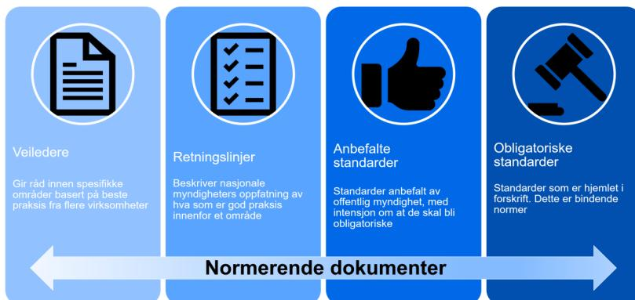
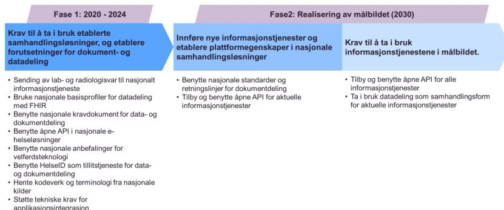

# Sentralt styringsdokument

Akson: Helhetlig samhandling og felles  
kommunal journalløsning

Vedlegg O

Funksjonelle standarder og  
tekniske krav til journalløsningene  
for aktører i helse- og  
omsorgssektoren

## **Publikasjonens tittel:**

Sentralt styringsdokument

Akson: Helhetlig samhandling og felles kommunal journalløsning

Vedlegg O Funksjonelle standarder og tekniske krav til  
journalløsningene for atører i helse- og omsorssektoren

## **Rapportnummer**

IE-1056

### **Utgitt:**

Mars 2020

### **Utgitt av:**

Direktoratet for e-helse

###### **Kontakt:**

postmottak@ehelse.no

### **Besøksadresse:**

Verkstedveien 1, 0277 Oslo

Tlf.: 21 49 50 70

Publikasjonen kan lastes ned på:

[www.ehelse.no](http://www.ehelse.no)

## Innhold

|          |                                                                             |           |
|----------|-----------------------------------------------------------------------------|-----------|
| <b>1</b> | <b>Innledning .....</b>                                                     | <b>6</b>  |
| 1.1      | Bakgrunn.....                                                               | 6         |
| 1.2      | Om rapporten .....                                                          | 6         |
| 1.3      | Behov for å stille krav .....                                               | 7         |
| 1.4      | Gjeldende krav .....                                                        | 7         |
| 1.5      | Definisjon av sentrale begrep .....                                         | 8         |
| 1.6      | Normering innen e-helse .....                                               | 8         |
| <b>2</b> | <b>Målbilde for helhetlig samhandling .....</b>                             | <b>11</b> |
| 2.1      | Overordnet målbilde for helhetlig samhandling.....                          | 11        |
| 2.2      | Faseinndelt kravstilling for realisering av målbildet.....                  | 12        |
| 2.3      | Obligatorisk bruk av felles samhandlingsløsning .....                       | 13        |
| <b>3</b> | <b>Funksjonelle standarder og tekniske krav til journalløsningene .....</b> | <b>15</b> |
| 3.1      | Funksjonelle og semantiske krav til EPJ-løsninger.....                      | 16        |
| 3.2      | Tekniske krav til EPJ-løsninger .....                                       | 24        |
| <b>4</b> | <b>Referanser.....</b>                                                      | <b>27</b> |

# Sammendrag

Realisering av målbildet for samhandling slik det er beskrevet i Akson krever at det stilles krav til journalløsningene for aktører i helse- og omsorgssektoren. Innføring av kravene må tidfestes for å gi forutsigbarhet og sikre at aktørene kan samhandle på tvers på en effektiv måte.

Direktoratet for e-helse har et ansvar for å fastsette ulike normerende dokumenter som gir råd, anbefalinger og krav til aktørene i sektoren. I tillegg kan det stilles krav gjennom lover og forskrifter. Dette dokumentet peker på områder som er aktuelle for kravsetting. Dokumentet beskriver ikke hvordan kravene skal implementeres i sektoren.

Kravene skal i utgangspunktet gjelde for alle virksomheter som yter helse- og omsorgstjenester, men for noen av kravene kan det være aktuelt at enkelte typer virksomheter må tilfredsstille kravene tidligere enn andre. For aktører som tar i bruk felles kommunal journalløsning vil samhandlingen mellom aktører som *bruker* journalløsningen hovedsakelig skje i denne, og de vil dermed kunne oppnå samhandlingen på andre måter og tidligere enn andre aktører. Samtidig må også brukere av felles kommunal journalløsning kunne samhandle med andre aktører. Samhandling vil skje gjennom felles kommunal journalløsning og denne løsningen må derfor forholde seg til de samme kravene. "Akson journal AS" må sørge for at felles kommunal journalløsning tilfredsstiller de aktuelle kravene, på vegne av sine brukere, mens andre aktører selv må sørge for å stille krav til sine leverandører og selv sikre nødvendig innføring.

Det er lagt opp til en stegvis realisering av målbildet for samhandling fordelt på 2 hovedfaser. Kravene må være varslet i god tid før kravet gjøres gjeldende. Det er beskrevet hvilke krav som bør stilles for å realisere målbildet for samhandling, samt hvilke krav som bør stilles i fase 1 og i løpet av fase 2. Det er også beskrevet krav som bør stilles for å oppnå helhetlig samhandling i sektoren, som går ut over løsninger som er del av steg 1 i realisering av målbildet for samhandling i Akson.

| Fase 1: 2020 - 2024                                                                                          | Fase 2: Realisering av målbildet (2030)                                                             |                                                          |
|--------------------------------------------------------------------------------------------------------------|-----------------------------------------------------------------------------------------------------|----------------------------------------------------------|
| Krav til å ta i bruk etablerte samhandlingsløsninger, og etablere forutsetninger for dokument- og datadeling | Innføre nye informasjonstjenester og etablere plattformegenskaper i nasjonale samhandlingsløsninger | Krav til å ta i bruk informasjonstjenestene i målbildet. |

Diagram showing two phases of implementation: Fase 1 (2020-2024) and Fase 2 (Realisering av målbildet (2030)).

**Fase 1 (2020-24):** omfatter krav som er knyttet til eksisterende nasjonale e-helseløsninger (Meldingsplattformen, kjernejournal, e-resept og helsenorge), samt krav til kodeverk og terminologi. Det er i tillegg beskrevet krav som er nødvendig for å ta i bruk en nasjonal informasjonstjeneste for oppslag av laboratorie - og radiologisvar, samt grunnleggende krav knyttet til felles grunnmur som beskrevet i steg 1 i utviklingsretning for samhandling i Akson. I tillegg er det lagt vekt på å stille krav slik at det er mulig å gjøre applikasjonsintegrasjon mot ulike journalløsninger.

**Fase 2** starter med å etablere plattformegenskaper for samhandling og krav om å ta i bruk åpne API (datadeling), mest sannsynlig først for følgende informasjonstjenester:

- Planlegging av innbyggeres helse- og omsorgshjelp
- Innsyn i journaldokumenter
- Problem, diagnose og behov
- Scoringer og kliniske tester inkl. funksjonsbeskrivelser

**Målbildet for fase 2 (2030):** For å realisere målbildet for samhandling må det stilles funksjonelle, semantiske og tekniske krav til å kunne ta i bruk resterende informasjonstjenester i målbildet. Følgende hovedprinsipper er lagt til grunn i målbildet for samhandling:

- Datadeling er hovedregelen
- Åpne API for alle informasjonstjenestene
- Fra nasjonale løsninger til tjenester på en helhetlig samhandlingsløsning (plattform)
- Bruk av felles språk (herunder SNOMED CT)
- Tekniske standarder for åpne API for aktuelle informasjonstjenester basert på internasjonale standarder

De detaljerte kravene til målbildet for samhandling må konkretiseres i det videre arbeidet, og gjennomføres i flere steg.

# 1 Innledning

## 1.1 Bakgrunn

Helse- og omsorgsdepartementet ga i tillegg til tildelingsbrev nr. 1 i 2018 (1) Direktoratet for e-helse i oppdrag å utarbeide en konseptvalgutredning for å løse behov knyttet til klinisk dokumentasjon og pasient- og brukeradministrasjon i kommunal helse- og omsorgstjeneste, og for samhandlingen med øvrig helsetjeneste. Arbeidet skulle også ta høyde for behovet for samhandling mellom helsetjenesten og andre kommunale og statlige tjenesteområder.

Direktoratet vurderte i konseptvalgutredningen fra 2018 (2) ulike konseptalternativer opp mot behovet for bedre samhandling med innbyggere, bedre samhandling innenfor kommunal helse- og omsorgstjeneste, inkludert fastlegene, bedre samhandling med spesialisthelsetjenesten og bedre samhandling med andre kommunale tjenesteområder.

Direktoratet for e-helse fikk i april 2019 (3) i oppdrag av Helse- og omsorgsdepartementet å gjennomføre et forprosjekt med utgangspunkt i konsept 7, felles journalløsning med helhetlig samhandling. Konseptet har fått navnet Akson.

Denne rapporten behandler oppgaven i forprosjektet om i oppgave å *"utrede funksjonelle standarder og tekniske krav til journalløsningene for aktører i helse- og omsorgssektoren, inklusiv obligatorisk bruk av felles samhandlingsløsning"*.

Dette omfatter krav til alle aktørene uavhengig av hvilke journalløsninger som brukes:

- For aktører i kommunal helse- og omsorgstjeneste som tar i bruk felles kommunal journalløsning vil kravene måtte tilfredsstilles gjennom denne løsningen
- Øvrige aktører må tilfredsstille kravene på selvstendig grunnlag i egne løsninger

## 1.2 Om rapporten

Det etablerte målbildet for helhetlig samhandling omtales i denne rapporten på et overordnet nivå. Denne rapporten har verken til hensikt å redegjøre for målbildet eller beskrive veikartet eller planen som er nødvendig for å realisere dette. I dokumentets appendix vises dagens obligatoriske krav fra IKT-forskriften, og rapporten omhandler områder hvor det kan være med nye funksjonelle standarder og tekniske krav til journalløsningene. På sikt kan det være aktuelt å pålegge obligatorisk bruk av felles samhandlingsløsning for å realisere det endelige målbildet.

Direktoratet er faglig rådgiver, pådriver og premissgiver i digitaliseringsarbeidet i helse- og omsorgssektoren og bidrar til at vedtatt politikk settes i verk på helse- og omsorgsområdet. Direktoratet utarbeider normerende dokumenter som gir rammer og retningslinjer for IKT-utviklingen i helse- og omsorgssektoren, hvor forankring i sektoren er en del av normeringsarbeidet.

I denne rapporten vises det i all hovedsak til andre prosesser og dokumenter som er utgangspunkt for det kravet som stilles til virksomhetene. Sektorforankring har derfor ikke vært en del av prosessen med å utarbeide rapporten, da denne forankringen skal ivaretas gjennom de prosesser og dokumenter som leder frem til et krav.

Direktoratet for e-helse har utarbeidet rapporten, og rapporten vil benyttes i det videre arbeidet med normering for å realisere målbildet for helhetlig samhandling.

## 1.3 Behov for å stille krav

For å realisere mål som knytter seg til økt samhandling i helse- og omsorgssektoren pekes det på en rekke virkemidler som knytter seg til samordning, arkitektur og standardisering. Arbeid med felles grunnmur for digitale tjenester, eksempelvis grunndata og felleskomponenter, skal legge til rette for effektiv og enhetlig samhandling mellom virksomheter og forvaltningsnivå.

For å realisere målbildet for helhetlig samhandling slik dette er beskrevet i forprosjektet må det stilles krav til journalløsningene for aktører i helse- og omsorgssektoren. Innføring av kravene må tidfestes for å sikre at aktørene kan samhandle på tvers på en effektiv måte. Dersom aktørene ikke tilpasser seg de krav og standarder som gjelder kan det føre til reduserte effekter, herunder fare for pasientsikkerheten.

Rapporten IKT-organisering i helse- og omsorgssektoren (4) anbefaler at juridiske virkemidler bør utvikles og tas i bruk, herunder vurdere forskriftsregulering av nasjonale løsninger.

Helse- og omsorgsdepartementet sendte i oktober 2019 forslag til ny e-helselov og endringer i forskrift om IKT-standarder i helse- og omsorgstjenesten på . I forslag til ny e-helselov foreslås endringer som er nødvendige for å sikre raskere innføring av viktige nasjonale e-helsetiltak, herunder tydeligere nasjonal koordinering, sektorinvolvering og styring. I forslaget til den nye e-helseloven foreslås det hjemmel til å pålegge virksomhetene en plikt til å gjøre nasjonale e-helseløsninger tilgjengelige for personellet i virksomheten. Forpliktelser og tidspunkt for når dette kan tre i kraft vil blir regulert i forskrift på senere tidspunkt.

I tillegg inneholder lovforslaget meldeplikt til Direktoratet for e-helse tiltak av nasjonal betydning. Direktoratet skal vurdere om tiltaket skal inngå i den nasjonale e-helseporteføljen.

Resultatet av høringen, ikrafttredelse av den nye loven samt forslag til endringer i IKT-forskriften kan gi nye krav og standarder som sektoren må forholde seg til.

Helse- og omsorgsdepartementet vil også igangsette et lovarbeid for å sikre rettsgrunnlag for felles journalløsning og løsninger for helhetlig samhandling. Videre kan det være behov for ytterligere endringer og tilpasninger i helselovgivningen som følge av tiltakene. Flere av kravområdene som foreslås i dette dokumentet kan være relevant for dette lovarbeidet.

## 1.4 Gjeldende krav

Obligatoriske krav til standarder for aktører som skal samhandle på tvers av virksomheter og forvaltningsnivå i helse- og omsorgssektoren er regulert i forskrift om IKT-standarder i helse- og omsorgssektoren. IKT-forskriften (6) angir hvilke standarder det er obligatorisk å benytte, mens Referanse katalogen for e-helse angir både obligatoriske og anbefalte standarder (7).

Krav som allerede er tatt inn i IKT-forskriften (6) er referert i appendix til dokumentet, og vil ikke gjentas under det enkelte området. Disse er gjeldende til de eventuelt blir erstattet av nye krav.

## 1.5 Definisjon av sentrale begrep

I tabellen under følger en oversikt over begrep og definisjoner som er sentrale i denne rapporten.

**Tabell 1 Definisjon av sentrale begrep**

| Begrep                | Definisjon                                                                                                                                                                                                                                                                                                                                                                                                                  |
|-----------------------|-----------------------------------------------------------------------------------------------------------------------------------------------------------------------------------------------------------------------------------------------------------------------------------------------------------------------------------------------------------------------------------------------------------------------------|
| <b>API</b>            | Spesifikasjon av teknisk grensnitt mellom ulike systemer, forkortelse for det engelske begrepet Application Programming Interface. Et hjelpeverktøy ved programmering, som gir et grensesnitt mot en eller flere tjenester i et operativsystem, en databasetjenere eller lignende.                                                                                                                                          |
| <b>Åpne API</b>       | Åpne API er gjenbrukbare, sikre, godt dokumenterte og tilgjengelige programmeringsgrensesnitt som kan benyttes av alle relevante aktører uten diskriminerende og konkurransevidende vilkår                                                                                                                                                                                                                                  |
| <b>Datadeling</b>     | Deling av data mellom helseaktører gjennom felles ressurser eller tjenester i sanntid. Med helseaktører menes både innbyggere, helsepersonell og virksomheter innen helse- og omsorgstjenesten, inkludert offentlige etater.                                                                                                                                                                                                |
| <b>Dokumentdeling</b> | Dokumentdeling er en samhandlingsform som omhandler deling av godkjente, lesbare dokumenter, inkludert bilder, gjennom felles infrastruktur/tjenester.                                                                                                                                                                                                                                                                      |
| <b>Løsning</b>        | En logisk komponent som, når satt sammen med andre logiske komponenter, realiserer et konsept. En løsning samvirker med arbeidsprosesser, organisatoriske og styringsmessige strukturer, kompetanse og kultur. Flere løsninger realiserer et konsept. Flere systemer realiserer en løsning.                                                                                                                                 |
| <b>System</b>         | En fysisk IKT-komponent som, når satt samme med andre fysiske IKT-komponenter, realiserer en løsning.                                                                                                                                                                                                                                                                                                                       |
| <b>Tjenester</b>      | En IKT-tjeneste som formidler informasjon knyttet til et bestemt tema i en generisk arbeidsprosess. Kan benyttes i mange ulike arbeidsprosesser, og av ulike profesjoner.                                                                                                                                                                                                                                                   |
| <b>Åpen plattform</b> | En åpen plattform tilbyr en digital infrastruktur med tilhørende tjenester som er basert på åpne, publiserte standarder som alle i prinsippet kan benytte for å ta i bruk plattformen. Plattformen gjør det mulig å knytte sammen applikasjoner og tjenester fra mange forskjellige leverandører, og understøtter deling av data på definerte, standardiserte formater – med bruk av felles tillistjenester og terminologi. |

## 1.6 Normering innen e-helse

Normering og tydelig krav til bruk av felles standarder, kodeverk, og terminologi er en forutsetning for å sikre god samhandlingsevne mellom løsninger og virksomheter i helse- og omsorgstjenesten. Direktoratet utarbeider normerende dokumenter som gir krav, rammer og retningslinjer for IKT-utviklingen i helse- og omsorgssektoren.

De normerende dokumentene er kategorisert på fire nivå:

- **Veiledere:** Gir råd innen spesifikke områder basert på beste praksis fra flere virksomheter
- **Retningslinjer:** Beskriver nasjonale myndigheters oppfatning av hva som er god praksis innenfor et område
- **Anbefalte standarder:** Standarder anbefalt av offentlig myndighet, ofte med intensjon om at de skal bli obligatoriske

- Obligatoriske standarder: Standarder som er hjemlet i forskrift.

The diagram illustrates four categories of normative documents, arranged from left to right in four blue boxes. Each box contains an icon and a title, with a descriptive paragraph below. A large, light blue double-headed arrow spans the width of the boxes, labeled 'Normerende dokumenter' in the center.

| Veiledere                                                                       | Retningslinjer                                                                           | Anbefalte standarder                                                                      | Obligatoriske standarder                                        |
|---------------------------------------------------------------------------------|------------------------------------------------------------------------------------------|-------------------------------------------------------------------------------------------|-----------------------------------------------------------------|
| Gir råd innen spesifikke områder basert på beste praksis fra flere virksomheter | Beskriver nasjonale myndigheters oppfatning av hva som er god praksis innenfor et område | Standarder anbefalt av offentlig myndighet, med intensjon om at de skal bli obligatoriske | Standarder som er hjemlet i forskrift. Dette er bindende normer |

Diagram showing four categories of normative documents: Veiledere, Retningslinjer, Anbefalte standarder, and Obligatoriske standarder, arranged from left to right with a central arrow labeled 'Normerende dokumenter'.

**Figur 1 Kategorier av normerende dokumenter**

Ulike typer normerende dokumenter fra direktoratet angir råd, anbefalinger og krav. Selv om f.eks. retningslinjer ikke vil være bindende for virksomhetene, bør en annen praksis være basert på en konkret og begrunnet vurdering i den aktuelle virksomheten. Anbefalte standarder bør brukes av virksomhetene, mens obligatoriske standarder er virksomhetene forpliktet å bruke gjennom krav i forskrift.

Direktoratet for e-helse har etablert en funksjon for nasjonal arkitekturstyring (8). Nasjonal arkitekturstyring skal utøves basert på fastsatte arkitekturprinsipper, referansearkitekturer, standarder, målbilder og veikart og annet nasjonalt styringsgrunnlag. Nasjonal arkitekturstyring vil ha ansvar for at relevant styringsgrunnlag utarbeides og forvaltes, samt å gi sektoren informasjon og veiledning i bruk av disse. Dette dokumentet peker på områder som er aktuelle for kravsetting fremover.

Direktoratet for e-helse har også etablert en forvaltningsmodell for nasjonale e-helsestandarder og fellestjenester for elektronisk samhandling (9) Målet med forvaltningsmodellen er at myndighetene har en tydeligere og mer effektiv nasjonal forvaltning av e-helsestandarder og fellestjenester for elektronisk samhandling (meldingsutvekslingen), og at helse- og omsorgstjenesten har en betydelig større evne til koordinert endring av sine samhandlingsløsninger. Forvaltningsmodellen er nå under revisjon for å også kunne omfatte nye samhandlingsformer, som dokument- og datadeling. Forvaltningsmodellen vil ligge til grunn for forvaltning av de aktuelle normerende dokumentene.

Standarder utarbeides i en standardiseringsprosess, der ulike aktører kommer med innspill og bidrar til utarbeiding av standarden. Standardene vil som regel utarbeides i regi av en standardiseringsorganisasjon internasjonalt eller nasjonalt (eksempelvis HL7, ISO, CEN, Standard Norge). Selv om det finnes en internasjonal standard, vil det ofte være behov for å tilpasse denne til nasjonale forhold og lage kravdokumenter som er egnet for nasjonale implementering. For andre typer kravdokumenter, som veiledere og retningslinjer, kan disse

utarbeides av Direktoratet for e-ehelse eller andre aktører og fastsettes som et normerende dokument fra direktoratet.

# 2 Målbilde for helhetlig samhandling

## 2.1 Overordnet målbilde for helhetlig samhandling

I forprosjektet (10,11) er omfanget av målbildet for samhandling beskrevet. Behovskartleggingen i forprosjektet har fokusert på samhandling mellom kommunal helse- og omsorgstjeneste og følgende tre grupper: 1) innbygger og pårørende, 2) spesialisthelsetjenesten og andre aktører i helse- og omsorgssektoren som ikke bruker felles kommunal journalløsning og 3) kommunale og statlige tjenesteområder utenfor helse- og omsorgssektoren. Samhandlingsløsningen(e) er ment å binde disse gruppene sammen. For innbygger ser vi for oss at noen av behovene kan dekkes av samhandling direkte med felles kommunal journal.

Målbildet for samhandling har et stort omfang, men det begrenser seg likevel til å understøtte ytelse av helse- og omsorgshjelp. Dette inkluderer å sikre kontinuitet i direkte helsehjelp, for eksempel når innbygger skrives ut fra sykehus til hjemmet eller til institusjon i kommunen. Det inkluderer imidlertid også å understøtte andre tjenester, der ytelser eller tjenester hos aktører utenfor helse- og omsorgstjenesten har betydning for innbyggerens helse og mesting, eller administrative sider av helsehjelpen følges opp av aktører utenfor helsetjenesten. Det er ikke foretatt en fullstendig kartlegging av behov mellom *alle* aktørene, eksempelvis innad i spesialisthelsetjenesten.

Generelt avdekker behovskartleggingen at det er store likheter i behov mellom gruppene beskrevet over. Aktørene etterspør i økende grad deling av data på utvalgte områder, fremfor å sende helseopplysninger til hverandre.

Målbildet inneholder 26 definerte informasjonstjenester som dekker 297 kartlagte informasjonsbehov. Representanter i kommunal helse- og omsorgstjeneste har prioritert behovene i målbildet for samhandling, og de med høyest prioritering dreier seg om behandling med legemidler, plan for helsehjelp inkludert individuell plan, oppslag i laboratoriedata, kliniske målinger og journaldokumenter, oppsummering av innbyggerens helsetilstand og funksjonsnivå, og tekstlig dialog mellom aktører. Mange av disse behovene er ikke dekket i dagens samhandlingsløsninger.

Felles grunnmur for digitale tjenester i helse- og omsorgstjenesten (12) skal legge til rette for enkel og sikker samhandling på tvers av virksomheter og forvaltningsnivå. Felles grunnmur består av kodeverk og terminologi, felles grunndata, felleskomponenter, felles krav og retningslinjer og felles infrastruktur. I planen for felles grunnmur beskrives de grunnmursleveranser og tiltak som blant annet skal understøtte og forberede for Akson. Flere av grunnmursleveransene er å anse som en forutsetning for realisering av målbildet om helhetlig samhandling.

### Samhandlingsløsningen(e)

Informasjonstjenestene som er beskrevet i Programmet for Akson samhandling er for steg 1 planlagt realisert ved å bygge videre på nasjonale e-helseløsninger. Det må da stilles funksjonelle og tekniske krav til hvordan aktører skal benytte de nasjonale løsningene. For steg 2 og videre frem mot målbildet må det gjøres en vurdering av om de enkelte nasjonale løsningene skal erstattes/utfylles av en mer helhetlig plattformløsning, men krav til aktører vil være omtrent de samme, uavhengig av hvordan samhandlingsløsningene er realisert.

## 2.2 Faseinndelt kravstilling for realisering av målbildet

Målbildet for helhetlig samhandling er planlagt realisert innen 2030. Forprosjektet har anbefalt at helhetlig samhandling realiseres stegvis i en utviklingsretning. Steg 1 i utviklingsretningen er beskrevet i detalj i sentralt styringsdokument for Akson (10), mens påfølgende steg skal planlegges som del av det videre arbeidet. I arbeidet med denne rapporten er det derfor valgt å dele kravene inn i foreløpig tidfestede faser, som vist i Figur 2. Den første fasene er sammenfallende i tid med steg 1 i utviklingsretningen for Akson samhandling.

Hver fase skal ha bestemte resultater, og for hver av dem er det knyttet ulike krav. Kravene må være varslet i god tid før kravet gjøres gjeldende. Kravene fra en fase vil også være et krav i neste fase om det ikke erstattes av et nytt krav.

Kravene er inndelt i to hovedgrupper: 1) funksjonelle og semantiske krav og 2) tekniske krav

Det vil også være behov for å stille ulike organisatoriske krav, herunder krav til helsefaglig standardisering, for å realisere målbildet for samhandling. Prosess for å utarbeide disse kravene er beskrevet i sentralt styringsdokument for Akson (10) og tilhørende appendix.

![Diagram showing the phase division of requirements for samhandling from 2020 to 2030. It consists of two main horizontal bars. The top bar is divided into two purple segments: 'Fase 1: 2020 - 2024' and 'Fase2: Realisering av målbildet (2030)'. The bottom bar is a large blue arrow pointing right, divided into three sections. The first section, under 'Fase 1', contains the text 'Krav til å ta i bruk etablerte samhandlingsløsninger, og etablere forutsetninger for dokument- og datadeling'. The second section, under 'Fase2', contains 'Innføre nye informasjonstjenester og etablere plattformegenskaper i nasjonale samhandlingsløsninger'. The third section, also under 'Fase2', contains 'Krav til å ta i bruk informasjonstjenestene i målbildet.'](images/Vedlegg O Funksjonelle standarder og tekniske krav til journalløsningene for aktører i helse- og omsorgssektoren/08441fa90c5fd11994626f662ac13f19_img.jpg)

Diagram showing the phase division of requirements for samhandling from 2020 to 2030. It consists of two main horizontal bars. The top bar is divided into two purple segments: 'Fase 1: 2020 - 2024' and 'Fase2: Realisering av målbildet (2030)'. The bottom bar is a large blue arrow pointing right, divided into three sections. The first section, under 'Fase 1', contains the text 'Krav til å ta i bruk etablerte samhandlingsløsninger, og etablere forutsetninger for dokument- og datadeling'. The second section, under 'Fase2', contains 'Innføre nye informasjonstjenester og etablere plattformegenskaper i nasjonale samhandlingsløsninger'. The third section, also under 'Fase2', contains 'Krav til å ta i bruk informasjonstjenestene i målbildet.'

**Figur 2 Faseinndeling av krav til samhandling frem mot 2030**

Under følger en kort beskrivelse av hvilke krav som bør stilles i de ulike fasene.

### 2.2.1 Fase 1: 2020 – 2024

I tidsrommet for fase 1 bør det stilles krav til å innføre samhandlingsfunksjonalitet på prioriterte områder og etablere forutsetninger for dokument- og datadeling. I tillegg er det lagt vekt på å stille krav slik at det er mulig å gjøre applikasjonsintegrasjon (lett IKT) mot ulike journalløsninger.

Det pågår en rekke initiativ som skal utvide samhandlingsfunksjonalitet i de nasjonale samhandlingsløsningene (for eksempel sentral forskrivningsmodul) og felles grunnmur for digitale tjenester (for eksempel felles språk).

Gjennom Programmet Akson samhandling er det foreslått å utvikle og videreutvikle komponenter i felles grunnmur for digitale tjenester. Dette omfatter videreutvikling av tillitstjenester (HelselD, API-management og personvernkomponenten) og grunddatatjenester (personell og virksomhet). Disse komponentene vil legge til rette for dokument- og datadeling og vil være nødvendige uavhengig av hvordan helhetlig samhandling vil løses i de følgende stegene i utviklingsretningen.

I tillegg er det foreslått å etablere en nasjonal informasjonstjeneste for oppslag av laboratorie- og røntgensvar. Dette inkluderer nødvendige tilpasninger for å sikre at laboratorier- og røntgeninstitutter automatisk sender en kopi av svarrapporten til den nasjonale informasjonstjenesten. Helsepersonell vil kunne få tilgang til svarene gjennom kjernejournal.

### 2.2.2 Fase 2 – Realisering av målbildet

#### 2.2.2.1 Innføre nye informasjonstjenester og etablere plattformegenskaper

Det er ikke detaljert hvordan samhandlingsløsningene vil utvikle seg etter fase 1. Omfanget av de påfølgende fasene og realisering av plattformegenskaper i de nasjonale samhandlingsløsningene vil beskrives i det planlagte Programmet Akson samhandling.

Basert på de kartlagte informasjonsbehovene er det gjort en *foreløpig* vurdering av hvilke informasjonstjenester som er aktuelle å kravstille først i fase 2. Det er derfor beskrevet krav med utgangspunkt i denne foreløpige vurderingen.

Aktuelle informasjonstjenester som det bør stiller krav om ta i bruk som åpne API først i fase 2 er:

- Planlegging av innbyggeres helse- og omsorgshjelp
- Innsyn i journaldokumenter
- Problem, diagnose og behov
- Scoringer og kliniske tester inkl. funksjonsbeskrivelser

Kjernejournal, e-resept og helsenorge er nasjonale e-helseløsninger som i hovedsak er etablert som separate løsninger på separate plattformer. På sikt bør løsningene brytes opp i tjenester som er tilgjengelig på åpne API på tvers av ulike applikasjoner/løsninger. Det bør også gjøres en vurdering av om disse i større grad kan kjøres på en felles åpen plattform. Dette er en vurdering som er foreslått som en del av steg 1 i utviklingsretningen for samhandling i Akson.

#### 2.2.2.2 Krav til å ta i bruk informasjonstjenestene i målbildet

Innen utgangen av fase 2 i 2030 er målet å ta i bruk de resterende informasjonstjenestene, og det bør derfor stilles krav om at alle de spesifiserte informasjonstjenestene, som ikke allerede er innført, er tatt i bruk. Det må gjøres en ny vurdering av om det er kommet nye behov eller endrede forutsetninger før endelig kravsetting for denne fasen. De foreslåtte informasjonstjenestene bygger på behovskartlegging fra konseptvalgutredningen for Akson, og må oppdateres med tanke på om det er kommet nye behov eller om noen av disse ikke lenger er aktuelle eller kostnadssvarende å innføre for denne fasen.

Hovedprinsippene er at det skal benyttes åpne API og internasjonale standarder, samt felles språk for samhandling.

## 2.3 Obligatorisk bruk av felles samhandlingsløsning

Ambisjonsnivået for funksjonalitet i samhandlingsløsningen(e) er stort. Samtidig foregår det en rekke prosjekter der samhandlingsfunksjonalitet utvikles på enkelte verdikjeder, f.eks legemiddelhåndtering og dokumentinnsyn.

Det er en gjennomgående tilbakemelding fra helsepersonell at helsepersonell må kunne forholde seg til helseopplysninger og funksjonalitet gjennom en helhetlig arbeidsflate, også i de tilfellene hvor informasjonen hentes fra samhandlingsløsningene. Dette betyr at det som prinsipp ikke skal introduseres flere arbeidsflater og at behovet for å logge inn på flere arbeidsflater (eksempelvis kjernejournal portal) må minimeres. Informasjon som hentes gjennom samhandlingsløsningen(e) skal da vises i helsepersonells arbeidsflate, og informasjon som skal lagres tilbake i samhandlingsløsningen skal kun dokumenteres en gang i samme arbeidsflate uten behov for dobbeltføring eller klipp- og lim.

Arkitekturforståelsen som legges til grunn for innføring av ny samhandlingsfunksjonalitet er basert på et økosystem hvor felles samhandlingsløsninger er navet som binder de ulike aktørene i helsesektoren sammen.

For å realisere målbildet for helhetlig samhandling bør det utformes og stilles tydelige krav som alle virksomheter som skal inngå i samhandlingen må forholde seg til. Bruk av den fremtidige nasjonale samhandlingsfunksjonaliteten bør derfor være obligatorisk for alle løsninger (applikasjon og systemer) som produserer og lagrer data av helsefaglig karakter. Krav til aktørene om å følge funksjonelle, semantiske og tekniske krav vil innføres gradvis og følge de faser som er beskrevet i tidligere kapitler. Disse kravene blir presentert i neste kapittel.

# 3 Funksjonelle standarder og tekniske krav til journalløsningene

Under presenteres krav til journalløsningene og obligatorisk bruk av felles samhandlingsløsning som er nødvendig for å realisere målbildet for helhetlig samhandling. Kravene skal i utgangspunktet gjelde for *alle aktører som yter helse- og omsorgstjenester*, men for noen av kravene kan det være aktuelt at enkelte aktører må tilfredsstille kravene tidligere enn andre. Med mindre annet er angitt gjelder kravene for alle aktører i sektoren.

For aktører som tar i bruk felles kommunal journalløsning, vil samhandlingen mellom aktører som *bruker* journalløsningen hovedsakelig skje i denne, og de vil dermed kunne oppnå samhandlingen på andre måter enn gjennom de nasjonale samhandlingsløsningene. Samtidig må felles kommunal journalløsning også samhandle med aktører som ikke benytter denne, dermed må felles kommunal journalløsning forholde seg til de samme kravene.

Programmet Akson journal må sørge for å tilfredsstille de aktuelle kravene både organisatorisk, semantisk og teknisk, mens andre aktører må selv stille krav til sine leverandører gjøre nødvendig innføringsarbeid slik at de tilfredsstiller kravene.

Det er også beskrevet krav som må stilles for å oppnå helhetlig samhandling i sektoren, selv om utvikling og innføring av *alle* tjenestene ikke er beskrevet som en del av omfanget av felles kommunal journalløsning per i dag. Krav som allerede er tatt inn i IKT-forskriften (6) er referert i appendix til dokumentet, og vil ikke gjentas under det enkelte området. Disse er gjeldende til de eventuelt blir erstattet av nye krav.

Det er ikke beskrevet krav som omfatter medisinsk-teknisk utstyr (MTU) og Internet of Things (IOT), med unntak av velferdsteknologisk knutepunkt. Vi har heller ikke tatt inn en beskrivelse av nye behov ift. nasjonale helseregistre, her vises det til helseDATaprogrammet. Dette må eventuelt vurderes tatt inn senere.

Kravene er delt inn i 2 faser, der den første fasen sammenfaller i tid med Steg 1 i Akson samhandling. Kravene er mest konkretiserte for fase 1, og beskrevet noe mer overordnet for fase 2. Flere konkrete krav vil trolig være nødvendig i fase 2, og denne må deles inn i ulike steg, men dette må utredes i videre arbeid.

Alle krav er formulert som *bør* med mindre det allerede er hjemlet i lov eller forskrift, da er kravet formulert som *skal*.

| Fase 1: 2020 - 2024                                                                                          | Fase 2: Realisering av målbildet (2030)                                                             |                                                          |
|--------------------------------------------------------------------------------------------------------------|-----------------------------------------------------------------------------------------------------|----------------------------------------------------------|
| Krav til å ta i bruk etablerte samhandlingsløsninger, og etablere forutsetninger for dokument- og datadeling | Innføre nye informasjonstjenester og etablere plattformegenskaper i nasjonale samhandlingsløsninger | Krav til å ta i bruk informasjonstjenestene i målbildet. |

Diagram showing two phases of requirements: Fase 1 (2020-2024) and Fase 2 (Realisering av målbildet (2030)).

Figur 3 Faser som viser inndeling av krav

## 3.1 Funksjonelle og semantiske krav til EPJ-løsninger

|                          | Fase 1: 2020 - 2024                                                                                                                                                                                                                                                                                                                                                                                                                                                                                                        | Fase2: Realisering av målbildet (2030)                                                                                                                                                                                                                                                                                                                                                                                                |                                                                                                                                                                                                                |
|--------------------------|----------------------------------------------------------------------------------------------------------------------------------------------------------------------------------------------------------------------------------------------------------------------------------------------------------------------------------------------------------------------------------------------------------------------------------------------------------------------------------------------------------------------------|---------------------------------------------------------------------------------------------------------------------------------------------------------------------------------------------------------------------------------------------------------------------------------------------------------------------------------------------------------------------------------------------------------------------------------------|----------------------------------------------------------------------------------------------------------------------------------------------------------------------------------------------------------------|
|                          | Krav til å ta i bruk etablerte samhandlingsløsninger, og etablere forutsetninger for dokument- og datadeling                                                                                                                                                                                                                                                                                                                                                                                                               | Innføre nye informasjonstjenester og etablere plattformegenskaper i nasjonale samhandlingsløsninger                                                                                                                                                                                                                                                                                                                                   | Krav til å ta i bruk informasjonstjenestene i målbildet.                                                                                                                                                       |
| <b>Funksjonelle krav</b> | <ul style="list-style-type: none"> <li>• Oppfylle nye krav til bruk av meldinger</li> <li>• Tilgjengeliggjøre av nasjonale e-helseløsninger</li> <li>• Tilby åpne API i nasjonale e-helseløsninger</li> <li>• Visning av kritisk informasjon</li> <li>• Visning av lab- og radiologisvar</li> <li>• Understøtte sentral forskrivningsmodul og Pasientens legemiddelliste</li> <li>• Benytte tjenestebasert adressering og lokalisering av pasientinformasjon</li> <li>• Understøtte basisjenester for innbygger</li> </ul> | <ul style="list-style-type: none"> <li>• Understøtte planlegging av innbygger helse- og omsorgshjelp</li> <li>• Understøtte innsyn i journaldokumenter</li> <li>• Tilgjengeliggjøre og bruke informasjonstjenester for problem, diagnose og behov for helsehjelp</li> <li>• Slå opp og tilgjengeliggjøre scoringer og målinger og funn inkl. funksjonsbeskrivelser</li> <li>• Støtte rammeverk for applikasjonsintegrasjon</li> </ul> | <ul style="list-style-type: none"> <li>• Ta i bruk utviklede informasjonstjenester i målbildet for samhandling</li> <li>• Tilby og benytte strukturerte data via åpne API for informasjonstjenester</li> </ul> |
| <b>Semantiske krav</b>   | <ul style="list-style-type: none"> <li>• Bruke kodeverk og terminologi</li> <li>• Bruke felles terminologi for helsefaglig dokumentasjon</li> <li>• Bruke grunndatajenester for person-, personell og virksomhet</li> </ul>                                                                                                                                                                                                                                                                                                | <ul style="list-style-type: none"> <li>• Bruke standardisert terminologi på utvalgte områder</li> <li>• Støtte semantikk fra IPS og EHRxF</li> </ul>                                                                                                                                                                                                                                                                                  | <ul style="list-style-type: none"> <li>• Ytterligere utnyttelse av felles språk (terminologier, kodeverk og relasjoner)</li> </ul>                                                                             |

Figur 4 Krav til EPJ-løsninger for realisering av målbildet

### 3.1.1 Fase 1: 2020 – 2024

#### 3.1.1.1 Oppfylle nye krav til bruk av meldinger

Krav til funksjonalitet ved meldingsutveksling som er angitt i IKT-forskriften (6) §6 med foreslåtte endringer fra høringen av e-helseloven må gjelde for de angitte aktører.

*Det skal stilles krav til funksjonalitet ved meldingsutveksling.*

#### 3.1.1.2 Tilgjengeliggjøre nasjonale e-helseløsninger

De nasjonale løsningene e-resept, kjernejournal og helsenorge bør tilgjengeliggjøres i virksomhetene. § 6 i forslag til ny e-helselov (5) gir hjemmel til dette, men forpliktelse vil eventuelt komme i forskrift på et senere tidspunkt. Eksempelvis bør API for kritisk informasjon tas i bruk i EPJ-løsningene i virksomhetene.

*Det bør stilles krav til at nasjonale e-helseløsninger tilgjengeliggjøres i aktuelle virksomheter.*

#### 3.1.1.3 Tilby åpne API i nasjonale e-helseløsninger

Utkast til veileder for åpne API (13) gir eksempel på krav som bør stilles til åpne API. Gjennom tilgjengeliggjøring av åpne API i nasjonale e-helseløsninger er det mulig å prøve ut kravene, slik at kravene senere kan løftes til høyere normeringsnivå (anbefalt eller obligatorisk). Eksempel på et slikt API er kritisk informasjon for kjernejournal. Kjernejournal bør tilpasse seg den europeiske standarden International Patient Summary (EN 17269) .

*Det bør stilles krav til at åpne API for nasjonale e-helseløsninger tilbys.*

#### 3.1.1.4 Visning av kritisk informasjon

For aktører som har tatt i bruk åpne API for kritisk informasjon fra kjernejournal bør det være krav som sørger for at dette er godt synlig og gjenkjennelig i de ulike EPJ-løsningene.

*Det bør stilles krav til at kritisk informasjon fra kjernejournal skal vises og registreres i EPJ-løsningene.*

#### **3.1.1.5 Visning av lab- og radiologisvar**

For aktører som har integrert seg mot nasjonal informasjonstjeneste for oppslag i laboratorie- og radiologisvar knyttet til kjernejournalr bør det være krav som sørger for at dette er godt synlig og gjenkjennelig i de ulike EPJ-løsningene. Svarene kan vises som dokumenter i EPJ-løsningen, alternativt kan svarene vises via tilgang til kjernejournal.

*Det bør stilles krav til at det kan vises en oversikt i EPJ-løsningene over lab- og radiologisvar fra det nasjonale registret.*

#### **3.1.1.6 Benytte kodeverk og terminologi**

Det er vedtatt å etablere et Felles språk (14), som består av en felles standardisert terminologi, ytterligere kodeverk, klassifikasjoner og terminologier, samt relasjoner mellom disse. I tillegg skal det opprettes koblinger til registervariable for økt grad av automatisert rapportering. Kodeverk, klassifikasjoner og terminologier skal benyttes til det formålet de er tiltenkt og informasjon registrert i pasientforløpet skal kunne overføres og benyttes etter at den er registrert én gang. Dette skal bidra til bedre informasjonsflyt, bedre datakvalitet og redusert registreringsbyrde.

Felles språk vil utvikles innenfor perioden, og de vurderinger som gjøres vil løpende danne grunnlaget for nasjonale retningslinjer for bruk av kodeverk og terminologi i EPJ-løsningene. EPJ-løsningene skal benytte terminologi som angitt i Felles språk ved registrering av helsefaglig informasjon.

Terminologien SNOMED CT benyttes til strukturert registrering og utveksling av helsefaglige opplysninger. Områder (diagnoser, anatomi mv) som vurderes er angitt i målbildet for Felles språk, og avklaringer vil gis gjennom arbeidet med å utvikle Felles språk. Felles språk binder sammen gjeldende klassifikasjoner og kodeverk sammen med terminologi. SNOMED bør også benyttes internt i EPJ-løsningen som interne koder (kun kode og tekst) for å unngå vedlikehold av interne kodeverk og forenkling av informasjonsoverføring samt for å bedre kvalitet på data. Bruk av terminologi er ikke til hinder for at også fratekst brukes som del av en helhetlig dokumentasjon.

*Det bør stilles krav til at terminologier, klassifikasjoner eller kodeverk som skal benyttes i forbindelse med samhandling og i løsningene for å dokumentere informasjon for å yte helsehjelp, følger angitte nasjonale retningslinjer og standarder basert på vurderinger gjort i Felles språk.*

*Det bør stilles krav til bruk av kodeverk og terminologi i form av bruk av enkle kodelister i samhandling med andre aktører.*

*Det bør stilles krav til at SNOMED CT benyttes til registrering av informasjon som kreves i kjernejournal.*

#### **3.1.1.7 Understøtte sentral forskrivningsmodul og Pasientens legemiddelliste**

EPJ-leverandører kan utvikle støtte for e-resept enten med integrasjon mot reseptformidleren (RF), eller ta i bruk forskrivningsmodulen (FM). Det planlegges at FM skal erstattes med sentral forskrivningsmodul (SFM). Det legges også opp til at dagens kommunikasjon med reseptformidler skal erstattes med bruk av API i SFM (SFM Basis API). Leverandører som ikke ønsker å utvikle reseptfunksjonalitet i egen EPJ vil kunne benytte planlagt brukergrensesnitt i SFM (SFM GUI). Nasjonale prosjekter knyttet til bedre legemiddelhåndtering er våren 2020 under replanlegging.

I begge tilfeller vil det settes krav til at multidose skal støttes. Denne støtten forutsetter at journalløsningen inkluderer funksjonalitet for å vedlikeholde lister over pasientens bruk av legemidler ("Legemidler i bruk", LIB), og at disse listene kan formidles til multidoseapotek via Reseptformidleren. Derfra er veien kort til å tilby LIB til alle innbyggere, ikke bare de som bruker multidose. Dette er essensen i Pasientens legemiddelliste (PLL). For å tilby e-resept-funksjonalitet i sin EPJ, må EPJ-leverandørene fullføre en godkjenningsprosess for å tilfredsstille rekvirentkravene.

*Det bør stilles krav til hvilke grensesnitt og godkjent funksjonalitet som skal benyttes for e-resept.*

#### **3.1.1.8 Benytte tjenestebasert adressering**

Tjenestebasert adressering (TBA) er en felles adresseringsmetode som skal sikre enhetlig og robust adressering for meldingsutvekslingen i helse- og omsorgstjenesten. Formålet med standarden er å oppnå enhetlig adressering, for å sikre at meldingene kommer frem til riktig mottaker. TBA innebærer at meldinger adresseres til standardiserte adresser, tjenestetyper, som den enkelte virksomhet registrerer i Adresseregisteret. Dette gjør det enklere for helsepersonell å finne riktig mottaker ved sending av elektronisk melding.

*Det skal stilles krav til at tjenestebasert adressering benyttes for meldingsutveksling (kravet er foreslått i IKT-forskriften fra 1.1.2021).*

#### **3.1.1.9 Benytte lokalisering av pasientinformasjon**

Pasientinformasjonslokalisator (PIL) er en planlagt byggekloss for å gi informasjon om hvilken EPJ-løsning som har helseopplysninger om en pasient. PIL skal gjøre det mulig å gjøre oppslag på en gitt pasient, uavhengig av hvor pasientens helseopplysninger er lokalisert. Dette krever at hver virksomhet gir informasjon til PIL ved opprettelse av nye pasientjournaler.

*Det bør stilles krav til at pasientinformasjonslokalisator benyttes for å gjøre lokalisering av helseopplysningene mulig.*

#### **3.1.1.10 Understøtte basisjenester for innbygger**

Innbyggertjenester er tjenester som alle aktører bidrar til. En tydeliggjøring av et sett med basis innbyggertjenester kan gjøres med utgangspunkt i begrepet helsekompetanse:

*Helsekompetanse er personers evne til å forstå, vurdere og anvende helse-informasjon for å kunne treffe kunnskapsbaserte beslutninger relatert til egen helse. Det gjelder både beslutninger knyttet til livsstilvalg, sykdomsforebyggende tiltak, egenmestring av sykdom og bruk av helse- og omsorgstjenesten (15)*

En del av tjenestene krever kun tilgang til et enkelt nasjonalt register, eller virksomhetssystem i en enkelt virksomhet. Andre krever at hver aktør i sektoren tilbyr eller tar i bruk API-er som gjør tjenestene tilgjengelig.

*Det bør stilles krav til at basisjenester for innbyggere understøttes i virksomhetene.*

#### **3.1.1.11 Dele EPJ-informasjon ved bruk av nye samhandlingsformer**

Som en videreføring av IPS og ePrescription jobber EU med å tilrettelegge for deling av EPJ-informasjon til også å gjelde epikrise, labsvar og bildedeling. De nye standardene skal gjenbruke krav fra IPS der deling av samme type informasjon er relevant. Standardiseringsarbeidet er pågående, og det vil ta tid før standardene for epikrise, lab og bilde er endelig vedtatt. Det bør være føringer på deltakelse i EU sitt arbeid, samt føringer for

at nye prosjekter må ta utgangspunkt i det som er klart, slik at overgang til endelig vedtatt standard ikke blir for stor.

*Det bør stilles krav til nye tjenester der epikrise, labsvar og/eller bilde skal deles skal følge den retningen EU utarbeider.*

#### **3.1.1.12 Bruke grunndatatjenester for person-, personell og virksomhet**

Grunndata er en felleskomponent i helsenettet og er en forutsetning for tjenester som identitetsforvaltning, sporbarhet og tilgangsstyring. Grunndataløsningen er enhetlig med autoritativ informasjon, noe som gir mulighet for blant annet lagring, søk, oppslag og distribusjon av informasjonen i register som blant annet Adresseregisteret, Helsepersonellregisteret, Personregisteret og Bedriftsregisteret. Grunndataløsningen er en viktig komponent for at meldingsutveksling, e-resept, kjernejournal og andre løsninger skal fungere.

I forslag til ny e-helselov er grunndata omtalt som en nasjonal tjeneste som inngår som en del av helsenettet. I e-helseloven er det foreslått en plikt for Helseforetak, kommuner og fylkeskommuner til å gjøre slike nasjonale tjenester tilgjengelig i virksomheten, dvs. å bruke og oppdatere grunndata for person, personell og virksomhet.

*Det bør stilles krav til at tjenester fra grunndata tilgjengeliggjøres i virksomhetene.*

### **3.1.2 Fase 2: Innføre nye informasjonstjenester og etablere plattformegenskaper**

Her beskrives hvilke krav til informasjonstjenester som er aktuelle å vurdere i starten av fase 2. Utvalget er basert på helsepersonells prioritering, og må betraktes som et foreløpig forslag som skal vurderes nærmere av forprosjektet som inngår i steg 1 i Programmet Akson samhandling.

#### **3.1.2.1 Understøtte planlegging av innbyggeres helse- og omsorgshjelp**

Denne informasjonstjenesten inkluderer alle aspekter ved planlegging av innbyggeres helse- og omsorgshjelp. Dette inkluderer behandlingsplan eller tiltaksplan for ulike profesjoner, egenbehandlingsplan for innbygger, kriseplan og andre betingede tiltaksplaner, samt individuell plan. Innholdet vil kunne variere fra tentative skisser til ferdig avtalte forløp, og ha ulik grad av detaljering.

Informasjonstjenesten forutsetter ny funksjonalitet i journalløsningene, og innebærer endringer i arbeidsprosesser mellom virksomheter. Det er også behov for begrepsavklaring og helsefaglig standardisering på dette området. HL7 FHIR (og ressursene *CarePlan*, *Goal* og *Appointment*) er aktuell som standard for området, men det er behov for modning og utprøving før det er mulig å sette krav til å ta disse i bruk. Det er planlagt en begrenset utprøving av medisinsk behandlingsplan i kjernejournal, og erfaringene herfra vil være nyttige i det videre arbeidet.

*Det bør stilles krav til å ta i bruk samhandlingsfunksjonalitet for å planlegge pasientforløp og koordinere ansvar og oppgaver mellom aktører innenfor og utenfor helsetjenesten etter hvert som den er tilgjengelig og utprøvd.*

#### **3.1.2.2 Understøtte innsyn i journaldokumenter**

Spesialisthelsetjenesten tilbyr i dag innsyn i journaldokumenter fra DIPS via kjernejournal, men det er behov for at også andre deler av helse- og omsorgssektoren gir innsyn i sine

journaldokumenter. Dette vil sette krav til alle løsninger for elektroniske pasientjournaler. Etter hvert som Helseplattformen og felles kommunal journalløsning i Akson innføres, vil informasjon fra kommunal helse- og omsorgstjeneste inkl. fastleger kunne gjøres tilgjengelig fra disse løsningene. Andre aktører må kunne tilby dokumentinnsyn fra sine journalløsninger.

*Det bør stilles krav til å ta i bruk samhandlingsfunksjonalitet for dokumentinnsyn inkludert å tilgjengeliggjøre egne dokumenter i alle deler av helsetjenesten.*

#### **3.1.2.3 Tilgjengeliggjøre og bruke informasjonstjenester for problem, diagnose og behov for helsehjelp**

Aktuelle diagnoser, problemstillinger og behov for helsehjelp er sentral informasjon når innbyggerens helsetilstand oppsummeres av ulike aktører i helsesektoren. Det finnes allerede krav om angivelse av diagnose og tilstand i spesialisthelsetjenesten (ICD-10) og i kommunal helse- og omsorgstjeneste (IPLOS) inkludert fastleger (ICPC-2). Selv om disse helseopplysningene er innhentet ut fra administrative hensyn, kan de være interessante å bruke i oppfølging av pasienter. Alt dette er derimot klassifikasjoner etablert for statistikk eller finansiering, og de er ikke etablert for presis angivelse av helserelatert informasjon. Helsepersonell har behov for lister over problem, diagnose og behov for helsehjelp som er kontinuerlig ført, og som dekker hele innbyggerens situasjon. For leger kalles dette gjerne problemliste, og for sykepleiere kan det være naturlig å ta utgangspunkt i fokusområdene i tiltaksplaner. Det er behov for å harmonisere struktur, begreper og definisjoner brukt i en slik liste på tvers av yrkesgrupper, samtidig som kunnskapsgrunnlaget i ulike profesjoner må kunne representeres.

Ressursene *IPS Problem list* og *FHIR Condition* bør vurderes i denne sammenheng. I tillegg bør kodeverkene ICNP, SNOMED CT, ICD-10, ICPC-2, ICF m.fl. vurderes brukt opp mot disse.

*Det bør stilles krav til å ta i bruk samhandlingsfunksjonalitet for oversikter over innbyggerens problem, diagnose og behov for helsehjelp.*

#### **3.1.2.4 Slå opp og tilgjengeliggjøre scoringer og kliniske målinger og funn, inkl. funksjonsbeskrivelser**

En vesentlig utfordring i samhandlingen mellom spesialisthelsetjenesten og kommunal helse- og omsorgstjeneste er å kunne tilby riktige helsetjenester til riktige innbyggere. For å identifisere endringer i behov for helse- og omsorgstjenester vil det være nyttig å utveksle strukturerte registreringer av funksjonsnivå. IPLOS inneholder beskrivelser av funksjonsnivå og er i dag i obligatorisk bruk i kommunene. Det formidles til sykepleiefunksjonen i spesialisthelsetjenesten, men har potensiale til å bli utnyttet mer. Det er også områder hvor IPLOS ikke dekker behovet.

For å dekke behovet for funksjonsbeskrivelser av andre yrkesgrupper som fysioterapeuter og ergoterapeuter, for å utdype spesifikke medisinske tilstander (f.eks. neurologiske lidelser, skader), bør terminologier som SNOMED CT, ICNP og ISF vurderes, samt andre scoringsverktøy for å beskrive funksjon med vurdering. Den planlagte informasjonstjenesten *Undersøkelser, målinger og funn* har et vesentlig større omfang enn funksjonsbeskrivelser, men dette er området som bør vurderes først.

*Det bør stilles krav til å ta i bruk samhandlingsfunksjonalitet for å slå opp og tilgjengeliggjøre scoringer, kliniske målinger og funn og funksjonsbeskrivelser*

#### **3.1.2.5 Støtte rammeverk for applikasjonsintegrasjon**

Applikasjoner som utvider fagsystemer kan brukes til å integrere EPJ-løsninger og andre fagsystemer med eksterne applikasjoner. Nye rammeverk gjør det enklere å inkludere og distribuere applikasjoner som enten er spesifikke for en fagsystemleverandør eller kan brukes på tvers av flere leverandører.

For å oppnå størst mulig grad av sømløshet, bør det stilles krav om at rammeverket støtter flest mulig av punktene under:

1. Felles brukeridentitet og pålogging på tvers av applikasjoner.
2. Felles valgt pasient og konsultasjon (pasientkontakt) på tvers av applikasjoner.
3. Dataintegrasjon mellom applikasjoner (ikke dobbeltføring av de samme opplysningene).
4. Applikasjonene føles og ser like ut.

Rammeverket skal muliggjøre at integrasjon av applikasjoner utviklet av tredjepartsleverandører støttes av EPJ-løsningene.

*Det bør stilles krav til å støtte rammeverk for applikasjonsintegrasjon i EPJ-løsningene.*

#### **3.1.2.6 Støtte IPS for oppsummerende helseinformasjon**

Informasjon i strukturert journal benyttes til mange ulike formål, det skal legges til rette for at samme type informasjon er strukturert likt uavhengig av formål der det er mulig. International Patient Summary (IPS) skal ligge til grunn for nasjonal struktur for informasjonselementer som er definert i standarden EN 17269. Nasjonale FHIR – profiler og bruk av SNOMED CT koder skal harmoniseres i stor grad med vanlig praksis i andre europeiske land og internasjonalt.

*Det bør stilles krav til at nasjonale tjenester støtter IPS – standarden EN 17269.*

#### **3.1.2.7 Støtte EHRxF for epikriser, labsvar og bildedeling**

EU fortsetter sitt arbeid med felles standarder for deling av EPJ – informasjon gjennom prosjektet Electronic Health Record exchange Format (EHRxF). De nye områdene som er prioritert er epikrise, labsvar og bildedeling.

*Det bør stilles krav til at epikriser, labsvar og bildedeling som deles følger aktuelle semantiske standarder utarbeidet av EU.*

### **3.1.3 Fase 2: Målbildet for informasjonstjenester i 2030**

Målbildet for 2030 inneholder informasjonstjenester som ikke er dekket av eksisterende samhandlingsfunksjonalitet eller som er planlagt allerede (for eksempel klinisk oppsummering). Målbildet beskriver også forbedring av samhandlingsfunksjonaliteten for informasjonstjenester som allerede er etablert (for eksempel bestilling og svar), blant annet økt strukturering av innhold eller tilgang med datadeling i stedet for meldinger. Innen utgangen av fase 2 legges følgende hovedprinsipper til grunn i målbildet for samhandling:

- Ta i bruk utviklede informasjonstjenester for å dekke målbildet for helhetlig samhandling
- Tilby og benytte åpne API basert på internasjonale standarder for informasjonstjenester
- Fra nasjonale løsninger til tjenester på en helhetlig samhandlingsløsning (plattform)

- Bruk av felles språk (herunder SNOMED CT)

#### 3.1.3.1 Ta i bruk utviklede informasjonstjenester i målbildet for helhetlig samhandling

Under gis det en oversikt over alle informasjonstjenester som er identifisert på tvers av aktører i helse- og omsorgstjenesten og som må understøttes av en helhetlig samhandlingsplattform.

![Diagram showing information services categorized into five main groups: 1. Skaffe seg oversikt over innbyggerens tilstand og behov for helsehjelp (Klinisk oppsummering, Problem/diagnose og behov, Plan, Pågående og gjennomførte prosedyrer og behandlinger, Tjenester, ytelser og hjelpemidler, Legemidler og vaksiner, Immunisering (status), Kritisk informasjon). 2. Gjøre oppslag i tidligere journalopplysninger (Undersøkelser, målinger og funn, Multimedia og MTU-målinger, Journal-dokumenter, Kliniske bakgrunnsopplysninger). 3. Anmode om eller bestille tjenester eller ytelser, med svar samt kommunisere om saker (Bestilling og svar (lab), Henvisning epikrise, m.m., Anmodning om tjeneste, Kommunikasjon ved saks-behandling). 4. Innhente innbyggerens opplysninger (Pasient-demografi, Personvern, Innbyggerens opplysninger og ønsker). 5. Rapportere egen aktivitet (Rapportering helsefag, Rapportering administrativt). 6. Slå opp i generelle informasjonsskilder (grunndata) (Oversikt over tilgjengelige tjenester og tilbud, Klinisk kunnskap). 7. Arrangere og delta i møter, konsultasjoner og samtaler (Team- og møte-administrasjon, Video, Tekstlig dialog). On the right, there are four buttons: 'Sende og motta', 'Slå opp og tilgjengeliggjøre', 'Endre og dele'.](images/Vedlegg O Funksjonelle standarder og tekniske krav til journalløsningene for aktører i helse- og omsorgssektoren/09955ff8214ffb6947951fc0f60eb6ab_img.jpg)

Diagram showing information services categorized into five main groups: 1. Skaffe seg oversikt over innbyggerens tilstand og behov for helsehjelp (Klinisk oppsummering, Problem/diagnose og behov, Plan, Pågående og gjennomførte prosedyrer og behandlinger, Tjenester, ytelser og hjelpemidler, Legemidler og vaksiner, Immunisering (status), Kritisk informasjon). 2. Gjøre oppslag i tidligere journalopplysninger (Undersøkelser, målinger og funn, Multimedia og MTU-målinger, Journal-dokumenter, Kliniske bakgrunnsopplysninger). 3. Anmode om eller bestille tjenester eller ytelser, med svar samt kommunisere om saker (Bestilling og svar (lab), Henvisning epikrise, m.m., Anmodning om tjeneste, Kommunikasjon ved saks-behandling). 4. Innhente innbyggerens opplysninger (Pasient-demografi, Personvern, Innbyggerens opplysninger og ønsker). 5. Rapportere egen aktivitet (Rapportering helsefag, Rapportering administrativt). 6. Slå opp i generelle informasjonsskilder (grunndata) (Oversikt over tilgjengelige tjenester og tilbud, Klinisk kunnskap). 7. Arrangere og delta i møter, konsultasjoner og samtaler (Team- og møte-administrasjon, Video, Tekstlig dialog). On the right, there are four buttons: 'Sende og motta', 'Slå opp og tilgjengeliggjøre', 'Endre og dele'.

**Figur 5 Oversikt over informasjonstjenester som må dekkes i målbildet for samhandling**

Behovsarbeid i tilnytning til Akson viser at det fortsatt vil være viktig å understøtte en tydelig ansvars- og oppgavedeling som dagens sende og motta tjenester representerer. Helsepersonell forventer imidlertid at informasjonsdelingen i mindre grad baserer seg på dagens sende og motta og i større grad gir mulighet for å slå opp og tilgjengeliggjøre informasjon mellom journalløsningene, samt mulighet for å dele og endre på felles datagrunnlag på enkelte områder. Informasjonstjenestene er gruppert i syv hovedgrupper, og under følger en nærmere beskrivelse av gruppene og informasjonstjenestene.

Her følger en oppsummert beskrivelse av de funksjonelle samhandlingsbehovene.

- **Skaffe seg oversikt over innbyggerens tilstand og behov for helsehjelp.** Informasjonstjenestene i denne gruppen presenterer utvalgte og sammenstilte helseopplysninger om innbygger. Der informasjonstjenestene presenterer lister, er de ment å være mest mulig uttømmende for et bestemt spørsmål, for eksempel om hvilke allergier innbygger har, eller hvilke sykdommer innbygger har hatt tidligere.
- **Gjøre oppslag i tidligere journalopplysninger.** Informasjonstjenestene i denne gruppen gjør det mulig for bruker å slå opp eksisterende opplysninger fra pasientjournalen hos ulike aktører. Felles for opplysningene er at de er "historiske", dvs.

- de er allerede tatt hensyn til i oppfølging av innbyggeres helsehjelp. Opplysningene kan likevel ha stor nytte i sammenligninger og for å håndtere situasjoner hvor det mangler informasjon.
- **Anmode om eller bestille tjenester eller ytelser, med svar samt kommunisere om saker.** Informasjonstjenestene i denne gruppen formidler anmodninger eller bestillinger av tjenester med svar mellom aktører. Formidlingen kan representere overføring av hele eller deler av ansvar for innbyggeres helsehjelp (som ved henvisninger), eller ansvaret kan bevares hos avsender. I dagens situasjon er denne type informasjonstjenester dominerende, gjennom meldings- og dokumentutveksling. Denne type informasjonstjenester vil også i fremtiden være viktige for å støtte arbeidsprosessen. I takt med at andre informasjonstjenester utvikles og tilgjengeliggjøres vil selve innholdet i dagens meldinger kunne erstattes av mer strukturerte tjenester.
- **Innhente innbyggeres opplysninger.** Informasjonstjenestene i denne gruppen tar imot og formidler innbyggeres opplysninger, føringer og ønsker for helsehjelpen til aktuelle aktører. Det er en fordel for innbygger å kunne registrere informasjonen ett sted, og la aktørene i helsetjenesten forholde seg til det samme innholdet på samme måte.
- **Slå opp i generelle informasjonskilder.** Informasjonstjenestene i denne gruppen formidler informasjon som ikke er helseopplysninger, men som er nyttig i utøvelsen av helsehjelpen.
- **Rapportere egen aktivitet.** Informasjonstjenestene i denne gruppen støtter rapportering til kvalitetsregistre, helsefaglige og administrative register. Det gjenstår for prosjektet å samkjøre med Helsedataprogrammet slik at disse tjenestene understøtter målarkitekturen for helseanalyse.
- **Arrangere og delta i møter, konsultasjoner og samtaler.** Informasjonstjenestene i denne gruppen kan brukes i mange ulike situasjoner, men det settes få krav til strukturering og standardisering av innholdet.

Den behovskartleggingen som denne versjonen av målbildet er bygget på er utført før 2020. Det må gjennomføres en evaluering og oppdatering av informasjonstjenestene for å sikre at de fortsatt dekker behovet for utveksling og deling av informasjon i helse- og omsorgstjenesten, og for innbygger og andre kommunale og statlige tjenester.

*Det bør stilles krav til at aktørene i sektoren tar i bruk informasjonstjenestene som er utviklet for å dekke målbildet for helhetlig samhandling.*

#### 3.1.3.2 Tilby og benytte strukturerte data via åpne API for informasjonstjenester

Aktører bør som hovedregel både kunne tilby og benytte strukturerte data som er definert i informasjonstjenestene via åpne API, enten gjennom nasjonale e-helseløsninger eller direkte fra ulike fagsystemer eller registre.

*Det bør stilles krav til at åpne API for alle informasjonstjenester tilbys og benyttes.*

#### 3.1.3.3 Ytterligere utnyttelse av felles språk (terminologier, kodeverk og relasjoner)

SNOMED CT, kodeverk, klassifikasjoner, registervariable og andre komplementære terminologier er bundet sammen i et helhetlig økosystem med SNOMED CT som felles standardisert terminologi. Dette fyller et behov for nasjonal harmonisering og informasjonsforvaltning.

Bruk av FHIR og SNOMED CT bør være mest mulig harmonisert med tilsvarende bruk i andre land i Europa og internasjonalt. EU sine krav for deling av resepter, IPS, epikrise, lab og bilder skal ligge til grunn for norske krav, med minst mulig nasjonale tilpasninger.

EPJ-løsningene bør kunne utnytte terminologienes avanserte egenskaper til økt støtte til brukere i hverdagen der dette er hensiktsmessig.

*Det bør stilles krav til at terminologier, kodeverk og relasjoner som angitt i målbildet for Felles språk benyttes, samt at de innbygde egenskapene i terminologiene (relasjoner, synonymer, logikk) utnyttes i den grad det bidrar til gode løsninger for brukeren.*

## 3.2 Tekniske krav til EPJ-løsninger

The diagram illustrates technical requirements for EPJ solutions, divided into two phases:

- Fase 1: 2020 - 2024**

**Krav til å ta i bruk etablerte samhandlingsløsninger, og etablere forutsetninger for dokument- og datadeling**

  - Sending av lab- og radiologisvar til nasjonalt informasjonstjeneste
  - Bruke nasjonale basisprofiler for datadeling med FHIR
  - Benytte nasjonale kravdokument for data- og dokumentdeling
  - Benytte åpne API i nasjonale e-helseløsninger
  - Benytte nasjonale anbefalinger for velferdsteknologi
  - Benytte HelsenD som tillitstjeneste for data- og dokumentdeling
  - Hente kodeverk og terminologi fra nasjonale kilder
  - Støtte tekniske krav for applikasjonsintegrasjon
- Fase 2: Realisering av målbildet (2030)**

**Innføre nye informasjonstjenester og etablere plattformegenskaper i nasjonale samhandlingsløsninger**

  - Benytte nasjonale standarder og retningslinjer for dokumentdeling
  - Tilby og benytte åpne API for aktuelle informasjonstjenester

**Krav til å ta i bruk informasjonstjenestene i målbildet.**

  - Tilby og benytte åpne API for alle informasjonstjenester
  - Ta i bruk datadeling som samhandlingsform for aktuelle informasjonstjenester

Diagram showing technical requirements for EPJ solutions across two phases: Fase 1 (2020-2024) and Fase 2 (Realisering av målbildet (2030)).

Figur 6 Tekniske krav til EPJ-løsninger

### 3.2.1 Fase 1: 2020 – 2024

#### 3.2.1.1 Sende lab- og radiologisvar til nasjonal informasjonstjeneste

For å kunne samle inn data til et nasjonalt register over utvalgte laboratoriesvar må det stilles krav til at aktørene som utfører laboratorium- og radiologiundersøkelser sender en kopi av svaret til det nasjonale registeret. Det må gjøres en nærmere vurdering av hvilke typer lab- og radiologisvar som skal sendes og muligheten for unntak. Som en del av prosjektet må det også vurderes hvordan en slik nasjonal tjeneste over laboratorium- og radiologisvar skal hjemles.

*Det bør stilles krav til at den som utfører laboratorium- og radiologiundersøkelser sender en kopi av svaret til et nasjonalt register.*

#### 3.2.1.2 Bruke nasjonale basisprofiler for datadeling med FHIR

Det er utarbeidet et sett med nasjonale basisprofiler for HL7 FHIR som er tatt inn som anbefalte standarder i referansekatálogoen. Nye nasjonale basisprofiler er planlagt utviklet de kommende årene.

*Det bør stilles krav til bruk av nasjonale basisprofiler der FHIR benyttes.*

#### 3.2.1.3 Benytte nasjonale kravdokumenter for data- og dokumentdeling

Direktoratet har utarbeidet referansearkitekturer og målarkitekturer for dokumentdeling og datadeling (13). Disse bør legges til grunn når det skal etableres tjenester for dokument- og

datadeling. Det må jobbes videre med å konkretisere kravene i henhold til ulike bruksområder.

*Det bør stilles krav til at nasjonale veiledninger, retningslinjer og anbefalinger for data- og dokumentdeling benyttes ved implementering av data- og dokumentdeling.*

#### **3.2.1.4 Benytte åpne API i nasjonale e-helseløsninger**

Åpne API som tilbys fra nasjonale e-helseløsninger som kjernejournal, helsenorge eller e-resept bør benyttes for direkte integrasjon fra journalløsninger som er klar for dette.

*Det bør stilles krav om å benytte åpne API fra nasjonale e-helseløsninger for prioriterte aktører.*

#### **3.2.1.5 Benytte nasjonale anbefalinger for velferdsteknologi**

Velferdsteknologiprogrammet har utarbeidet erfaringer og anbefalinger ved bruk av velferdsteknologisk knutepunkt, VKP (16). Disse erfaringer og anbefalinger bør legges til grunn når tjenesten skal etableres i tilknytning til felles kommunal journal og andre EPJ-løsninger. Velferdsteknologiprogrammet jobber videre med arbeidet rundt VKP og avstandsoppfølgning.

*Det bør stilles krav til at anbefalinger fra videre arbeid med velferdsteknologi benyttes når velferdsteknologi tas i bruk.*

#### **3.2.1.6 Benytte HelselD som tillitstjeneste for data- og dokumentdeling**

Direktoratet har beskrevet en anbefalt tillitsmodell for data- og dokumentdeling, samt krav til sikkerhetsbillett ved deling av helseopplysninger.

*Det bør stilles krav til at anbefalt tillitsmodell for data- og dokumentdeling benyttes.*

#### **3.2.1.7 Hente kodeverk og terminologi fra nasjonale kilder**

Kodeverk, klassifikasjoner og terminologi med tilhørende mappinger tilgjengeliggjøres på ulike måter. Kodeverk og klassifikasjoner tilgjengeliggjøres via HealthTerm, mens SNOMED CT og tilhørende komponenter skal publiseres både som nedlastbare filer og via en terminologiserver med åpne API-er.

*Det bør stilles krav til at kodeverk og terminologi skal kunne hentes fra åpne nasjonale kilder som er oppdatert i tråd med publiseringssyklus for det aktuelle kodeverket/terminologien.*

#### **3.2.1.8 Støtte tekniske standarder for applikasjonsintegrasjon**

For å gi mulighet for å utvide journalløsningene med tilleggsfunksjonalitet er det viktig at løsningene understøtter plattformrammeverk for applikasjonsintegrasjon (17).

*Det bør stilles krav til at tekniske standarder for applikasjonsintegrasjon som muliggjør integrasjon av applikasjoner utviklet av tredjepartsleverandører støttes av EPJ-løsninger.*

### **3.2.2 Fase 2: Innføre nye informasjonstjenester og etablere plattformegenskaper**

#### **3.2.2.1 Benytte nasjonale standarder og retningslinjer for dokumentdeling**

Det er etablert et nasjonalt koblingspunkt for dokumentdeling basert på IHE XDS/XCA. Det bør stilles krav slik at samarbeidsområder med eget dokumentregister kobler seg opp mot koblingspunktet.

*Det bør stilles krav til at nasjonale retningslinjer og standarder for dokumentdeling tas i bruk.*

#### **3.2.2.2 Tilby og benytte åpne API for aktuelle informasjonstjenester**

For informasjonstjenester problemliste, plan, scoringer/kliniske målinger og funn, bør det stilles krav til at aktørene tilbyr og benytter API for informasjonstjenestene. Internasjonale standarder bør benyttes for API-ene, og HL7 FHIR peker seg ut som den mest aktuelle standarden å benytte for dette.

*Det bør stilles krav til at åpne API for aktuelle informasjonstjenester tilbys og benyttes.*

### **3.2.3 Fase 2: Målbildet for informasjonstjenester i 2030**

#### **3.2.3.1 Tilby og benytte åpne API basert på internasjonale standarder for alle informasjonstjenester**

For informasjonstjenester som ikke er dekket i tidligere faser, bør det stilles krav til at aktørene tilbyr og benytter API for informasjonstjenestene. Det bør stilles krav til at internasjonale standarder benyttes for API-ene. HL7 FHIR peker seg ut som den mest aktuelle standarden å benytte for dette. Det vil være en omfattende jobb for alle aktører å gå over til å benytte FHIR. Dette bør derfor gjøres i en stegvis tilnærming der de høyest prioriterte tjenestene tas først. Enkelte av informasjonstjenestene vil også kunne benytte andre samhandlingsformer, som meldingsutveksling og dokumentdeling, men disse vil i hovedsak være implementert i tidligere steg.

*Det bør stilles krav til at åpne API for informasjonstjenester i målbildet tilbys og benyttes.*

#### **3.2.3.2 Ta i bruk datadeling som samhandlingsform for aktuelle informasjonstjenester**

Datadeling bør tas i bruk for deling av og samarbeid om strukturerte data som helseaktører og leverandører av løsninger kan benytte seg av ved utvikling av nye tjenester.

*Det bør stilles krav til at datadeling er tatt i bruk for aktuelle informasjonstjenester.*

# 4 Referanser

1. **Helse- og omsorgsdepartementet.** (2018). *Tillegg til tildelingsbrev nr. 1 - én innbygger – én journal.*
2. **Direktoratet for e-helse.** (2018). *Én innbygger – én journal Konseptvalgutredning Nasjonal løsning for kommunal helse- og omsorgstjeneste.*
3. **Helse- og omsorgsdepartementet.** (2019). *Tillegg til tildelingsbrev nr 3 2019 – oppstart av forprosjekt for helhetlig samhandling og felles kommunal journal.*
4. **Direktoratet for e-helse.** (2017). *IKT-organisering i helse- og omsorgssektoren*
5. **Helse- og omsorgsdepartementet.** (2020). *Forslag til lov om e-helse (e-helsesloven) og endringer i forskrift om IKT-standardisering.*
6. **IKT-forskriften.** (2015). *Forskrift om IKT-standarder i helse- og omsorgstjenesten (FOR-2015-07-01-853).* Hentet fra <https://lovdata.no/dokument/SF/forskrift/2015-07-01-853>
7. **Direktoratet for e-helse.** (2019, 13. desember). *Referansekatalogen for e-helse.* Hentet fra <https://ehelse.no/standarder/om-standardisering-i-e-helse/referansekatalogen-for-e-helse>
8. **Direktoratet for e-helse.** (2018). *Nasjonal arkitekturstyring i helse- og omsorgssektoren.*
9. **Direktoratet for e-helse.** (2016). *Forvaltningsmodell for e-helsestandarder og fellestjenester for elektronisk samhandling i helse- og omsorgssektoren.*
10. **Direktoratet for e-helse.** (2020). *Sentralt styringsdokument. Akson: helhetlig samhandling og felles kommunal journalløsning*
11. **Direktoratet for e-helse.** (2020) *Sentralt styringsdokument. Bilag G2 Helhetlig samhandling*
12. **Direktoratet for e-helse.** (2019). *Plan for utvikling av Felles grunnmur for digitale tjenester i helse- og omsorgstjenesten v.1.0*
13. **Direktoratet for e-helse.** (2019). *Utkast til innspill – v0.8. Veileder for åpne API i helse- og omsorgssektoren.*
14. **Direktoratet for e-helse.** (2019). *Felles språk i helse- og omsorgssektoren. Målbilde versjon 1.0.*
15. **Helse- og omsorgsdepartementet.** (2019). *Strategi for å øke helsekompetansen i befolkningen, 2019 - 2023.*
16. **Direktoratet for e-helse.** (2018). *Erfaringer og videre arbeid med velferdsteknologisk knutepunkt.*
17. **Direktoratet for e-helse.** (2019). *Anbefaling om bruk av SMART on FHIR.*

## Appendix - Oversikt over dagens aktuelle standarder

Det finnes i dag mange nasjonale anbefalte og obligatoriske standarder for samhandling <https://ehelse.no/referanse katalog/referanse katalogen-for-e-helse>. Prosjektet har laget en oversikt over nasjonale standarder som er aktuelle for samhandling mellom helsepersonell og andre kommunale og statlige aktører i **Tabell 3** per november 2019. Det kan også være andre krav for eksempel til innrapportering til helseregistre som ikke er beskrevet her. Forklaring til tabell:

- **Fet skrift** betyr obligatorisk
- Vanlig skrift er anbefalt
- S = Sende
- M = Motta

| Nasjonal standard                                      | Kommune    | Fastlege   | Spesialist | Informasjonstjeneste               |
|--------------------------------------------------------|------------|------------|------------|------------------------------------|
| <b>Meldinger i pasientforløpet</b>                     |            |            |            |                                    |
| Henvisning v1.0 og 1.1                                 | S/M        | <b>S</b>   | <b>M</b>   | Henvisning og epikrise             |
| Henvisning ny tilstand                                 | S/M        | S          | S/M        | Henvisning og epikrise             |
| Viderehenvisning                                       |            |            | S/M        | Henvisning og epikrise             |
| Status på henvisning (Dialogmelding v1.1)              | S/M        | M          | S/M        | Henvisning og epikrise             |
| Epikrise v.1.1 og 1.2                                  | <b>S/M</b> | <b>M</b>   | <b>S/M</b> | Henvisning og epikrise             |
| Rekvirering av medisinske tjenester v1.6 og 1.5        | S          | S          | <b>M</b>   | Bestilling og svar (lab)           |
| Svarrapportering av medisinske tjenester v1.4 og 1.3   | <b>M</b>   | <b>M</b>   | <b>S/M</b> | Bestilling og svar (lab)           |
| Dialogmelding v1.1                                     |            |            |            |                                    |
| Helsefaglig dialog (Dialogmelding v1.1)                | S/M        | S/M        | S/M        | Tekstlig dialog                    |
| Forespørsel og svar PLO-meldinger (Dialogmelding v1.0) | <b>S/M</b> | <b>S/M</b> | <b>S/M</b> | Tekstlig dialog                    |
| <b>Pleie- og omsorgsmeldinger v1.6</b>                 |            |            |            |                                    |
| Innleggelserapport v1.6                                | <b>S/M</b> |            | <b>M</b>   | Klinisk oppsummering               |
| Helseopplysninger v1.6                                 | <b>M</b>   |            | <b>S</b>   | Klinisk oppsummering               |
| Helseopplysninger til lege v1.6                        | <b>S</b>   | <b>M</b>   |            | Klinisk oppsummering               |
| Orientering om tjenestetilbud v1.6                     | <b>S</b>   | <b>M</b>   |            | Tjenester, ytelser og hjelpemidler |
| Medisinske opplysninger v.1.6                          | <b>M</b>   | <b>S</b>   |            | Klinisk oppsummering               |

|                                     |     |   |   |                        |
|-------------------------------------|-----|---|---|------------------------|
| Utskrivningsrapport v1.6            | S/M |   | S | Anmodning om tjeneste  |
| Pasientlogistikkmeldinger v1.6      | M/S |   | S | Anmodning om tjeneste  |
| <b>e-resept (v2.5)</b>              |     |   |   |                        |
| M1                                  | S   | S | S | Legemidler og vaksiner |
| Totalt 17 meldinger fra rekvirenter |     |   |   |                        |

**Tabell 2 Oversikt over nasjonale standarder som berører tema samhandling mellom helsepersonell**

| Nasjonal standard                                          | Kommune | Fastlege | Spesialist | Informasjonstjeneste        |
|------------------------------------------------------------|---------|----------|------------|-----------------------------|
| <b>Samhandling med NAV</b>                                 |         |          |            |                             |
| Legeerklæring ved arbeidsuførhet                           | S       | S        | S          | Rapportering helsefaglig    |
| Vurdering av arbeidsmulighet/Sykmelding                    | S       | S        | S          | Rapportering helsefaglig    |
| Innkalling dialogmøte                                      |         | M        |            | Komm. v saksbehandling      |
| Forespørsel om pasient                                     | S       | S        | S          | Komm. v saksbehandling      |
| Svar på forespørsel om pasient                             | M       | M        | M          | Komm. v saksbehandling      |
| Oppfølgingsplan fra arbeidsgiver                           |         | M        |            | Komm. v saksbehandling      |
| Henvendelse fra NAV til lege                               |         | M        | M          | Komm. v saksbehandling      |
| Henvendelse fra lege til NAV                               |         | S        | S          | Komm. v saksbehandling      |
| <b>Samhandling med Helfo</b>                               |         |          |            |                             |
| Behandlerkravmelding (BKM)                                 | S       | S        |            | Rapportering administrativt |
| NPR-behandlerkravmelding                                   |         |          | S          | Rapportering administrativt |
| Spørretjeneste pasientens frikortstatus                    | S       | S        | S          |                             |
| Spørretjeneste pasientens fastlege                         | S       | S        | S          |                             |
| Pasientliste: Oversikt over fastlegens listeinnbyggere     | S       | S        | S          |                             |
| M2 individuell søknad om refusjon til HELFO                | S       | S        | S          |                             |
| M12 Søknadssvar - individuell søknad om refusjon til HELFO | M       | M        | M          |                             |
| <b>Meldinger til nasjonale registre</b>                    |         |          |            |                             |
| Norsk pasientregister (NPR)                                |         |          | S          | Rapportering helsefaglig    |
| Kommunalt pasient- og brukerregister (KPR)                 | S       |          |            | Rapportering helsefaglig    |

|                                                    |   |   |   |                          |
|----------------------------------------------------|---|---|---|--------------------------|
| SYSVAK                                             | S | S | S | Rapportering helsefaglig |
| Medisinsk fødselsregister (MFR)                    |   |   | S | Rapportering helsefaglig |
|                                                    |   |   |   |                          |
| Melding om fødte overflyttet nyfødtavdeling     |   |   | S | Rapportering helsefaglig |
| Abortregisteret: melding om svangerskapsavbrudd | ? | ? | S | Rapportering helsefaglig |

**Tabell 3 Oversikt over nasjonale standarder som berører tema samhandling med andre kommunale og statlige tjenester**

 Direktoratet for e-helse

## **Besøksadresse**

Verkstedveien 1  
0277 Oslo

## **Kontakt**

[postmottak@ehelse.no](mailto:postmottak@ehelse.no)