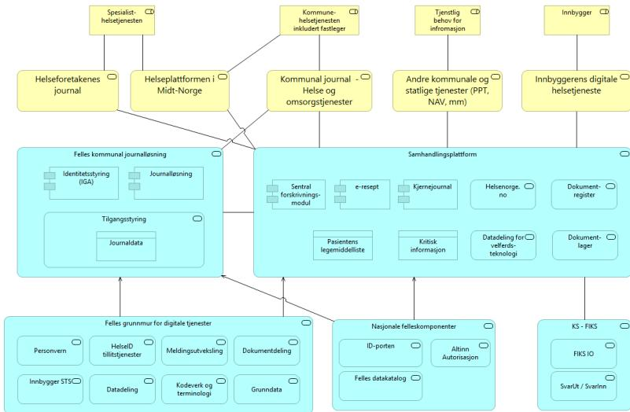
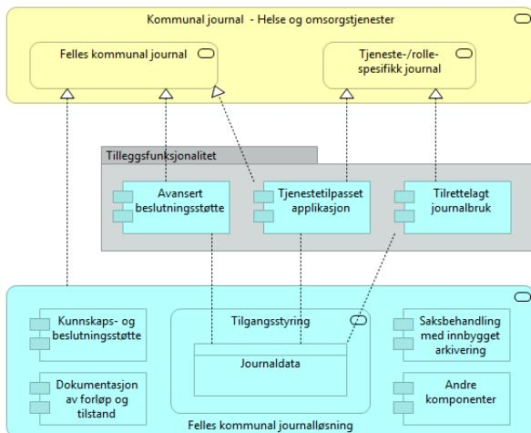

# Felles dokument fra KS, Direktoratet for e-helse og utvalgte kommuner vedrørende arkitektur for Akson

## Bakgrunn og formål

Dokumentet er utarbeidet i felleskap mellom arkitekturfunksjonen i Direktoratet for e-helse, KS og Oslo, Bærum, Bergen kommune. Dokumentet skal videre behandles i samstyringsstrukturen til kommunesektoren, herunder KS-fagråd arkitektur og KommIT-rådet.

Hensikten med dokumentet er å formidle en overordnet, omforent retning for arkitekturen i tiltaket. Dokumentet har tatt utgangspunkt i KS sitt notat om arkitektur, samt de føringer som ligger i valget av konsept fra konseptvalgutredningen – konsept 7.

Dokumentet beskriver deler av en referansearkitektur for Akson, med fokus på plattformegenskaper som er nødvendige for at konsept 7 skal kunne støtte fremtidig innovasjon og fleksibilitet. Gjennom arbeidet med dette notatet har et viktig mål vært å etablere en felles forståelse for arkitekturtilnærmingen som legges til grunn for Akson, mellom KS fagråd for arkitektur og forprosjektet til Akson.

Elementer fra notatet innarbeides i forprosjektets leveranser, med vekt på hovedproduktet sentralt styringsdokument, hvor viktige prinsipper og føringer fra dette notatet skal komme tydelig frem. Notatet vil også fungere som felles referansepunkt i videre dialog og arbeid med arkitekturen i Akson.

## Oppsummering

Hovedbudskap i dette notatet kan oppsummeres i følgende tre punkter:

1. Det er viktig å sikre at felles kommunal journalløsning og samhandlingsplattformen spiller godt sammen, og passer inn i et arkitekturlandskap for e-helse som er i løpende utvikling. Arkitekturforståelsen som legges til grunn for gjennomføring av tiltaket er basert på et økosystem hvor samhandling er navet som binder de ulike aktørene i helsesektoren sammen. De viktigste egenskaper ved samhandlingsplattformen er åpenhet og endringsevne.
2. Helhetlig samhandling vil stille krav og legge føringer for hvordan de ulike journalløsningene skal snakke sammen gjennom samhandlingsplattformen. Det må utformes og stilles tydelige myndighetskrav som alle journalløsninger må forholde seg til. Det er også viktig å rigge et tydelig eierskap til, og forvaltning av, semantiske ressurser slik som informasjonsmodeller, begreper og definisjoner av grensesnitt. Samhandlingsplattformen må være dynamisk slik at den legger til rette for en behovsdrevet helsefaglig tjenesteutvikling.
3. Det legges til grunn en plattformbasert arkitekturtilnærming som gir rammer for anskaffelsen av felles kommunal journalløsning. Denne arkitekturtilnærmingen skal bidra til å unngå en framtidig situasjon hvor tjenesteutvikling i kommunene bremses som følge av sterke bindinger og avhengighet til enkeltleverandør(er) – også her er stikkordene åpenhet og endringsevne. Spesielt er det viktig å etablere et tydelig skille mellom data og applikasjoner, gjennom å stille krav om at data fra journalkjernen skal være tilgjengelig slik at flere aktører kan konsumere på samme informasjon. Dermed kan et bredt sammensatt leverandørmarked gi drahjelp i arbeidet med å realisere innovative og framtidsrettede løsninger basert på Akson-tiltaket.

## Overordnet arkitekturbeskrivelse

Beskrivelsen av konsept 7 fra konseptvalgutredningen er førende for dette dokumentet:

*Konsept 7 skal levere helhetlig samhandling [her omtalt som samhandlingsplattformen] og en felles journalløsning for kommunal helse- og omsorgstjeneste [her omtalt som felles kommunal journalløsning]. Felles kommunal journalløsning innebærer at helsepersonell i kommunene jobber i en felles journalløsning. Dette betyr at for eksempel legevakt, fastleger, hjemmetjenesten og helsestasjoner bruker samme løsning, med brukerflater tilpasset deres behov. Samhandlingsplattformen skal understøtte løsninger for bedre samhandling i hele helsetjenesten, og gi innbyggere og helsepersonell i sykehus og kommune, samt fastleger bedre mulighet til å utveksle informasjon digitalt og til legge til rette for bedre samhandling med andre statlige og kommunale tjenester.*

Følgende overordnede retningslinjer skal være styrende for arkitekturen i Akson:

- Arkitekturmodellen som legges til grunn for hver av hoveddelene av tiltaket – journal og samhandling – er en åpen, plattformbasert tilnærming.
- Plattformene må legge til rette for at et bredt leverandørlandskap skal kunne levere innovative og fremtidsrettede tjenester i et økosystem.
- Plattformtilnærmingen for samhandlingsplattformen har som hensikt å understøtte samhandling mellom ulike aktører i helsesektoren i stort, og vil utvikles gjennom en behovsdrevet tilnærming.
- Plattformtilnærmingen for felles kommunal journalløsning skal etablere brukerfunksjonalitet for kommunal helse- og omsorgstjeneste som understøtter arbeidsprosesser, samtidig som det åpnes for fleksibel tjenesteutvikling med tilleggsfunksjonalitet for behov som ikke dekkes av felles journalløsning.

Dette svarer ut følgende føring gitt fra HOD i Tillegg 3 tildelingsbrev 2019 Direktoratet for e-helse (side 4):

*Forprosjektet bør tydeliggjøre mulighetene for at løsningen(e) tilrettelegger for fremtidig fleksibilitet, innovasjon og tjenesteutvikling, med utgangspunkt i teknologisk innovasjon og mulighetene som oppstår i markedet. Herunder vurdere nærmere muligheten for realisering av konseptet gjennom plattformtilnærminger basert på åpne standarder.*

I presentasjonen av konsept 7 er følgende figur benyttet:

![Figur 1: Samhandling sett fra felles journal. A central circle labeled 'Journalens samhandlingsplattform' contains text: 'Journallesning', 'Dokumentasjon av forløp og tilstand', 'Pasientrelatert planlegging, saksbehandling og koordinering', 'Organisering av helsepersonell, ressurser og oppgaver', and 'Kommunikasjons-, beslutnings- og fagfellesstøtte'. This central hub is connected to five surrounding groups: 1. 'Samhandling med innbygger' (top left, orange circle with people icons). 2. 'Samhandling med kommunale og statlige tjenesteområder utenfor helse- og omsorgssektoren' (top right, pink circle with icons for PPT, NAV, Barnevern, and 'Andre'). 3. 'Samhandling mellom aktørene i helsesektoren' (middle right, blue circle with cloud icons). 4. 'Integrasjon med andre kommunale løsninger' (bottom right, grey circle with icons for 'Velferdsteknologi', 'Lønn', 'Personal', 'Administrasjon', and 'Flatestyling'). 5. 'Samhandling mellom helsepersonell i samme løsning' (bottom left, pink circle with people icons).](images/Vedlegg Q Felles dokument fra KS, Direktoratet for e-helse og utvalgte kommuner vedrørende arkitektur for Akson/69edc2887e907309499ac95b47ab6905_img.jpg)

Figur 1: Samhandling sett fra felles journal. A central circle labeled 'Journalens samhandlingsplattform' contains text: 'Journallesning', 'Dokumentasjon av forløp og tilstand', 'Pasientrelatert planlegging, saksbehandling og koordinering', 'Organisering av helsepersonell, ressurser og oppgaver', and 'Kommunikasjons-, beslutnings- og fagfellesstøtte'. This central hub is connected to five surrounding groups: 1. 'Samhandling med innbygger' (top left, orange circle with people icons). 2. 'Samhandling med kommunale og statlige tjenesteområder utenfor helse- og omsorgssektoren' (top right, pink circle with icons for PPT, NAV, Barnevern, and 'Andre'). 3. 'Samhandling mellom aktørene i helsesektoren' (middle right, blue circle with cloud icons). 4. 'Integrasjon med andre kommunale løsninger' (bottom right, grey circle with icons for 'Velferdsteknologi', 'Lønn', 'Personal', 'Administrasjon', and 'Flatestyling'). 5. 'Samhandling mellom helsepersonell i samme løsning' (bottom left, pink circle with people icons).

Figur 1 Samhandling sett fra felles journal

Et alternativt perspektiv er å vektlegge samhandlingsplattformen som sentral formidler av informasjon mellom de ulike aktørene, som illustrert i figuren under.

![Figur 2: Helhetlig samhandling. A central blue box labeled 'Samhandlingsløsning(er)' contains a screenshot of a software interface. This central box is connected to five surrounding groups: 1. 'Innbygger' (top left, orange circle with people icons). 2. 'Spesialisthelsetjeneste og andre aktører i helse- og omsorgstjeneste' (top right, grey circle with icons for 'Apotek', 'Helfo', 'Private leie/lykthus', and 'Private lab / red'). 3. 'Kommunale og statlige tjenesteområder utenfor helse- og omsorgssektoren' (bottom right, pink circle with icons for PPT, NAV, Barnevern, and 'Andre'). 4. 'Kommunale helse- og omsorgstjeneste inkl. fastleger' (bottom left, pink circle with people icons). 5. 'Andre kommunale løsninger' (bottom center, grey circle with icons for 'Velferdsteknologi', 'Lønn', 'Personal', 'Administrasjon', and 'Flatestyling').](images/Vedlegg Q Felles dokument fra KS, Direktoratet for e-helse og utvalgte kommuner vedrørende arkitektur for Akson/2df09d249c38abee55dbf0526dd6da0a_img.jpg)

Figur 2: Helhetlig samhandling. A central blue box labeled 'Samhandlingsløsning(er)' contains a screenshot of a software interface. This central box is connected to five surrounding groups: 1. 'Innbygger' (top left, orange circle with people icons). 2. 'Spesialisthelsetjeneste og andre aktører i helse- og omsorgstjeneste' (top right, grey circle with icons for 'Apotek', 'Helfo', 'Private leie/lykthus', and 'Private lab / red'). 3. 'Kommunale og statlige tjenesteområder utenfor helse- og omsorgssektoren' (bottom right, pink circle with icons for PPT, NAV, Barnevern, and 'Andre'). 4. 'Kommunale helse- og omsorgstjeneste inkl. fastleger' (bottom left, pink circle with people icons). 5. 'Andre kommunale løsninger' (bottom center, grey circle with icons for 'Velferdsteknologi', 'Lønn', 'Personal', 'Administrasjon', and 'Flatestyling').

Figur 2 Helhetlig samhandling

Her kommer samhandlingsplattformens sentrale rolle klarere fram, ved at denne er navet som binder de ulike delene av helsetjenesten sammen. Dette grepet understøtter målbildet om «Pasientens helsetjeneste», ved å tilby innbyggerne en mer helhetlig opplevelse av helsetjenesten gjennom sammenstilling av informasjon fra ulike aktører – med mulighet for selv å holde seg informert om og aktivt delta i sammensatte tjenesteforløp. Det er videre en ambisjon om at samhandlingsplattformen skal legge til rette for utveksling av informasjon også med andre statlige og kommunale tjenester, som vist i figuren.

Det er to helt sentrale egenskaper som arkitekturen må understøtte, både i samhandlings- og journaldelen av tiltaket: Åpenhet og endringsevne. Dette er bakgrunnen for vektlegging av «åpen plattform» som grunnleggende arkitekturmodell for gjennomføring av tiltaket. Grunnlaget for en åpen plattform er et sett med felles tjenester, som også er tilgjengelige for, og kan benyttes av, andre plattformen innenfor samme økosystem. Innen e-helse representerer Felles grunnmur for digitale tjenester et slikt sett med tjenester:

- Tillitstjenester, som HelseID, innbygger STS (Security Token Services) og personverntjenester
- Tjenester som støtter semantisk samhandlingsevne, slik som felles kodeverk og terminologi
- Tjenester som støtter ulike former for teknisk samhandlingsevne – meldingsutveksling, dokumentdeling og datadeling

I tillegg til de felles tjenestene, er det også behov for standarder og felles retningslinjer for bruk av tjenestene - det som i grunnmuren kalles “felles krav og retningslinjer”. Blant særlig relevante standarder kan nevnes OAuth og OpenIDConnect for tillitstjenester, IHE XDS for dokumentdeling, HL7 FHIR for datadeling samt SNOMED CT for helsefaglig terminologi.

## Plattformtilnærming for samhandling

Basert på målbildet for Akson og den valgte arkitekturtilnærmingen, er det laget en overordnet skisse til referansearkitektur som søker å vise hvordan de to hovedelementene i Akson-tiltaket kan bidra inn i et helhetlig økosystem som understøtter samhandling:

The diagram illustrates an architectural perspective for 'samhandling' (collaboration). At the top, several external entities are shown in yellow boxes: 'Spesialist-helsejenesten', 'Kommune-helsejenesten inkludert fastleger', 'Tjenstlig behov for infomasjon', and 'Innbygger'. Below these are service boxes: 'Helseforetakenes journal', 'Helseplattformen i Midt-Norge', 'Kommunal journal - Helse og omsorgstjenester', 'Andre kommunale og statlige tjenester (PPT, NAV, mm)', and 'Innbyggerens digitale helsejeneste'. These connect to two main central platforms: 'Felles kommunal journallesning' (left) and 'Samhandlingsplattform' (right). The 'Felles kommunal journallesning' platform contains 'Identitetststyring (IGA)', 'Journallesning', and 'Tilgangststyring' (with 'Journaldata'). The 'Samhandlingsplattform' contains 'Sentral forskrivnings-modul', 'e-resept', 'Kjernejournal', 'Helsenorge.no', 'Dokument-register', 'Pasientens legemiddelliste', 'Kritisk informasjon', 'Datadeling for velferds-teknologi', and 'Dokument-lager'. Below these are three base platform boxes: 'Felles grunnmur for digitale tjenester' (containing 'Personvern', 'HelseID tillitstjenester', 'Meldingsutveksling', 'Dokumentdeling', 'Innbygger STS', 'Datadeling', 'Kodeverk og terminologi', 'Grunndata'), 'Nasjonale felleskomponenter' (containing 'ID-porten', 'Altinn Autorisasjon', 'Felles datakatalog'), and 'KS - FIKS' (containing 'FIKS IO', 'SvarUt / Svarinn'). Arrows indicate the flow of data and services between these components.

Architectural diagram showing the integration of various health services into a central 'Samhandlingsplattform' and 'Felles kommunal journallesning'.

Purpose - Information  
Content - Overview

Modellen er for KS - fagrådet for arkitektur, til bruk i samtale med direktoratet for e-helse sine arkitekter.  
Modellen er del av et notat hvor prinsippene står beskrevet.

**Figur 3 Arkitekturperspektiv – samhandling**

Arkitekturtegningen viser et logisk målbilde for hvordan applikasjonstjenestene Felles kommunal journalløsning og Samhandlingsplattform understøtter ulike deler av helse- og omsorgstjenesten. Den viser konseptuelt hvordan helhetlig samhandling fungerer og gir eksempler på hvordan en del sentrale komponenter understøtter tiltaket.

Den aktuelle tilnærmingen baserer seg på noen sentrale forutsetninger. Den viktigste er kanskje at det er et tydelig eierskap til og kompetent forvaltning av semantiske ressurser slik som informasjonsmodeller, begreper og definisjoner av grensesnitt. Det er naturlig å se et slikt ansvar som tett knyttet til forvaltningen av samhandlingsplattformen, da denne vil fungere som en kombinasjon av premissgiver og tilrettelegger for informasjonsutveksling mellom de ulike partene.

## **Roller og forretningstjenester**

Spesialisthelsetjenesten er representert som bruker av to ulike logiske tjenester. Disse er Helseplattformen i Midt-Norge, samt journaltjenesten for helseforetak i de andre helseregionene som per i dag er basert på DIPS. Helseplattformen understøtter i tillegg den kommunale helsetjenesten i Midt-Norge. Både helseforetakenes journaler og Helseplattformen benytter seg av samhandlingsplattformen for utveksling av informasjon med andre aktører. I tillegg vil andre kommunale og statlige tjenester kunne få tilgang til journaldata gjennom samhandlingsplattformen, gitt at de har tjenstlig behov for dette.

Kommunalt helsepersonell utenfor Midt-Norge benytter enten egne journalløsninger, eller den nasjonale tjenesten felles kommunal journalløsning. De som bruker eget journalsystem, får funksjonalitet for samhandling gjennom det som til enhver tid er tilgjengelig av tjenester i samhandlingsplattformen. De aktører i kommunal helsetjeneste som benytter felles kommunal journalløsning vil få ytterligere samhandlingsfunksjonalitet internt i denne løsningen.

### **Beskrivelse av aktører**

- Spesialisthelsetjenesten er den delen av helsetjenesten som har ansvar for somatiske og psykiatriske sykehus, avtalespesialister, andre institusjoner samt ambulansetjenesten.
- Kommunehelsetjenesten er kommunalt helsepersonell, fastleger og andre aktører som utfører de kommunale helse- og omsorgstjenester som omfattes av Akson-tiltaket.
- Tjenstlig behov representerer andre aktører som har tjenstlig behov for tilgang til journaldata.

### **Beskrivelse av tjenester**

- Felles kommunal journalløsning representerer et eller flere integrerte journalsystemer som understøtter planlegging, administrasjon, gjennomføring og dokumentasjon av helsehjelp til enkeltpersoner. Tjenesten tar utgangspunkt i behovene i kommunal helse- og omsorgstjeneste.
- Samhandlingsplattformen representerer det sentrale navet for helhetlig samhandling i helsesektoren. Plattformen ivaretar tekniske og semantiske krav til overføring av informasjon mellom behandlingsrettede registre, og vil også være et behandlingsrettet register i seg selv.
- Identitets- og tilgangsstyring håndterer oppretting og administrasjon av identiteter som skal bruke felles journalløsning. Løsningen har funksjonalitet for logging, analyse og en rekke sikkerhetstjenester.

Felles grunnmur må ligge til grunn for begge hovedelementene, da tjenestene grunnmuren tilbyr er forutsetninger for både felles journalløsning og samhandlingsplattformen. Nasjonale

felleskomponenter og elementer fra FIKS-plattformen vil også kunne knyttes inn som del av økosystemet.

## Byggeklosser i Felles grunnmur

- Personvernkomponenten tilbyr tjenester for innbyggeres personverninnstillinger. Innbygger kan her sette sine ønsker for sperring av journal og dele ut og trekke tilbake fullmakter.
- HelselD er en fellesløsning for API-sikring for helsesektoren. Den tilbyr selvbetjening av API-er gir klienter tilgang til å kalle et API. Det vil i miljøet rundt HelselD bygges en omforent tillitsmodell som sikrer et felles sikkerhetsnivå mellom aktører som benytter samhandlingsløsningene.
- Meldingsutveksling tilbyr tjenester for å kunne sende elektroniske meldinger med definert innhold mellom to parter.
- Dokumentdeling tilbyr tjenester for å kunne dele hele dokumenter, som tekstfiler, bilder, PDF, og lignende mellom to eller flere parter.
- Datadeling er en tjeneste hvor helsesektoren kan dele strukturerte data på tvers mellom virksomheter og omsorgsnivå i et nasjonalt perspektiv.
- Innbygger STS er en tillitsøkende tjeneste som utsteder bevis på innlogget bruker og eventuelt hvem innbygger representerer.
- Grunndata består av flere registre og tjenester. De tilbyr informasjonstjenestene Person, Personell og Virksomhet for helsetjenesten basert på informasjon i disse registrene. Tjeneste brukes til å berike informasjon om de ulike aktørene, eller som en del av tillitstjenestene for identifisering og å gi tilgang.
- Kodeverk og terminologi er et sett med nødvendige standardiserte kodeverk og terminologier som skal sikre korrekt og konsistent bruk av standardiserte termer i relevante fagsystemer.

## Plattformtilnærming for felles kommunal journalløsning

Felles kommunal journalløsning baserer seg på følgende arkitekturprinsipper:

- **Helhetlig forvaltning av helseopplysninger.** Innbyggerens helseopplysninger, informasjon om virksomheten, ressurser og helsepersonell som er nødvendig for å yte helse- og omsorgshjelp skal forvaltes helhetlig i felles journalløsning uavhengig av valgt leverandør. Det må også være mulig å trekke alle dataene ut av valgt løsning, for eksempel ved fremtidig behov for overgang til en annen journalløsning. Felles journalløsning skal også ha muligheten til å benytte informasjon som er en del av grunndataene i helse- og omsorgstjenesten.
- **Enhetlig tilgangsstyring i tråd med krav til informasjonssikkerhet og innebygd personvern.** Journal løsningen skal tilby avanserte muligheter til å styre tilganger til helseopplysningene og levere informasjonssikkerhetstjenester.
- **Åpne grensesnitt.** Data fra kjernen skal i størst mulig grad være tilgjengelige gjennom API-er for å kunne understøtte utvikling av tilleggsfunksjonalitet og integrasjon med andre løsninger (innenfor regler for taushetsplikt), herunder med administrative systemer i kommunene. Grensesnittene som tilbys bør være i henhold til beskrivelsen i Direktoratet for e-helses veileder for åpne API, for å sikre tilstrekkelig åpenhet. Definisjon av hvilke data og funksjoner i kjernen som skal tilbys gjennom åpne grensesnitt vil være et fokusområde i den videre prosessen.
- **Mulighet for å kunne ta i bruk tredjepartsapplikasjoner.** Funksjonaliteten i og rundt den felles journal løsningen vil videreutvikles og tilpasses over tid. Valgt leverandør vil ha ansvar for å videreutvikle og forbedre selve løsningen, mens andre leverandører kan tilby ulike

former for tilleggsfunksjonalitet basert på åpne API inn mot felles journaldata i den felles journalløsningen. En slik ekstern tilleggsfunksjonalitet kan være avanserte løsninger for beslutningsstøtte som går utover det som leveres som del av plattformen, eksempelvis tolkning av radiologibilder ved bruk av kunstig intelligens.

Figuren under illustrerer ønskede egenskaper ved plattformen – åpenhet og endringsevne. Funksjonaliteten i og rundt felles kommunal journalløsning vil videreutvikles og tilpasses over tid. Valgt leverandør vil ha ansvar for å videreutvikle og forbedre selve plattformen, mens andre leverandører kan tilby ulike former for tilleggsfunksjonalitet basert på åpne API inn mot felles journaldata i plattformen.

The diagram illustrates the architectural perspective of a common municipal journal solution. It consists of three main layers:

- Top Layer (Yellow):** 'Kommunal journal - Helse og omsorgstjenester'. It contains two components: 'Felles kommunal journal' and 'Tjeneste-/rolle-spesifikk journal'.
- Middle Layer (Grey):** 'Tilleggsfunksjonalitet'. It contains three components: 'Avansert beslutningsstøtte', 'Tjenestetilpasset applikasjon', and 'Tilrettelagt journalbruk'.
- Bottom Layer (Light Blue):** 'Felles kommunal journalløsning'. It contains several components: 'Kunnskaps- og beslutningsstøtte', 'Dokumentasjon av forløp og tilstand', 'Tilgangsstyring' (which contains 'Journaldata'), and 'Saksbehandling med innbygget arkivering' and 'Andre komponenter'.

Arrows indicate the relationships and data flow between these components, showing how the additional functionality and specific journal types interact with the underlying common solution.

Architectural diagram showing the relationship between 'Kommunal journal - Helse og omsorgstjenester', 'Tilleggsfunksjonalitet', and 'Felles kommunal journalløsning'.

Figur 4 Arkitekturperspektiv – Eksempel på bruk av felles kommunal journalløsning realisert som en plattform

Applikasjonstjenesten **Felles kommunal journalløsning** vil kunne bestå av flere elementer: Felles journaldata, tjenester for tilgangsstyring samt ulike funksjonelle komponenter / applikasjoner som sammen utgjør helheten i det som leveres fra valgt leverandør. I figuren over er det vist noen mulige komponenter som eksempel på dette prinsippet, dette bildet er ikke ment å være komplett.

Forretningstjenesten **Felles kommunal journal** benytter Felles kommunal journalløsning som hovedverktøy. I utgangspunktet tilbyr tjenesten kun den løsningen som omfattes av tiltakets anskaffelse, men etter hvert kan tjenesten berikes og suppleres med ekstern **tilleggsfunksjonalitet**. En slik funksjonalitet kan være avanserte løsninger for beslutningsstøtte som går utover det som leveres som del av plattformen, eksempelvis tolkning av radiologibilder ved bruk av kunstig intelligens. Tilleggsfunksjonalitet har tilgang til journaldata fra Felles kommunal journalløsning gjennom åpne grensesnitt som plattformen tilbyr.

**Tjeneste-/rollespesifikk journal** er en tjeneste som tilbyr alternativ tilgang til og bruk av felles journaldata og funksjonalitet i plattformen, uten å være bundet til applikasjoner som leveres sammen med (av samme leverandør som) plattformen. Dette krever at andre leverandører utvikler og tilbyr applikasjoner som gir tilstrekkelig støtte til tjenesteutførelsen, i figuren er slike applikasjoner eksemplifisert gjennom

- **Tjenestetilpasset applikasjon**, et generelt begrep for å betegne mer spesialiserte applikasjoner som kan bygges på plattformens åpne grensesnitt. Disse kan enten erstatte eller supplere funksjonalitet som finnes på plattformen.
- **Tilrettelagt journalbruk**, en applikasjon som kan være tjenesteutovers hovedverktøy i hverdagen, enten alene eller med støtte fra en eller flere tjenestetilpassede applikasjoner.

## Definisjon av begreper

|                         |                                                                                                                                                                                                                                                                                                                                                                                                                                                                                                                   |
|-------------------------|-------------------------------------------------------------------------------------------------------------------------------------------------------------------------------------------------------------------------------------------------------------------------------------------------------------------------------------------------------------------------------------------------------------------------------------------------------------------------------------------------------------------|
| Økosystem               | I dette notatet brukes begrepet i betydningen “digitalt økosystem”, typisk basert på en eller flere digitale plattformen som danner grunnlag for at ulike typer aktører (og deres respektive IT-løsninger) knyttes sammen i verdiøkende nettverk. Se også <b>Bygstad</b> -referansen under.                                                                                                                                                                                                                    |
| Åpen plattform          | En åpen plattform tilbyr en digital infrastruktur med tilhørende tjenester som er basert på åpne, publiserte standarder som alle i prinsippet kan benytte for å ta i bruk plattformen. Plattformen gjør det mulig å knytte sammen applikasjoner og tjenester fra mange forskjellige leverandører, og understøtter deling av data på definerte, standardiserte formater – med bruk av felles tillitstjenester og terminologi. For mer utfyllende beskrivelse og eksempler, se <b>Apperta</b> -referansen under. |
| Samhandlingsplattform   | Begrepet brukes i dette notatet om den ene hoveddelen av Akson-tiltaket, som dreier seg om å realisere en åpen plattform for samhandling basert på den felles grunnmuren.                                                                                                                                                                                                                                                                                                                                         |
| Felles grunnmur         | Med “Felles grunnmur” menes i dette notatet Felles grunnmur for digitale tjenester, som er omtalt i den nasjonale e-helsestrategien og nærmere beskrevet i plan for felles grunnmur – se referanser under.                                                                                                                                                                                                                                                                                                        |
| Felles kommunal journal | Begrepet omtaler den samlede løsningen for elektronisk pasientjournal i kommunal helse- og omsorgstjeneste utenfor Midt-Norge                                                                                                                                                                                                                                                                                                                                                                                     |

## Referanser:

**Apperta** – beskrivelse av et konsept for **åpen plattform** rettet mot e-helseområdet:

[https://apperta.org/assets/Apperta\\_Defining\\_an\\_Open\\_Platform\\_April.pdf](https://apperta.org/assets/Apperta_Defining_an_Open_Platform_April.pdf)

**Bygstad** – om digitale **økosystemer** og **plattformen**:

<https://www.uio.no/studier/emner/matnat/ifi/INEC1820/h18/timeplan/9--plattformen-og-okosystemer-2018-bygstad.pdf>

The logo consists of two parts: on the left, a dark blue square containing the white letters 'KS'; on the right, a white square containing a circular chain icon.

KS logo and a circular chain icon

### **Felles grunnmur for digitale tjenester:**

<https://ehelse.no/strategi/nasjonal-e-helsestrategi-og-handlingsplan-2017-2022>

<https://ehelse.no/publikasjoner/plan-for-utvikling-av-felles-grunnmur-for-digitale-tjenester-i-helse-og-omsorgstjenesten>