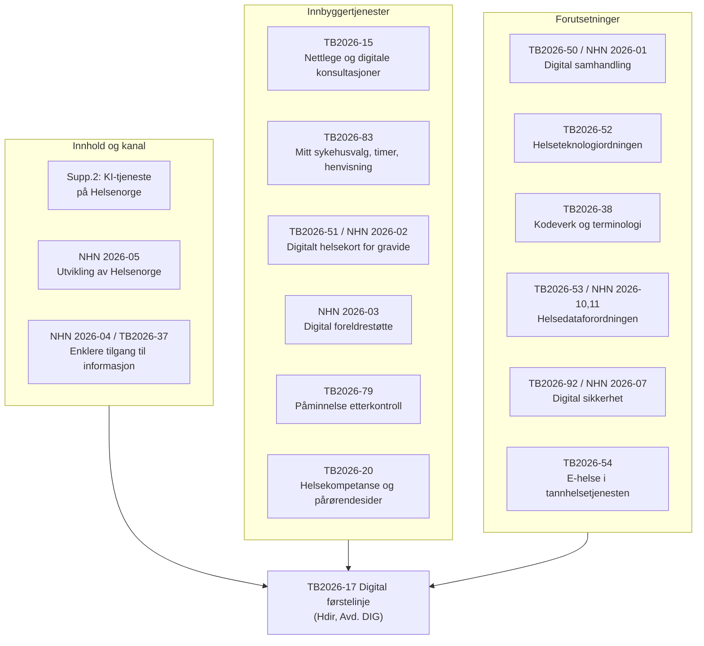

# TB2026-17 Digital førstelinje – innhold og relaterte oppdrag

Kilder (kun tildelings-/oppdragsdokumenter for Hdir og NHN):

- `2026-Helsedirektoratet-tildelingsbrev.pdf.md`
- `2026-Helsedirektoratet-supplerende-1.md` … `-4.md`
- `2026-Norsk-helsenett-oppdragsdokument.md` (+ `-korrigert-`)

---

## 1. TB2026-17 Digital førstelinje (Hdir, Avd. HOD: DIG, frist 31.12.2026)

### Formål

> «Helsedirektoratet skal iverksette tiltak for å tilrettelegge for digitale helsetjenester som gir innbyggerne mulighet til å ta en aktiv rolle i egen og næres helse. Digitale helsetjenester skal styrke helse- og omsorgstjenestens evne til å yte helsehjelp til flere, med god kvalitet. Samtidig skal Helsedirektoratet bidra til utvikling av sammenhengende, tilgjengelige og bærekraftige digitale løsninger som støtter både innbyggernes behov og helsepersonellets arbeidshverdag.»

### Deloppdrag

| # | Deloppdrag | Kjerne |
|---|---|---|
| 1 | Følge opp rapporten «En offentlig KI-tjeneste for helserelaterte spørsmål på Helsenorge» (mottatt 8.10.2025) | KI-basert innbyggertjeneste på Helsenorge |
| 2 | Legge til rette for økt bruk av **digitale selvhjelps- og behandlingsverktøy** – stegvis; vurdere finansiering, kvalitetssikring, prioritering, ansvar, implementering, effektevaluering; utrede bruk av eksisterende ordninger; «tiltak for et bærekraftig økosystem og næringsliv» | Marked/økosystem for verktøy |
| 3 | Følge opp utvalgte tiltak i rapporten «Økt bruk av kvalitetssikrede digitale løsninger innen psykisk helse og rus/avhengighet» (1.12.2025) | Psykisk helse og rus |
| 4 | «spesiell oppmerksomhet knyttet til løsninger som understøtter forebygging, øker helsekompetanse og legger til rette for mestring av egen helse» | Forebygging og helsekompetanse |
| 5 | «Det skal etableres et første trinn av en **digital veiviser** inn til helsetjenestene som kan fungere på tvers av områdene 1-4 og nettlegen. Formålet på sikt er å bidra til at innbyggere enklere finner riktig tjeneste for deres behov.» | Veiviser / triage |

Samarbeidskrav: «Helsedirektoratet skal samarbeide med Norsk helsenett SF om hvordan behovet realiseres på Helsenorge.»

### Sentrale mål utledet

1. Innbyggeren skal kunne ta aktiv rolle i egen helse (selvbetjening, mestring, helsekompetanse).
2. Kapasitetsavlastning – «yte helsehjelp til flere, med god kvalitet».
3. Sammenhengende, tilgjengelige og bærekraftige digitale løsninger for både innbygger og helsepersonell.
4. Én vei inn: digital veiviser som samler KI-tjeneste, selvhjelpsverktøy, psykisk helse/rus og nettlege.
5. Realisering skjer på Helsenorge, sammen med NHN.

### Presisering i supplerende tildelingsbrev nr. 2

Overskrift der: **«TB2026-17 Utredning offentlig KI-tjeneste for helserelaterte spørsmål på Helsenorge»**. Delleveranser:

| Leveranse | Frist |
|---|---|
| Bistå NHN med å identifisere kvalitetssikrede medisinske/helsefaglige kilder som basis for KI-søk (sammen med FHI) | 15.6.2026 |
| Beskrive rollefordeling og forvaltningsmodell for medisinsk og helsefaglig innhold på Helsenorge, inkl. Hdir sin utgiverrolle | 1.10.2026 |
| Anbefale plassering av nasjonalt ansvar for kunnskaps- og informasjonsforvaltning som grunnlag for målrettede helseråd | 1.10.2026 |
| «Anbefale organiseringen av en nasjonal KI-tjeneste som tilbyr målrettede helseråd. **Dette må ses i sammenheng med oppdrag om digital førstelinje.**» | 1.11.2026 |
| Vurdere juridiske endringer, med utgangspunkt i ny bestemmelse i pasientjournalloven | 1.6.2026 |

Konseptskisse for lovbestemmelse: «Helsedirektoratet er ansvarlig for en KI-basert tjeneste med individuelle helseråd. Tjenesten skal benytte Helsenorge og være basert på kvalitetssikret informasjon.»

---

## 2. Norsk helsenett – oppdrag med relasjon til digital førstelinje

| ID | Oppdrag | Hovedmål | Relasjon til digital førstelinje | Sitat |
|---|---|---|---|---|
| **2026-05** | Utvikling av Helsenorge | Etablere første versjon av KI-tjeneste for tilgang til generell helseinformasjon og verktøy på Helsenorge (frist 1.6.2026) + forslag til drift-/forvaltningsmodell (1.10.2026) | **Eksplisitt kobling.** NHN er utførende part på Helsenorge og skal støtte Hdir | «Det vises også til arbeidet med digitalt førstevalg/digital førstelinje som følges opp av Helsedirektoratet.» … «bistå Helsedirektoratet med oppdraget digitalt førstevalg/digital førstelinje.» |
| **2026-04** | Enklere tilgang til informasjon (Alvorlig sykt barn) | KI-basert innsamling og presentasjon av informasjon fra mange offentlige kilder; foreslå drift-/forvaltningsmodell (1.9.2026) | Fungerende prototype på «digital veiviser»-konseptet – tverrsektoriell, gjenbrukbar kildekode | «skal ved bruk av kunstig intelligens legge til rette for innsamling og presentasjon av relevant informasjon fra et stort antall offentlige kilder … viser innhold fra mange sektorer i én tjeneste» |
| **2026-01** | Digital samhandling | Øke bruk av pasientens legemiddelliste, prøvesvar, journaldokumenter, kritiske informasjon og måledata | Datagrunnlaget innbyggertjenestene på Helsenorge viser og bygger på | «Norsk helsenett SF er nasjonal tjenesteleverandør og ansvarlig for infrastruktur for samhandling i helse- og omsorgssektoren.» |
| **2026-02** | Digitalt helsekort for gravide | Erstatte papirskjema; innføring starter 2026, landsdekkende 2027 | Konkret digital innbyggertjeneste i førstelinjen (svangerskap/barsel) | «gjøre informasjonen mer tilgjengelig for helsepersonell og den gravide gjennom svangerskap, fødsel og barsel» |
| **2026-03** | Digital foreldrestøtte | Kvalitetssikret digital foreldrestøtte, i samarbeid med Hdir | Digitalt selvhjelps-/veiledningstilbud levert via Helsenorge | «skal tilgjengeliggjøres via Helsenorge» |
| **2026-07** | Digital sikkerhet (Helse- og KommuneCERT) | Overvåkning, bistand til kommuner og små virksomheter | Tillitsforutsetning for digitale innbyggertjenester; kobles til Hdirs kartlegging | «Bistå inn i Helsedirektoratets kartlegging av digital sikkerhet i små virksomheter» |
| **2026-10 / 2026-11** | MyHealth@EU / helsedataforordningen | Deling av pasientoppsummeringer og e-resepter over landegrenser; forberede helsedataforordningen | Utvider innbyggerens digitale tilgang til egne helseopplysninger | «enkeltpersoner få tilgang til egne helseopplysninger og mulighet til å dele helseopplysninger med helsepersonell i andre EU/EØS-land» |
| **2026-06** | Kostnader og prismodeller for nasjonale e-helseløsninger | Prismodell og beregningsgrunnlag | Finansieringsmodellen for Helsenorge og øvrige fellesløsninger | – |

Korrigert oppdragsdokument (16.3.2026) endrer kun beløp for Digital foreldrestøtte (4,1 → 3,6 mill. kr).

---

## 3. Helsedirektoratet – øvrige oppdrag med relasjon til digital førstelinje

| Oppdrag | Avd. | Hovedmål | Relasjon til digital førstelinje | Sitat |
|---|---|---|---|---|
| **TB2026-15** Allmennlegetjenesten (Meld. St. 23) | KTA | Følge opp allmennlegemeldingen | **Direkte kobling:** nettlegen inngår eksplisitt i veiviseren i TB2026-17 pkt. 5. Punkt 6–7 gjelder nettlege og faglig veileder for digitale konsultasjoner. Punkt 8 gjelder digital sikkerhet i små virksomheter (fastlegekontor) | «Utprøvingen av kommunal nettlege videreføres.» / «Helse- og omsorgsdepartementet ber … Helsedirektoratet om å gjøre en vurdering av om det foreligger et behov for en nasjonal faglig veileder for digitale konsultasjoner. Frist … 1.4.2026» |
| **TB2026-20** Bo trygt hjemme-reformen | KTA | Eldreløftet: ernæring, forebyggende hjemmebesøk, pårørende | Tre deloppdrag treffer førstelinjen direkte: digitalisering av forebyggende hjemmebesøk, helsekompetanse via helsenorge.no, og gjennomgang av pårørendesidene på Helsenorge | «Utrede og anbefale hvordan forebyggende hjemmebesøk kan digitaliseres …» / «Vurdere hvordan informasjon på helsenorge.no kan utarbeides for å heve helsekompetansen til eldre og deres pårørende … om helsefremmende og forebyggende tiltak og digitale selvhjelpsløsninger.» / «Gjennomgå pårørendesidene på Helsenorge … med formål å videreutvikle den slik at den blir lett tilgjengelig … i norsk klarspråk og på flere språk» |
| **TB2026-37** Sammenhengende tjenester på tvers av sektorer | **DIG** | Sammenhengende digitale tjenester på tvers av offentlig sektor (Fremtidens digitale Norge) | Hdir sin rolle i ETI (samme tjenestekonsept som veiviseren) og forvaltning av ETI-rådet | «bidra inn i Norsk helsenett SF sitt arbeid med «Enklere tilgang til informasjon (ETI)» … og forvalte et samarbeidsråd for aktørene» |
| **TB2026-38** Informasjonsforvaltning, kodeverk og terminologi | **DIG** | ICD-11, helhetlig strategi for kodesystemer og standarder | Semantisk grunnlag for at KI-tjeneste og veiviser kan tolke og gjenbruke innhold på tvers | «fastsette en helhetlig strategi for kodesystemer og standarder med formål å tydeliggjøre og sikre sammenhenger» |
| **TB2026-50** Digital samhandling | **DIG** | Pådriverrolle for innføring av de fem nasjonale samhandlingstjenestene | Leverer datagrunnlaget innbyggeren møter på Helsenorge; samme mandatstyring som NHN 2026-01 | «En sentral oppgave i 2026 er å øke bruken av de nasjonale samhandlingstjenestene. Det er viktig at løsningene tas i bruk i sykehusene og kommunene slik at helsepersonell slipper å bruke unødvendig tid på å lete etter nødvendig informasjon.» |
| **TB2026-51** Digitalt helsekort for gravide | **DIG** | Anbefaling om innføring, forskriftsendringer, normerende produkter | Konkret innbyggerrettet digital tjeneste; Hdir-siden av NHN 2026-02 | «Målet … er å tilby helsepersonell og den gravide digitale informasjonstjenester som støtter forløpet for svangerskap og fødsel mer helhetlig.» |
| **TB2026-52** Helseteknologiordningen | **DIG** | Veilednings- og godkjenningsordning for helseteknologi | Kvalitets- og godkjenningsmekanismen for digitale selvhjelps- og behandlingsverktøy (TB2026-17 pkt. 2) og for økosystem/næringsliv | «viktig virkemiddel for å innføre tidsbesparende teknologi og skape forutsigbarhet for helse- og omsorgstjenesten og leverandører om aktuelle krav og standarder, digital sikkerhet og personvern» + «vurdere og anbefale hvordan brukervennlighet i digitale løsninger for helsepersonell kan måles» |
| **TB2026-53** Helsedataforordningen | **DIG** | Digital helsemyndighet og markedstilsynsmyndighet; MyHealth@EU | Regulatorisk ramme for innbyggerens tilgang til og deling av egne helsedata | «Helsedirektoratet er nasjonalt kontaktpunkt og dataansvarlig for tjenesten MyHealth@EU.» |
| **TB2026-54** E-helseløsninger i tannhelsetjenesten | **DIG** | Vurdere hvilke nasjonale e-helseløsninger som er relevante for tannhelse (frist 1.6.2026) | Utvider førstelinjens digitale dekning til en tjeneste som i dag står utenfor fellesløsningene | «Stortinget har bedt om at relevante nasjonale e-helseløsninger blir tilrettelagt for bruk i tannhelsetjenestene» |
| **TB2026-79** Påminnelse etterkontroll etter fødsel (supp. 4) | **DIG** | Foreslå påminnelsesordning via Helsenorge, sammen med NHN (frist 1.10.2026) | Proaktiv, avsenderstyrt innbyggertjeneste på Helsenorge – konkret førstelinjefunksjonalitet | «etablere en påminnelsesordning for etterkontroll via Helsenorge, der mor informeres om muligheten til å bestille etterkontroll hos fastlege eller jordmor/helsestasjon, med Helsedirektoratet som avsender» |
| **TB2026-83** Ventetidsarbeid / Mitt sykehusvalg (supp. 4) | SHA | Nytt ventetidsmål; videreutvikle «Mitt sykehusvalg»; gjennomføringsplan 1.10.2026 | Største innbyggerrettede tjenesteløftet på Helsenorge i 2026–2028: digital henvisning, ombooking, timeavtaleløsning, kalenderfunksjonalitet. Ledes av Hdir sammen med NHN | «Kalenderfunksjonaliteten på Helsenorge rulles ut i løpet av 2026 og 2027.» / delelementer: «Digital henvisning», «Nasjonal innføring av digital ombooking», «Nasjonal innføring av ny timeavtaleløsning» / «gjennomføres i samarbeid mellom Helsedirektoratet og NHN … for å sikre en bedre brukeropplevelse» |
| **TB2026-92** Digital sikkerhet og beredskap (supp. 4) | ASI | Foreslå nasjonalt spesialisert planverk for hendelser innen digital sikkerhet (frist 1.12.2026) | Beredskap for de digitale tjenestene innbyggeren er avhengig av | «Helsedirektoratet skal, i samarbeid med Norsk helsenett SF, foreslå hvordan nasjonalt spesialisert planverk for håndtering av hendelser innen digital sikkerhet og beredskap kan utvikles.» |

---

## 4. Relasjonsbildet

---

## 5. Konklusjon

- TB2026-17 er formulert som et **innbygger- og kapasitetsoppdrag**, ikke et infrastrukturoppdrag: KI-tjeneste, selvhjelps- og behandlingsverktøy, psykisk helse/rus, forebygging/helsekompetanse, og en **digital veiviser** som binder disse sammen med nettlegen.
- **Digital veiviser (deloppdrag 5)** er navet: den forutsetter innhold fra deloppdrag 1–4, nettlegen fra TB2026-15, og realisering på Helsenorge sammen med NHN.
- **Sterkeste eksplisitte koblinger:** NHN 2026-05 («bistå Helsedirektoratet med oppdraget digitalt førstevalg/digital førstelinje») og supp. 2 («Dette må ses i sammenheng med oppdrag om digital førstelinje»).
- **Nærmeste beslektede oppdrag uten eksplisitt kobling:** TB2026-83 (Mitt sykehusvalg, digital henvisning/ombooking/timer på Helsenorge) og TB2026-37/NHN 2026-04 (ETI), som i praksis realiserer samme veiviser- og selvbetjeningsambisjon på tilgrensende områder.
- **Forutsetninger:** TB2026-50/NHN 2026-01 (data), TB2026-52 (godkjenning av verktøy), TB2026-38 (kodeverk), TB2026-53 (regulatorisk), TB2026-92/NHN 2026-07 (sikkerhet).
- Uavklart i dokumentene: «Departementet vil ha dialog med Helsedirektoratet om innretning på og frist for oppdraget» – innretning og prioritering av TB2026-17 fastsettes i dialog, med samlet frist 31.12.2026.
