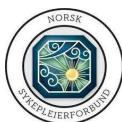
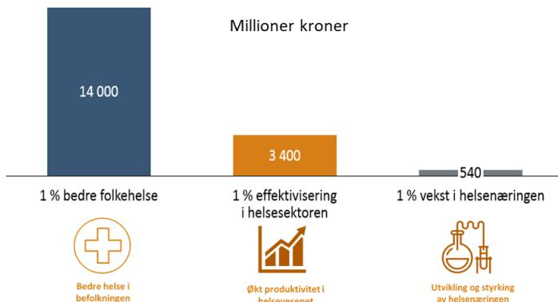
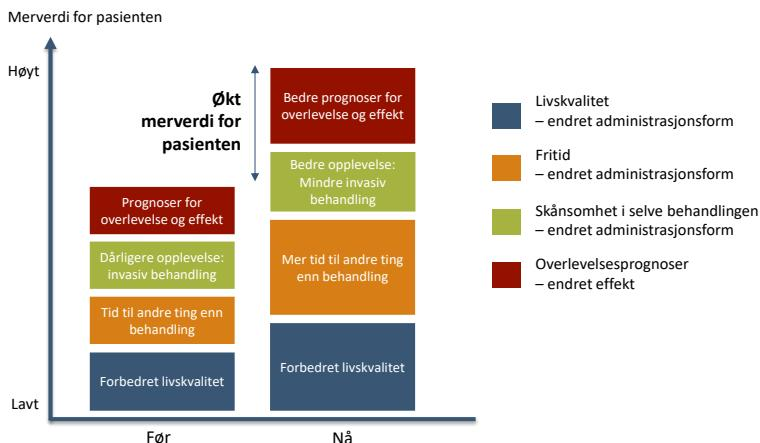
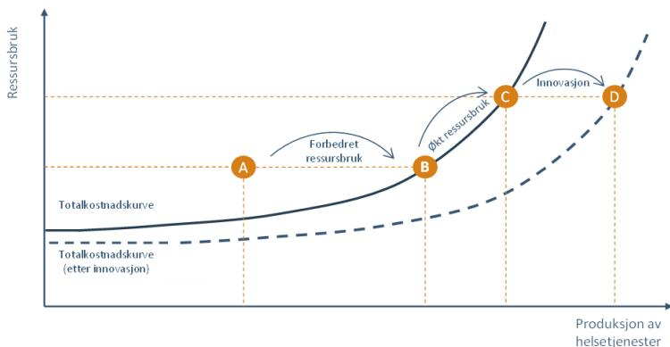
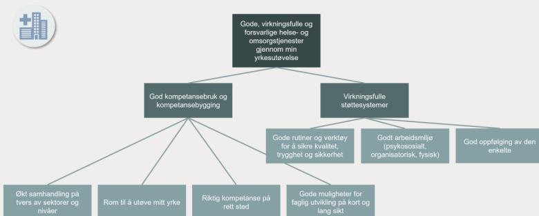
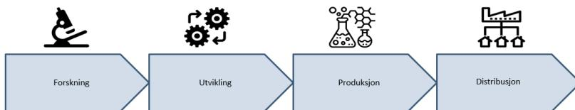
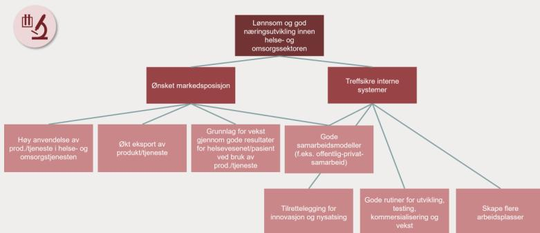
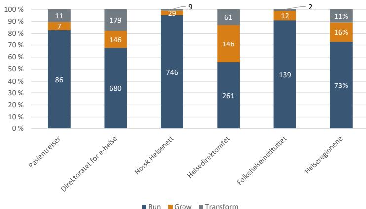

# TEKNOLOGI OG INNOVASJON I HELSE- OG OMSORGSSSEKTOREN – MULIGHETER OG BARRIERER

Et samarbeidsprosjekt mellom Norsk Sykepleierforbund og Næringslivets  
Hovedorganisasjon


A photograph of a female nurse with blonde hair, wearing blue medical scrubs, smiling and holding a tablet computer. She is interacting with a patient, whose back is partially visible on the right side of the frame. The setting appears to be a clinical environment with white curtains in the background.

A smiling female nurse in blue scrubs holding a tablet, interacting with a patient.


Orange arrow pointing right

## Forord

Helsesektoren står ovenfor store kapasitetsutfordringer de kommende årene. Pandemien har gitt oss en liten forsmak på det som skal komme. Samtidig ser vi at teknologi og smartere organisering kan representere uante muligheter for helsesektoren. Vi har også fått noen eksempler på dette gjennom pandemien. Vi ser også at innovasjon i helsesektoren kan bidra til å skape nye arbeidsplasser hos leverandørene av teknologi og nye løsninger, i norsk helsenæring.

Sammen står Norsk Sykepleierforbund (NSF) og Næringslivets Hovedorganisasjon (NHO) i en unik posisjon til å skape dialog mellom helsetjenesten og helsenæringen, hvor dialog og samhandling er en kritisk forutsetning for å realisere innovasjon i helse- og omsorgssektoren. Samtidig vil samarbeidskonstellasjonen måtte navigere i et landskap av potensielle gevinster, barrierer og pågående initiativer fra myndighetenes side.

Dette notatet har som formål å bistå NSF og NHO i akkurat denne navigeringen. Notatet skal fungere som et kunnskapsgrunnlag og en referanse for NSF og NHOs videre arbeid i å realisere gevinster knyttet til teknologi og innovasjon i helse- og omsorgssektoren gjennom å beskrive et mulighetsrom, potensielle barrierer og mulige ambisjoner for å styrke helsetjenesten og helsenæringen.

Notatet representerer et *startpunkt* for en videre dialog som de to organisasjonene ønsker å føre med alle interessenter som vil bidra til å formulere og realisere ambisjonene vi som nasjon bør sette oss når det gjelder å ta i bruk teknologi for å skape en bedre og mer bærekraftig helse- og omsorgssektor i årene fremover mot 2030. Notatet er dermed verken et heldekkende kunnskapsgrunnlag om teknologiske muligheter i helse- og omsorgssektoren eller et ferdig veikart for realisering av gevinster. Til dette arbeidet er det behov for en bredere involvering av interessenter.

Vi takker for dialog og deltakelse inn i prosjektet, spesielt fra referansegruppen som deltok i en workshop-serie for å belyse og detaljere gevinst- og barrierebildet i helsesektoren sett fra et helsetjeneste-, helsenærings- og samfunnsperspektiv.

---

Februar 2022



Logo for Norsk Sykepleierforbund (NSF)


Logo for NHO

## Innhold

|          |                                                                                                     |           |
|----------|-----------------------------------------------------------------------------------------------------|-----------|
| <b>1</b> | <b>INNLEDNING</b>                                                                                   | <b>3</b>  |
| 1.1      | Teknologisk utvikling har vært og vil fortsatt bli en viktig del av svaret                          | 4         |
| 1.2      | Pandemien som en katalysator for digitalisering i helsesektoren                                     | 5         |
| 1.3      | «Helseteknologi» og teknologibasert innovasjon i helse- og omsorgssektoren                          | 7         |
| 1.4      | Status Norge: Satsingsområder og strategier                                                         | 8         |
| 1.5      | NSF og NHO sin rolle                                                                                | 10        |
| <b>2</b> | <b>GEVINSTER – MULIGHETSROMMET</b>                                                                  | <b>11</b> |
| 2.1      | Helseteknologi fører til merverdi for pasienten                                                     | 12        |
| 2.2      | Teknologi og innovasjon gjør det mulig å øke kvaliteten på helsetjenestene uten å øke ressursbruken | 15        |
| 2.3      | Helsenæringen skaper inntekter og arbeidsplasser                                                    | 17        |
| <b>3</b> | <b>BARRIERER SOM MÅ OVERKOMMES</b>                                                                  | <b>20</b> |
| 3.1      | Manglende økonomisk handlingsrom                                                                    | 20        |
| 3.2      | Kultur og ledelse                                                                                   | 21        |
| 3.3      | Manglende forankring                                                                                | 23        |
| 3.4      | «Silotenking» og sektorsperrer                                                                      | 23        |
| 3.5      | Eksisterende teknisk infrastruktur og «teknisk gjeld»                                               | 23        |
| 3.6      | Lovverk                                                                                             | 25        |
| 3.7      | Svak markedstilgang                                                                                 | 25        |
| 3.8      | Mangel på skaleringskapital                                                                         | 26        |
| 3.9      | Teknologi for kompetanse, og kompetanse for teknologi                                               | 26        |
| <b>4</b> | <b>VEIEN VIDERE</b>                                                                                 | <b>30</b> |
| 4.1      | Veien mot 2030                                                                                      | 30        |
| 4.2      | Ambisjoner og tiltaksområder (nytt forsøk)                                                          | 31        |
| <b>5</b> | <b>VEDLEGG: NÆRMERE OM HELSETEKNOLOGI</b>                                                           | <b>34</b> |

# 1 Innledning

Frem mot 2030 vil kapasitetsutfordringer i helsevesenet bli stadig større. Vi ser allerede konturene av utfordringsbildet i dag og pandemien har forsterket dette bildet. Vi må finne smartere måter å arbeide på for å løse de store utfordringene som denne sektoren nå står overfor. Innovasjon og teknologi vil være en viktig del av løsningen.

Pandemien har vist oss at det er mulig å sette opp farten på både utvikling og implementering av muliggjørende teknologi i sektoren, og da særlig digitale løsninger.<sup>1</sup> Erfaringer fra Norge og internasjonalt viser imidlertid at det er svært krevende å lykkes med å realisere innovasjon i helse- og omsorgssektoren.<sup>2</sup> Derfor er det viktig å identifisere barrierer for innovasjon i helsesektoren, og sammen finne gode løsninger på hvordan vi kan komme rundt disse. I dette prosjektet har den største arbeidstagergruppen i sektoren, sykepleiere (NSF), funnet sammen med norske bedrifter som leverer teknologibaserte løsninger til helsesektoren (NHO). Dette danner utgangspunkt for en spennende idedugnad og prosess, der vi forsøker å identifisere store gevinstområder hvor disse to gruppene sammen kan finne mer effektive veier rundt barrierene, og dessuten engasjere andre interessenter i helse- og omsorgssektoren i denne prosessen utover i 2022. I dette prosjektet er det blitt satt et perspektiv frem til 2030. Dette perspektivet er valgt både fordi det er langt nok frem i tid til å kunne få til store og ambisiøse endringer, samt at det er nært nok til å se sammenhengen med konkrete tiltak og ambisjonene som settes.

Som del av prosjektet gjengir vi i dette notatet et overordnet kunnskapsgrunnlag om mulighetsrommet og barrierer knyttet til teknologi og innovasjon i helsesektoren. Notatets formål er å støtte oppunder NSF og NHO sitt samarbeid for å realisere gevinster og bidra til videre beslutninger, aksjoner og tiltak. I dette kapitlet, kapittel 1, beskrives det overordnede bakteppet for hvordan teknologien bidrar til å løse utfordringer i helsesektoren, hvordan pandemien har spilt inn på denne utviklingen, samt en status for Norge og hvilken rolle NSF og NHO kan spille i veien videre. I notatets kapittel 2 beskrives det overordnede mulighetsbildet og potensialet knyttet til gevinster som kan realiseres i helsesektoren gjennom teknologi, fordelt på pasienter og pårørende, helsetjenesten og helsenæringen. Kapittel 3 tar for seg forutsetninger for å lykkes i å realisere disse gevinstene i form av et sett med barrierer som må overkommes. Barrierene som beskrives omfatter både helse- og omsorgstjenestens (arbeidsplassens) og helsenæringens (norske bedrifter) perspektiver. Avslutningsvis, i kapittel 4, beskriver vi mulige ambisjoner og tiltaksområder for NSF og NHO i deres videre arbeid, med 2030 som tidshorisont.

Fortløpende i rapporten gjengir vi relevant innsikt og refleksjoner som er dokumentert fra en workshop-serie avholdt med representanter fra helsetjenesten og helsenæringen, organisert av NSF og NHO og fasilitert av inFuture med støtte fra Menon Economics. Se boks nedenfor:

---

<sup>1</sup> Se for eksempel Digitaliseringsprisen 2021 fra Digitaliseringsdirektoratet og begrunnelsen for hvorfor denne gikk til FHI's arbeid med digitale løsninger knyttet til pandemihåndteringen <https://www.digdir.no/digitaliseringskonferansen/digitaliseringsprisen-til-folkehelseinstituttet/2613>.

<sup>2</sup> Se for eksempel Herzlinger, 2006: Hoholm & Mørk, 2018.

### NSFs og NHOs utforskning av muligheter og barrierer for å realisere gevinster i helse- og omsorgssektoren

I forbindelse med samarbeidsprosjektet mellom NSF og NHO er det etablert en referansegruppe bestående av representanter fra ledende teknologibedrifter innen helse og omsorg, samt sentrale tillitsvalgte og fagpersonell fra NSF og NHO. Referansegruppen skal bidra med ulike innfallsvinkler for å utforske muligheter og barrierer for teknologi og innovasjon i helse- og omsorgssektoren. Konkret ble referansegruppen invitert til å delta i en workshopserie for å utforske muligheter og barrierer knyttet til digitalisering og ny teknologi, samt aktiviteter for å realisere gevinster og redusere barrierer. Workshopenes hensikt var å sikre involvering og forankring hos referansegruppen, samt supplere Menon Economics' analyser med deltakernes innspill og kunnskap om tematikken. Workshopene ble designet og fasilitert av inFuture med støtte fra Menon Economics.

Resultater fra workshopserien blir vist i informasjonsbokser som denne gjennom notatet.

### 1.1 Teknologisk utvikling har vært og vil fortsatt bli en viktig del av svaret

Teknologiske og medisinske fremskritt, inkludert både enkle og mer radikale endringer av arbeidsprosesser, har bidratt til innovasjoner i helsetjenesten som har gitt oss enorme gevinster. Figuren under viser hvordan levealderen i Norge har økt siden starten av 1900-tallet. Vi har fått mer enn 28 ekstra forventede leveår for Norges befolkning. Det er naturlig nok mange ulike endringer i samfunnet som har bidratt til dette, men det er allikevel ingen tvil om at ulike teknologiske nyvinninger i helse- og omsorgssektoren har gitt svært store gevinster i form av flere gode leveår for befolkningen. Som vi senere skal se gir dette samfunnsøkonomiske gevinster som samlet er verdt flere tusen milliarder kroner.

Figur 1: Utvikling i ekstra forventede leveår i Norge og eksempler på ny teknologi, 1900-2020. Kilde: Menon


The graph illustrates the historical increase in life expectancy in Norway, attributing it to technological advancements. The data shows a significant jump in the early 20th century due to water chlorination, followed by a period of slower growth and a sharp rise in the mid-20th century due to cell gift treatment. The most recent period saw a continued, steady increase, culminating in a total gain of 28 years (52%) by 2020, largely attributed to the influence of influenza vaccines in the late 20th century.

| År   | Utvikling i teknologier | Forventet levealder (år) |
|------|-------------------------|--------------------------|
| 1900 | -                       | ~52                      |
| 1908 | Kloring av vann         | ~58                      |
| 1920 | -                       | ~60                      |
| 1940 | -                       | ~65                      |
| 1950 | -                       | ~70                      |
| 1985 | Influensavaksine        | ~76                      |
| 2010 | -                       | ~79                      |
| 2020 | -                       | ~80                      |

Line graph showing the increase in expected life expectancy in Norway from 1900 to 2020. The y-axis represents age in years (52 to 82), and the x-axis represents years (1900 to 2020). The graph shows a steady upward trend with several key technological milestones marked: 1908 (Kloring av vann), 1985 (Influensavaksine), and the 40- and 50-year period (Cellgiftbehandling). A vertical line at the end of the graph indicates a total increase of +28 years (+52%).

Behovet for helseteknologi i helse- og omsorgstjenesten er imidlertid fortsatt stort. Samfunnet står nå ovenfor en krevende situasjon for helsetjenesten som følge av demografiske endringer de kommende årene. SSBs

prognoser viser en dobling i behovet for årsverk i helse- og omsorgssektoren mot 2060. Det vil si at opp mot én av tre må jobbe i helse og omsorg i 2060.<sup>3</sup>

For å møte dette enorme presset på omsorgstjenesten, krever det at vi finner nye metoder som kan effektivisere og øke produktiviteten på flere omsorgstjenester. Innovasjon, som gir mer helsehjelp til befolkningen per ansatt i helse- og omsorgssektoren, vil være helt avgjørende.

**Figur 2: Framskrivning av etterspørsel etter arbeidskraft i den offentlig finansierte helse- og omsorgssektoren mot 2060 med ulike grader av produktivitetsvekst. Kilde: SSB/ Menon**

![Line graph showing the projected demand for labor in the publicly financed health and care sector from 2017 to 2059. The graph shows three scenarios: 'Ingen produktivitetsvekst' (dashed blue line), '0,5 prosent produktivitetsvekst' (solid grey line), and '2 prosent produktivitetsvekst' (dashed orange line). The 'Basisscenarioet' is based on the 0.5% productivity growth scenario. The y-axis represents the number of full-time equivalents (FTEs) from 300,000 to 800,000. The x-axis shows years from 2017 to 2059 in two-year increments. The 'Ingen produktivitetsvekst' scenario reaches approximately 750,000 FTEs by 2059, while the '2 prosent produktivitetsvekst' scenario remains flat at approximately 320,000 FTEs. The 'Basisscenarioet' reaches approximately 620,000 FTEs by 2059. Brackets on the right indicate the difference between the 'Ingen produktivitetsvekst' and 'Basisscenarioet' (150,000) and between the 'Basisscenarioet' and '2 prosent produktivitetsvekst' (300,000).](images/2022-teknologi-og-innovasjon-i-helsesektoren-mulighetsrom-og-barrierer-notat-menon-infuture_endelig/46f43cb4ffd47565e7c0ca306d461435_img.jpg)

| År   | Ingen produktivitetsvekst | 0,5 prosent produktivitetsvekst (Basisscenarioet) | 2 prosent produktivitetsvekst |
|------|---------------------------|---------------------------------------------------|-------------------------------|
| 2017 | 320 000                   | 320 000                                           | 320 000                       |
| 2019 | 330 000                   | 330 000                                           | 320 000                       |
| 2021 | 340 000                   | 340 000                                           | 320 000                       |
| 2023 | 350 000                   | 350 000                                           | 320 000                       |
| 2025 | 360 000                   | 360 000                                           | 320 000                       |
| 2027 | 370 000                   | 370 000                                           | 320 000                       |
| 2029 | 380 000                   | 380 000                                           | 320 000                       |
| 2031 | 390 000                   | 390 000                                           | 320 000                       |
| 2033 | 400 000                   | 400 000                                           | 320 000                       |
| 2035 | 410 000                   | 410 000                                           | 320 000                       |
| 2037 | 420 000                   | 420 000                                           | 320 000                       |
| 2039 | 430 000                   | 430 000                                           | 320 000                       |
| 2041 | 440 000                   | 440 000                                           | 320 000                       |
| 2043 | 450 000                   | 450 000                                           | 320 000                       |
| 2045 | 460 000                   | 460 000                                           | 320 000                       |
| 2047 | 470 000                   | 470 000                                           | 320 000                       |
| 2049 | 480 000                   | 480 000                                           | 320 000                       |
| 2051 | 490 000                   | 490 000                                           | 320 000                       |
| 2053 | 500 000                   | 500 000                                           | 320 000                       |
| 2055 | 510 000                   | 510 000                                           | 320 000                       |
| 2057 | 520 000                   | 520 000                                           | 320 000                       |
| 2059 | 530 000                   | 530 000                                           | 320 000                       |

Line graph showing the projected demand for labor in the publicly financed health and care sector from 2017 to 2059. The graph shows three scenarios: 'Ingen produktivitetsvekst' (dashed blue line), '0,5 prosent produktivitetsvekst' (solid grey line), and '2 prosent produktivitetsvekst' (dashed orange line). The 'Basisscenarioet' is based on the 0.5% productivity growth scenario. The y-axis represents the number of full-time equivalents (FTEs) from 300,000 to 800,000. The x-axis shows years from 2017 to 2059 in two-year increments. The 'Ingen produktivitetsvekst' scenario reaches approximately 750,000 FTEs by 2059, while the '2 prosent produktivitetsvekst' scenario remains flat at approximately 320,000 FTEs. The 'Basisscenarioet' reaches approximately 620,000 FTEs by 2059. Brackets on the right indicate the difference between the 'Ingen produktivitetsvekst' and 'Basisscenarioet' (150,000) and between the 'Basisscenarioet' and '2 prosent produktivitetsvekst' (300,000).

Som vi kan se av grafen over baserer SSBs framskrivninger, «basisscenarioet», seg på en forutsetning om 0,5 prosent produktivitetsvekst per år fremover. Vi har imidlertid hatt en vesentlig lavere produktivitetsvekst enn dette i mange år. Får vi ikke realisert gevinster fra helseteknologi og innovasjon kan vi få behov for 150 000 årsverk mer enn i basisscenarioet til SSB. På den annen side: grafen viser at hvis vi kan lykkes vesentlig bedre med å skape innovasjonsgevinster, så kan vi redusere utfordringene vi står overfor betydelig. Klarer vi å realisere en produktivitetsvekst på 2 prosent per år, så har vi ikke lenger et ressursproblem.

### 1.2 Pandemien som en katalysator for digitalisering i helse-sektoren

Pandemien har minnet oss på at det er få andre områder i samfunnet hvor teknologiske gjennombrudd har en så fundamental betydning for våre liv. For å gi et best mulig tilbud til befolkningen og sikre oppfølging av pandemien, måtte helsevesenet bruke sine ressurser på nye måter. I tillegg har det vært viktig, både for de ansatte og pasientene, og holdes beskyttet mot smitte av viruset. For å kunne håndtere en så krevende situasjon, har det vært nødvendig å ta i bruk både eksisterende og nye former for helseteknologi. Ikke bare har pandemien vist at dette er fullt mulig, men den har også vist hvor raskt det kan skje. Nye løsninger som tidligere har vært vurdert som «umulig å utvikle og innføre på så kort tid» har blitt tatt i bruk på rekordtid.

Et eksempel på digitalisering i helse- og omsorgssektoren som har skutt fart som følge av pandemien er video- og e-konsultasjoner:<sup>4</sup>

<sup>3</sup> <https://www.aftenposten.no/norge/politikk/i/56jb6X/perspektivmeldingen-opp-mot-en-av-tre-maa-jobbe-i-helse-og-omsorg-i-20>

<sup>4</sup> E-konsultasjon er en legetime som gjennomføres via video-, lyd- eller tekstsamtaler over nett.

Kun 8 prosent av fastlegene kunne tilby videokonsultasjoner i 2018, til tross for at bruk av digitale videokonsultasjoner og andre e-konsultasjoner har vært mulig i flere år.<sup>5</sup> Som følge av behov for og økt etterspørsel etter digitale helsetjenester har flere allmennleger og spesialisthelsetjenesten valgt å tilby video- og e-konsultasjoner. Bare en uke etter at Norge stengte ned i mars 2020 økte antall digitale konsultasjoner med over 300 prosent sammenlignet med uken før. I den uken var det da i snitt var 20 000 digitale konsultasjoner daglig.<sup>6</sup>

Allerede eksisterende e-helseløsninger har fått betydelig flere brukere under pandemien. Blant annet har fellesløsningen helsenorge.no, som tilbyr kvalitetssikret helseinformasjon, sett stor vekst ved sine tjenester. Antall innlogninger på helsenorge.no har mer enn doblet seg fra 2019 til 2020 med 43,5 millioner innlogninger i 2020 sammenlignet med 20,5 millioner innlogninger i 2019. En oversikt over de ti mest brukte tjenestene på helsenorge.no viser at de digitale tjenestene helsenorge.no tilbyr, som for eksempel oversikt over resepter på legemidler og digitalt innsyn i pasientjournal, har økt betraktelig fra 2019 til 2020, med henholdsvis 8,5 millioner og 4,9 millioner innloggede besøk i 2020 sammenlignet med 6,4 millioner og 2,8 millioner innloggede besøk i 2019.<sup>7</sup> Flere kommuner har også økt sin bruk av digitale tjenester – nesten alle kommuner har tatt i bruk digitale verktøy for smittesporing.<sup>8</sup> Hjemmetjenesten har brukt velferdsteknologi, som for eksempel digitale trygghetsalarmer, for å slippe fysiske besøk hos flere brukere. Videre har ulike grupper helseaktører, blant annet fysioterapeuter, kiropraktorer og samtaleterapeuter, brukt nettbasert behandling for sine konsultasjoner.

Helsepersonell har i lang tid opplevd overbelastning, og denne overbelastningen ble tydeligere for flere med nedstenging av samfunnet for å skjerme helsetjenestens kapasitetsbegrensninger. Men er det eneste svaret å ansette flere sykepleiere? Som pandemien er et godt eksempel på, kan bruk av helseteknologi bidra til at helse- og omsorgstjenesten blir organisert smartere. Eksempelvis, i dag bruker sykepleiere mye tid på det som ikke er faglige oppgaver, som blant annet skift av sengetøy, vasking og mattilberedning. I koronapandemien har sykepleiere også brukt tid på smittevask. Et eksempel på bruk av teknologi som kan frigjøre tid disse sykepleierne bruker på smittevask er desinfiseringsroboter. Bruk av helseteknologi vil med dette effektivisere arbeidsdagen til helsepersonell, samt at behovet for å ansette flere sykepleiere reduseres når tiden deres kan brukes til oppgaver de er best egnet til.<sup>9</sup>

Det er helt klart at pandemien har bidratt til å akselerere utviklingen på flere områder i helse- og omsorgssektoren. Dette gir motivasjon og et mulighetsrom til å fortsette arbeidet med digitalisering av helsesektoren også på andre siden av koronakrisen. Vi har nå fått nye intensivsykepleiere som kan bidra i koronakrisen, men for å møte de store kapasitetsutfordringene vi generelt står ovenfor i helse- og omsorgstjenesten, er bruk av helseteknologi helt essensielt. Det er fortsatt mange lavthengende frukter som kan høstes.

*«Selv om det har skjedd mange fremskritt, står ikke helsepersonellets muligheter i stil med mulighetene til innbyggere flest på det digitale området. De fleste sykepleiere kan jo ikke bruke mobiltelefonen sin som del av jobben. Det er digitaliseringen de trenger!»*

*Sitat fra workshop med sykepleiere og helsebedrifter*

---

<sup>5</sup> <https://www.regjeringen.no/no/dokumenter/var-nye-digitale-kvardag/id2828388/?ch=3>

<sup>6</sup> <https://www.ehelse.no/aktuelt/korona-okt-bruk-av-digitale-helsetjenester-i-befolkningen>

<sup>7</sup> Nasjonal e-helsemonitor - ehelse

<sup>8</sup> Utviklingstrekk 2021 – E-helseTREND, <https://www.ehelse.no/publikasjoner/utviklingstrekk-2021>, s. 17

<sup>9</sup> <https://www.dagsavisen.no/debatt/2021/12/25/er-svaret-flere-sykepleiere/>

Hvorvidt erfaringene og bruken av digitale løsninger som vi har vært vitne til under pandemien opprettholdes nå på andre siden av krisen, blir interessant å følge med på. Vi ser blant annet at bruken av videokonsultasjoner for fastleger, fysioterapeuter og kiropraktorer har falt etter at fysisk oppmøte ble mulig igjen. Derimot har en god andel psykologer som begynte med video i starten av pandemien, fortsatt å bruke det etter at det åpnet for fysisk oppmøte. Rapporten *Utviklingstrekk 2021 E-helsetrender* fra Direktoratet for e-helse konstaterer at det er grunn til å tro at andelen e-konsultasjoner vil fortsette å stige. De positive erfaringene med bruk av e-konsultasjoner fra pandemien viser tegn til en holdningsendring der flere er positive til å prøve eller fortsette med e-konsultasjon.

Hvilke endringer som vil forbli, og i hvilken grad, er usikkert, men det vil være viktig at helsetjenesten og øvrige premissgivere i dialog jobber for å beholde og lære av de positive erfaringene fra pandemien.

### 1.3 «Helseteknologi» og teknologibasert innovasjon i helse- og omsorgssektoren

I dette notatet anvender vi begrepet *helseteknologi* som samlebetegnelse for ulike teknologibaserte innovasjoner i helsetjenesten. Det kan være alle typer teknologier, fra software til legemidler, og det kan være liten eller stor grad av teknologisk innhold i innovasjonene. I spesialisthelsetjenesten snakkes det gjerne om «nye metoder». Teknologiske metoder i helsetjenesten har i det siste særlig blitt aktualisert gjennom evalueringen av det norske beslutningssystemet for innføring av metoder i spesialisthelsetjenesten, *Nye metoder*. Selv om dette systemet frem til i dag har fokusert mye på innføringen av teknologiske metoder i form av legemidler, så utfordrer nå konvergens mellom ulike teknologier som medisinsk teknisk utstyr (MTU), legemidler og e-helse dette systemet og hele tenkningen rundt hva helseteknologi egentlig er.<sup>10</sup>

Konvergens mellom ulike typer helseteknologi i årene fremover krever at vi ser annerledes på teknologisk innovasjon i helse- og omsorgssektoren:

EU's ekspertpanel på helseteknologi (*Expert panel on effective ways of investing in health*) definerer såkalt *verdibasert helse* som en mulig løsning for å sikre at mer teknologi og innovasjon faktisk tas i bruk. Med verdibasert menes at det legges mer fokus på verdien av teknologien og løsningen den gir, slik at det blir lettere å få gjennomslag for investeringer og ikke minst den krevende implementeringen. Verdibasert helse bygger på fire hovedpilarer:<sup>11</sup> 1) personlig verdi, 2) teknisk verdi, 3) allokeringsverdi og 4) samfunnsverdi. Personlig verdi beskrives som å tilpasse riktig omsorg til hver enkelt pasient for å oppnå pasientens mål. Teknisk verdi handler om å oppnå best mulig resultat gitt de begrensede ressursene man har. Allokeringsverdi beskriver hvordan man skal tilstrebe en rettferdig fordeling av tilgjengelige ressurser på tvers av pasientgrupper. Samfunnsverdi defineres som det å ha et fokus på helsetjenestens bidrag til samfunnet i sin helhet.

Å gå i retning av en mer verdibasert helsetjeneste er noe som har blitt diskutert og fremdeles diskuteres i flere land. Det europeiske institutt for innovasjon og teknologi innenfor helse (EIT Health) har utarbeidet en håndbok for å hjelpe land med implementeringen av en mer verdibasert helsetjeneste.<sup>12</sup> De vurderer at å måle resultatene av et nytt tiltak fra et pasientperspektiv er nøkkelen i en slik tilnærming. I håndboken pekes det på hvordan standardiserte utfallsmål kan hindre at den faktiske verdien av et tiltak kommer frem. I en rapport fra OECD blir

---

<sup>10</sup> Dette er godt beskrevet i Direktoratet for e-helses høringsinnspill ifbm. evalueringen av *Nye metoder*: <https://nettsteder.regjeringen.no/evaluering-nye-metoder/innspill/offentlig-virksomhet/direktoratet-for-e-helse/>

<sup>11</sup> (*Expert Panel on effective ways of investing in health* (EXPH), 2019)

<sup>12</sup> (EIT Health, 2020)

pasientorienterte utfallsmål og målinger av prosesser vurdert som noen av verktøyene som burde bli tatt mer i bruk for å fange opp den presise nytten av et nytt tiltak.<sup>13</sup>

For ytterligere beskrivelse av hva vi legger i *helseteknologi*, og ulike relevante begrep knyttet til tematikken henvises det til Vedlegg.

### 1.4 Status Norge: Satsingsområder og strategier

Utviklingen mot en mer digital helse sektor i Norge har pågått i flere år før pandemien og ulike satsingsområder innenfor digital helsehjelp er i høy grad prioritert av politikere og andre interesseorganisasjoner. Vi ser også at ambisjonsnivået hva gjelder anvendelse av annen helseteknologi, og innovasjonstakt, er høyt.<sup>14</sup> Norge har tydelig store ambisjoner for hva vi skal få til med helseteknologi, blant annet beskrevet i Stortingsmeldingen «Én innbygger – én journal», som setter mål for digitalisering av helse- og omsorgssektoren. Et av tiltakene for å realisere dette målbildet, én innbygger – én journal, er *felles kommunal journal*. Felles kommunal journal skal gi helsepersonell i primærhelsetjenesten brukertilpassede og mer effektive løsninger for tildeling, administrasjon, ytelse og dokumentasjon av helsehjelp.<sup>15</sup> Videre har vi «Veikart for realisering av målbildet én innbygger – én journal» som viser en oversikt over planer for hva som skal skje i e-helse de neste årene. Vi har også en nasjonal e-helsestrategi og handlingsplan.<sup>16</sup> Nasjonal e-helsestrategi skal blant annet bidra til økt gjennomføringsevne på e-helseområdet i Norge. Veien til å nå målene som er pekt ut har ført til at ulike tiltak og programmer gjennomføres.

Direktoratet for e-helse har flere programmer som har som hensikt å bidra til et enklere Helse-Norge. *Program for digital samhandling* skal sørge for at de ulike digitale løsningene i Helse-Norge, som for eksempel helsenorge.no og kjernejournal, snakker bedre sammen. Dette skal gi innbyggere og helsepersonell bedre mulighet til å utveksle informasjon digitalt. «*Program kodeverk og terminologi – Felles språk*» skal gjøre det lettere å få tilgang til nødvendig informasjon om pasienten som er samlet inn hos andre behandlere. Programmet samarbeider med Helseplattformen som innfører en felles pasientjournal for sykehus og kommuner i hele Midt-Norge. Effektiviteten for helsepersonell vil økes ved at pasientdata registreres én gang på et klinisk relevant språk.

*Program pasientenes legemiddelliste* utarbeider en felles digital oversikt over legemidlene pasientene bruker og skal redusere sannsynligheten for legemiddelfeil. Videre er det et satsingsområde som handler om kvalitetsheving av dagens elektroniske pasientjournaler. Dette består av flere delprosjekt som havner inn under programmet «*EPJ-løftet*». *Helsedataprogrammet* skal gi enklere tilgang til helsedata fra helseregistre, helseundersøkelser og biobanker.

Utover dette har vi også velferdsteknologiprogrammet og regjeringens strategi for å øke helsekompetansen i befolkningen. Det finnes og flere andre initiativ og programmer som er relevante i denne sammenheng.<sup>17</sup> Men, til tross for planer, strategier og programmer, tar det lang tid før ny helseteknologi når kommunene og sykehusene, og til pasientene får nytte av løsningene. For eksempel er det slik at myndighetenes «Veikart for

---

<sup>13</sup> (OECD, 2019)

<sup>14</sup> Meld. St. 18 (2018–2019): *Helsenæringen — Sammen om verdiskaping og bedre tjenester*, <https://www.regjeringen.no/no/dokumenter/meld.-st.-18-20182019/id2639253/>

<sup>15</sup> <https://www.ehelse.no/prosjekt/Videre%20arbeid%20med%20Felles%20kommunal%20journal>

<sup>16</sup> <https://www.ehelse.no/strategi>

<sup>17</sup> Meld. St. 18 (2018–2019): *Helsenæringen — Sammen om verdiskaping og bedre tjenester*, <https://www.regjeringen.no/no/dokumenter/meld.-st.-18-20182019/id2639253/>

realiseringen av målbildet for «Én innbygger – én journal» strekker seg til 2040.<sup>18</sup> Det er også over ti år siden *NOU 2011: 11 Innasjon i omsorg* ble publisert med dens mål om å utrede nye innovative løsninger for å møte fremtidens omsorgsutfordringer, og flere av problemstillingene som diskuteres er fremdeles relevante den dag i dag.

### **Sammenligning med våre naboland**

Et interessant spørsmål er om situasjonene, utfordringene, ambisjonene og virkemidlene er de samme i våre naboland. Kan vi se oss til Sverige og Danmark for å lære noe om e-helseutvikling? I det store og hele er det store fellestrekk mellom de nordiske landene, både når det kommer til utfordringer og ambisjoner. Et ønske om å unngå silotankegang – å se helsetjenesten som et hele – er en ensidig målsetning for de skandinaviske landene.<sup>19</sup> Veien for å nå dette målet, med økt fokus på bruk av digitalisering og samhandling på tvers, er tydelige likehetstrekk i de ulike landene.

I likhet med Norge har både Sverige og Danmark en nasjonal e-helsestrategi (kalt *Strategi for nasjonal sundhed* i Danmark og *Strategin För Genomförande Av Vision Ehälsa* i Sverige). Den overordnede hensikten med de tre strategiene er å gi retningslinjer for å nå målet om et mer digitalisert og samlet helsevesen. Integrasjon og samhandling mellom ulike journalsystemer, samt digitale verktøy for økt kunnskap og beslutningsstøtte i helsetjenesten er fokusområder som blant annet trekkes frem.

Ikke overraskende, opplever også våre naboland utfordringer i helse- og omsorgssektoren. For eksempel, i Sverige har interessen i kommunene vært stor for å ta i bruk velferdsteknologi og digitale helseløsninger, men barrierer har skapt utfordringer for implementering. For å håndtere utfordringene knyttet til kommunenes begrensede ressurser og behovet for kompetanseheving og erfaringsutveksling, startet SKR i Sverige (tilsvarende KS i Norge) i 2020 et prosjekt for å gi svenske kommuner bedre forutsetninger for å implementere og ta i bruk nye løsninger. Målet med prosjektet var å bygge et kompetansesenter og en verktøykasse for implementering av nye løsninger.<sup>20</sup> Ti kommuner ble valgt ut som «modell-kommuner» og er i dag en del av kompetansesenteret. Modell-kommunene skal støtte andre kommuner ved bruk av velferdsteknologi. Kompetansesenteret gir råd, støtte og veiledning for systematisk samarbeid mellom kommuner og støtter alle kommuner i implementering av digital teknologi.<sup>21</sup> Effekten av kompetansesenteret er ikke dokumentert, men eksempelet viser et konkret tiltak som forsøker å svare på flere av de samme utfordringene knyttet til helseteknologi som resten av Norden står ovenfor. En annen måte det blir jobbet for å overkomme barrierer knyttet til realisering av gevinster ved teknologi i helsesektoren, er mer utsetting av drift til kommersielle aktører, som vi ser i større grad i Danmark.<sup>22</sup> Privat sektor har en historikk av å raskere innføre og ta i bruk nye løsninger, som kan bidra til realisering av gevinster gjennom drift.

Også Danmarks testing av såkalte *frikommuner* er interessant for Norge å se til. Regjeringen i Danmark har valgt ut syv kommuner som selv skal styre ulike velferdsområder (dagtilbud, folkeskole og eldreområdet) slik de ønsker i tre år, nesten helt uavhengig av statlig regelverk.<sup>23</sup> Dette er et utprøvingstiltak som er satt i gang for å møte morgendagens utfordringer. Forskjeller mellom kommuner er argumenter for at de offentlige tjenestene må

---

<sup>18</sup> <https://www.ehelse.no/publikasjoner/veikart-for-realiseringen-av-malbildet-en-innbyggeren-journal>

<sup>19</sup> <https://tidsskriftet.no/2018/06/aktuelt-i-foreningen/e-helse-likt-og-ulikt-i-skandinavia>

<sup>20</sup> <https://www.smartcarecluster.no/insikt/markedsinnsikt/sverige>

<sup>21</sup> *Modellkommuner för äldreomsorgens digitalisering | SKR*

<sup>22</sup> *Status i Danmark – ehelse og helseteknologi (bergstrom.guru)*

<sup>23</sup> <https://www.regjeringen.no/no/aktuelt/inspirert-av-dansk-kommune-frislipp/id2902680/>

tilpasses lokalt. Erfaringsutveksling mellom de nordiske landene som tester ulike metoder for å løse like problemstillinger kan bidra til å nå målene om en mer digitalisert helsetjeneste.

### 1.5 NSF og NHO sin rolle

Norsk sykepleierforbund er Norges fjerde største fagforbund, med over 125 000 medlemmer, og representerer en stor andel av helse- og omsorgstjenesten som skal svare på morgendagens utfordringer. NSF har et tredelt formål: samfunnspolitisk ønsker de å påvirke samfunnsforhold til beste for befolkningens helse; fagpolitisk ønsker de å utvikle sykepleietjenesten og -faget i samsvar med befolkningens behov; og interessepolitisk skal de ivareta sykepleiernes organisatoriske, faglige og kompetanseutvikling, samt ivareta sykepleiernes lønns- og arbeidsvilkår.

Næringslivets hovedorganisasjon er Norges største fellesskap av bedrifter, og representerer flere aktører innen helsenæringen. NHO tar opp næringspolitiske saker på vegne av sine medlemsbedrifter, og har med det en viktig samfunns- og interessepolitisk rolle. Gjennom å samle og gi råd til sine medlemmer, er NHO posisjonert til å tilrettelegge for verdiskaping og gevinstrealisering gjennom teknologi og innovasjon i helsenæringen.

Sammen har NSF og NHO en unik posisjon til å skape dialog mellom helsetjenesten og helsenæringen, hvor dialog og samhandling er en kritisk forutsetning for å realisere innovasjon i helse- og omsorgssektoren. Det dokumenteres i det følgende ulike mulighetsområder og barrierer for teknologi og innovasjon i helse- og omsorgssektoren. Dette skal fungere som bidrag mot et kunnskapsgrunnlag for å peile ut hvilken rolle NSF og NHO kan spille i samarbeid. Ambisjoner og satsningsområder NSF og NHO kan vurdere drøftes avslutningsvis. Vi legger til grunn en tidshorisont frem mot 2030 i diskusjonen om ambisjoner, ettersom dette representerer et handlingsrom for å få til meningsfulle og store nok endringer, samtidig som det kjennes nærliggende nok til å sees i sammenheng med konkrete initiativer. Vi drøfter dette valget av tidshorisont opp mot andre relevante initiativer samt forventede demografiske endringer.

# 2 Gevinster – mulighetsrommet

Mulighetsrommet for digitale teknologier i helse- og omsorgstjenesten er stort.<sup>24</sup> Én mulig innfallsvinkel når vi skal vurdere det overordnede mulighetsrommet for helseteknologi og innovasjon, er å ta utgangspunkt i samfunnskostnadene knyttet til befolkningens helse, helsetjenestekostnader samt inntekter fra helsenæringen. Hvis vi benytter tall fra 2019 vet vi at sykdomsbyrde, tap av leveår og livskvalitet, er verdsatt til 1400 mrd. kroner per år i Norge.<sup>25</sup> Videre var helse- og omsorgstjenestebudsjettet på ca. 340 mrd. kroner. Verdiskapingen i norsk helsenæring var på sin side 50 mrd. kroner.<sup>26</sup> Hvis vi med helseteknologi kan redusere samfunnskostnadene knyttet til innbyggere/pasienters sykdom med 1 prosent, redusere helsetjenestekostnadene med 1 prosent og øke verdiskapingen i helsenæringen med 1 prosent, så vil det gi en samfunnsøkonomisk gevinst i størrelsesorden:

- **14 mrd.** i gevinst for pasient/innbygger,
- **3,4 mrd.** i gevinst for helsetjenesten (som kan brukes til å styrke helsetilbudet) og
- **0,5 mrd.** i gevinst for helsenæringen.

Figur 3: Mulighetsrommet for helseteknologi, et regneeksempel. Kilde: Menon



| Scenario                             | Value (Millions of kroner) | Description                            |
|--------------------------------------|----------------------------|----------------------------------------|
| 1 % bedre folkehelse                 | 14 000                     | Bedre helse i befolkningen             |
| 1 % effektivisering i helse sektoren | 3 400                      | Økt produktivitet i helsevesenet       |
| 1 % vekst i helsenæringen            | 540                        | Utvikling og styrking av helsenæringen |

Bar chart showing the potential economic benefits of digital health technology in three scenarios: 1% better population health, 1% efficiency in the health sector, and 1% growth in the health industry. The values are in billions of kroner.

Helseteknologi gir verdi for innbyggere/pasienter, helsevesen og helsenæringen og for samfunnet som en helhet. Helseteknologi åpner både for en mer effektiv ressursbruk i den norske helsetjenesten og bedre helse hos norske innbyggere. Vi legger her frem hvordan helseteknologi skaper verdi fra et samfunnsøkonomisk perspektiv.

<sup>24</sup> For en bred oversikt, se bl.a. Forskningsrådets kunnskapsoppsummering fra 357 forskningsartikler: Digitale tjenester innen helse-, omsorgs- og velferdstjenester, [https://www.forskningsradet.no/siteassets/publikasjoner/kunnskapsnotater/trykkklart-notat\\_digitaliseringens\\_konsekvenser-25.10.2019.pdf](https://www.forskningsradet.no/siteassets/publikasjoner/kunnskapsnotater/trykkklart-notat_digitaliseringens_konsekvenser-25.10.2019.pdf)

<sup>25</sup> <https://www.helsedirektoratet.no/rapporter/samfunnskostnader-ved-sykdomogulykker/Samfunnskostnader%20ved%20sykdom%20og%20ulykker%202015.pdf/> /attachment/inline/761dd2be64584baf99c934d58a621aad:e3291994cf460a6d1c5174eab5f27b4165208afe/Samfunnskostnader%20ved%20sykdom%20og%20ulykker%202015.pdf

<sup>26</sup> <https://www.menon.no/wp-content/uploads/2019-24-Helsen%C3%A6ringens-verdi-2019-1.pdf>

### Gevinstkartlegging for samfunnet – utdrag fra workshop-serie med referansegruppen

Gjennom en workshop-serie med referansegruppen for samarbeidsprosjektet mellom NSF og NHO er det utarbeidet gevinstkart for pasient/innbygger, samfunn, helsetjeneste og helsenæring. Referansegruppen identifiserte gevinstene som ble oppsummet i et gevinstkart for hver av de fire interessentgruppene. Et gevinstkart er en visuell fremstilling av sammenhengen mellom de ulike gevinstene som kan oppnås, og de forutsetninger som må oppfylles for at gevinstene skal bli realisert. Metodikken som ble benyttet i workshopene er bygget på metodikk for gevinstrealisering fra Direktoratet for forvaltning og økonomisk styring (DFØ)<sup>1</sup>. Se spesielt om gevinstkart i veilederen.

Under vises gevinstkartet for samfunnet som referansegruppen identifiserte. Her er samfunnet definert som «Norges befolkning, skattebetalerne, fellesskapet som bidrar til at vårt helsevesen kan fungere som det gjør».

![Diagram showing the hierarchy of benefits for society (Samfunnet). The top level is 'Effektive helse- og omsorgstjenester'. This branches into two levels: 'Helse- og omsorgstjenester gjennom god ressursutnyttelse' and 'Helse- og omsorgstjenester som bringer pasient og pårørende tilbake til hverdagen'. The first branch further divides into three: 'Systemer som reduserer kostnader i sektoren', 'Systemer som optimaliserer tidsbruk for alle involverte', and 'God utnyttelse av fagkunnskap'. The second branch divides into two: 'Sammenhengende helse-, omsorgs- og velferdstjenester' and 'Helse-, omsorgs- og velferdstilbud tilpasset pasientens behov'.](images/2022-teknologi-og-innovasjon-i-helsesektoren-mulighetsrom-og-barrierer-notat-menon-infuture_endelig/ff0952ef692c9d960ce5f6708bcc9711_img.jpg)

```
graph TD; A[Effektive helse- og omsorgstjenester] --> B[Helse- og omsorgstjenester gjennom god ressursutnyttelse]; A --> C[Helse- og omsorgstjenester som bringer pasient og pårørende tilbake til hverdagen]; B --> D[Systemer som reduserer kostnader i sektoren]; B --> E[Systemer som optimaliserer tidsbruk for alle involverte]; B --> F[God utnyttelse av fagkunnskap]; C --> G[Sammenhengende helse-, omsorgs- og velferdstjenester]; C --> H[Helse-, omsorgs- og velferdstilbud tilpasset pasientens behov];
```

Diagram showing the hierarchy of benefits for society (Samfunnet). The top level is 'Effektive helse- og omsorgstjenester'. This branches into two levels: 'Helse- og omsorgstjenester gjennom god ressursutnyttelse' and 'Helse- og omsorgstjenester som bringer pasient og pårørende tilbake til hverdagen'. The first branch further divides into three: 'Systemer som reduserer kostnader i sektoren', 'Systemer som optimaliserer tidsbruk for alle involverte', and 'God utnyttelse av fagkunnskap'. The second branch divides into two: 'Sammenhengende helse-, omsorgs- og velferdstjenester' and 'Helse-, omsorgs- og velferdstilbud tilpasset pasientens behov'.

Samfunnet kan forstås som den overordnede «bestilleren» av helse- og omsorgstjenester. Det overordnede gevinstmålet for samfunnet ble formulert som:

### *Effektive helse- og omsorgstjenester*

Dette ble brutt ned i at helse- og omsorgstjenester skal fremkomme gjennom god ressursutnyttelse og bringe pasient og pårørende tilbake til hverdagen. Med god ressursutnyttelse ble spesielt systemer som reduserer kostnader i sektoren, samt optimaliserer tidsbruk for involverte parter, identifisert som å inneha gevinstpotensial. For å bringe pasient og pårørende tilbake til hverdagen ble behovet for sammenheng mellom helse- og omsorgstjenester og andre velferdstjenester identifisert, samt kontinuerlig tilpasning til pasientens behov. I tillegg ble god utnyttelse av fagkunnskap identifisert som en mulig gevinst som bygger opp under begge delmålene på nivået over. Det nederste nivået er konkrete gevinster for samfunnet e-helse kan bidra til.

1. <https://dfo.no/filer/Fagomr%C3%A5der/Gevinstrealisering/Veileder-i-gevinstrealisering.pdf>

### 2.1 Helseteknologi fører til merverdi for pasienten

For pasienter gir helseteknologi verdi langt utover bedre prognoser for overlevelse og et lengre liv – helseteknologi gir kvalitetsjusterte leveår. I figuren nedenfor illustrerer vi hvordan helseteknologi kan føre til merverdi for pasienten, både i form av effekt, men også som en følge av endring i administrasjonsform.

Figur 4: Illustrasjon på hvordan helseteknologi skaper merverdi for pasienten. Kilde: Menon



The diagram shows a vertical axis labeled 'Merverdi for pasienten' (Added value for the patient) ranging from 'Lavt' (Low) at the bottom to 'Høyt' (High) at the top. A double-headed arrow between the 'Før' and 'Nå' states is labeled 'Økt merverdi for pasienten' (Increased added value for the patient).

| Kategori                                | Før (Before)                             | Nå (Now)                                    |
|-----------------------------------------|------------------------------------------|---------------------------------------------|
| Overlevelsesprognoser (Red)             | Prognoser for overlevelse og effekt      | Bedre prognoser for overlevelse og effekt   |
| Skånsomhet i selve behandlingen (Green) | Dårligere opplevelse: invasiv behandling | Bedre opplevelse: Mindre invasiv behandling |
| Fritid (Orange)                         | Tid til andre ting enn behandling        | Mer tid til andre ting enn behandling       |
| Livskvalitet (Blue)                     | Forbedret livskvalitet                   | Forbedret livskvalitet                      |

Legend:

- Blue square: Livskvalitet – endret administrasjonsform
- Orange square: Fritid – endret administrasjonsform
- Green square: Skånsomhet i selve behandlingen – endret administrasjonsform
- Red square: Overlevelsesprognoser – endret effekt

Diagram illustrating the added value of health technology for patients, comparing 'Før' (Before) and 'Nå' (Now) states across four dimensions: survival prognosis, treatment experience, time to other treatments, and quality of life.

Et eksempel der bruk av e-helseløsninger tatt i bruk under pandemien har gitt betydelige gevinster er beskrevet i tekstboksen nedenfor. Eksempelet viser hvordan vi kan oppnå hurtige gevinster med helseteknologi når løsningene tas i bruk av de som står ute i førstelinjen og vet hva som skal til for å lykkes med en tilpasning av teknologien til den aktuelle situasjonen, slik at de ansatte faktisk får en bedre hverdag og ser gevinstene raskt.<sup>27</sup>

<sup>27</sup> For mer innsikt i hvordan løsningen ved Nordlandssykehuset ble tatt i bruk og gevinstene realisert, se Menon-rapport 35/2021, <https://www.inovacare.no/aktuelt-inovacare/handlingsrom-for-innovasjon-i-sykehusene>

#### Nordlandssykehuset Bodø så muligheter til å ta i bruk og videreutvikle digitale løsninger i forbindelse med pandemien – disse har gitt store positive gevinster for sykehuset, de ansatte og pasientene

Som respons på de konkrete utfordringene knyttet til pandemien, tok Nordlandssykehuset Bodø i bruk nye funksjoner i IKT-systemet IMATIS for å håndtere smittesituasjonen og utnytte ressursene på best mulig måte. Løsningen sørget for at alt helsepersonell fikk oversikt over smittesituasjonen til alle som på ethvert tidspunkt var på sykehuset i sanntid, samt en oversikt over innlagte pasienters nærkontakter. Det ble også tatt i bruk et personalsystem som blant annet administrer informasjon om de ansattes karantene- og smittesituasjon, testing og etter hvert vaksinering.

**Gevinstene i form av tidsbesparelser for Nordlandssykehuset Bodø bidrar til å frigjøre 16 årsverk og 11 millioner kroner som kan benyttes til behandling og oppfølging av pasienter snarere enn administrativt arbeid.**


The diagram illustrates the reduction in resource usage (Ressursbruk) on the y-axis, from 'Lavt' (Low) to 'Høyt' (High), comparing the situation 'Før' (Before) and 'Etter' (After) the implementation of IMATIS.

**Før (Before):**

- Informasjonsoversikt over pasienter og besøkende (Orange):** Manuell registrering, Telefonhenvendelser, Post-it lapper.
- Personaladministrasjon (Blue):** Telefonhenvendelser, Epost, Interne regneark.

**Etter (After):**

- Informasjonsoversikt over pasienter og besøkende (Orange):** IMATIS.
- Personaladministrasjon (Blue):** IMATIS.

**Gevinst (Savings):** A dashed box indicates a saving of **11 millioner kroner = 16 årsverk**. A vertical double-headed arrow labeled 'Gevinner' highlights the difference in resource usage between the 'Før' and 'Etter' states.

**Legend:**

- Blue box: Personaladministrasjon
- Orange box: Informasjonsoversikt over pasienter og besøkende

Diagram showing resource usage before and after the implementation of IMATIS. The y-axis represents resource usage from 'Lavt' (Low) to 'Høyt' (High). The 'Før' (Before) state shows manual registration, phone calls, and post-it notes for both staff and patients. The 'Etter' (After) state shows a reduction in manual processes, replaced by IMATIS for both staff and patients, resulting in 11 million kroner or 16 years of work saved.

I tillegg til disse tidsbesparelsene bidro de nye løsningene også til bedre arbeidsflyt på sykehuset, som i sin tur bidrar til å redusere arbeidsbelastning og stress for ansatte og bedre opplevelsen for pasienten. Viktigste av alt er likevel at sannsynligheten for smittespredning på sykehuset reduseres, noe bidrar til redusert sykdomsbyrde og samfunnsøkonomiske kostnader for både pasienter og ansatte.

### Gevinstkartlegging for pasient/innbygger – utdrag fra workshop-serie med referansegruppen

Under vises gevinstkartet for pasient/innbygger utarbeidet av referansegruppen i samarbeidsprosjektet mellom NSF og NHO gjennom workshop-serien. Her er pasient/innbygger definert som «enkeltpersoner som er brukere av helse- og omsorgstjenester, enten som pasienter, brukere eller pårørende – deg og meg når behovet oppstår».

![Diagram showing the hierarchy of benefits for patients/citizens. The top level is 'Gode helse- og omsorgstjenester når vi trenger det'. This branches into 'God tilgjengelighet på helse- og omsorgstjenester' and 'Helse- og omsorgstjenester med høy kvalitet'. 'God tilgjengelighet' branches into 'Få tilgang på nye gjennombrudd innen helse og omsorg', 'Få tilgang på helse- og omsorgstjenester når jeg trenger det', and 'Tilgang til helse- og omsorgstjenester der jeg er, fysisk eller digitalt'. 'Høy kvalitet' branches into 'God brukeropplevelse (f.eks. informasjonsflyt) på helse- og omsorgstjenester', 'Sammenhengende helse- og omsorgstjenester, før under og etter', 'Helse- og omsorgstjenester som skaper tillit og trygghet', 'Helse- og omsorgstjenester som tilrettelegger for god livskvalitet', 'Helse- og omsorgstjenester som er effektive, lindrende og skånsomme', 'Helse- og omsorgstjenester av høy helsefaglig kvalitet', and 'Felles måleindikatorer for kvalitet på helse- og omsorgstjenester'.](images/2022-teknologi-og-innovasjon-i-helsesektoren-mulighetsrom-og-barrierer-notat-menon-infuture_endelig/0f985b39edc1d52ba3600c438bc8f0a5_img.jpg)

```
graph TD; A[Gode helse- og omsorgstjenester når vi trenger det] --> B[God tilgjengelighet på helse- og omsorgstjenester]; A --> C[Helse- og omsorgstjenester med høy kvalitet]; B --> D[Få tilgang på nye gjennombrudd innen helse og omsorg]; B --> E[Få tilgang på helse- og omsorgstjenester når jeg trenger det]; B --> F[Tilgang til helse- og omsorgstjenester der jeg er, fysisk eller digitalt]; C --> G[God brukeropplevelse (f.eks. informasjonsflyt) på helse- og omsorgstjenester]; C --> H[Sammenhengende helse- og omsorgstjenester, før under og etter]; C --> I[Helse- og omsorgstjenester som skaper tillit og trygghet]; C --> J[Helse- og omsorgstjenester som tilrettelegger for god livskvalitet]; C --> K[Helse- og omsorgstjenester som er effektive, lindrende og skånsomme]; C --> L[Helse- og omsorgstjenester av høy helsefaglig kvalitet]; C --> M[Felles måleindikatorer for kvalitet på helse- og omsorgstjenester];
```

Diagram showing the hierarchy of benefits for patients/citizens. The top level is 'Gode helse- og omsorgstjenester når vi trenger det'. This branches into 'God tilgjengelighet på helse- og omsorgstjenester' and 'Helse- og omsorgstjenester med høy kvalitet'. 'God tilgjengelighet' branches into 'Få tilgang på nye gjennombrudd innen helse og omsorg', 'Få tilgang på helse- og omsorgstjenester når jeg trenger det', and 'Tilgang til helse- og omsorgstjenester der jeg er, fysisk eller digitalt'. 'Høy kvalitet' branches into 'God brukeropplevelse (f.eks. informasjonsflyt) på helse- og omsorgstjenester', 'Sammenhengende helse- og omsorgstjenester, før under og etter', 'Helse- og omsorgstjenester som skaper tillit og trygghet', 'Helse- og omsorgstjenester som tilrettelegger for god livskvalitet', 'Helse- og omsorgstjenester som er effektive, lindrende og skånsomme', 'Helse- og omsorgstjenester av høy helsefaglig kvalitet', and 'Felles måleindikatorer for kvalitet på helse- og omsorgstjenester'.

Det overordnede målet som ble identifisert i forbindelse med gevinster var:

*Gode helse- og omsorgstjenester når vi trenger det*

Målet ble brutt ned gjennom gevinstkart og fanger opp at helse- og omsorgstjenester må være (og oppfattes som) tilgjengelige og av høy kvalitet. Med tilgjengelighet ble det forstått at tjenestene må være oppdaterte, geografisk tilgjengelige, betimelige og brukersentriske (gode brukeropplevelser for helse- og omsorgstjenester). Med høy kvalitet ble det forstått at tjenestene skal være sammenhengende på tvers, samt effektive, lindrende og skånsomme, skape tillit og trygghet og tilrettelegge for god livskvalitet. I kvalitetsbegrepet ble det også notert at felles måleindikatorer for kvalitet bør etableres.

Det nederste nivået er konkrete gevinster for pasientene e-helse kan bidra til.

### 2.2 Teknologi og innovasjon gjør det mulig å øke kvaliteten på helsetjenestene uten å øke ressursbruken

Helseteknologi åpner for en mer effektiv produksjon av helsetjenester, slik at konsekvensene av sykdom kan reduseres med en relativt sett lavere ressursbruk og avkastningen på samfunnets investering i helsetjenester øker. Økt ressursbruk alene er ikke en bærekraftig tilnærming for å komme samfunnets økende behov for helsetjenester i møte. Det er derfor viktig at helseteknologi fortsetter å øke helsetjenestens evne til å produsere helsetjenester.

Helsetjenester kan fra et samfunnsøkonomisk ståsted sees som et produkt av en rekke ulike innsatsfaktorer. Dette omfatter arbeidsinnsatsen fra helsepersonell, bruk av medisiner og medisinsk utstyr, samt helsebygg og

annen infrastruktur. Produksjonen av helsetjenester avhenger, i tillegg til hvor mye ressurser som brukes, av hvor effektiv ressursbruken er. Denne effektiviteten legger en begrensning på hvor mye helsetjenester som kan produseres ved en gitt ressursbruk, som er presentert gjennom totalkostnadskurven i Figur 5.

Figur 5: Produksjon av helsetjenester kan økes (og dermed gi befolkningen økt kvalitet på helsetilbudet) gjennom enten mer ressursbruk, høyere effektivitet eller innovasjon som gjør at vi kan «få mer for mindre». Kilde: Menon



The figure is a line graph illustrating the relationship between resource use and production of health services. The vertical axis is labeled 'Ressursbruk' (Resource use) and the horizontal axis is labeled 'Produksjon av helsetjenester' (Production of health services). Two curves are shown: a solid line labeled 'Totalkostnadskurve' and a dashed line below it labeled 'Totalkostnadskurve (etter innovasjon)' (Total cost curve (after innovation)). Four points are marked on the solid curve: A, B, C, and D. Point A is on the lower part of the curve. An arrow labeled 'Forbedret ressursbruk' (Improved resource use) points from A to B, indicating a shift to the right at the same resource level. Point C is further up and to the right. An arrow labeled 'Økt ressursbruk' (Increased resource use) points from B to C. Point D is on the dashed curve, directly below point C, with an arrow labeled 'Innovasjon' (Innovation) pointing from C to D. Dashed lines connect these points to the axes, showing that innovation allows for the same production level (C to D) with less resource use, or higher production (C) with more resource use.

Figur 5: Produksjon av helsetjenester kan økes (og dermed gi befolkningen økt kvalitet på helsetilbudet) gjennom enten mer ressursbruk, høyere effektivitet eller innovasjon som gjør at vi kan «få mer for mindre». Kilde: Menon

Overordnet kan produksjonen av helsetjenester økes på tre måter: gjennom økt effektivitet, økt ressursbruk eller innovasjon (å gjøre ting på nye måter som skaper mer produksjon for samme eller mindre ressursbruk).

Produksjonen av helsetjenester kan økes ved å utnytte de ressursene som allerede er i helsesektoren så formålstjenlig som mulig. Dette inkluderer alt fra bedre samhandling til bedre pasientprioritering og en hensiktsmessig kombinasjon av personell og utstyr. I Figur 5 er dette illustrert gjennom en forflytning fra A til B. I dette tilfellet fører tilpasningen til en mer effektiv produksjon, hvor det produseres mer helsetjenester innenfor den samme ressursbruken.

Produksjonen av helsetjenester kan også økes gjennom økt bruk av innsatsfaktorer. Vanligvis vil det skje gjennom økte helsebudsjetter, slik at en kan ansette mer helsepersonell, kjøpe mer medisiner, mer medisinsk utstyr, eller bygge flere helsebygg. I figuren er dette illustrert ved en forflytning fra B til C.

Helseteknologi kan gjøre medisinske løsninger mer effektive enn tidligere, for eksempel ved å forbedre eksisterende behandlingstilbud, ved å åpne opp for behandlingsmuligheter som tidligere ikke eksisterte, eller bedret samhandling og kommunikasjon innad i helsetjenesten. Det innebærer at det er mulig å produsere mer helsetjenester enn hva som tidligere var mulig innenfor en gitt ressursbruk. Med andre ord øker *produksjonsmulighetene*, som vist i figuren ved at kurven skifter utover mot høyre. Helseteknologi muliggjør dermed en forflytning fra C til D; gjennom den økte produktiviteten som implementeringen av nye innovative løsninger muliggjør, øker produksjonen av helsetjenester uten å øke ressursbruken.

### Gevinstkartlegging for helsetjenesten – utdrag fra workshop-serie med referansegruppen

Under er gevinstkartet for helsetjenesten, utarbeidet av referansegruppen for samarbeidsprosjektet mellom NSF og NHO, illustrert. I utarbeidelsen ble helsetjenesten definert som «alle som jobber i helse- og omsorgstjenesten, med utgangspunkt i de ansatte».



Figur 6: Helsenæringens verdikjede. Kilde: Menon



```
graph LR; A[Forskning] --> B[Utvikling]; B --> C[Produksjon]; C --> D[Distribusjon]
```

The diagram illustrates the value chain of the health industry, consisting of four sequential stages represented by blue arrow-shaped boxes. Each stage is accompanied by a representative icon: a microscope for 'Forskning', two interlocking gears for 'Utvikling', laboratory glassware for 'Produksjon', and a factory with distribution lines for 'Distribusjon'.

Diagram of the health industry value chain showing four stages: Forskning, Utvikling, Produksjon, and Distribusjon.

Det sterkt økende behovet for helseteknologi er ikke et særnorsk fenomen, men en global megatrend. Det innebærer at norskutviklet helseteknologi kan nå et stort marked, ikke bare i Norge, men også internasjonalt. På denne måten vil norsk helsenæring gi verdiskaping, arbeidsplasser og eksportinntekter i Norge, gjennom å utvikle løsninger for å redusere globale samfunnskostnader knyttet til sykdom og ulykker. Men, for at utenlandske aktører skal være villig til å implementere ny norskprodusert helseteknologi i deres land, er man nødt til å ha det implementert i Norge først.

*«Det er viktig å få tatt nye innovasjoner i bruk i norsk helse- og omsorgstjeneste, men vel så viktig for helsenæringen: Løsningene må kunne «skaleres», det vil si at de bygges ut og eksporteres til andre land. Bare slik vil vi kunne utvikle mange arbeidsplasser innenfor næringen.»*

*Sitat fra workshop med sykepleiere og helsebedrifter*

Bedriftene i den norske helseindustrien anslås å ha hatt en samlet eksport på oppunder 26 milliarder kroner i 2020.<sup>28</sup> Dette er basert på en spørreundersøkelse gjennomført av Menon samt supplerende data fra årsrapporter, nyhetssaker og tidligere gjennomførte analyser. Det er legemiddelprodusentene som står for den klart største andelen av helseindustriens eksport, med en andel på nesten 70 prosent. Eksporten av medisinsk utstyr er anslått til 7,8 milliarder kroner, som utgjør om lag 30 prosent av næringens samlede eksport. Det er svært lav eksport innen digital helse. I 2020 beløp dette seg samlet til ca. 115 millioner kroner, noe som kun utgjør om lag 0,4 prosent av helseindustriens samlede eksport. Vekstpotensialet innen digital helse fremstår imidlertid som svært høyt. Det finnes lite tilgjengelig empiri som beskriver og analyserer digital helses potensiale i form av undermarkeder og konkrete business case på et makronivå, trolig som følge av den relativt lave størrelsen historisk.

Imidlertid kan det være interessant å se til hvilke eksportmarkeder Norge historisk har hatt suksess med knyttet til helseindustri generelt, hvor de øvrige nordiske landene samt Storbritannia trekkes spesielt frem. Andre land i Norden fremstår således å være en form for et utvidet hjemmemarked for norske helseindustribedrifter. I en eksportrettet ekspansjon velger mange bedrifter å først etablere salgskanaler i Danmark, Sverige, Finland og/eller Island, før man eventuelt tar et videre steg ut i andre utenlandsmarkeder.

---

<sup>28</sup><https://oslocancercluster.no/wp-content/uploads/2021/05/Strategier-for-okt-produksjon-og-eksport-av-norsk-helseindustri.pdf>

### Gevinstkartlegging for helsenæringen – utdrag fra workshop-serie med referansegruppen

Gevinstkartet for helsenæringen identifisert av referansegruppen for samarbeidsprosjektet mellom NSF og NHO er illustrert under. Helsenæringen er her definert som «virksomheter som utvikler og produserer varer og tjenester som brukes av helse- og omsorgstjenestene og tilknyttet aktivitet».



# 3 Barrierer som må overkommes

Erfaringer fra Norge og internasjonalt viser at det er svært krevende å lykkes med å realisere innovasjon i helse- og omsorgssektoren.<sup>29</sup> Tidligere forskning viser at det er ulike drivere og barrierer for implementering og spredning av innovasjon i helse- og omsorgstjenesten. Litteraturen har spesielt fokusert på hvilke barrierer som eksisterer på "bakkenivå" og hvordan disse oppfattes blant de ansatte i kommuner og helseforetak. Kompetansebehov, informasjonsflyt og endrede arbeidsoppgaver er eksempler på barrierer for implementering og spredning av velferdsteknologi i helse- og omsorgssektoren.<sup>30</sup>

Basert på mer enn 500 intervjuer<sup>31</sup> med helsepersonell og andre ansatte i både kommunal helse- og omsorg og i spesialisthelsetjenesten, samt ulike forskningspublikasjoner og offentlige utredninger, har Menon definert et sett med barrierer for å realisere gevinster knyttet til teknologi og innovasjon i helse- og omsorgssektoren, illustrert i figuren nedenfor.

Figur 7: Barrierer for realisering av gevinster i helse- og omsorgssektoren. Kilde: Menon.

![Diagram showing barriers to innovation in health and social care. The top row shows barriers to innovation in health and social care: 'Manglende økonomisk handlingsrom', 'Kultur og ledelse', 'Manglende forankring', '«Siltenking» og sektorsperrer', 'Infrastruktur og teknisk gjeld', and 'Lovverk'. The bottom row shows barriers to innovation in health care: 'Svak markedstilgang' and 'Mangel på skaleringskapital'. In the center, two orange boxes represent 'Forbedring av norske helse- og omsorgstjenester' and 'Verdiskaping og arbeidsplasser i norsk helseforetak'. Arrows indicate the flow of innovation and the impact of these barriers. A vertical label on the right side reads 'Teknologi og kompetanse'.](images/2022-teknologi-og-innovasjon-i-helsesektoren-mulighetsrom-og-barrierer-notat-menon-infuture_endelig/a3472689858b068ef469213682965325_img.jpg)

The diagram illustrates barriers to innovation in health and social care. At the top, a horizontal line connects several boxes representing barriers: 'Manglende økonomisk handlingsrom', 'Kultur og ledelse', 'Manglende forankring', '«Siltenking» og sektorsperrer', 'Infrastruktur og teknisk gjeld', and 'Lovverk'. Below this line, two orange boxes are connected by a double-headed arrow: 'Forbedring av norske helse- og omsorgstjenester' (with a medical cross icon) and 'Verdiskaping og arbeidsplasser i norsk helseforetak' (with a gear and person icon). Below these, another horizontal line connects 'Svak markedstilgang' and 'Mangel på skaleringskapital'. A large blue arc at the bottom connects these two boxes. On the right side, a vertical label reads 'Teknologi og kompetanse'.

Diagram showing barriers to innovation in health and social care. The top row shows barriers to innovation in health and social care: 'Manglende økonomisk handlingsrom', 'Kultur og ledelse', 'Manglende forankring', '«Siltenking» og sektorsperrer', 'Infrastruktur og teknisk gjeld', and 'Lovverk'. The bottom row shows barriers to innovation in health care: 'Svak markedstilgang' and 'Mangel på skaleringskapital'. In the center, two orange boxes represent 'Forbedring av norske helse- og omsorgstjenester' and 'Verdiskaping og arbeidsplasser i norsk helseforetak'. Arrows indicate the flow of innovation and the impact of these barriers. A vertical label on the right side reads 'Teknologi og kompetanse'.

I det følgende drøftes kort de ulike barrierene. Skjæringspunktet mellom teknologi og kompetanse ansees som en tverrliggende barriere, men også en mulighet, når det gjelder teknologi og innovasjon. Samspillet mellom teknologi og kompetanse diskuteres som et eget delkapittel etter drøfting av de øvrige barrierene.

### 3.1 Manglende økonomisk handlingsrom

Innovasjon fordrer investering, som igjen krever finansiering. Vi vet at det økonomiske handlingsrommet i statsbudsjettene i årene fremover vil bli redusert.<sup>32</sup> Gitt at det ikke skjer drastiske endringer i andelen av statsbudsjettet som går til helse og omsorg, vil trolig det økonomiske handlingsrommet fortsette å være en krevende barriere, som fordrer nytenking i hvordan innovasjon finansieres. Dette samtidig som både

<sup>29</sup> Herzlinger, 2006; Hohlom & Mørk, 2018

<sup>30</sup> Dugstad mfl. 2015: Implementering av velferdsteknologi i helse- og omsorgstjenester

<sup>31</sup> Menon har de siste tre årene gjennomført flere undersøkelser rettet mot helsepersonell hvor vi til sammen har intervjuet over 500 personer. Prosjektene, og funnene fra intervjuene, er oppsummet i følgende rapporter: *Hvordan lykkes med innovasjon i kommunesektoren*: <https://www.menon.no/wp-content/uploads/2020-18-Delrapport-2.pdf>, *Kartlegging av innovasjonsarbeid*: <https://www.menon.no/wp-content/uploads/2018-88-N%3C%3A5tidsanalyse.pdf>, *Digitalisering og konsekvenser for storbykommunene*: <https://www.menon.no/publication/digitalisering-konsekvenser-storbykommunene/>, *Verdien av medisinsk innovasjon*: <https://www.menon.no/publication/verdien-medisinsk-innovasjon-pasienten-helsetjenesten-samfunnet/>, *Bruker vi for mye penger på helse; vurdering av investeringer i spesialisthelsetjenesten*: <https://www.menon.no/publication/bruker-pa-helse/>, *Kartlegging av e-helse*: <https://www.menon.no/wp-content/uploads/2021-62-Markedundersokelse-pa-e-helseområdet.pdf>.

<sup>32</sup> Finansdepartementet, 2021. Meld. St 14 (2021-2021)

helseforetak og kommuner ser ut til å redusere snarere enn å øke andelen av budsjettene som går til investeringer generelt.<sup>33</sup>

### 3.2 Kultur og ledelse

Kultur og ledelse, fra myndighetsnivå og hele veien ut i klinikk, fungerer enten som en tilrettelegger eller en barriere for å innføre og skape gevinster. Det er kjent at god kultur og ledelse er helt avgjørende for å ta i bruk teknologi. Dette er ikke unikt for helsesektoren. I meld. St. 30, «En innovativ offentlig sektor», definerer Kommunal- og moderniseringsdepartementet typiske kjennetegn ved kultur for innovasjon, som illustrert i figuren nedenfor. I 2018 mente 35 prosent av kommunalsjefer for helse og omsorg at det er behov for å styrke lederegenskaper i forbindelse med innføring av ny arbeidsrelevant teknologi og digitale prosesser blant medarbeidere i helse- og omsorgssektoren.<sup>34</sup> Teknologiiimplementering og tilpasning av organisasjonen for gevinstrealisering forutsetter en harmonisering mellom teknologi og ny rolle- og oppgavefordeling i tjenestene. Forholdet mellom økonomi og ressursbruk, organisering og digitalisering må støtte opp under en realisering av gevinster gjennom bruk av teknologi, og kultur og ledelse er en kritisk tilrettelegger for dette. I den grad elementer av innovasjonsvennlig kultur og ledelse er mangelfull på politiske og operative nivå, kan kultur og ledelse i større grad virke som en barriere, fremfor en tilrettelegger av innovasjon.

---

<sup>33</sup> <https://www.nsf.no/sites/default/files/inline-images/kyL5EMUQepCXuMfkZzNhO6C2POVeSmvZfh6Ceb9mANrnQ67iea.pdf>,  
<https://www.nsf.no/sites/default/files/inline-images/sODVXAehmX7qfhnjCyRO0GFJRO4KqsG7Y9DvYF0CEXTm3Bksd0.pdf>,  
[https://www.nsf.no/sites/default/files/2021-02/forberedt-pa-neste-krise\\_menon\\_rapport\\_2021.pdf](https://www.nsf.no/sites/default/files/2021-02/forberedt-pa-neste-krise_menon_rapport_2021.pdf)

<sup>34</sup> Ipsos, 2018. «Kartlegging av endrede kompetansebehov i en digitalisert helse- og omsorgssektor».  
<https://www.ks.no/contentassets/9d044ddc1e12472b8c3a11fb2f851d85/rapport-ks-dypdykk-ledere-2018---oppdatert.pdf>

Figur 8: Kjennetegn ved innovasjonsvennlig kultur. Kilde: Kommunal- og moderniseringsdepartementet.


**SE MULIGHETER OG VISE RETNING**

- Se framover
- Fortelle historier
- Skape begeistring
- Skape handlingsrom
- Vise verdi

**TILLIT OG RISIKOVILJE**

- Tåle ubehag og usikkerhet
- Myndiggjøre medarbeidere
- Velge nye idéer

**LÆRE OG ENDRE PRAKSIS**

- Eksperimentere
- Erkjenne og lære av feil
- Evaluere og måle resultater og effekter
- Identifisere og endre praksis som ikke lenger er hensiktsmessig

**SAMARBEID OG INVOLVERING**

- Være lagspiller
- Lære av andre
- Involvere brukere, interessenter og eksterne aktører
- Megle og bygge bro

**MOT**

- Utdre det bestående
- Være utholdene
- Gjennomføre

**NYSGJERRIGHET**

- Oppsøke læring og kunnskap
- Utforske muligheter og motsetninger

**ÅPENHET**

- Ha empati
- Ha fleksibilitet
- Reflektere
- Dele
- Anerkjenne initiativ

Diagram showing characteristics of an innovation-friendly culture. A central circle labeled 'Kultur for innovasjon' is surrounded by four quadrants: 'MOT' (top), 'NYSGJERRIGHET' (left), 'ÅPENHET' (right), and 'Samarbeid og involvering' (bottom). Each quadrant contains a list of characteristics.

Kjennetegn (ferdigheter, tankesett og praksis) som fremmer innovasjon

### Barrierer for innovasjon i helsesektoren – utdrag fra workshop-serie med referansegruppen

For å realisere gevinster knyttet til samfunnet blir innovasjon på systemnivå nødvendig, og kultur og ledelse må understøtte dette. Det skjer flere interessante innovasjoner ute hos kommunene, hvor nye tjenester testes mot små miljøer. Det må følgelig foreligge insentiver for skalering av de løsningene som fungerer godt. De som er med på å skape løsningene, må få deler av gevinstene. For å understøtte dette systemet blir infrastruktur og robuste rammer for håndtering av feilmeldinger sentralt. Samarbeid med øvrige aktører, herunder spesielt KS, for å få kartlagt initiativer blir viktig for å jobbe med dette med et felles bilde og mål.

*«Du får ikke til nye resultater hvis du ikke begynner å gjøre nye ting»*

### 3.3 Manglende forankring

Manglende forankring i organisasjonen er ofte et hinder for anvendelse av nye løsninger i helse- og omsorgssektoren. Dette inkluderer svake insentiver hos den enkelte til å ta i bruk og forstå nytten av innovasjoner i form av ny teknologi. Manglende forankring hos de ansatte handler også om manglende tilgang på læringsarenaer og kunnskap for å kunne mestre teknologisk innovasjon.

### **Barriers for innovasjon i helse sektoren – utdrag fra workshop-serie med referansegruppen**

For å oppnå gevinster for pasienter og innbyggere, er aktivisering av brukere i de ytterste leddene i verdikjeden, inklusivt sykepleiere, pasienter og pårørende, kritisk. Pasienten er jevnt over digitalt moden, og søker ofte informasjon tidlig, gjennom egne søk og dialog med andre pasienter. Kompetansen og forventningen fra pasienten er høye, og hen bør følgelig kunne involveres i testing og utvikling av ulike løsninger. Sykepleiere, som ofte kjenner pasienten og de pårørende best, må videre ta en rolle som bestiller av ulike helseteknologier, slik at de opererer på et likt teknisk nivå som pasienten i sin arbeidsutførelse.

For å få til denne aktiviseringen, må det ligge en helhetlig infrastruktur til dette, slik at løsninger som testes og prøves kan gå gjennom feilmeldinger uten å bli satt til side.

*«Vi må hjelpe sykepleierne å bli gode bestillere, slik at de vet hva som finnes og hva de kan etterspørre for pasientene»*

### 3.4 «Siltenking» og sektorsperrer

Helse sektoren består i realiteten av mange ulike sektorer, som står for tjenesteproduksjonen av spesifikke tjenesteområder. Hver sektor har opparbeidet seg kunnskap om hvilke IKT-systemer som er relevant for sektoren og dermed hvordan disse systemene burde designes og innrettes. Et sentralt aspekt ved disse såkalte fagsystemene er at hvert enkelt system fungerer uavhengig av hverandre med ofte ingen felles plattform i bunn. Det store antallet fagsystemer kalles derfor «silo-systemer» fordi de er løsninger laget for spesifikke brukergrupper og tjenesteområder. Det store antallet «silo-systemer» skaper utfordringer for å ta i bruk og spre nye løsninger på tvers av helse sektoren. Andre offentlige sektorer har i større grad klart å overkomme disse sektorsperrene:

*«Det viktigste med Altinn er at den knytter sammen ulike aktører i et samspill. Vår tillits-plattform brukes til å utvikle nye innovasjoner på tvers av mange ulike offentlige sektorer.»*

- Lars Peder Brekk, leder for Brønnøysundregistrene

### 3.5 Eksisterende teknisk infrastruktur og «teknisk gjeld»

Mange løsninger knyttet til teknologi og innovasjon er avhengig av å hekte seg på en allerede eksisterende teknisk infrastruktur. En kritisk barriere for teknologiske nyvinninger er hvorvidt systemene er utdaterte, tungvinte og/eller vil skiftes ut i nær fremtid. Denne barrieren medfører at nye løsninger må ta innover seg midlertidige løsninger til en merkostnad, såkalt «teknisk gjeld».

Som det poengteres i Meld. St. 28 Vår felles digitale grunnmur; *alle innbyggere, bedrifter, offentlige virksomheter og kritiske funksjoner forventer tilgang til elektroniske kommunikasjonsnett og -tjenester, som gjør at de kan delta i det digitale samfunnet, og at de kan dra nytte av mulighetene for forenkling, effektivisering, innovasjon,*

verdiskaping og underholdning.<sup>35</sup> Det er nesten umulig å ta i bruk velferdsteknologi og mobile og digitale helsetjenester uten tilfredsstillende bredbånd og mobildekning. Selv om forskjellene er redusert de siste årene, er det fortsatt dekningsforskjeller mellom tettbygde og spredtbygde strøk i Norge, spesielt ved bruk av fast bredbånd. For å få ut det fulle potensialet av å levere tjenester på nye måter, må den digitale infrastrukturen være på plass.

Direktoratet for e-helse har gjennomført en analyse av ressursbruk på IKT i helse- og omsorgstjenesten i 2019.<sup>36</sup> I rapporten grupperes IKT-utgifter etter blant annet Gartners måleparametere, som deler inn IKT-utgifter i kategorier for «Run», «Grow» og «Transform». Fordelingen sier noe om fokus på innovasjon og digitalisering i en virksomhet – kort fortalt er det et skille mellom utgifter som går med til å holde systemer og infrastruktur oppe (Run), utgifter som går med til å drive med videreutvikling av eksisterende tjenester (Grow) og utgifter som går med til å utvikle nye tjenester (Transform). Fordelingen på et utvalg aktører gjengis i figuren nedenfor.

Figur 9: Fordeling av IKT-utgifter (MNOK og prosent) i 2019 i helse- og omsorgssektoren etter Gartners "Run-Growth-Transform"-måleparameter. Kilde: Direktoratet for e-helse



| Entitet                  | Run (MNOK) | Grow (MNOK) | Transform (MNOK) | Run (%) | Grow (%) | Transform (%) |
|--------------------------|------------|-------------|------------------|---------|----------|---------------|
| Pasientreiser            | 86         | 7           | 11               | 86      | 7        | 11            |
| Direktoratet for e-helse | 680        | 146         | 179              | 680     | 146      | 179           |
| Norsk Helsenett          | 746        | 9           | 29               | 746     | 9        | 29            |
| Helsedirektoratet        | 261        | 146         | 61               | 261     | 146      | 61            |
| Folkehelseinstituttet    | 139        | 12          | 2                | 139     | 12       | 2             |
| Helseregionene           | 73         | 16          | 11               | 73      | 16       | 11            |

Stacked bar chart showing the distribution of ICT expenses (MNOK and percentage) in 2019 in the health and care sector across six entities, categorized by Run, Grow, and Transform.

Høy grad av «Run»-utgifter impliserer en høy andel systemer som er under kontinuerlig vedlikehold og drift, som muligens bør skiftes over til å oppdateres. Samtidig kan utgifter knyttet til «Grow» og «Transform» implisere utsiftninger og utviklinger som gjør det vanskelig å koble nye løsninger på et uferdig produkt. Det kan ikke trekkes direkte slutninger på implikasjoner for barrierer basert på denne dataen, men fordelingen gir en interessant oversikt over hvordan ulike sentrale aktører innen teknisk infrastruktur fordeler sin aktivitet langs et livsløp av IKT-systemer.

<sup>35</sup> Kommunal- og moderniseringsdepartementet, (2020-2021). «Vår felles digitale grunnmur – Mobil-, bredbånds- og internettjenester.»

<sup>36</sup> Direktoratet for e-helse, 2020. «Ressursbruk på IKT i helse- og omsorgstjenesten i 2019.»

### 3.6 Lovverk

Lovverket kan fungere som en barriere for innovasjon i helse- og omsorgstjenesten, herunder spesielt lov om offentlige anskaffelser og personvernlovgivningen.<sup>37</sup> Lovverk som berører helse- og omsorgstjenesten er omfattende og komplekse, og løsninger som skal berøre menneskers helse har høy terskel for å tas i bruk deretter. For å omgå denne barrieren kreves høy juridisk kompetanse, som kan være forholdsvis dyr eller utilgjengelig for ulike miljøer, både innad helse- og omsorgstjenesten og i næringen. Følgelig begrenser denne barrieren dialog mellom de to miljøene, slik at innovasjon stoppes opp i tidlig-fase.

*«Næringen har et akutt behov for tydelige retningslinjer for bruk og innkjøp av e-helseløsninger i kommunene»*

*Sitat fra workshop med sykepleiere og helsebedrifter*

Vi ser i markedet nå at noen av dilemmaene som følger av lovgivningen stadig blir mer relevante. Med et legitimt utgangspunkt i å beskytte personopplysninger og nasjonale interesser, kan lovverket tidvis fungere som en total 'show-stopper' for utvikling av innovative teknologiske løsninger. Dette ser vi eksemplifisert tydelig i utviklingen av Helseanalyseplattformen av direktoratet for e-helse, hvor arbeidet ble satt brått på pause 15. desember 2021, grunnet i hovedsak juridiske utfordringer som følge av Schrems II-dommen.<sup>38</sup> Ettersom flere og flere innovasjoner blir datadrevne og mer komplekse, vil slike problemstillinger trolig tilta over tid, og både lovgivere og markedsaktører vil måtte tilpasse seg.

### 3.7 Svak markedstilgang

For å kunne utvikle sine produkter må helsenæringen ha et marked å teste det i og samarbeide med. Mulighet til å utvikle og teste løsninger sammen med det offentlige helsevesenet i Norge oppleves som en barriere i helsenæringen, basert på spørreundersøkelser gjennomført av Menon.<sup>39</sup> Virksomhetene innen Helse-IKT ser på tilgang til det offentlige markedet i Norge som største flaskehals for videre vekst, tett etterfulgt av tilgang på kapital.

Figur 10: Hva er de viktigste flaskehalsene for din virksomhets utvikling og vekst? Kilde: Menon


| Bottleneck     | Percentage |
|----------------|------------|
| Kapital        | 55%        |
| Kompetanse     | 28%        |
| Markedstilgang | 55%        |
| Infrastruktur  | 18%        |
| Annet          | 15%        |

Bar chart showing the most important bottlenecks for business development and growth. The x-axis lists five categories: Kapital, Kompetanse, Markedstilgang, Infrastruktur, and Annet. The y-axis shows percentages from 0% to 70%. Kapital and Markedstilgang are the most cited bottlenecks at approximately 55% each. Kompetanse is at approximately 28%, Infrastruktur at approximately 18%, and Annet at approximately 15%.

<sup>37</sup> Innomed, 2020. «Drivere og barrierer for implementering og spredning av nye løsninger i helse- og omsorgssektoren.»

<sup>38</sup> <https://www.ehelse.no/aktuelt/setter-arbeidet-med-helseanalyseplattformen-pa-pause>

<sup>39</sup> <https://www.menon.no/wp-content/uploads/2020-50-Helsen%C3%A6ringens-verdi-2020.pdf>

### **Barrierer for innovasjon i helsesektoren – utdrag fra workshop-serie med referansegruppen**

For å oppnå gevinster knyttet til blant annet ønskede markedsposisjoner for helsenæringen, finnes det et tydelig behov for retningslinjer for bruk og innkjøp av helseteknologi i kommunene. Per nå oppleves det at ulike tilbydere jobber i siloer med ulike bestillere slik at markedet oppleves som uoversiktlig og fragmentert. Gjennom tydeligere retningslinjer vil næringen bedre evne å tilpasse løsninger til behovene som foreligger. Videre bør det finnes gode rammer som skapet insentiv for skalering etter at helseteknologien har blitt tatt i bruk. Dette vil bidra til å få opp skala og effektivitet i produksjon av produktene og tjenestene fra næringen.

Det påpekes og at dialog med de øvrige interessentene i helsesektoren kan bidra til å skape en samhandlende innovasjonskultur med «pull» etter helseteknologi, fremfor det som oppleves som «push» fra tilbyderne i dag.

### **3.8 Mangel på skaleringkapital**

Tilgang på offentlige tilskudd og lån til skalering, samt lav offentlig investeringsvilje i teknologi, blir sett på som en barriere til videre vekst for flere private helsebedrifter. Vi kan se antydninger til dette i figuren presentert ovenfor der kapital blir trukket frem som den nest viktigste flaskehalsen for bedriftenes utvikling og vekst. Selv om store deler av helseindustrien er avhengig av hjemmemarkedet, det vil si behandlingsleddet i helsesektoren, er det utenfor Norge det store vekstpotensialet ligger. Mange bedrifter ytrer at de savner støtteordninger som er innrettet mot skalering og internasjonalisering. Som et resultat av for lite risikokapital er det mange bedrifter som ikke lykkes med å oppskalere sin virksomhet og ikke når ut internasjonalt. For små aktører kan dette landskapet være spesielt krevende da både norske og internasjonale markeder har høye inngangsbarrierer. Offentlige støtteordninger og tilgang på risikokapital/ -avlastning er avgjørende for mange bedrifters videre utvikling. Dette er flaskehalsen som kan hindre utvikling i bransjen.

### **3.9 Teknologi for kompetanse, og kompetanse for teknologi**

Kompetanse er en tverrgående mulighet og barriere i realiseringen av gevinster knyttet til helseteknologi. Verktøyene blir kun så gode som bruken av dem, og mangel på kompetanse, både teknologisk og øvrig, vurderes som en stor barriere for realisering av gevinster i helsesektoren. Samtidig er teknologi en stadig viktigere innsatsfaktor i opplæring av helsepersonell, særlig gjennom ulike e-læringsløsninger. Kompetanse og teknologi er altså nært knyttet til hverandre.

*«Manglende kompetanse er en sentral barriere for gevinstrealisering som går på tvers av samtlige andre barrierer, om det så er juridisk, teknisk eller organisatorisk»*

*Sitat fra workshop med sykepleiere og helsebedrifter*

#### **Teknologi for kompetanse**

Samspillet mellom teknologi og kompetanse er som nevnt sentralt. På den ene siden kan teknologi være en katalysator for læring og kompetanseheving. Eksempelvis har Helse Sør-Øst etablert en felles e-læringsplattform som skal bidra til høyere kvalitet i pasientbehandlingen. E-læringsplattformen skal gjøre det mulig å gjennomføre

nettbaserte kurs, sertifisering og annen kompetanseutvikling.<sup>40</sup> Helse Vest IKT har lagd en tilsvarende ressurside for opplæring av helsepersonell basert på deres VR-lab.<sup>41</sup> Videre har leverandører som eksempelvis Making View tatt i bruk VR for å bygge treningsprogram for helsepersonell<sup>42</sup>. Making View beskrives som en case nedenfor. Løsningene som tar i bruk teknologi, har ofte til felles at de forsøker å tilgjengeliggjøre og forbedre læring på en fleksibel måte. I helse- og omsorgstjenesten er det kritisk at kompetansen er nært brukeren, og nye løsninger for å nå ut med informasjon og kunnskap fra de sentraliserte kompetansemiljøene (eksempelvis på sykehusene) til de lokale tilbudene vil være viktig i den kommende tiden.

#### Making View


Making View logo, featuring three red triangles forming a stylized 'M' and 'V' above the text 'MAKING VIEW'.

Making View tilbyr Virtual Reality (VR)-løsninger for læring og drilling i metoder, prosedyrer og rutiner innen somatisk og psykisk helse. Argumentet for bruk av VR er å få til en mer engasjerende og fokusert læringsopplevelse, fremfor eksempelvis vanlige e-læringskurs, samt mer fleksibelt og kostnadseffektivt på marginen sammenlignet med fysisk klasseromsundervisning.

Making View har i samarbeid med NTNU og St. Olavs hospital utviklet og testet bruken av VR til å trene helsepersonell i klinisk observasjon ([videloenke](#)). Teknologien har vist høy læringseffekt, og flere av helsefagstudentene som har prøvd treningsplattformen opplever det som både morsomt, engasjerende og virkningsfullt.

#### **Kompetanse for teknologi**

På den andre side er den kompetanse som kreves for å anvende teknologi i helsetjenesten enda mer sentralt for å kunne realisere gevinster knyttet til nye løsninger som skal anvendes av helsepersonell og pasienter/innbyggere. I en kartlegging av endrede kompetansebehov i helse- og omsorgssektoren, gjennomført på oppdrag av KS i 2018, fant Ipsos at 82 prosent av kommunalsjefer for helse- og omsorg opplevde at deres medarbeidere i meget eller ganske stor grad manglet relevant og nødvendig teknologisk/digital kompetanse.<sup>43</sup> Ipsos kartlegger videre en rekke kompetanser som det vil være viktig å styrke i lys av kommende arbeidsrelevant teknologi og digitale prosesser i helse- og omsorgssektoren, illustrert nedenfor.

---

<sup>40</sup> Se eksempelvis <https://www.ahus.no/fag-og-forskning/kompetanse-og-utdanning/leringsportalen>

<sup>41</sup> Se <https://helse-vest-ikt.no/vr-lab/opplering-helsepersonell>

<sup>42</sup> Gemini.no, 2020. "VR-treningsprogram for helsepersonell kan redde liv". Hentet 26.11.21 fra <https://gemini.no/2020/06/vr-treningsprogram-for-helsepersonell%E2%80%AFkan-redde-liv/>

<sup>43</sup> Ipsos, 2018. «Kartlegging av endrede kompetansebehov i en digitalisert helse- og omsorgssektor». <https://www.ks.no/contentassets/9d044ddc1e12472b8c3a11fb2f851d85/rapport-ks-dypdykk-ledere-2018---oppdatert.pdf>

**Figur 11: Kompetansebehov i helse- og omsorgssektoren. Kilde: Ipsos**

#### **SÆRLIG BEHOV FOR Å STYRKE MEDARBEIDERES INNOVASJONSKOMPETANSE, GRUNNLEGGENDE DIGITALE FERDIGHETER OG EVNE TIL LÆRING OG OMSTILLING**

Q6: Hvilke kompetanser er det behov for å styrke i forbindelse med innføring av ny arbeidsrelevant teknologi og digitale prosesser blant medarbeidere i helse- og omsorgssektoren i din kommune? (n=205)


| Kompetanse                                | Prosent |
|-------------------------------------------|---------|
| Innovasjonskompetanse                     | 71%     |
| Grunnleggende digitale ferdigheter        | 71%     |
| Evne til læring og omstilling             | 66%     |
| Samhandlings- og relasjonskompetanse      | 42%     |
| Evne til å dele egen kompetanse med andre | 37%     |
| Lederegenskaper                           | 35%     |
| Evne til å løse uforutsette oppgaver      | 30%     |
| Evne til å utføre oppgaver selvstendig    | 24%     |
| Annet                                     | 10%     |
| Vet ikke                                  | 1%      |
| Ingen                                     | 0%      |

Horizontal bar chart showing competency needs in the health and care sector. The chart lists 11 categories with their respective percentages: Innovasjonskompetanse (71%), Grunnleggende digitale ferdigheter (71%), Evne til læring og omstilling (66%), Samhandlings- og relasjonskompetanse (42%), Evne til å dele egen kompetanse med andre (37%), Lederegenskaper (35%), Evne til å løse uforutsette oppgaver (30%), Evne til å utføre oppgaver selvstendig (24%), Annet (10%), Vet ikke (1%), and Ingen (0%).

Dugstad mfl. (2015) finner at mangel på kompetanse til å forstå hvordan teknologien skal brukes, og hva nytteverdien av endrede arbeidsprosesser vil være, har vært en barriere blant ansatte i tjenestene.<sup>44</sup> Studien viser også at kompetansebehov finnes blant pårørende, som på bakgrunn av manglende kompetanse og informasjon til å se nytteverdien av nye teknologiske løsninger kan motsette seg innovasjonen (Ibid.). Forfatterne skriver videre at det er helt naturlig at en slik implementeringsprosess er krevende å forstå for personell og pårørende som har sin ekspertise innenfor helt andre felt, og at slike barrierer knyttet til informasjon derfor oppstår. Det påpekes at informasjonsgapet mellom ansatte i helse- og omsorgstjenestene og teknologene kunne vært langt bedre adressert, og at økt informasjonsflyt mellom teknologer, tjenesteytende og pårørende i seg selv kunne vært kompetansebyggende, noe som støttes av nyere forskning.<sup>45</sup> Spesielt kan dialog mellom teknologer og helsepersonell bidra til å minke kompetansegapet.

*«Helsepersonell, som bruker av teknologi, må engasjeres i møtet med teknologene tidlig for å sikre at løsninger som utvikles fungerer som de skal»*

*Sitat fra workshop med sykepleiere og helsebedrifter*

Intervjuer og litteraturgjennomgang har vist oss at helse- og omsorgssektoren har betydelige kompetanseutfordringer knyttet til anvendelse av teknologi allerede i dag, og at disse utfordringene vil øke i årene som kommer. Det er snakk om to ulike typer kompetanse: Kommunene må skaffe og forvalte både *spesialisert* og *generell* kompetanse for å kunne realisere potensialet knyttet til teknologi generelt, og digitalisering spesielt. Disse må i sin tur anvendes på nye måter:

- **Spesialisert kompetanse** innbefatter kunnskap og ferdigheter som trengs for å planlegge, beslutte, implementere, drifte og utvikle digitale løsninger. Spesialister må i større grad arbeide tett sammen i både utviklingsfase og driftsfase, arbeidet må dermed organiseres med bruk av tverrfaglige team.

<sup>44</sup> Dugstad mfl. 2015: Implementering av velferdsteknologi i helse- og omsorgstjenester

<sup>45</sup> Stokke mfl. 2019: Hvorfor er det så vanskelig å integrere velferdsteknologi i omsorgstjenesten?

Spesialisert digital kompetanse vil i årene fremover bestå av et bredere spekter av kompetansetyper ettersom digitaliseringsnivået i kommunene modnes: Blant annet IT-arkitekter, personvernskompetanse, databasekunnskaper og digitale tjenestedesignere.

- **Generell kompetanse** innbefatter kompetanse som er nødvendig for å forstå, ta i bruk og formidle nytten av digital teknologi. Denne kompetansen har de færreste ansatte i kommunen nok av i dag. For eksempel viser en undersøkelse gjennomført av Ipsos for KS viser at fire av fem ledere opplever at medarbeidere mangler relevant og nødvendig teknologisk/digital kompetanse. Seks av ti påpeker at medarbeidere i liten grad, eller ikke i det hele tatt spør etter opplæring i teknologi og digitalisering.

### **Barrierer for innovasjon i helsesektoren – utdrag fra workshop-serie med referansegruppen**

Manglende relevant kompetanse innen teknologi hos helsepersonell er en kritisk barriere for realisering av gevinster. Teknologisk kompetanseutvikling vil bli sentralt, slik at helsepersonell kan ta i bruk nye løsninger, men også gi brukere god veiledning i pasientens eget bruk og valg. Dette kan komme i dialog med teknologene i ulike piloter, men også som del av formalkompetanse, hvor det påpekes at flere utdanningsinstitusjoner har teknologi som et tydelig definert kunnskapsmål. Samtidig blir domenkunnskap (helsekompetanse) hos teknologene stadig viktigere for å bidra til utvikling av treffsikre løsninger. Videre vil helsekompetanse hos teknologene bidra til bedre samhandling og dialog med helsepersonellet gjennom felles språk og forståelse.

# 4 Veien videre

Vi har i dette notatet gitt en overordnet beskrivelse av gevinster og barrierer knyttet til teknologi og innovasjon i helsesektoren. Notatet tar utgangspunkt i eksisterende litteratur og forskning, samt innsikt som har fremkommet i dialog med NSF og NHO sin referansegruppe for arbeidet for å økte takten og opptaket av helse- og velferdsteknologi.

I det videre arbeidet vil det bli viktig å oversette forståelsen av gevinster og barrierer til konkrete satsningsområder og initiativer. Det finnes ulike måter å gjøre dette på, herunder involvering av det bredere økosystemet av relevante aktører, finansiering og igangsetting av spydspissinitiativer, utvelgelse av konkrete gevinstområder/barrierer for videre utforskning m.m.

Det blir viktig å spille videre på det momentumet som nå er skapt i forbindelse med koronapandemien, det nylig etablerte samarbeidet mellom NSF og NHO som dette prosjektet bygger på, samt øvrige satsningsområder og strategier for helseteknologi i Norge på myndighetsnivå.

*«Dette er saken alle heier på, så spørsmålet er bare hvordan vi får det til.»*

*Sitat fra workshop med sykepleiere og helsebedrifter*

### 4.1 Veien mot 2030

Året 2030 er en interessant milepæl å jobbe mot. Tidshorisonten frem til 2030 representerer en så vidt lang tidshorisont at betydelige endringer er mulig, samtidig som det er nært nok til å se sammenhengen med konkrete tiltak og ambisjoner som settes i dag. Et vesentlig lengre tidsperspektiv kan oppleves som for fjernt og for lite knyttet opp mot initiativ vi kan sette i gang i dag, mens et kortere tidsperspektiv rett og slett ikke vil være realistisk gitt det tempoet vi har sett i innføring av ny teknologi og realisering av gevinster i helsesektoren frem til nå.

Videre er det opp mot året 2030 at eldrebølgen virkelig får effekt, både når det gjelder kapasitetspresset i helsetjenesten og finansieringen av offentlig sektor generelt og helsesektoren spesielt. Det kan illustreres ved at det største fødselskullet i norsk i historie fyller 80 år i 2027. Da er de tett på det som er forventet levetid, og de fleste vil ha et omsorgsbehov. Samtidig vil det være en vesentlig lavere andel arbeidstakere som tilføres arbeidsflokken på det tidspunktet enn tidligere.<sup>46</sup> Således kan dette ansees som et vippepunkt hvor det virkelig blir kritisk å ta i bruk helseteknologi og innovasjon for å realisere gevinstene beskrevet overfor og sikre en mer bærekraftig utvikling både når det gjelder bemanning og økonomisk utvikling i helsesektoren.

Ambisjonene som settes opp kan også sees opp mot andre relevante satsninger og ambisjoner. Eksempelvis trekker også regjeringens stortingsmelding om helsenæringen frem året 2030 som et vippepunkt hvor utfordringer knyttet til bærekraft i helse- og omsorgstjenesten trolig vil tilta som et resultat av økende andel eldre over 80.<sup>47</sup> Videre benyttes scenarioanalyser for helse- og omsorgssektoren i 2035 for utforming av ny nasjonal e-helsestrategi fra 2023. Man kan også sammenligne med eksempler på mer kortsiktige initiativer, som

---

<sup>46</sup> Dagens Medisin, 2020. «Eldrebølgen – og de ufødtes dal». Hentet den 06.01.2022 fra <https://www.dagensmedisin.no/artikler/2020/09/02/eldrebolgen--og-de-ufodtes-dal/>

<sup>47</sup> Meld. St. 18 (2018–2019): Helsenæringen — Sammen om verdiskaping og bedre tjenester, <https://www.regjeringen.no/no/dokumenter/meld.-st.-18-20182019/id2639253/>

Nasjonalt velferdsteknologiprogram<sup>48</sup>, eller planer med forholdsvis lang tidshorisont, som “Én innbygger – én journal” med et tidsperspektiv frem mot 2040.

Sentralt i utforming av ambisjoner i veien videre for NSF og NHO, blir å ha et bevisst forhold til systemet av offentlige aktører og myndighetsbestemte satsinger, samt hvilke tidshorisonter andre aktører opererer innenfor. Vi presenterer i det følgende to tiltaksområder som vi anbefaler å bruke som utgangspunkt for å utforme ambisjoner mot 2030.

### 4.2 Ambisjoner og tiltaksområder

*Basert på analysen i dette notatet, hva bør være de viktigste satsingene, hovedambisjonene, for å utnytte momentumet fra pandemien og realisere mer av potensialet som ligger i helseteknologi frem mot 2030? Og hva vil være de mest relevante områdene for samarbeidskonstellasjonen NSF/NHO?*

Vi har gjennom en omfattende vurdering av rapporter, stortingsmeldinger, forskning og annen kunnskap, supplert med to workshopper med fagfolk fra både helsesektoren og helsenæringen, funnet særlig tre sentrale barrierer for anvendelse av helseteknologi i Norge:

1. Manglende samspill og koordinering på tvers av helsesektoren (både kommune- og spesialisthelsetjenesten).
2. Manglende bestillerkompetanse og kobling mellom de som utvikler og anskaffer teknologi, og de som skal anvende løsningene.
3. Manglende investeringsvilje etter innovasjon i helsesektoren, herunder spesielt til medisinsk-teknisk utstyr.

Dette er kjente problemstillinger knyttet til innovasjon i offentlig sektor generelt, og for helsesektoren spesielt. Samspill på tvers i helsesektoren har vært en overordnet utfordring de siste par tiårene og ligger til grunn for både foretaksreformen i sykehussektoren og samhandlingsreformen i kommune- og spesialisthelsetjenesten. At manglende koordinering mellom ulike aktører som skal anvende samme type teknologiske løsninger er en stor utfordring for innovasjon, er et faktum som er godt dokumentert i blant annet stortingsmeldingen om helsenæringen og nasjonal sykehusplan. Samtidig har offentlige anskaffelser og gode bestillerprosesser på sin side vært pekt ut som en flaskehals for innovasjon i både stortingsmelding om innovative offentlige anskaffelser og ulike utredninger knyttet til nasjonal e-helsestrategi.

Riksrevisjonen slår fast i sin undersøkelse av helseforetakenes investeringer i bygg og medisinsk-teknisk utstyr at det investeres for lite i medisinsk-teknisk utstyr, til tross for at det finnes mye tilgjengelig på markedet.<sup>49</sup> Dette kan være følge av eksempelvis manglende øremerking av midler til innovasjon hos helseforetakene eller insentiver til endring i arbeidsmetoder.<sup>50</sup> Det kan også følge av utfordringer knyttet til organisering, eksempelvis ved at investeringer i teknologi kan fremkomme på et driftsbudsjett slik at gevinstene ikke fremkommer som et resultat av investering i helseteknologi.<sup>51</sup>

---

<sup>48</sup> Se <https://www.helsedirektoratet.no/tema/velferdsteknologi>

<sup>49</sup> <https://www.riksrevisjonen.no/globalassets/rapporter/no-2021-2022/Helseforetakenes-investeringer>

<sup>50</sup> <https://www.dagensmedisin.no/artikler/2022/02/09/etterlyser-sokelys-pa-ny-teknologi--mange-sliter-med-a-se-verdien-av-a-endre-seg/>

<sup>51</sup> <https://www.dagensmedisin.no/artikler/2022/02/09/liten-betalingsvilje-for-medisinsk-teknisk-utstyr/>

*Hvilke ambisjoner kan vi tenke oss for konkrete satsinger som skal bidra til å redusere disse barrierene frem mot 2030? Er det mulig å måle forbedringer på disse områdene? Og er det mulig å kvantifisere potensielle gevinster de neste årene? Det vil ikke være enkelt, men la ikke dette hindre oss fra å prøve!*

Når det gjelder samspill og koordinering knyttet til anvendelse av nye teknologiske løsninger på tvers av helsetjenesten, finnes det mange mulige tiltak og mange mulige måter å måle fremgang på. Det finnes også tiltak som kan kobles opp mot det andre området, bedre bestillerkompetanse. Ett konkret eksempel, som ble trukket frem av flere representanter fra referansegruppen, er innføring av velferdsteknologi i kommunale helse- og omsorgstjenester. Ved å innføre flere nasjonale standarder for velferdsteknologiske løsninger og sikre koordinering av anskaffelse og innføring av slike løsninger på tvers av små og store kommuner, vil man kunne komme forbi både koordineringsbarrierer og barrierer som handler om manglende bestillerkompetanse. Her finnes det også fra før et nasjonalt virkemiddel som det kan bygges videre på, Nasjonalt program for velferdsteknologi. Det finnes videre flere gevinstanalyser knyttet til innføring av velferdsteknologi i blant annet Oslo («Velferdsteknologi i sentrum», VIS).<sup>52</sup> Det er dermed mulig å anslå hvilke gevinster kommuner, pasienter og helsepersonell vil kunne høste ved at tiltak som sikrer koordinerte anskaffelser basert på gode bestillinger der fagfolkene ute i «linjen» i helsetjenesten har hatt en sentral rolle, gjennomføres.

Når det gjelder å stimulere til høyere investeringsvilje, og dermed en mer robust og slagkraftig helseteknologinæring, kan eksempelvis bistand til pilotering av spydspissinitiativer eller formidling av gode business-case for investering i helseteknologi være tiltak som NSF og NHO kan bidra til.

I utforming av ambisjoner for NSF og NHO kan det være interessant å vurdere hvilke barrierer/tiltak samarbeidskonstellasjonen er best rustet til å jobbe med, som følge av videre strategiske diskusjoner. Alternativt finnes det eksempler på tiltak og initiativer som møter opp i flere problemstillinger parallelt. Et tiltak som til dels bidrar med å bryte ned barrierer knyttet til samspill i helsesektoren, kobling mellom utførere og næring, og i tillegg bidrar til økt investeringsvilje, er Nasjonal program for leverandørutvikling (Innovative anskaffelser), som bidrar til å øke innovasjonseffekten av offentlige anskaffelser.<sup>53</sup>

### **Barrierer for innovasjon i helsesektoren – utdrag fra workshop-serie med referansegruppen**

Tillit er en grunnleggende forutsetning for oppnåelse av gevinster, både mellom helsepersonell (yrkesgruppe), pasient og helsepersonell og mellom helsepersonell og teknologi/teknologer. Helsepersonell som bruker av teknologi, må engasjeres i møtet med teknologene tidlig for å sikre at løsninger som utvikles fungerer som de skal. Tett knyttet til dette er tilliten til at helsepersonell forvalter teknologi og informasjon til pasientens beste. Nye styringsmodeller basert på tillit vil bidra til å myndiggjøre helsepersonellet i bruk av teknologi og også sikre at beslutninger tas der kunnskapen ligger.

*«Informasjonssikkerhet omfatter konfidensialitet, integritet og tilgjengelighet. Som regel behandles konfidensialitet som det sentrale kriteriet av informasjonssikkerhet, men for pasienten er ofte tilgjengelighet like viktig. Dette skjeve fokuset begrenser muligheten for helsepersonell å behandle på en god måte»*

En helt overordnet ambisjon for NSF og NHO bør være at vi med ulike satsinger knyttet til bedre koordinering og dialog mellom fagfolk i helsetjenesten og leverandører av teknologiske løsninger, samt formidling og støtte til å

<sup>52</sup> *Velferdsteknologi i sentrum (VIS) - evaluering av velferdsteknologi fra et tjenestedesignperspektiv | Tidsskrift for omsorgsforskning (idunn.no)*

<sup>53</sup> <https://innovativeanskaffelser.no/>

få frem verdien av investeringer i helseteknologi, innen 2030 bør kunne realisere gevinster tilsvarende 1% reduksjon i samfunnskostnader knyttet til sykdom gjennom forbedringer i helsetjenesten. Med dagens samfunnskostnader på totalt ca. 2000 mrd. kroner tenker vi altså at det skal være mulig å skape samfunnsøkonomiske verdier i størrelsesorden 20 mrd. kroner per år fra 2030 som en konsekvens av disse tiltakene. Videre bør dette kunne resultere i en vesentlig økt verdiskaping i norsk helsenæring, med mange nye arbeidsplasser som står bak nye løsninger som tas i bruk. En konkret ambisjon her bør være en fordobling av verdiskapingen og antall arbeidsplasser i helsenæringen fra 2022 til 2030.

Samarbeidet mellom NSF og NHO gir muligheter, og kan benyttes som en katalysator for å redusere barrierer og tilrettelegge for gevinstoppnåelse ved at sentrale aktører i helse- og omsorgssektoren bringes sammen. Samtidig har pandemien gitt et momentum for å ta i bruk helse- og omsorgsteknologi som bør utnyttes. Et innovasjonssamarbeid mellom de to organisasjonene med formål å

- i) fremskynde konkrete innovasjoner i grensesnittet sykepleiere og norsk e-helse, og
- ii) gjennom praktisk arbeid avdekke rammebetingelser som bør forbedres for at innovasjoner raskere og bedre skal la seg realisere

vil kunne bidra til at de identifiserte gevinstene for pasient/innbygger, helsetjenesten, helsenæringen og samfunnet oppnås.

Gjennom et innovasjonssamarbeid kan de to organisasjonene sammen fokusere sin innsats for å forbedre helse- og omsorgssektoren og gjøre sektoren mer robust i møte med fremtidens utfordringer. Felles ambisjon og samlet innsats for utvikling og anvendelse av helse- og omsorgsteknologi i ulike deler av sektoren kan gi viktige resultater, men satsingsområdene må være konkrete og velges med omhu. Det er unike muligheter i grensesnittet mellom NSF og NHO, og det er særlig her arbeidet bør rettes inn. Samarbeidet bør bygge på konkrete innovasjonsideer, slik at de konkrete innovasjonserfaringene nære pasient og nære den praktiske hverdagen blir førende for arbeidet.

I workshopserien med referansegruppen er det fremkommet flere satsingsområder hvor NFS og NHO sammen står sterkere og kan gjøre en forskjell gjennom anvendelse av teknologi og innovasjon, herunder tydeliggjøring av bestillerrollen, kompetanseheving, nye arbeidsmåter og teknologi for flere interessentgrupper. Dette kan være et startpunkt for videre innovasjonssatsing mellom de to organisasjonene.

# 5 Vedlegg: Nærmere om helseteknologi

I dette notatet er *helseteknologi* benyttet som en samlebetegnelse for ulike teknologibaserte innovasjoner i helsetjenesten. Følgende beskrivende begreper anser vi som helseteknologi:

**Digitalisering:** I *Digital Agenda for Norge*, regjeringens stortingsmelding om digitalisering, nevnes begrepet digitalisering 298 ganger, men en formell definisjon finner man ikke der.<sup>2</sup> Heller ikke Difis *Digitaliseringsstrategi i offentlig sektor* har noen formell definisjon av hva som menes med digitalisering.<sup>3</sup> En litteraturstudie gjennomført av forskere ved NHH konkluderer med følgende definisjon av digitalisering<sup>54</sup>: *Prosess med å benytte digital teknologi til å endre på en eller flere sosio-tekniske strukturer*. Digitalisering er noe annet enn digitization, eller digitisering, som er ren teknisk konvertering av analog informasjon til digitalt format.

Videre defineres tilliggende begreper som digital innovasjon og digital transformasjon i studien fra NHH-forskerne:

- Digital innovasjon (resultat): Et nytt produkt eller tjeneste som skaper ny verdi for adoptanter, utviklet ved å kombinere digital teknologi på nye måter eller med fysiske komponenter.
- Digital innovasjon (prosess): Å kombinere digital teknologi på nye måter eller med fysiske produkter, for å utvikle et nytt produkt eller tjeneste som skaper ny verdi for adoptanter.
- Digital transformasjon: Når digitalisering og digital innovasjon over tid anvendes til å muliggjøre vesentlige endringer i måten man arbeider på, og som leder til signifikant transformasjon av en organisasjon eller en hel industri.

Kort sagt legger vi til grunn at digitalisering betyr å innføre digitale verktøy, samtidig som arbeidsprosesser endres.

**E-helse:** E-helse er bruk av informasjons- og kommunikasjonsteknologi (IKT) for å forbedre effektivitet, kvalitet og sikkerhet i helse- og omsorgssektoren. Norske helsemyndigheters definisjon av e-helse samsvarer i stor grad med hvordan begrepet e-health benyttes internasjonalt.<sup>55</sup>

**Velferdsteknologi:** Med velferdsteknologi menes først og fremst teknologisk assistanse som bidrar til økt trygghet, sikkerhet, sosial deltakelse, mobilitet og fysisk og kulturell aktivitet, og styrker den enkeltes evne til å klare seg selv i hverdagen til tross for sykdom og sosial, psykisk eller fysisk nedsatt funksjonsevne. Velferdsteknologi kan også fungere som teknologisk støtte til pårørende og ellers bidra til å forbedre tilgjengelighet, ressursutnyttelse og kvalitet på tjenestetilbudet. Velferdsteknologiske løsninger kan i mange tilfeller forebygge behov for tjenester eller innleggelse i institusjon.<sup>56</sup>

**Medisinsk-teknisk utstyr:** Instrumenter, apparater, utstyr, programvare, implantater, reagens, materialer eller andre gjenstander som ifølge produsenten er beregnet på å bli brukt, alene eller i kombinasjon, på mennesker med den hensikt å diagnostisere, forebygge eller behandle.<sup>57</sup>

---

<sup>54</sup>Osmundsen, Iden og Bygstad, 2018: *HVA ER DIGITALISERING, DIGITAL INNOVASJON OG DIGITAL TRANSFORMASJON? EN LITTERATURSTUDIE* <https://ojs.bibsys.no/index.php/Nokobit/article/view/532/452>

<sup>55</sup> <https://sml.snl.no/e-helse>

<sup>56</sup> *NOU 2011: 11 (regjeringen.no)* s. 99

<sup>57</sup> <https://legemiddelverket.no/medisinsk-utstyr/klassifisering-av-medisinsk-utstyr#definisjon-av-medisinsk-utstyr>

**Legemidler:** Legemidler omfatter generelt produkter som kan brukes til å forebygge eller behandle sykdom, eller som påstås i virke på denne måten.<sup>58</sup>

**Innovasjon:** Innovasjon er det samlede begrepet på alle nye eller vesentlig endrede prosesser som bidrar til forbedringer i helse- og omsorgssektoren, med eller uten anvendelse av teknologi. KS beskriver innovasjon som nye løsninger som er nye, nyttige og nyttiggjort.<sup>59</sup> Dette er på mange måter essensen av utfordringen med anvendelse av teknologi i helse- og omsorgssektoren: Den må være nyttig, og den må være tatt i bruk (nyttiggjort) for at vi skal kunne se gevinstene komme.

---

<sup>58</sup> <https://legemiddelverket.no/godkjenning/klassifisering/hva-er-et-legemiddel-#legemiddeldefinisjon>

<sup>59</sup> <https://www.ks.no/fagområder/innovasjon/framtidas-kommune/n3-nytt-nyttig-nyttiggjort/>