# Sammen om rask og riktig psykisk helsehjelp barn og unge

Prosjekt 2025 -2027

Helsefellesskap Oslo, Sektor Oslo universitetssykehus

## Innsiktsrapport

Beskrivelse av prosjektlandskapet og innsiktsarbeid fra unge, voksne og tjenester

November 2025

Oslo logo featuring a crown and a figure, with the word 'Oslo' next to it.

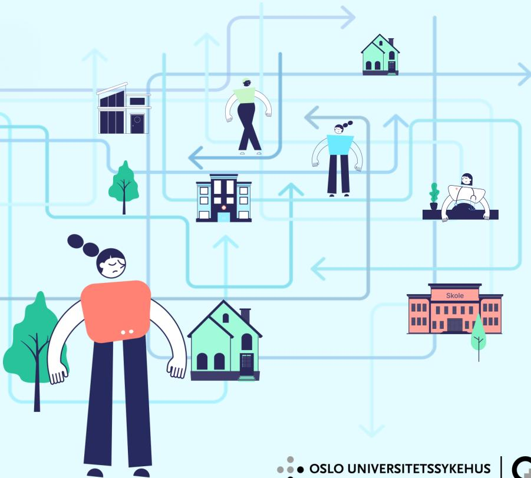

Illustration showing a network of interconnected paths with icons representing various services and locations, including a school (Skole), a house, a person, and a medical professional.

## Innhold

|                                                      |           |
|------------------------------------------------------|-----------|
| <b>1.0 Innledning.....</b>                           | <b>3</b>  |
| Beskrivelse av prosjekt og mål.....                  | 4         |
| Gevinstbildet og målinger.....                       | 6         |
| Prosjektets faser og innsiktsfasens mål.....         | 8         |
| <b>2.0 Landskapet.....</b>                           | <b>10</b> |
| Oversikt og oppsummering av kunnskapsgrunnlag.....   | 11        |
| Store endringer: Bydelsreformen, Helsereformen.....  | 13        |
| OTI og OSST.....                                     | 16        |
| Erfaringer fra andre modeller og best practice ..... | 17        |
| <b>3.0 Innsiktsarbeid.....</b>                       | <b>19</b> |
| Oversikt innsiktsarbeid.....                         | 20        |
| Tverrgående funn, unge og foresatte.....             | 21        |
| De unges stemme, oppsummering.....                   | 27        |
| Foresatte forteller, oppsummering.....               | 29        |
| Tverrgående funn, tjenestene.....                    | 31        |
| Oppsummering av nå-situasjon, tjenestene.....        | 32        |
| Bevaringsområder.....                                | 33        |

|                                                       |           |
|-------------------------------------------------------|-----------|
| <b>4.0 Analyse av funn.....</b>                       | <b>34</b> |
| Dagens flyt og smertepunkter.....                     | 35        |
| Systemiske problemer som bør løses.....               | 36        |
| Avklaring av hjelpebehov i bydel før BUP.....         | 37        |
| Være sammen om de komplekse sakene.....               | 38        |
| En likeverdig psykisk helsetjeneste barn og unge..... | 39        |
| Sikre samordningen rundt barn, unge og familie.....   | 40        |
| Tjenestene må oppfattes tilgjengelige.....            | 41        |
| Redusere hjelpebehovet.....                           | 42        |
| <b>5.0 Mulighetsrom.....</b>                          | <b>43</b> |
| Forslag: Morgendagens flyt.....                       | 44        |
| Morgendagens flyt – tre hovedgrep.....                | 46        |
| Prioritering opp mot prosjektets målbilde.....        | 47        |
| Forslag tiltakskjede fra prosjektet.....              | 48        |
| <b>6.0 Appendix.....</b>                              | <b>49</b> |
| Kilder kunnskapsgrunnlag.....                         | 50        |
| Siterer ungdom og foreldre.....                       | 52        |
| Oppsummering intervjuer ansatte og bydelsmøter.....   | 64        |
| Workshop BUP og workshop bydeler.....                 | 68        |
| Fokustema.....                                        | 74        |
| Fastlegeundersøkelsen.....                            | 79        |

Logo of Oslo Kommune, featuring a crown and a figure holding a staff.

Logo of Oslo Universitetssykehus, featuring a stylized cross and dots.

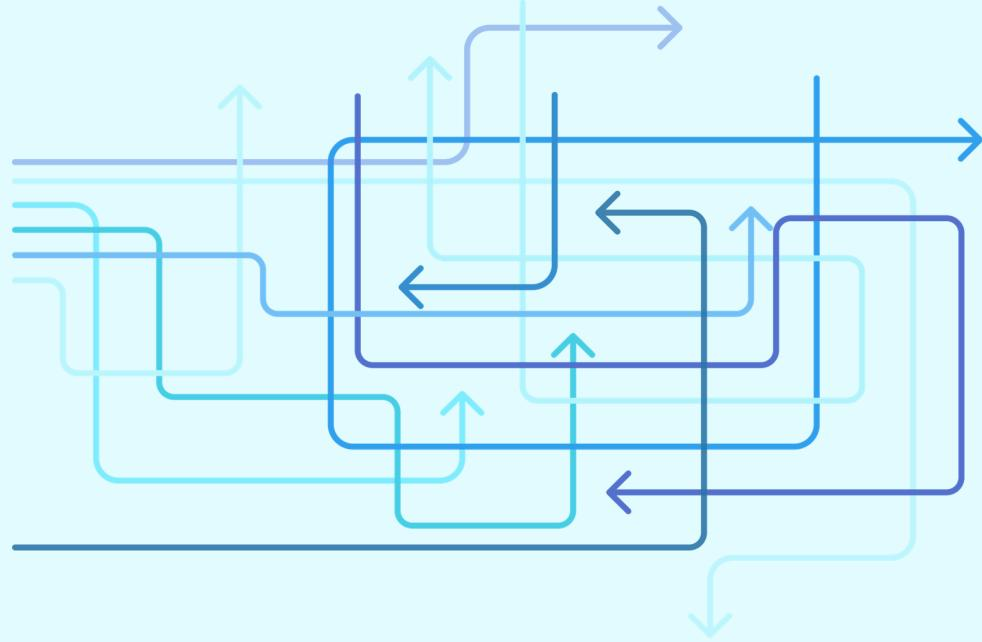

An abstract graphic consisting of multiple overlapping, semi-transparent blue lines. The lines are mostly horizontal or vertical, with some diagonal segments, creating a sense of depth and complexity. Several lines end in arrowheads, pointing in various directions (up, down, left, right). The overall shape of the lines is roughly rectangular, with some lines extending beyond the main cluster. The colors range from light blue to a darker navy blue.

Abstract graphic of overlapping blue lines with arrows forming a complex, layered pattern.

## Innledning

## Om prosjektet

**Helsefellesskap Oslo har vedtatt psykisk helse barn og unge som et satsningsområde for årene fremover**, som beskrevet i [helsefellesskapets porteføljeplan](#). Prosjektet er et tjenesteutviklingsprosjekt i perioden 2025-2027 i Sektor Oslo universitetssykehus (OUS), og inngår i [lokal porteføljeplan](#) for sektorsamarbeidet.

Prosjektet er finansiert gjennom rekrutterings- og samhandlingstilskudd, som skal «stimulere til forpliktende samarbeid mellom kommuner og helseforetak for å utvikle tjenester, skape gode pasientforløp, og understøtte tiltak som bidrar til rekruttering og god bruk av personell».

Samarbeidspartnerne er Oslo kommune ved bydelene Østensjø, Bjerke, Sagene, Nordre Aker, Søndre Nordstrand og Nordstrand og Helseetaten, og Oslo universitetssykehus ved Klinikkk Psykisk helse og avhengighet og Barne- og ungdomspsykiatrisk avdeling.

Bakgrunnen for prosjektet var økt pågang og kapasitetsutfordringer med 50 % økning i henvisninger til BUP, erkjennelse av mangelfull samhandling og stor variasjon i tjenestene.

Mer informasjon om prosjektet finnes på Kompetansebroen - [Sammen om rask og riktig psykisk helsehjelp til barn og unge - Kompetansebroen](#).

### Helsefellesskapets felles målbilde for psykisk helse barn og unge

- Barn og unge i Oslo skal ha tilgang til helsehjelp på rett nivå til rett tid
- Kommunen skal ha oversikt over den psykiske helsetilstanden til barn og unge
- Sykehus og kommune skal samhandle slik at barn og unge får rett hjelp til rett tid
- Sykehus og kommune deler informasjon som sikrer god oversikt over pasientflyt mellom tjenestenivåene

### Målgruppe

- Barn og unge som er kontakt med helse- og omsorgstjenester i kommune og sykehus
- Barn og unge med alvorlige psykiske lidelser eller tilstander i alderen 0-20 år
- Barn og unge som trenger samtidige tjenester fra kommune og sykehus, og ulike tjenester i ulike perioder
- Barn og unge med sammensatte behov og tjenester fra flere aktører
- Barn og unge med behov for de forebyggende tjenestene, samt behandling og oppfølging over tid i kommune

### Prosjektets mål

Det overordnede målet for prosjektet er at barn og unge sikres psykisk helsehjelp på rett nivå og til rett tid, og et helhetlig og likeverdig tilbud med trygge og forutsigbare overganger.

#### Delmål:

1. Sikre etablering av samhandlingsarena mellom kommune/bydel og sykehus/BUP for å legge til rette for helhetlig og samordnet hjelp til barn og unge.
2. Sikre barn og unges rett til informert samtykke ved deling av taushetsbelagt informasjon mellom ulike hjelpetjenester.
3. Sikre en helhetlig og koordinert kartlegging og vurdering i kommune/bydel før henvisning til sykehus/BUP.
4. Sikre raskere avklaring av videre oppfølging i sykehus/BUP eller bydel/kommune.
5. Sikre rutiner for oppfølging etter utskrivelse og koordinering rundt barn og unge som mottar tjenester fra begge forvaltningsnivåer samtidig.
6. Bidra til utvikling av tjenester og tilbud som kan styrke brukers/pasients- og pårørendes helsekompetanse.

Målbildet er utarbeidet i tråd med nasjonal veileder [Psykisk helsearbeid barn og unge – Helsedirektoratet](#).

Logo of Oslo Kommune, featuring a crown and a figure holding a staff.

Oslo

Det overordnede målet for prosjektet er at barn og unge sikres psykisk helsehjelp på rett nivå og til rett tid, og et helhetlig og likeverdig tilbud med trygge og forutsigbare overganger.

### Gevinstbildet og målinger av effekt

Ved gjennomføring av prosjektet ønsker en å oppnå følgende gevinster/ utfallsmål:

- 1. Redusert ventetid**
- 2. Redusert antall avslag på henvisninger**
- 3. Hjelp på riktig nivå**
- 4. Økt kvalitet samhandling**
- 5. Økt brukertilfredshet**

Det er lagt opp et evalueringsdesign relatert til de fem identifiserte gevinstene som vil være innrettet mot å fange opp effekter og resultater av det implementerte prosjektet.

For gevinstmål 5. Økt brukertilfredshet, er det foreslått å utarbeide en brukerundersøkelse til pasienter og pårørende som kan gjennomføres som nullpunkt så snart som mulig og deretter gjentas i 2027. Utover dette er evalueringen planlagt som en summativ/retrospektiv evaluering ved avslutning av prosjektet.

Evalueringen vil ikke kunne si noe direkte om gevinst definert som kost-nytte i kroner og øre, men gi god innsikt i hvordan prosjektet påvirker utfallsmål som vi vet er forbundet med betydelige kostnadsbesparelser.

Et neste skritt i gevinstarbeidet kan være å kvantifisere kost-nytte gjennom ulike metoder for gevinstberegning. Vi har fanget opp to ulike verktøy som kan vurderes brukt inn i dette:

1. Utenfor-regnskapet, utviklet av KS og Rambøll, er en økonomisk modell og et diskusjonsverktøy for å ta langsiktige investeringsbeslutninger for barn og unge som vi vet står i risiko. Se case-eksempel fra Vestfold: Utenfor-regnskapet: Resultater for Ung Arena+ | Innomed.
2. Helsepersonellkomiteen viser til Agenda Kaupang sine verktøy Innsatstrappen og tilhørende ressurskalkulator (s.143), som er et faglig og ressursmessig prioriteringsverktøy som legger vekt på forebyggende arbeid i kommunen.

En kan også vurdere om det kan være hensiktsmessig å forsøke å kvantifisere hjelp på riktig nivå og økt brukertilfredshet gjennom å:

1. Kvantifisere hjelp på riktig nivå gjennom å innhente tilbud- og etterspørsel både innen kommunale tjenester og BUP (indikatorsettarbeid i Helseetaten og å ta i bruk Helse Sør-Øst sin «BUP-app»).
2. Å hjelpe tjenestene til å måle brukertilfredshet og tjenestekvalitet mer systematisk.

### Status pågang til psykisk helsevern barn og unge i Oslo

Bakgrunnen for prosjektet tilbake i 2019, hvor BUP meldte bekymring til helsefellesskapet om en 50% økning i henvisninger, er fortsatt høyst gjeldende. Henvisningsraten har fortsatt å øke i hele byen, og særlig i sektor OUS.

- 1. Ventetiden i BUP har gått ned, men antall ventende har økt** i Oslo og i OUS sektor, som gir stadige og vedvarende kapasitetsutfordringer i BUPA.
- 2. Antall avslag på henvisninger har gått ned** i Oslo og i OUS sektor, samtidig som **antall nyhenviste har økt**.
- 3. I Oslo sammenlignet med Helse Sør-Øst for øvrig**, og også i OUS sektor sammenlignet med de andre sektorene i Oslo, ser man **en fortsatt og stor økning av henvisninger**, og denne økningen kommer primært fra fastleger.

Statistikk er hentet fra Helse Sør-Øst sin BUP-app og er oppdatert per oktober 2025.

![Line chart showing indexed development of new referrals (Nyhenviste) from 2020 to 2025 for Oslo HEF and other HSØ regions. The Y-axis represents the index value from 0 to 2.5, with 2019 as the base year (1.0). The X-axis shows years from 2020 to 2025. The blue line represents Oslo HEF and the orange line represents other HSØ regions. Both lines show significant volatility, with a general upward trend. Oslo HEF (blue) shows higher peaks, reaching above 2.0 in 2024, while other HSØ regions (orange) generally stay below 1.5, though with similar volatility.](20251209_Innsiktsrapport_Sammen-om-rask-og-riktig-psykisk-helsehjelp_Helsefellesskap-Oslo-2/01da0d212fb571933f10f96556157745_img.jpg)

Indeksert utvikling Nyhenviste  
2019 =1

— Oslo HEF — Øvrige HSØ

Line chart showing indexed development of new referrals (Nyhenviste) from 2020 to 2025 for Oslo HEF and other HSØ regions. The Y-axis represents the index value from 0 to 2.5, with 2019 as the base year (1.0). The X-axis shows years from 2020 to 2025. The blue line represents Oslo HEF and the orange line represents other HSØ regions. Both lines show significant volatility, with a general upward trend. Oslo HEF (blue) shows higher peaks, reaching above 2.0 in 2024, while other HSØ regions (orange) generally stay below 1.5, though with similar volatility.

### Prosjektets faser

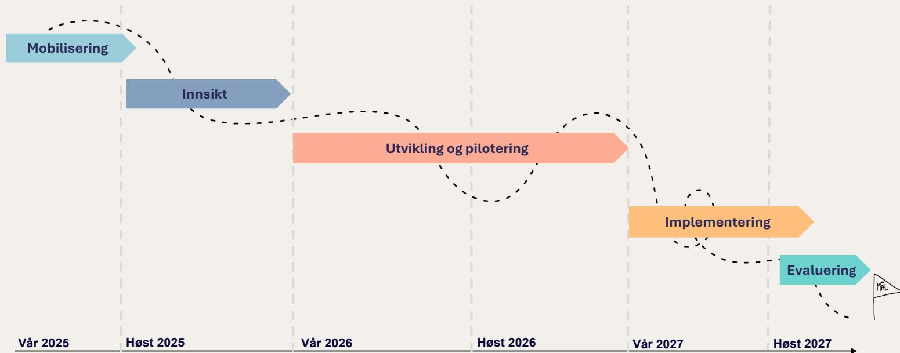

The diagram illustrates the project phases over a timeline from Spring 2025 to Autumn 2027. The phases are represented by colored arrows: Mobilisering (light blue), Innsikt (medium blue), Utvikling og pilotering (orange), Implementering (light orange), and Evaluering (teal). A dashed line indicates the progression between phases. The timeline is marked with vertical dashed lines and labels: Vår 2025, Høst 2025, Vår 2026, Høst 2026, Vår 2027, and Høst 2027. The Evaluering phase ends with a flag labeled MÅL.

| Fase                    | Start     | Slutt     |
|-------------------------|-----------|-----------|
| Mobilisering            | Vår 2025  | Høst 2025 |
| Innsikt                 | Høst 2025 | Vår 2026  |
| Utvikling og pilotering | Vår 2026  | Vår 2027  |
| Implementering          | Vår 2027  | Høst 2027 |
| Evaluering              | Høst 2027 | Mål       |

A timeline diagram showing project phases: Mobilisering, Innsikt, Utvikling og pilotering, Implementering, and Evaluering, spanning from Vår 2025 to Høst 2027.

### Mål for innsiktsfasen

Før prosjektet skulle i gang med løsningsutvikling var det vesentlig å innhente en **utvidet innsikt og problemforståelse** som kunnskapsgrunnlag. Det var kjent at det allerede eksisterte en god del generell innsikt fra andre rapporter og utredningsarbeid, men lite som var Oslo- og OUS sektor-spesifikt. Et innsiktsarbeid er også viktig interessentarbeid for prosjekter, og må være oppdatert og aktuelt for at prosjektet skal ha relevans og verdi.

Ad hoc-gruppen leverte i forprosjektet (2023) et godt grunnlag for videre retning og utvikling. I perioden etter dette og frem til nå har det skjedd flere endringer av betydning som prosjektet må ta hensyn til i løsningsutviklingen. Herunder ny nasjonal veileder Psykisk helsearbeid barn og unge som leverer viktige premisser og krav til kommune og psykisk helsevern, og endringer i lokale rammebetingelser knyttet til økonomiske nedskjæringer i spesialisthelsetjeneste og kommune som har gitt konsekvenser for tjenestetilbudet, blant annet for lavterskeltilbudene til barn og unge i bydelene.

Det har samtidig skjedd mye utvikling på feltet andre steder i landet, og det er prøvd ut nye modeller som har høstet viktige erfaringer, blant annet innen henvisnings- og inntaksprosesser, bruk av digitale støtteverktøy, nye måter å strukturere tjenestene på, med mer.

Prosjektet har vært opptatt av å løfte frem ulike brukergrupper (både ansatte og pasienter/pårørende) for å sikre erfaringer og perspektiver fra ungdom, foreldre, fastleger og ansatte i tjenestene i vår sektor. Med fokus på hva som er smertepunkter, utfordringer og suksesskriterier, får prosjektet verdifull innsikt i brukernes opplevde behov og hvordan samarbeidet mellom fastleger, BUP og bydeler fungerer i dag.

Innsiktsarbeidet har videre hatt som formål å **utforske hva som ligger i de identifiserte gevinstene** og utfallsmålene til prosjektet;

- «hjelp på riktig nivå»,
- «økt kvalitet på samhandling» og
- «økt brukertilfredshet».

Innsikten som er innhentet vil bidra til å kunne kvantifisere de kvalitative dimensjonene i gevinstkonseptene og danne grunnlag for evaluering av gevinstrealisering etter prosjektslutt.

Innsiktsarbeidet er gjennomført i perioden juni til oktober 2025 med en blanding av dybdeintervjuer, spørreundersøkelse, workshops, møter og dokumentgjennomgang.

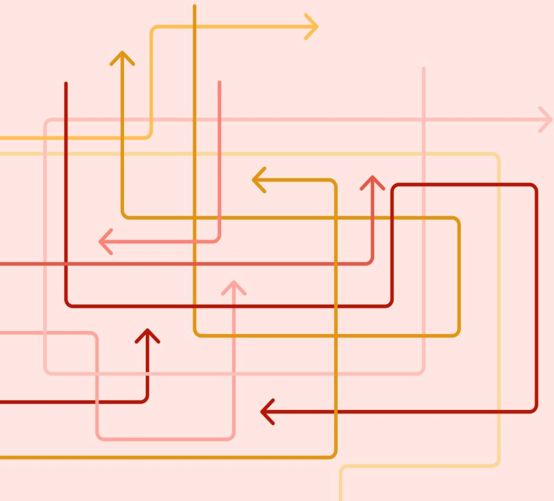

An abstract graphic on the left side of the image, consisting of several overlapping, multi-colored lines (shades of red, orange, and yellow) that form rectangular and L-shaped paths. Each path ends with an arrowhead pointing in one of the four cardinal directions (up, down, left, right). The lines are thin and have rounded corners at their turns.

Abstract graphic of overlapping colored lines with arrows.

Landskapet

### Kunnskapsgrunnlag

Flere kunnskapsgrunnlag er gjennomgått, kildeliste i vedlegg

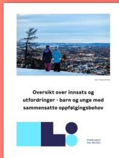

Cover of 'Oversikt over innsats og utfordringer - barn og unge med sammensatte oppfølgingsbehov' by Grorudmodellen, Oslo, 2023. The cover features a photograph of two children in a snowy landscape.

Grorudmodellen: Rapport om barn og unge med sammensatt oppfølgingsbehov, 2023

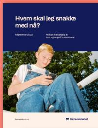

Cover of 'Hvem skal jeg snakke med nå?' by Barneombudet, Oslo, 2022. The cover shows a young boy sitting outdoors.

Barneombudet: Rapport om psykisk helsehjelp til barn og unge i kommunene, 2022

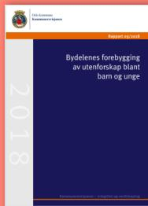

Cover of 'Bydelenes forebygging av utenforskap blant barn og unge' by Oslo kommune, Oslo, 2018. The cover is dark blue with white text.

Kommunerevisjonen: Rapport om bydelenes forebygging av utenforskap blant barn og unge, 2018

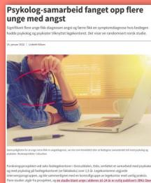

Cover of 'Psykolog-samarbeid fanget opp flere unge med angst' by Oslo kommune, Oslo, 2022. The cover shows a person working on a laptop.

«Shared Care and Usual Health Care for Mental and Comorbid Health Problems», 2020

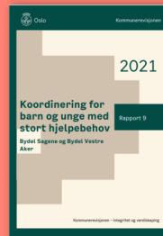

Cover of 'Koordinering for barn og unge med stort hjelpebehov' by Oslo kommune, Oslo, 2021. The cover is green with white text.

Kommunerevisjonen: Rapport om koordinering for barn og unge med stort hjelpebehov, 2021

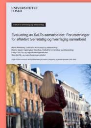

Cover of 'Evaluering av GdLTo-samarbeidet: Forutsetninger for effektiv tverretatlig og tverrfaglig samarbeid' by Universitetet i Oslo, Oslo, 2022. The cover shows a person walking in a city.

Universitetet i Oslo: Rapport om forutsetninger for effektiv tverretatlig og tverrfaglig samarbeid, 2022

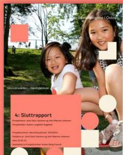

Cover of 'Sluttrapport Grorudmodellen' by Grorudmodellen, Oslo, 2023. The cover shows two children smiling.

Grorudmodellen: Sluttrapport Grorudmodellen, 2023

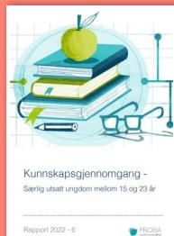

Cover of 'Kunnskapsgjennomgang - Særlig utsatt ungdom mellom 15 og 23 år' by PROBA, Oslo, 2022. The cover features a stylized illustration of books and a lightbulb.

PROBA: Kunnskapsgjennomgang - Særlig utsatt ungdom mellom 15 og 23 år, 2022

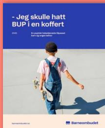

Cover of 'Jeg skulle hatt BUP i en koffert' by Barneombudet, Oslo, 2020. The cover shows a child walking away.

Barneombudet: Rapport om psykisk helsehjelp i BUP, 2020

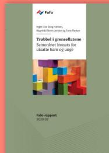

Cover of 'Trøbbel i grenseflene: Samarbeidstiltak for utsatte barn og unge' by Fafø, Oslo, 2020. The cover shows colorful blocks.

Fafø: Samordnet innsats for barn og unge, 2020

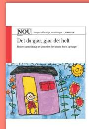

Cover of 'Det du gjør, gjør det helt' by NOU, Oslo, 2009. The cover shows a child's drawing of a house.

NOU: Bedre samordning av tjenester for utsatte barn og unge, 2009

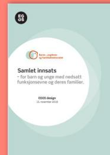

Cover of 'Samlet innsats - for barn og unge med nedsatt funksjonsevne og deres familier' by EGOS design, Oslo, 2018. The cover is light blue with a circular logo.

EGOS design: Samlet innsats (0-24-samarbeidet), 2018

### Eksisterende kunnskapsgrunnlag om...

### Hjelp på riktig nivå

Prinsippet er nært knyttet til tidlig innsats og at hjelpen skal ytes på Laveste Effektive Omsorgsnivå (LEON).

Flere kommuner har flyttet ressurser mot de yngste for å komme tidligere inn.

**Identifiserte hemmere** for å sikre hjelp på riktig nivå, er fragmentert tjenestetilbud, uklar ansvarsfordeling, mangel på kompetanse og kapasitet.

**Identifiserte fremmere** for å sikre hjelp på riktig nivå, er blant annet:

- **Felles kunnskapsgrunnlag og forståelse**

Tjenestene må etablere et felles kunnskapsgrunnlag og forståelse for roller og ansvar. Felles kompetanseheving på tvers av tjenestene er et viktig virkemiddel for å utvikle felles begreper og kjennskap til hverandres arbeid.

### Samhandling

Å klare å yte hjelp på riktig nivå, avhenger av samhandling, og derfor må følgende tiltak også på plass:

- **Helhetlig og koordinert innsats**

Å sikre at barn og unge får hjelp på riktig nivå handler om å skape et **"lag rundt barnet"** der alle aktører har en felles forståelse av behovet og trekker i samme retning, slik at den unge slipper å føle seg som en stafettpinne i systemet.

- **Involvering og myndighet**

Personale med riktig kompetanse og myndighet til å ta beslutninger må involveres, og representanter fra samtlige tjenester bør være på samme myndighetsnivå.

- **Én dør inn**

Tilrettelegging for lett tilgjengelig informasjon og et felles kontaktpunkt (én dør inn) forenkler prosessen for brukere med sammensatte behov.

#### Brukertilfredshet

- **Brukerorientering og fleksibilitet**

Hjelpen må tilpasses barnets individuelle behov og gis på barn og unges premisser. Tjenestene må være fleksible med tanke på hvor, når, hvordan og hvor lenge hjelpen gis.

- **Brukermedvirkning**

Brukermedvirkning må gjennomsyre tilbudene som gis for å skape agens og eierskap, ettersom opplevd medvirkning korrelerer positivt med opplevd nytteeffekt.

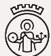

Logo of Oslo Kommune, featuring a crown and a figure holding a staff.

Logo of Oslo Universitetssykehus, featuring a stylized cross and dots.

Logo of Oslo Universitetssykehus, featuring a stylized cross and dots.

### Kommende endringer og påvirkende faktorer

En stilisert illustrasjon av en bydel med tre høyhus i hvitt og grått, omgitt av grønne trær på en rød bakgrunn.

Illustrasjon av bygninger og trær.

**Både Oslo kommune og Oslo universitetssykehus (OUS) har foretatt store økonomiske nedskjæringer i år, og det er varslet nye massive kutt de kommende årene.**

På bakgrunn av større rammereduksjoner i Klinikk Psykisk helsevern og avhengighet i OUS utredes det bl.a. innsparinger på 15 mnok i dag- og døgnseksjonen i Barne- og ungdomspsykiatrisk avdeling, som nå er under samlokalisering. Nedskjæringene i Oslo kommune fra 2025 førte til at mange stillinger innen psykisk helse barn og unge ble borte. I 2026 skal kommunen kutte ytterligere 1 milliard.

Kuttene skjer samtidig som behovet for psykisk helsehjelp blant barn og unge øker, med økende forekomst av blant annet spiseforstyrrelser og angst/depresjon.

Opptreppingsplanen for psykisk helse (2023–2033) har som mål å styrke tilbudet, men realiteten er at både sykehus og kommuner kutter, noe som **skaper et gap mellom politiske ambisjoner og faktiske tjenestetilbud.**

**Det er varslet store endringer med både bydelsreform i Oslo og den varslede Helsereformen.** Dette er endringer som vil ha betydning for organisering av tjenestestrukturer og det psykiske helsetilbudet for barn og unge i Oslo og OUS sektor.

Per tiden er det lite som er konkretisert og det er først et stykke ut i 2026 en vet mer, men utviklingen i prosjektet må forsøke å ta opp i seg disse fremtidsscenarioene og foreslå løsninger som kan stå seg også gjennom disse.

I det følgende presenteres en oppsummering av **mulige utslag på tjenestestrukturer og tjenestetilbud innen psykisk helse basert på de varslede endringene.**

### Bydelsreformen i Oslo

#### Mål og intensjoner:

- Redusere antall bydeler fra 15 til 6-8 for å skape mer robuste fagmiljøer og likeverdig tjenestetilbud.
- Flytte flere oppgaver og mer ansvar ut til bydelene for å styrke lokaldemokratiet og nærhet til innbyggerne.

Kilde: [Om bydelsreformen - Bydelsreformen - Oslo kommune](#)

#### Mulige konsekvenser for psykisk helsearbeid for barn og unge:

- **Mer helhetlige innbyggerreiser:** Tjenestene skal i større grad henge sammen, med bedre koordinering mellom helsestasjon, skolehelsetjeneste, barnevern og psykisk helse.
- **Standardisering og samordning:** Tjenestene i bydelene skal organiseres mer enhetlig, noe som kan gi mer likeartet vurdering og tildeling av tjenester på tvers av bydeler.
- **Styrket tverrfaglig innsats:** Tidlig innsats og tverrfaglig samarbeid skal prioriteres, særlig for barn og unge med sammensatte behov.
- **Større bydeler = mer kapasitet:** Større bydeler kan gi bedre forutsetninger for å opprettholde og utvikle fagmiljøer innen psykisk helse.

### Mål og prinsipper for fremtidig organisering

The diagram illustrates the goals and principles for future organization, centered around 'Våre innbyggere' (Our citizens). It is divided into three main areas:

- Mer helhetlig, tilgjengelig og likeverdig tjenestetilbud** (More holistic, accessible, and equitable service offering):
  - Mer helhetlig styringsstruktur
  - Redusere kompleksitet
  - Mer koordinerte og sammenhengende innbyggerreiser
  - Tydeligere rolle- og ansvarfordeling
  - Mer robuste fagmiljøer
- Gode og mer effektive tjenester** (Good and more effective services):
  - Mer enhetlig organisasjonsstruktur
  - Minst mulig dobbeltarbeid
  - Standardisere der mulig, skreddersøm der nødvendig
  - Utnytte stordriftsfordeler
  - Helhetlig bruk av kompetanse på tvers
  - Ta i bruk alle gode krefter
  - Mer selvstendigjørende tilbud og tjenester
  - Sammenheng mellom vedtaksmyndighet, tjeneste- og budsjettansvar
- Styrket lokaldemokrati og økt mulighet for samfunnsutvikling i bydelene** (Strengthened local democracy and increased opportunity for community development in the districts):
  - Øke bydelenes påvirkning på eget nærmiljø
  - Styrke bydelene som arena for innbyggerinvolvering

Additional labels around the diagram include: 'Ledelse og organisasjonskultur' (Leadership and organizational culture) at the top, and 'Digitalisering og teknologi' (Digitalization and technology) at the bottom.

Diagram showing the goals and principles for future organization of Oslo municipality, divided into three main areas: 1. Mer helhetlig, tilgjengelig og likeverdig tjenestetilbud; 2. Gode og mer effektive tjenester; 3. Styrket lokaldemokrati og økt mulighet for samfunnsutvikling i bydelene.

Kilde: [Fremtidig organisering av Oslo kommune. Rapport oktober 2025.pdf](#)

#### Helsereformen og regjeringens satsing

#### Opptreppingsplan psykisk helse og budsjettprioriteringer:

- Regjeringen har lovet 3 milliarder kroner over ti år til psykisk helse og rus, og har allerede bevilget 1,2 milliarder.
- Lavterskeltilbud i kommunene skal bygges ut og styrkes, inkludert digitale selvhjelpsverktøy og frivillige aktører.
- Ny tilskuddsordning for ACT, FACT og FACT Ung.

#### Mulige konsekvenser for barn og unge:

- Bedre tilgang til **helsehjelp for barn i barnevernsinstitusjoner**, som har høy forekomst av psykiske lidelser.
- **Flere lavterskeltilbud** i kommunene, som kan fange opp psykiske plager tidlig og redusere behovet for spesialisthelsetjenester.
- **Digitalisering av tjenester:** Økt bruk av eBehandling og selvhjelpsverktøy kan gi barn og unge lettere tilgang til hjelp.
- **Forebygging og helsefremming:** Innsatsen skal styrkes på arenaer der barn og unge lever sine liv – skole, fritid, familie.

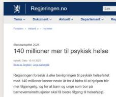

The screenshot shows a news article on the official Norwegian government website, Regjeringen.no. The headline is '140 millioner mer til psykisk helse'. The article, dated 15.10.2025, reports that the government is allocating 140 million kroner over ten years to mental health and substance abuse services. It mentions that 1.2 billion kroner has already been allocated. The article also notes that low-threshold services in municipalities will be expanded, including digital self-help tools and voluntary actors, and a new grant system for ACT, FACT, and FACT Ung will be introduced.

Screenshot of a Regjeringen.no article titled '140 millioner mer til psykisk helse'.

[Les mer her](#)

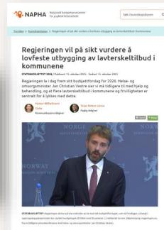

The screenshot shows an article from NAPHA (Nasjonalt kompetansesenter for psykisk helsevern). The headline is 'Regjeringen vil på sikt vurdere å lovfeste utbygging av lavterskeltilbud i kommunene'. The article, dated 15. oktober 2025, discusses the government's plan to expand low-threshold services in municipalities. It mentions that the government is considering legislation to mandate the expansion of these services, which include digital self-help tools and voluntary actors. The article also notes that the government is allocating 140 million kroner over ten years to mental health and substance abuse services.

Screenshot of a NAPHA article titled 'Regjeringen vil på sikt vurdere å lovfeste utbygging av lavterskeltilbud i kommunene'.

[Les mer her](#)

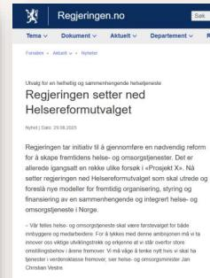

The screenshot shows a news article on the official Norwegian government website, Regjeringen.no. The headline is 'Regjeringen setter ned Helsereformutvalget'. The article, dated 29.08.2025, reports that the government has established a new committee, the Helsereformutvalget, to lead the implementation of the health reform. The committee will be responsible for developing models for integrated health and social services, and for improving coordination between municipal and specialist health services. The article also mentions that the government is allocating 140 million kroner over ten years to mental health and substance abuse services.

Screenshot of a Regjeringen.no article titled 'Regjeringen setter ned Helsereformutvalget'.

[Les mer her](#)

**Helsereformutvalget** har fått et bredt mandat, herunder å:

- Foreslå modeller **for en sammenhengende og integrert helse- og omsorgstjeneste**, noe som innebærer å fjerne dagens siloer mellom kommunale tjenester, spesialisthelsetjenesten og andre aktører. Dette skal gi bedre samhandling, mindre fragmentering og enklere overgang mellom nivåene i tjenesten.
- Vurdere **endringer i arbeids- og oppgavefordelingen mellom kommunene og spesialisthelsetjenesten**. Dette kan føre til at flere oppgaver flyttes til kommunene, med krav om økt kompetanse og ressurser. Spesialisthelsetjenesten kan få en tydeligere rolle i komplekse saker, mens kommunene styrkes i forebygging og tidlig innsats.

### Pågående arbeid med Oslostandard

**Oslostandard for samarbeid og samordning av tjenester til det beste for barn, unge og deres familier (OSST)** er under arbeid og utkast skal leveres innen 02.01.2026.

OSST vil være en overbygning som beskriver kommunens rammeverk for samarbeid på alle nivå, i tråd med gjeldende lovkrav på oppvekstfeltet.

Med bakgrunn i en omfattende involveringsprosess er det utarbeidet et forslag til innretning av Modell for samarbeid om ungt utenforskap i tråd med føringene i mandatet.

**Operativ tverrfaglig innsats, videre omtalt som OTI-modellen,** består av felles faglige føringer og en samarbeidsstruktur for å styrke tverrfaglig operativt samarbeid ovenfor barn, unge og familier med komplekse og sammensatte utfordringer som har behov for hjelp fra flere deler av hjelpeapparatet samtidig.

OTI-modellen skal fylle et udekket behov i bydelene for operativt tverrfaglig samarbeid. Modellen skal innføres fra 01.01.2026.

A stylized illustration on a coral background. It depicts a person with dark hair and a white face, wearing a light green top. The person is sitting at a desk, holding a pen and writing on a light blue checklist. The checklist has four items, with the first two marked with checkmarks. The person's arms are represented by simple curved lines.

Illustration of a person sitting at a desk, writing on a checklist.

### Erfaring fra andre prosjekter – best practice?

### SiO-modellen

**Studentsamskipnaden i Oslo** har klart å snu ventetid på psykiske helsetjenester fra 5 måneder til 20 dager gjennom tre viktige grep:

1. Ny organisering av inntak med [digitalt søknadsskjema på Helsenor](#), med faste inntaksteam hver formiddag hele uken. Studentene får vanligvis svar i løpet av 1-2 dager. Samtykke gis samtidig som digital innsøking.
2. Synliggjøre nettilbudet, gjorde nettsidene enklere å navigere i og fremhevet mestringsskurst og selvhjelp på nettsiden.
3. Utvikle alternative tilbud til individuell oppfølging, bl. a. to kurs som [adresserer de vanligste utfordringene blant studentene](#).

### En vei inn-Vestfold

**Sandefjord kommune og Sykehuset i Vestfold:** Prosjektet [er del av Prosjekt X](#).

- Mål å etablere én vei inn for alle pasienter over 18 år i Sandefjord som trenger psykisk helsehjelp – uavhengig av om det er mild og kortvarig tilstand eller alvorlig psykiatri.
- Ny inntaksmodell hvor Sandefjord kommune og DPS samarbeider om vurderingssamtaler. Dette sikrer at pasienter får riktig hjelp på riktig nivå, uten at fastlegen alene fungerer som portvakt.
- Prosjektet vil med bistand Innomed [utvikle implementeringsveileder](#), på bakgrunn av bred interesse fra andre områder.
- En del «work-arounds» knyttet til de regulatoriske rammer for å få det til.

### Hva nå-modellen

**Haugesund kommune og Haugesund BUP i Helse**

**Fonna regionen:** Psykisk helse barn og unge er organisert under Helsestasjon og skolehelsetjenesten, og samarbeider tett med helsesykepleierne på helsestasjonen og i skolehelsetjenesten, inkludert deler journalsystem.

- Digitalt mottak ved hjelp av [elektronisk innmeldingsskjema](#) på kommunens nettside.
- Sluser fortrinnsvis via helsesykepleiere, går «stegene» i kommunens tilbud.
- Maks 14 dager ventetid.
- Innsendt kontaktskjema blir lagret i helsejournalen til barnet eller ungdommen og følger personvernloven, og ved henvendelse gis samtykke til journalpraksis.
- Ukentlige interne møter – samordning tjenester.
- Hva-nå møter med BUP og kommuneoverlege hver 14. dag, faglige drøftinger rundt problematikk moderat-alvorlig, kompetanseoverføring og kulturbygging.

### Flere relevante modeller/prosjekter

### Felles innsatsteam barn og unge med nevroutviklingsforstyrrelser

**Helse Bergen ved Klinikk psykisk helsevern barn og unge og Bergen kommune, etat for barn og familie**

Mål om å etablere et felles faglig innsatsteam for å øke kompetansen og forbedre overganger mellom første- og andrelinjetjenester.

Teamet vil bistå med konsultasjoner, behandlingsplaner, observasjon, opplæring og oppfølging av enkeltbarn.

Prosjektet skal også bidra til å etablere et faglig nettverk for behandlere i PBU og primærhelsetjenesten.

[Felles innsatsteam for barn i grunnskolealder med nevroutviklingsforstyrrelse - Saman](#)

### e-Team – en ny samhandlingsmodell for digital psykologisk behandling

**Trondheim kommune og St. Olavs hospital**

Todelt prosjekt for å løse utfordringer knyttet til dagens todelte helsetjeneste.

1. Felles inntak - Hvor skal innbygger kunne ta direkte kontakt og hvordan samarbeide om henvendelser?
2. Samarbeid om digital psykologisk behandling – Ansvarsavklaring og hvordan jobbe i samme tekniske plattform.

[Nytt tjenesteinnovasjonsprosjekt: eTeam – Samhandling for bedre psykisk helsehjelp - Helse Midt-Norge RHF](#)

### Andre

**DigiBUP** - forskningsprosjekt rundt hvordan best lykkes med å implementere en digital behandling for barn med angstproblemer på BUP, inkludert utforske fremgangsmåter implementering digitale tjenesters gjennomførbarhet, akseptabilitet, kostnadseffektivitet og kliniske effekt. [Digibup - Implement - Akershus universitetssykehus HF](#)

**Integrerte tenester for barn og unge** i Nordfjord, Helse Førde (Prosjekt X) - Prosjektet skal utvikle og pilotere ei integrert barne- og ungdomsteneste i Nordfjord-regionen, med mål om å styrke samhandlinga mellom kommune- og spesialisthelsetenesta for born og unge. Fokus på forebygging og tidlig innsats, og samarbeid/samskaping med skolesektoren.

**Asker kommune - Felles mottaksenhet** for alle henvendelser til kommunen som gjelder psykisk helsehjelp. Ved behov for henvisning til BUP lager mottaksenheten et notat som sendes fastlegen som vedlegg til henvisning.

**Koordinert kartlegging av psykisk hjelpebehov og vurdering av tjenestenivå**, Lillestrøm og Tromsø har modeller vi er tipset om.

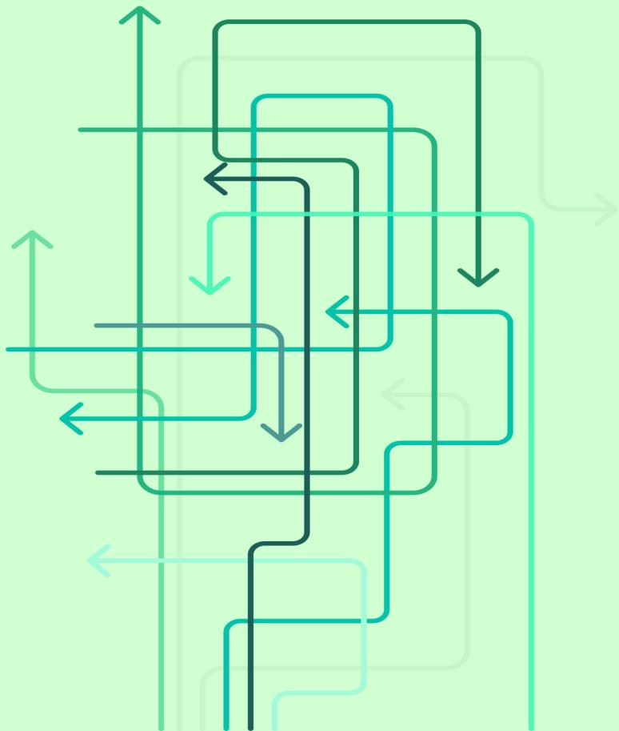

An abstract graphic consisting of multiple overlapping arrows in various shades of green and teal. The arrows are of different lengths and are oriented in various directions (up, down, left, right), creating a sense of complex, interconnected processes or flows. The lines are thin and have rounded corners at the arrowheads.

Abstract graphic of overlapping arrows in various shades of green and teal, pointing in different directions, suggesting a complex process or flow.

Innsiktsarbeidet

## Innsiktsarbeidet

Grunnet prosjektets rammer og behov, har vi snakket med et relativt begrenset antall brukere i arbeidet, med mål om å sikre kvalitative perspektiver inn i prosessen.

Vi har først og fremst generalisert funn det også finnes støtte for i det omfattende eksisterende kunnskapsgrunnlaget vi viser til.

I de følgende sidene vil du finne oppsummeringer av nøkkelfunn fra de ulike gruppene. Mer detaljerte beskrivelser foreligger i appendix.

Illustrasjonen viser tre personer i en møteplass. En person sitter ved et bord, mens to andre står og snakker. Det er en enkel, stilisert tegning i blå, rød og grønn farger.

Illustrasjon av tre personer i en møteplass.

Møter og workshop  
med 6 bydeler  
(17 deltagere)

Illustrasjonen viser en person som snakker, med en rød taleboble. Personen er tegnet i en enkel, stilisert stil med blå og grønn farger.

Illustrasjon av en person som snakker.

Dybdeintervju med  
Ung Arena, Rask Psykisk  
Helsehjelp, skolehelsetjeneste og  
BUP + 3 nøkkelinformanter

Illustrasjonen viser en ung person med en gul skjorte og blå bukser, stående på en grønn bakgrunn. Personen er tegnet i en enkel, stilisert stil.

Illustrasjon av en ung person.

Dybdeintervju  
med 6 unge

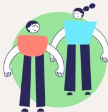

Illustrasjonen viser to foreldre, en mann og en kvinne, stående sammen. De er tegnet i en enkel, stilisert stil med blå og grønn farger.

Illustrasjon av to foreldre.

Dybdeintervju med  
2 foreldre

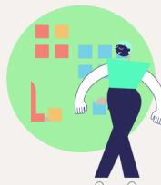

Illustrasjonen viser en person som arbeider ved et bord, med en grønn bakgrunn. Personen er tegnet i en enkel, stilisert stil.

Illustrasjon av en person som arbeider ved et bord.

Workshop med BUP  
Nord og Syd  
(10 deltagere)

Illustrasjonen viser en lege som ser på en pasient, med en grønn bakgrunn. Personen er tegnet i en enkel, stilisert stil.

Illustrasjon av en lege som ser på en pasient.

Dybdeintervju  
8 fastleger

Illustrasjonen viser en liste med punkter, med en grønn bakgrunn. Personen er tegnet i en enkel, stilisert stil.

Illustrasjon av en liste med punkter.

Spørreundersøkelse fastleger  
51 (73) respondenter  
fra 14 bydeler

### Tverrgående funn unge og foresatte

Ut fra samtalene med unge og foresatte, trer det fram noen tverrgående funn, som vi oppsummerer i de følgende sidene.

Disse er:

- Hjelp til å løse riktig problem
- Hjelp til riktig tid
- Behov for en trygg los i et kaotisk system
- Ingen ser forløpet fra brukers ståsted
- Behovet for å være i førersetet i eget liv
- De som står nærmest må ha mer hjelp for å klare å stå løpet ut
- Kommunens hemmelige tjenester
- Skolen er en viktig aktør

#### 1 Hjelp til å løse riktig problem

Ungdommene forteller at de savner hjelp til områder som skole, fritid, venner og familie – temaer som for dem oppleves sentrale for hvordan de har det og som de ønsker støtte til helt fra start. Flere beskriver at vansker på nevnte område både kan være utløsende og opprettholdende til hvordan de har det psykisk.

De opplever at BUP i større grad retter seg mot diagnose og individuelle utfordringer enn mot livssituasjonen rundt dem – noe som også samsvarer med BUP sitt mandat og oppgave. Samtidig belyser det også fraværet av støtte på viktige områder. Disse områdene bør naturlig høre til arenaer nær de unge – grunntjenestene i bydel.

Slik sett kan funnet om å få hjelp til å løse riktig problem peke på at de unges problembilde ikke blir kartlagt godt nok før henvisning til BUP og at de ikke får medvirke nok til å utforme hjelpen. Gitt tjenestenes organisering og ansvarsområder, kan det at de unge opplever å få hjelp til å løse de riktige problemene også forstås som at de får hjelp på riktig nivå.

Videre kan det ut fra informantenes rapportering synes som at samtidig innsats fra BUP og bydel først og fremst er forbeholdt de komplekse sakene, mens ungdommene selv etterlyser en mer helhetlig tilnærming også i mindre komplekse saker.

#### 2 Hjelp til riktig tid

Flere av ungdommene formidler at deres psykiske plager startet med utfordringer som i utgangspunktet ikke var så alvorlige. Men fordi de forble uløste over tid, vokste de seg langt større enn de hadde behøvd. Dette var både knyttet til egne psykiske utfordringer og til vanskelige situasjoner i livet (mobbing, familiesituasjon, m. m.), som ble til psykiske plager fordi de ikke ble løst.

Dette kan tyde på at hjelpen ikke alltid kommer tidlig nok.

De unge ønsker tidlig innsats for å forebygge og unngå eskalerende symptomtrykk. For en gruppe unge handler det om hjelp til å løse vanskelige situasjoner i livet. For andre grupper igjen handler det om å identifisere sårbare barn tidligere (særlig aktuelt for barn med nevroutviklingsforstyrrelser), slik at det kan tilrettelegges før barnet har utviklet alvorlig psykisk uhelse.

Like viktig som **hjelp til å løse riktig problem** blir derfor også **hjelp til riktig tid**.

#### 3 En trygg los i et kaotisk system

De unge forteller om et uoversiktlig system som de møter mange nye voksne i, og med lite kontinuitet. De beskriver at de sjelden har en tillitsperson (utover foresatte), som kan følge dem over tid i en vanskelig situasjon. En person som kan være deres stemme og guide i møte med hjelpeapparatet.

De foresatte på sin side, beskriver hvor usikre de er på hva de kan og bør gjøre når barnet får psykiske utfordringer. De opplever å stå nokså alene med ansvaret om å finne ut av hva som kan fungere og forsøke å sette i gang riktig hjelpetilbud. De beskriver et ønske om en trygg los, som kan gi faglige anbefalinger og være en guide i en ny og ukjent verden.

Hverken barn eller voksne har nødvendigvis vært i en slik hjelpetrengende situasjon før, og er usikre på hva slags støtte og hjelp de kan trenge, hva som kan hjelpe, hvordan de skal finne den og hva de kan forvente.

Det at systemet som skal støtte barnet og familiene er fragmentert, gjør dette enda mer krevende. De må fortelle historien sin mange ganger i møte med de ulike aktørene, og får ofte ikke tydelige anbefalinger. Brutte relasjoner med hjelpere er normen mer enn unntaket.

#### 4 Risiko ved at ingen ser forløpet fra brukers ståsted

Reisen den unge og deres foresatte har tatt gjennom hjelpeapparatet kan ofte ha vært lang og kronglete. Den unge eller foresatte kan ha henvendt seg mange steder, men forteller at deres behov ikke alltid passer inn i det tjenestene kan tilby. De beretter om forløp preget av bomskudd, med tilbud og forslag om støtte som ikke materialiserer seg og et lappeteppe av tjenester som ikke treffer behovet helt. Når problemene beveger seg mellom skole, helse og familie, er det ingen som følger tråden fra start til slutt eller på alle arenaer.

Det er en gjenganger i innsiktsarbeidet fra både tjenester og familier at tjenesten man henvender seg til ikke kan bistå og sender videre til neste tjeneste - som kanskje heller ikke kan bistå. Slik kan unge og deres familier gå rundt i ring, uten at noen ser det. Når ingen eier ansvaret og helheten i brukerforløpet, blir det usynlig for systemet når brukeren ikke passer inn i bydelens rammer.

For mange barn, unge og deres familier oppleves veien i hjelpeapparatet som en lang og uoversiktlig reise, der ingen ser hele bildet. Hver tjeneste ser bare sin del og sitt ansvarsområde, og ansvaret for helheten forsvinner mellom linjene.

#### 5 Å være i førersetet i eget liv

Et framtrедende funn i innsiktsarbeidet er de unges opplevelse av å ikke være i førersetet i eget liv i møte med hjelpeapparatet. De opplever tap av oversikt, selvbestemmelse og kontroll, og forteller at det har negativ innvirkning på hvordan de opplever hjelpen.

Ønsket om å ha mer styring over eget liv vil være et naturlig funn hos unge på vei til å bli voksne. Følelsen av å tape kontroll må også sees i lys av psykiske utfordringer, og følelsen av å miste fotfeste som kan komme i kjølvannet av det.

Likevel var dette så framtrедende i mange av samtalene, at det må forståes som et funn utover utviklingspsykologisk normalvariasjon på veien mot autonomi. Å oppleve å bli møtt på egne premisser, være i førersetet og å ha oversikt er grunnleggende for opplevelsen av medvirkning.

Mer konkret handlet dette om:

- Å vite hvilke forventninger en kan ha til å få det bedre
- Å bli informert om ulike muligheter, som ulike behandlings-tilnærminger eller behandlingsforløp
- Å bli spurt om hva slags type hjelp de selv ønsker og på hvilke områder av livet, og å få informasjon om hva mulig støtte på ulike arenaer kan være
- Å ha oversikt over eget forløp
- Oppleve planmessighet og progresjon i behandling
- Opprettholdelse av taushetsplikt og tydelighet i når informasjon går videre til foreldre
- Samtykke - ikke bare til deling av informasjon, men til alt de skal delta på

### 6 De som står nærmest må ha mer hjelp

Foresatte forteller at situasjonen de står i med et psykisk sykt barn går utover parforhold, deltakelse i arbeidslivet og i ytterste konsekvens gjør foreldrene selv syke. Foreldrene er tydelige på at de ikke bare trenger veiledning på samspill med barnet, men hjelp og støtte på alle livets arenaer for å kunne stå i det. De har behov for å bli møtt med anerkjennelse, respekt og støtte, men forteller at det ikke alltid skjer og at de også opplever å bli møtt med vurdering, skepsis og mistenkeligjøring. Pårørendestøtte til søsken er også sårt savnet.

Det kan ligge et uforløst potensiale i å aktivere nærstående (naboer, trenere, besteforeldre) gjennom å inkludere og veilede disse.

Foresatte og nærstående er i mange tilfeller den viktigste ressursen hjelpeapparatet har å spille på. Å ha et barn med psykiske utfordringer kan medføre en betydelig belastning. Det bør legges en langt større innsats i å støtte og bygge de pårørende sterke.

### 7 «Kommunens hemmelige tjenester»

Både unge, foresatte og ansatte beskriver at de strever betydelig med å finne fram i tjenestetilbud, behandlinger, rettigheter og støtte. Mange forteller at de oppdaget viktige ordninger, som økonomisk støtte, tiltak eller relevante kommunale tilbud altfor sent. Flere beskriver å ha blitt sendt mellom instanser uten å forstå hvem som kan hjelpe med hva.

Foresatte forteller at det er krevende å forstå hvilke tjenester som er de riktige, hva de ulike tilbudene innebærer, og hvor de skal starte. De savner hjelp til å kartlegge behov, forstå muligheter og få råd om veien videre. Ansatte i tjenestene beskriver de samme utfordringene – også de strever med å orientere seg i et fragmentert system med mange aktører og få felles innganger.

Kommunens hjelpetilbud kan dermed ofte fremstå som «hemmelige tjenester»: ikke fordi de er skjulte med vilje, men fordi det ikke finnes noen felles oversikt eller åpenbar inngang. Det handler like mye om mangel på fortolkningshjelp og veiledning i systemet som mangel på oversikt. Resultatet er at hjelpen som finnes, ikke oppleves som tilgjengelig.

#### 8 Skole

Det systemiske perspektivet og tilrettelegging rundt barnet er viktig for barns psykiske helse. Skolen er en stor del av de unges hverdag, og dermed også sentral i behandling av psykisk uhelse. Selv om skole ikke er en del av dette prosjektet, er det er vanskelig å se den adskilt fra de andre arenaene.

Flere framhevet viktigheten av dialog mellom psykisk helse og skole, noe som var tilstede i ulik grad. Dette gjelder særlig innen :

- Hjelp til å løse konflikter med andre elever
- Aktiv støtte til trening på sosial samhandling
- Mobbing
- Tilrettelegging i undervisning
- Tidlig identifisering av sårbare barn og unge - fra reaktiv til proaktiv hjelp og tilrettelegging
- Psykoedukasjon, helsekompetanse og kjennskap til hvordan helse- og omsorgssystemet fungerer

Mye av det nevnte er en del av skolens og skolehelsetjenestens oppdrag, men for de barna som har særlige behov strekker skolen som oftest ikke til. Psykiske helsetjenester og skole har ulike oppdrag, mandat og kompetanse og er i liten grad overlappende og samkjørte. Det varierer i stor grad om skolen får til å tilrettelegge for barn. Tjenestene opererer adskilt og på ulike arenaer, og utover helsesykepleier er det få som virker å få til strukturer eller praksis på å integrere psykiske helsetjenester eller behandling i skolehverdagen.

Det praktiske ansvaret for undervisning, tilrettelegging, informasjonsflyt og transport faller over på foreldre når barnet faller ut av skolen.

De foresatte fremhevet særlig at det var viktig at innsiktsarbeidet synliggjør mangelen på skoler med særskilt kompetanse og tilrettelegging (spesialschooler).

#### Systemets problemer blir barnets symptomer

Historiene de unge forteller viser at systemet ikke har klart å samhandle, og at de unge derfor ikke fikk hjelp tidlig nok, på riktig nivå eller til de riktige tingene. De unge og foreldrene opplever at det kan ha vært med på å gjøre de unge syke og vanskene mer langvarige enn nødvendig.

På neste side fremheves hva de unge knytter til sentrale tema for prosjektet:

- Hjelp på riktig nivå
- Samhandling
- Hvordan hjelpen oppleves

Mer utdypende beskrivelser og innsikt er oppsummert i appendix.

### De unges stemme om...

#### Hjelp på riktig nivå

Ut fra samtalen med de unge, ser vi at disse punktene er sentrale knyttet til det å motta hjelp på riktig nivå:

**Livssituasjon før diagnose:** De unge ønsker en mer systemisk tilnærming til hjelp og på flere av livets arenaer. De opplever møtet med BUP å ha diagnosefokus og at utfordringer knyttet til utløsende eller forsterkende situasjoner i skole, med familie eller venner, forblir uløste. Et kjennetegn ved hjelp på rett nivå vil være at opplevelsen av dette er mer balansert.

**Å ikke bli avvist:** Hjelp på riktig nivå fra start betyr å ikke bli avvist og færre brudd i behandling.

### Samhandling

**Mangel på samhandling kan ha store konsekvenser** for barn, ungdom og deres familier og oppleves veldig tydelig av de unge. Det fører til forsinket hjelp, oppstykket og rigid hjelp og til dels manglende hjelp. Når systemet ikke samhandler, opplever de unge å være pakkepost, bærer av informasjon og at de må forholde seg til svært mange hjelpere.

**Sårbar overgang:** De unge beskriver unødvendig vanskelige overganger.

**Samhandling i mindre komplekse saker:** Samtidig innsats fra bydel og BUP er mest beskrevet i komplekse saker, men de unges egne ønsker for hjelp skulle tilsi at samhandling mellom begge nivå i større grad også bør skje i mindre komplekse saker.

#### Brukertilfredshet

De unge er veldig klare på hva de opplever som god hjelp, og hva de synes mangler. For å oppleve økt brukertilfredshet, ønsker de endring på disse områdene:

- **Mer medvirkning og eierskap** til eget forløp
- **Økt forutsigbarhet, struktur og framdrift**
- De trenger mer **kontinuitet, tillit, trygge voksne og å bli tatt på alvor**
- Ungdom **har fluktuerende og tverrgående behov** - de trenger at systemet møter dem på dette med **fleksibilitet**, og ikke rigid og fragmentert, slik de opplever det i dag
- **Møt hele meg:** Selv om BUP har som oppdrag å utrede og å ha fokus på diagnose, ønsker de unge **å bli mer sett og mindre vurdert**. De ønsker å bli møtt med forklaring og dialog på sitt nivå uten «oppdragersk» holdning, de vil være med på å sette premissene og bli møtt på sine behov i sin livskontekst.

#### Foresatte trenger mer enn veiledning

Vi har kun snakket med to foresatte, og disse var fra samme familie. Det de fortalte var gjenkjennelig fra eksisterende kunnskapsgrunnlag vi viser til og fra øvrig innsiktarbeid med andre informanter i prosjektet (fastlegene og bydelene), og vi har derfor valgt å gjengi funnene som generelle funn her.

Innsikten som gjengis er knyttet til erfaringene fra et barn med komplekse behov, og innsikten må sees i lys av dette.

En mer fylldig oppsummering foreligger i appendix.

#### Foresatte forteller

#### Ta vare på de nærmeste

Foreldre og pårørende er ofte den viktigste ressursen i arbeidet rundt barnet, men belastningen er stor.

Som hos barna, treffer psykiske plager hos barnet også foreldrene på flere arenaer enn kun i samspillet mellom barn og foreldre, og kvaliteten på andre livsarenaer spiller inn på foreldrenes evne til å stå i situasjonen på en god måte. Å styrke robustheten til barnets nærmeste bør derfor være en sentral del av innsatsen.

- Mange opplever at innsatsen for å få med barnet til avtaler, skole og behandling går på bekostning av relasjonen til barnet
- Det er ikke rom for egne behov og parforhold
- Det er tungt å stadig bli møtt med mistenkeligjøring
- De savner støtte til søsken og andre pårørende
- Å ha et sykt barn rammer både arbeidsliv og økonomi sterkt

#### Ingen digital samhandling

Foreldrene, som blir prosjektlederne i arbeidet rundt barnet, opplever mangelen på digital samhandling som krevende. De må selv ofte stå for informasjonsflyten, og manglende mulighet til å sende digital informasjon og søke om tjenester digitalt blir en ekstra belastning.

Det går også på bekostning av personvern. I mangel av løsninger, ender foreldre opp med å sende sensitiv informasjon på e-post.

#### Hjelpen oppleves kaotisk

- Foreldrene er selv ansvarlige for å finne frem til, aktivere og sette i gang ulike støttetiltak og tjenester. De står for arbeidet med å koordinere tjenestene og må ofte sørge for informasjonsflyten
- Manglende og sen informasjon om rettigheter har negative økonomiske konsekvenser
- Forteller om store ulikheter mellom bydelene, både bydelstjenester og BUP
- Hjelp på riktig nivå oppleves når det samlede tjenestetilbudet faller på plass og fungerer
- I motsetning til de unge, ønsker foreldre at tjenestene i større grad tar kapteinsrollen i en situasjon som er ukjent farvann for foreldre. De ønsker hjelp som er kyndig og benytter sin ekspertise til å komme med konkrete anbefalinger og veiledning i prosessen med å finne frem til riktig tjenestetilbud og behandling
- Feil og for sen hjelp gjør barnet sykere
- De løfter fram potensialet for å benytte de digitale mediene barnet er på i større grad – både i behandling og i det å skape gode sosiale møteplasser mellom unge
- Skolen har ikke kapasitet eller kompetanse til å gi riktig tilrettelegging til riktig tid. Resultatet rammer barnet og gjør det sykere

### Tverrgående funn fra tjenestene støtter oppunder funn i øvrig og nasjonalt innsiktsarbeid

- Tjenestetilbudet for barn og unge i Oslo er omfattende, mangefasettert og fullt av dyktige og engasjerte fagfolk, men kjennetegnes av svake koblinger. Fragmentering, uklar ansvarsdeling og ressursknapphet gjør at samarbeid på samme forvaltningsnivå og også mellom forvaltningsnivåer hviler på enkeltpersoner heller enn strukturer.
- Tjenestene har manglende kjennskap til hva andre tjenester og faggrupper kan bidra med.
- Manglende formelle strukturer og rutiner for intern kommunal og ekstern (utenfor kommune) samhandling til tross for lovmessige plikter og veilederes anbefalinger.
- Overgangene mellom instanser er svake ledd i de unges brukerreiser. Dette øker risiko for forverring, økt kompleksitet og problembyrde.
- Hjelppeapparatet strever med å få en helhetlig forståelse av tilstandsbildenes kontekst og familienes livssituasjon og får ikke bistått med riktig hjelp til riktig problem.

### Oppsummering av nå-situasjon i tjenestene

#### BUP:

- Økning i henvisninger, nedgang i antall avslag, og samtidige nedskjæringer i det kommunale tilbudet for milde til moderate plager, sprenger BUP sine rammer.
- Nedskjæringer i bydelenes lavterskeltilbud gir tydelig oppgaveglidning til BUP, samtidig som BUP opplever at PPT har endret vekten av sine oppgaver og at dette også skaper merarbeid for BUP.
- BUP ønsker at spesialistressursene må brukes på de alvorligst syke, og etterlyser tilstrekkelig kapasitet i bydel for moderate plager.
- BUP er bekymret for lavt antall henvisninger av sped- og småbarn, tross økende behov og alvorlighet fra barnehagealder av.
- Det vurderes å være stor variasjon i henvisningenes kvalitet. Mye tid brukes av BUP på å etterspørre manglende samtykke og utfyllende tilleggsopplysninger.
- BUP savner en strukturert og helhetlig kartlegging og vurdering fra primærhelsetjenesten i forkant av henvisninger til BUP.
- BUP ønsker navigasjonshjelp i bydelens tjenester og ett samordnet kontaktpunkt i bydel.

#### Bydeler:

- Økende behov og kompleksitet, særlig innen autismespekterforstyrrelser, atferdsuttrykk og alvorlig psykisk sykdom hos barn og unge, utfordrer bydelens systemer og rammer.
- Mange bydelsansatte kjenner ikke helheten i tjenestetilbudet bydel har, og det er mangelfull intern koordinering som gir risiko for både under- og overbehandling.
- Dagens tjenesteportefølje møter ikke behovene i de komplekse sakene.
- Bydel mener å mangle tilstrekkelig kompetanse til å vurdere og forvalte riktig losing av milde, moderate og alvorlige tilstandsbilder. Bydel vektlegger at det tar tid å bygge opp nødvendig kompetanse.
- Det er behov for bedre koordinering av henvisningene fra primærhelsetjenesten til spesialisthelsetjenesten. En del av hjelpebehovet kan løses lokalt ved bruk av tjenester på tvers.
- Direkte henvisning fra fastlege til BUP for milde til moderate plager kan skape urealistiske forventninger om spesialisthjelp og svekke tilliten til bydelens tilbud.
- Økt helsekompetanse hos befolkningen er nødvendig for bærekraftige tjenester.

#### Fastleger:

- Stort behov for bedre navigasjon inn til kommunens tjenester med ett kontaktpunkt i bydel for henvisninger til kommunale tjenester for psykisk helse og rus.
- Uklar fordeling av ansvar og manglende systemstøtte for barn og unge som sliter med skolevegring og også for grupper med moderat lidelsestrykk.
- Mange foreldre behøver foreldreveiledning og praktisk støtte for å ivareta barnet, søsken og seg selv når barnet har psykiske plager.
- Fastleger lurer på om praksisen med samtykkeinnhenting fra begge foresatte er nødvendig, da dette ikke er praksis å innhente ved henvisning av barn til somatisk spesialisthelse-tjeneste.
- Manglende digitale løsninger i henvisningsprosess til BUP skaper unødig merarbeid. Dette er særlig aktuelt når det skal vedlegges dokumentasjon fra PPT, skole eller bydelstjenester.
- Opplever mangelfull dialog underveis i en del pasientforløp. Ønsker rutiner for samarbeid og mulighet for faglige drøftinger med både bydelstjenester og BUP.

### Bevaringsområder

Ansatte i BUP og bydel har mye godt å si om hverandre og er stolte av mye de har fått til sammen. Det er startet initiativ og samarbeid som fungerer bra, og som fremheves som bevaringsområder for veien videre. Disse er:

1. Samarbeids-/flyt-møter mellom BUP og bydel oppleves gjensidig som viktige arenaer for faglige drøftinger i avklaring av hjelpebehov, som har bidratt til felles forståelse og opplevelse av felles ansvar.
2. Halvannenlinjetjenester og FACT Ung gir opplevelse av felles eierskap og trygghet i overgangene, som særlig er viktig i de kompliserte sakene.
3. Hospitering og møteplasser for felles kompetanseutvikling og veiledning på tvers, som kan bidra til god felles praksis med forventningsavklaring til hjelpen som gis og sikre gode overganger sammen.
4. Velfungerende intern samordning og tverrfaglig samarbeid i enkelte bydeler (f. eks. BTI-modell eller hvor det er utarbeidet tydelig system og struktur) snakkes varmt om fra begge sider.

«Samhandlingskompetanse  
handler om at vi sitter i samme  
rom og låser døra til vi har  
funnet løsning, sammen.»

- Bydelsdirektør

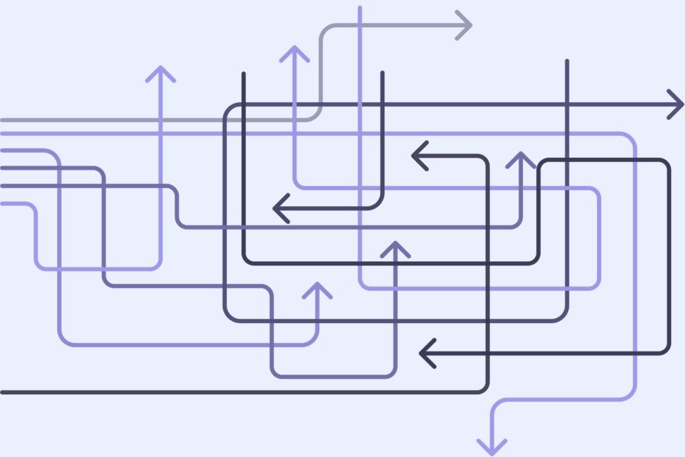

A complex flow diagram consisting of multiple overlapping rectangular paths. The paths are drawn in dark blue and light blue lines. Arrows at the ends of the lines indicate the direction of flow. The diagram shows a series of interconnected steps, with some paths entering from the left, others exiting to the right or bottom, and several feedback loops represented by arrows pointing back to previous stages. The overall structure suggests a multi-stage process with iterative components.

A complex flow diagram with multiple overlapping rectangular paths and arrows in dark blue and light blue, indicating a process flow with feedback loops.

Analyse av funn

### Dagens flyt

Illustrasjonen viser et overordnet bilde av en typisk flyt gjennom systemet sett fra brukers ståsted. Tjenestene varierer fra bydel til bydel, og et felles bilde vil derfor ikke bli helt presist.

Illustrasjonen er en systemisk oversikt laget for å identifisere utløsende årsaker, følgefeil og barrierer, for å sikre at innsatsen gjøres på riktig sted i kjeden.

- Hovedstrømmen av henvisninger til BUP i dag går gjennom fastlegen
- Byrden på å identifisere riktig tjeneste og etablere kontakt i bydel ligger i dag i stor grad på brukeren.
- Blå strek viser flyten bruker har ansvar for, grønn strek viser bydelens flyt

### TJENESTER NÆRMEST DE UNGE

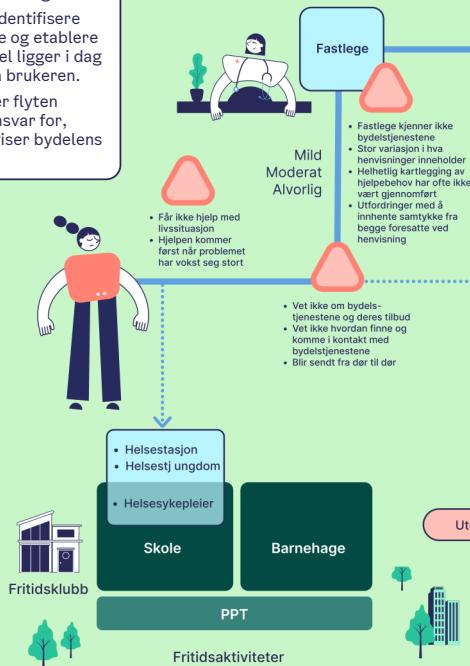

**Fastlege**

- Fastlege kjenner ikke bydelstjenestene
- Stor variasjon i hva henvisninger inneholder
- Helhetlig kartlegging av hjelpebehov har ofte ikke vært gjennomført
- Utfordringer med å innhente samtykke fra begge foresatte ved henvisning

**Mild Moderat Alvorlig**

- Får ikke hjelp med livssituasjon
- Hjelpen kommer først når problemet har vokst seg stort

**Skole**

- Helsestasjon
- Helsestj ungdom
- Helsesykepleier

**Barnehage**

**Fritidsklubb**

**PPT**

**Fritidsaktiviteter**

**Utekontakt**

Diagram showing services closest to young people, including Fastlege, Skole, Barnehage, and Fritidsaktiviteter.

#### EKSEMPEL PÅ TYPISKE TJENESTER INVOLVERT I BYDELENS PSYKISKE HJELPETILBUD

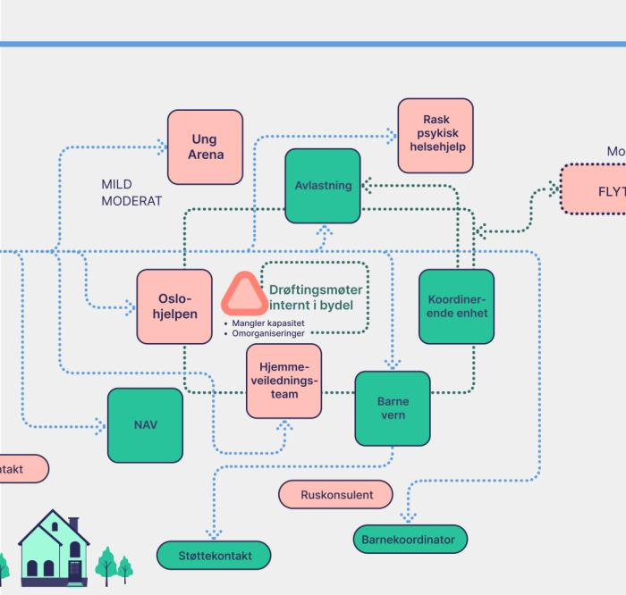

**MILD MODERAT**

**Ung Arena**

**NAV**

**Oslo-hjelpen**

**Avlastning**

**Rask psykisk helsehjelp**

**Drøftingsmøter internt i bydel**

- Mangler kapasitet
- Omorganiseringer

**Hjemmeveilednings-team**

**Barne vern**

**Koordinerende enhet**

**Ruskonsulent**

**Støttekontakt**

**Barnekoordinator**

Diagram showing typical services involved in the municipality's mental health offer, including Ung Arena, NAV, and various support teams.

#### SPECIALISTHELSE-TJENESTEN

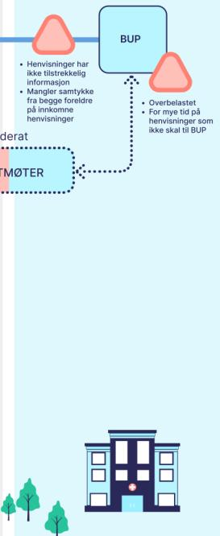

**BUP**

- Henvisninger har ikke tilstrekkelig informasjon
- Mangler samtykke fra begge foreldre på innkomne henvisninger
- Overbelastet
- For mye tid på henvisninger som ikke skal til BUP

**Moderat**

**FLYTMØTER**

Diagram showing the Specialist Health Service (BUP) and its connection to the municipality via a Flytmøter.

#### Systemiske problemer som bør løses

Innsiktarbeidet viser at våre funn er konsistente med funn i øvrig og nasjonalt innsiktsarbeid. Fragmentering, uklar ansvarsdeling og ressursknapphet gjør at samarbeid på samme forvaltningsnivå og også mellom forvaltningsnivåer hviler på enkeltpersoner heller enn strukturer. Dette er gjennomgående nasjonale utfordringer, og hva nye føringer i nasjonal veileder psykisk helsearbeid barn og unge er ment å møte.

Oslo er i en særstilling sammenlignet med mindre kommuner knyttet til demografiske forhold som gir utslag på den psykiske helsetilstanden i kommunen (ref. status pågang til psykisk helsevern barn og unge i Oslo, s. 7), herunder:

- en større og mer heterogen befolkning
- en høyere andel barn og unge med innvandrerbakgrunn, som kan ha andre risikofaktorer
- en urban kontekst med andre utfordringer enn mindre kommuner (f.eks. knyttet til bolig, skolemiljø, rusproblematikk og kriminalitet).

Det er økende behov etter tjenester samtidig som de kuttes i eller nedskaleres, og dette medfører en stor risiko for at mange innbyggere faller utenfor hjelpesystemene, at barn og unge ikke sikres psykisk helsehjelp på rett nivå og til rett tid, eller får et helhetlig og likeverdig tilbud med trygge og forutsigbare overganger mellom nivåene (ref. prosjektets mål, side 5) .

I vår analyse av funn oppfatter vi to overordnede systemutfordringer:

1. Dagens organisering har en struktur og dimensjonering som gjør det ekstra krevende å møte behovene.
2. Dagens tjenester har ikke en tjenesteportefølje som møter behovene, - og de møter ikke skal - kravene i nasjonal veileder.

I det videre beskriver vi våre funn av barrierer og svakheter som aksjonspunkter, sett opp mot struktur og anbefalinger i nasjonal veileder Psykisk helsearbeid barn og unge (2023):

- Avklare hjelpebehov i bydel før BUP
- Være sammen om de komplekse sakene
- En likeverdig psykisk helsetjeneste for barn og unge
- System i samordningen rundt barn, unge og familier
- Tjenestene må oppfattes tilgjengelige
- Redusere hjelpebehovet

Prosjektets mandat handler om koordineringen mellom kommunen og psykisk helsevern barn og unge (kap.5 i veileder), og således primært de to første punktene. Men alle elementene har en sentral rolle i dette «økosystemet», og prosjektets mål- og gevinstbilde har en klar avhengighet til at helheten i tiltakskjeden fungerer. Vi beskriver derfor funn og behov for alle elementene for en mest mulig helhetlig forståelse av utfordringsbildet, og det understrekes at ved å ikke adressere alle punkter, vil utgjøre en betydelig risiko for å kunne oppnå prosjektets gevinster.

#### Avklare hjelpebehov i bydel før BUP

#### Innsiktsfunn

Innsikten viser at henvisninger til BUP ofte mangler en helhetlig og strukturert kartlegging fra primærhelsetjenesten. Det er stor variasjon i kvaliteten på henvisningene, og BUP bruker mye tid på å innhente samtykke og tilleggsopplysninger. Samarbeidsmøter mellom BUP og bydel oppleves som nyttige, men er ikke systematisert. Bydelene melder om manglende kompetanse til å vurdere og håndtere milde, moderate og alvorlige tilstander. I tillegg skaper fravær av digitale løsninger unødvendig merarbeid, særlig når dokumentasjon fra PPT og skole skal vedlegges.

#### Behov

Det er behov for en standardisert kartleggingsprosess i kommunen før henvisning til BUP, samt kompetanseheving i vurdering av alvorlighetsgrad. Digitale løsninger må på plass for å sikre effektiv informasjonsflyt og redusere manuelle prosesser. Dette er avgjørende for å møte kravene i nasjonal veileder om koordinering og helhetlig kartlegging.

*«Ser at utredninger av ADHD og autisme i BUP blir mangelfulle når de ikke kjenner til omsorgssituasjonen (eks. vold i hjemmet) og kontekst rundt barnet like godt som bydelstjenestene.»*

*«De beste henvisningene kommer fra skolehelsetjenesten og psykisk helse i bydelen.»*

*“De som ikke er helt “BUP” men som trenger mer enn fastlege, hva skal vi gjøre med dem?”*

Nasjonal veileder  
Psykisk helsearbeid barn og unge

Logo for Helsedirektoratet

### Kapittel 5: Koordinering mellom kommune og psykisk helsevern for barn og unge (PHBU)

1. Kommunen og PHBU skal samarbeide på systemnivå for å legge til rette for samordnet hjelp til barn og unge med psykiske lidelser og/eller rusmiddelproblemer
2. Kommunen og PHBU bør etablere lokale samarbeidsmodeller for henvisning av barn og unge med psykiske lidelser og/eller rusmiddelproblemer
3. Kommunen og PHBU skal sørge for et helhetlig og samordnet tjenestetilbud til barn og unge med psykiske lidelser og/eller rusmiddelproblemer som har behov for sammensatte tjenester

#### Anbefaling

- Innfør et felles kartleggingsverktøy og rutiner for systematisk vurdering i bydelene.
- Etablere faste samarbeidsarenaer mellom BUP og kommunen for faglig drøfting av saker.
- Prioriter kompetanseheving i vurdering av alvorlighetsgrad, slik at innslagspunkt for psykisk helsehjelp blir tydeligere, og at milde og moderate tilstander håndteres lokalt.
- Digitaliser henvisningsprosessen med integrerte løsninger for dokumentdeling.

Disse tiltakene samsvarer med Helsedirektoratets veileder og støtter regjeringens satsing på lavterskeltilbud og helsereformens mål om mer helhetlige tjenester.

#### Være sammen om de komplekse sakene

#### Innsiktsfunn

Komplekse saker – som alvorlige psykiske lidelser, autismespekterforstyrrelser og sammensatte atferdsutfordringer – utfordrer dagens tjenestestruktur. Overgangene mellom instanser er svake, og fastleger opplever mangelfull dialog underveis i pasientforløpene. Ungdom beskriver tap av oversikt og selvbestemmelse, noe som svekker opplevelsen av hjelp. Halvannenlinjetjenester og FACT Ung trekkes frem som gode eksempler på felles eierskap og trygghet i overgangene, men disse er ikke tilgjengelige for alle. Hospitering og felles møteplasser for kompetanseutvikling er ønsket, men lite systematisert.

#### Behov

Det er behov for strukturerte samarbeidsmodeller som sikrer kontinuitet og felles ansvar i komplekse saker. Tjenestene må ha rutiner for faglige drøftinger og forventningsavklaring, og ungdom må involveres aktivt i beslutninger. Kompetanseutveksling på tvers av nivåer er avgjørende for å møte økende kompleksitet.

*«Mange og tunge saker som krever en annen hjelp enn det vi har hatt av tilbud hittil, og det krever en helt annen fleksibilitet i hjelpeapparatet»*

*«Samarbeids-/flyt-møter med BUP har bidratt til felles forståelse og opplevelse av felles ansvar, som særlig er viktig i de komplekse sakene.»*

*«Vi må være sammen om forventningsavklaring til hjelpen som gis og sikre gode overganger sammen.»*

Nasjonal veileder  
Psykisk helsearbeid barn og unge

 Helsedirektoratet

### Kapittel 5: Koordinering mellom kommune og psykisk helsevern for barn og unge (PHBU)

1. Kommunen og PHBU skal samarbeide på systemnivå for å legge til rette for samordnet hjelp til barn og unge med psykiske lidelser og/eller rusmiddelproblemer
2. Kommunen og PHBU bør etablere lokale samarbeidsmodeller for henvisning av barn og unge med psykiske lidelser og/eller rusmiddelproblemer
3. Kommunen og PHBU skal sørge for et helhetlig og samordnet tjenestetilbud til barn og unge med psykiske lidelser og/eller rusmiddelproblemer som har behov for sammensatte tjenester

#### Anbefaling

- Etablerer faste samarbeidsarenaer og formaliserer halvannenlinjetjenester som bro mellom kommune og spesialisthelsetjeneste.
- Innfører rutiner for felles planlegging og oppfølging av komplekse saker, hvor en også sikrer brukermedvirkning både på system- og individnivå.
- Legg til rette for hospitering og veiledning på tvers for å styrke kompetanse og felles praksis.

Disse tiltakene følger Helsedirektoratets veileder og støtter regjeringens satsing på lavterskeltilbud og helsereformens mål om helhetlige pasientforløp.

#### En likeverdig psykisk helsetjeneste for barn og unge

#### Innsiktsfunn

Ungdom og foreldre etterspør tidlig hjelp i kommunen for å forebygge eskalerende symptomer. Samtidig ser vi økende kompleksitet i tilstandsbildene, særlig innen autismespekterforstyrrelser og alvorlige psykiske lidelser. Nedskjæringer i kommunale lavterskeltilbud har ført til oppgaveglidning mot BUP, som tydelig opplever økt pågang for moderate tilstander. Fastleger melder om uklar ansvarsfordeling og manglende systemstøtte for barn med skolevegring og moderat lidelsestrykk. Foreldre har stort behov for veiledning og praktisk støtte, mens BUP uttrykker bekymring for lav henvisning av sped- og småbarn til tross for økende behov.

#### Behov

Et godt utbygd lavterskeltilbud sikrer kapasitet for milde og moderate plager. Det trengs tydelig ansvarsfordeling mellom nivåene, samt systemer som gir barn, unge og familier enkel tilgang til riktig hjelp. Forebyggende innsats og tidlig intervensjon må prioriteres for å forebygge eskalerende symptomer og redusere presset på spesialisthelsetjenesten.

*«Bydelen kan ofte bare tilby støttekontakt eller BPA, men disse kan ikke fylle et behandlingsbehov etter utskrivning fra BUP – kun i tillegg til.»*

*«Økt pågang til psykiske helsetjenester merkes godt. Det er særlig «mellomgruppen» - de som er for friske for BUP og for dårlige for bydel – som er vanskelig å håndtere.»*

Nasjonal veileder  
Psykisk helsearbeid barn og unge

 Helsedirektoratet

### Kapittel 4: Helhetlig behandling og oppfølging i kommune

1. Kommunen skal sørge for psykisk helsetjeneste til barn og unge med psykiske plager, begynnende rusmiddelproblemer eller reaksjoner på belastende livshendelser
2. Kommunens psykiske helsetjeneste skal kartlegge hjelpebehovet hos barn og unge med psykiske plager, begynnende rusmiddelproblemer eller reaksjoner på belastende livshendelser
3. Kommunens psykiske helsetjeneste skal tilby behandling og oppfølging til barn og unge med psykiske plager, begynnende rusmiddelproblemer eller reaksjoner på belastende livshendelser
4. Kommunen skal sørge for et helhetlig og samordnet tjenestetilbud på individnivå til barn og unge med psykiske plager, rusmiddelproblemer eller reaksjoner på belastende livshendelser og som får oppfølging fra flere tjenester

#### Anbefaling

- Bygg ut psykisk lavterskeltilbud i tråd med føringer i nasjonal veileder og regjeringens varslede satsing og vurdering av lovfesting.
- Sikre riktig kompetanse i førstelinjen for å håndtere moderat lidelsestrykk.
- Prioriter tidlig innsats for småbarn og foreldreveiledning som del av kommunens helhetlige tjeneste.

Disse tiltakene følger Helsedirektoratets veileder og støtter helsereformens mål om likeverdige og tilgjengelige tjenester.

#### Sikre samordningen rundt barn, unge og familier

#### Innsiktsfunn

Barn og familier opplever hjelpeapparatet som fragmentert og uoversiktlig. Ansatte i bydel har ofte begrenset kjennskap til helheten i eget tjenestetilbud, og intern koordinering er svak. Dette gir risiko for både under- og overbehandling. Fastleger melder om uklar ansvarsfordeling og manglende systemstøtte, og ønsker mer samarbeid med kommunale tjenester. Selv om enkelte bydeler lykkes med tverrfaglig samarbeid, hviler samordningen generelt på enkeltpersoners initiativ fremfor strukturer. Manglende rutiner for intern samhandling gjør at helhetlig forståelse av barnets situasjon uteblir.

#### Behov

Det er behov for formelle strukturer og rutiner som sikrer koordinering på tvers av tjenester og forvaltningsnivåer. Tjenestene må ha felles oversikt over barnets situasjon og en plan som gir forutsigbarhet for familien. Kompetanse om samarbeid og helhetlig vurdering må styrkes.

*«Det er et aktuelt problem at folk alltid blir sendt videre, og blir kasteball i systemet. De ulike tjenestene vet ikke nok om hverandre. Man sender de dit fordi man tenker at det er riktig, men så vet man ikke helt hva den tjenesten jobber med eller har som målgruppe.»*

*«Fra BUP sitt perspektiv er det ønske om en mer samordnet rolle fra bydel, særlig i de komplekse sakene. Et savn at bydelen kan samordne seg til en eller ett kontaktpunkt, så ikke «alt og ingen» holder i det.»*

*«Hvordan ivareta foreldrene underveis i behandling, tjenestene i bydel og i helse barn og unge er veldig oppdelte – vi må ha et helhetsperspektiv.»*

Nasjonal veileder  
Psykisk helsearbeid barn og unge

 Helsedirektoratet

### Kapittel 3: Tidlig innsats og samarbeid i kommunen

1. Kommunens ledelse skal sørge for et tverrsektorielt samarbeid på systemnivå som legger til rette for samordnet hjelp til barn og unge med psykiske plager, begynnende rusmiddelproblemer og/eller som er utsatt for belastende livshendelser
2. Kommunens ledelse bør sørge for en tilgjengelig oversikt over det helhetlige tilbudet til barn og unge og deres familier og sørge for at befolkningen og tjenestene vet hvor de tar kontakt når det oppstår en bekymring

#### Anbefaling

- Innfør systematiske samhandlingsmodeller som BTI eller tilsvarende i alle bydeler.
- Etabler digitale verktøy for felles planlegging og informasjonsdeling mellom aktører.
- Formaliser rutiner for tverrfaglige møter og felles ansvar for oppfølging.

Disse tiltakene følger Helsedirektoratets veileder og er i tråd med helsereformens mål om helhetlige tjenester og regjeringens satsing på lavterskeltilbud som skal være lett tilgjengelige og samordnet.

#### Tjenestene må oppfattes tilgjengelige

#### Innsiktsfunn

Barn, unge og foreldre beskriver kommunens psykiske helsetjenester som «hemmelige» – vanskelige å finne og forstå. Det er stor variasjon i hvordan informasjon om tilbud, rettigheter og veier inn til hjelp formidles. Fastleger etterspør et samordnet kontaktpunkt i bydel for henvisninger til kommunale tjenester, og BUP ønsker bedre navigasjonshjelp i bydelens system. Det mangler digitale løsninger som gir oversikt over tjenestetilbud og veiledning for ulike brukergrupper.

#### Behov

Det er behov for tydeligere struktur og synlighet i kommunens psykiske helsetjenester. Familier og fagpersoner må ha enkel tilgang til informasjon om tilbud, forløp og kontaktpunkter. Digital navigasjon og rådgivning må utvikles for å sikre forutsigbarhet og redusere barrierer.

*«Det er stort behov for bedre navigasjon inn til kommunens tjenester. Vi trenger et kontaktpunkt i bydel for henvisninger til det kommunale tjenestetilbudet, slik som seniorkontakten i bydel. Et navigasjonsverktøy inn til kommunens tjenester for både innbygger og fastlege som ligner NAV sitt. Med hjelpenavigasjon som “Jeg er bekymret for barnet mitt”, “Jeg trenger hjelp”, og med FAQ “Hva skal jeg gjøre når barnet mitt nekter å gå på skolen?”*

*«Det er veldig vanskelig for oss å finne ut av tjenestene i de ulike bydelene, tjenestene heter ulike ting.»*

*«Vi får ikke lov til å legge ut ting på kommunens nettside, så vi har laget egen app for å nå ungdommene med vårt tilbud.»*

Nasjonal veileder  
Psykisk helsearbeid barn og unge

Logo for Helsedirektoratet

### Kapittel 3: Tidlig innsats og samarbeid i kommunen

1. Kommunens ledelse skal sørge for et tverrsektorielt samarbeid på systemnivå som legger til rette for samordnet hjelp til barn og unge med psykiske plager, begynnende rusmiddelproblemer og/eller som er utsatt for belastende livshendelser
2. Kommunens ledelse bør sørge for en tilgjengelig oversikt over det helhetlige tilbudet til barn og unge og deres familier og sørge for at befolkningen og tjenestene vet hvor de tar kontakt når det oppstår en bekymring

#### Anbefaling

- Etabler ett samordnet kontaktpunkt i hver bydel for psykisk helse og rus, og utvikle digitale plattformer med oversikt over tjenester, veiledning og veier inn til hjelp.
- Kommuniser tydelig ansvarsfordeling og forløp til både fagpersoner og innbyggere.

Disse tiltakene følger Helsedirektoratets veileder og støtter regjeringens satsing på lavterskeltilbud og helsereformens mål om tilgjengelige og brukervennlige tjenester.

#### Redusere hjelpebehovet

#### Innsiktsfunn

Ungdom forteller at psykiske plager ofte startet med mindre utfordringer som ble forverret fordi de ikke ble løst tidlig. Manglende forebygging og lav helsekompetanse hos foreldre og befolkningen gjør at belastningen øker før hjelp gis. Det er behov for å normalisere psykisk helse og skille mellom livsutfordringer og psykisk lidelse. Kommunen mangler styringsdata for å kartlegge omfanget av hjelpebehov, og BUP uttrykker bekymring for lav henvisning av sped- og småbarn til tross for økende alvorlighet fra barnehagealder. Mange familier opplever stressende hverdager og systemer som ikke tilpasses ulike behov.

#### Behov

Det trengs en tydelig satsing på helsefremmende og forebyggende arbeid i kommunen, med fokus på tidlig innsats, økt helsekompetanse og universelle tiltak i skole og nærmiljø. Kommunen må ha bedre oversikt over psykisk helsetilstand hos barn og unge for å planlegge ressursbruk.

*«Det oppleves som veldig fokus på at du skal ha en diagnose, og så blir du sendt til BUP, og de er jo opptatt av diagnoser. Hun på BUP var dårlig på venne- og familieperspektivet, det var litt jeg som var problemet, men så var det jo de andre faktorene rundt. Det var ikke godt miljø på skolen, men ble ikke snakk om skolebytte. Ta disse områdene på alvor og det er her en kan gjøre en forskjell.»*

*«Det er mye arbeid rundt normalisering i skolene, hva som er psykisk helse versus psykisk uhelse. Vi har to psykologer på helsestasjon for ungdom, videregående merker stort trykk.»*

Nasjonal veileder  
Psykisk helsearbeid barn og unge

Helsedirektoratet logo

### Kapittel 2: Kommunens helsefremmende og forebyggende arbeid

1. Kommunens ledelse skal sørge for at kommunen har oversikt over faktorer som påvirker oppvekstvilkår og den psykiske helsetilstanden til barn og unge i kommunen
2. Kommunens ledelse skal sørge for at planer inneholder mål og strategier for det helsefremmende og forebyggende arbeidet for barn og unges psykiske helse
3. Kommunens ledelse skal sørge for systematisk medvirkning fra barn, unge og deres foreldre ved planlegging og utvikling av helsefremmende tiltak og psykisk helsetilbud til barn og unge i kommunen

#### Anbefaling:

- Utvikle systemer for styringsdata og behovskartlegging.
- Prioriter forebyggende tiltak i barnehage og skole, og styrk foreldrestøtteprogrammer.
- Styrk grunntjenestenes kompetanse på å gjenkjenne tidlige tegn på skjevutvikling og psykisk uhelse med bidrag fra BUP, som en del av spesialisthelsetjenestens veiledningsplikt.

Disse tiltakene følger Helsedirektoratets veileder og samsvarer med regjeringens satsing på lavterskeltilbud og helsereformens mål om bærekraftige tjenester med tidlig innsats.

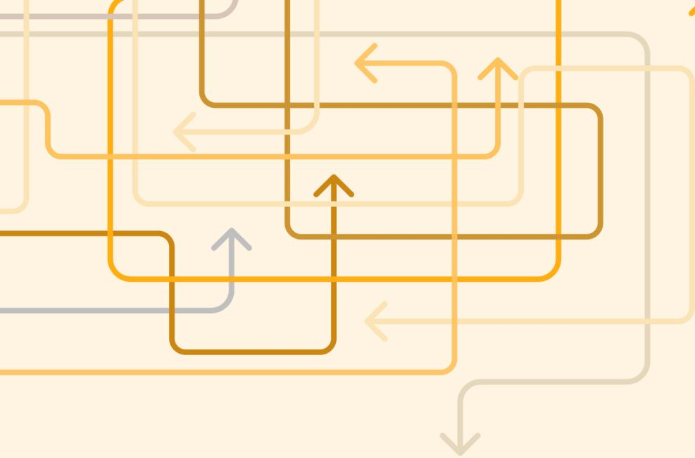

An abstract graphic consisting of multiple overlapping rectangular paths. The paths are drawn in various shades of orange, yellow, and grey. Some paths have arrows at their ends, indicating direction. The overall composition is located in the upper-left portion of the image, with the paths extending towards the right and bottom.

Abstract graphic of overlapping rectangular paths with arrows in various shades of orange and grey.

Mulighetsrom

## Forslag: Morgendagens flyt

### Hovedgrep:

- Informasjon
- En dør inn
- Helhetlig kartlegging av livssituasjon og behov
- Felles inntaksteam i bydel
- Flytmøter
- Felles innsatsteam
- FACT Ung

### TJENESTER NÆRMEST DE UNGE

Illustration of a doctor at a desk with a laptop and a plant.

Fastlege

ALVORLIG

Information icon: a white 'i' inside a blue circle.

Illustration of a person standing and looking towards the services.

Illustration of a computer monitor showing a map or data.

Helhetlig kartlegging

Illustration of a door with a handle.

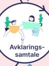

Illustration of two people talking, representing a clarifying conversation.

Avklarings-samtale

- Helsestasjon
- Helsestj ungdom
- Helsesykepleier

Skole

Barnehage

PPT

Fritidsaktiviteter

Illustration of a school building.

Fritidsklubb

Illustration of trees and a small building.

Utekontakt

Illustration of a house.

### EKSEMPEL PÅ TYPISKE TJENESTER INVOLVERT I BYDELENS PSYKISKE HJELPETILBUD

MILD

Ung Arena

Oslo-hjelpen

Hjemme-veilednings-team

Rask psykisk helsehjelp

MODERAT

Inntaksteam bydel

Avlastning

NAV

Barne vern

Koordiner-ende enhet

Barnekoordinator

Støttekontakt

Ruskonsulent

#### SPELIALISTHELSE-TJENESTEN

BUP

FLYTMØTER

FACT ung

Felles innsatsteam

Illustration of a large building, likely a hospital or specialist center.

Illustration of trees.

### Forslag: Morgendagens flyt – tre hovedgrep

**TJENESTER NÆRMEST DE UNGE**

Fastlege

**EKSEMPEL PÅ TYPISKE TJENESTER INVOLVERT I BYDELENS PSYKISKE HJELPETILBUD**

Oslo- Hjemme-

**SPESIALISTHELSE-TJENESTEN**

BUP

**1.** «En dør inn» - lett å finne og lett å bruke

**2.** Helhetlig og koordinert kartlegging før henvisning

**3.** Være sammen om de komplekse sakene

Avklarings-samtale

Inntaksteam bydel

FLYTMØTER

FACT ung

Felles innsatsteam

Helsesykepleier

Skole

Barnehage

Utekontakt

Støttekontakt

vern

Barnekoordinator

Fritidsklubb

PPT

Fritidsaktiviteter

A complex diagram illustrating a mental health service model with three main pillars: 'TJENESTER NÆRMEST DE UNGE', 'EKSEMPEL PÅ TYPISKE TJENESTER INVOLVERT I BYDELENS PSYKISKE HJELPETILBUD', and 'SPESIALISTHELSE-TJENESTEN'. It shows a flow from an 'Avklarings-samtale' to an 'Inntaksteam bydel' and then to various service teams like 'FLYTMØTER', 'FACT ung', and 'Felles innsatsteam'. A dark blue box on the left lists three key principles.

### Morgendagens flyt – tre hovedgrep

Etter innsikten som nå er innhentet fra brukere og ansatte i tjenestene, tror vi det vil være mye å hente på å endre på dagens flyt ved at milde og moderate tilstander i all hovedsak sluses via kommunen/ bydelens tjenester. Fastlegen har fortsatt en viktig rolle, særlig rundt henvisning av alvorlige tilstander som trenger akutt behandling, men i større grad lose mildere tilstander til bydelens tilbud for helhetlig kartlegging og oppfølging.

Ved å etablere digital innsøking til kommunen/ bydelens psykiske helsetilbud for barn, unge og familier økes tilgjengeligheten og det blir enklere å sikre like vurderinger av henvendelser med et felles mottak. Den digitale løsningen bør være en tydelig vei inn som er lett å bruke for unge, foreldre, fastleger, helsesykepleiere og andre som vil melde bekymring. Bak den digitale innsøkingen etableres et inntaksteam som raskt kan avklare hjelpebehov og lose videre til riktig tilbud i bydelen.

Etter en innledende kartlegging i digital innsøking gis det invitasjon til en avklaringssamtale. Ved milde tilstander kan dette være helsesykepleier eller Ung Arena. For moderate tilstander inviteres det til en avklaringssamtale med psykolog i inntaksteamet. Ved mistanke om et tilstandsbilde moderat til alvorlig har inntaksteamet lett tilgang til faglig drøfting med spesialist i BUP, og ved behov sikres en helhetlig og koordinert henvisning til psykisk helsevern.

For å sikre de mest sårbare pasientene er det nødvendig at BUP og bydelene skaper mulighet for mer integrerte og sømløs pasientforløp. Her anbefaler vi videreutvikling av FLYT møter for felles drøfting og koordinering rundt barn og unge med moderat-alvorlige tilstandsbilder. Vi foreslår oppskalering av FACT Ung til å dekke alle bydeler, gjerne ved at flere bydeler slå seg sammen om team, slik FACT Oslo Sør har for tre bydeler.

I tillegg foreslår vi å utforske mulige felles innsatsteam rundt særlige diagnosegrupper med fagpersoner fra både bydeler og BUP for å øke kompetanse og trygge overganger.

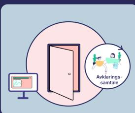

1. «En dør inn» - lett å finne og lett å bruke

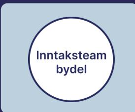

2. Helhetlig og koordinert kartlegging før henvisning

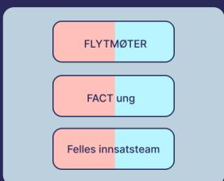

3. Være sammen om de komplekse sakene

## Prioritering av behov opp mot prosjektets målbilde

### Avklare hjelpebehov i bydel før BUP

- Innfør et felles kartleggingsverktøy og rutiner for systematisk vurdering i bydelene.
- Etabler faste samarbeidsarenaer mellom BUP og kommunen for faglig drøfting av saker.
- Prioriter kompetanseheving i vurdering av alvorlighetsgrad slik at innslagspunkt for psykisk helsehjelp i kommune blir tydeligere.
- Digitaliser henvisningsprosessen med integrerte løsninger for dokumentdeling.

### Være sammen om de komplekse sakene

- Etabler faste samarbeidsarenaer og formaliser halvannenlinjetjenester som bro mellom kommune og spesialisthelsetjeneste.
- Innfør rutiner for felles planlegging og oppfølging av komplekse saker, hvor en også sikrer bruker-medvirkning både på system- og individnivå.
- Legg til rette for hospitering og veiledning på tvers for å styrke kompetanse og felles praksis.

Det overordnede målet for prosjektet er at barn og unge sikres psykisk helsehjelp på rett nivå og til rett tid, og et helhetlig og likeverdig tilbud med trygge og forutsigbare overganger.

#### Delmål:

1. Sikre etablering av samhandlingsarena mellom kommune/bydel og sykehus/BUP for å legge til rette for helhetlig og samordnet hjelp til barn og unge.
2. Sikre barn og unges rett til informert samtykke ved deling av taushetsbelagt informasjon mellom ulike hjelpetjenester.
3. Sikre en helhetlig og koordinert kartlegging og vurdering i kommune/bydel før henvisning til sykehus/BUP.
4. Sikre raskere avklaring av videre oppfølging i sykehus/BUP eller bydel/kommune.
5. Sikre rutiner for oppfølging etter utskrivelse og koordinering rundt barn og unge som mottar tjenester fra begge forvaltningsnivåer samtidig.
6. Bidra til utvikling av tjenester og tilbud som kan styrke brukers/pasients- og pårørendes helsekompetanse.

Prosjektets mandat handler primært om koordineringen mellom kommune og psykisk helsevern barn og unge, og bør derfor ha sitt hovedfokus på tiltak og utviklingsarbeid knyttet til anbefalingene på disse to områdene.

Imidlertid avhenger det overordnede målbildet betydelig av en tydeligere struktur og synlighet i kommunens psykiske helsetjeneste. Prosjektet bør derfor delta i et samarbeid rundt dette for å sikre synergieffekter.

## Forslag tiltakskjede for prosjektet

### 1. «En dør inn» - lett å finne og lett å bruke

#### Anbefaling

- Etabler ett samordnet kontaktpunkt i hver bydel for psykisk helse og rus, og utvikle digitale plattformer med oversikt over tjenester, veiledning og veier inn til hjelp.
- Kommuniser tydelig ansvarsfordeling og forløp til både fagpersoner og innbyggere.

#### Mulig bidrag fra prosjektet

I samarbeid med Helseetaten utforske mulighets- og løsningsrom for digital innsøking til psykisk helsehjelp i kommune/ bydel, som inkluderer:

- Lett tilgjengelig og brukervennlig inngang for å melde behov, kartleggingsskjema for digital triagering, og samtykke til journalpraksis
- Foreslå organisering og dimensjonering av inntaksteam for vurdering og prioritering av henvendelser i samarbeid med arbeidsgruppe
- Planlegge og gjennomføre brukertest og pilotering i samarbeid med pilotbydel

### 2. Helhetlig og koordinert kartlegging før henvisning

#### Anbefaling

- Innfør ett felles kartleggingsverktøy og rutiner for systematisk vurdering i bydelene.
- Etabler faste samarbeidsarenaer mellom BUP og kommunen for faglig drøfting av saker.
- Prioriter kompetanseheving i vurdering av alvorlighetsgrad, slik at innslagspunkt for psykisk helsehjelp blir tydeligere, og at milde og moderate tilstander håndteres lokalt.
- Digitaliser henvisningsprosess til BUP med integrerte løsninger for dokumentdeling.

#### Mulig tiltak fra prosjektet

I samarbeid med arbeidsgruppe utforske muligheter og utarbeide anbefalinger for bruk, eventuelt utforme designprinsipper, for:

- Verktøy for helhetlig kartlegging av livssituasjon og behov
- Tiltak for å styrke vurdering av alvorlighetsgrad psykisk helsetilstand for raskere avklaring av videre forløp
- Bidra i behovsanalyse for digitalisering av henvisningsprosess med dokumentdeling

### 3. Være sammen om de komplekse sakene

#### Anbefaling

- Etabler faste samarbeidsarenaer og formaliser halvannenlinjetjenester som bro mellom kommune og spesialisthelsetjeneste.
- Innfør rutiner for felles planlegging og oppfølging av komplekse saker, hvor en også sikrer brukermedvirkning både på system- og individnivå.
- Legg til rette for hospitering og veiledning på tvers for å styrke kompetanse og felles praksis.

#### Mulig tiltak fra prosjektet

I samarbeid med arbeidsgruppe utforske muligheter og foreslå løsninger for:

- Tydelig struktur og forankring av flytmøter mellom BUP og bydel
- Skalering av flere halvannenlinje tjenester
- Felles innsatsteam for særskilte grupper

I samarbeid med unge brukere/ ekspertpanel utarbeide verktøy og råd for hva ungdom ønsker for å styrke medvirkning, informert samtykke, selvbestemmelse og tillitsrelasjon til hjelperne

## Appendix

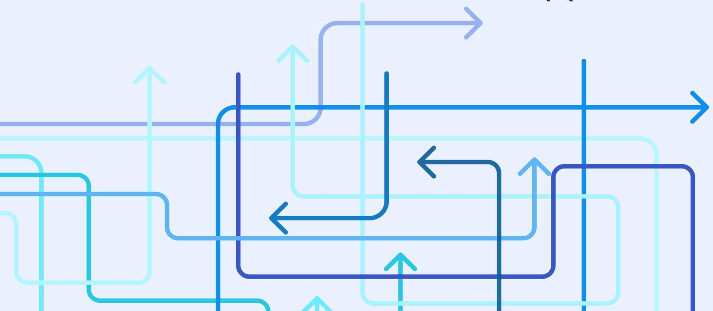

An abstract graphic consisting of multiple overlapping arrows in various shades of blue and teal. The arrows are of different lengths and orientations, pointing in various directions (up, down, left, right). They are arranged in a way that creates a sense of depth and complexity, with some arrows appearing to be in front of others. The background is a solid light blue.

Abstract graphic of overlapping arrows in various shades of blue and teal.

### Kilder kunnskapsgrunnlag

#### Oslo-spesifikke kilder:

- Comte Bureau. 2019. Bedre brukerreiser for barn i risikosonen - Bydel Alna og Bydel Bjerke.
- Den norske legeforening. (2020). Psykolog på fastlegekontoret ga gevinster
- Kommunerevisjonen Oslo. 2018. Bydelenes forebygging av utenforskap blant barn og unge.
- Kommunerevisjonen Oslo. 2021. Koordinering for barn og unge med stort hjelpebehov - Bydel Sagene og Bydel Vestre Aker.
- Nøkleberg, M., Gundhus, H. O. I., Dyb, E., & Lid, S. (2022). *Evaluering av SaLTo-samarbeidet: Forutsetninger for effektivt tverretatlig og tverrfaglig samarbeid*. Universitetet i Oslo, Institutt for kriminologi og rettssosiologi.
- Origo. 2023. Innsats og utfordringer – barn og unge med sammensatte behov (Oslo Origo Sluttrapport, 2023)
- Oslo kommune. (2025, oktober). *Fremtidig organisering av Oslo kommune: Rapport oktober 2025*. Oslo kommune.
- Oslo kommune. (2025, 8. oktober). *Vedlegg 2: Notat: Innbyggerreisen for sårbare barn og unge* (Bydelsreformen fase 3). Oslo kommune.
- Oslo kommune, Bydel Grorud. (2023). *Grorudmodellen – Nærmiljøskoler: Sluttrapport*. Bydel Grorud.
- PROBA samfunnsanalyse. 2022. Kunnskapsgjennomgang - Særlig utsatt ungdom mellom 15 og 23 år.
- Rugkåsa, J., Tveit, O. G., Berteig, J., Hussain, A., & Ruud, T. (2020). Collaborative care for mental health: a qualitative study of the experiences of patients and health professionals. *BMC Health Services Research*, 20(1), 569. <https://doi.org/10.1186/s12913-020-05691-8>

#### Øvrige kilder:

- 0-24 samarbeidet. 2019a. Bedre informasjon og mer samordnede og koordinerte tjenester for barn og unge med nedsatt funksjonsevne og deres familie, foreløpig utkast knyttet til 0-24 samarbeidet.
- Barne- og familiedepartementet. NOU 2009: 22. Det du gjør, gjør det helt — Bedre samordning av tjenester for utsatte barn og unge.
- Barneombudet. 2022. "Hvem skal jeg snakke med nå?" Rapport om psykisk helsetilbud til barn og unge i kommunene.
- Barneombudet. (2020). – Jeg skulle hatt BUP i en koffert: En psykisk helsetjeneste tilpasset barn og unges behov. Barneombudet. (ISBN 978-82-7987-212-2)
- Borge, E., Drange, I., Fossetøl, K. og Jarning, H. (2014). Et lag rundt læreren. Kunnskapsoversikt. (AFI-rapport 8/2014). Oslo: Arbeidsforskningsinstituttet.
- DIFI. 2014. Mot alle odds? Veier til samordning i norsk forvaltning.
- EGGS design. 2018. Samlet innsats - for barn og unge med nedsatt funksjonsevne og deres familier.
- Fafo. 2019:21. 0–24-samarbeidet. Et kunnskapsgrunnlag.
- Fafo. 2020. Trøbbel i grenseflatene - Samordnet innsats for utsatte barn og unge.
- Folkehelseinstituttet. (2025). Temautgave av Folkehelse rapporten 2025: Barn og unges psykiske helse (ISBN 978-82-8406-508-3).
- Fossum et al., 2015. Samhandling mellom barnevern og psykisk helsevern for barn og unge – en litteraturgjennomgang
- Fossum, Lauritsen et al., 2014. Samhandling og samarbeid mellom barnevern og psykisk helsevern for barn og unge

### Kilder kunnskapsgrunnlag

### Øvrige kilder (forts):

- Helsedirektoratet. 2019. Hvor skal man begynne? Et utfordringsbilde blant familier med barn og unge som behøver sammensatte tjenester.
- Helsedirektoratet. (2021, 19. mai). Psykisk helsearbeid for barn og unge - en innsiktsrapport.
- Helsetilsynet. 2009. Utsatte barn og unge – behov for bedre samarbeid.
- Ipsos. 2018. Kartlegging av samhandling om utsatte barn og unge.
- Jacobsen, S.E., Østerud, K.L., Vedeler, J.S. & Früh, E.A. (2025). Individuell plan som digitalt samhandlingsverktøy: fortolkning, bruk og avvisning. Tidsskrift for velferdsforskning (scup.com)
- Kjellekvold, Alice (2014): Individuell plan i helse- og omsorgstjenesten – behov for endringer og ansvarliggjøring? Tidsskrift for erstatningsrett, 11 (4), pp.267-285.
- Møreforskning. 2015. Trygg oppvekst - helhetlig organisering av tjenester for barn og unge.
- NIBR: «Styring gjennom støtte og veiledning: lokale effekter av pedagogiske virkemidler for tverrsektorielt samarbeid om utsatte barn og unge» (2020:22)
- Nordlandsforskning. 2016. Mellom linjene? En kunnskapsstatus om ungdom med sammensatte behov for offentlige velferdstjenester.
- Nordlandsforskning. 2012. Ikke slipp meg! Unge, psykiske helseproblemer, utdanning og arbeid.
- NOVA. 2017. Kunnskapsoppsummering -Vold mot barn og systemsvikt.
- NOVA. 2018. Samordning av tjenester for barn, ungdom og unge voksne med nedsatt funksjonsevne – Kunnskapssammenstilling.
- NOVA. 2014. Til god hjelp for mange. Evaluering av Losprosjektet.
- NOVA. 2016. Tjenestetilbud til familier med barn med funksjonsnedsettelser.
- PricewaterhouseCoopers AS. (2019, 10. oktober). Følgenotat til videreutviklet effektmodell for Asker velferdslab.
- Riksrevisjonen. 2021. Undersøkelse av helse- og omsorgstjenester til barn med funksjonsnedsettelser.
- RKBU Kunnskapssammenstilling om faktorer som påvirker samhandling mellom velferdssektorene om utsatte barn og unge (Brøndbo, Krane & Makarova, RKBU Nord, Rapport 3/2017)
- SINTEF. 2017. Evaluering av samhandlingstiltak rettet mot utsatte barn og unge.
- SINTEF. 2020. Kommunalt psykisk helse - og rusarbeid 2020.
- SINTEF. 2008. Tilgjengelighet av tjenester for barn og unge med psykiske problemer. Evaluering av opptrappingsplanen for psykisk helse (Andersson H.W. og Steihaug S., SINTEF-rapport nr. A261/2008)
- SINTEF. 2014. Utfordringer med ungdomssatsingen i Sør-Trøndelag. Et system- og aktørperspektiv.
- Statens undersøkelseskomisjon for helse- og omsorgstjenesten (Ukom). 2020. Ungdom med uavklart tilstand - Samhandling mellom kommunale tjenester og mellom kommunale tjenester og BUP.
- Tøssesbro, J., Berg, B., Bruteig, R., Caspersen, J., Hermstad, I. H., & Wendelborg, C. (2023, August). Bedre tjenester til barn og unge med sammensatte behov? Delrapport 1: Utgangspunktet da lovendringene trådte i kraft. NTNU Samfunnsforskning.
- Tøssesbro, J., Berg, B., Bruteig, R., Caspersen, J., & Wendelborg, C. (2025). Lovendringer møter kommunal hverdag: Delrapport 2 fra evaluering av endringer i velferdstjenestelovene (Rapport 2025). NTNU Samfunnsforskning AS.
- Universitetet i Tromsø. 2017. Kunnskapssammenstilling om faktorer som påvirker samhandling mellom velferdssektorene om utsatte barn og unge.

### 1

#### Hjelp til å løse riktig problem

BUP fulgte bare en prosedyre, var bare én av 1000. På grunn av at de ikke skulle legge en diagnose på meg, gikk det veldig fort, det var utenfor min kontroll, det gjorde det jo vanskeligere.

- Ungdom

«Alles øyne er på deg, men samtidig ser ingen på deg.»

- Ungdom

"Ja, vi ser deg, men vi vil ikke se deg mer."

- Ungdom, om å få beskjed om at BUP ikke har et tilbud til hen

Det oppleves som veldig fokus på at du skal ha en diagnose, og så blir du sendt til BUP, og de er jo opptatt av diagnoser. Hun på BUP var dårlig på venne- og familieperspektivet, det var litt jeg som var problemet, men så var det jo de andre faktorene rundt. Det var ikke godt miljø på skolen, men ble ikke snakk om skolebytte. Ta disse områdene på alvor og det er her en kan gjøre en forskjell.

- Ungdom

Litt som å bli daska i trynet. Jeg synes ikke det var lett å få det ut (å få fortalt hvordan jeg hadde det), at de dermed ikke skjønte det og ville ha meg ut. Da ble det litt kjipt, var ikke noen god følelse og følte ikke at jeg ble tatt på alvor.

- Ungdom, om å få beskjed om at hen ikke kvalifiserte for behandlingstilbud på BUP

1

#### Hjelp til å løse riktig problem

*Det føltes veldig som å komme til et sykehus, resepsjonen så ut som et sykehus, det var lite farge på veggene, linoleumsgulv likt overalt, og like takplater og grelt lys.*

- Ungdom

*Jeg fikk enetiltak på xxx (barnevernsinstitusjon utenfor byen), det var så ille, forstår ikke at de kan få drive.*

- Ungdom

*De (BUP) snakka ikke på det nivået jeg trengte, så jeg sleit med å svare. De snakka ikke på et barns nivå, de stod over meg med en lampe bak seg, og når de først spurte spørsmål var det hastespørsmål som de ikke spurte rolig om. Jeg måtte følge med for å få det med meg.*

- Ungdom

*"Du føler jo at det er et eller annet galt med deg når du er der" (I BUP)*

- Ungdom

*Følte vi satt veldig mye og reflekterte begge to på ROBUST, men følte ikke at det hjalp meg noe. Ble repetitivt. Vet ikke hva det vil si å få ordentlig hjelp så jeg ikke har det så vondt lengre. Jeg har jo gått til helse-sykepleier, BUP og ROBUST, men har det fortsatt vondt.*

- Ungdom

*Når jeg begynte på BUP møtte jeg en behandler som møtte meg med skjemaer og det gjaldt å få en diagnose og inn i systemet. Fokus på at jeg hadde et problem.*

- Ungdom

### 2

#### Hjelp til riktig tid

Starten var viktig: Helsesøster og deretter henvisning, begynte rolig og normalt. Kunne gjort mye der. Da jeg ble dårlig ble det vanskelig med venner, overgang til ungdomsskolen. Familien begynte å blande seg, opplevde tillitsbrudd ved at foreldre og skole.... Psykisk helse var egentlig grei, utviklingen når en blir ungdom, det som egentlig er naturlig (...). Det var egentlig ikke så store ting, men det ble forsterket.

- Ungdom

Det begynte med mobbing som førte til selvskading, som førte til psykisk uhelse.

- Ungdom

Læreren dro henne fysisk ut av bilen, så ikke at hun var frosset i skrekk. Jeg skjønner godt at hun sitter fast i det nå. Det tar lang tid å reparere.

- Forelder

Hjelpen jeg fikk gjorde det mye, mye verre. Når jeg sammenligner med hva jeg får på DPS nå, vet jeg at jeg ikke fikk hjelpen jeg trengte da.

- Ungdom

3

#### En trygg los i et kaotisk system

Om overgang til DPS:

Overganger kan være ganske dårlige, plutselig skal du klare deg mye mere selv. Jeg ringte til hun på BUP og sa at jeg savnet henne. Jeg fikk gode tips da, om å skrive ned det jeg ville ha sagt.

- Ungdom

Jeg merket manglende samarbeid mellom instanser, og en gang gikk det så langt som at jeg måtte stoppe en krangel mellom to stykker om meg. Jeg som 15-åring, det er å gå for langt.

- Ungdom

Søstrene mine tok meg med til helsestasjonen, hvor helsesykepleier oppfordret meg til å gå til fastlegen, som sendte meg til BUP (...). Jeg var 13-14 år. Helsestasjonen hadde skrevet et ark om at jeg hadde vært der (med hva vi hadde snakket om), som jeg kunne levere til fastlegen. Det var fint og gjorde jobben enklere for meg. Å slippe å være gjennom alle de prosessene selv.

- Ungdom

47 personer hadde en mening om hvordan jeg skulle leve livet mitt, og jeg er jo en people pleaser så det ble vanskelig å gi 47 personer rett om livet mitt, jeg ble utslitt av å være den eneste linken mellom alle folka. Alt går gjennom deg som bruker, som en løpegutt.

- Ungdom

### 3

#### En trygg los i et kaotisk system

*Den samhandlingsgreiene, veldig mye av byrden blir lagt på oss. Det journalføres jo ingenting når vi har barnekoordinator og ansvarsgruppe i bydel X. Det er jo så lavterskelgreier for de.... men for oss er det ganske så omfattende. Hver gang vi har truffet nye, må vi gjennom samme mølja og fortelle det på nytt igjen. Det er så slitsomt.*

- Forelder

*Det er også greia - jeg vet ikke hva mine behov er. Jeg har aldri vært i denne situasjonen før. Det er det der med proaktivitet. Det at noen sier "ja, dette kjenner vi. Da har vi erfaring med.*

- Forelder

*Vi fikk en barnekoordinator, men jeg vet da f.... Hva skal jeg si? Det virket ikke som om hun hadde noe verktøy.*

- Forelder

*I den situasjonen kan man ikke ta for gitt at foreldrene vet hva slags behov de har. Det offentlige har erfaring, og vet litt hva som er her. De må gi faglige anbefalinger og veiledning. "Det er bare å spørre" sier de... Nei, det er ikke det. Vi vet ikke hva vi skal spørre om.*

- Forelder

4

#### Risiko når ingen ser forløpet fra brukers ståsted

*BUP er veldig initiativrik, ser behov, med familieveiledning, de er ryddige og jeg har tro på at ikke fader ut. Det skjer ting hos BUP i forhold til hos bydel, vi trenger ikke å kjempe.*

- Forelder

*Bruker sikkert 1/3 av arbeidet på saksbehandlenga og losinga videre. Å ta i mot og kartlegge på telefon, ta de med til teammøte, diskutere og vurdere og tenke riktige tjenester. Så er det å ringe tilbake og gi den beskjeden. Omtrent 1/3 skal ikke til oss. Noen ganger ringer de samme personene tilbake igjen, fordi de har fått avslag på det neste stedet.*

- Rask Psykisk Helsehjelp

*Jeg ble liggende på BUPA i nesten to år, da jeg ikke hadde/fikk tilbud som hadde rett kompetanse. Jeg burde ikke vært innlagt, jeg burde bodd hjemme. De fant ikke ut hvor jeg skulle være. Det var en akuttavdeling og jeg ble kjempedårlig av å være der. Min funksjonsevne var høyere da jeg ble lagt inn enn da jeg ble skrevet ut.*

- Ungdom

*Jeg vet ikke helt hvordan dette fungerer, men bydelen lagde et skriv om min fungering og sendte ut til tjenestene. Men hver gang min funksjonsevne endret seg, måtte en gjøre prosessen på nytt. Da ble alt trukket tilbake og en måtte starte på nytt (...) og det tok kjempelang tid.*

- Ungdom

*Plutselig kom det en vernepleier, og da ble vi nesten lovet gull og grønne skoger. Vi ble så glade. Men så bare fadet det ut. Vi hører masse gode ord, og så er det ingenting som ligger bak det. Vi fikk kontaktinfo, men ikke noe opplegg materialiserte seg. Det hun sa hun kunne gjøre, det skjedde ikke. Var bare så stor skuffelse.*

- Forelder

### 5

#### Å være i førersetet i eget liv

*Jeg gruet meg til alle situasjonene, tverrfaglige møter hvor det kanskje skulle bli tatt beslutninger, uten at jeg visste hva som ville skje, Møter som ble holdt halvveis i skjul. Jeg skjønte at de holdt ting skjult for meg, og det gjorde det verre. Mamma har angret på det i ettertid, at så mye ble holdt skjult for meg.*

- Ungdom på spørsmål om det var noe hen gruet seg til

*Fikk du noen gang forklart behandling og mulighet til å velge form?*

*Ikke egentlig. Det ble for dumt å snakke om mindfulness når en er innlagt og innlåst på rommet sitt. Det var lite strukturert behandlingstilnærming. De satte også feil diagnose så behandlingen ble helt feil.*

- Ungdom

*Hjelpen jeg fikk gjorde det mye, mye verre. Når jeg sammenligner med hva jeg får på DPS nå, vet jeg at jeg ikke fikk hjelpen jeg trengte da.*

- Ungdom

*Jeg hadde oppsøkt helsesøster selv på mine premisser, men etter hvert ble det på deres premisser (foreldre) og det endret mye. Det er viktig at en som ungdom har et fristed, hvor en er i førersetet, og at det blir sett fra mitt perspektiv og ikke mine foreldres.*

- Ungdom

*Det å jobbe med familiefokusert behandling er mye misforstått ved at det er familien/ foreldre som får mest å si og ikke pasienten.*

- Ungdom

## 6. APPENDIX - INNSIKTSARBEIDET – SITATER UNGE OG FORESATTE

Mye informasjon ble holdt skjult for meg. Det hjelper heller ikke at bydelen og BUP ikke snakker sammen. Starten ble veldig feil og det kunne vært annerledes om jeg hadde fått en annen støtte.

- Ungdom

BUP føltes ikke så seriøst, selv om de var veldig alvorlige

- Ungdom

I voksenpsykiatrien er det mye bedre, der har de respekt for pasienten.

- Ungdom

På spørsmål om hen fikk forklart hva behandlingen gikk ut på:

Ja, hun psykologen på BUP forklarte det veldig bra, vi brukte mye tid på det.

- Ungdom

Jeg gruet meg jo til å gå til BUP, fordi jeg ikke visste hva jeg gikk til. Med BUP, jeg følte jeg bare var med. Det var ikke så selvstyrt, så da ble det litt sånn at jeg bare gikk etter, egentlig.

- Ungdom

Følte vi satt veldig mye og reflekterte begge to på ROBUST, men følte ikke at det hjalp meg noe. Ble repetitivt. Vet ikke hva det vil si å få ordentlig hjelp så jeg ikke har det så vondt lengre. Jeg har jo gått til helse-sykepleier, BUP og ROBUST, men har det fortsatt vondt.

- Ungdom

Jeg savnet å bli tatt på alvor og respektert. Å få være i førersetet på egen behandling, selv om en er 14 år. En må ha respekt for at det er pasienten sitt liv. Jeg synes det ble litt innblanding av oppdragelse innimellom (BUP). Følte ikke at jeg hadde noen alliert. Mange mente godt, men de tok meg ikke på alvor.

- Ungdom

### 6

#### De som står nærmest må ha mer hjelp

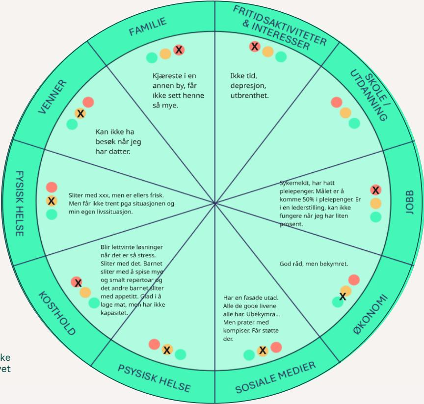

A circular diagram divided into 10 segments representing different life domains. Each segment contains a quote from a young person or parent, along with colored dots (green, orange, red) and an 'X' mark. The domains are:

- FAMILIE**: Kjæreste i en annen by, får ikke sett henne så mye. (Orange dot, red 'X')
- FRITIDS AKTIVITETER & INTERESSER**: Ikke tid, depresjon, utbrenthet. (Red 'X', orange dot, green dot)
- SKOLE / UTDANNING**: Sykemeldt, har hatt pleiepenger. Målet er å komme 50% i pleiepenger. Er i en lederstilling, kan ikke fungere når jeg har liten prosent. (Red 'X', orange dot, green dot)
- JOB**: God råd, men bekymret. (Red dot, orange dot, green dot, red 'X')
- ØKONOMI**: Har en fasade utad. Alle de gode livene alle har. Ubekymra... Men prater med kompiser. Får støtte der. (Green dot, red 'X', red dot)
- SOSIALE MEDIER**: (Green dot, red 'X', red dot)
- PSYSISK HELSE**: (Red dot, orange dot, green dot, red 'X')
- KOSTHOLD**: Blir lettvinne løsninger når det er så stress. Sliter med det. Barnet sliter med å spise mye og smalt repertoar og det andre barnet sliter med appetitt. Glad i å lage mat, men har ikke kapasitet. (Red 'X', orange dot, green dot)
- FYSISK HELSE**: Sliter med xxx, men er ellers frisk. Men får ikke trent pga situasjonen og min egen livssituasjon. (Red dot, orange dot, green dot, red 'X')
- VENNER**: Kan ikke ha besøk når jeg har datter. (Red dot, orange dot, green dot, red 'X')

Circular diagram showing life domains and quotes from young people and parents.

- En forelder om de ulike områdene av livet

## 6. APPENDIX - INNSIKTSARBEIDET – SITATER UNGE OG FORESATTE

*Den samhandlingsgreiene, veldig mye av byrden blir lagt på oss. Det journalføres jo ingenting når vi har barnekoordinator og ansvargruppe i bydel X. Det er jo så lavterkselgreier for de.... men for oss er det ganske så omfattende. Hver gang vi har truffet nye, må vi gjennom samme mølja og fortelle det på nytt igjen. Det er så slitsomt.*

- Forelder

*Man er litt inne på det ift BUP... men det er ikke noe sted som rommer det å være mammaen til et alvorlig sykt barn. Tjenestene utløses av at du har konkrete behov, eller at du har symptomer... BUP er helt nydelige, men jeg må ordlegge meg slik at det jeg sier handler om barnet, og så bake meg selv inn. Det burde være en følgetjeneste. Det er en sorg og en kontinuerlig bekymring.*

- Forelder

*Det er vanskelig å pleie et forhold og seg selv når barnet har store utfordringer. Vi valgte å prioritere barnet.*

- Forelder

*Å være i beredskap hemmer rommet for å være sosial*

- Forelder

*Vi får ikke vært en familie uten mange forbehold. Vi kan ikke gjøre ting sammen impulsivt, kan ikke ha besøk av familie. Er veldig støkk.*

- Forelder

*Kan man vente en form for tilrettelegging på pleiepenger og ikke sykemeldt? Leder sier at jeg må være på jobb 7:30-15:30 uansett om datter er hos meg eller ikke, også de ukene datter er hos meg. Jobben vil ha forutsigbarhet. Har jeg noe som helst...? Fordi jeg er mammaen til et barn som trenger meg.... Jeg kan ikke slå av mamma behovet....*

- Forelder

### 7

#### Kommunens hemmelige tjenester

*Det største problemet var samarbeidet mellom bydel, OUS og barnevernet. Det var uenighet om hvilken instans som skulle følge meg opp.*

*Preger hele forløpet, at jeg får vite sent om rettigheter og økonomiske stønader vi har krav på. Så har vi ikke kapasitet, blir utmattet, å være en sånn prosjektleder, det er krevende og knotete søknadsprosesser. Ting blir nevnt, men ikke beskrevet skikkelig. Har ikke fått hjelp til å få det, lite proaktivitet. Har trengt hjelp - for mange ting på en gang å holde i. Blir et ekstra ork, alt en egentlig vil er å prioritere det som er viktig - barna. Er gjenganger med skole, BUP, bydel og alt.*

- Forelder

## 6. APPENDIX - INNSIKTSARBEIDET – SITATER UNGE OG FORESATTE

*I den situasjonen kan man ikke ta for gitt at foreldrene vet hva slags behov de har. Det offentlige har erfaring, og vet litt hva som er her. De må gi faglige anbefalinger og veiledning. "Det er bare å spørre" sier de... Nei, det er ikke det. Vi vet ikke hva vi skal spørre om.*

- Forelder

*Jeg savner et ordentlig kommunikasjonssystem. Det står "ikke oppgi sensitive opplysninger". Men jeg har gjort det. De kan jo ikke gjøre det, så da får jeg gjøre det. For jeg vil jo bare ha ting gjort.*

- Forelder

*Det skulle skrives referat nå fra møtet i bydel, så sa jeg at jeg ville ha det i Digipost, for da kan jeg samle alt. Det blir mange papirer. Men hun visste ikke hvordan det skulle gjøres.*

- Forelder

*Jeg er veldig bevisst på samtykke, og skriver det alltid inn når jeg sender mail (eller sms eller hva det er) at jeg samtykker til det og det, fordi jeg vet at det er en terskel for å gå videre.*

- Ungdom

*Søknadsprosessen på disse tjenestene... At de ikke har digitale løsninger, der jeg kan skrive inn ting. Jeg kan ikke sende inn mail, pga personopplysninger. Det å måtte printe ut ting, og sende det i posten, det er så stor terskel for oss, det.*

- Forelder

*Det er en skam at det er bare 25% av de som søker spesialskole som får det innvilget. Rett og slett fordi nærskolen ikke har kompetanse, kunnskap, ferdigheter, forståelse og kapasitet til å gi det som mitt barn trenger. Dette vil jeg at du siterer meg på, det er viktig at kommer fram.*

- Forelder

*Jeg føler ofte, på skolen og andre steder, at jeg må lære de opp. Informasjonen ligger på Statped, jeg tenker at det ikke er min rolle her å veilede faglig. Kan de ikke lese der og oppdatere seg? Så slipper vi å være de kravstore foreldrene og besserwissere.*

- Forelder

### Intervjuer med ansatte i tjenestene støtter oppunder funn i øvrig og nasjonalt innsiktsarbeid

- Tjenestetilbudet for barn og unge i Oslo er omfattende og fullt av dyktige og engasjerte fagfolk, men kjennetegnes av **svake koblinger**, og å være **fragmentert, uoversiktlig og sektorisert**.
- **Uklar ansvarsfordeling og ressursknapphet** gjør at samarbeid hviler på enkeltpersoner heller enn strukturer.
- **Manglende formelle strukturer** for intern samhandling i bydel og ekstern samhandling med andre tjenester.
- **Overgangene** mellom tjenestene og instansene er svake ledd i de unges brukerreiser. Dette øker risiko for forverring, økt kompleksitet og problemyrde. Blir synlig som **hull og gliper**.
- Tjenestene har **manglende kjennskap** til hva andre tjenester og faggrupper kan bidra med. Det meldes om mye tidsbruk til "losing" i systemet og avslag.
- Hjelpeapparatet strever med å få en **helhetlig forståelse** av familienes komplekse livssituasjon, og får ikke bistått med riktig hjelp til riktig problem.
- **Mangel på spesialisert** kompetanse til å vurdere og gi riktig hjelp på riktig nivå (forvaltning av "milde, moderate og alvorlige" tilstandsbilder kommunalt)

## 6. APPENDIX - INNSIKTSARBEIDET – OPPSUMMERING INTERVJUER ANSATTE OG BYDELSMØTER

*Det er et aktuelt problem at folk alltid blir sendt videre, og blir kasteball i systemet. De ulike tjenestene vet ikke nok om hverandre. Man sender de dit fordi man tenker at det er riktig, men så vet man ikke helt hva den tjenesten jobber med eller har som målgruppe.*

*Det er veldig mange vi loser videre. Mange har ringt mange ganger i år.*

*Det er så mye utskifting av folk at man må ha et rigid system for å ivareta arbeid på system- og individnivå*

*Før hadde vi fast drøftingstid med BUP en gang i måneden. Men det har de sagt at de ikke har tid til.*

*Ser at utredninger av ADHD og autisme i BUP blir mangelfulle når de ikke kjenner til omsorgssituasjonen (eks. fysisk og psykisk vold i hjemmet) og kontekst rundt barnet like godt som bydelstjenestene.*

Til tross for mange ting som ikke fungerer, er det en sterk fellesnevner at folk vil godt.

Alle bryr seg genuint om barna og ungdommene, og det finnes mange lysglimt hvor man får til god hjelp og god samhandling - til tross for manglende systemisk støtte.

Det er med andre ord mye å bygge på kulturelt, og både ønske om og vilje til å få det til.

Faktorer som ellers ofte beskrives som typiske fallgruver for god samhandling, nemlig profesjonskamp og frykten for å trå i hverandres bed, har ikke fremkommet i innsiktsarbeidet. Heller ikke fra BUP sin side.

### **Nøkkelgrep som pekes til at trengs, er:**

- samarbeidsmodeller og styrket koordinering (internt, med andre bydeler, med BUP)
- faste møtepunkter, etablerte strukturer og relasjon
- utvikling av lavterskeltilbud
- tilgjengelige og fleksible tjenester med spisskompetanse i førstelinje

*BUP bekymrer seg ved lite henvisninger av sped- og småbarnsgruppen fra bydelene, det er her det er særlig viktig å komme tidlig inn med hjelp og støtte til de som trenger det*

*Bydeler må lete etter de «svake etterspørrene» - prioriteringene styres ofte av de «sterke etterspørrene»*

### Bydelsmøtene

*Henvisning direkte til BUP på moderate plager kan skape forventninger hos pasient/ pårørende om spesialist, da kan bydelens tilbud fremstå som mindre attraktivt og annenrangs behandling*

#### 1. Økende behov og kompleksitet

- Tjenestene opplever økt pågang og flere komplekse saker, særlig innen autismespekteret og alvorlig psykisk sykdom.
- Ressurskrevende saker setter bydelene under press, og det tar tid å bygge nødvendig kompetanse.
- Mellomgruppen – barn og unge som faller mellom nivåene – utfordrer dagens system.

#### 2. Tidlig innsats og svake etterspørre

- Det er bekymring for lav henvisning av sped- og småbarn, til tross for økende behov i barnehagealder.
- «Svake etterspørre» kan lett ikke bli fanget opp. Ressurssvake foreldre, kulturforskjeller med stigma og skam, og praktiske barrierer (som arbeidsgiverstøtte) kan hindre tilgang til hjelp.

#### 3. Uoversiktlig tjenestetilbud og henvisningspraksis

- Manglende oversikt over hvem som gjør hva i bydelene, og ulik organisering og navngivning av tjenester skaper forvirring gjør det vanskelig for fastleger og BUP å orientere seg i de ulike bydelenes lokale tilbud.
- Direkte henvisning fra fastlege til BUP for milde til moderate plager kan skape urealistiske forventninger om spesialisthjelp og svekke tilliten til bydelens tilbud, samt utilsynet føre til at barn og unge blir satt i en ny kø for hjelp fra bydelen ved avslag fra BUP.
- Det er behov for bedre koordinering av henvisningene fra primærhelsetjenesten.

## 6. APPENDIX - INNSIKTSARBEIDET – OPPSUMMERING INTERVJUER ANSATTE OG BYDELSMØTER

*Hvordan ivareta foreldrene underveis i behandling, tjenestene i bydel og i helse barn og unge er veldig oppdelte – vi må ha et helhetsperspektiv.*

*Samhandlingskompetanse er at vi sitter i samme rom og låser døra til vi har funnet løsning, sammen!*

*Bydelen kan ofte bare tilby støttekontakt eller BPA, men disse kan ikke fylle et behandlingsbehov etter utskrivning fra BUP – kun i tillegg til.*

*Mange og tunge saker som krever en annen hjelp enn det vi har hatt av tilbud hittil, og det krever en helt annen fleksibilitet i hjelpeapparatet*

*Fra BUP sitt perspektiv er det ønske om en mer samordnet fra bydel, særlig i de komplekse sakene. Et savn at bydelen kan samordne seg til en/ ett kontaktpunkt, så ikke «alt og ingen» holder i det.*

### 4. Laget rundt barnet – behov for samordning i bydelene

- Intern samhandling i bydelene må styrkes, med faste møtearenaer og tydeligere strukturer som bidrar til tidlig samarbeid og sikrer intern koordinering mellom tjenestene.
- BUP etterlyser ett kontaktpunkt i bydelene.
- Familier trenger mer støtte underveis i behandlingsforløpet, og bydelene kan mangle verktøy utover støttekontakt/BPA.
- Nedskjæringer og omlegginger i PPT gir oppgaveglidning til BUP – lokal kartleggingskompetanse er nødvendig, og PPT bør vurderes flyttet nærmere bydelene.

#### 5. Helsekompetanse og normalisering

- Økt helsekompetanse hos befolkningen og foreldre er helt nødvendig for bærekraftige tjenester.
- Det er behov for å normalisere psykisk helse og skille mellom livsutfordringer og psykisk lidelse. Vi må støtte innbyggere i å stå i livets normale utfordringer.
- Skolen er en viktig arena for livsmestring og forebygging.

### 6. Når vi får det til - god samhandling i praksis

- Samarbeids-/flyt-møter med BUP oppleves gjensidig som viktige arenaer som har bidratt til felles forståelse og opplevelse av felles ansvar, som særlig er viktig i de komplekse sakene.
- Halvannenlinjetjenester og FACT Ung gir opplevelse av felles eierskap og trygghet i overgangene.
- Vi må være sammen om forventningsavklaring til hjelpen som gis og sikre gode overganger sammen.

## Workshop med BUP Syd og Nord

### Sammen om rask og riktig psykisk helsehjelp barn og unge, BUP Nord

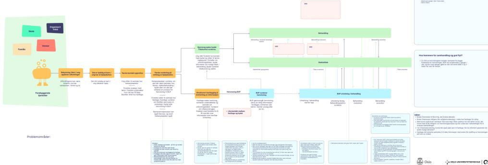

**Problemmråder:**

- Barn i fare
- Barn i fare
- Barn i fare
- Barn i fare

**Behandling:**

- Barn i fare
- Barn i fare
- Barn i fare
- Barn i fare

**Følg opp:**

- Barn i fare
- Barn i fare
- Barn i fare
- Barn i fare

Flowchart for BUP Nord showing the process from problem identification to treatment and follow-up. It includes sections for 'Problemmråder', 'Behandling', and 'Følg opp'. Key steps include 'Barn i fare', 'Barn i fare', 'Barn i fare', and 'Barn i fare'.

### Sammen om rask og riktig psykisk helsehjelp barn og unge, BUP Syd

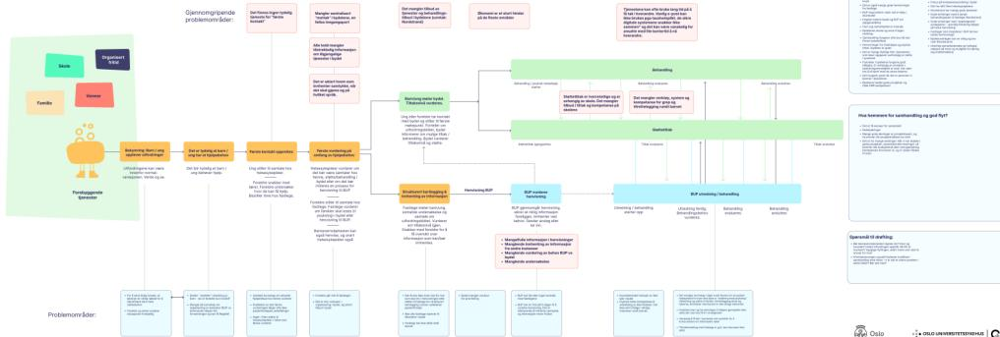

**Problemmråder:**

- Barn i fare
- Barn i fare
- Barn i fare
- Barn i fare

**Behandling:**

- Barn i fare
- Barn i fare
- Barn i fare
- Barn i fare

**Følg opp:**

- Barn i fare
- Barn i fare
- Barn i fare
- Barn i fare

Flowchart for BUP Syd showing the process from problem identification to treatment and follow-up. It includes sections for 'Problemmråder', 'Behandling', and 'Følg opp'. Key steps include 'Barn i fare', 'Barn i fare', 'Barn i fare', and 'Barn i fare'.

### Oppsummering workshop med BUP Syd og Nord

#### Hovedutfordringer

1. Ingen felles “inngang” i kommunen for barn med psykiske utfordringer.
2. Manglende struktur for henvisning, kartlegging og samtykke.
3. Lite informasjonsflyt og svake samhandlingsverktøy.
4. Personavhengig samarbeid og få faste arenaer.
5. Uklare roller og ansvar ved utskrivelse og oppfølging.
6. Store forskjeller mellom bydeler i kapasitet, tilbud og praksis.

#### Første kontakt og vurdering:

- Det finnes ingen tydelig “første kontakt”-tjeneste for barn og unge med psykiske vansker.
- Foreldre og skole vet ofte ikke hvor de skal henvende seg.
- Mange går direkte til fastlegen, selv om utfordringene kunne vært håndtert i bydelen.
- Læreren er ofte første som ser problemet, men mangler støtte og system for å handle.
- Det er store variasjoner mellom bydelene i hvordan første vurdering gjøres og hvem som gjør den (helsesykepleier, psykolog, Oslohjelpa, barnevern m.m.).
- Manglende struktur for informasjonsinnhenting og samtykke tidlig i forløpet skaper forsinkelser.

#### Henvisning og flyt mellom nivåene:

Henvisninger har en uønsket variasjon i kvalitet. Slik BUP oppfatter det kan årsaksforhold bak dette være:

- Mange fastleger kjenner ikke til bydelstilbudene
- De har ikke alltid møtt barnet før de skriver henvisning
- Det mangler struktur og veiledning for hva en god henvisning skal inneholde
- De beste henvisningene kommer fra skolehelsetjenesten og psykisk helse i bydelen, hvor det gjerne følger med en grundig kartlegging og kjennskap til barnet på flere arena
- Manglende standardiserte verktøy (f.eks. felles skjema, strukturert kartlegging) fører til mye dobbeltarbeid
- BUP bruker tid på å etterspørre samtykke og tilleggsinformasjon der dette mangler. Dette er tidkrevende (opptil 1,5 time pr. sak).
- Det foreslås å bruke digitale verktøy tidligere i prosessen — hos fastlege eller i bydel — for å sile og forenkle vurderingen av tiltaksnivå

### Oppsummering workshop med BUP Syd og Nord

#### Samhandling og ansvar:

- Samarbeidet mellom BUP og bydel beskrives som personavhengig og tilfeldig.
- Når det fungerer, skyldes det kjente relasjoner og engasjerte enkeltpersoner. Når nøkkelpersoner slutter eller prosjekter avsluttes, forvitrer samarbeidet.
- Det mangler felles arenaer for koordinering og kontinuerlig samhandling. Der hvor det finnes faste møtepunkter, fungerer samhandlingen bedre.
- Tidligere “flytmøter” fungerte godt, men har stoppet opp i mange bydeler, blant annet på grunn av manglende juridisk sikkerhet rundt informasjonsdeling.
- BUP har lite kontakt med fastlegene og begrenset oversikt over bydelenes tilbud.
- Økonomi og nedskjæringer nevnes som en hovedårsak til at gode samarbeid og prosjekter forsvinner.

#### Utskrivelse, ansvar og oppfølging

- Overganger fra BUP til bydel er svært sårbare:
- Mange barn skrives ut uten klare anbefalinger, tiltak eller plan for oppfølging. Årsaker til dette kan være usikkerhet rundt hvorvidt en kan «instruere» bydelen til å gi tiltak, usikkerhet om bydelen har et egnet tilbud.
- At det opprettes tverrfaglige møter i stedet for ansvarsgrupper bidrar til utydelighet rundt hvem som har ansvaret for koordinering og oppfølging.
- Individuell plan (IP) løftes frem som et underbrukt, men lovende verktøy for koordinering.
- Det finnes store forskjeller mellom bydelene i hvilke tilbud BUP kan skrive ut til — og dermed hvor lenge barna beholdes hos BUP.
- BUP overbehandler i enkelte tilfeller fordi det ikke finnes et reelt tilbud i bydelen å skrive barnet ut til.
- Familiene opplever ofte at ingen har helhetsansvaret, og at tiltakene rundt barnet ikke henger sammen.

#### Fremmere for god samhandling

- Kjennskap og tillit mellom personer og tjenester.
- Hospitering hos BUP gir bedre forståelse og høyere kvalitet på henvisninger.
- Ukentlige samarbeidsmøter og faste ledermøter i bydel er viktige tiltak for felles forståelse og bedre samarbeid rundt brukerne.
- Gode bydelstilbud og tydelig arbeidsdeling mellom BUP og kommune.
- Kompetanseutvikling og veiledning på tvers.

## 6. APPENDIX - INNSIKTSARBEIDET - WORKSHOP BUP OG BYDELER

![A printed flowchart titled 'Skisse til forløp for barn og unge i behov for psykisk helsehjelp' (Sketch for a course for children and young people in need of mental health help). It outlines 13 steps: 1. Forebygging (Prevention), 2. Tidlig innsats (Early intervention), 3. Utredning (Assessment), 4. Behandling (Treatment), 5. Tilrettelagt omsorg (Supported care), 6. Tilrettelagt omsorg (Supported care), 7. Tilrettelagt omsorg (Supported care), 8. Tilrettelagt omsorg (Supported care), 9. Tilrettelagt omsorg (Supported care), 10. Tilrettelagt omsorg (Supported care), 11. Tilrettelagt omsorg (Supported care), 12. Tilrettelagt omsorg (Supported care), 13. Tilrettelagt omsorg (Supported care). The diagram includes a small illustration of a person and a list of 'De overordnede prinsippene som er gjort:' (The overall principles that have been made:).](20251209_Innsiktsrapport_Sammen-om-rask-og-riktig-psykisk-helsehjelp_Helsefellesskap-Oslo-2/f8f8916ae391a1233c13ce738c699109_img.jpg)

A printed flowchart titled 'Skisse til forløp for barn og unge i behov for psykisk helsehjelp' (Sketch for a course for children and young people in need of mental health help). It outlines 13 steps: 1. Forebygging (Prevention), 2. Tidlig innsats (Early intervention), 3. Utredning (Assessment), 4. Behandling (Treatment), 5. Tilrettelagt omsorg (Supported care), 6. Tilrettelagt omsorg (Supported care), 7. Tilrettelagt omsorg (Supported care), 8. Tilrettelagt omsorg (Supported care), 9. Tilrettelagt omsorg (Supported care), 10. Tilrettelagt omsorg (Supported care), 11. Tilrettelagt omsorg (Supported care), 12. Tilrettelagt omsorg (Supported care), 13. Tilrettelagt omsorg (Supported care). The diagram includes a small illustration of a person and a list of 'De overordnede prinsippene som er gjort:' (The overall principles that have been made:).

![A handwritten mind map on a large sheet of paper, expanding on the printed flowchart. It features a central figure of a person with a backpack, surrounded by circles and boxes containing text. Key elements include: 'Skole' (School), 'Organisert fritid' (Organized leisure), 'Venner' (Friends), 'Familie' (Family), 'Bolig' (Housing), 'Nørmjor + NAV!', 'Forebyggende tjenester' (Preventive services), 'HSP mfl' (HSP etc.), 'Urol. bekymring' (Anxious concern), '2. Avklaring av behov?' (Clarification of needs?), '3. Deutalt vektlegging for konversasjon' (Detailed weighting for conversation), 'Strukturet berikings screening' (Structured enrichment screening), '4. Flyt motor' (Move motor), '5. Vurdering av hjelpetiltak' (Assessment of measures), '6. Vurdering av hjelpetiltak' (Assessment of measures), '7. Vurdering av hjelpetiltak' (Assessment of measures), '8. Vurdering av hjelpetiltak' (Assessment of measures), '9. Vurdering av hjelpetiltak' (Assessment of measures), '10. Vurdering av hjelpetiltak' (Assessment of measures), '11. Vurdering av hjelpetiltak' (Assessment of measures), '12. Vurdering av hjelpetiltak' (Assessment of measures), '13. Vurdering av hjelpetiltak' (Assessment of measures). Handwritten notes include: '1. Trygge nærmiljøer, barnehage, skole, HST og god bukeliste', 'men ansatte med kompetanse til å løse problemene', 'hvis ansatte i 7. linje har barn/ungdom som foreldre', 'Behov for veiledning/System til tale', 'Ulike forløp knyttet til mild, moderat, alvorlig', 'Bydel + BUP', 'NAV bolig, skole, helse', 'PPT', 'Lærerkollegiet/Foreldreråd/veiledning', 'Felles innhold: Vurdering inspirasjon (Bydel, Vllern - Rask psykiske helsehjelp (p. 10-11))', 'BUP + bydel', 'Spørsmål: Hvordan kan vi sikre at vi har'.](20251209_Innsiktsrapport_Sammen-om-rask-og-riktig-psykisk-helsehjelp_Helsefellesskap-Oslo-2/c3254408eadbf152632a8faf16310722_img.jpg)

A handwritten mind map on a large sheet of paper, expanding on the printed flowchart. It features a central figure of a person with a backpack, surrounded by circles and boxes containing text. Key elements include: 'Skole' (School), 'Organisert fritid' (Organized leisure), 'Venner' (Friends), 'Familie' (Family), 'Bolig' (Housing), 'Nørmjor + NAV!', 'Forebyggende tjenester' (Preventive services), 'HSP mfl' (HSP etc.), 'Urol. bekymring' (Anxious concern), '2. Avklaring av behov?' (Clarification of needs?), '3. Deutalt vektlegging for konversasjon' (Detailed weighting for conversation), 'Strukturet berikings screening' (Structured enrichment screening), '4. Flyt motor' (Move motor), '5. Vurdering av hjelpetiltak' (Assessment of measures), '6. Vurdering av hjelpetiltak' (Assessment of measures), '7. Vurdering av hjelpetiltak' (Assessment of measures), '8. Vurdering av hjelpetiltak' (Assessment of measures), '9. Vurdering av hjelpetiltak' (Assessment of measures), '10. Vurdering av hjelpetiltak' (Assessment of measures), '11. Vurdering av hjelpetiltak' (Assessment of measures), '12. Vurdering av hjelpetiltak' (Assessment of measures), '13. Vurdering av hjelpetiltak' (Assessment of measures). Handwritten notes include: '1. Trygge nærmiljøer, barnehage, skole, HST og god bukeliste', 'men ansatte med kompetanse til å løse problemene', 'hvis ansatte i 7. linje har barn/ungdom som foreldre', 'Behov for veiledning/System til tale', 'Ulike forløp knyttet til mild, moderat, alvorlig', 'Bydel + BUP', 'NAV bolig, skole, helse', 'PPT', 'Lærerkollegiet/Foreldreråd/veiledning', 'Felles innhold: Vurdering inspirasjon (Bydel, Vllern - Rask psykiske helsehjelp (p. 10-11))', 'BUP + bydel', 'Spørsmål: Hvordan kan vi sikre at vi har'.

Workshop med bydeler

### Oppsummering workshop med bydeler

#### Hva skal til for å lykkes?

1. Tydelig struktur som er godt forankret i begge linjene.
2. En dør inn til bydelens tjenester for samarbeidende tjenester (BUP, skole, fastleger mv.)
3. Gode koordinerte tjenester og samhandling internt i bydelen – Oslo standard?
4. Arenafleksibel samhandling i de komplekse sakene for å sikre kompetanseoverføring.
5. Kultur for å eie alle innbyggernes psykiske helse sammen.

##### Tidlig innsats:

- Det man må gjøre er å styrke ansatte i å fange opp de som trenger det. Hvem er det barnehagen kontakter for å forstå atferd, barnehageansatte må kunne fange opp signaler og skjevutvikling, må være rutine og tilgjengelig fagkompetanse
- Vår tilnærming må være at vi skal fange det opp versus at de tar kontakt med oss, for det er ressurssterkt å finne info på nett.
- Må fange opp foreldre før og når de blir gravide, og jobbe med tillit hos fastlege, jordmor, barnehage etc.
- «En dør inn» er sentralt, men viktig at mange skal kunne følge deg til den døren

##### Digital innsøking psykisk helse – («En dør inn») og kartlegging av hjelpebehov:

- Digital kartlegging er «en dør inn», med mulige forløp videre, og et innsatsteam for å vurdere henvendelser. Mulighet for å koble mot annen data?
- Viktig at "mottaket" har oversikt over tjenestene og må kunne "tildele", ha mandat
- Det kan være vanskelig å skille mellom helsebehov og sosial- og omsorgsbehov, og en helhetlig vurdering kan føre til at man treffer bedre.
- Kvaliteten på kartlegging og den som utfører, er veldig viktig. Kartlegging er en prosess, og det krever at man gjør det litt ofte for å være god.

### Oppsummering workshop med bydeler

#### Bydelenes interne samhandling:

- Behov for at ting må bli mer likt i bydelene
- I mange bydeler veldig uklart for ansatte hvor de skal lose videre
- Vi må passe på at vi ikke lager for kompliserte veier inn, men ha gode strukturer internt for å koble hverandre på
- Hvordan sammenhengen mellom psykisk helse og omsorg håndteres avhenger veldig av hva som er første kontaktpunktet. Alle leser med sine briller, og ser bare sin del av problemet
- Felles informasjon må ligge tilgjengelig for alle, slik at en kan snakke om samme sak og få felles forståelse av hva en står ovenfor
- Ønske fra skole og oppvekst at bydel bistår i om barn skal henvises BUP for ADHD
- Det tar lang tid når BUP eller Oslohjelpa vil ha andre tjenester inn i tillegg, 16- 20 uker
- Hva ligger i føringer – hvilken struktur skal det være for å innfri krav i veileder mm?

#### Ønsker for samarbeid med BUP

- Felles inntak og FLYT møter, det er god kraft i å møtes og snakke på tvers av tjenester på system og individnivå. Men savner struktur og rammer i flytmøter, må gjøres mer systematisk og standardisert.
- Ønsker rutiner for oppfølging og samarbeid underveis.
- BUP må endre seg for å passe til moderat til alvorlig, ingen blir ferdigbehandlede der, men BUP må også tilpasse seg, ha en struktur som passer bydelene
- Ønsker kompetanseoverføring til førstelinjen for å styrke tidlig innsats
- Ønske fra bydel om at BUP kan bistå med å vurdere hva som skal til hvilket nivå
- Tverrfaglig kompetansesamarbeid slik FACT har er en veldig god rigg. FACT Ung er en gave!
- Ønsker en digital samarbeidsløsning for foreldre og tjenester a la IP der det er tydelig hva man samarbeider om.

#### Relasjonsbygging i tjenestene:

- Relasjon er viktig og i hver sak søke å støtte den som står nærmest. Ungdommen vil snakke med den de er kjent med og familiene trenger å møte de samme personene over tid. Vi må vri våre tjenester slik at vi ikke bryter opp gode relasjoner.
- Jo færre involverte og steg jo bedre. Færre gap's og færre folk å forholde seg til.
- Alle trenger en «los», personen tettest på med relasjonen er den viktigste og som har størst mulighet for å lykkes. Denne personen bør bygges robust og allsidig av de andre tjenestene.
- Samlokalisering er bra, men det viktigste prinsippet er å være der barna og de unge er.
- Ikke ta barna UT for å gi tjenester, men styrke tjenestene.

## Fokustema

I oppdraget for innsiktsarbeidet har vi blitt bedt om å belyse noen utvalgte, prosjektrelevante tema særskilt. De følgende sidene er en oppsummering av hva som har fremkommet i innsiktsarbeidet rundt disse temaene. Det er tatt med her, da de er en del av grunnlaget for vurdering av videre løsningsutvikling på områdene.

Logo of Oslo University Hospital, featuring a crown and a figure holding a staff.

### Samtykke

Innhenting av samtykke er tidkrevende for tjenestene, og representerer ofte en barriere for samhandling og dialog.

#### Når behøves samtykke ifbm. henvisning til BUP?

- Samtykke til helsehjelp fra begge foreldre når fastlege skal sende henvisning til BUP.
- Oppheving av taushetsplikt slik at tjenestene kan drøfte saker. Aktuelt når
  - det er usikkerhet om sak bør vurderes av BUP eller håndteres i bydel
  - innhenting av utfyllende informasjon (f.eks. PPT, helsesykepleier, bydel, mm.) av BUP ved mangelfull henvisning
  - dialog mellom BUP og førstelinjetjenestene ved saker BUP ser at de kommer til å avvise, for å sikre et best mulig hjelpetilbud
- Uten samtykke kan tjenestene kun drøfte saker sammen anonymt. Dette representerer en tydelig barriere for å gå fra drøfting til handling.

#### Hvordan innhentes samtykke?

- Samtykke innhentes som oftest muntlig og noteres i journalsystem hos aktuell tjeneste. Samtykke innhentes tidvis på papir, men det er ikke det vanligste.
- Samtykkeforespørselen knyttes til konkrete forespørsler/møter. Uklart om generelle samtykker om vedvarende deling av informasjon mellom instanser innhentes.

#### Unge og foresatte om samtykke

- Foreldre og unge har ikke oversikt over når de har gitt samtykker eller til hva, og de vet ikke hvordan de kan trekke samtykket.
- Foresatte og unge opplever samtykke som viktig, men det er ikke dette de vektlegger

mest.

- Foresatte og unge blir grunnet manglende systemer for sikker digital samhandling ofte satt i en posisjon hvor de selv må være avsender av sensitiv informasjon i usikre, digitale kanaler. Dette viser at samtykke alene ikke gjør at tjenestene får kommunisert med hverandre.
- Vanlig praksis å dele mer informasjon på SMS enn e-post.
- Unge beretter om noen få, men problematiske opplevelser knyttet til taushetsplikt, der helsepersonell har delt mer informasjon enn de har lov til. Dette opplevdes krenkende.
- Unge forteller at de kan oppleve tjenestenes deling av informasjon med foreldre som problematisk og en barriere for tillit og åpenhet.

#### Juridisk om samtykke

- Ulike regelverk omhandler samtykke til helsehjelp og samtykke til deling av taushetsbelagt informasjon
- Usikkert om det har vært foretatt en juridisk vurdering av oppheving av taushetsplikt i et tverrsektorielt perspektiv, og at hvorvidt fastlege må innhente samtykke til helsehjelp fra begge foreldre. Dette er ikke vanlig praksis i somatikken, da samtykke ansees å være implisitt i henvendelsen

#### Henvisning

Mangelfulle henvisninger krever mye kapasitet av BUP. Det mangler felles praksis for hva som bør kartlegges før det vurderes henvisning til BUP, og det foreligger ingen felles praksis for hva en henvisning til BUP skal inneholde.

#### Avslag på henvisning

- 80 % av henvisningene til OUS sektor per september 2025 kommer fra fastlege. Kvaliteten er varierende. Henvisninger fra bydel til BUP er ofte gode. Det er sjelden disse blir avvist (6 %).
- 20 % av henvisninger til OUS sektor fra fastleger blir per september 2025 avvist – enten fordi symptomtrykket og funksjonsfall ikke utløser rett til behandling eller fordi henvisningene ikke formidler riktig bilde. BUP forteller at henvisninger ofte ikke inneholder tilstrekkelig eller riktig informasjon til å kunne rettighetsvurderes.
- Det er uklart i hvor stor grad familier som mottar avslag på henvisning ledes videre til lavterskeltjenester. Inntrykket er at dette skjer i liten grad. Verken fastlege eller BUP er godt nok kjent med lavterskeltjenestene eller hvor familiene kan henvende seg.

#### Mangel på felles praksis

- Det er lite systematikk i hvor det innhentes informasjon fra ifbm. henvisning og vurdering. Helsesykepleier kan eksempelvis sitte på viktig informasjon, uten at denne blir forespurt eller tatt med i henvisningen.
- Fastlege har fokus på å beskrive psykiske symptomer i henvisning, og forstår det slik at BUP foretar en helhetlig vurdering langs alle akser. Dermed blir det ikke vurdert bredere hva problemet er for å sette inn riktig hjelp før en henvisning.
- Det virker ikke til at det benyttes noen felles strukturert mal for å kartlegge den helhetlige livssituasjonen hos barn, unge og deres familier ved psykiske plager. En bydel nevnte at de benytter en variant fra BTL-modellen. Vi har

forstått det slik på de fleste instanser at det ikke er felles praksis for lik og strukturert kartlegging av hjelpebehovet.

#### Utydelige føringer og ansvarsområder

- Det er i praksis stor variasjon i grenseoppgangene mellom førstelinjenestenes og spesialisthelsetjenestens ansvarsområde ved psykiske helseplager. Nasjonal veileder skiller mellom mild, moderat og alvorlig, men i praksis opplever begge forvaltningsnivå på samme i kontakt med og arbeide med alle tre. Særlig for sakene med moderat lidelsestrykk oppleves det uklart hvilket forvaltningsnivå brukerne skal få hjelp fra.
- Nasjonal veileder gir få konkrete føringer for hva helsehjelp skal bestå av ved milde og moderate plager.
- Enkelte bydeler har gode erfaringer med flyt-møter for å sortere saker mellom nivåene. Bydelstjenester (eks. bydelsoverlege, koordinerende enhet, psykiske helsetjenester) og BUP deltar typisk i slike møter. De avholdes fortrinnsvis ukentlig og både konkrete og anonymiserte saker drøftes. Saker man er usikre på, kan drøftes der før veien videre planlegges, inkludert saker for henvisning eller avslag hos BUP. Det framheves at det er viktig at deltakerne er på ledernivå i flyt-møtene.
- Det er mangel på kunnskap om organisering av og innhold i psykiske helsetjenester i bydelene. Dette gjør at fastlege, foreldre og andre aktører automatisk tyr til henvisning til BUP, selv om det i mange tilfeller ikke vil være det mest riktige tilbudet for barnet eller den unge.

#### Økt kvalitet på samhandling

Tjenestene har beskrevet hva som kjennetegner god samhandling.

- **Helhet, koordinering og kontinuitet:** Det vil være økt kvalitet på samhandling når barn og familier får helhetlig hjelp uten å falle mellom nivåene. Når BUP, skole, bydel og fastlege deler informasjon og ansvar, blir tiltakene mer koordinerte og familiene slipper å “gå i ring”. God samhandling innebærer at noen faktisk eier forløpet – følger barnet gjennom overganger og sikrer at oppfølgingen ikke stopper når en tjeneste avsluttes.
- **Faste strukturer og forutsigbarhet:** Økt kvalitet forbindes med faste arenaer, klare roller og forpliktende møteplasser, og er ikke personavhengig.
- **Felles forståelse av roller, ansvar og språk:** Tydeligere ansvarsavklaringer mellom BUP, bydel og skole. F. eks. ved skolefravær.
- **Gjensidig kjennskap og kompetanse:** Aktørene må kjenne hverandres tilbud og arbeidsmåter godt for å lykkes med samhandling, gi riktig tjenestetilbud og utnytte kapasiteten bedre. Spesielt kan det være vanskelig å få god oversikt og kjennskap til de ulike bydelenes tjenestetilbud – også for bydelene internt.
- **Lagfølelse og relasjonell trygghet:** Når samhandlingen er preget av “vi-følelse” – at man bryr seg om de unge sammen, og ikke skyver ansvar mellom nivåer, sektorer og aktører. Der man har personlig relasjon og tillit går ting raskere og bedre.
- **Fleksibilitet og felles problemløsning:** Kvalitet i samhandling kjennetegnes av at man løser problemer sammen – ikke sender dem videre. Når BUP og bydel snakker sammen tidlig om samtidige tjenester og om “nesten-avslag”, finner de løsninger før situasjonen blir fastlåst.
- **Samhandling fra start:** Dialog på tvers av aktører og nivåer fra start - før henvisning sendes. Flere beskriver at man må bort fra «overføring ved utskriving», det er for sent. Samhandlingen må være på plass fra start.
- **Digital og praktisk samhandlingsstøtte:** Det er et sterkt behov for digitale verktøy og bedre informasjonsflyt. I dag går det mye tid med, fordi man må nå hverandre på telefon, og fordi man ikke har digital støtte for f.eks. deling av planer og meldinger.
- **Felles norm for henvisning:** Det er behov for en felles forståelse for hva som bør være kartlagt før en henvisning til BUP og hva som bør inn i en henvisning til BUP.
- **Å vurdere den samlede innsatsen på tvers av tjenestene:** Som en bemerkning, så fremstår det som om det grunnleggende mangler verktøy, praksis og metoder for å utforme og vurdere den samlede innsatsen – på tvers av tjenestene.

#### Økt bruker- tilfredshet

Brukerne forbinder kvalitet og tilfredshet med å bli tatt på alvor, forstått og involvert i en helhetlig og koordinert oppfølging – der hjelpen kommer tidsnok og faktisk treffer de reelle problemene i deres liv.

#### Barna, de unge og deres foresatte opplever brukertilfredshet...

- ...når hjelpen er planmessig og realistisk
- ...når de opplever framdrift og struktur i hjelpen og oppfølgingen
- ...når de opplever at systemet holder det det lover – det som blir sagt, blir også gjort.
- ...når noen følger dem over tid og holder oversikt gjennom forløpet
- ...når systemet ser hele forløpet og brukerreisen over tid, og ikke kun den delen de selv jobber med eller har ansvar for slik at det ikke oppleves fragmentert
- ...når tjenestene tar eierskap til hva slags støtte de skal få – og selv følger opp at det faktisk skjer. Det avlaster når familiene slipper å henvende seg mange steder for å få hjelp – når systemet selv koordinerer.
- ...når de møter færre personer, og relasjoner og tillit bygges over tid – og ikke brytes hver gang man skal over til en ny instans
- ...når tjenestene snakker sammen og finner løsninger som henger sammen på tvers av systemet – fra lappeteppe til sammenvevd.
- ...når alle aktører deler samme forståelse av problemet og målet – det skaper forutsigbarhet og ro. Som motsats, så merkes dårlig samhandling som forvirring – når ingen helt vet hvem som gjør hva, hvor lenge eller hvorfor. God samhandling føles motsatt: det er tydelig hvem som har ansvar, og alle vet hva som skjer videre.
- ...når hjelpen ser hele livssituasjonen – skole, familie og venner – og ikke bare individet eller diagnosen. De opplever kvalitet når skolen, familien og sosiale relasjoner tas med i vurderingen, og når tiltakene henger sammen på tvers av arenaer.
- ...når tjenestene tilbyr tiltak ut fra familiens reelle behov, ikke ut fra egne rammer, målgruppe og tjenestetilbud
- ...når de kan medvirke i beslutninger, valg av behandling og format på denne og i hvordan tjenestetilbudet utformes.
- ...når ungdommen føler eierskap til egen situasjon.
- ...når de kan lene seg til trygge fagpersoner som hjelper dem å navigere og sette sammen et riktig tilbud og når de får tydelige, faglige anbefalinger forankret i deres egen situasjon.
- ...når de blir sett og møtt med respekt, og når de blir lyttet til og ikke bare vurdert.
- ...når samhandling føles enkel, uformell og tilgjengelig – lav terskel, ærlige samtaler og et språk som alle forstår.
- ...når hjelpen kommer tidlig nok, og bidrar til å forebygge før problemene vokser.

### Funn fra innsiktsarbeid med fastleger

Prosjektets gevinster skal gi færre avslag på henvisninger, og skal ta for seg økt henvisningsrate til BUP samt øke samhandling. De fleste avslag på henvisninger til BUP i Oslo og OUS sektor er ved henvisninger fra fastleger, og økningen av henvisninger til BUP i Oslo og OUS sektor kommer primært fra fastleger. Dette gjør det viktig å dypdykke i hva som kan utvikles i samhandlingsrommet mellom fastleger og kommune, og fastleger og BUP.

Innsiktsarbeidet med fastlegene har bestått av 8 intervjuer med ulike fastleger og en spørreundersøkelse til alle Oslos fastleger med 51 respondenter fra 14 bydeler.

### Funnene støtter oppunder nasjonalt innsiktsarbeid

### Fastlegens rolle i grenseflaten mellom kommune og spesialisthelsetjeneste

Fastlegens rolle og ansvar i grenseflaten mellom kommune og spesialisthelsetjeneste er nedfelt i lover og forskrifter. Fastlegen har ansvar for å utrede, diagnostisere og behandle psykiske lidelser (jf. helse og omsorgstjenesteloven §3-2) og skal henvise videre til spesialisthelsetjenesten når det er nødvendig. Fastlegen skal også samarbeide med kommunale helse og omsorgstjenester ved behov (jf. Fastlegeforskrift § 8).

#### Spørreundersøkelsen og intervjuene støtter oppunder nasjonalt innsiktsarbeid om fastlegenes rolle på tjenesteområdet psykisk helse barn og unge

- Systemet er lite tilrettelagt for at fastlegen skal kunne ha rollen som portvokter inn til spesialisthelsetjenesten som loser pasienter til riktig behandlingsnivå. Fastlegene har liten oversikt over det lokale tilbudet i kommunen, og henviser ofte barn og unge til BUP uten å ha drøftet med kommunale tjenester eller å ha drøftet henvisning med BUP i forkant. Henvisningene ender i 20 % av tilfellene med avslag i BUP, som blir en belastning for brukeren.
- Det er en risiko for at barn og unge ikke får et helhetlig tilbud når fastlegen er lite integrert i det kommunale tjenestetilbudet, og ikke er en del av etablerte samhandlingsrutiner eller informasjonskanaler.

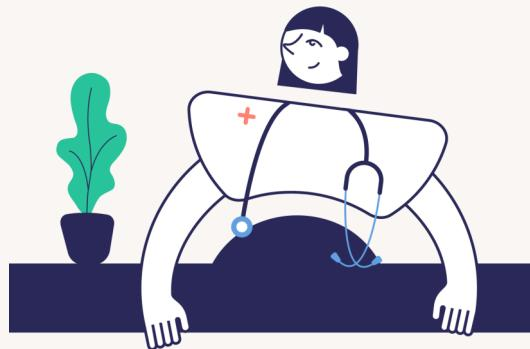

Illustrasjon av en fastlege i hvit kappe med et rødt kors på brystet og et stetoskop rundt halsen. Hun står bak et mørkeblå bord og ser ned på en stor, mørkeblå kule som ligger på bordet. Til venstre på bordet står en grønn plante i en svart potte.

Innsiktsarbeidet har gitt idéer til hva som kan utvikles i samhandlingsrommet mellom fastleger og kommune, og fastleger og BUP. Disse idéene presenteres på de følgende sidene.

#### Funn fra innsiktsarbeidet viser behov for

#### 1. Bedre navigasjon inn til kommunens tjenester

- Ett kontaktpunkt i bydel for henvisninger til det kommunale tjenestetilbudet, slik som seniorkontakten i bydel
- En oversikt over tilbud/tjenesteoversikt
- Et navigasjonsverktøy inn til kommunens tjenester for både innbygger og fastlege som ligner NAV sitt. Med hjelpenavigasjon som "Jeg er bekymret for barnet mitt", "Jeg trenger hjelp", og med FAQ ("Hva skal jeg gjøre når barnet mitt nekter å gå på skolen?")

#### 2. Tettere samarbeid og enklere digital informasjonsutveksling med både kommunale bydeler og etater

- Særlig understrekes behov for samarbeid om gruppen med moderat lidelsestrykk. Både for å avklare hjelpebehov, tilpasse tjenestetilbud og sikre helhetlig behandling for både barn og familie.
  - Fastleger ønsker ikke nødvendigvis kontakt underveis, men å orienteres ved avslutning om effekt av tilbud.
- Mulighet for digital meldingsutveksling må etableres med PPT og barnevern for å oppnå smidig samhandling.

- Fastlege

*"Den ekstra telefonen tar man jo hvis det er en familie med lite ressurser. Noen klarer ikke å navigere i det systemet, så er det ikke noe problem å ta den ekstra telefonen når barna blir skadelidende av det. Men da må man ha noen å ringe."*

- Fastlegen som navigatør

*Det er en veldig fin inngangsport med foreldresamarbeid, som Oslohjelpa har.*

- Fastlege

*Det er ikke alltid skolehelsetjenesten er kobla på pasientene våre, eks. ved ADHD og autisme-spekterforstyrrelser, der er det skolen som tenker at de trenger ressurser og ikke noe fra helsesykepleier.*

- Fastlege

*Mye avhenger av foreldrene når barna har vansker, og det er mange som har henvendt seg til Oslohjelpa som har fått kjempegod hjelp, og får støtte og verktøy der.*

- Fastlege

#### Funn fra innsiktsarbeidet viser behov for

#### 3. En overordnet forventningsavstemming mellom BUP og fastleger rundt henvisningsprosess

- Ønske om å avklare forventninger om hva fastlegenes henvisninger skal inneholde. Av alle fastlegenes henvisninger utgjør henvisninger til BUP et lavt antall årlig. Fastlegene ønsker en aksept for en viss pragmatisme i hva som er vurdert og inkludert i henvisninger.
- Det virker å være legitime årsaker og ressursmessig riktig avveining som ligger til grunn for at legen eks. ikke alltid har sett barnet før henvisning sendes eller ikke alltid har foretatt somatisk undersøkelse før henvisning.
- Flere fastleger ønsker at de somatiske undersøkelsene tas av BUP for differensialdiagnostiske helhetlige vurderinger.
- Fastlegene opplever også behov for samstemming med BUP vedrørende om deres vurderinger av status presens har tilleggsverdi for meningsinnholdet i henvisningen.

*De som ikke er helt "BUP" men som trenger mer enn fastlege, hva skal vi gjøre med dem?*

- Fastlege

*PPT har jo også psykologer som kunne gjenkjent symptomtrykk eller diagnoser som ikke skolehelsetjeneste kjenner igjen.*

- Fastlege

#### 4. Smidigere og digitaliserte løsninger i arbeidet med henvisninger

- **Innhenting av samtykke**  
Behov for vurdering av hvilken instans som skal innhente samtykke, og vurdere hvorvidt det er nødvendig med begge foreldres samtykke før inntak i BUP – all den tid samme praksis ikke gjør seg gjeldende i somatikken.
- **Vedlegg av filer digitalt**  
Henvisningen til BUP inneholder, i motsetning til henvisninger til de fleste andre instanser, ofte rapporter fra komparenter av et visst omfang (fra PPT o.l.). Per i dag er det ikke mulig å vedlegge filer i ordinært format, og det gjør resultatet vanskelig leselig for mottaker og arbeidskrevende å legge ved vedlegg.
- **Avslag**  
Fastlegene ønsker at avslag på henvisning ikke kommer i brevsform, men digitalt i Helsenor og i mer smidig språkdrakt.

Det er delte meninger blant fastlegene om det bør etableres egen mal for BUP-henvisning. Noen er positive til at det utarbeides en kort sjekkliste for hva som bør være med av sentrale opplysninger (for å sikre at det vesentligste nevnes + sikre at man oppfyller egne dokumentasjonskrav). Et innspill er å heller utforske muligheten for at henvisninger leses med AI i BUP, heller enn å jobbe for mindre variasjon i henvisningene inn.

#### Funn fra innsiktsarbeidet viser behov for

#### 5. Styrket samhandling og dialog om enkeltforløp ved inntak, underveis og ved avslutning

- Fastlegene ønsker at de får estimert omfang som tilbys ved inntak.
- Fastleger ønsker enklere tilgang til medikamentrådgivning med BUP. De ønsker et telefonnummer så de kan ringe og konferere med en lege. Det trenger ikke å være en vakttelefon, men et direktenummer med en kontortid.
- Fastleger ønsker informasjon underveis i komplekse saker, samt et kort digitalt møte før avslutning om hva som skal gjøres videre.
- Fastlegene ønsker opplyst ansvarlig behandler med kontaktinfo for å slippe å gå via sentralbord for å drøfte enkeltsaker.

*BUP trenger ikke å være bekymret for å bli nedringt, det har vi ikke tid til.*

- Fastlege

*Det hadde vært nyttig med et infomøte i ny og ne, hva vil de ha i henvisninger, hva vil vi ha i epikriser, har vi nok tverrfaglige møter osv.*

- Fastlege

#### 6. Styrket overordnet samhandling

Fastlegene ønsker mer overordnet samhandling enn kun på individnivå

*Skal de ut om to måneder eller om et år? Når kommer de til mitt bord? Jeg fikk informasjon om et estimert forløp på 6-12 mnd. for en pasient. For en annen fikk jeg beskjed om at vurderingssamtale var utført, og at de tenkte de kunne tilby 5-10 timer kognitiv terapi.*

- Fastlege

#### Hva fastleger beskriver at barn, unge og familiene deres trenger

- Gratis fastlege **opp til 18 år**, ikke bare 16 år
- Tydelig fordeling av ansvar for å følge opp barn som sliter med **skolevegring**
- Styrke tilbud som yter **foreldrestøtte (skulder-til-skulder, sosial og praktisk støtte)/foreldreveiledning**
- Tilstrekkelig kapasitet, kompetanse og fleksibilitet i **lavterskeltilbud for psykisk helse og rus**
- Fastlegen kan kompensere noe for situasjonen ved å sykmelde foreldre. Andre kompensatoriske løsninger for familiene kunne vært andre voksne ressurser som kunne bistått foreldre.

*Som gir sosial støtte, som gode naboer eller husmorvikarer. En voksen som lager middag sammen med deg. Speiler barna sammen med deg eller lignende*

- Fastlege

*Det handler utrolig mye om hvordan foreldrene står i vanskene og situasjonen, det er jo foreldre som står i så krevende situasjoner, men som håndterer det greit. Vi fastleger ser familien som ett, så det blir derfor oftere henvisning til BUP hvis foreldrene har suboptimal fungering (eks. skilsmisse, krampling, annet) og de ikke klarer å bære situasjonen med barnets vansker selv. Hvis det er funksjonsfall på flere arenaer i familien, selv etter at man har forsøkt lokale tiltak, tenker man BUP*

- Fastlege