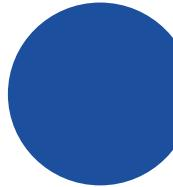
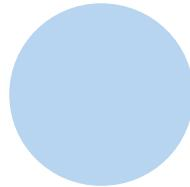
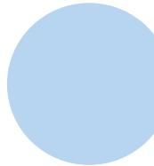
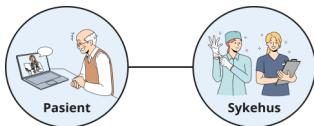
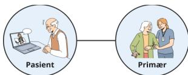
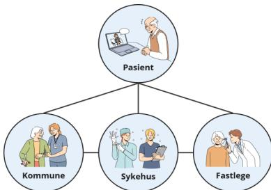
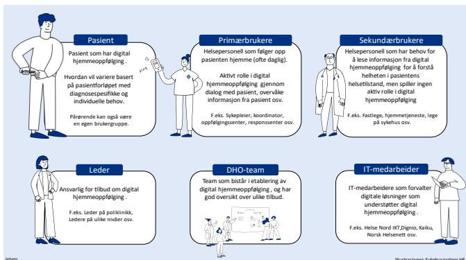
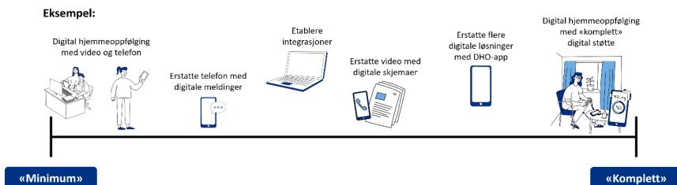

# Funksjonell innsikt v1.0

Digital hjemmeoppfølging i Helse Nord

Delprosjekt «Digital hjemmeoppfølging i Helse Nord»  
Prosjekt «Digitale innbygger- og samhandlingstjenester»

A solid dark blue circle.

A solid light blue circle.

A solid light blue circle.

A solid light blue circle.

Michelle Hokland  
Tjenestedesigner

Dato: 17.11.2025

## Innholdsfortegnelse

|       |                                                                |    |
|-------|----------------------------------------------------------------|----|
| 1.    | Innledning og bakgrunn .....                                   | 4  |
| 1.1   | Definisjon på digital hjemmeoppfølging .....                   | 4  |
| 1.2   | Hypoteser og spørsmål .....                                    | 5  |
| 2.    | Metode.....                                                    | 5  |
| 2.1   | Informanter .....                                              | 6  |
| 2.2   | Andre initiativer .....                                        | 7  |
| 2.3   | Samhandlingsinitiativer i nord .....                           | 8  |
| 2.4   | Forbedringsområder .....                                       | 9  |
| 2.5   | Systematisering av innsikt .....                               | 10 |
| 3.    | Nøkkelfunn: Hva har vi lært så langt? .....                    | 10 |
| 3.1   | Digitalisering av pasientforløp .....                          | 12 |
| 3.1.1 | Brukerstyrt helsehjelp .....                                   | 12 |
| 3.1.2 | Behovsstyrt helsehjelp.....                                    | 13 |
| 3.2   | Pasientforløp med variasjoner .....                            | 14 |
| 3.3   | Ulike aktører kan være involvert.....                          | 15 |
| 3.3.1 | Samhandling mellom primær- og spesialisthelsetjenesten .....   | 16 |
| 3.4   | Brukergrupper med ulikt informasjonsbehov .....                | 17 |
| 3.5   | God pasientopplevelse.....                                     | 18 |
| 3.6   | Ulike digitale funksjoner .....                                | 19 |
| 3.6.1 | Behov for ulike funksjoner i DHO-forløp.....                   | 20 |
| 3.6.2 | Løsninger som dekker ulik grad av funksjoner.....              | 20 |
| 3.6.3 | Grad av digital støtte kan videreutvikles etter oppstart.....  | 20 |
| 3.7   | Administrering av DHO-forløp .....                             | 21 |
| 3.8   | DHO-apper i bruk.....                                          | 21 |
| 3.8.1 | Anskaffelse av rammeavtale.....                                | 22 |
| 3.8.2 | DHO-apper + EPJ-system .....                                   | 22 |
| 3.8.3 | DHO-apper + Helsenorger .....                                  | 22 |
| 3.9   | Mange relevante digitale løsninger: Hva – når – hvordan? ..... | 23 |
| 3.9.1 | Digital plan.....                                              | 23 |
| 3.9.2 | Digitale skjemaer .....                                        | 24 |
| 3.9.3 | Digital dialog.....                                            | 24 |

|        |                                                    |    |
|--------|----------------------------------------------------|----|
| 3.9.4  | Video .....                                        | 25 |
| 3.10   | «Digitalt merarbeid» for helsepersonell .....      | 25 |
| 3.10.1 | Informasjonsdeling mellom digitale løsninger ..... | 26 |
| 3.10.2 | «Digital hjemmeoppfølging» og «samhandling».....   | 26 |
| 3.11   | Kartlegging før oppstart.....                      | 27 |
| 3.12   | Endringsledelse .....                              | 27 |
| 3.13   | Organisering og team .....                         | 28 |
| 3.14   | Skalerbarhet.....                                  | 29 |
| 3.15   | Helhetlig forvaltning.....                         | 29 |
| 3.15.1 | Forvaltning av digitalt utstyr.....                | 30 |
| 3.15.2 | Regionalt nettverk.....                            | 30 |
| 4.     | Oppsummering .....                                 | 31 |
| 5.     | Vedlegg.....                                       | 31 |

## 1. Innledning og bakgrunn

Digital hjemmeoppfølging (DHO) er et strategisk satsingsområde i Helse Nord. Høsten 2024 startet Helse Nord RHF et delprosjekt «Digital hjemmeoppfølging i Helse Nord» i prosjektet «Digitale innbygger og samhandlingstjenester (DIS)» for å utrede behov i regionen. Dokumentet beskriver innsikt, funn og vurderinger som delprosjektet har innhentet fra høst 2024 til våren 2025.

I styringskrav og rammer for Helse Nord for 2025 står det: *«Helseforetakene skal i samarbeid intensivere arbeidet med å ta i bruk digital hjemmeoppfølging. Helse Nord RHF vil sørge for at det etableres samarbeidsfora på tvers av HFene.»*1

Målsetningen med innsiktsarbeidet har vært å lære mer om hvordan vi jobber med digital hjemmeoppfølging i Helse Nord, og forstå utfordringer og behov knyttet til å starte opp og videreutvikle pasientforløp med digital hjemmeoppfølging.

Det er skrevet flere dokumenter om digital hjemmeoppfølging i de siste årene. F.eks. «Digital hjemmeoppfølging - sluttrapport fra nasjonal utprøving 2018-2021»2. Dette innsiktsarbeidet har ikke fokus på å oppsummere tidligere utredninger, men fokus på initiativer og behov for digital hjemmeoppfølging i Helse Nord.

Det er parallelt gjennomført arbeid som omhandler arkitektur, integrasjon og tekniske løsninger, men som ikke er beskrevet i dette dokumentet.

### 1.1 Definisjon på digital hjemmeoppfølging

Innsiktsarbeidet har tatt utgangspunkt i Helsedirektoratets definisjon:

*«Digital hjemmeoppfølging innebærer at hele eller deler av et behandlingstilbud foregår uten fysisk kontakt, der dialog og deling av data mellom pasient/bruker og behandler(e) skjer digitalt.»*3

I tillegg jobbet ut fra at *samhandling* er en sentral faktor i DHO-forløp, men også i andre pasientforløp. Derfor har samhandlingsbehov kun blitt inkludert når det har vært relevant for DHO.

---

1 [styringskrav-og-rammer-til-helseforetakene-2025-inkl-vedlegg.pdf](#)

2 <https://www.helsedirektoratet.no/digitalisering-og-e-helse/nasjonal-e-helseportefolie/tiltak-i-nasjonal-e-helseportefolie/pasientens-maledata-helsedirektoratet>

3 [Digital hjemmeoppfølging - Helsedirektoratet](#)

### 1.2 Hypoteser og spørsmål

Innsiktsarbeidet har utforsket digital hjemmeoppfølging med en bred tilnærming. Det har vært sentralt å forstå historiene til initiativene, og deres refleksjoner om hva som skal til for å intensivere innføring av digital hjemmeoppfølging. I tillegg har brukerbehov, digitale løsninger og organisering vært viktige temaer.

Prosjektet har tatt utgangspunkt i noen hypoteser:

#### Hypotese 1:

I Helse Nord er digital hjemmeoppfølging tatt i bruk på ulike måter, og noen helseforetak er kommet lengre enn andre.

- Hvordan er digital hjemmeoppfølging i bruk i Helse Nord i dag?
- Hva må til for å skape mer og bedre digital hjemmeoppfølging i Helse Nord?

#### Hypotese 2:

Det er økende bruk av apper som er skreddersydd for digital hjemmeoppfølging, heretter omtalt som DHO-apper.

- Hvilke DHO-apper er i bruk?
- Hvordan brukes DHO-appene av pasienter og helsepersonell?
- Hvilke DHO-app bør tas i bruk i de ulike pasientforløpene?
- Hva må være på plass for at sykehusene kan ta i bruk DHO-apper?
- Hvor stort er behovet for å integrere DHO-appene med andre systemer?

#### Hypotese 3:

Det er flere digitale pasient- og samhandlingsløsninger (digitale skjemaer, digital dialog, pasientens planer m.fl.) som kan dekke deler av behovene i pasientforløp med digital hjemmeoppfølging.

- Hvilke digitale løsninger bør brukes når?
- Hvordan kan flere digitale løsninger brukes i samme pasientforløp for å understøtte behov for digital hjemmeoppfølging?

## 2. Metode

Hovedmålet med innsiktsarbeidet har vært å lære av ulike initiativer i Helse Nord, og har blitt gjennomført over en lengre periode. Det betyr at funn kan ha endret seg underveis i kartleggingen, spesielt kartlagte pasientforløp.

I tillegg har valg av metode blitt tilpasset de ulike initiativene. Innsiktsarbeidet har blitt utført som: Digitale kartleggingsmøter, workshops, gruppeintervjuer, dybdeintervjuer og observasjon. I all hovedsak er kartleggingen gjennomført ustrukturert med noen unntak.

### 2.1 Informanter

Det er gjennomført kartlegging med følgende initiativer:

#### «Tidlig hjem»

Nyfødt intensiv på UNN Tromsø:

- Fysisk samtale med mor til tidligere nyfødt barn (anonymt).
- Digitalt kartleggingsmøte med Mariann Hansen (seksjonsleder) og Ingvild Andersen Dahl (sykepleier).

#### Digital bekkenbunnspoliklinikk

Bekkenbunnspoliklinikk på UNN Harstad:

- Digitalt kartleggingsmøte med pasient med bekkenbunnssplager (anonymt).
- Digitale kartleggings- og oppfølgingsmøter med Hilde T. A. Johnsen (spesialfysioterapeut), og Ingjerd E. E. Valbekmo (prosjektleder på UNN).

#### Fellestjenesteprogrammet UNN og Tromsø kommune

- Deltakelse på tverrfaglig workshop i regi av «Samhandlingsprosjektene til UNN og Tromsø kommune»:
  - Lindrende forløp
  - KAD Solis infusjonspumpe
  - Det trygge boalternativet
  - Eldreløftet
  - Bedre ernæringsoppfølging til skrøpelige eldre
- Digitalt kartleggingsmøte med Monika Dalbakk (koordinator for program fellestjenester UNN og Tromsø kommune) og Per Hasvold (Teamleder innovasjon) på UNN Tromsø.

#### «Helt hjem - Helt digital - Helt sikker - Hele veien med og for pasienten»

- Deltakelse på tverrfaglig workshop i regi av UNN.

#### ShareIT - Effektive og brukervennlige arbeidsverktøy for klinikere

Pilot Helse prosjekt i regi av NLSH med samarbeidspartnere med ulike arbeidsgrupper:

#### Datadeling mellom sykehus og kommune

- Fasilitering av tverrfaglig workshop med deltakere fra NLSH, Vestvågøy kommune, DIPS, Aidn og HN IKT
- Digitale kartleggingsmøter med NLSH.

#### Persontilpasset digital hjemmeoppfølging av kreftpasienter

- Deltakende på tverrfaglige workshops med NLSH, DIPS, Kaiku og HN IKT.
- Fysiske kartleggingsmøter med NLSH og Kaiku.
- Hospitering på Kreftavdelingen på NLSH Bodø.

#### **Digital hjemmeoppfølging for pasienter med hjertesvikt**

Hjertepoliklinikken på UNN Tromsø:

- Deltakelse på tverrfaglig workshop «Digitale pasientforløp» i regi av samarbeidsprosjekt «Etablere felles tjeneste om digital hjemmeoppfølging» mellom UNN og kommunene i Nord-Troms med Hjertepoliklinikken som pilot.
- Fysisk kartleggingsmøte med Veronika Fjeldstad (seksjonsleder), Oddrun Vargren Halvorsen (spesialsykepleier) og Ragnhild Jonassen (spesialsykepleier) fra Hjertepoliklinikken. I tillegg deltakelse fra PSHT (Sondre Bergstedt Flaad og Renate Vibece Sørensen) og prosjektleder fra UNN (Ingjerd E. E. Valbekmo).

#### **Digital hjemmeoppfølging til pasienter med kroniske respirasjonsslidelser (KOLS)**

Medisinsk avdeling på HSYK Mosjøen:

- Digitalt kartleggingsmøte med Eva Bjørhusdal (prosjektleder og intensivsykepleier) og Silje Paulsen (rådgiver innovasjon/tjenesteutvikling).

#### **Brukerpanel for Digital innbygger- og samhandlingstjenester (DIS)**

- Innspill fra pasient og pårørende på møte i regionalt brukerpanel.

#### **Digitale løsninger for digital hjemmeoppfølging**

- DHO PAS i DIPS Arena: Presentasjon, demo og dialog med DIPS i regi av ShareIT.
- Kaiku: Presentasjon, demo og dialog med leverandør i regi av ShareIT.
- Dignio: Demo av superbruker på UNN.

Prosjektet har også gjennomført møter med prosjektrepresentanter og medarbeidere som jobber med å etablere digital hjemmeoppfølging på UNN, NLSH, FIN og HSYK. I tillegg fått innspill fra nyetablert regionalt fagnettverk for digital hjemmeoppfølging. Helse Nord IKT har også deltatt i deler av arbeidet, og bidratt til innsikten.

### **2.2 Andre initiativer**

Innsiktsarbeidet inkluderer ikke kartlegging av alle initiativene som jobber med digital hjemmeoppfølging i Helse Nord, men i løpet av kartleggingen er det blitt identifisert andre initiativer som jobber med digital hjemmeoppfølging i Helse Nord:

- Depresjon, panikk lidelse og sosial angst - e-Behandling4 (UNN)
- Diabetes type 1 (UNN og FIN)
- Dialyse (NLSH)
- Epilepsi (UNN5, NLSH og HSYK)
- Ernæring (FIN og NLSH)
- Hjertesvikt (HSYK og FIN)
- Kols (FIN)

---

4 [Tilbud om eBehandling åpnet på UNN - Helse Nord RHF](#)

5 [Rapport «Erfaring med bruk av digitale skjemaer for oppfølging av epilepsipasienter hjemmefra»](#)

- Kreft (HSYK)
- Ortopedi (HSYK)
- Pacemaker/ICD/ILR (NLSH)
- Palliasjon hos barn og unge - PALBU (NLSH)
- Psykisk helse og rus (HSYK)
- Revmatologisk oppfølging (UNN)
- Søvnapne og soveมาสke (NLSH)

Listen er ikke komplett, og kan derfor være mangelfull. Noen av initiativene er i samarbeid med primærhelsetjenesten, og det varierer om forløpet er i planlegging, utprøving eller drift. Helse Nord RHF har etablert en felles oversikt over alle initiativer både på regionalt og nasjonalt nivå, og jobber med å legge til innhold6.

### 2.3 Samhandlingsinitiativer i nord

Det er flere samhandlingsinitiativer mellom primær- og spesialisthelsetjenesten, ofte koordinert av helsefellesskapene i Nord-Norge, som driver frem etablering av digital hjemmeoppfølging i regionen:

#### **Finnmarksykehuset og Helsefellesskapet Finnmark**

«Digital hjemmeoppfølging Finnmark» er etablert som et prosjekt for å oppnå tett samarbeid med kommunene om å utvikle en tydelig samhandlingsmodell, og hvor visjonen er å bygge et miljø for utvikling av e-helsetjenester i Finnmark. Målet er å styrke brukeres selvstendighet og evne til å mestre egen sykdom og helse ved å tilby flere tjenester i eget hjem, eller nærmere eget hjem, samt etablere et helhetlig tjenesteforløp for digital hjemmeoppfølging for personer som mottar jevnlig oppfølging fra helsetjenestene i samarbeid med prosjektet «Digitalt Sykehus»7.

#### **Digitale Helgeland**

Digitale Helgeland er et kommunalt oppgavefellesskap som forener 16 kommuner, og har opprettet et prosjekt «Digital hjemmeoppfølging Helgeland» (DHH). I prosjektet samarbeider Helgelandssykehuset, helgelandskommunene og samarbeidsparter blant fastleger for å videreutvikle digital hjemmeoppfølging i regionen. Målet er å gjøre gode helsetjenester tilgjengelige for alle, styrke kvaliteten i tjenestene for personer med kroniske lidelser, og bidra til bedre ressursbruk8.

#### **DHO Nord (Lofoten, Vesterålen og Salten)**

DHO-Nord er Helsefellesskapet Lofoten, Vesterålen og Salten sitt felles prosjekt for å innføre og utvikle digital hjemmeoppfølging i kommunene og på Nordlandssykehuset.

6 <https://intranett.helsenord.no/pasientbehandling-felles/digitale-helsetjenester/>

7 Prosjekt «Digital hjemmeoppfølging Finnmark» 2025-2027

8 <https://digihelgeland.no/snarveier/prosjekt/digital-hjemmeoppfolging-helgeland/>

Prosjektet bygger videre på «Spredningsprosjektet: Digital Hjemmeoppfølging i Nord» med Nordlandssykehuset, Bodø, Hadsel, Øksnes, Bø, Sortland og fastlegejenesten i utprøvingskommunene9. Prosjektet tar utgangspunkt i behovet for bedre samhandling mellom helseaktører, økt bruk av teknologi i pasientoppfølging og utvikling av bærekraftige modeller for helsetjenester i en region med spredt bosetning over store avstander hvor helsepersonell og helsetjenester må benyttes på en ressurseffektiv måte10. Samarbeidet ligger også til grunn for anskaffelsen av en felles løsning for digital hjemmeoppfølging (Dignio).

#### **Nordlandssykehuset og Bodø kommune**

Nordlandssykehuset og Bodø kommune har jobbet med å etablere digital hjemmeoppfølging for flere pasientforløp over flere år. Eksempelvis:

- Smart Helse – Digital hjemmeoppfølging av kronisk syke11
- Digital hjemmeoppfølging ved Covid-1912

Samarbeidet med Nordlandssykehuset og Bodø kommune har gitt gode resultater for både pasienter og helsetjenesten. I tillegg ført til nyttige erfaringer om samhandling mellom primær- og spesialisthelsetjeneste. Blant annet har erfaringene vært anvendt i anskaffelsen av et felles DHO-verktøy (Dignio).

#### **UNN og kommunene i Nord-Troms**

UNN og kommunene i Nord-Troms har et samarbeidsprosjekt «Etablere felles tjeneste om DHO mellom UNN og kommunene». Prosjektet bygger på spredningsprosjektet for digital hjemmeoppfølging mellom UNN og kommunene i Nord-Troms13.

### **2.4 Forbedringsområder**

- Det har ikke blitt gjennomført kartlegging av pasientforløp med digital hjemmeoppfølging på FIN, men har vært dialog med nøkkelressurs.
- Det har ikke blitt gjennomført god kartlegging av pasientforløp med sterk samhandling med primærhelsetjenesten, men har vært møter med medarbeidere i Helse Nord som har stor kjennskap til behovene i primærhelsetjenesten.
- Store deler av kartleggingen har blitt gjennomført med en ustrukturert metodikk for å tilpasse innsiktsarbeidet til de enkelte initiativene, og av hensyn til tid.
- Kartleggingen har hatt et stort omfang, og dermed blitt gjennomført over lengre tid.

---

9 [Erfaringsrapport for Spredningsprosjekt Digital hjemmeoppfølging i nord](#)

10 <https://www.nordlandssykehuset.no/samhandling/dho-nord/digital-hjemmeoppfølging-i-lofoten-vesteralen-og-salten/>

11 [Erfaringsrapport - digital hjemmeoppfølging - Bodø.pdf](#)

12 [Erfaringsrapport - Digital hjemmeoppfølging ved covid-19 - Bodø - des 2020.PDF](#)

13 [Sluttrapport DHO Nord-Troms.pdf](#)

### 2.5 Systematisering av innsikt

Innsikt er beskrevet og visualisert med to ulike tilnærminger:

## 1. Pasientforløp

I flere av initiativene har innsiktsarbeidet resultert i detaljert kartlegging av pasientforløp. Dette har vært for å imøtekomme behovene for kartlegging i initiativene, og benytte muligheten for prosjektet til å lære mer om detaljene i ulike pasientforløp med digital hjemmeoppfølging. Digital hjemmeoppfølging for kolspasienter (HSYK) er ikke beskrevet og visualisert enda.

Kartlegging av pasientforløpene blir beskrevet i «Vedlegg 1 - Kartlegging av pasientforløp», og er innarbeidet i nøkkelfunnene.

## 2. Nøkkelfunn

Prosjektet har valgt å oppsummere innsikt i form av **15 nøkkelfunn**. Disse har blitt avdekt på ulike tidspunkter i innsiktsarbeidet, og kan variere i modenhet. Nøkkelfunnene blir beskrevet og visualisert i neste kapittel.

## 3. Nøkkelfunn: Hva har vi lært så langt?

Oppsummering av nøkkelfunn:

1. **Digitalisering av pasientforløp:** Et prioritert satsningsområde i Helse Nord for å gi bedre og raskere helsehjelp til flere innbyggere.
2. **Variasjoner i DHO-forløpene:** Det er ulike variasjoner basert på diagnosespesifikke og individuelle behov hos pasienten. Løsningene må være fleksible nok til å støtte alt fra egenmålinger til selvhjelpsverktøy.
3. **Ulike aktører kan være involvert:** Jo flere aktører som deltar, desto større krav stilles til samhandling, ansvarsoverganger, og informasjonsdeling. Det er behov for å ivareta ulike hensyn på tvers av primær- og spesialisthelsetjenesten ved etablering av *felles* DHO-forløp.
4. **Brukergrupper med ulikt informasjonsbehov:** Det er behov for mer detaljert kartlegging av brukergrupper og informasjonsbehov. F.eks. Primær vs. sekundærbrukere.
5. **God pasientopplevelse** Pasientene gir positive tilbakemeldinger og opplever trygghet, mestring og nærhet til helsepersonell.

6. **Ulike digitale funksjoner:** Det er identifisert digitale funksjoner som det ofte er behov for i DHO-forløp. Det er viktig å komme i gang med DHO-forløp selv om digital støtte ikke er «perfekt» i starten.
7. **Administrering av DHO-forløp:** I dag er det manglende funksjonalitet for å administrere DHO-forløp. Det er viktig med utprøving og videreutvikling for å ivareta at DHO PAS i DIPS Arena dekker våre behov.
8. **DHO-apper er i bruk:** Kaiku, Dignio og Tellu brukes til digital hjemmeoppfølging i Helse Nord, og fremover bør det være mer fokus på behov for integrasjoner mellom DHO-apper, EPJ (DIPS Arena) og Helsenorge.
9. **Mange relevante digitale løsninger: Hva – Når – Hvordan?:** Det er ulike digitale løsninger for plan, skjema, dialog og video i tillegg til DHO-apper. Dette skaper uoversiktlighet, og behov for samordning og veiledning.
10. **«Digitalt merarbeid» for helsepersonell:** Det er manglende informasjonsdeling mellom DHO-apper, DIPS og Helsenorge som vil skape tungvinte arbeidsprosesser. Dette kan hindre mer bruk av digital hjemmeoppfølging.
11. **Kartlegging før oppstart:** Kartlegging av pasientforløp skaper felles forståelse, og legger grunnlag for gode implementeringer.
12. **Endringsledelse:** Implementering av digital hjemmeoppfølging er avhengig av endringsledelse på ulike nivåer innad i virksomheten, og på tvers av aktører i helsetjenesten.
13. **Organisering og team:** Det er ulike begreper for organisering av digital hjemmeoppfølging (responssenter, oppfølgingssenter, PSHT m.fl.), men modellene bygger på samme prinsipper for samhandling og robust organisering.
14. **Skalerbarhet:** Det er behov for å dele og gjenbruke forløp på tvers for å sørge for et likt behandlingstilbud uansett bosted, og utrede nærmere hvordan helsetjenesten skal håndtere digital hjemmeoppfølging i fremtiden.
15. **Helhetlig forvaltning:** Det er behov for funksjonell, teknisk og merkantil forvaltning, og mer tydelighet i roller og ansvar på tvers i Helse Nord.

### 3.1 Digitalisering av pasientforløp

Digitalisering av pasientforløp er et prioritert satsningsområde i Helse Nord for å gi bedre og raskere helsehjelp til flere innbyggere. Blant annet jobber UNN med en ny strategi «Hjemme når man kan, på UNN når man må», og NLSH har etablert en digital poliklinikk.

Digitalisering av pasientforløp er et bredt område, og det kan være nyttig å se nærmere ulike typer pasientforløp hvor digitale løsninger er viktige forutsetninger:

- Brukerstyrt helsehjelp
- Behovsstyrt helsehjelp

Behov for digitale løsninger utvikler seg i samsvar med behovene i pasientforløp. Fremover vil flere pasientforløp være en kombinasjon av fysisk og digital oppfølging.

#### 3.1.1 Brukerstyrt helsehjelp

*«Min helsetilstand er stabil, og jeg er i stand til å vurdere egne symptomer.  
Jeg kan selv initiere digital kontakt med spesialisthelsetjenesten ved behov.»*

##### **Brukerscenario:**

Kari er diagnostisert med epilepsi for 6 måneder siden, og er satt opp på fire oppfølgingstimer på sykehus i løpet av et år. Hun har ikke hatt komplikasjoner med medisinen, og håndterer diagnosen fint på egen hånd. Sykehuslegen vurderer på 2. oppfølgingstimer at Kari ikke trenger flere faste oppfølgingstimer. De blir enige om at hun kan ta kontakt gjennom digitale løsninger dersom helsetilstanden forverrer seg, eller ved spørsmål.

##### **Digitale løsninger:**

Det er behov for flere digitale løsninger hvor pasient kan se informasjon om sin helsetilstand, og bli mer selvbetjent. Det kan bidra til mer effektive arbeidsprosesser i helsetjenesten, og mer effektiv *brukerstyrt* helsehjelp. F.eks. Når pasienter kan velge/endre time selv når det er nødvendig. Helse Nord har tilgjengeliggjort ulike digitale tjenester for innbyggere på Helsenorge, og jobber med å videreutvikle og innføre flere tjenester for å gi innbyggere nye muligheter.

Eksempler på bruk av digitale løsninger som vil bidra til mer selvbetjening for pasient:

- Digital dialog mellom pasient og helsepersonell (Helsenorge)
- Velge eller endre time selv (Helsenorge)

#### 3.1.2 Behovsstyrt helsehjelp

*«Jeg er hjemme, og får digital oppfølging av helsepersonell **basert på medisinsk behov**»*

Behovsstyrt helsehjelp og digital hjemmeoppfølging er initiert av helsepersonell på bakgrunn av medisinske vurderinger. Dette kan variere i omfang og hyppighet, og som blir eksemplifisert i brukerscenarioer: «Av og til» og «Løpende».

##### Eksempel 1: «Av og til»

*«Jeg er hjemme, og får **av og til** digital oppfølging  
av helsepersonell basert på medisinsk behov»*

##### Brukerscenario:

Etter seks måneder får Kari et kraftig epilepsianfall. Hun tar kontakt med sykehuset, og føler seg mer trygg etter en samtale med sykepleier. I tillegg kan Kari selv velge en videotimer med sykehuslege gjennom digital løsning når det passer henne. På videotimen snakker de om mulige endringer i medisiner, og om håndtering av fremtidige epilepsianfall. Kari skal fortsette med dagens medisiner en stund til, og skal svare på spørsmål om hvordan det går gjennom digitale spørreskjemaer hver tredje måned. På den måten kan sykehuset følge mer med på helsetilstanden til Kari, men unngå reising til sykehus. Sykehuset mottar svarene fra Kari og andre pasienter i en liste som blir triagert (grønn-gul-rød) basert på definerte grenseverdier, og vurderer behov for oppfølging.

##### Eksempel 2: «Løpende»

*«Jeg er hjemme, og min helsetilstand blir **løpende** fulgt opp  
av helsepersonell basert på medisinsk behov»*

##### Brukerscenario:

Kari har ingen flere epilepsianfall i løpet av de neste månedene, men er ofte kvalm og svimmel. Hun har også diabetes 1, og har fått utfordringer med blodsukkeret etter epilepsidiagnosen. I tillegg økende grad av nedstemthet. Sykehuslegen vurderer at hun bør bytte epilepsimedisin, og har behov for å følge henne enda tettere opp. Sykehuslegen og Kari lager en plan om løpende digital hjemmeoppfølging gjennom DHO-app.

Kari måler blodsukkeret på gitte tidspunkter hver dag hjemmefra. Hun svarer på spørreskjema om somatiske symptomer og psykisk helse. Hun dokumenterer også egendefinerte tiltak for å håndtere nedstemthet. I tillegg kan hun sende digital melding til helsepersonell ved behov. Sykehuset mottar all informasjon fra Kari i en liste som blir triagert (grønn-gul-rød) basert på definerte grenseverdier, og vurderer behov for oppfølging på daglig basis.

Etter noen uker på ny medisin har Kari ingen kvalme og svimmelhet, men hun har fortsatt noen utfordringer med blodsukkeret og nedstemthet. Da overtar fastlegen videre oppfølging, og Kari fortsetter med digital hjemmeoppfølging i et par uker til. Etter

hvert blir blodsukkeret og nedstemtheten stabilt nok til at Kari ønsker å avslutte digital hjemmeoppfølging. Hun er tilbake på jobb, får hjelp av fastlegen ved behov, og har digitale kontroller på sykehus for epilepsidiagnosen.

##### **Digitale løsninger:**

Det er behov for å jobbe videre med digitale løsninger som muliggjør ulik grad av behovsstyrt helsehjelp:

Digital oppfølging i stedet for at pasient må reise til fysisk oppmøte på poliklinikk. I dag er videokonsultasjoner og digitale spørreskemaer mest brukt i Helse Nord for å erstatte fysisk oppmøte på poliklinikk.

Digital hjemmeoppfølging som innebærer tett og tverrfaglig oppfølging av pasienter i hjemmet i stedet for at pasient må reise til fysisk oppmøte på poliklinikk eller være innlagt på sengepost. I dag bruker Helse Nord i all hovedsak DHO-apper til slike pasientforløp, fordi disse inkluderer mer funksjonalitet som ofte dekker totalbehovet til forløpene. Det er i mindre grad «satt sammen» flere frittstående digitale løsninger for å dekke totalbehovet, fordi det stiller høyere krav til integrasjoner for å unngå tungvinte prosesser for pasient og helsepersonell.

Eksempler:

- Digitale spørreskemaer om helsetilstand (Checkware, DIPS)
- Videokonsultasjoner (Whereby, Teams til klinisk bruk)
- E-konsultasjoner hos fastlege (Helsenorge)
- Digital dialog med helsepersonell (Helsenorge)
- App for digital hjemmeoppfølging (Kaiku, Dignio, Tellu, Youwell)

### **3.2 Pasientforløp med variasjoner**

Pasientforløp med digital hjemmeoppfølging varierer slik som andre pasientforløp basert på diagnosespesifikke og individuelle behov hos pasienten.

I noen pasientforløp er det viktig at helsepersonell får informasjon fra pasienten og at det er høy grad av interaksjon med pasienten for å yte nødvendig helsehjelp gjennom digital hjemmeoppfølging. F.eks. Pasienten måler blodtrykk og vekt hjemme som automatisk gjøres tilgjengelig for helsepersonell som følger opp pasienten. I andre pasientforløp er det viktig at pasienten får verktøy som gir støtte og motivasjon til selvhjelp. F.eks. Dagbok for knipeøvelser i bekkenbunnstrening, og digital ros eller gamification for å øke motivasjon til selvhjelp hos pasienten.

Det må være mulig å tilpasse digital hjemmeoppfølging i pasientforløp til diagnosespesifikke og individuelle behov hos pasienten. Dette stiller krav til høy grad av fleksibilitet rundt hvordan de digitale løsningene kan tas i bruk i ulike forløp. Samtidig er det behov for standardisering for å øke grad av gjenbruk.

### 3.3 Ulike aktører kan være involvert

Digital hjemmeoppfølging kan involvere ulike aktører slik som de fleste pasientforløp, og det kan være nyttig å gruppere digital hjemmeoppfølging i ulike kategorier basert på hvilke aktører som er involvert:

#### A. Pasient + Spesialisthelsetjenesten

Diagram A illustrates the involvement of a patient and a hospital. It consists of two circular icons connected by a horizontal line. The left icon, labeled 'Pasient', shows an elderly man with a laptop. The right icon, labeled 'Sykehus', shows two healthcare professionals, one in a green scrub and one in a blue scrub, both holding clipboards.

Diagram A: Pasient + Sykehus

**Brukersscenario:** Kreftpasient på immunterapi har digital hjemmeoppfølging i stedet for fysiske polikliniske timer på sykehus.

#### B. Pasient + Kommune

Diagram B illustrates the involvement of a patient and a primary care provider. It consists of two circular icons connected by a horizontal line. The left icon, labeled 'Pasient', shows an elderly man with a laptop. The right icon, labeled 'Primær', shows two healthcare professionals, one in a green scrub and one in a blue scrub, both holding clipboards.

Diagram B: Pasient + Primær

**Brukersscenario:** Pasient med komplisert sår behandles med sårstell av kommunal hjemmetjeneste, og bruker digital hjemmeoppfølging for å overvåke progresjon mellom sårstellene.

#### C. Pasient + Kommune + Sykehus + Fastlege

Diagram C illustrates the involvement of a patient, a municipality, a hospital, and a general practitioner. It consists of four circular icons. The top icon, labeled 'Pasient', shows an elderly man with a laptop. Below it are three icons: 'Kommune' (municipality) on the left, 'Sykehus' (hospital) in the middle, and 'Fastlege' (general practitioner) on the right. The 'Pasient' icon is connected to all three bottom icons by lines that converge at the patient icon.

Diagram C: Pasient + Kommune + Sykehus + Fastlege

**Brukersscenario:** Eldre pasient med komplekse ernæringsutfordringer har digital hjemmeoppfølging der både kommune, fastlege og sykehus er involverte.

Kategoriene skal gi et overblikk over ulike typer pasientforløp med digital hjemmeoppfølging, og utelukker ikke andre grupperinger. Det kan være flere kategorier, spesielt innenfor primærhelsetjenesten. F. eks. Pasient + Hjemmetjeneste.

Digital hjemmeoppfølging med flere aktører på tvers av helsetjenesten er mer utfordrende, fordi det er behov for prosesser og systemer som understøtter samhandling og deling av informasjon på tvers. Det er ofte enklere å gjennomføre digital hjemmeoppfølging hvor det er kun én aktør som samhandler med pasient. F.eks. Digital poliklinikk på sykehus.

Pasientforløp med digital hjemmeoppfølging kan også utvikle behov for flere aktører underveis. F.eks. En pasient som får sårbehandling hjemme av Hjemmetjenesten kan få en forverring som krever at spesialist på sykehus og fastlege må bli involvert. Behov for slik fleksibilitet stiller krav til digitale løsninger som tas i bruk i digital hjemmeoppfølging, og tydelighet rundt ansvarsoverganger mellom aktører. I tillegg er det viktig å legge til rette for at anvendelse av digital hjemmeoppfølging kan endre og videreutvikle seg i fremtiden.

#### **3.3.1 Samhandling mellom primær- og spesialisthelsetjenesten**

Fremover er det viktig å legge til rette for flere *felles* DHO-forløp mellom primær- og spesialisthelsetjenesten for å kunne intensivere bruken av digital hjemmeoppfølging i Helse Nord.

Det er viktig å samhandle med primærhelsetjenesten under etablering og videreutvikling av felles DHO-forløp. Eksempelvis:

- Sikre at aktørene forstår hverandres roller, og er likestilte i samarbeidet.
- God ledelsesforankring hos alle aktører som muliggjør endringsarbeid på tvers av helsetjenesten.
- Etablere digital hjemmeoppfølging som en likestilt tjeneste.
- Skape forståelse for ulike organisatoriske forhold.
- Etablere tydelige prosesser og rutiner som understøtter oppgave- og ansvarsfordeling blant flere aktører.
- Tilpasset informasjon og opplæring til ulike deler av helsetjenesten.
- Høy synlighet og tilgjengelighet hos alle aktører.
- Skape forståelse for hva digital hjemmeoppfølging kan være og bety i praksis for ulike aktører.

Det er initiativer i Helse Nord som har god erfaring med å samarbeide med primærhelsetjenesten om DHO-forløp. Spesielt har Nordlandsykehuset og Bodø kommune gjennom flere år prøvd ut flere varianter av samarbeid om felles DHO-forløp, og som andre initiativer kan nyttiggjøre seg av.

Felles DHO-forløp er mer komplekse enn DHO-forløp i regi av én aktør. F.eks. DHO-forløp kan redusere innleggelser og oppfølging på sykehus, men føre til at kommunene får et større ansvarsområde for hjemmeboende pasienter. Dette betyr at helsetjenesten må ivareta ulike hensyn ved etablering av *felles* DHO-forløp som kan være utfordrende for fagmiljøene. Hensyn rundt ansvarsfordeling, organisering og finansiering må ivaretas på et nivå hvor det er mulig å ivareta helhetlige behov på tvers av helsetjenestenivåer.

Det er behov for å jobbe videre med å finne ut av hvordan behov for samhandling mellom primær- og spesialisthelsetjenesten kan ivaretas på best mulig måte ved etablering av forløp med digital hjemmeoppfølging i Helse Nord.

### 3.4 Brukergrupper med ulikt informasjonsbehov

Innsiktsarbeidet har pekt på ulike brukergrupper som er involvert i digital hjemmeoppfølging gjennom kartlegging av pasientforløp:

**Pasient**  
Pasient som har digital hjemmeoppfølging.  
Hvordan vil variere basert på pasientforløpet med diagnosespesifikke og individuelle behov.  
Pårørende kan også være en egen brukergruppe.

**Primærbrukere**  
Helsepersonell som følger opp pasienten hjemme (ofte daglig).  
Aktivt rolle i digital hjemmeoppfølging gjennom dialog med pasient, overvåke informasjon fra pasient osv.  
F.eks. Sylepleier, koordinator, oppfølgingsenter, responsenter osv.

**Sekundærbrukere**  
Helsepersonell som har behov for å lese informasjon fra digital hjemmeoppfølging for å forstå helheten i pasientens helsetilstand, men spiller ingen aktiv rolle i digital hjemmeoppfølging.  
F.eks. Fastlege, hjemmetjeneste, lege på sykehus osv.

**Leder**  
Ansvarlig for tilbud om digital hjemmeoppfølging.  
F.eks. Leder på poliklinikk, ledere på ulike nivåer osv.

**DHO-team**  
Team som bistår i etablering av digital hjemmeoppfølging, og har god oversikt over ulike tilbud.

**IT-medarbeider**  
IT-medarbeidere som forvalter digitale løsninger som understøtter digital hjemmeoppfølging.  
F.eks. Helse Nord IKT, Dignio, Kalku, Norsk Helsenet osv.

Illustrasjoner: Sykehuspartner HF

Diagram showing six user groups involved in digital home monitoring: Patient, Primary User, Secondary User, Leader, DHO-team, and IT-staff. Each group has a description of their role and information needs.

Det bør jobbes videre med å beskrive **ulike brukergrupper** i mer detalj (f.eks. personas) for å få en bedre forståelse for deres utfordringer og behov. Eksempler på mer detaljerte brukergrupper:

#### - **Fastlege**

Fastlegene er ofte medisinsk ansvarlig for pasienter som mottar hjemmebehandling/-oppfølging, og kan ha stor nytte av verdiene fra målinger av pasient i hjemmet. I tillegg bestille målinger i hjemme, ha dialog med hjemmetjenesten, sette grenseverdier osv. Fastlegetjenesten påpeker at digital hjemmeoppfølging ikke må til merarbeid for fastlegene. Fastlegene er også en viktig brukergruppe for «Pasientens måledata» og felles digital plan for pasienten.

#### - **Hjemmetjenesten**

Hjemmetjenesten er en travel og belastet tjeneste, og digital hjemmeoppfølging skal avlaste hjemmetjenesten med at de ikke trenger å kjøre ut til pasientene. Samtidig er det viktig å utnytte potensiale fra informasjon som hjemmetjenesten allerede dokumenterer i sine systemer.

Spesielt er det viktig å kartlegge **informasjonsbehovet** til ulike brukergrupper. Dette er viktig for å integrere nødvendige digitale løsninger, og oppnå informasjonsdeling på best mulig måte. F.eks. Tilgjengeliggjøring av data fra DHO-apper vil kunne gi tilstrekkelig informasjon for noen brukergrupper.

### 3.5 God pasientopplevelse

Innsiktsarbeidet peker på at pasientperspektivet blir godt ivaretatt i pasientforløp med digital hjemmeoppfølging. En del initiativer har pasienter med i planlegging, implementering og evaluering, og viser til gode tilbakemeldinger fra pasienter og pårørende i alle aldersgrupper:

**Eksempel 1:** Pasienter mellom 18-92 år bruker Kaiku for kreftoppfølging i hjemmet. Pasientene føler seg trygg og godt ivaretatt, og det er lav grad av tekniske utfordringer. Spesielt blir muligheten til å sende melding til helsepersonell løftet frem som positivt.

**Eksempel 2:** Utrøving av Dignio for hjertesviktpasienter på UNN viser foreløpig at pasientene kan oppnå maksdose på medisin på et tidligere tidspunkt, og som kan forkorte pasientforløpet. Både pasient og pårørende har gitt positive tilbakemeldinger.

I tillegg er pasienter gode «ambassadører» for innføring av digital hjemmeoppfølging. F.eks. [Kreftpasient rapporterer inn om immunterapi via en app – får raskere svar hos Nordlandssykehuset – NRK Nordland](#).

Generelt er helsepersonell opptatt av å forstå pasientenes behov og opplevelser både før, under og etter bruk av digital hjemmeoppfølging, samt å lære av dette for å skape bedre pasientforløp. Spesielt fremhever helsepersonell viktigheten med å gjøre vurderinger av pasientens digitale kompetanse før bruk av digital hjemmeoppfølging.

### 3.6 Ulike digitale funksjoner

I løpet av innsiktsarbeidet er det identifisert overordnede digitale funksjoner som det ofte er behov for i digital hjemmeoppfølging:

|                             |                                        |                                                                                                                              |                         |
|-----------------------------|----------------------------------------|------------------------------------------------------------------------------------------------------------------------------|-------------------------|
| Meldinger/ Chat          | Videosamtale                           | Bilde                                                                                                                        | Plan                    |
| Oppgaver                    | Påminnelser                            | Triagering  | Positiv forsterkning |
| Opplæring                   | Utstyr                                 | Målinger                                                                                                                     | Spørreskjema            |
| Administrasjon av forløp | Dele informasjon utenfor Helse Nord | Tiltak                                                                                                                       | ...                     |

Oversikten er ikke komplett, og bør utarbeides på et mer detaljert nivå. I tillegg er det viktig at digitale løsninger ivaretar variasjoner i behov for digitale funksjoner.

bruk av «triagering» eller «trafikklysmodell» er en viktig funksjon i digital hjemmeoppfølging, og det er positive tilbakemeldinger fra helsepersonell på bruk av slik beslutningsstøtte i digital hjemmeoppfølging. F.eks. Automatisk prioritering av egenmålinger fra pasienter basert på gitte grenseverdier. Dette hjelper helsepersonell med prioriteringer i en travel hverdag, og er svært viktig når antall pasienter med digital hjemmeoppfølging øker.

![Diagram illustrating the traffic light model for monitoring and action. It shows a patient at a desk with a 'Melding' (Message) icon, leading to a traffic light with red, yellow, and green lights. A red arrow points up, a yellow arrow points right, and a green arrow points down. A healthcare worker is shown holding a smartphone with a 'Melding' icon. Text explains: 'Gule og røde verdier: Oppfølging og tiltak etter behov, og kan variere mellom forløp og pasient.' and 'Grønne verdier: Ingen oppfølging eller tiltak utenom normalen.'](HelseNord-DHO-funksjonell-innsiktsrapport-v1/898fb89a50d9ec1dfb4e425c816976a7_img.jpg)

**Gule og røde verdier:**  
Oppfølging og tiltak etter behov, og kan variere mellom forløp og pasient.

**Grønne verdier:**  
Ingen oppfølging eller tiltak utenom normalen.

Diagram illustrating the traffic light model for monitoring and action. It shows a patient at a desk with a 'Melding' (Message) icon, leading to a traffic light with red, yellow, and green lights. A red arrow points up, a yellow arrow points right, and a green arrow points down. A healthcare worker is shown holding a smartphone with a 'Melding' icon. Text explains: 'Gule og røde verdier: Oppfølging og tiltak etter behov, og kan variere mellom forløp og pasient.' and 'Grønne verdier: Ingen oppfølging eller tiltak utenom normalen.'

Det er også tilbakemeldinger om at dagens funksjoner for «triagering» i DHO-forløp ikke fungerer optimalt, og forbedringer er viktig for fremtidig skalerbarhet.

#### 3.6.1 Behov for ulike funksjoner i DHO-forløp

I tillegg er noen behov for funksjonalitet som er *felles* for alle DHO-forløp for flere brukergrupper. F.eks. Oversikt og administrering av pasienter som mottar digital hjemmeoppfølging i DIPS Arena. Andre behov for funksjonalitet er mer *spesialiserte* basert på type DHO-forløp for færre brukergrupper. F.eks. Behov for at pasienten kan få diagnosespesifikke forslag til tiltak som de kan gjøre på egenhånd.

#### 3.6.2 Løsninger som dekker ulik grad av funksjoner

Det er ulike måter å dekke behovet for digitale funksjoner. Det er allerede innført digitale løsninger som dekker enkelte behov for funksjonalitet i digital hjemmeoppfølging. F.eks. Videoløsninger Whereby og Teams for klinisk bruk. Disse løsningene brukes kan også brukes til andre formål enn digital hjemmeoppfølging. Det er også tatt i bruk digitale løsninger som er mer spesifikk for digital hjemmeoppfølging, og som dekker flere behov for funksjonalitet. F.eks. Dignio som er skreddersydd for digital hjemmeoppfølging (DHO-apper).

#### 3.6.3 Grad av digital støtte kan videreutvikles etter oppstart

Det er viktig å utforske og skape forståelse for hvilken digital støtte som er nødvendig i starten av digital hjemmeoppfølging, og hvordan digital støtte kan videreutvikles etter oppstart. Det har vært nyttig for initiativene i Helse Nord å komme i gang med digital hjemmeoppfølging selv om ikke alle behovene for digitale funksjoner har vært «perfekt» i starten. Dette har ført til viktig læring og erfaring. Fremover er det viktig å jobbe strukturert med å bruke erfaringene fra initiativene til å videreutvikle digitale løsninger, funksjonalitet og integrasjoner for digital hjemmeoppfølging slik at pasientforløpene får best mulig digital støtte.

**Eksempel:**

The diagram illustrates a progression of digital support for home monitoring, shown as a horizontal timeline with six stages. From left to right: 1. 'Digital hjemmeoppfølging med video og telefon' ( Minimum ) with icons of a person at a desk and a person on a phone. 2. 'Erstatte telefon med digitale meldinger' with a smartphone icon. 3. 'Etablere integrasjoner' with a laptop icon. 4. 'Erstatte video med digitale skjemaer' with a smartphone and document icon. 5. 'Erstatte flere digitale løsninger med DHO-app' with a smartphone icon. 6. 'Digital hjemmeoppfølging med «komplett» digital støtte' ( Komplet ) with an icon of a person in a room with a large screen. A horizontal line connects the first and last stages.

Digital hjemmeoppfølging med video og telefon

Erstatte telefon med digitale meldinger

Etablere integrasjoner

Erstatte video med digitale skjemaer

Erstatte flere digitale løsninger med DHO-app

Digital hjemmeoppfølging med «komplett» digital støtte

«Minimum»

«Komplett»

Diagram showing the progression of digital support from Minimum to Komplet.

### 3.7 Administrering av DHO-forløp

I dag er det manglende funksjonalitet i DIPS Arena for å administrere pasientforløp med digital hjemmeoppfølging. Det fører til nye papirpermer med oversikter, og manglende rapportering som ikke gir refusjon på behandling for sykehusene.

Høsten 2025 startet NLSH og UNN utprøving av en ny modul i DIPS - DHO PAS som NLSH har vært med på utviklingen av. Fremover er det viktig med kontinuerlig videreutvikling for å ivareta at modulen dekker behovene i Helse Nord. Ett område som modulen bør ivareta er **automatisk oppgjørsregistrering** og rapportering for å komme bort fra tungvinte registreringsprosesser for helsepersonell.

Det bør også ses nærmere på hvordan primær- og spesialisthelsetjenesten kan samhandle og dele informasjon om administrering av digital hjemmeoppfølging. Ulike aktører i pasientforløpet vil ha behov for å se om pasienter har aktive forløp med digital hjemmeoppfølging. Det er viktig at annet helsepersonell får informasjon om at pasient er i ett aktivt forløp med DHO gjennom varsel i DIPS og/eller dokumentasjon i journal.

### 3.8 DHO-apper i bruk

DHO-apper betyr applikasjoner som er spesialisert til forløp med digital hjemmeoppfølging. Det er ulike leverandører som leverer DHO-apper til helsesektoren. I Helse Nord har flere helseforetak tatt i bruk DHO-apper i forløp med digital hjemmeoppfølging. F.eks. Kaiku, Dignio og Tellu.

Noen DHO-apper er spesialisert til en pasientgruppe (f.eks. Kaiku for kreftpasienter), mens andre er mer generalisert for flere pasientgrupper og forløp (f.eks. Dignio). I tillegg fører det til ulik grad av innhold som er utviklet på forhånd eller må utvikles selv. DHO-apper kan også være spesialisert med medisinsk faglig innhold som få andre tilbyr.

DHO-appene er frittstående løsninger som har brukergrensesnitt til både pasient og helsepersonell. Som regel laster pasient ned app på mobil eller nettbrett, og logger inn med digital ID-løsning. Mens helsepersonell logger inn med eget brukernavn og passord fra nettleser på PC.

DHO-appene gir «en pakke» med funksjonalitet, og dekker ofte totalbehovet for digitale løsninger i digital hjemmeoppfølging. Funksjonalitet varierer i de ulike DHO-appene, men ofte er det mulighet for meldinger/chat, videosamtaler, planer, oppgaver, varslinger, triagering og skjema.

#### 3.8.1 Anskaffelse av rammeavtale

En del initiativer i Helse Nord ser behov for at DHO-appene kan tas i bruk i samarbeid med primærhelsetjenesten når begge aktørene er eller blir involvert i løpet av pasientforløpene. Dette muliggjør enklere ansvarsfordeling og informasjonsutveksling mellom aktørene som har ulike EPJ-systemer.

**Helse Sør-Øst** har gjennomført en anskaffelse av en rammeavtale for DHO-apper med seks leverandører, og som Helse Nord har utløst opsjon på. Denne kan helseforetakene ta i bruk hvis de skal implementere digital hjemmeoppfølging i spesialisthelsetjenesten. Utfordringen med denne rammeavtalen er at primærhelsetjenesten ikke er inkludert som aktør, og den er utformet for infrastrukturen til HSØ.

**Nordlandssykehuset** har i samarbeid med Sykehusinnkjøp gjennomført en anskaffelse av en rammeavtale for Helse Nord hvor primærhelsetjenesten er inkludert som aktør. Anskaffelsen ble sluttført sommer 2025, og flere helseforetak, kommuner og initiativer ønsker å ta i bruk avtalen med **valgt leverandør Dignio**.

#### 3.8.2 DHO-apper + EPJ-system

DHO-apper inkluderer egne brukergrensesnitt for **helsepersonell**. I dag er det manglende integrasjoner mellom DHO-apper og DIPS Arena. Dette fører ofte til flere systemer å veksle mellom, ekstra pålogging, manuell dobbeltføring og forstyrrelser i arbeidsflyt.

Erfaringene fra bruk av DHO-apper i Helse Nord understreker viktigheten med å integrere DHO-appene med EPJ-systemet for å unngå mer digital belastning for helsepersonell. Spesielt for å ivareta at journalpliktig informasjon i DHO-appene også blir dokumentert i EPJ-systemet uten manuelle prosesser for helsepersonell.

ShareIT prosjektet i NLSH jobber med å integrere Kaiku og DIPS Arena for helsepersonell, og hvor målet er at helsepersonellet kan bruke Kaiku som blir innebygd i DIPS Arena. Helse Nord RHF deltar med blant annet å utarbeide arkitektur for integrasjon mellom DIPS og 3. parts DHO-løsninger.

#### 3.8.3 DHO-apper + Helsenorge

DHO-apper inkluderer egne brukergrensesnitt for **pasienter**, og i noen tilfeller **pårørende**. I dag er det manglende integrasjoner mellom DHO-apper og Helsenorge.

Tilbakemeldinger fra pasientene i innsiktsarbeidet er at DHO-appene (f.eks. Kaiku og Dignio) er enkle og intuitiv å bruke hjemmefra. Pasientene ønsker å bruke DHO-apper hvis det gir god oppfølging. De ønsker mest mulig samlet på Helsenorge, og at det er

tydelig når DHO-app og Helsenorge skal tas i bruk. Pasientene tenker også at det ikke bør bli for mange apper å forholde seg til. Det er også viktig å ivareta gode forløp for pasienter med manglende digital kompetanse.

Det er foreløpig ikke avdekt om noen i Helse Nord jobber med å se på hvordan pasienter skal forholde seg til både Helsenorge og DHO-apper fremover.

### **3.9 Mange relevante digitale løsninger: Hva – når – hvordan?**

I tillegg til økende bruk av DHO-apper, så er andre digitale løsninger i bruk for å understøtte digital hjemmeoppfølging: Digital plan, digitale skjemaer, digitale dialog og video. Innsiktsarbeidet peker på at det er uoversiktlig hvilke digitale løsninger som kan tas i bruk, og hvilke behov de ulike løsningene kan dekke.

#### **3.9.1 Digital plan**

Digital plan er en viktig funksjon i digital hjemmeoppfølging. Samtidig gjelder dette for alle typer pasientforløp (også uten digital hjemmeoppfølging), spesielt for samhandling mellom spesialist- og primærhelsetjenesten om felles pasientgrupper. Primær- og spesialisthelsetjenesten mangler en felles løsning for digital plan i dag, og det fører til tungvinte prosesser for helsepersonell.

I en digital plan er det behov for ulik funksjonalitet. Noe av det viktigste er at en felles plan kan deles i sanntid mellom relevante aktører på tvers av helsesektoren, og at det er mulig å definere og overføre ansvar i planen.

De fleste DHO-appene har mulighet for å definere en plan med tiltak, slik at pasient og relevante roller har en felles plan for digital hjemmeoppfølging. I tillegg har Norsk Helsenet laget en løsning på Kjernejournalportalen som har vært prøvd ut i Helse Nord. Denne omtales som digital (egen-)behandlingsplan, delte behandlingsplaner, og DBEP14.

---

14 <https://www.helse-nord.no/digitale-pasienttjenester/infoside-pasientens-planer/>

#### 3.9.2 Digitale skjemaer

Digitale skjemaer er i bruk til ulike formål i Helse Nord, og ikke utelukkende for digital hjemmeoppfølging15:

|            |                                                                                                                                                                                                                                                                                             |
|------------|---------------------------------------------------------------------------------------------------------------------------------------------------------------------------------------------------------------------------------------------------------------------------------------------|
| Checkware  | <ul style="list-style-type: none"><li>• Ett skjema til/fra pasient (engangstilfelle)</li><li>• Flere skjema til/fra pasient i en periode (forløp)</li><li>• Inkl. Lisensierte skjemaer</li><li>• Eks. Erstatte fysisk time på poliklinikk</li><li>• Eks. Oppfølging i psykiatrien</li></ul> |
| DIPS Arena | <ul style="list-style-type: none"><li>• Ett skjema til/fra pasient (engangstilfelle)</li><li>• Ikke lisensierte skjemaer</li><li>• Eks. Ventelisterydding</li></ul>                                                                                                                         |
| Helsenorge | <ul style="list-style-type: none"><li>• Ett skjema til/fra pasient (engangstilfelle)</li><li>• Eks. Helseopplysninger før ankomst på sykehus</li></ul>                                                                                                                                      |
| DHO-apper  | <ul style="list-style-type: none"><li>• Et eller flere skjema til/fra pasient som en del av digital hjemmeoppfølging ved bruk av DHO-app</li><li>• Eks: løpende rapportering av utvikling av plager</li><li>• Eks. Kaiku og Dignio.</li></ul>                                               |

Checkware brukes en del til å følge opp pasienter hjemmefra over tid. F.eks. Neurologisk poliklinikk på UNN sender ut digitale skjemaer til ca. 250-300 epilepsipasienter hver 3. mnd i 2 år. Pasienten svarer på spørsmål om deres helse, og svarene oversetter deres behov for oppfølging i kategoriene grønn, gul eller rød. Neurologisk poliklinikk følger opp besvarelsene, og setter opp telefonsamtaler eller fysisk time ved behov. I tillegg har DHO-apper ofte egen funksjonalitet for digitale skjemaer som tas i bruk når pasientforløpene allerede inkluderer bruk av DHO-app.

Det er tidligere utført et innsiktsarbeid «Erfaring med bruk av digitale skjemaer for oppfølging av pasienter hjemmefra» som blant annet beskriver utfordringer knyttet til merarbeid for helsepersonell ved bruk av Checkware.

#### 3.9.3 Digital dialog

Når pasienten er hjemme er det viktig at pasienten og helsepersonell kan komme i kontakt med hverandre på en enkel og rask måte. Det oppleves som en fordel for både pasient og sykehus hvis flere telefonhenvendelser kan erstattes med digital dialog når det vurderes som hensiktsmessig. Hittil har mulighetene for digital dialog vært begrenset, men det pågår arbeid for å innføre digital dialog mellom pasient og behandler i Helse Nord16.

I DHO-apper er det også mulig for pasient og helsepersonell å sende meldinger til hverandre via chat. Disse meldingene havner ikke i arbeidsflyten i DIPS Arena, og helsepersonell mottar og sender meldinger i brukergrensesnittet til DHO-appen. I tillegg må helsepersonell manuelt dokumentere meldingene i DIPS Arena hvis de inneholder journalpliktig informasjon.

15 <https://www.helse-nord.no/digitale-pasienttjenester/infoside-digitale-pasient-skjema/>

16 <https://www.helse-nord.no/digitale-pasienttjenester/digital-dialog-mellom-pasient-og-behandler/>

#### 3.9.4 Video

bruk av videosamtaler er viktig i digital hjemmeoppfølging, og det er behov for å erstatte flere fysiske timer på sykehus (og telefonsamtaler) med videosamtaler. I Helse Nord har Whereby vært i bruk for kliniske konsultasjoner, og innføring av Teams for klinisk bruk er i gang.

Det har blitt påpekt at dagens videoløsninger ikke legger godt til rette for gruppetimer med flere pasienter samtidig (lærings- og mestringskurs), og for at helsepersonell på tvers av helsetjenesten kan planlegge og gjennomføre felles videosamtale med pasient.

### 3.10 «Digitalt merarbeid» for helsepersonell

Digital hjemmeoppfølging kan gi mange gevinster, og en av dem er at det kan spare tid for helsepersonell, og gi mer effektive poliklinikker som kan frigjøre kapasitet.

Samtidig er det tatt i bruk digitale løsninger for digital hjemmeoppfølging som har ført til *digitalt merarbeid* for helsepersonell på ulike måter.

Eksempelvis:

- Logge på flere systemer med brukernavn og passord.
- Veksle mellom flere systemer i sine arbeidsoppgaver.
- Dobbeltregistrere informasjon mellom systemene for å ivareta dokumentasjonsplikt.

Dette er uønskede konsekvenser av digital hjemmeoppfølging, og helsepersonell ønsker derfor mer informasjonsdeling og integrasjoner mellom relevante digitale løsninger for å fjerne digitalt merarbeid.

Det bør iverksettes tiltak som unngår at digitalt merarbeid for helsepersonell blir en permanent effekt av innføring av digital hjemmeoppfølging, og som kan føre til redusert bruk av digital hjemmeoppfølging. F.eks. Et prosjekt som jobbet med å etablere digital oppfølging for fedmepasienter ble stoppet, fordi legene fikk for mye manuell registrering av informasjon mellom DIPS, Tellu og Checkware.

Fremover er det viktig å se nærmere på *årsaken* til digitalt merarbeid (f.eks. dobbeltregistrering) for helsepersonell, og finne gode tiltak. I noen tilfeller kan det være tilstrekkelig å endre arbeidsprosesser, mens i andre tilfeller er det behov for å etablere integrasjoner mellom digitale løsninger. Dette gjelder mellom løsninger i Helse Nord, og at disse kan samhandle med løsningene til primærhelsetjenesten for å skape gode helhetlige pasientforløp.

#### 3.10.1 Informasjonsdeling mellom digitale løsninger

Digitale løsninger for digital hjemmeoppfølging vil ofte ha behov for å utveksle informasjon til og fra relevante EPJ-systemer for å gi en komplett oversikt over pasientens helsetilstand uten manuelle dobbeltregistreringer av helsepersonell. F.eks. Integrasjon mellom Kaiku og DIPS Arena.

Det er også behov for at helsepersonell på tvers av nivåene i helsetjenesten kan dele informasjon mellom respektive EPJ-systemer for bedre samhandling om felles pasienter. F.eks. Sykehus kan se informasjon om funksjonsnivået til pasienten eller hvilke kommunale tjenester pasienten har hjemme i DIPS Arena. Prosjekter slik som ShareIT og Fellestjenesteprogrammet har kartlagt utfordringer og behov med digital informasjonsutveksling mellom primær- og spesialisthelsetjenesten.

I tillegg til informasjonsdeling er det viktig å se nærmere på hvordan helsetjenesten kan løse behov for å overføre ansvar og videreføre prosesser i felles pasientforløp når det ikke er felles digitale løsninger. F.eks. Sykehus må registrere all informasjon og sette opp pasientforløp på nytt i eget system når pasient kommer fra kommunen. Det betyr at det blir viktig å se på arbeidsflyt og registreringsprosesser i sammenheng med informasjonsdeling mellom systemene.

Det er behov for høy grad av fleksibilitet på hvordan løsningene kan tas i bruk i pasientforløpene, og for samhandling mellom ulike løsninger.

#### 3.10.2 «Digital hjemmeoppfølging» og «samhandling»

Behovet for informasjonsdeling i helsetjenesten er komplekst. Erfaringene fra innsiktsarbeidet er at *digital hjemmeoppfølging* og *samhandling* blir ofte omtalt sammen. Dette er naturlig når samhandling på tvers av helsetjenesten ofte er en del av digital hjemmeoppfølging, og vice versa.

**Oppfølging:** Helsepersonell yter helsehjelp.

**Samhandling:** Samarbeid mellom ulike aktører.

Innsiktsarbeidet viser at innføring av digital hjemmeoppfølging kan ses uavhengig av behov for større grad av informasjonsdeling mellom EPJ-systemer i helsetjenesten. Dette kan bidra til å redusere kompleksiteten med å intensivere implementering av DHO-forløp. Samtidig er det fortsatt viktig å løse behov for informasjonsdeling på tvers av helsetjenesten.

### 3.11 Kartlegging før oppstart

Kartlegging handler om å skape et *fremtidig* pasientforløp med tverrfaglige perspektiver før implementering. En del av kartleggingen kan også handle om *dagens* pasientforløp og arbeidsprosesser for å forstå hvilke endringer som er nødvendige for å realisere forløp med digital hjemmeoppfølging.

Kartlegging kan bidra til å:

- Skape en felles forståelse av *fremtidig* pasientforløp og arbeidsprosesser.
- Forstå utfordringer og behov som digital hjemmeoppfølging skal løse.
- Involvere ulike brukergrupper og perspektiver (f.eks. pasient, lege, sykepleier osv.)
- Endre arbeidsprosesser, organisering, roller og prosedyrer.
- Vurdere behov for digitale funksjoner og informasjonsdeling.
- Vurdere hvilken digital støtte som er nødvendig i starten, og hvordan dette kan videreutvikles etter implementering (veikart).
- Lage opplæringsmateriell og gi opplæring.

Det er spesielt viktig at behov for digitale funksjoner og informasjonsdeling blir basert på forløp og prosesser som er fremtidsrettede for å bygge digitale løsninger som er bærekraftige over tid.

Generelt oppleves kartlegging som viktig selv om det kan ta ekstra tid i starten. I dag varierer det om kartlegging av pasientforløpene har vært gjennomført i de ulike initiativene.

### 3.12 Endringsledelse

Implementering av digital hjemmeoppfølging er avhengig av endringsledelse på ulike nivåer innad i virksomheten, og på tvers av aktører i helsetjenesten.

Eksempelvis:

- Fremheve formålet med digital hjemmeoppfølging
- Etablere digital hjemmeoppfølging som en likestilt helsetjeneste.
- Skape tydelighet om prioriteringer slik at det er mulig å etablere digital hjemmeoppfølging i en travel helsetjeneste.
- Legge til rette for at fagmiljøene kan etablere digital hjemmeoppfølging.
- Sette retning for etablering av digital hjemmeoppfølging i utvalgte fagmiljøer.

Endringsledelse er viktig for å endre arbeidsprosesser, roller og organisering som følge av innføring av digital hjemmeoppfølging. Det er viktig å kartlegge og vurdere hvordan innføring av digital hjemmeoppfølging vil påvirke arbeidsprosessene for helsepersonell, og deretter gjennomføre endring. Dersom arbeidsprosessene ikke endres i takt med pasientforløpet kan det føre til merarbeid for helsepersonell, og manglende utbytte av digital hjemmeoppfølging. Endring av arbeidsprosesser kan også påvirke behovet for digitale løsninger og informasjonsdeling.

God endringsledelse i ulike ledd er viktig for å skape mest mulig verdi av digital hjemmeoppfølging for både pasienter, helsepersonell og virksomheter.

### 3.13 Organisering og team

Det er ulike begreper og modeller for hvordan primær- og spesialisthelsetjenesten organiserer seg for å understøtte felles pasientforløp. Samtidig bygger organiseringen på samme prinsipper. F.eks. God oppfølging av pasienten i hjemmet, godt samarbeid på tvers, og tydelige ansvarsforhold rundt felles pasienter. I Nord-Norge er det mange små kommuner, og derfor har det også vært fokus på å teste felles organisering som er robust for flere kommuner, og på tvers av helsetjenesten.

**Responssenter** er et kommunalt team som hjelper pasienter som har trygghetsalarmer eller lignende i hjemmet. Et felles responssenter kan også være et samarbeid mellom flere kommuner.

**Oppfølgingssenter** er et kommunalt team som følger opp pasienter med digital hjemmeoppfølging. Teamet utarbeider egenbehandlingsplaner, koordinerer aktører, veileder pasient, følger opp informasjon fra pasienten, og iverksetter tiltak ved behov. Et felles oppfølgingssenter kan også være et samarbeid mellom flere kommuner. I tillegg kan et interregionalt oppfølgingssenter også inkludere digital hjemmeoppfølging i regi av spesialisthelsetjenesten.

Prosjektet DHO Nord er i gang med utprøving av et interkommunalt oppfølgingssenter "Helsehjelpa" i regi av Bodø kommune, og som involverer spesialisthelsetjenesten ved behov.

**Pasientsentrerte helseteam (PSHT)** er team som består av helsepersonell fra sykehus og kommune som samarbeider om pasientens behov for helsetjenester.

**Felles innsatsteam** består av helsepersonell fra PSHT og kommunal saksforvaltning, og samarbeider om utskrivningsklare pasienter.

**DHO-team** jobber både strategisk og/eller operativt med digital hjemmeoppfølging internt i et helseforetak eller kommune. Det er ulike modeller for DHO-team hvor organisering og oppgaver varierer etter behovet til organisasjonen. Noen organisasjoner har kun en DHO-ansvarlig, mens andre har et DHO-team. DHO-team legger til rette, og bistår under etablering av digital hjemmeoppfølging.

Noen av teamene jobber spesifikt med digital hjemmeoppfølging, mens andre jobber mer generelt om felles pasienter mellom primær- og spesialisthelsetjenesten.

### 3.14 Skalerbarhet

I Helse Nord er det varierende hvor langt helseforetakene har kommet med å etablere DHO-forløp, og det er behov for å kunne dele og gjenbruke pasientforløp på tvers av helseforetak i regionen og nasjonalt. Dette er viktig for at regionen skal være i stand til å sørge for at innbyggere i Nord-Norge får et likt behandlingstilbud uansett bosted.

Det er også behov for å se nærmere på hvordan helsetjenesten i fellesskap skal håndtere digital hjemmeoppfølging i fremtiden når det er flere etablerte DHO-forløp som skal fungere sammen. F.eks. Pasient har flere diagnoser med digital hjemmeoppfølging, og det er høy grad av samhandling mellom mange aktører.

I tillegg er det behov for at relevante digitale løsninger er tilgjengelige, og kan understøtte fremtidige behov i DHO-forløp på best mulig måte. Det innebærer også å ivareta behov for informasjonsdeling mellom ulike aktører, og se nærmere på hvordan data fra digital hjemmeoppfølging kan bidra til for eksempel forskning. Dersom fagmiljøer ikke får dekket sine behov for digitale verktøy i DHO-forløp kan dette hindre skalerbarhet og spredning.

Frem til nå har digital hjemmeoppfølging i stor grad vært noe som har vært initiert og etablert internt i ulike helseforetak. Innsiktsarbeidet peker på at etablering av digital hjemmeoppfølging ofte blir startet av engasjerte helsepersonell i ulike fagmiljøer. Det kommer tydelig frem at fagmiljøene har behov for mer hjelp og støtte for å fremme mer og riktig etablering av digital hjemmeoppfølging. Det etterlyses mer støtte regionalt, og mer standardisering på tvers av forløp og helseforetak. Det oppleves at det er utydelig hvem som har hvilket ansvar på området digital hjemmeoppfølging.

### 3.15 Helhetlig forvaltning

Innsiktsarbeidet har lært om behov for funksjonell, teknisk og merkantil forvaltning som tyder på et behov for *helhetlig forvaltning* av digital hjemmeoppfølging i Helse Nord:

**"E det ingen å lene sæ på i sånne utviklingsprosesser?"**

*Leder av et DHO-prosjekt*

Kartlagte forvaltningsbehov:

- Oversikt over pasientforløp med digital hjemmeoppfølging (også nasjonalt).
- Oversikt over hvilke digitale verktøy som er i bruk, og som kan tas i bruk for digital hjemmeoppfølging.
- Forvalte felles kravsett til leverandører innenfor digital hjemmeoppfølging.
- Dialog med leverandører om utbedring av funksjonalitet og utvikling av integrasjoner.
- Forvalte ulike avtaler med leverandører.

- Etablere integrasjoner mellom relevante digitale løsninger.
- Kartleggingsbistand ved oppstart av digital hjemmeoppfølging.
- Fasilitere regionalt nettverk for digital hjemmeoppfølging.
- Feilhåndtering
- Beredskapsplaner

Det er behov for mer tydelighet i roller og ansvar på tvers i Helse Nord.

Eksempelvis vil det føre til at sykehusene kan få bedre hjelp av Helse Nord IKT.

#### **3.15.1 Forvaltning av digitalt utstyr**

I digital hjemmeoppfølging har sykehuset behov for ulik type informasjon om helsetilstanden til pasienten for å yte god helsehjelp. Informasjonen kan være basert på pasientens opplevelser, eller målinger fra utstyr. Dette kan føre til behov for at pasienten låner utstyr med seg hjem. F.eks. bærbar blodtrykksmåler, vekt eller insulinmåler. En pasient kan også ha behov for å låne nettbrett, men ofte har pasienten personlige enheter som kan benyttes til digital hjemmeoppfølging.

Utstyr kan overføre måledata automatisk fra utstyret til applikasjoner ved bruk av bluetooth. Det er også utstyr som ikke er koblet til applikasjoner, og hvor pasient manuelt registrerer målingene i et digitalt brukergrensesnitt. Det er viktig DHO-apper ikke gir begrensninger om hvilke typer utstyr som kan tas i bruk til digital hjemmeoppfølging.

På sykehusene er det samarbeid med interne enheter (f.eks. Medisinsk teknikk og behandlingshjelpemidler på UNN) om utstyr som pasienten låner med seg hjem. Samtidig forvaltes utstyr ulikt innad og mellom spesialist- og primærhelsetjenesten, og innsiktsarbeidet peker på behov for felles forvaltningsordning for utstyr som kan håndtere pasientforløp hvor ansvar for pasienten flyttes mellom spesialist- og primærhelsetjenesten.

#### **3.15.2 Regionalt nettverk**

Flere initiativer i helseforetakene har vært i dialog med andre helseforetak for å lære og gjenbruke pasientforløp. Helseforetakene igangsetter digital hjemmeoppfølging på ulike måter, og noen kommer raskere i gang enn andre. Frem til nå har arbeidet i stor grad vært «klinikerdrevet» hvor engasjerte helsepersonell har sett muligheter ved bruk av digitale løsninger. Da er det spesielt viktig at det er enkelt å komme i gang med digital hjemmeoppfølging på riktig måte.

I regi av prosjektet har Helse Nord etablert et regionalt nettverk for digital hjemmeoppfølging. Det har vært gjennomført digitale møter og fysisk samling i Bodø med deltakelse fra UNN, NLSH, HSYK, FIN, HN IKT og HN RHF. Tilbakemeldingene er at et slikt nettverk er til stor nytte for helseforetakene, og bør videreføres for å styrke samarbeid og deling på tvers i Helse Nord.

## 4. Oppsummering

I dokumentet er det pekt på ulike utfordringer og behov som er avdekket gjennom innsiktsarbeidet, og områder som vi bør jobbe videre med i regionen. Det vurderes som svært viktig å legge til rette for samarbeid og gjenbruk på tvers av helseforetakene for å kunne intensivere bruk av digital hjemmeoppfølging i Helse Nord. Videre bør det være et høyt fokus på å understøtte DHO-forløp med nødvendige digitale funksjoner og – verktøy for samhandling og informasjonsdeling (f.eks. DHO PAS i Dips Arena, og integrasjon mellom Dignio og Dips Arena).

Det bør også jobbes strukturert i regionen med områder som sikrer gode *fremtidige* DHO-forløp, og som muliggjør nødvendig skalering og spredning av digital hjemmeoppfølging i Helse Nord, og på tvers av helsetjenesten.

## 5. Vedlegg

### Vedlegg 1: Kartlegging av pasientforløp

- Tidlig hjem
- Digital bekkenbunnspoliklinikk
- Persontilpasset digital hjemmeoppfølging av kreftpasienter
- Digital hjemmeoppfølging til pasienter med hjertesvikt
- Eldreløftet
- Digital hjemmeoppfølging til pasienter med kroniske lungelidelser (KOLS)

