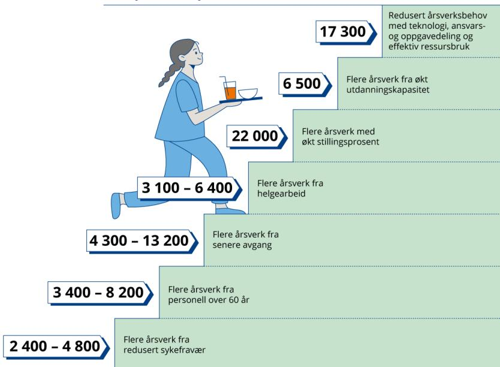
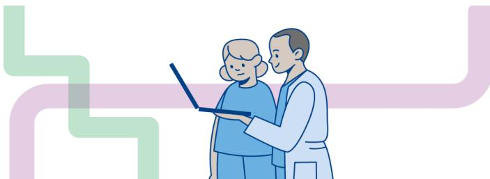
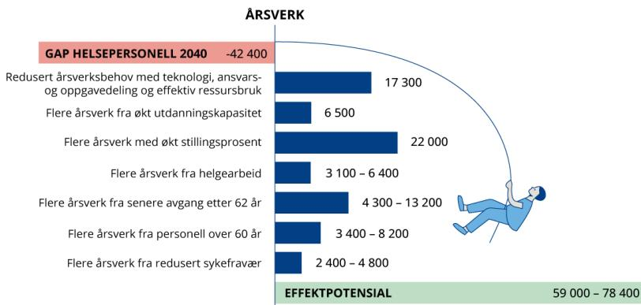
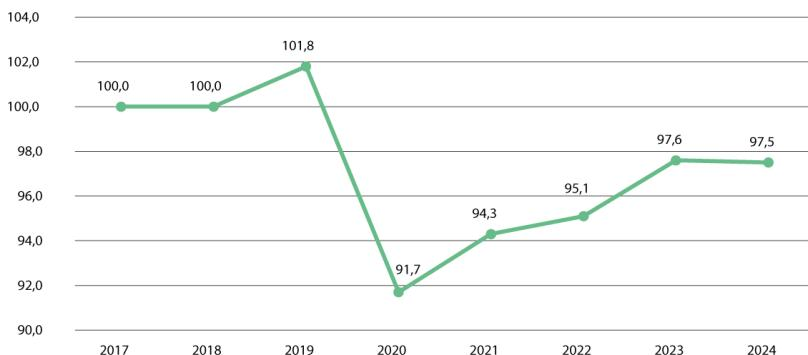
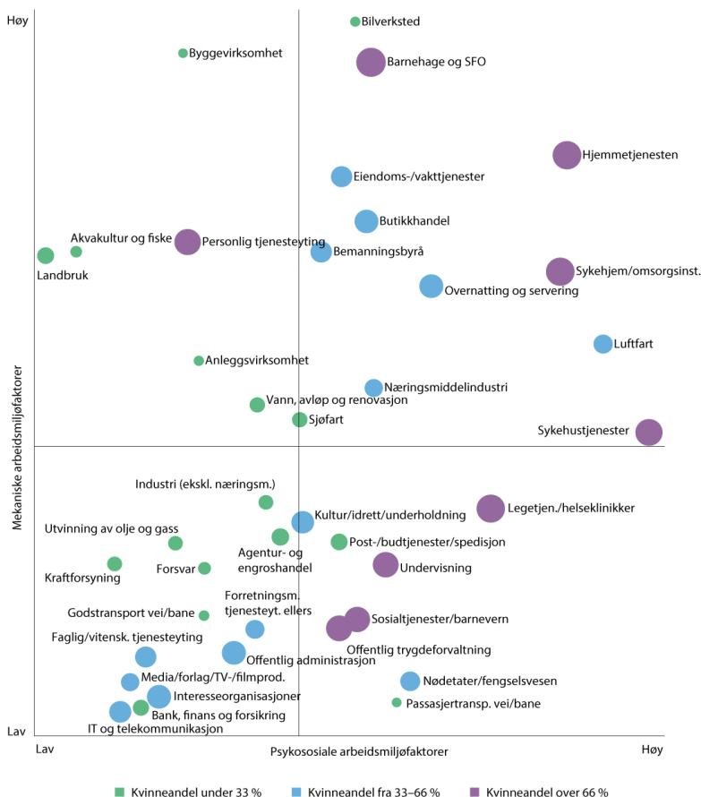
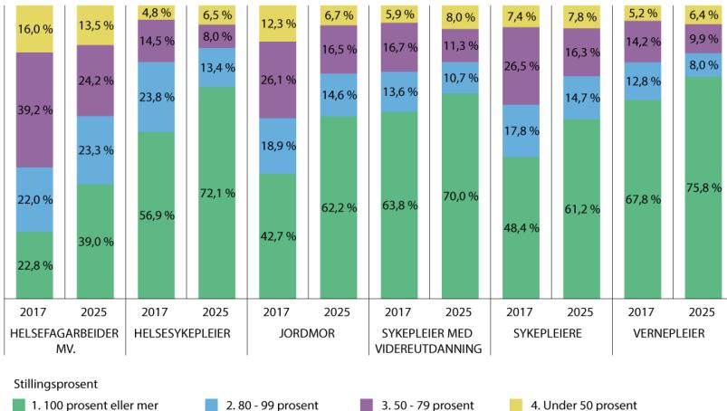
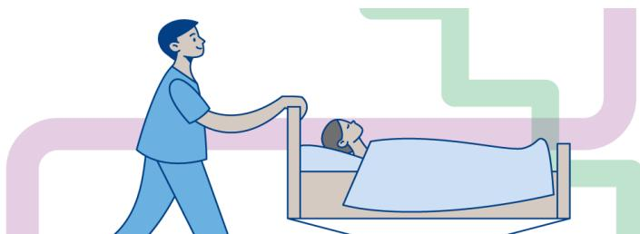

# Meld. St. 11

(2025–2026)

Melding til Stortinget

# Helsepersonellplan 2040

Helse- og omsorgsdepartementet

# Meld. St. 11

(2025–2026)

Melding til Stortinget

## Helsepersonellplan 2040

*Tilråding fra Helse- og omsorgsdepartementet 12. juni 2026,  
godkjent i statsråd samme dag.  
(Regjeringen Støre)*

## *Del I*

### *Formålet med Helsepersonellplan 2040*

## 1 Innledning

Illustrasjon av to helsepersonell i blå uniformer og masker som står ved en seng med en pasient. En stor, hvit, kuppelformet lampe henger over sengen. Bak dem er det en gul og rød båndform som strekker seg over hele bredden av bildet.

Figur 1.1

Helse- og omsorgstjenestene vil stå overfor en økende utfordring med mangel på tilstrekkelig arbeidskraft fram mot 2040. Utfordringsbildet varierer mellom ulike deler av landet, og i enkelte regioner er det allerede en betydelig ubalanse mellom etterspørsel etter og tilgang på arbeidskraft. Regjeringen vil gjennomføre en helsereform som sikrer helsetjenester i verdensklasse også i framtiden. Det er nedsatt et helsereformutvalg og inngått avtaler med KS om «Prosjekt X», som er lokale utprøvinger hvor de kommunale helse- og omsorgstjenestene og spesialisthelsetjenesten samarbeider på nye måter om å gi innbyggerne helse- og omsorgstjenester. Men uansett framtidig organisering vil helse- og omsorgstjenestene trenge tilstrekkelig med fagfolk. Helsepersonellplan 2040 danner derfor grunnlaget for reformarbeidet med tiltak for å rekruttere og beholde kompetanse, øke produktiviteten og bedre ressursutnyttelsen i helse- og omsorgstjenesten.

Befolkningsutviklingen har over tid vært kjennetegnet av vekst, i hovedsak som følge av innvandring. Andelen eldre i befolkningen øker, og i tillegg er det flere som lever lenger med sykdom, funksjonstap og andre helseutfordringer. Som vist i regjeringens Perspektivmelding, vil dette øke etterspørselen etter helse- og omsorgstjenester framover.1 På kort sikt vil lave fødselsrater føre til bedre tilgang på arbeidskraft, blant annet fordi foreldre jobber framfor å passe barn. Lave fødselstall vil påvirke tilgangen på arbeidskraft først på lang sikt (jf. boks 3.2 i *Perspektivmeldingen 2024*).

Norge ligger på toppen i Europa i ressursbruk til helse- og omsorgstjenestene. Vi har høyest andel sysselsatte og er blant landene som bruker mest av fellesskapets penger på disse tjenestene, relativt sett (NOU 2023: 4 *Tid for handling*).

Det er ikke realistisk å møte utfordringene i helse- og omsorgstjenestene gjennom økt bemanning alene, særlig fordi også andre viktige sektorer og virksomheter, både private og offentlige, har et betydelig behov for arbeidskraft.

Over 70 prosent av befolkningen i Norge i alderen 15 til 74 år er yrkesaktive, det vil si enten sysselsatte eller aktive arbeidssøkere. Yrkesdeltakelsen er blant den høyeste i Europa, noe som særlig skyldes høy yrkesdeltakelse blant unge og eldre, i tillegg til høy yrkesdeltakelse blant kvinner (Meld. St. 31 (2023–2024) *Perspektivmeldingen 2024*). Regjeringen har som mål at sysselsettingsandelen i Norge i 2030 skal være 82 prosent av befolkningen i alderen 20-64 år. I

1Meld. St. 31 (2023–2024) *Perspektivmeldingen 2024*.

2035 skal sysselsettingen øke til 83 prosent for samme aldersgruppe (Meld. St. 33 (2023–2024) *En forsterket arbeidslinje*). Det har vært en betydelig vekst i antall sysselsatte i helse- og omsorgstjenestene. Ifølge nasjonalregnskapet var om lag 630 000 personer sysselsatt innen helse- og omsorgstjenester i 2025. Andelen av alle sysselsatte i Norge som jobber i helse- og omsorgstjenestene, er tredoblet fra tidlig på 1970-tallet.

Helsepersonellplan 2040 skal sørge for at vi har tilstrekkelig arbeidskraft og kompetanse til å møte befolkningens behov som brukere, pasienter og pårørende fram mot 2040. Planen er innrettet etter to hovedspor for tiltak, som sammen må bidra til tilstrekkelig bemanning i helse- og omsorgstjenestene: tiltak for å øke tilbudet av arbeidskraft og tiltak for å redusere etterspørselen etter arbeidskraft. Tiltakene er personellnære og rettet mot faktorer som direkte kan øke tilbudet av arbeidskraft i tjenestene, og redusere behovet for årsverk i tjenestene.

Det gjøres allerede et omfattende arbeid i helse- og omsorgstjenestene for å beholde og rekruttere personell og for å møte de økende utfordringene knyttet til mangel på arbeidskraft. Mange steder er godt i gang med omstillingsprosesser som kan bidra til mer bærekraftig personellbruk, bedre ressursutnyttelse og mer hensiktsmessig organisering av tjenestene. Samtidig er det store variasjoner både i utfordringsbildet, i lokale forutsetninger og i hvor langt ulike virksomheter og kommuner har kommet i omstillingsarbeidet. Regjeringen legger derfor til grunn at det er behov for å øke omstillingstakten og styrke gjennomføringsevnen i hele tjenesten. Gjennom Helsepersonellplan 2040 legges det opp til en bred og forpliktende innsats for å utvikle mer bærekraftige tjenester. Tiltak for økt heltid, redusert sykefravær, mindre vikarbruk og innleie, bedre ledelse, mer systematisk kompetanseutvikling, hensiktsmessig ansvars- og oppgavedeling og økt bruk av digitale og teknologiske løsninger skal samlet bidra til at flere enheter løftes videre i sitt utviklingsarbeid. Målet er at gode løsninger og erfaringer i større grad skal tas i bruk bredt, slik at alle deler av tjenestene over tid settes bedre i stand til å møte framtidens behov med god kvalitet, forsvarlighet og bærekraft.

I denne planen legges det til grunn at nivået av pårørendeinnsats holdes konstant, og at ressursinnsatsen per bruker øker moderat.2 En økning i behovet for omsorgstjenester kan ikke overføres til pårørende. Det er imidlertid mye som tyder på at pårørenderessursen må vedlikeholdes, støttes og avlastes. Flere av tiltakene i Helsepersonellplan 2040 innrettes derfor slik at de også vil komme pårørende til gode.

### 1.1 Sammendrag

Helsepersonellplan 2040 skal møte utfordringen med mangel på arbeidskraft i helse- og omsorgstjenestene fram mot 2040. Planen bygger på framskrivinger og analyser som viser en tydelig og økende ubalanse mellom behovet for og tilgangen på arbeidskraft fram mot 2040. SSB anslår at underskuddet for helsepersonellgruppene i modellen øker fra om lag 9 900 årsverk i 2025 til 42 400 årsverk i 2040. Mangelen drives særlig av sykepleiere og helsefagarbeidere, som alene utgjør om lag 40 600 årsverk av det samlede underskuddet i 2040. Samtidig gir ikke dette tallet alene et fullstendig bilde av bemanningsutfordringen, fordi tjenestene også er avhengige av andre

---

2Dalen, H.M., Hjemås, G., Holmøy, E. og Jia, Z. (2026): Behov for og tilgang på arbeidskraft i offentlig helse og omsorg fremover. Rapporter 2026/18. Statistisk sentralbyrå.

personellgrupper som ikke inngår i modellen. Utviklingen de siste årene viser et skifte i bemanningssammensetningen med lavere andel sykepleiere og økt bruk av personell med annen helseutdanning, personell uten relevant helseutdanning og personell uten formell utdanning, særlig i hjemmetjenesten. Med dagens måte å bemanne tjenestene på, anslås behovet for andre grupper enn de modellerte helsepersonellgruppene, til 171 500 årsverk i 2040. Gitt at dagens nivå ligger på om lag 127 000, vil dette tilsvare en økning på 44 500 årsverk. Man kan ikke fastslå eventuelt udekket behov, fordi utviklingen i tilbudet for denne gruppen foreløpig ikke er framskrevet.

Planen bygger på to parallelle hovedspor. For det første skal tilbudet av arbeidskraft økes gjennom tiltak for bedre rekruttering, utdanning, flere lære- og praksisplasser, raskere godkjenning av yrkeskvalifikasjoner fra andre land, kompetanseutvikling, bedre arbeidsmiljø, styrket ledelse, redusert sykefravær, høyere stillingsandeler, mindre deltid og tiltak som gjør det mulig for flere å stå lenger i arbeid. For det andre skal behovet for arbeidskraft reduseres gjennom mer hensiktsmessig ansvars- og oppgavedeling, teamorganisering og økt bruk av teknologi, digitalisering og kunstig intelligens samt bedre ressursbruk og tydeligere prioritering. Målet er å utvikle smartere, mer bærekraftige og mer personelleffektive tjenester, samtidig som kvalitet og pasientsikkerhet ivaretas.

#### Dempe etterspørselen fram til 2040

| Tiltak                                                                                  | Årsverk (Reduksjon) |
|-----------------------------------------------------------------------------------------|---------------------|
| Redusert årsverksbehov med teknologi, ansvars- og oppgavedeling og effektiv ressursbruk | 17 300              |
| Flere årsverk fra økt utdanningskapasitet                                               | 6 500               |
| Flere årsverk med økt stillingsprosent                                                  | 22 000              |
| Flere årsverk fra helgearbeid                                                           | 3 100 – 6 400       |
| Flere årsverk fra senere avgang                                                         | 4 300 – 13 200      |
| Flere årsverk fra personell over 60 år                                                  | 3 400 – 8 200       |
| Flere årsverk fra redusert sykefravær                                                   | 2 400 – 4 800       |

Diagram showing a staircase of measures to reduce demand for healthcare personnel by 2040. A nurse carrying a tray is walking up the steps. Each step represents a measure and its potential reduction in years of work.

#### Øke tilbudet fram til 2040

Figur 1.2 Illustrasjon av potensiell effekt av tiltakene i Helsepersonellplan 2040

Figuren viser hvordan ulike tiltak i Helsepersonellplan 2040 kan bidra til å øke tilbudet av personell og samtidig dempe etterspørselen frem mot 2040. Tiltak på tilbudssiden inkluderer økt utdanningskapasitet, høyere stillingsprosent, økt helgearbeid, redusert sykefravær, senere avgang etter 62 år, og flere årsverk fra personell over 60 år. Etterspørselen kan reduseres gjennom teknologi, bedre ansvars- og oppgavedeling og mer effektiv ressursbruk. Samlet illustrerer figuren et betydelig potensial for å redusere bemanningsutfordringene.

Kilde: Helse- og omsorgsdepartementets framstilling, basert på analyser fra SSB, Helsedirektoratet og Spekter.

For å få fart på omstillingsarbeidet i de kommunale helse- og omsorgstjenestene etableres det et omstillingstilskudd til kommunene som skal bidra til bedre ressursutnyttelse, og til å rekruttere og beholde tilstrekkelig og kompetent personell i disse tjenestene. God ledelse er viktig for å lykkes med omstilling, og det er behov for felles lederprogrammer for kommunale helse- og omsorgstjenester og spesialisthelsetjenesten. Boligpolitiske tiltak kan også understøtte bedre botilbud til eldre og samlokalisering, som gjør det mer effektivt å levere gode tjenester. Videre kan innføring av lokale offentlige bemanningsenheter, som vikarpooler eller ordninger der personell brukes på tvers av tjenester eller enheter, bidra til større stabilitet, og mindre avhengighet av eksterne bemanningsløsninger.

Planen understreker at tiltakene er nødvendige, men ikke tilstrekkelige i seg selv. For å sikre en bærekraftig helse- og omsorgstjeneste på lengre sikt, må Helsepersonellplan 2040 ses i sammenheng med en bredere innsats for forebygging, folkehelse, bedre organisering og strukturelle endringer i tjenestene. Oppfølgingen av planen skal bygge på løpende kunnskapsutvikling, videreutvikling av framskrivingsgrunnlaget, evaluering av tiltak og systematisk oppfølging av måloppnåelse. Lønn er et forhold mellom partene, så planen går ikke inn på dette. Men i kunnskapsgrunnlaget framover er det viktig med felles tallgrunnlag for lønnsutvikling i de kommunale helse- og omsorgstjenestene og spesialisthelsetjenesten og gode tall for framskrevet behov av personell.

### 1.2 Kunnskapsgrunnlaget for planen

Helsepersonellplan 2040 bygger blant annet på NOU 2023: 4 *Tid for handling – Personellet i en bærekraftig helse- og omsorgstjeneste* og NOU 2026: 1 *En bærekraftig kommunesektor*. Meld. St. 31 (2023–2024) *Perspektivmeldingen 2024* beskriver en økende konkurranse om arbeidskraften i Norge i takt med at omsorgsoppgavene øker, uten at det blir flere i yrkesaktiv alder til å utføre dem.

Framskrivinger og analyser for planen er utarbeidet av Helsedirektoratet og Statistisk sentralbyrå (SSB) med innspill fra de regionale helseforetakene og KS. Tallgrunnlaget bygger hovedsakelig på SSBs simuleringsmodell for framtidig behov for helse- og omsorgspersonell (Helsemod). For spesialisthelsetjenesten er også Nasjonal bemanningsmodell (NBM) brukt som et supplerende kunnskapsgrunnlag i Helsedirektoratets analyser. NBM er en framskrivingsmodell for bemannings- og personellbehov i spesialisthelsetjenesten, utviklet av de regionale helseforetakene.3

---

3Nasjonal bemanningsmodell (NBM) er en modell som brukes for å analysere hvordan ulike utviklingstrekk og endrede forutsetninger kan påvirke framtidig behov for personell i sykehusene og i øvrige deler av spesialisthelsetjenesten. Som del av arbeidet med Helsepersonellplan 2040 har Helse Vest RHF gjennomført et eget innsiktsarbeid basert på data fra NBM for å synliggjøre mulige effekter av ulike modifiserende faktorer.

#### Boks 1.1 Hva er Helsemod?

Helsemod er SSBs verktøy for å framskrive og analysere tilbudet av helsepersonell og etterspørselen etter arbeidskraft i helse- og omsorgstjenesten. Modellen omfatter 14 autoriserte helsepersonellgrupper på tilbudssiden. Helsemod inkluderer følgende personellgrupper: bioingeniører, ergoterapeuter, fysioterapeuter, helsefagarbeidere (inkludert hjelpepleiere og omsorgsarbeidere), helsesekretærer (inkludert tannhelsesekretærer), helsesykepleiere, jordmødre, leger, psykologer, radiografer, sykepleiere, tannleger, tannpleiere og vernepleiere.

Tilbudsframskrivingene tar utgangspunkt i dagens omfang av de ulike personellgruppene, og framskriver utviklingen år for år basert på blant annet tilvekst fra utdanning og innvandring, samt avgang som følge av alder og andre forhold. Etterspørselsframskrivingene er basert på hvordan tjenestene brukes og bemannes i et valgt referanseår, kombinert med befolkningsframskrivinger. Framskrivingen bygger på befolkningsutviklingen i SSBs hovedalternativ (MMM-24), og 2024 brukes som utgangspunkt for nivået på tjenestebruken og ressursinnsatsen i tjenestene. I referansealternativet legges det også til grunn at helsetilstanden bedres over tid for personer over 55 år, at nivået av pårørendeinnsats holdes konstant, og at ressursinnsatsen per bruker øker moderat. Beregningene gjelder det offentlig finansierte tjenestetilbudet som inngår i det lovfestede sørge for-ansvaret. Rent private tjenester uten offentlig refusjon eller avtale inngår ikke.

Gap-analysen, som sammenligner de to framskrivingene, viser forskjellen mellom framskrevet behov for arbeidskraft og framskrevet tilbud av årsverk. Analysen gir et bilde av hvor det kan oppstå ubalanse i bemanningen, gitt forutsetningene som er lagt til grunn.

Det er samtidig viktig å være oppmerksom på modellens avgrensninger. Etterspørselen etter arbeidskraft i tjenestene omfatter flere grupper enn de 14 som inngår på tilbudssiden. Resultatene viser derfor ubalansen for de modellerte gruppene, og er ikke et fullstendig mål på den samlede bemanningsutfordringen i helse- og omsorgstjenesten. Dette er imidlertid viktige personellgrupper som det også er nødvendig å dekke behov for. Planen omfatter derfor også kvalifisering og tiltak rettet mot disse gruppene, og det forventes at både tiltak på tilbudssiden og etterspørselssiden vil ha positiv effekt for disse gruppene.

###### **[Boks slutt]**

Planen legger fram tallene for referansealternativet i SSBs rapport, som har like forutsetninger som for referansealternativet i rapporten fra 2023.4 5 Forutsetningene i referansealternativet om en friskere aldring og antakelser om standardvekst er samtidig usikre og kan innebære at behovene under- eller overestimeres. Hvis for eksempel standarden målt ved årsverk per bruker holdes fast, eller faller, i stedet for å øke moderat slik den gjør i referansealternativet, vil personellbehovet bli lavere i 2040.6 Det vil være en forventning og et ønske om et stadig bedre tilbud. Et viktig

---

4Dalen, H.M., Hjemås, G., Holmøy, E. og Jia, Z. (2026): Behov for og tilgang på arbeidskraft i offentlig helse og omsorg fremover. Rapporter 2026/18. Statistisk sentralbyrå.

5Jia, Z, Kornstad, T., Stølen, N. M. og Hjemås, G (2023): Arbeidsmarkedet for helsepersonell fram mot 2040. Rapporter2023/2, Statistisk sentralbyrå.

6Det vises til tabell 4.2a i Dalen, H.M., Hjemås, G., Holmøy, E. og Jia, Z. (2026), for fremskrevet etterspørsel etter helse- og omsorgsårsverk for flere scenarioer, herunder endrede antagelser om bedret helse, tjenestestandarder og familieomsorg.

spørsmål vil være hvorvidt vi vil prioritere en stadig økende standard og om denne forbedringen i tilbudet kan oppnås ved mer effektiv ressursbruk eller bedre utnyttelse av teknologi, uten at utgiftene eller bruken av arbeidskraft øker tilsvarende. I rapporten påpekes det at referansealternativet bør, og er ment å være, et godt kompromiss mellom hensynet til realisme og hensynet til transparens.

Det er likevel knyttet betydelig usikkerhet til tallgrunnlaget, både når det gjelder framskrivingene og anslagene på effektene av ulike tiltak. Framskrivingsmodellen bygger på forutsetninger som kan endre seg over tid, og effektestimatene må derfor tolkes med varsomhet. Effektene av enkeltstående tiltak kan ikke summeres direkte, ettersom de kan overlappe, forsterke eller motvirke hverandre. Samtidig er det viktig å vurdere tiltakene i planen i sammenheng, da de samlet sett kan bidra til et betydelig potensial for å bedre balansen mellom behov for og tilgang til personell i helse- og omsorgstjenestene. Tallene som presenteres er hovedsakelig nasjonale anslag, og det må påregnes geografiske variasjoner både i framskrivinger og i effektene av tiltakene.

I dette arbeidet er det også gjennomført bilaterale møter med partene i arbeidslivet, og andre relevante aktører. Flere av organisasjonene har i tillegg sendt skriftlige innspill med forslag til tiltak. Disse innspillene inngår som en del av grunnlaget for vurderingene i planen.

## 2 Bemanningsbehovet i vår felles helsetjeneste

Illustrasjonen viser en helsearbeider (en mann i hvit labkatt) og en eldre kvinne (pasient) som står sammen og ser på en laptop. Bak dem er det abstrakte, tykke linjer i grønne og lilla farger som strekker seg over hele bredden av bildet, noe som gir en følelse av sammenheng og struktur.

Illustrasjon av en helsearbeider og en pasient som ser på en laptop, med abstrakte grønne og lilla linjer i bakgrunnen.

Figur 2.1

Framskrivningene fra SSB viser at helse- og omsorgstjenestene vil få behov for betydelig mer arbeidskraft fram mot 2040. Samtidig øker tilbudet av helsepersonell langt langsommere enn behovet, og veksten er ulikt fordelt mellom personellgruppene. Resultatet er en økende ubalanse mellom behovet for personell og tilgangen på arbeidskraft. Denne ubalansen er særlig tydelig for sykepleiere og helsefagarbeidere, som er sentrale grupper både i den kommunale helse- og omsorgstjenesten og i spesialisthelsetjenesten.

Utfordringene er størst i de kommunale omsorgstjenestene. Her er veksten i behovet for arbeidskraft sterkest, og det er her endringene i bemanningssammensetningen er tydeligst. Samtidig viser utviklingen at tjenestene i økende grad bemannes av personellgrupper utenfor de tradisjonelle helsepersonellgruppene. Dette understreker at utfordringsbildet er bredere enn det som fanges opp i framskrivingene for de 14 autoriserte helsepersonellgruppene alene.

### 2.1 Behovet for personell i vår felles helsetjeneste øker inn mot 2040

SSB har framskrevet behovet for arbeidskraft i de offentlig finansierte helse- og omsorgstjenestene fram mot 2040. Framskrivingene viser en betydelig vekst i bemanningsbehovet. I referansealternativet øker etterspørselen etter årsverk fra 343 500 årsverk i 2024 til 461 500 årsverk i 2040.7 Samlet etterspørsel er beregnet til om lag 500 500 årsverk i 2040 når også behovet for årsverk i enkelte andre helsetjenester utenfor de offentlig finansierte tjenestene er inkludert. Av disse er 329 000 årsverk tilskrevet behov for årsverk fra de 14 modellerte gruppene.

Behovet for personell inkluderer videre 171 500 årsverk fra personell utover de 14 autoriserte gruppene som er inkludert i Helsemod, herunder andre helseutdanninger (estimert behov for 41 000 årsverk i 2040), personell uten relevant helseutdanning (estimert behov for 73 300 årsverk i 2040) og personell med annen utdanning i administrasjon og service (estimert behov for 57 200 årsverk i 2040).

Tabell 2.1 Nøkkel tall – etterspørsel etter årsverk

|                                                      | År   | Årsverk |
|------------------------------------------------------|------|---------|
| Etterspørsel (dagens nivå)                           | 2024 | 343 500 |
| Etterspørsel (referansealternativ)                   | 2040 | 461 500 |
| Samlet etterspørsel (inkl. øvrige tjenester)         | 2040 | 500 500 |
| – Herav 14 modellerte helsepersonellgrupper          | 2040 | 329 000 |
| – Herav personellbehov utover de modellerte gruppene | 2040 | 171 500 |

Kilde: SSB.

Framskrivingene beskriver en markert økning i andelen av sysselsatte i Norge som jobber i helse- og omsorgstjenestene, fra 12,9 prosent i 2024 til 17 prosent i 2040. I Meld. St. 9 (2023–2024) *Nasjonal helse- og samhandlingsplan* er det et uttalt mål at «...helse- og omsorgstjenestenes andel av samfunnets totale arbeidsstyrke ikke vil kunne fortsette å øke vesentlig». Det betyr at vi må lykkes med tiltak som enten reduserer etterspørselen etter årsverk og/eller øker tilbudet av arbeidskraft på måter som reduserer presset på omdisponering av personell (reallokering) i det totale arbeidsmarkedet.

7Tabell 4.6 i Dalen, H.M., Hjemås, G., Holmøy, E. og Jia, Z. (2026): Behov for og tilgang på arbeidskraft i offentlig helse og omsorg fremover. Rapporter 2026/18. Statistisk sentralbyrå.

Veksten i behovet for arbeidskraft er sterkest i de kommunale omsorgstjenestene.8 Særlig peker institusjonstjenestene seg ut, både for korttids- og langtidsopphold.9 Disse tjenestene påvirkes i stor grad av økningen i antall eldre, særlig personer over 80 år. Selv om andelen eldre som mottar institusjonstjenester har gått ned over tid, vil den samlede veksten i antall eldre likevel føre til økt behov for personell. Utviklingen må ses i sammenheng med at de kommunale helse- og omsorgstjenestene over tid har dreid ressursbruken mot mer bruk av hjemmetjenester, enten i den enkeltes hjem eller i samlokaliserte omsorgsboliger og bofellesskap med fast bemanning.10 Tiltakene i denne planen vil derfor også være viktige virkemidler for å oppnå målene i regjeringens Eldreloft, om tilstrekkelig bemanning, kvalitet og kompetanse i tjenestene og ivaretakelse av pårørende.

Etter institusjonstjenestene er det hjemmetjenestene og de somatiske spesialisthelsetjenestene som har sterkest vekst i bemanningsbehovet. Psykisk helsevern og rusbehandling har svakere vekst. Samlet peker framskrivingene dermed i retning av at presset blir størst i de kommunale omsorgstjenestene, særlig i institusjonsomsorgen og hjemmetjenestene.

| År   | Kommunal helse- og omsorgstjeneste | Spesialisthelsetjeneste | Totalt  |
|------|------------------------------------|-------------------------|---------|
| 2024 | 200 000                            | 140 000                 | 340 000 |
| 2025 | 205 000                            | 142 000                 | 347 000 |
| 2026 | 210 000                            | 144 000                 | 354 000 |
| 2027 | 215 000                            | 146 000                 | 361 000 |
| 2028 | 220 000                            | 148 000                 | 368 000 |
| 2029 | 225 000                            | 150 000                 | 375 000 |
| 2030 | 230 000                            | 152 000                 | 382 000 |
| 2031 | 235 000                            | 154 000                 | 389 000 |
| 2032 | 240 000                            | 156 000                 | 396 000 |
| 2033 | 245 000                            | 158 000                 | 403 000 |
| 2034 | 250 000                            | 160 000                 | 410 000 |
| 2035 | 255 000                            | 162 000                 | 417 000 |
| 2036 | 260 000                            | 164 000                 | 424 000 |
| 2037 | 265 000                            | 166 000                 | 431 000 |
| 2038 | 270 000                            | 168 000                 | 438 000 |
| 2039 | 275 000                            | 170 000                 | 445 000 |
| 2040 | 290 000                            | 170 000                 | 460 000 |

Line chart showing projected staffing needs from 2024 to 2040 for three categories: Kommunal helse- og omsorgstjeneste (green), Spesialisthelsetjeneste (blue), and Totalt (purple). All three lines show a steady upward trend. The 'Totalt' line starts at approximately 340,000 in 2024 and rises to about 460,000 in 2040. The 'Kommunal helse- og omsorgstjeneste' line starts at 200,000 and rises to 290,000. The 'Spesialisthelsetjeneste' line starts at 140,000 and rises to 170,000.

8Kommunale omsorgstjenester er den delen av kommunens helse- og omsorgstjenester som omfatter praktisk, personlig og sosialfaglig bistand og tilrettelegging, herunder tjenester i hjemmet og institusjon, med formål å støtte den enkeltes mestring, trygghet og mulighet til å leve og bo selvstendig.

9Institusjonstjenester inkluderer Kostra- funksjon 253 som er direkte brukerrettede oppgaver i forbindelse med helse- og omsorgstjenester i institusjon, jf. helse- og omsorgstjenesteloven § 3-2 første ledd nr. 6 bokstav c) og forskrift om kommunal helse- og omsorgsinstitusjon § 1 bokstavene a, c og d (institusjon med heldøgns helse- og omsorgstjenester for barn og unge under 18 år som bor utenfor foreldrehjemmet som følge av behov for tjenester (barnebolig), herunder avlastningsbolig, aldershjem og sykehjem).

10Hjemmetjenester inkluderer Kostra-funksjonene 257 og 258. Helse- og omsorgstjenester til brukere i eget hjem, bofellesskap eller samlokaliserte omsorgsboliger. Det omfatter: Helsetjenester i hjemmet, herunder sykepleie (hjemmesykepleie) og psykisk helse- og rusarbeid, praktisk bistand, herunder hjelp til daglige gjøremål, opplæring i daglige gjøremål, brukerstyrt personlig assistanse BPA, omsorgsstønad samt avlasting utenfor institusjon.

Figur 2.2 Utvikling i behov for årsverk i spesialist- og kommunale helse- og omsorgstjenesten (2024–2040)

Kilde: SSB.

### 2.2 Tilbudet av helsepersonell øker, men ikke nok

SSBs framskrivinger viser at tilbudet av helsepersonell vil øke fram mot 2040 innenfor de 14 gruppene som inngår i Helsemod. Framskrivingene bygger på forutsetninger om tilgang til nyutdannede, inn- og utvandring, aldersavgang, samt kjønns- og aldersspesifikk yrkesdeltaking.11

Det samlede tilbudet øker fra 251 000 årsverk i 2025 til 295 300 årsverk i 2040, som tilsvarer en vekst på om lag 18 prosent. Veksten er imidlertid ulik mellom yrkesgruppene. SSBs beregninger tar utgangspunkt i hvordan arbeidsstyrken ser ut i dag og legger til grunn at hovedmønstrene i arbeidsmarkedet videreføres framover. Framskrivingene viser sterkest vekst for psykologer og tannpleiere. Også for ergoterapeuter og leger ventes det en tydelig økning i tilbudet fram mot 2040. Samtidig viser framskrivingene langt svakere vekst for helsefagarbeidere og moderat tilbudsvekst for sykepleiere. Dette er særlig alvorlig fordi disse gruppene er sentrale både i den kommunale helse- og omsorgstjenesten og i spesialisthelsetjenesten. Gruppene utgjør en stor del av den samlede bemanningen, og svak vekst for disse gruppene får derfor stor betydning for utviklingen i tilgjengelig arbeidskraft.

At tilbudet øker, er dermed ikke tilstrekkelig for å møte utviklingen i behovet, og forsterker ubalansen mellom behov for og tilgang på personell. For gruppene utenfor de 14 helseutdanningene som inngår i Helsemod har vi ikke estimerer for utviklingen i tilbudet, men det antas å kunne oppstå et gap også her mellom tilbud og etterspørsel i 2040.

### 2.3 Gapet mellom tilbud og etterspørsel øker fram mot 2040

Når framskrivingene av behov og tilbud ses i sammenheng, viser de en tydelig og økende ubalanse. I referansebanen anslår SSB at det samlede underskuddet for de 14 helsepersonellgruppene (Boks 1.1. Hva er Helsemod?) øker fra om lag 9 900 årsverk i 2025 til om lag 42 400 årsverk i 2040.

Underskuddet drives i hovedsak av behovet for sykepleiere og helsefagarbeidere. Disse gruppene vil utgjøre om lag 40 600 årsverk av det samlede underskuddet på 42 400 årsverk i 2040. For helsefagarbeidere vil underskuddet vokse raskt fram mot 2040, mens sykepleiere også vil ha et stort og vedvarende underskudd gjennom hele perioden. Framskrivingene peker dermed tydelig mot at mangel på sykepleiere og helsefagarbeidere vil være den mest kritiske personellutfordringen i helse- og omsorgstjenestene framover, dersom tjenestene organiseres og bemannes omtrent som i dag. I tillegg vil det kunne bli mangel på fagfolk innen enkelte spesialiteter og spesialiserte utdanning samt andre utdanningsgrupper som for eksempel bioingeniører.

---

11Dalen, H.M., Hjemås, G., Holmøy, E. og Jia, Z. (2026): Behov for og tilgang på arbeidskraft i offentlig helse og omsorg fremover. Rapporter 2026/18. Statistisk sentralbyrå.

Tabell 2.2 Framskrevet ubalanse mellom tilbud og etterspørsel for 14 utdanningsgrupper i Helsemod. Negative tall indikerer underskudd og positive tall indikerer overskudd.1

| Utdanningsgruppe                        | 2025   | 2030    | 2035    | 2040    |
|-----------------------------------------|--------|---------|---------|---------|
| Sykepleier                              | -4 000 | -8 400  | -11 100 | -14 700 |
| Helsefagarbeider                        | -4 200 | -13 200 | -19 200 | -25 900 |
| Vernepleier                             | -600   | -1 000  | -1 400  | -2 100  |
| Helsesekretær (inkl. tannhelsesekretær) | 0      | -700    | -1 400  | -2 100  |
| Bioingeniør                             | -200   | -400    | -600    | -800    |
| Jordmor                                 | -200   | -400    | -600    | -700    |
| Radiograf                               | 0      | -100    | -200    | -200    |
| Tannlege                                | 0      | -100    | -100    | -100    |
| Helsesykepleier                         | 100    | 200     | 200     | 0       |
| Fysioterapeut                           | 500    | 200     | 100     | -200    |
| Ergoterapeut                            | 100    | 200     | 300     | 300     |
| Psykologer                              | -400   | 300     | 1 000   | 1 600   |
| Tannpleier                              | 0      | 100     | 200     | 300     |
| Lege                                    | -900   | 0       | 1 300   | 2 300   |
| Sum                                     | -9 900 | -23 200 | -31 400 | -42 400 |

1 Tallene for gap mellom tilbud og etterspørsel er beregnet på grunnlag av referansebanens forutsetninger og må tolkes med varsomhet. Størrelsen på gapet avhenger blant annet av forutsetninger om kompetansesammensetningen i tjenestene, herunder hvordan arbeidskraftbehovet fordeles mellom utdanningsgrupper. I SSBs analyse bygger denne fordelingen på observerte sysselsettingsandeler i basisåret 2024 og forutsettes å være uendret over tid. Endringer i ansvars- og oppgavedeling, kompetansemiks, organisering, teknologi og øvrige forutsetninger kan derfor gi andre anslag på gapet.

Kilde: SSB.

#### **Boks 2.1 Fra 70 000 til 42 000 årsverk? Nye framskrivinger av gapet**

Helsepersonellkommisjonen baserte sin rapport på framskrivinger fra SSB i januar 2023, der 2019-data ble brukt som grunnlag. Disse framskrivingene ga som resultat at det ville bli et gap mellom tilbud og etterspørsel på 70 000 årsverk av de 14 helsepersonellgruppene i Helsemod mot 2040. I forbindelse med arbeidet med Helsepersonellplan 2040 har SSB utarbeidet nye framskrivinger, med 2024-data som grunnlag. Totalt har størrelsen på gapet mellom tilbud og etterspørsel etter de 14 helsepersonellgruppene i Helsemod gått ned fra 70 000 årsverk presentert i Helsepersonellkommisjonenes rapport, til 42 000 årsverk i siste versjon. Det kan ha vært endringer i bruk av type tjenester samt at befolkningsframskrivingene fra SSB er oppdatert. Mellom 2019 og 2024 har det i tillegg vært noe endring i sammensetningen av personellgruppene som jobber i helse- og omsorgstjenestene, blant annet på grunn av ansvars- og oppgavedeling. De nye framskrivingene tar utgangspunkt i sammensetningen av personell i 2024, og endringene har til sammen hatt stor innflytelse på resultatet man får for 2040.

###### **[Boks slutt]**

Det er viktig å understreke at dette alene ikke gir et fullstendig bilde av den framtidige bemanningsutfordringen. Gap-analysen omfatter bare de 14 gruppene som inngår på tilbudssiden i Helsemod. Tjenestene bemannes også av andre helsefagutdannede, personell i pasient- og brukerrettet arbeid utenfor disse gruppene og personell i administrasjon og servicefunksjoner. Det reelle bemanningspresset i tjenestene vil derfor være større enn underskuddet på 42 400 årsverk som framkommer i gap-analysen alene. Behovet for personell utover de 14 autoriserte gruppene, utgjør totalt 171 500 årsverk i 2040. Helsemod er ikke lagt opp til å kunne beregne hvor mange som vil være tilgjengelige i disse gruppene framover. Modellen viser bare hvor stort behov det kan bli. Derfor kan den ikke brukes til å sammenligne behov og tilgang for disse gruppene, og vi kan heller ikke si sikkert om det vil bli mangel eller om det vil være nok personell til å dekke dette behovet.

Det kan likevel antas at det frem til 2040 vil kunne oppstå et gap mellom tilbud og etterspørsel også for personell utover de 14 modellerte gruppene. For å kunne vurdere i hvilken grad den resterende etterspørselen representerer en faktisk mangel, må modellen utvikles videre ved å inkludere flere personellgrupper slik at også disse kan framskrives. Utvikling av Helsemod bør knyttes til framskriving av behov, for eksempel i form av en personellmonitor for helse og omsorg, som blir et viktig grunnlag for Kunnskapsdepartementets kompetansebudsjett (se kap. 5.6 og 10.1.4 for nærmere beskrivelse). Imidlertid vil mange av tiltakene i planen også forbedre arbeidsforholdene for andre helsefagutdannede, personell i pasient- og brukerrettet arbeid utenfor gruppene i Helsemod og personell i administrasjon og servicefunksjoner. Blant annet er det nødvendig med kompetanseutvikling for personell uten formelle kvalifikasjoner.

SSBs gjennomgang av bemanningsutviklingen viser at sammensetningen av arbeidskraft i helse- og omsorgstjenestene har endret seg de siste årene. Fram til og med 2019 var utviklingen relativt stabil, og tidligere framskrivinger kunne i stor grad bygge på et mønster med gradvis økning i andelen høyt utdannet personell. De nyeste dataene, som går fram til 2024, viser derimot et tydelig skifte etter 2019/2020. Andelen sykepleiere falt i flere tjenestekområder, samtidig som andelen personell i pasient- og brukerrettet arbeid utenfor de 14 gruppene i modellen økte.

Endringene kommer særlig tydelig fram når en ser på de store tjenesteområdene i kommunale omsorgstjenester – hjemmetjenester, institusjonstjenester (langtid og korttid) samt dagaktivitetstilbud – og somatiske spesialisthelsetjenester (inkl. ambulansetjenester).

Skiftet i hjemmetjenesten er mest markant, og dette er også tjenesteområdet med sterkest vekst i årsverk i perioden. Samtidig økte andelen personell som ikke inngår i modellens 14 utdanningsgrupper. Sykepleierandelen gikk ned og helsefagarbeidere utgjorde en noe mindre andel over tid. Hovedbildet i hjemmetjenesten er dermed at veksten i bemanningen i økende grad skjedde i grupper utenfor de sentrale utdanningsgruppene.

I institusjonsomsorgen var utviklingen annerledes med helsefagarbeidere som den største gruppen, og den var stabil. Sykepleierandelen økte fram til 2019, men falt deretter jevnt. Samtidig økte andelen personell som ikke tilhører en av de 14 utdanningsgruppene, særlig etter 2022.

I somatikk og ambulanse, som omfatter somatiske sykehus, ambulansetjenester og medisinske laboratorier, var sykepleiere den største gruppen. Andelen steg til et toppunkt i 2022, men falt deretter i 2024, til omtrent samme nivå som ved starten av perioden. For leger ser man derimot en tydelig og jevn vekst, både i antall og andel. Blant helsefagarbeiderne var det et tydelig skifte i utviklingen i perioden: Etter en nedgang fram til 2019 økte både antall og andel igjen mot 2024. Dette faller sammen med prioriterte politiske innsatsområder i perioden.

SSB understreker at årsakene til skiftet i bemanningssammensetningen ikke er entydig. Endringene kan blant annet henge sammen med satsinger på strukturert og hensiktsmessig ansvars- og oppgavedeling og organisering, teknologiske og organisatoriske endringer, rekrutteringsutfordringer for enkelte grupper og ettervirkninger av koronapandemien. SSB peker samtidig på at det fremdeles er kort tid siden det observerte skiftet startet, og at det derfor er usikkert om dette er et midlertidig avvik eller en mer varig strukturell trend. Uansett har utviklingen direkte betydning for framskrivingene, fordi beregningene av framtidig behov bygger på hvordan tjenestene faktisk bemannes i utgangspunktet. Når bemanningssammensetningen endrer seg, påvirker det også hvordan framtidens behov fordeler seg mellom yrkesgruppene.

| Kategori                     | Antall  |
|------------------------------|---------|
| TOTAL ETTERSPØRSEL PERSONELL | 500 500 |
| ETTERSPØRSEL HELSEPERSONELL  | 329 000 |
| TILBUD HELSEPERSONELL        | 295 300 |
| GAP (ETTERSPØRSEL - TILBUD)  | 42 400* |
| ETTERSPØRSEL ANNET PERSONELL | 171 500 |

Stacked area chart showing projected personnel needs for 2040. The chart is divided into three main sections: 'TOTAL ETTERSPØRSEL PERSONELL' (500 500), 'ETTERSPØRSEL HELSEPERSONELL' (329 000), and 'TILBUD HELSEPERSONELL' (295 300). The difference between 'ETTERSPØRSEL HELSEPERSONELL' and 'TILBUD HELSEPERSONELL' is labeled 'GAP 42 400\*'. A separate section shows 'ETTERSPØRSEL ANNET PERSONELL' (171 500) with a note 'Ukjent tilbud og gap'.

###### Figur 2.3 Nøkkeltall for tilbud, etterspørsel og mangel for helsepersonell samt annen personellbehov i 2040.

Etterspørselen vil øke fra 343 500 årsverk i 2024 til 500 500 i 2040. Herav utgjør de 14 modellerte helsepersonellgruppene 329 000 årsverk i 2040, mens 171 500 årsverk gjelder øvrig personellbehov utover de modellerte gruppene. Tilbudet for de 14 modellerte gruppene øker fra 251 000 årsverk i 2025 til 295 300 årsverk i 2040.6 Det framskrevne gapet på om lag 42 400 årsverk gjelder underskuddet mellom etterspørsel og tilbud for de 14 modellerte gruppene, inkludert et allerede eksisterende underskudd på 2024-nivå på 8 600 årsverk. For øvrig personellbehov er det ikke beregnet en tilbudskurve, og det er derfor ikke grunnlag for en samlet gapanalyse for disse gruppene. Imidlertid er det ventet at tiltakene i denne planen også vil være relevante for å dekke et eventuelt gap også her. Det foreslås også å utarbeide tallgrunnlag også her, for slik å få en bedre total framskrivning.

Kilde: SSB.

##### 2.3.1 Personell med annen utdanning og personell uten relevant helseutdanning

Bemanningen i helse- og omsorgstjenestene omfatter langt flere grupper enn de 14 autoriserte helsepersonellgruppene som inngår i Helsemod. Dette gjelder både personell med annen helse- og sosialfaglig utdanning, personell med høyere utdanning eller yrkeskompetanse i andre fagfelt samt personell uten yrkeskompetanse eller utdanning. SSBs framskrivninger av etterspørselen av personell utenom de 14 gruppene i Helsemod er inndelt i tre kategorier etter hvilket yrke de har: personer med annen helseutdanning i pasient- og brukerrettet arbeid, personer uten relevant helseutdanning i pasient- og brukerrettet arbeid eller personer med annen utdanning i administrasjon, service- og støttefunksjoner.

Med videreføring av dagens bemanningssammensetning kommer det i 2040 til å være behov for 171 500 årsverk fra disse gruppene (av totalt 500 500 årsverk). Dette inkluderer 41 000 årsverk fra personell med andre helseutdanninger, 57 200 årsverk i administrasjon og service og 73 300 årsverk fra personell uten relevant helseutdanning. Tabell 2.3 viser framskrevet endring for disse gruppene fra 2024-nivå til 2040.

Tabell 2.3 Forventet endring i årsverksbehov fordelt på utdanningsgrupper fra 2024 til 2040. 2040-framskriving basert på referansealternativet i SSBs rapport.

| Årsverk                                     | 2024    | 2040    |
|---------------------------------------------|---------|---------|
| Annen helseutdanning                        | 30 734  | 41 000  |
| Annen utdanning i administrasjon og service | 43 870  | 57 200  |
| Uten relevant helseutdanning                | 52 442  | 73 300  |
| Totalt                                      | 127 046 | 171 500 |

Kilde: SSB.

Tabell 2.4 Årsverk med annen helseutdanning og uten relevant helseutdanning i pasient- og brukerrettede oppgaver i utvalgte tjenester i 2024. Antall årsverk og andel årsverk for tjenesteområdet.

| Tjenesteområde                                            | Annen helseutdanning | Personell uten relevant helseutdanning |
|-----------------------------------------------------------|----------------------|----------------------------------------|
| Institusjon                                               | 4 249 (6,6 prosent)  | 12 207 (19 prosent)                    |
| Hjemmetjenesten                                           | 9 607 (10,4 prosent) | 26 075 (28,2 prosent)                  |
| Somatikk i spesialisthelsetjenesten og ambulansetjenesten | 6 352 (6,1 prosent)  | 3 147 (3 prosent)                      |

Kilde: SSB.

Tabell 2.4 viser videre at en betydelig del av den pasient- og brukerrettede bemanningen i både kommunal omsorgstjeneste og somatikk- og ambulansetjeneste ligger utenfor de tradisjonelle helsepersonellgruppene. Dette gjelder både personell med annen helseutdanning og personell uten relevant helseutdanning. Omfanget er særlig stort i hjemmetjenesten. Dette illustrerer at bemanningen i tjenestene er sammensatt, og at personell med annen helsefaglig utdanning og personell uten fagutdanning i dag utgjør en stor del av årsverkene. Det er derfor nødvendig med tiltak for å rekruttere, kvalifisere og beholde disse gruppene, og planen har særlige tiltak for dem. I videreutviklingen av Helsemod skal flere personellgrupper inkluderes. De endrede framskrivingene viser hvilken betydning andre profesjoner, som for eksempel sosialfaglig kompetanse, har fått i sektoren.

Det store behovet for årsverk i administrasjon og service (tabell 2.3) må dekkes for å bruke riktig fagkompetanse på slike oppgaver og for at helsepersonell prioriterer helsefaglige oppgaver. Et betydelig behov for personell uten relevant helseutdanning viser at det er mange oppgaver, særlig i omsorgstjenestene, der det må rekrutteres utenfor helseprofesjonene. Også dette vil gi helsepersonell tid til helsefaglige oppgaver. Her vil det også være mulig å gi grupper som i dag står utenfor arbeid og utdanning, en mulighet til å bidra i vår felles helsetjeneste.

### 2.4 Hvor blir presset størst?

Framskrivingene i denne meldingen viser at vår felles helsetjeneste står overfor en økende ubalanse mellom behovet for personell og tilgangen på arbeidskraft fram mot 2040. Et tilsvarende bilde tegnes i Perspektivmeldingen 2024 og Nasjonalbudsjettet 2026, selv om anslagene nå er mer positive. De største utfordringene vil komme i de kommunale omsorgstjenestene, særlig i institusjonsomsorg og hjemmetjenester. Dette er tjenesteområder som både har sterk vekst i behovet for tjenester og samtidig er sårbare for mangel på sentrale personellgrupper. Kommunene skal både håndtere sterk vekst i behovet, gjennomføre nødvendige omstillinger og samtidig opprettholde et forsvarlig og godt tjenestetilbud til alle brukere, uavhengig av alder eller diagnose. Dette gjelder ikke minst i distriktskommuner, som ofte har mindre tilgang på arbeidskraft og større sårbarhet i bemanningen.

Også spesialisthelsetjenesten vil møte økt press. Samlet sett framstår imidlertid utfordringene der som mindre drevet av volumvekst enn i kommunene, og i større grad knyttet til knapphet på nøkkelpersonell, endringer i bemanningssammensetningen og behov for mer effektiv organisering.

Det blir særlig knapphet på sykepleiere og helsefagarbeidere fram mot 2040. Disse to gruppene står for nesten hele det framskrevne underskuddet i helse- og omsorgstjenestene. Utviklingen drives av en aldrende befolkning som gir sterk vekst i etterspørselen etter kommunale omsorgstjenester. Veksten i tilbudet er imidlertid ikke like stor. Til tross for et relativt høyt tilbud i absolutte tall, øker altså etterspørselen raskere.

Andelen sykepleiere har gått ned i flere tjenester etter 2019/2020. Samtidig viser utviklingen i bemanningssammensetningen at tjenestene allerede i økende grad bemannes av andre grupper enn de tradisjonelle helsepersonellgruppene, inkludert personell med annen utdanning og personell uten relevant helseutdanning. Særlig i hjemmetjenesten har bemanningsveksten i større grad kommet i disse gruppene enn blant sykepleiere og helsefagarbeidere.

Samlet peker dette mot et utfordringsbilde som er bredere enn mangel på enkeltgrupper alene. Det handler både om å sikre tilstrekkelig tilgang på nøkkelpersonell, rekruttere og beholde et bredt personellgrunnlag og organisere og lede tjenestene slik at tilgjengelig kompetanse brukes best mulig, og at ansatte blir værende i tjenesten. For mange kommuner, særlig for små kommuner og distriktskommuner, vil dette være en av de mest krevende styrings- og utviklingsutfordringene i årene framover.

Kommunekommisjonen viser i sin gjennomgang, at veksten i arbeidsstyrken i de minst sentrale kommunene (sentralitetsnivå 4, 5 og 6) vil være klart lavere enn den forventede veksten i behovet (se figur 2.4). Fram mot 2040 vil mange mindre sentrale kommuner få store utfordringer med å dekke arbeidskraftbehovet, særlig i omsorgssektoren. Dette kan gjøre det nødvendig med en forskyving av arbeidskraft fra andre næringer og sektorer til den kommunale omsorgssektoren. Et alternativ er å rekruttere flere av de som i dag står utenfor utdanning og arbeid inn i sektoren, og planen har forslag for det.

I de mest sentrale kommunene vil veksten i arbeidsstyrken i en periode framover gi rom for økt sysselsetting også i andre næringer, men mot slutten av perioden fram mot 2040 ventes det også her større utfordringer når veksten i arbeidsstyrken avtar.

| Sentralitet   | Behov for arbeidskraft innen omsorgstjenester | Arbeidsstyrken |
|---------------|-----------------------------------------------|----------------|
| sentralitet 1 | ~650                                          | ~2400          |
| sentralitet 2 | ~1150                                         | ~2300          |
| sentralitet 3 | ~1150                                         | ~1500          |
| sentralitet 4 | ~600                                          | ~-600          |
| sentralitet 5 | ~400                                          | ~-1000         |
| sentralitet 6 | ~200                                          | ~-300          |

A combined bar and scatter plot showing the need for labor in municipal care services and labor strength development across six centralities. The y-axis ranges from -1500 to 3000. Green bars represent the need for labor, and blue dots represent labor strength development. The data shows a general downward trend in both metrics from sentralitet 1 to sentralitet 6.

Figur 2.4 Behov for arbeidskraft innen kommunale omsorgstjenester og utvikling i arbeidsstyrken samlet. Årlig gjennomsnittlig endring i antall personer i perioden 2026–2040.

Kilde: NOU 2026: 1 *En bærekraftig kommunesektor*.

Telemarksforskning har gjennomført en helhetlig kartlegging av arbeidskraftsbehovet i kommunesektoren, hvordan dette utvikler seg over tid og mellom ulike deler av landet, og hvilke konsekvenser det kan få for kommunenes oppgaver og roller.12 Rapporten viser at distriktskommuner står overfor en betydelig og varig mangel på arbeidskraft i årene framover. I de 108 minst sentrale kommunene (sentralitetsklasse 6) ventes antallet sysselsatte å falle med 26 prosent, og i 12 av disse kommunene ventes antallet sysselsatte å bli halvert (se figur 2.5).

Rapporten viser videre at flere kommuner vil få behov for langt flere arbeidstakere enn det som er tilgjengelig lokalt, og at muligheten for å kompensere gjennom innpendling er begrenset. Dette kan få alvorlige konsekvenser for kommunenes evne til å levere tjenester, særlig innen helse- og omsorgssektoren, og flere kommuner risikerer å ikke kunne opprettholde lovpålagte tjenester uten omfattende strukturelle tiltak. Mangel på arbeidskraft i distriktene kan føre til at næringslivet krymper, noe som på lengre sikt vil underminere grunnlaget for bosetting i distriktene.

Telemarksforskning benytter egne befolkningsframskrivinger, som anslår at befolkningsnedgangen i distriktskommuner vil fortsette i større grad enn det SSB legger til grunn. Rapporten viser også til flere distriktskommuner som får en «urimelig og brå positiv endring i nettoinnflyttingen i SSBs framskrivinger etter 2020». Befolkningstall per 1. januar 2026 viser at befolkningsveksten ble lavere enn SSB anslo i 2024, og avvikene er størst i de minst sentrale kommunene.

12Vareide, K., Brandtzæg, B., Storm, H. og Westeren, I. (2025): Mangel på arbeidskraft i kommunene. Hvordan arbeidskraftbehovet er ventet å utvikle seg fram mot 2050 og hvilke konsekvenser dette får for kommunene. Rapport utarbeidet av Telemarksforskning på oppdrag fra Kommunal- og distriktsdepartementet, nr. 924.

Det er dermed grunn til å tro at situasjonen vil bli enda mer krevende for de minst sentrale kommunene enn det bildet Kommunekommisjonen presenterte i sin rapport. SSB skal publisere nye framskrivinger i juni 2026.

The figure is a stacked bar chart with a line graph overlay, showing employment and job vacancies by sector from 2000 to 2050. The y-axis represents the number of people, ranging from 0 to 120,000 in increments of 20,000. The x-axis shows years from 2000 to 2050 in two-year increments. The bars are stacked with three sectors: 'Fylke og stat' (green, bottom), 'Kommune' (blue, middle), and 'Privat' (purple, top). A yellow line represents the total number of employed ('Sysselsatte'). The total employment starts at approximately 110,000 in 2000, fluctuates slightly, and then shows a steady decline, reaching approximately 80,000 by 2050. The 'Privat' sector is the largest employer throughout the period, followed by 'Kommune' and 'Fylke og stat'.

| År   | Fylke og stat | Kommune | Privat  | Sysselsatte |
|------|---------------|---------|---------|-------------|
| 2000 | ~5,000        | ~30,000 | ~75,000 | ~110,000    |
| 2002 | ~5,000        | ~30,000 | ~65,000 | ~100,000    |
| 2004 | ~5,000        | ~30,000 | ~60,000 | ~95,000     |
| 2006 | ~5,000        | ~30,000 | ~65,000 | ~100,000    |
| 2008 | ~5,000        | ~30,000 | ~70,000 | ~105,000    |
| 2010 | ~5,000        | ~30,000 | ~65,000 | ~100,000    |
| 2012 | ~5,000        | ~30,000 | ~65,000 | ~100,000    |
| 2014 | ~5,000        | ~30,000 | ~65,000 | ~100,000    |
| 2016 | ~5,000        | ~30,000 | ~60,000 | ~95,000     |
| 2018 | ~5,000        | ~30,000 | ~60,000 | ~95,000     |
| 2020 | ~5,000        | ~30,000 | ~60,000 | ~95,000     |
| 2022 | ~5,000        | ~30,000 | ~60,000 | ~95,000     |
| 2024 | ~5,000        | ~30,000 | ~60,000 | ~95,000     |
| 2026 | ~5,000        | ~30,000 | ~60,000 | ~95,000     |
| 2028 | ~5,000        | ~30,000 | ~60,000 | ~95,000     |
| 2030 | ~5,000        | ~30,000 | ~60,000 | ~95,000     |
| 2032 | ~5,000        | ~30,000 | ~60,000 | ~95,000     |
| 2034 | ~5,000        | ~30,000 | ~60,000 | ~95,000     |
| 2036 | ~5,000        | ~30,000 | ~60,000 | ~95,000     |
| 2038 | ~5,000        | ~30,000 | ~60,000 | ~95,000     |
| 2040 | ~5,000        | ~30,000 | ~60,000 | ~95,000     |
| 2042 | ~5,000        | ~30,000 | ~60,000 | ~95,000     |
| 2044 | ~5,000        | ~30,000 | ~60,000 | ~95,000     |
| 2046 | ~5,000        | ~30,000 | ~60,000 | ~95,000     |
| 2048 | ~5,000        | ~30,000 | ~60,000 | ~95,000     |
| 2050 | ~5,000        | ~30,000 | ~45,000 | ~80,000     |

Stacked bar chart showing employment and job vacancies by sector from 2000 to 2050. The chart shows a steady decline in total employment from approximately 110,000 in 2000 to 80,000 in 2050. The sectors are Fylke og stat (green), Kommune (blue), and Privat (purple). A yellow line represents the total number of employed (Sysselsatte).

Figur 2.5 Antall sysselsatte og antall arbeidsplasser i ulike sektorer i sentralitetsklasse 6. Middelalternativet.

Kilde: Vareide, K., Brandtzæg, B., Storm, H. og Westeren, I. (2025).

## *Del II* *Tiltakene i Helsepersonellplan 2040*

### 3 Hvordan lukker vi gapet?

Illustrasjon av en helsepersonell som holder et brett med en kopp og en skål, stående mellom to store, stiliserte bokstaver 'H' i grønn og oransje farger.

Figur 3.1

### 3.1 Hovedtiltakene i Helsepersonellplan 2040

Helsepersonellplan 2040 skal bidra til at vår felles helsetjeneste har tilgang på tilstrekkelig arbeidskraft og riktig kompetanse fram mot 2040. Planen legger opp til bred innsats for å øke tilbudet av arbeidskraft, redusere behovet for arbeidskraft og styrke kunnskapsgrunnlaget for videre politikkutvikling og prioritering.

| Tiltak                                                                                  | ÅRSVERK                |
|-----------------------------------------------------------------------------------------|------------------------|
| <b>GAP HELSEPERSONELL 2040</b>                                                          | <b>-42 400</b>         |
| Redusert årsverksbehov med teknologi, ansvars- og oppgavedeling og effektiv ressursbruk | 17 300                 |
| Flere årsverk fra økt utdanningskapasitet                                               | 6 500                  |
| Flere årsverk med økt stillingsprosent                                                  | 22 000                 |
| Flere årsverk fra helgearbeid                                                           | 3 100 – 6 400          |
| Flere årsverk fra senere avgang etter 62 år                                             | 4 300 – 13 200         |
| Flere årsverk fra personell over 60 år                                                  | 3 400 – 8 200          |
| Flere årsverk fra redusert sykefravær                                                   | 2 400 – 4 800          |
| <b>EFFEKTPOTENSIAL</b>                                                                  | <b>59 000 – 78 400</b> |

Bar chart showing the potential reduction in the 2040 personnel gap through various measures. The total gap is -42 400 years of work, and the total potential effect is 59 000 - 78 400 years of work.

Figur 3.2 Samlet effektpotensial av tiltak for å redusere personellgapet.

Figuren viser hvordan ulike tiltak samlet kan bidra til å redusere det anslåtte personellgapet i 2040. Tiltakene inkluderer blant annet redusert sykefravær, økt yrkesdeltakelse blant eldre, senere avgang, høyere stillingsprosent, årsverk fra helgearbeid og økt utdanningskapasitet. I tillegg vises effekten av tiltak som reduserer behovet for årsverk, som teknologi, oppgavedeling og mer effektiv ressursbruk. Samlet effektpotensial er beregnet som summen av minimums- og maksimumsscenarioer der tiltakene har ulike effektintervaller.

Kilde: Helse- og omsorgsdepartementets framstilling, basert på analyser fra SSB, Helsedirektoratet og Spekter.

Framskrivningene viser at helse- og omsorgstjenestene står overfor en betydelig og økende mangel på arbeidskraft fram mot 2040. Utfordringene er fortsatt store, men sammensetningen av

bemanningen har endret seg de senere årene, og utfordringene framstår derfor noe annerledes enn tidligere antatt.

Å planlegge for å kunne øke utdanningskapasiteten der det er mulig og ønskelig, samt andre tiltak for å øke kandidatproduksjonen vil være viktig, men vil ikke være tilstrekkelig til å dekke det framtidige behovet alene. Helse- og sosialfagutdanningen utgjør en høy andel av de som tas opp til høyere utdanning hvert år, og de siste to årene har det vært en markant vekst. Når det gjelder arbeidsinnvandring, vil personell som er utdannet i utlandet fortsatt være en viktig del av arbeidsstyrken. Samtidig er det usikkert i hvilken grad Norge kan basere seg på økt tilflytting. Det er både etiske og praktiske rammer for hvor langt dette kan være en hovedstrategi.13 Innvandrere skal også ha tilgang på offentlige tjenester, infrastruktur og bolig, og de vil bidra til økt etterspørsel etter varer og tjenester. Økt innvandring vil dermed i begrenset grad lette på utfordringen med mangel på arbeidskraft.14

Dette er bakgrunnen for at Helsepersonellplan 2040 er basert på to parallelle hovedspor: tiltak for å øke tilbudet av arbeidskraft og tiltak for å redusere behovet for arbeidskraft (se figur 3.2). De to sporene må virke sammen. Dersom innsatsen bare rettes mot tilbudssiden, vil ikke veksten i personellbehovet kunne håndteres. Dersom innsatsen bare rettes mot å redusere behovet for arbeidskraft, uten å styrke rekruttering, utdanning, arbeidsmiljø, kompetanseutvikling og stabilitet i tjenestene, vil heller ikke tjenestene ha tilstrekkelig kapasitet og kompetanse til å yte tjenester og gjennomføre nødvendig omstilling. Evnen til omstilling er helt vesentlig for å kunne lykkes med å beholde og rekruttere tilstrekkelig og kompetent arbeidskraft, som kan levere tjenester med god kvalitet.

Tiltakene for å øke tilbudet av arbeidskraft retter seg mot hele forløpet fra utdanning og kvalifisering til rekruttering, arbeidsmiljø, sykefravær, heltidskultur, ledelse, kontinuerlig kompetanseutvikling og tiltak for å beholde personell lenger i arbeid. Dette er tiltak som kan styrke den samlede tilgangen på årsverk og gjøre helse- og omsorgstjenestene til mer attraktive arbeidsplasser. Framskrivingene og scenarioanalysene fra Helsedirektoratet og SSB viser at slike tiltak kan ha betydelig effekt. Slike tiltak er også relevante for de ansatte i tjenesten som ikke inngår i framskrivingene i Helsemod. Samtidig er flere av effektene usikre, og mange av tiltakene forutsetter omfattende lokal gjennomføring, i tett samarbeid med partene i arbeidslivet for å gi varige resultater.

Tabell 3.1 viser effektpotensialet av tiltak for å øke tilbudet av arbeidskraft. Effektene i tabellen kan ikke summeres direkte, fordi de overlapper og påvirker hverandre. Noen kan også påvirke hverandre i negativ retning. Tall for det samlede effektpotensialet er derfor ment som en illustrasjon av størrelsesordenen på effektene og spennet i hva som teoretisk kan oppnås, heller enn et presist anslag for samlet effekt. Uansett viser tabellen at det er mulig å tette personellgapet.

Tiltakene for å redusere behovet for arbeidskraft er like viktige (se tabell 3.2). Dette gjelder særlig tiltak som kan øke produktiviteten og forbedre ressursbruken gjennom teknologi, digital samhandling, automatisering, bedre logistikk, hensiktsmessig ansvars- og oppgavedeling, teamorganisering, bedre bruk av kompetanse, mer formålstjenlige bygg og tydeligere prioritering.

---

13Jf. WHO-koden om internasjonal rekruttering av helsepersonell.

14Meld. St. 31 (2023–2024) *Perspektivmeldingen 2024*.

Målet er ikke å redusere kvaliteten i tjenestene, men å legge til rette for at tilgjengelig personell brukes best mulig og på oppgaver der kompetansen gir størst nytte. I en situasjon med vedvarende knapphet på arbeidskraft, er det nødvendig at arbeidstiden i mindre grad bindes opp av tidstyver, dobbeltarbeid, unødig rapportering, uhensiktsmessig arbeidsdeling og oppgaver som kan løses på andre måter. Mange av tiltakene som presenteres må realiseres i et godt samspill mellom virksomhetene, ledere, tillitsvalgte og vernetjeneste, medarbeidere og partene, på ulike nivåer – og hvor alle forventes å bidra.

Tabell 3.1 Effektpotensial av tiltak for å øke tilbudet av arbeidskraft, og hovedtiltak som skal bidra til å realisere potensialet.

| Mål                                                  | Effektpotensial      | Tiltak                                                                                                                                                                                                                                                                                                    |
|------------------------------------------------------|----------------------|-----------------------------------------------------------------------------------------------------------------------------------------------------------------------------------------------------------------------------------------------------------------------------------------------------------|
| <b>Øke andel over 60 år som jobber i tjenestene</b>  | 3 400–8 200 årsverk  | Livsløpstilpasninger Mentor- og fadderordninger                                                                                                                                                                                                                                                        |
| <b>Senere avgang (1-3 år etter 62 år)</b>            | 4 300–13 200 årsverk | Modeller for veiledning av studenter og nyansatte                                                                                                                                                                                                                                                         |
| <b>Redusert sykefravær (10/20 prosent reduksjon)</b> | 2 400–4 800 årsverk  | Ta i bruk dokumenterte ledelsesmodeller Tiltak med forankring i IA-avtalen Lokale offentlige bemanningsenheter, som vikarpooler eller ordninger der personell brukes på tvers av tjenester eller enheter Medarbeiderløft Stabile grunnbemanningsløsninger HMS-tiltak Oppgavekartlegging |
| <b>Øke stillingsprosenten (med 10 prosent)</b>       | 22 000 årsverk       | Heltidsløftet i samarbeid med partene Bredde ut alternative arbeidstidsordninger, f.eks. langvakter                                                                                                                                                                                                    |
| <b>Helgearbeid1 (2–4 helger)</b>          | 3 100–6 400 årsverk  | Bedre turnusplanlegging                                                                                                                                                                                                                                                                                   |

|                                                               |                  |                                                                                                                                      |
|---------------------------------------------------------------|------------------|--------------------------------------------------------------------------------------------------------------------------------------|
| <b>Utdanningskapasitet og vekt på kvalitet i utdanningene</b> | 6 500 årsverk | Kapasitet i grunnutdanningene Læreplasser Fagskoleutdanning Spesialitetsstruktur og spesialistgodkjenning for flere grupper |
|---------------------------------------------------------------|------------------|--------------------------------------------------------------------------------------------------------------------------------------|

##### **Samlet effektpotensial for å øke tilbudet**

**41 800–61 100 årsverk**

1 Basert på beregningseksempler fra Oslo Economics (2026) «Effekt av helgebemanning på arbeidskraftsbehovet» og Spekters videre analyser.

**Tabell 3.2 Effektpotensial av tiltak for å redusere etterspørsel etter arbeidskraft, og hovedtiltak som skal bidra til å realisere potensialet.**

| <b>Mål</b>                                         | <b>Tiltak</b>                                                                                                                                                                                                                                                                                                                                                                                                                                                                                                         |
|----------------------------------------------------|-----------------------------------------------------------------------------------------------------------------------------------------------------------------------------------------------------------------------------------------------------------------------------------------------------------------------------------------------------------------------------------------------------------------------------------------------------------------------------------------------------------------------|
| <b>Smartere tjenester med digitalisering og KI</b> | 
En digital førstelinje for en mer selvhjulpen befolkning kan avlaste helse- og omsorgstjenesten
 
Offentlige KI-helseråd som styrker helsekompetansen
 
Nettlegen og digital tilgjengelighet i allmennlegetjenesten
 
Digital verktøykasse for innbyggerne og helsepersonell
 
Raskere innføring av tidsbesparende teknologi, inkl. robotisering - mer tid til pasientarbeid
 
Bedre digital samhandling mellom helsepersonell
 
Mindre rapportering med automatisert datafangst
 |
| <b>Ansvars- og oppgavedeling</b>                   | 
Program for ansvars- og oppgavedeling
 
Rekvirerings- og henvisningsrett for flere grupper
 
La kompetansebaserte krav være hovedregelen framfor profesjonskrav i bemanning
 
Bredding av kombinerte stillinger, tverrfaglig praksis og teamarbeid
 
Utvikling av nye arbeidsformer og nye måter å organisere arbeidet på
                                                                                                                                                                  |

##### --- Bruk av farmasøytisk kompetanse i tjenestene ---

##### --- Effektiv ressursbruk og prioritering

Personellressurser i prioriteringsbeslutninger  
Kunnskaps- og beslutningsstøtte  
Redusere overbehandling og overdiagnostikk (Nasjonalt råd for prioritering og bærekraft/SKDE)

---

##### --- Bygg

Investeringsstøtte til heldøgns omsorgsplasser i kommuner  
Planlegging av egen alderdom og egen bolig  
Aldersvennlige boliger  
Desentraliserte spesialisthelsetjenester og samlokalisering med kommunale tilbud  
Investering i sykehusbygg

---

##### --- Samlet effektpotensial for å redusere behov

**17 300 årsverk1**

---

1 Effektanslag basert på Helsedirektoratets analyser av SSBs tallgrunnlag, ved årlig produktivitetsøkning fra 0,5 til 0,7.

#### Boks 3.1 Produktivitet i helse- og omsorgstjenestene

Produktivitet i helse- og omsorgstjenestene beskriver forholdet mellom tjenestenes aktivitet og ressursbruken som ligger bak. Høyere produktivitet kan innebære at tjenestene leverer flere eller bedre tjenester med samme ressursinnsats, eller opprettholder tjenestenivået med mindre bruk av ressurser. Arbeidsproduktivitet er utviklingen i produksjonen av tjenestene i forhold til personellinnsatsen som benyttes.

##### Produktivitet i spesialisthelsetjenesten:

Teknisk beregningsutvalg for spesialisthelsetjenesten avgrenser begrepet produktivitet til å belyse forholdet mellom aktivitet i form av pasientbehandling og kostnader til pasientbehandling i

spesialisthelsetjenesten. Teknisk beregningsutvalg har valgt å benytte DRG-poeng per krone for å beskrive produktivitetsutviklingen innen somatisk spesialisthelsetjeneste. En økning i DRG-poeng per krone indikerer økt produktivitet, og motsatt. Figuren under viser indeksert utvikling i DRG-poeng per krone i faste priser for landet samlet. Fra 2017 til 2019 økte produktiviteten (DRG-poeng per krone) før pandemien ga et tydelig fall fra 2019 til 2020. Deretter økte produktiviteten igjen fram til 2023 før en liten nedgang på 0,1 prosentpoeng i 2024. Samlet var produktiviteten 4,3 prosentpoeng lavere i 2024 enn toppnivået i 2019.

| År   | Indeks |
|------|--------|
| 2017 | 100,0  |
| 2018 | 100,0  |
| 2019 | 101,8  |
| 2020 | 91,7   |
| 2021 | 94,3   |
| 2022 | 95,1   |
| 2023 | 97,6   |
| 2024 | 97,5   |

Line chart showing indexed development in DRG points per crown for the country as a whole from 2017 to 2024. The index is set to 100 in 2017. The chart shows a peak in 2019 at 101.8, a sharp drop in 2020 to 91.7, and a subsequent recovery to 97.5 in 2024.

**Figur 3.3 Indeksert utvikling i DRG-poeng per krone for landet samlet. 2017 til 2024. 2017 = 100. Faste priser**

Kilde: Rapport fra Teknisk beregningsutvalg for spesialisthelsetjenesten desember 2025.

Ser vi på utviklingen i antall årsverk fra 2019, fra før pandemien, og fram til og med 2024, har det vært en vekst i antall avtalte årsverk i spesialisthelsetjenesten på 9,4 prosent. Veksten i antall DRG-poeng har vært på 8,0 prosent i samme periode. Dette tilsier at arbeidsproduktiviteten er redusert sammenliknet med 2019. Dersom det i stedet hadde vært en årlig vekst i arbeidsproduktiviteten på 0,5 prosent i denne perioden, ville det vært behov for nærmere 5 000 færre årsverk i spesialisthelsetjenesten i 2024.

| År   | Indeksert utvikling DRG-poeng |
|------|-------------------------------|
| 2017 | 100,0                         |
| 2018 | 99,9                          |
| 2019 | 102,5                         |
| 2020 | 94,0                          |
| 2021 | 98,0                          |
| 2022 | 98,9                          |
| 2023 | 100,1                         |
| 2024 | 101,2                         |

Line chart showing the indexed development of DRG-poeng per agreed work unit for the country as a whole from 2017 to 2024. The index is set to 100 in 2017. The values are: 2017: 100,0; 2018: 99,9; 2019: 102,5; 2020: 94,0; 2021: 98,0; 2022: 98,9; 2023: 100,1; 2024: 101,2.

Figur 3.4 Indeksert utvikling DRG-poeng per avtalte årsverk for landet samlet. 2017 til 2024. 2017 = 100.

Kilde: SSB og Helsedirektoratet.

Av figuren over ser vi at utvikling i DRG-poeng per årsverk følger samme utvikling som Teknisk beregningsutvalg beskriver for kostnad per DRG-poeng. Arbeidsproduktiviteten kan imidlertid se ut til å ha en større forbedring de siste årene enn produktivitet målt i kostnad per DRG-poeng.

Ulempen med å måle produktivitet med DRG-poeng per krone er at metoden i liten grad fanger opp kvalitet og effekt av behandlingen, som pasienttilfredshet og langsiktige helseutfall. DRG-poeng dekker heller ikke all aktivitet i tjenesten. I den andre retningen trekker det at det gjennom det siste tiåret er investert store beløp i nye bygg og teknologi, som bør bidra til høyere produktivitet. Teknisk beregningsutvalg for spesialisthelsetjenesten understreker at dette er et forenklet mål, som kun belyser deler av pasientbehandlingen og ikke oppgaver som forskning, utdanning og opplæring. Også endringer i kostnadsveksten og kvalitetsforbedringer over tid fanges opp i begrenset grad.

Utviklingen i produktivitet kan påvirkes både av organisering, ansvars- og oppgavedeling, teknologi og digitalisering. Ny teknologi, som kunstig intelligens, robotisering og bedre digitale løsninger, kan gi gevinster på sikt.

##### Produktivitet i kommunal sektor

Behovet for kommunale omsorgstjenester vil bli stadig større framover, samtidig som det vil være begrenset rom for økning i kommunale budsjetter. Gjennom effektivisering kan den kommunale tjenesteproduksjonen økes utover det som følger av inntektsveksten. Senter for økonomisk forskning (SØF) har gjennom flere år analysert effektiviteten i kommunal sektor. I tillegg til sektorvise analyser av barnehage, grunnskole og pleie og omsorg, beregnes det også en indikator for samlet effektivitet i disse tre sektorene.

I analysene av helse- og omsorgssektoren finner SØF at ressursbruken kan reduseres med rundt 20 prosent innenfor omsorgstjenestene uten at målt produksjon reduseres. Forskerne peker imidlertid på at produksjon er generelt vanskelig å tallfeste i offentlig sektor og effektivitet enda vanskeligere. Det er vanskelig å måle produksjonen av tjenester som ikke omsettes i et marked og hvor heller ikke kvaliteten er lett å måle. Generelt kan det i denne type analyser være et motsetningsforhold i tolkningen av resultatene om i hvilken grad de indikerer høy(ere) effektivitet eller lav(ere) kvalitet. Dette problemet er særlig gjeldende i blant annet helse og omsorg, der det i liten grad finnes gode mål på kvalitet. Det vil aldri være mulig å ta ut hele potensialet for effektivisering, men beregningen illustrerer en mulighet for bedre ressursutnyttelse og bedre tjenester.

Analysene er gjort ved bruk av DEA-analyse (Data Envelopment Analysis), som er den mest utbredte analyseteknikken i studier av offentlig sektors effektivitet. Beste observerte praksis identifiseres, og de andre enhetene måles mot denne. Metoden beregner relativ effektivitet mellom enheter hvor produksjonsprosessen inkluderer flere innsatsfaktorer og flere produkter, og hvor det er vanskelig å fordele innsatsfaktorbruken mellom de ulike produktene. Analysen av effektiviteten for de kommunale omsorgstjenestene bruker brutto driftsutgifter fratrukket arbeidsgiveravgift og pensjon korrigert for bosettingsmønster som innsatsfaktor. Produktene er liggedøgn i institusjoner, institusjonsbeboere med omfattende bistandsbehov, enerom i institusjon, timer til hjemmesykepleie og timer til praktisk bistand.

###### **[Boks slutt]**

### **3.2 Øke tilbudet og dempe etterspørselen etter arbeidskraft**

De neste kapitlene handler om hvordan tilbudet av arbeidskraft kan økes og hvordan etterspørselen kan dempes.

##### **Øke tilbudet av arbeidskraft**

Perspektivmeldingen 2024 trakk fram kamp om arbeidskraft som en av hovedutfordringene for norsk økonomi. Det er behov for å mobilisere mer arbeidskraft for å løse samfunnets oppgaver i framtiden. Flere kommuner og næringer har allerede betydelige utfordringer med å rekruttere kompetent arbeidskraft. Knapphet på arbeidskraft ventes å bli vesentlig større framover, i lys av at befolkningen eldes og etterspørselen etter helse- og omsorgstjenester vil øke.

Kapittel 4 og kapittel 5 handler om hvordan tilbudet av arbeidskraft kan økes gjennom tiltak som bidrar til å beholde fagfolk i tjenesten, og til at flere arbeider mer og lenger, samt styrker relevante utdanninger og rekrutteringen til tjenestene.

#### **Dempe etterspørselen etter arbeidskraft**

Samtidig som det er nødvendig med grep som øker tilbudet av arbeidskraft, må det jobbes med hvordan helse- og omsorgstjenesten kan redusere etterspørselen etter arbeidskraft.

Kapitlene 6, 7, 8 og 9 handler om hvordan helse- og omsorgstjenesten kan redusere etterspørselen etter arbeidskraft gjennom bedre organisering, riktigere bruk av kompetanse, god prioritering og økt bruk av teknologi, digitalisering, kunstig intelligens og effektive bygg. Målet er å utvikle mer

bærekraftige tjenester der tilgjengelig personell brukes mer effektivt, samtidig som kvalitet og pasientsikkerhet ivaretas.

### 4 En helse- og omsorgstjeneste for hele yrkeslivet

Illustrasjonen viser en helsearbeider i blå uniform som står ved siden av en seng og hjelper en pasient til å reise seg. Pasienten ligger i sengen, dekket av en blå dekke. Bakken er en stilisert gul og grønn form som ligner en U-form eller en vei. Den er en grafisk representasjon av helse- og omsorgstjenester.

Illustrasjon av en helsearbeider som hjelper en pasient i sengen.

Figur 4.1

I dette kapitlet omtales tiltak knyttet til arbeidsvilkår for å øke tilbudet av arbeidskraft. Det omfatter blant annet partssamarbeid, inkluderende arbeidsliv, bedre kjønnsbalanse, økt stillingsandel og mer heltid, mer fleksible arbeidstidsordninger, lavere sykefravær, lengre yrkeskarrierer, styrket ledelse, inkludering av personer utenfor arbeidslivet samt redusert bruk av innleie av arbeidskraft.

Hvordan bemanningen er innrettet og organisert påvirker arbeidspress og arbeidsmiljø, sykefravær og frafall. Det samme gjelder hvilke arbeidstidsordninger som benyttes, hvordan det jobbes fra ledelsen og de ansatte med arbeidsmiljø, og hvordan sykefravær motvirkes og sykmeldte følges opp. De ansattes opplevelse av å medvirke til å utvikle arbeidsplassen og sin egen arbeidshverdag bidrar til jobbtilfredshet og mestring.

Tiltakene på de ulike områdene som inngår i dette kapitlet må sees i sammenheng, slik at de understøtter hverandre og gir størst mulig effekt.

Partssamarbeidet i sektoren representerer en viktig forutsetning for å oppnå gode resultater. Et godt arbeidsmiljø, velfungerende arbeidstidsordninger, og god organisering og planlegging av arbeidet utvikles og vedlikeholdes best i samspill mellom arbeidstakere og ledelse, slik at det bidrar til å skape attraktive arbeidsplasser og forebygger uhelse, skader, sykefravær og frafall.

### 4.1 Partssamarbeidet

##### Status:

Partssamarbeidet er en grunnpilar i den norske arbeidslivsmodellen og en viktig forutsetning for omstillingsevne og høy sysselsetting. I helse- og omsorgstjenestene er det høy organisasjonsgrad og sektoren er godt dekket av tariffavtaler. Partssamarbeidet er innarbeidet på virksomhetsnivå og mellom organisasjonene i arbeidslivet på sentralt nivå. Et forpliktende partssamarbeid er særlig viktig i arbeidet med å fremme heltid, redusere deltid, utvikle bærekraftige arbeidstidsordninger, ha

gode arbeidsmiljøer og for å redusere sykefravær. Regjeringen vil at omstillingen for å øke arbeidskrafttilbudet utvikles og gjennomføres i tett samarbeid med partene i arbeidslivet.

Partssamarbeidet er også sentralt i kompetanseutvikling, ansvars- og oppgavedeling og ved innføring av nye arbeidsformer og teknologi. Medvirkning og medbestemmelse gir legitimitet, bedre gjennomføring og et felles grunnlag for nødvendige prioriteringer og omstillinger. På virksomhetsnivå er dialogen mellom ledelse og ansatte, gjennom involvering av tillitsvalgte, verneombud og arbeidsmiljøutvalg, av avgjørende betydning for oppfølgingen av arbeidsmiljø, medvirkning og dialog om utforming av arbeidsplaner samt forebygging av sykefravær og turnover blant ansatte. Regjeringen vil jobbe for at arbeidsplasser i helse- og omsorgstjenestene skal preges av samarbeidskultur og vilje til å finne felles løsninger.

##### Tiltak:

##### *Regjeringen vil*

- etablere en nasjonal og partssammensatt styringsgruppe for Helsepersonellplan 2040 for å følge utviklingen, påse at tiltakene følges opp og vurdere nye tiltak hvis det er behov for det
- understøtte lokale og regionale partssammensatte prosesser som kan gi varige forbedringer i organisering og arbeidsformer, slik at flere kan øke stillingsandelen og stå lenger i arbeid. Regjeringen vil ta initiativ til:
  - å iverksette nasjonale partssammensatte prosesser der dette er hensiktsmessig, slik som Raskere helsehjelp, Heltidsløftet og Medarbeiderløft. Særlig aktuelt er dette på området ansvars- og oppgavedeling
  - at det skal etableres partssammensatte produktivitetsråd i alle helseforetak som fortløpende vurderer produktivitetsutviklingen, diskuterer tiltak, setter mål og påser at utviklingen går i riktig retning
  - det er viktig at fagfolk i helse og omsorgstjenesten har eierskap til sine arbeidsoppgaver og beslutninger som berører dem. Sykehusene og kommunene må sørge for at medarbeidere, vernetjenesten og tillitsvalgte involveres aktivt på alle nivåer, og at det legges til rette for reell medvirkning

##### Effekt:

Effekten av dette er å styrke gjennomføringsevnen i Helsepersonellplan 2040 og sikre at omstillingen skjer i tett samarbeid med partene i arbeidslivet, nasjonalt, regionalt og lokalt. Planen legger til grunn at en årlig produktivitetsvekst på 0,7 prosent kan gi inntil 17 300 årsverk fram mot 2040.

### 4.2 Arbeidsmiljø

##### Status:

Et godt arbeidsmiljø har betydning for arbeidstakernes helse, trivsel, jobbengasjement, kvalitet og produktivitet, og er viktig for å bidra til rekruttering og å redusere sykefravær og turnover blant helsepersonell. Norge har et regulert arbeidsliv og gode HMS-systemer og det har i lang tid vært jobbet med ulike tiltak og innsatser for å ivareta at helse- og omsorgstjenestene, skal være gode og trygge arbeidsplasser. Men også i helse- og omsorgstjenestene kan det jobbes bedre med å vurdere risiko, hva som kan gjøres for å redusere eller dempe effekten av den, og igangsette tiltak i tråd med det. Trygge arbeidsplasser og forebygging av uhelse er viktig for den enkelte arbeidstaker, men også for å sikre tilgang på personell.

I helse- og omsorgstjenesten innebærer arbeidet tett samhandling med pasienter, brukere og pårørende. Det kan medføre psykososiale belastninger i form av emosjonelle krav, rollekonflikter, lav selvbestemmelse, og i noen tilfeller også vold, hets og trusler. Dette forekommer ofte i kombinasjon med ergonomiske belastninger, som løft i ubekvemme stillinger og stående arbeid. Turnus-, kvelds- og helgearbeid er utbredt. Sykepleiere, leger og helsefagarbeidere er blant personellgruppene som i størst grad rapporterer om høye jobbkrav, som for eksempel mye arbeid og lite tid, kombinert med lav kontroll over arbeidsoppgavene.15 Dette er belastninger som øker risiko for hjerte- og karsykdom, psykiske helseplager og sykefravær.16 17 18 Innenfor deler av helse- og omsorgssektoren, er forekomsten av både psykososiale belastninger og mekaniske belastninger høyere enn gjennomsnittet i arbeidslivet for øvrig. Arbeidet medfører risiko som det ikke er den enkelte arbeidstakers ansvar å løse alene. Risikoen må derfor forebygges og følges opp systematisk på den enkelte arbeidsplass.

Utfordringene i sektoren har konsekvenser for hvordan arbeidsmiljøarbeidet bør gjennomføres, og for hvilken kompetanse og oppfølging som kreves av den enkelte leder.

På grunn av risikoene i arbeidsmiljøet, har store deler av helse- og omsorgssektoren plikt til å være tilknyttet en bedriftshelsetjeneste. Bedriftshelsetjenesten er en ressurs i det forebyggende arbeidsmiljøarbeidet, og skal bistå virksomhetene i dette arbeidet.

Et godt og kunnskapsbasert arbeidsmiljøarbeid forutsetter tydelige og omforente systemer og ordninger for hvordan arbeidet organiseres, planlegges og gjennomføres. Arbeidsgiver har ansvaret, men et velfungerende lokalt partssamarbeid er en viktig forutsetning for å utvikle og forankre slike systemer. Dette setter også rammer for hvordan den enkelte arbeidstakers behov for tilrettelegging i arbeidssituasjonen kan ivaretas.

---

15STAMI: Høye krav kombinert med lav kontroll.

16Kivimaki, M. m.fl. (2012): Job strain as a risk factor for coronary heart disease: a collaborative meta-analysis of individual participant data. *Lancet*. 2012;380(9852):1491.

17Stansfeld, S., Candy, B. (2006): Psychosocial work environment and mental health—a meta-analytic review. *Scand J Work Environ Health*. 2006;32(6):443.

18Knardahl, S., Sterud, T., Nielsen, M. B., Nordby, K.-Chr. (2016): Arbeidsplassen og sykefravær-Arbeidsforhold av betydning for sykefravær. *Tidsskrift for velferdsforskning*. 2016;19(02):179.

Levekårsundersøkelsen om arbeidsmiljø kartlegger i hvilken grad sykefravær kan være arbeidsrelatert.19 Ifølge STAMI oppgir 19 prosent av sysselsatte at de har hatt sykefravær på mer enn 14 dager, og 7,1 prosent oppgir at fraværet helt eller delvis skyldes helseproblemer forårsaket av nåværende jobb. Dette tilsvarer om lag en tredel av dem som har hatt slikt fravær. Andelen som oppgir arbeidsrelatert sykefravær er høyere enn gjennomsnittet i flere helse- og omsorgsykker, blant annet blant helsefagarbeidere og vernepleiere, der andelen er 11 prosent, sykepleiere 8,8 prosent, og leger 7,3 prosent.20 Dette gir en indikasjon på forebyggingspotensialet av arbeidsrelatert fravær i sektoren. Studier av den norske yrkesaktive befolkningen viser at om lag 25 prosent av alle sykefraværstilfeller i løpet av et år kan tilskrives mekaniske arbeidsmiljøeksponeringer.21 I tillegg kan om lag 15 prosent tilskrives psykososiale forhold på jobben.22 Eksponeringer i arbeidsmiljøet kan også gi helseutfordringer på lang sikt, slik som for eksempel kreft og hjerte- og karsykdommer, som ikke gir utslag i sykefraværet her og nå. Det trengs mer kunnskap om hvordan kombinasjoner av ulike arbeidsmiljøbelastninger påvirker den enkeltes helse på kort og lang sikt.

##### Tiltak:

##### *Regjeringen vil*

- utarbeide en nasjonal arbeidsmiljøstrategi, under ledelse av Arbeids- og inkluderingsdepartementet, med hovedformål å forsterke arbeidsmiljøarbeidet i den enkelte virksomhet, og slik bidra til å bedre arbeidsmiljøet på den enkelte arbeidsplass
- følge opp strategien i helse- og omsorgssektoren gjennom oppdragsdokumenter og god forankring i sektoren, der sektoren skal arbeide for å:
  - sikre systematisk HMS-arbeid i alle virksomheter, basert på kunnskapen om risikoene som kjennetegner sektoren
  - redusere arbeidsmiljøbelastningene gjennom organisering og planlegging av arbeidet
  - bredde ut refleksjonsgrupper, kollegastøtte og debriefing slik at de ansatte gis mulighet til å bearbeide emosjonelle belastninger, og styrker sin evne til å håndtere krevende situasjoner som oppstår
  - styrke arbeid med forebygging av vold og trusler, og oppfølging i etterkant av hendelser
- jobbe gjennom partssamarbeid og Avtale om redusert sykefravær og frafall fra arbeidslivet (IA-avtalen) 2025–2028

---

19STAMI: Legemeldt sykefravær.

20STAMI (2022): Levekårsundersøkinga om arbeidsmiljø frå Statistisk sentralbyrå.

21Sterud, T. (2014): Work-related mechanical risk factors for long-term sick leave: a prospective study of the general working population in Norway. *Eur J Public Health*. 2014;24(1):111.

22Aagestad, C., Johannessen, H. A., Tynes, T., Gravseth, H. Mog Sterud, T. (2014): Work-related psychosocial risk factors for long-term sick leave: a prospective study of the general working population in Norway. *J Occup Environ Med*. 2014;56(8):787s.

- forsterke den forebyggende arbeidsmiljøinnsatsen, gjennom partsstyrte bransjeprogram og arbeidsmiljøsatsingen i regi av Arbeidstilsynet, STAMI og Nav Arbeidslivssenter23

Kommuner og spesialisthelsetjenesten skal arbeide systematisk for å forbedre arbeidsmiljøet og redusere faktorer som fører til økt sykefravær.

##### **Effekt:**

Et godt arbeidsmiljø fremmer helse, engasjement og produktivitet, og kan bidra til sterkere tilknytning til arbeidsplassen og redusert turnover. Et systematisk arbeidsmiljøarbeid kan også redusere arbeidsrelatert sykefravær i sektoren, og er et viktig virkemiddel for at flere skal kunne og ville stå lenger i arbeid.

### **4.3 IA-arbeidet**

##### **Status:**

I helse- og omsorgstjenestene skal et godt IA-arbeid bidra til å redusere sykefravær og frafall fra arbeidslivet, styrke tilknytningen til arbeidslivet og legge til rette for at ansatte kan stå lenger i jobb. Dette kan bidra til økt og mer stabil arbeidsinnsats, bedre utnyttelse av kompetanse og en mer forutsigbar tilgang på kvalifisert arbeidskraft i tjenestene. IA-arbeidet må i større grad bidra til flere tilgjengelige årsverk gjennom forebygging av sykefravær, bedre arbeidsmiljø og mer systematisk oppfølging og tilrettelegging for ansatte ved sykdom. Dette krever målrettet innsats for å redusere fysiske og psykososiale belastninger, forebygge muskel- og skjelettplager og vold og trusler, samt styrke kompetansen og innsatsen i sykefraværsarbeid, nærværarbeid og oppfølging av ansatte.

##### **Tiltak:**

##### ***Regjeringen vil***

- videreføre innsatsen for et arbeidsliv for alle i helse- og omsorgstjenestene innenfor rammene av Avtale om redusert sykefravær og frafall fra arbeidslivet (IA-avtalen) 2025–2028

##### **Effekt:**

Flere opprettholder tilknytningen til arbeidslivet, kan stå lenger i jobb, arbeide mer og jevnere, og slik bidra til at helse- og omsorgstjenestene får bedre og mer stabil tilgang på kvalifisert arbeidskraft.

---

23Eksisterende bransjeprogram er: sykehjem og hjemmetjeneste, sykehus, barnehage, bygg og anlegg, næringsmiddelindustrien, leverandørindustrien til olje- og gassnæringen, persontrafikk og rutebuss butikkhandel, skole og SFO og barnevern.

### 4.4 Balanse mellom arbeid og privatliv

##### Status:

Balansen mellom arbeid og privatliv har stor betydning for helse, sykefravær, trivsel og deltakelse i arbeidslivet. Arbeidsmengde og arbeidstidsordninger, særlig arbeid utenom standard arbeidstid som turnus, kan gjøre det vanskeligere å kombinere jobb og familieliv. Ulike livsfaser påvirker også yrkesdeltakelsen. Sykefraværet blant gravide er for eksempel betydelig høyere enn blant ikke-gravide kvinner. Selv om det finnes god kunnskap om hvordan gravide kan få tilrettelegging i arbeid, er svangerskap fortsatt en viktig årsak til sykefravær blant kvinner. Mange friske gravide opplever redusert arbeidsevne i sitt vanlige arbeid, noe som kan føre til sykmeldinger og unødvendig sykeliggjøring.

Ansvar i både familie- og arbeidsliv gjør at arbeidsmiljø, oppfølging og tilrettelegging er viktig for muligheten til å stå i jobb, arbeide heltid eller øke stillingsprosenten. IA-avtalen viser også til at forebygging og tilrettelegging som tar hensyn til livsfase, alder og helse, kan bidra til å redusere sykefravær.

##### Tiltak:

##### *Regjeringen vil*

- følge opp at tilrettelegging for gravide og ammende gjennomføres i den enkelte virksomhet, også ved ulike former for arbeidsorganisering, som turnusarbeid og arbeid uten fast arbeidssted
- ta initiativ til samarbeid med partene i arbeidslivet om å utvikle veiledningsmateriell og anbefalinger for arbeidsgivere om hvordan kvinners overgangsalder kan ivaretas i arbeidslivet

##### Effekt:

Tiltak som kombinerer kjønnsperspektiv, arbeidsmiljøinnsats og livsfaseforståelse, kan bidra til økte stillingsandeler, redusert sykefravær og mindre frafall fra arbeidslivet i kvinnedominerte deler av helse- og omsorgstjenesten. Bedre kunnskap om overgangsalderen, god tilrettelegging på arbeidsplassen og tilgang til behandling der det er medisinsk behov, kan bidra til økt livskvalitet og bedre arbeidsevne for kvinner i helse- og omsorgstjenesten som har menopausale plager. God forebygging og tilrettelegging på arbeidsplassen, slik det også pekes på i IA-avtalen 2025–2028, kan bidra til å redusere sykefravær og styrke muligheten for å stå i arbeid gjennom ulike faser av livet.

### 4.5 Sykefravær

##### Status:

Sykefraværet i helse- og omsorgstjenesten er høyere enn i andre sektorer. Ifølge SSB var det sesongjusterte sykefraværet i helse- og sosialtjenester 9,4 prosent i fjerde kvartal 2025, mot 6,58 prosent i gjennomsnitt for arbeidslivet samlet. Sykefraværet i de kommunale helse- og omsorgstjenestene er særlig høyt. En rapport fra Samfunnsøkonomisk analyse om sykefraværet i de kommunale helse- og omsorgstjenestene viser at fraværet er høyest blant kvinner i aldersgruppen 25-39 år.24 Risikofaktorer knyttet til annet sykefravær handler blant annet om arbeidstidsorganisering, høye jobbkraav samt andre arbeidsmiljøfaktorer som mobbing, vold og trakassering.25 Statistikk fra Nav for årsaker til sykefravær viser at økningen i sykefraværet fra 2019 i stor grad er knyttet til lettere psykiske lidelser.26

Sykefravær er sammensatt, og tilgjengelig statistikk gir noe begrenset kunnskap om årsaker til fravær. Informasjon om arbeidsrelatert sykefravær finnes i dag som selvrapporterte data fra Levekårsundersøkelsen om arbeidsmiljø (SSB). Både i hjemmetjenesten (12 prosent), sykehjem (9,1 prosent) og ved sykehus (7,3 prosent) oppgis det arbeidsrelaterte fraværet å være høyere enn gjennomsnittet (7,1 prosent) blant sysselsatte.27 Det arbeidsrelaterte fraværet har sammenheng med arbeidsmiljøbelastningene den enkelte utsettes for. Disse belastningene kan forebygges bedre. I Avtale om redusert sykefravær og frafall fra arbeidslivet (IA-avtalen) 2025–2028 er partene enige om å benytte 2025 og 2026 til å innhente mer kunnskap blant annet om årsaker til utviklingen i sykefraværet.

Sykefravær har stor betydning for bemanning og kapasitet i helse- og omsorgstjenestene, og kan bidra til økt behov for vikarer og innleie. Det er viktig å se bemanning, arbeidstid, arbeidsmiljø og sykefravær i sammenheng, slik at tiltakene understøtter hverandre og gir størst mulig effekt. I spesialisthelsetjenesten er det stilt styringskrav om forsterket innsats med reduksjon av sykefravær, med sikte på å komme ned på 2019-nivå.

Tjenestesteder som har økt grunnbemanning og/eller har turnuser med lange vakter, kan bidra til å redusere slitasje og stress, og gjennom dette bidra til å redusere sykefraværet.28 Videre er god ledelse gjennom opplæring, lederutvikling og tid til gjennomføring et grunnleggende premiss for å iverksette tiltak som bidrar til å redusere sykefraværet.

Det arbeides langs flere spor for å redusere sykefraværet. Ledere i helse- og omsorgstjenestene har en sentral rolle og kan bidra til å forebygge sykefravær ved å skape trygge og inkluderende arbeidsmiljø, tilby tilrettelegging og opprettholde god dialog med ansatte. Innen rammen av Avtale

---

24Norberg-Schulz, M. og L. Storo. M. (2025): Sykefravær og stillingsstørrelser i kommunal helse og omsorgstjeneste. Rapport nr. 18-2025 utarbeidet av Samfunnsøkonomisk analyse på oppdrag fra Helsedirektoratet.

25NOU 2025: 5 *Kvinnens arbeidshelse. Kunnskap og tiltak*.

26Nav (2025): Økt sykefravær med psykiske diagnoser har truffet hele befolkningen – nav.no.

27STAMI (2022): Levekårsundersøkinga om arbeidsmiljø frå Statistisk sentralbyrå.

28Moland, L. E. (2024): Modeller for økt grunnbemanning og mindre vikarbruk i omsorgstjenesten. En kunnskapsoppsummering. Fafo-rapport 2024:36.

om redusert sykefravær og frafall fra arbeidslivet (IA-avtalen) 2025–2028 og arbeidet med prosjektet *En friskere befolkning* i regjeringens *Plan for Norge*, jobber regjeringen både gjennom mer langsiktige tiltak og tiltak som kan gi raskere effekt. Dette omfatter blant annet tydeligere rammer og bedre beslutningsstøtte for fastlegenes og andre sykmelderens sykmeldingspraksis for å bidra til færre, kortere og i hovedsak graderte sykmeldinger, tydeligere plikter til den sykemeldte og til arbeidsgiver, mer behovsrettet sykefraværsoppfølging fra Nav, samt bedre samhandling mellom aktørene i sykefraværsoppfølgingen. Tiltakene er også relevante for helse- og omsorgstjenesten, men omtales ikke nærmere her.

Fafo har utarbeidet en kunnskapsoppsummering om tiltak som kan bidra til riktigere grunnbemanning med flere faste ansatte og mindre vikarbruk i omsorgstjenestene, samt å anbefale modeller for økt grunnbemanning og redusert vikarbruk.29 Rapporten viser at lav grunnbemanning og minimumsbemanning, der tjenesten bare er tilstrekkelig bemannet når alle er til stede som planlagt, gir liten robusthet ved fravær, og kan føre til en negativ spiral med underbemanning, slitasje, sykefravær og vikarbruk. En bedre grunnbemanning, med flere faste ansatte og turnuser som tar høyde for forventet fravær, kan gi bedre kontinuitet, bærekraftig arbeidsmiljø og lavere sykefravær. Det understrekes at dette ikke nødvendigvis handler om flere årsverk totalt, men om å flytte midler fra vikarbruk og ekstrahjelp til faste stillinger.

##### Tiltak:

##### *Regjeringen vil*

- styrke det systematiske arbeidet med å forebygge og redusere sykefravær i helse- og omsorgstjenesten, med tydelige mål, ledelsesforankring og tett oppfølging
- prioritere arbeidsmiljøtiltak som reduserer belastninger og fremmer nærvær, herunder tiltak for å forebygge belastningsskader og psykiske plager
- legge til rette for en tilstrekkelig grunnbemanning og mer stabile bemanningsløsninger, blant annet gjennom bruk av ulike bemanningsenheter, som for eksempel vikarpooler, flere heltidsstillinger og redusert sårbarhet ved fravær. Det innebærer modeller for å øke andelen faste ansatte, samtidig som andelen ikke-faste ansatte i utgangspunktet reduseres tilsvarende slik at den økte grunnbemanningen ikke skal føre til flere årsverk totalt, og modeller der man legger inn hele eller deler av sykefraværsprosent i turnusen
- viderefore og styrke partssamarbeidet i arbeidet med arbeidsmiljø, nærvær, heltidskultur og sykefraværereduksjon
- at det skal videreutvikles statistikk om arbeidsrelatert sykefravær til bruk i det forebyggende arbeidsmiljøarbeidet

Sykehusene vil få oppdrag om å følge opp dette. De kommunale helse- og omsorgstjenestene vil kunne få omstillingstilskudd for å følge opp tiltakene.

---

29Moland, Leif E (2024): Modeller for økt grunnbemanning og mindre vikarbruk i omsorgstjenesten. En kunnskapsoppsummering, Fafo rapport 2024:36.

##### Effekt:

God ledelse er en forutsetning for å lykkes med mange av disse tiltakene. Nedenfor vises effekten av to scenarioer for redusert sykefravær.

- 10 prosent redusert sykefravær gir et beregnet økt tilbud på 2 400 årsverk i 2040
- 20 prosent redusert sykefravær gir et beregnet økt tilbud på 4 800 årsverk i 2040

I praksis kan arbeidsmangel som følge av sykefravær bli dekket av kolleger gjennom ekstra arbeid, uten endringer i avtalt arbeidstid. Redusert sykefravær vil dermed ikke nødvendigvis frigjøre flere effektive arbeidstimer. Effektene er derfor svært usikre og bør tolkes som et øvre anslag på den faktiske effekten. Systematisk arbeid med arbeidsmiljøtiltak har stor betydning for trivsel, bidrar til å begrense turnover og forebygger sykefravær. Dette vil ha betydelig effekt for å beholde ansatte i helse- og omsorgstjenesten, og vil gi større kontinuitet og forutsigbarhet for brukere og pårørende.

### 4.6 Arbeidstidsordninger i helse- og omsorgstjenestene

##### Status:

Fastsettelse av arbeidstid og turnus i helse- og omsorgstjenesten innebærer ofte et behov for å fravike arbeidsmiljølovens hovedregler om ni timers arbeidstid og elleve timer hvile. Dette krever avtaler med tillitsvalgte/arbeidstakerorganisasjoner eller dispensasjon fra Arbeidstilsynet. For leger finnes det sentrale avtaler med organisasjonene, men for de fleste andre helsepersonellgrupper avtales dette lokalt i den enkelte virksomhet.

Behovet for bemanning gjennom døgnet og i helgene innebærer utfordringer og gjør det krevende å få turnusplanene til å gå opp. Selv om arbeidsmiljøloven i utgangspunktet åpner for arbeid annenhver søndag, har vanlig praksis i sektoren vært at det arbeides hver tredje helg i turnus. Dette øker bemanningsutfordringene og bidrar til behov for flere deltidstillinger, tilkallingsvikarer og innleid arbeidskraft for å dekke behovene.

Endringer som kan bidra til økt langsiktighet når det gjelder hvordan arbeidstidsordningene i sektoren fastsettes, kan legge til rette for administrative gevinster, bedre bemanningsplanlegging og muligheter for økte stillingsprosent for arbeidstakergrupper hvor mange i dag har deltidstillinger. Kartlegginger tyder på at det særlig er noe økt helgearbeid som kan bidra til økte stillingsprosent, og dermed bedre bruk av arbeidskraftressursene i sektoren.30 Det er da snakk om et fåtall helger, med tilsvarende reduksjon i ukedagene, slik at arbeidstiden totalt ikke øker.

Arbeidsgiversiden i sektoren mener dagens lokale fastsettelse av arbeidstid fører til tids- og ressurskrevende prosesser med mange lokale forhandlinger i avtaler, og vanskeliggjør en hensiktsmessig bruk av arbeidskraftressursene. Flertallet i Arbeidstidsutvalget (NOU 2016: 1) og Helsepersonellkommisjonen (NOU 2023: 4) pekte også på dette. Så langt har det ikke lykkes å etablere enighet mellom arbeidslivets parter om andre løsninger. Arbeidstakersiden i sektoren har

---

30Se bl.a. Oslo Economics (2018, oppdatert 2025): Tilstrekkelig helgebemanning uten uønsket deltid. Produktivitetsgevinster av nye arbeidstidsbestemmelser for skift/turnus. Rapport utarbeidet på oppdrag fra Arbeidsgiverforeningen Spekter.

på sin side pekt på at dagens avtaleordninger er nødvendig for å ivareta arbeidstakeres medbestemmelse og medvirkning, hensynene til vern og rettigheter og en forsvarlig drift.

Bruken av langvakter er generelt økende innenfor helse- og omsorgstjenestene. Ifølge en rapport fra Fafo kan langvakter som er organisert på en god måte, gi store gevinster sammenlignet med de tradisjonelle turnusene, og at langvaktsturnusene stort sett gir stillingsstørrelser som er 15–20 prosentpoeng høyere.31 Erfaringer fra Vestre Viken HF tyder på at langvakter kan bidra til bedre ressursutnyttelse og høyere tilfredshet blant de ansatte. I evalueringen oppga 86 prosent av dem som jobbet langvakter at de var fornøyde med arbeidstidsordningen, mot 66 prosent blant dem som ikke jobbet langvakter. Samtidig viste evalueringen at langvakter kunne bidra til færre hull i turnusen og mindre behov for overtid, innleie og ekstravakter.32 Kartlegginger Arbeidsforskningsinstituttet ved OsloMet har gjort av turnusordninger i kommunale helse- og omsorgstjenester viser imidlertid at det har vært en betydelig økning i antall virksomheter som benytter langvakter i turnus, men at det foreløpig har gitt små utslag i form av økte stillingsprosent.33 I kommunesektoren har KS og arbeidstakerorganisasjonene inngått en sentral avtale om rammene for bruk av langvakter opp til 15 timer i helse-, omsorgs- og barnevernstjenesten. Avtalen bygger på frivillighet for den enkelte arbeidstaker og regulerer forhold som rett på pauser, erstatning eller betaling for arbeid på avtalte fridager og ekstra betaling som en stimuleringsordning.34

Økt fleksibilitet i arbeidstidsordningene kan potensielt bidra til flere hele stillinger og til å rekruttere og beholde personell i helse- og omsorgstjenesten.

Erfaringer fra arbeid med heltidskultur viser at lengre vakter i helg eller hyppigere helgevakter kan gjøre det mulig å tilby flere arbeidstakere hele stillinger, jf. omtale i delkapittelet om heltid. Aktuelle ordninger kan blant annet omfatte langvakter, årsturnus og andre turnusløsninger enn arbeid hver tredje helg. Arbeidstiden kan også organiseres slik at ordinære vakter i ukedagene kombineres med lengre vakter i helgene, eller ved at ansatte arbeider noen flere helger i løpet av året. Slike løsninger kan bidra til bedre utnyttelse av bemanningen, redusere behovet for deltidstillinger, innleie, ekstravakter og overtid, og gi økt forutsigbarhet og bedre kontinuitet i tjenestene. Samtidig kan økende bruk av langvakter også medføre økte belastninger for arbeidstakerne. Generelt er lange arbeidsøkter, skift og turnus-arbeid forbundet med økt helserisiko.35 Mye avhenger derfor av hvordan dette gjøres, om det settes av tilstrekkelig tid til pauser og andre måter å utføre arbeidsoppgavene på enn i de hektiske 7-8 timene i ordinære turnuser. Det er derfor behov for å følge nøye med på utviklingen og de erfaringer som virksomhetene høster med andre måter å organisere arbeidstiden på.

---

31Moland, L. (2021): Mulige og umulige løsninger på veien mot heltidskultur. En kunnskap- og eksempelsamling, Fafo-notat 2021:01.

32Oslo Economics (2025): Evaluering av pilot for langvakter i Vestre Viken HF. 2025/12.

33Fevang, E. mfl. (2024): Turnusordninger i kommunenes helse- og omsorgstjenester – kraftig vekst i omfang av langvakter, årsturnus og fleksibel turnus. Tidsskrift for omsorgsforskning vol. 10, utg. 3.

34Jf. KS: Sentral forbundsvis særavtale. Langvakter i helse- og omsorgstjenesten og barneverntjenesten (SFS 2310).

35STAMI: Lange arbeidsuker.

Kvinnearbeidshelseutvalget pekte på behovet for studier som kartlegger arbeidstid og endringer i arbeidsmiljøeksponeringer over tid, og foreslo at det skulle arbeides videre med arbeidstidsordninger som fremmer helse og heltid. Studier som har tilgang til individuelle registerdata for arbeidstid over mange år, vil kunne gi sikrere risikoestimer for langtidseffekter. Statens Arbeidsmiljøinstitutt (STAMI) har derfor etablert et nasjonalt arbeidstidsregister som kan kobles mot ulike helseregistre for å undersøke hvilke faktorer som påvirker sykefravær og helse. I dag ligger det imidlertid begrensninger i lovverket som hindrer offentlig sektor, herunder offentlige helse- og omsorgstjenester, fra å levere data til arbeidstidsregisteret.

Digitale verktøy kan understøtte arbeidstidsplanleggingen gjennom mer systematisk planlegging av bemanning og turnus, og ved å bidra til bedre utnyttelse av tilgjengelige personellressurser og kompetanse. Endringer i arbeidstidsordninger må samtidig ta hensyn til at ulike løsninger passer ulikt for ulike tjenester og ansatte.

##### **Tiltak:**

Etter regjeringens vurdering er det viktig å finne bedre og mer bærekraftige løsninger når det gjelder hvordan arbeidstid og helgearbeid organiseres i sektoren. Utfordringer om arbeidstidsspørsmål bør løses i samarbeid mellom partene. Regjeringen vil derfor invitere partene til en prosess for å avklare og forhandle om forutsetninger og mulige løsninger.

##### ***Regjeringen vil***

- at det skal utvikles arbeidstidsordninger som i større grad er tilpasset ulike livsfaser, slik at det blir lettere å kombinere arbeid med omsorgsansvar og å stå lenger i arbeid
- at det skal legges til rette for utprøving av fleksible arbeidstidsordninger som kan bidra til bedre ressursutnyttelse, styrket heltid og mer stabile bemanningsløsninger
- at det skal vurderes bruk av alternative turnusløsninger, som langvakter, årsturnus og andre ordninger enn tradisjonelt arbeid hver tredje helg, der dette er hensiktsmessig
- at det skal legges til rette for turnus som vektlegger restitusjon og hvile for bedre arbeidshelse
- at det skal legges til rette for at ansatte i større grad kan påvirke valg av vakter innenfor rammene av tjenestens behov
- at det skal brukes KI-baserte verktøy for å optimalisere bemannings-, kompetanse- og turnusplanleggingen, sikre jevn arbeidsbelastning, og så langt som mulig imøtekomme medarbeidernes ønsker og behov. Kunstig intelligens må benyttes på en måte som ivaretar medbestemmelse, personvern og ansattes helse og sikkerhet
- invitere partene til en prosess for å diskutere og vurdere mulighetene for å inngå avtaler om turnusordninger med langvakter, rammer for arbeidstid og løsninger for helgevakter i tråd med lovverkets krav til forsvarlig arbeidsmiljø og en helsefremmende arbeidssituasjon
- legge til rette for kunnskapsutvikling om sammenhenger mellom ulike arbeidstidsordninger og helse

### 4.7 Kvinnearbeidshelse og en livsfaseorientert arbeidsgiverpolitikk

##### Status:

Norge har et kjønnsdelt arbeidsmarked. Det fører til at kvinner og menn utsettes for til dels ulike arbeidsmiljøfaktorer og kombinasjoner av arbeidsmiljøfaktorer på arbeidsplassen. Helse- og omsorgstjenesten er en kvinnedominert sektor. Nesten 90 prosent av sykepleierne er kvinner og blant helsefagarbeiderne er om lag 82 prosent kvinner.36 Omtrent en tredel av alle yrkesaktive kvinner i Norge jobber innen helse- og sosialtjenester. Arbeidsmiljøet i sektoren påvirker slik samlet sett kvinners arbeidshelse betydelig.

---

36NOU 2025: 5 *Kvinnens arbeidshelse. Kunnskap og tiltak*.

The figure is a scatter plot with 'Mekaniske arbeidsmiljøfaktorer' (Mechanical work environment factors) on the y-axis (ranging from Lav to Høy) and 'Psykososiale arbeidsmiljøfaktorer' (Psychosocial work environment factors) on the x-axis (ranging from Lav to Høy). Data points are colored by female share: green for under 33%, blue for 33-66%, and purple for over 66%. The size of the bubble indicates the magnitude of the factor.

| Industri                         | Kvinneandel | Mekaniske (Y) | Psykososiale (X) |
|----------------------------------|-------------|---------------|------------------|
| Landbruk                         | Under 33%   | La            | La               |
| Akvakultur og fiske              | Under 33%   | La            | La               |
| Byggevirksomhet                  | Under 33%   | Høy           | La               |
| Personlig tjenesteyting          | Over 66%    | La            | La               |
| Bilverksted                      | Under 33%   | Høy           | La               |
| Barnehage og SFO                 | Over 66%    | Høy           | La               |
| Bygningsbrå                      | Under 33%   | La            | La               |
| Butikkhandel                     | Under 33%   | La            | La               |
| Overnatting og servering         | Under 33%   | La            | La               |
| Sykehjem/omsorgsinstit.          | Over 66%    | La            | La               |
| Luftfart                         | Under 33%   | La            | La               |
| Sykehus                          | Over 66%    | La            | La               |
| Industri (ekskl. næringsm.)      | Under 33%   | La            | La               |
| Utvinning av olje og gass        | Under 33%   | La            | La               |
| Kraftforsyning                   | Under 33%   | La            | La               |
| Forsvar                          | Under 33%   | La            | La               |
| Godstransport vei/bane           | Under 33%   | La            | La               |
| Faglig/vitensk. tjenesteyting    | Under 33%   | La            | La               |
| Media/forlag/TV-/filmprod.       | Under 33%   | La            | La               |
| Interesseorganisasjoner          | Under 33%   | La            | La               |
| Bank, finans og forsikring       | Under 33%   | La            | La               |
| IT og telekommunikasjon          | Under 33%   | La            | La               |
| Vann, avløp og renovasjon        | Under 33%   | La            | La               |
| Sjøfart                          | Under 33%   | La            | La               |
| Næringsmiddelindustri            | Under 33%   | La            | La               |
| Kultur/idrett/underholdning      | Under 33%   | La            | La               |
| Agentur- og engroshandel         | Under 33%   | La            | La               |
| Forretningsm. tjenesteyt. ellers | Under 33%   | La            | La               |
| Offentlig administrasjon         | Under 33%   | La            | La               |
| Post-/budtjenester/spedisjon     | Under 33%   | La            | La               |
| Undervisning                     | Over 66%    | La            | La               |
| Sosialtjenester/barnevern        | Over 66%    | La            | La               |
| Offentlig trygdeforvaltning      | Under 33%   | La            | La               |
| Nødetater/fengselsvesen          | Under 33%   | La            | La               |
| Passasjertransp. vei/bane        | Under 33%   | La            | La               |
| Legetjen./helseklinikker         | Over 66%    | La            | La               |
| Hjemmetjenesten                  | Over 66%    | La            | La               |

Scatter plot showing the relationship between mechanical and psychosocial work environment factors across various industries, categorized by female share.

Figur 4.2 Mekaniske arbeidsmiljøfaktorer

Kilde : STAMI/NOA (SSB/LKU-A 2022)

I hjemmetjenesten, sykehjem og spesialisthelsetjenester, som alle er kvinnedominerte næringer, er forekomsten av både psykososiale belastninger og mekaniske belastninger høyere enn gjennomsnittet. Risikoen for psykiske plager og sykdommer er høyere blant sysselsatte som opplever psykososiale belastninger som høye jobbkrav, lav grad av kontroll (selvbestemmelse), lange arbeidsdager, ubalanse mellom innsats og belønning, jobbusikkerhet, mobbing, vold og trusler. Arbeidsrelaterte helseplager er gjennomgående mer utbredt blant kvinner enn menn.

Kvinner rapporterer om et høyere nivå av både arbeidsrelaterte muskel- og skjelettplager, psykiske plager og sykefravær.37

Muskel- og skjelettdiagnoser og psykiske diagnoser er de klart mest brukte diagnosene i sykmeldinger for kvinner. Frafallet til uføretrygd er høyere enn gjennomsnittet i flere kvinnedominerte sektorer.38

På bakgrunn av behov for økt kunnskap om kvinners vilkår for deltakelse i arbeidslivet, arbeidshelse, arbeidsmiljø og sykefravær, nedsatte regjeringen Kvinnearbeidshelseutvalget i 2024. I NOU 2025: 5 *Kvinnens arbeidshelse – Kunnskap og tiltak* konkluderer utvalget med at det største potensialet for forbedringer av kvinners arbeidshelse vurderes å ligge i å forsterke det systematiske arbeidsmiljøarbeidet i virksomhetene. Utvalget peker også på at det mangler kunnskap om hvordan samtidig eksponering for psykososiale og ergonomiske arbeidsmiljøbelastninger påvirker helse, samt hvordan ulike livsfaser og livssituasjoner påvirker kvinners helse, arbeidsevne og sykefravær. Det blir viktig å følge opp Kvinnearbeidshelseutvalget i samarbeid med partene i arbeidslivet.

Kvinnearbeidshelseutvalget pekte på utfordringer ved at mange i de kvinnedominerte yrkene arbeider deltid og i turnus. Det vises til nærmere omtale i delkapitlene om arbeidstid og deltid/heltid.

Ifølge regjeringens kvinnehelsestrategi fra 2024 opplever tre av fire kvinner fysiske, psykiske og kognitive endringer i overgangsalderen, og opptil en tredjedel får plager som kan påvirke livskvalitet og arbeidsevne. For mange sammenfaller dette med en livsfase med store omsorgsoppgaver og høye krav i arbeidslivet. Mange kvinner i denne aldersgruppen arbeider i helse- og omsorgstjenesten, der slike plager kan få betydning både for helse og arbeidshverdag.

Arbeidsmiljøloven pålegger arbeidsgiver å tilrettelegge ved helseutfordringer uavhengig av årsak. Økt kunnskap og åpenhet kan bidra til bedre tilrettelegging for kvinner med plager knyttet til overgangsalderen. Menopausale plager skyldes synkende østrogennivå, og hormonbehandling kan gi effektiv lindring. Direktoratet for medisinske produkter har vurdert at nytten av slik behandling er rimelig sett opp mot ressursbruken for kvinner med alvorlige plager. En eventuell blåreseptfinansiering vil imidlertid kunne ha betydelige budsjettkonsekvenser og må behandles i de ordinære budsjettprosessene.

Regjeringen har, gjennom Forskningsrådet, lyst ut 90 millioner kroner til forskning på kvinnehelse. Utlysningen skal styrke kunnskapsgrunnlaget om kvinners helse gjennom hele livsløpet, med særlig fokus på overgangsplager hos kvinner.

##### Tiltak:

##### *Regjeringen vil*

- bidra til ledelse som legger HMS til grunn for organisering av arbeidet i sektoren

---

37Faktabok om arbeidsmiljø og -helse 2024. (SSB/LKU-A 2022).

38NOU 2025: 5 *Kvinnens arbeidshelse. Kunnskap og tiltak*.

- systematisk HMS-arbeid i alle virksomheter, basert på kunnskapen om risikoene som kjennetegner sektoren
- sikre bedre og mer likeverdig tilgang til behandling av overgangsaldersplager, herunder vurdere hvordan blåreseptordningen kan utvides til å omfatte hormonbehandling til kvinner som har medisinsk behov for dette i overgangsalderen, der dette er faglig begrunnet
- initiere et samarbeid med partene i arbeidslivet om veiledningsmateriell og anbefalinger hvor overgangsalderen hensyntas
- i samarbeid med partene i arbeidslivet, styrke det forebyggende arbeidsmiljøarbeidet
- styrke forskningen på kvinnehelse og overgangsalder, inkludert sammenhenger mellom helse, arbeid, sykefravær og samfunnsøkonomi, og gjennom dette arbeidet sikre at kjønnsperspektivet systematisk integreres i helse- og arbeidslivsforskningen

##### Effekt:

Et godt arbeidsmiljø er knyttet til bedre helse, sterkere jobbengasjement, bedre pasientsikkerhet og høyere produktivitet, og bidrar til å redusere arbeidsrelatert sykefravær. Å sørge for et godt arbeidsmiljø i kvinnedominerte bransjer som helse- og omsorgssektoren, bidrar til bedring i kvinnens helse (arbeidshelse) samlet, og er viktig av hensyn til den enkelte, virksomhetene og samfunnet, og av likestillingshensyn.

### 4.8 Høyere andel heltid

##### Status:

Det er fortsatt et betydelig innslag av deltid i deler av helse- og omsorgstjenestene. Ifølge data fra Spekter per januar 2025 utgjorde deltidsarbeid 24 prosent av årsverkene og 36 prosent av stillingene i helseforetakene. Ifølge data fra KS utgjør deltidsarbeid vel 54 prosent av årsverkene blant de som jobber turnus i den kommunale helse- og omsorgstjenesten.39 I 2024 hadde bare 37,3 prosent av helsefagarbeiderne i den kommunale helse- og omsorgstjenesten 100 prosent stilling. Til tross for en relativt lav andel med heltidsstillinger for flere grupper, er den gjennomsnittlige stillingsstørrelsen likevel forholdsvis høy, og den er økende for alle grupper. Den gjennomsnittlige stillingsstørrelsen for helsefagarbeidere i helse- og omsorgstjenesten har økt mest, fra 75 til 79 prosent på ti år.40

39Nergaard, K., Andersen, R. og Bøckmann E. (2026): Merarbeid i norsk arbeidsliv. Fafo-rapport 2026:10 (tabell 3.2).

40Helsedirektoratet: Årsrapport for Kompetanseløft 2025 – Utviklingstrekk og status 2024.

| Kategori                       | År   | 1. 100 prosent eller mer | 2. 80 - 99 prosent | 3. 50 - 79 prosent | 4. Under 50 prosent |
|--------------------------------|------|--------------------------|--------------------|--------------------|---------------------|
| HELSEFAGARBEIDER MV.           | 2017 | 22,8 %                   | 22,0 %             | 39,2 %             | 16,0 %              |
|                                | 2025 | 39,0 %                   | 23,3 %             | 24,2 %             | 13,5 %              |
| HELSESYKEPLEIER                | 2017 | 56,9 %                   | 23,8 %             | 14,5 %             | 4,8 %               |
|                                | 2025 | 72,1 %                   | 13,4 %             | 8,0 %              | 6,5 %               |
| JORDMOR                        | 2017 | 42,7 %                   | 18,9 %             | 26,1 %             | 12,3 %              |
|                                | 2025 | 62,2 %                   | 14,6 %             | 16,5 %             | 6,7 %               |
| SYKEPLEIER MED VIDEREUTDANNING | 2017 | 63,8 %                   | 13,6 %             | 16,7 %             | 5,9 %               |
|                                | 2025 | 70,0 %                   | 10,7 %             | 11,3 %             | 8,0 %               |
| SYKEPLEIERE                    | 2017 | 48,4 %                   | 17,8 %             | 26,5 %             | 7,4 %               |
|                                | 2025 | 61,2 %                   | 14,7 %             | 16,3 %             | 7,8 %               |
| VERNEPLEIER                    | 2017 | 67,8 %                   | 12,8 %             | 14,2 %             | 5,2 %               |
|                                | 2025 | 75,8 %                   | 8,0 %              | 9,9 %              | 6,4 %               |

Stillingsprosent  
 1. 100 prosent eller mer  
 2. 80 - 99 prosent  
 3. 50 - 79 prosent  
 4. Under 50 prosent

Stacked bar chart showing the percentage distribution of working hours (full-time, part-time, and less than 50%) for various health professions in 2017 and 2025. The chart shows a general trend towards more full-time work across most professions.

Figur 4.3 Andel sysselsatte med ulike stillingsstørrelser i kommunale helse- og omsorgstjenester. 2017 og 2025.

Helsefagarbeiderkategorien inkluderer hjelpepleiere og omsorgsarbeidere.

Kilde: SSB 2026 spesialbestilte data til Helsepersonellplan 2040.

| Kategori                            | Andel deltidsstilling 2024 (%) | Andel heltidsstilling 2024 (%) |
|-------------------------------------|--------------------------------|--------------------------------|
| ANDRE PASIENTRETTEDE STILLINGER     | 75                             | 25                             |
| HELSEFAGARBEIDER/HJELPEPLEIER       | 55                             | 45                             |
| MILJØTERAPEUT                       | 51                             | 49                             |
| BARN/PEDIATRISK SYKEPLEIER          | 48                             | 52                             |
| JORDMOR                             | 42                             | 58                             |
| KREFT/ONKOLOGISK SYKEPLEIER         | 36                             | 64                             |
| SYKEPLEIER                          | 36                             | 64                             |
| ANDRE SPESIALSYKEPLEIERE            | 28                             | 72                             |
| FORSYNING                           | 27                             | 73                             |
| INTENSIVSYKEPLEIER                  | 24                             | 76                             |
| VERNEPLEIER                         | 24                             | 76                             |
| ALLE STILLINGER                     | 23                             | 77                             |
| HELSESEKRETÆR                       | 19                             | 81                             |
| DRIFTPERSONELL OG TEKNISK PERSONELL | 18                             | 82                             |
| PEDAGOG                             | 16                             | 84                             |
| FYSIOTERAPEUT                       | 14                             | 86                             |
| SOSIONOM                            | 14                             | 86                             |
| LOGOPED                             | 13                             | 87                             |
| AUDIOGRAF                           | 13                             | 87                             |
| APOTEKESTILLINGER                   | 13                             | 87                             |
| ERGOTERAPEUT                        | 13                             | 87                             |
| ANESTESISYKEPLEIER                  | 13                             | 87                             |
| OPERASJONSSYKEPLEIER                | 12                             | 88                             |
| DIAGNOSTISK PERSONELL               | 11                             | 89                             |
| AMBULANSEPERSONELL                  | 10                             | 90                             |
| ADMINISTRASJON/LEDELSE              | 9                              | 91                             |
| LEGER                               | 8                              | 92                             |
| PSYKOLOGER                          | 5                              | 95                             |

Andel deltidsstilling 2024 (%)  
 Andel heltidsstilling 2024 (%)

Stacked bar chart showing the percentage distribution of part-time and full-time positions across various specialist health professions in 2024. Most professions have a high percentage of full-time positions, with some notable exceptions like 'Miljøarbeider' and 'Miljøterapeut'.

Figur 4.4 Andel deltidstillinger og heltidsstillinger i spesialisthelsetjenesten. 2024.

Basert på juridisk stillingsprosent hos fast ansatte

Kilde: Spekter.

Kartlegginger viser at årsakene til at arbeidstakere jobber deltid ofte er sammensatte. Det kan være på grunn av utfordringer med ubekvem arbeidstid, belastninger i arbeidet, sykdom eller nedsatt arbeidsevne, omsorgsoppgaver, utdanning, eller at de ikke finner en heltidsjobb. Andre forklaringer kan være et ønske hos den enkelte om mer fritid, tid med familie eller at den ansatte tar ut pensjon ved siden av å jobbe.41 En ikke uvesentlig andel av deltidstillingene oppstår også som følge av rettigheter som er lov- eller avtalefestet, for eksempel rett til redusert stilling. Mange i helse- og omsorgstjenestene velger å arbeide deltid på grunn av arbeidsbelastningen som følger av arbeidet. Helsepersonellkommisjonen pekte på betydningen av innsats for å fremme fysisk og psykisk trygghet i arbeidet slik at den enkeltes jobbtilfredshet øker, og at det må arbeides for å bedre arbeidsforholdene blant hardt pressede yrkesgrupper og tjenesteområder, for å muliggjøre heltidsarbeid.42

| Yrkesgruppe      | Gj.sn. arbeidstid 20-61 år (%) | Gj.sn. arbeidstid 62-75 år (%) |
|------------------|--------------------------------|--------------------------------|
| Bioingeniør      | 94,80 %                        | 77,10 %                        |
| Ergoterapeut     | 92,70 %                        | 79,70 %                        |
| Fysioterapeut    | 93,80 %                        | 86,60 %                        |
| Helsefagarbeider | 84,40 %                        | 61,30 %                        |
| Helsesekretær    | 86,90 %                        | 71,60 %                        |
| Helsesykepleier  | 93,00 %                        | 63,90 %                        |
| Jordmor          | 89,50 %                        | 62,00 %                        |
| Lege             | 101,00 %                       | 91,40 %                        |
| Psykolog         | 96,00 %                        | 86,70 %                        |
| Radiograf        | 95,50 %                        | 80,00 %                        |
| Sykepleier       | 90,90 %                        | 64,00 %                        |
| Tannlege         | 98,60 %                        | 95,30 %                        |
| Tannpleier       | 92,40 %                        | 80,80 %                        |
| Vernepleier      | 92,40 %                        | 69,50 %                        |

Bar chart showing average working hours for 14 health professions, comparing two age groups: 20-61 years (green bars) and 62-75 years (blue bars). The professions are Bioingeniør, Ergoterapeut, Fysioterapeut, Helsefagarbeider, Helsesekretær, Helsesykepleier, Jordmor, Lege, Psykolog, Radiograf, Sykepleier, Tannlege, Tannpleier, and Vernepleier. The y-axis represents percentage of full-time working hours.

Figur 4.5 Gjennomsnittlig arbeidstid for fjorten grupper helsepersonell, fordelt på aldersgruppe. Basisår.

1 Basisår er 2023 for utdanningsagruppene Ergoterapeut, Helsesykepleier, Sykepleier, Radiografer, Jordmor, Tannlege, Tannpleier. 2024 for Leger, Psykologer, Fysioterapeut, Bioingeniører, Helsefagarbeider, Vernepleier, Helsesekretær.

2 Gjennomsnittlig arbeidstid er beregnet relativt til fulltid blant dem som er yrkesaktive.

Kilde: SSB.

I spesialisthelsetjenesten har det over mange år blitt stilt krav i eierstyringen om tiltak for å utvikle heltidskultur og redusere bruken av deltid. Dette har ført til at det er satt i verk en rekke tiltak som

41NOU 2021: 2. Kompetanse, aktivitet og inntektssikring. Tiltak for økt sysselsetting. (Sysselsettingsutvalget). Kapittel 5.4.

42NOU 2023: 4 *Tid for handling. Personellet i en bærekraftig helse- og omsorgstjeneste* (Helsepersonellkommisjonen). Kapittel 9.5.1 og 9.5.3.

har gitt en positiv utvikling i form av mer heltid og redusert deltid i helseforetakene. Dette er dokumentert i rapporteringen fra regionale helseforetak til Helse- og omsorgsdepartementet. Den gjennomsnittlige stillingsprosenten i Helse Sør-Øst utgjorde eksempelvis om lag 92 prosent (2024-tall). I Helse Nord utgjorde gjennomsnittlig stillingsprosent 92,7 prosent og i Helse Vest 90,91 prosent (samme periode). Helse Midt-Norge har opplyst at for siste periode lå gjennomsnittlig stillingsprosent på om lag 93,5 prosent.

I den kommunale helse- og omsorgstjenesten arbeides det med ulike tiltak for å redusere andelen deltid, og det har vært en positiv utvikling, men deltidsandelen er fortsatt høy blant sentrale personellgrupper. KS viser til at 230 tjenestesteder i 210 kommuner har deltatt eller deltar i Tørn-prosjektet. Stadig flere kommuner deltar i læringsnettverk med hele eller store deler av tjenesten. Mange Tørn-kommuner prøver ut ulike turnusordninger, og gjennom dette har flere klart å redusere deltidsandelen. Samtidig er dette et langsiktig utviklingsarbeid. Gjeldende rammer for organisering av turnusarbeid fordrer en del deltid, og det er mange medarbeidere som av ulike grunner ønsker redusert stillingsandel.

Mange ansatte i helse- og omsorgssektoren er ansatt i deltidstillinger, men blant disse er det mange som har relativt høye stillingsandeler, og det er også helsepersonell som har flere ansettelsesforhold. Dette innebærer at «reservestyrken» ikke er så stor som deltidsandelen kan gi inntrykk av.43 Det har også vært vanlig at deltidsarbeidende tar på seg merarbeid i form av ekstravakter.

EU-domstolen har gjennom to avgjørelser slått fast at samme innslagspunkt for overtidsbetaling for deltid- og heltidsansatte utgjør en forskjellsbehandling av deltidsansatte. Reguleringen av deltidsansattes rett til overtidsbetaling er regulert på en lignende måte i Norge som i de aktuelle sakene, både i arbeidsmiljøloven og i mange tariffavtaler. Dommene kan derfor få konsekvenser både for norsk rett og tariffavtaler. Det er også blitt reist sak for norske domstoler. I to dommer fra to ulike tingretter har arbeidstakere vunnet fram med krav om erstatning for manglende utbetaling av overtidsgodtgjørelse for tidligere utført merarbeid, utover den avtale stillingsprosenten. Avgjørelsene er imidlertid anket og er derfor ikke rettskraftige.

Det er blitt uttrykt bekymring for at en konsekvens av dette kan være at for eksempel helsepersonell går ned i stilling. På den andre siden kan eventuelle praksisendringer føre til at flere deltidsansatte får en økt stillingsprosent. Regjeringen har satt ned en arbeidsgruppe med partene i arbeidslivet for å vurdere betydningen av avgjørelsene fra EU-domstolen for norsk rett og vurdere forslag til løsninger. I løpet av arbeidet har arbeidsgruppen fått et forsterket mandat, og er bedt om å foreslå regelverksendringer som forhindrer forskjellsbehandling av deltid- og heltidsansatte når det gjelder betaling for merarbeid eller overtid, og også vurdere tilliggende bestemmelser som omhandler deltid, slik som regler om fortrinnsrett og rett til redusert stilling. Rapporten fra arbeidsgruppen skal foreligge 1. september 2026.

På oppdrag fra Arbeids- og inkluderingsdepartementet har Fafo utarbeidet en rapport som ser på det samlede omfanget av bruk av mertid, som er høyest blant helsefagarbeidere og arbeidstakere uten formell utdanning som arbeider turnus i omsorgsykker. Andre yrker som har mye merarbeid,

---

43NOU 2023: 4 *Tid for handling. Personellet i en bærekraftig helse- og omsorgstjeneste* (Helsepersonellkommisjonen). Kapittel 9.2.2.

er sykepleiere og vernepleiere, men de har likevel mindre merarbeid enn helsefagarbeidere og ufaglærte i omsorgsykker.44 Mye av merarbeidet utføres av arbeidstakere som er ansatt i stillinger med lave stillingsprosent. Fafo har utarbeidet et kostnadsestimat, som er beregnet for hele arbeidsstyrken uten at det er tatt hensyn til eventuelle atferdsendringer. Da vil den samlede kostnadsøkningen være på om lag 10–11 milliarder kroner per år. En betydelig andel vil gjelde helse- og omsorgssektoren.45

Også arbeidsgiverorganisasjonene KS og Spekter har fått beregnet kostnader og mulige konsekvenser. En rapport fra Spekter viser til at konsekvensene kan bli et lavere arbeidstilbud og økte arbeidskraftkostnader for virksomhetene.46 Rapporten viser videre at dersom 20 prosent av arbeidstakerne i sykehusene reduserer sin stilling, men opprettholder arbeidsinntekten gjennom økt betaling for samme mengde utført mertid, vil det bety 2 000 tapte årsverk. KS peker på at konsekvensene vil bli særlig store i de kommunale helse- og omsorgstjenestene, fordi deltidsandelen er høy, og fordi det meste av merarbeidet utføres i denne sektoren. Ifølge KS ble nær 8 400 av 11 500 årsverk med merarbeid utført i helse- og omsorgssektoren i 2024.47 KS og Spekter deltar sammen med de andre hovedorganisasjonene i arbeidsgruppen regjeringen har satt ned.

Som nevnt i delkapittelet om arbeidstid er det vanskelig å organisere turnusarbeid, og særlig i helgene, uten deltidsarbeid. Det er derfor avgjørende å finne gode løsninger knyttet til særlig helgearbeid dersom helse- og omsorgstjenestene skal kunne tilby flere hele stillinger og arbeidskraften utnyttes bedre. Å jobbe for en heltidskultur innebærer at tjenestene selv i større grad må tilby og lyse ut hele stillinger, i tillegg til at de ansatte må kunne se verdien av og muligheten til å arbeide i hele stillinger.

En høyere andel heltid vil bidra til at brukere, pårørende og andre ansatte får færre ansatte å forholde seg til, og kan dermed sikre større kontinuitet, kvalitet og forutsigbarhet. Dette kan gi bedre forutsetninger for å etablere og opprettholde faste og stabile team rundt brukerne, og som kan bidra til trygghet, bedre relasjoner og bedre oppfølging over tid, noe som igjen kan bidra til å avlaste pårørende. Mer kontinuitet gjennom større stillinger vil også kunne føre til bedre arbeidsmiljø, som vil kunne bidra positivt for å redusere sykefravær og turnover.

#### **Boks 4.1 Heltidskultur i helse- og omsorgstjenesten - erfaringer fra Ringerike kommune**

Ringerike kommune har over flere år markert seg som en foregangskommune i arbeidet med å utvikle en heltidskultur i helse- og omsorgstjenesten. Mens sektoren nasjonalt fortsatt er preget av

---

44Nergaard, K., Andersen, R. og Bøckmann E. (2026): Merarbeid i norsk arbeidsliv. Fafo-rapport 2026:10. ss. 20-46.

45Fafo-rapport 2026:10, s. 77-78.

46Oslo Economics (2025): Overtidsbetaling for mertid? Kartlegging av konsekvenser for virksomhetene. Rapport utarbeidet på oppdrag fra Arbeidsgiverforeningen Spekter.

47KS (2025): Overtidsbetaling for merarbeid kan koste milliarder.

mye deltid, har kommunen snudd utviklingen gjennom et målrettet og langsiktig omstillingsarbeid. I 2023 var over 90 prosent av de utlyste stillingene for helsefagarbeidere hele stillinger.

Erfaringene fra Ringerike viser at særlig fire forhold har vært viktige:

- *Tydelig forankring*: I 2018 vedtok kommunen at heltid skal være hovedregelen. Dette ga en felles retning for politisk og administrativ ledelse, samt linjeledere.
- *Omvendt utlysningspraksis*: Ledere må begrunne særskilt dersom en stilling ikke lyses ut som 100 prosent. Slik er heltid gjort til normen og deltid til unntaket.
- *Trepartssamarbeid*: Omstillingen har skjedd i tett samarbeid mellom kommuneledelsen, tillitsvalgte og verneombud, noe som har styrket eierskap og legitimitet. Overordnede rammer og gode lokale prosesser har vært en forutsetning.
- *Gevinster for tjenestene*: Flere heltidsstillinger har bidratt til mer stabile fagmiljøer, lavere sykefravær, bedre forutsetning for å lede, samt bedre kontinuitet i tjenestene.

Ringerikes erfaringer viser at det er mulig å redusere deltid gjennom tydelig ledelse, gode strukturer og bred involvering.

Ringerike gikk fra rullerende grunnturnus og over til planlegging av arbeidstiden for inntil 52 uker i en kalenderplan. Dette gir større fleksibilitet, mulighet for å planlegge for variasjoner i drift og inndekking av vakter med egne fast ansatte.

Kilde: Ringerike kommune

###### **[Boks slutt]**

Tiltak for å fremme økte stillingsprosent og heltidsarbeid i sektoren må derfor ses i sammenheng med tiltak på arbeidsmiljøområdet og innsatser for å forebygge sykefravær. Arbeidstakerne i helse- og omsorgstjenestene opplever ofte et høyt arbeidspres og høye krav til kvalitet i arbeidsutførelsen, i tillegg til fysiske og psykiske belastninger. Dette kan virke begrensende for enkeltes muligheter til å arbeide i hele stillinger.

##### **Tiltak:**

##### ***Regjeringen vil***

- etablere Heltidsløftet som et forpliktende samarbeid mellom partene i arbeidslivet og regjeringen, med mål om å øke andelen heltidsansatte i helse- og omsorgstjenestene til 90 prosent. Regjeringen legger til grunn en gradvis opptrapping og at ulike yrkesgrupper har forskjellig utgangspunkt. Endelig mål og tiltak skal avklares i partnerskapet
- at nye stillinger lyses ut som hele stillinger
- etablere flere virkemidler for å bruke enhver mulighet ved omorganiseringer til å øke heltidsandelen, slik at ved omorganiseringer/personellendringer i en avdeling, skal alle ansatte i avdelingen få tilbud om heltidsstilling
- at bemanningen organiseres slik at behovet for ekstravakter, innleie og små deltidsbrøker reduseres

Sykehusene vil få oppdrag om å følge opp dette. De kommunale helse- og omsorgstjenestene vil kunne få omstillingstilskudd for å følge opp tiltakene over.

##### Effekt:

I Helsemod blir effekten av høyere stillingsandeler og flere ansatte i heltidsstillinger beregnet som en økning i hvor mye hver person i gjennomsnitt arbeider. Dersom stillingsprosenten øker med 10 prosent, inntil 100 prosent stilling, for alle alders- og utdanningsgrupper, anslås dette å gi om lag 22 000 flere årsverk i 2040. Et regneeksempel gjort av Fafo av ulike turnusmodeller i en virksomhet viser at behovet for ansatte kan reduseres fra 24 stillinger, der alle ansatte jobber i 100 prosentstillinger, 7–8 timers vakter alle dager og jobber hver fjerde helg, til 16 stillinger ved at alle jobber i 100 prosentstillinger, 7–8 timers vakter i ukedagene og langvakter (ca. 13 timer) hver tredje helg. De tar utgangspunkt i en tenkt avdeling som trenger fire ansatte på dagtid og fire på kveldstid alle dager i uken. Nattevakter er ikke regnet med.48

Det er med andre ord særlig ved noe økt helgearbeid og bruk av langvakter i turnus at det kan realiseres gevinster i form av overgang til hele stillinger og behov for færre personer til å bemanne virksomheten.

### 4.9 Ledelse og lederutvikling

##### Status:

Ledelse og planlegging av tjenestene har betydning for god ressursutnyttelse, arbeidsmiljø, turnover og sykefravær, samt kvalitet, pasientsikkerhet og HMS. Ledelse er også avgjørende for å motivere ansatte til å fortsette i arbeid, håndtere endringer, og for å sikre et godt arbeidsmiljø og at arbeidet blir utført på forsvarlig måte.

Lederlønn og annen godtgjørelse til ledende ansatte i de regionale helseforetakene og underliggende helseforetak skal være i tråd med statens retningslinjer for lederlønn i selskaper med direkte statlig eierandel. Regjeringen legger til grunn at godtgjørelsen skal være konkurransedyktig, men ikke lønnsledende, og at hensynet til moderasjon skal ivaretas. Imidlertid må det være rom for at ledere i vår felles helsetjeneste kan få insentiver for å levere på sentrale helsepolitiske mål som bærekraftig ressursbruk og korte ventetider. Dette kan også være aktuelt for ledere i de kommunale helse- og omsorgstjenestene og gjelde områder som sykefravær, oppfølging av kvalitetsindikatorer samt god score på pasient-, bruker- og pårørendeundersøkelser.

På departementets initiativ har det vært gjennomført et nasjonalt topplederprogram for ledere i spesialisthelsetjenesten og den kommunale helse- og omsorgstjenesten de senere år. Videre har Helse- og omsorgsdepartementet finansiert fire ulike lederutdanninger rettet mot kommunale helse- og omsorgstjenester og den fylkeskommunale tannhelsetjenesten. I spesialisthelsetjenesten finnes det flere lokale og regionale lederprogram og nettverk.

Til tross for at ledelse har avgjørende betydning for å lykkes med å skape attraktive arbeidsplasser og gode helse- og omsorgstjenester, er det ingen nasjonal helhetlig satsing på lederrekruttering, lederstøtte og kompetanseutvikling for ledere. Krav til ledelse og støtte i utøvelsen av lederskapet må henge godt sammen. Ledere må få mulighet til å utvikle seg, og få støtten de trenger for å mestre rollen. Det er etablert ulike lederutviklingsprogrammer, men det finnes ingen samlet

---

48Moland, L. E., Tofteng, M., og Bråthen, K. (2023). Hva koster heltid egentlig? Fafo-rapport 2023:22.

oversikt over nasjonale, regionale og lokale tiltak for lederrekruttering og opplæring av ledere på ulike nivåer i tjenestene. Det mangler også en nasjonal plan for rekruttering og opplæring av ledere i helse- og omsorgstjenestene.

Det finnes en rekke modeller for organisasjon og ledelse i helse- og omsorgstjenesten. Eksempelvis er Magnet-modellen en forskningsbasert tilnærming til forbedring av arbeidsmiljø og kvalitet i sykehus. Modellen bygger på organisatoriske prinsipper som vektlegger ledelse som involverer ansatte, investerer i kompetanse og tverrfaglig samarbeid, kultur for læring og forbedring og systematisk dokumentasjon av pasientsikkerhet, faglig kvalitet og arbeidsmiljø.

Magnet-modellen er opprinnelig utviklet i USA av American Nurses Credentialing Center (ANCC). ANCC har også utviklet Pathway to Excellence. Begge modellene er utviklet for å styrke arbeidsmiljø, medvirkning og trivsel blant sykepleiere og vektlegger involverende ledelse. Det EU-finansierte forskningsprosjektet Magnet4Europe har videreutviklet Magnet til å bli mer tverrfaglig. Studien viser at innføring av komponentene i Magnet har bidratt til lavere utbrenthet, færre ansatte som vurderte å slutte samt bedre rapportert kvalitet og pasientsikkerhet.49 Studien viste størst effekt for sykepleiere, men den viste også positiv effekt for andre personellgrupper, herunder leger.

Lovisenberg Diakonale Sykehus i Oslo deltok i Magnet4Europe. Dette er et godt utgangspunkt for å teste hvordan sentrale komponenter kan tilpasses og fungere i offentlige helseforetak i ulike regioner.

##### Tiltak:

##### *Regjeringen vil*

- etablere en nasjonal plan for rekruttering og opplæring av ledere i helse- og omsorgstjenestene basert på en kartlegging av eksisterende lokale, regionale og nasjonale tiltak for lederrekruttering og programmer for ledere i helse- og omsorgstjenesten som går på tvers av sykehus og den kommunale helse- og omsorgstjenesten
- etablere Magnet-modellen (og eventuelt Pathway to Excellence), eller lignende metodikk, som en av flere modeller for faglig ledelse og organisering
- legge til grunn at implementeringen skal omfatte sentrale kjernepunkter i modellen eller tilsvarende metodikk, herunder god ansvars- og oppgavedeling, faglig ledelse, strukturer for medvirkning, systematisk kvalitetsarbeid, pasientsikkerhet, arbeidsmiljø, kompetanseutvikling både for ansatte og ledere, samt flerfaglighet og riktig bruk av kompetanse
- invitere utvalgte helseforetak og kommuner til full implementering av metodikken, enten på virksomhetsnivå eller klinikknivå
- prøve ut lederprogrammer og modeller med dokumentarbar effekt, som går på tvers av sykehus og den kommunale helse- og omsorgstjenesten, i de kommuner og sykehus som ønsker det

---

49Aiken, L. H., m. fl (2025): Magnet4Europe intervention to improve clinician and patient wellbeing: a quasi-experimental study of 56 hospitals in six European Countries. Medical Care, In press.

Utpøvingen av lederprogrammer og modeller med dokumenterbar effekt kan støttes gjennom rekrutterings- og samhandlingstilskuddet. For kommunens del kan det også være mulig å bruke omstillingstilskuddet til dette formålet.

##### *Regjeringen vil*

- gjennomgå lederlønnutviklingen i helseforetakene, også sammenlignet med andre sektorer, og sørge for moderasjon i utviklingen av lederlønninger. Dette følges opp nå, blant annet gjennom nye krav som er stilt til de regionale helseforetakene i foretaksmøter

##### **Effekt:**

Målrettet satsing på lederrekruttering og kompetanseutvikling hos ledere kan sammen med utprøving av lederprogrammer og modeller med dokumenterbar effekt – herunder Magnet og liknende metodikk – fremme attraktive arbeidsmiljøer som mobiliserer og beholder helsepersonell. Tiltakene har relevans for regjeringens Medarbeiderløft.

Støttende og tydelig ledelse er forbundet med lavere intensjon om å slutte blant ansatte, samt redusert risiko for langtids sykefravær.

Videre viser kunnskapsoppsummeringer at forbedringer i det psykososiale arbeidsmiljøet, herunder ledelseskvalitet, rolleklarhet, sosial støtte og balanse mellom krav og kontroll, utgjør et betydelig potensial for å redusere sykefraværet på virksomhetsnivå.

Store registerbaserte studier fra helsesektoren indikerer at ansatte i enheter med høy ledelseskvalitet har om lag 25–30 prosent lavere risiko for langtids sykefravær sammenlignet med ansatte i enheter med lav ledelseskvalitet.50 Dette støtter betydningen av ledelse som et sentralt virkemiddel i det systematiske arbeidsmiljøarbeidet.

### **4.10 Tid til ledelse og lederspenn**

##### **Status:**

Stort lederspenn kan utfordre ledernes muligheter for å være tett på sine medarbeidere, følge opp sykefravær, jobbe systematisk med kvalitetsforbedring og sikre god fagutvikling. For stort lederspenn, særlig i de kommunale hjemmebaserte tjenestene, utfordrer også muligheten for å drive personsentrert ledelse, og med riktig tilpasning av kompetanse og ansvars- og oppgavedeling. Stort lederspenn er utfordrende i helse- og omsorgssektoren hvor tjenestene er personellintensive og stiller høye krav til koordinering, kompetanse og kontinuerlig oppfølging, og der arbeidet kjennetegnes av høy forekomst av enkelte arbeidsmiljøbelastninger. På den annen side kan et stort antall ledere være lite hensiktsmessig dersom det fører til unødvendig mange ledernivåer og/eller mindre effektiv ressursbruk. Det er også viktig å anerkjenne at i virksomheter med

---

50Mehta, A. J., Mathisen, J., Nguyen, T.-L., Rugulies, R., og Hulvej Rod, N. (2022): Chronic disorders, work-unit leadership quality and long-term sickness absence among 33 025 public hospital employees. *Scandinavian Journal of Work, Environment & Health*, 48(7).

døgnkontinuerlig drift og turnus vil det ikke være mulig å samle alle ansatte samtidig, og dette kan være en utfordring ved for eksempel felles kompetanseheving.

Det er i dag lav ledertetthet i enkelte deler av tjenestene. Sykehjem har den laveste ledertettheten sammenlignet med andre virksomheter i kommunal sektor, og det synes å være en sammenheng mellom lav pasientsikkerhetskultur og mer utelatt helsehjelp.51 Tall fra Helsedirektoratet viser et estimert lederspenn i kommunale helse- og omsorgstjenester på nærmere 40 personer per leder. Sykehus er komplekse virksomheter med høyt spesialisert personell og et stort antall profesjoner. En kartlegging av lederstillinger og ledernivåer i helseforetakene i 2022, som ble utført i forbindelse med Sykehusutvalget, viste at det samlet var 7 500 ledere ved helseforetakene som i gjennomsnitt ledet 26 ansatte hver, men det var store variasjoner. Antall ledernivåer varierte mellom fire og seks.

Lederspenn og ledertetthet må vurderes ut fra tjenestenes kompleksitet, behov for oppfølging og krav til kvalitet og pasientsikkerhet. For store lederspenn og for mange ledernivåer kan svekke en hensiktsmessig organisering. Det er derfor behov for en mer kunnskapsbasert og balansert innretning av ledelsesstrukturen i helse- og omsorgstjenesten.

##### Tiltak:

##### *Regjeringen vil*

- støtte arbeidet for styrket lederkapasitet og lederkompetanse på pasientnært nivå, og vil gi anbefalinger om lederkapasitet, herunder forholdstall mellom leder og ansatte med mål om å redusere lederspenn der det er hensiktsmessig
- at leder- og kontrollspennet for ledere i helse- og omsorgstjenestene reduseres
- Sykehusene vil få oppdrag om å følge opp dette. De kommunale helse- og omsorgstjenestene vil kunne få omstillingstilskudd for å følge opp tiltakene.

##### Effekt:

Et hensiktsmessig lederspenn er viktig for å beholde helsepersonell ved at det tilrettelegger for bedre planlegging, oppfølging av den enkelte samt bidrar til bedre kontinuitet, arbeidsmiljø og pasientsikkerhet. God ledelse er en forutsetning for å lykkes med gjennomføringen av mange av de øvrige tiltakene i denne stortingsmeldingen, og bidrar til å sikre gjennomføring av tillitsreformen, og at pasienter og brukere møter færre personer og faste team.

---

51Olsen, R. M. A., Devik, N. B., Andreassen, S. Fredwall, T. E., Førland, O., og Moholt, J-M (2024): Ledelse, pasientsikkerhetskultur og utelatt helse- og omsorgshjelp i sykehjem. Senter for omsorgsforskning.

### 4.11 Inkludering gjennom rekruttering

##### Status:

Mange står utenfor både utdanning og arbeid. Rekruttering av personer som står utenfor arbeid og utdanning kan bidra til å dekke deler av personellbehovet, særlig i den kommunale helse- og omsorgstjenesten.

Programmet *Flere i arbeid* i Kristiansand kommune har gjennom flere år jobbet systematisk med å inkludere særlig unge personer til arbeid, blant annet i den kommunale helse- og omsorgstjenesten. Programmet viser til gode resultater, hvor flere av deltakerne fikk tilbud om jobb eller gikk videre i et formelt utdanningsløp. Kommunene Lillestrøm og Follo har også jobbet målrettet for å rekruttere flere fra utenforskap til jobb i helse- og omsorgstjenesten. Gjennom sine *Fremtidsforsøk*, testet de nye måter å fordele oppgaver på som kan bidra til at flere som står utenfor arbeidslivet kan få jobb i helse- og omsorgstjenesten og løse oppgaver som ikke krever helsefaglig utdanning.

Regjeringen, KS og arbeidstakerorganisasjonene har inngått en samarbeidsavtale om et rekrutteringsprogram der personer som står utenfor utdanning og arbeid får opplæring og oppfølging med sikte på jobb i de kommunale helse- og omsorgstjenestene. Innsatsen rettes særlig mot unge, og det legges til rette for fagbrev eller formell kompetanse. Kommunenes deltakelse er frivillig. Programmet forankres i lokalt partssamarbeid og tverrsektorielt samarbeid mellom Nav, fylkeskommunen og kommunene, og kan blant annet omfatte ansvars- og oppgavedeling. Programmet er etablert og gjennomføres innenfor gjeldende lover og tariffavtaler, og det støttes gjennom tilskudd som forvaltes av Helsedirektoratet. Nav lokalt har ansvar for rekruttering av aktuelle kandidater.52 Den første utlysningen av rekrutteringsprogrammet var i 2026, og rammen på tilskuddet var 64,4 millioner kroner.

Det kom inn 89 søknader, og det ble søkt om 305 millioner kroner. I tildelingen fikk 23 kommuner og bydeler innvilget sine søknader, og dette vil bidra til at anslagsvis 170–270 personer får mulighet til å få jobb i de kommunale helse- og omsorgstjenestene. Gitt at alle søknadene fikk tildelt midler, anslås det at 700–1 000 personer kunne blitt tilbudt jobb gjennom denne type rekruttering til de kommunale helse- og omsorgstjenestene.

##### Tiltak:

##### *Regjeringen vil*

- følge opp avtalen for å samarbeide om et rekrutteringsprogram der personer utenfor utdanning og arbeid får opplæring og oppfølging med sikte på jobb i den kommunale helse- og omsorgstjenesten
- legge til rette for at de regionale helseforetakene og kommunene kan ha et samarbeid med Nav om inkludering og kvalifisering av arbeidskraft, særlig der det er stort behov for arbeidskraft og et potensial for å gi arbeid til de som står utenfor arbeid og utdanning

---

52Helsedirektoratet: Rekrutteringsprogram for personer utenfor arbeid og utdanning.

##### Effekt:

Økt inkludering skal bidra til rekruttering til en sektor som vil ha stort arbeidskraftsbehov, samtidig som kvalitet, pasientsikkerhet, bemanning og pasienter og brukeres trygghet ivaretas.

Samtidig som flere får arbeid vil også færre ha behov for støtte gjennom Nav. Beregninger Nav har gjort, viser en mulig øvre samfunnsgevinst av at en mottaker av arbeidsavklaringspenger kommer i arbeid fremfor å motta uføretrygd på, i gjennomsnitt 4,7 millioner kroner per person. Samfunnsgevinsten er størst for unge mottakere, siden de potensielt har flere år igjen i arbeidslivet. Blant mottakere i alderen 20–29 år har Nav beregnet en øvre samfunnsgevinst på i gjennomsnitt 6,4 millioner kroner per person. Anslagene må tolkes med varsomhet da slike beregninger alltid er forbundet med betydelig usikkerhet.53

### 4.12 Ansatte med minoritetsbakgrunn

Meld. St. 31 (2023–2024) *Perspektivmeldingen 2024* framhever at sysselsetting blant innvandrere er viktig for å dekke det framtidige behovet for sysselsatte i helse- og omsorgssektoren. Regjeringens hovedmål med integreringspolitikken er å få flere innvandrere i arbeid. Sysselsettingen blant innvandrere i alderen 20–66 år er 10–12 prosentpoeng lavere enn i befolkningen ellers, og innvandrere utgjør om lag en tredel av de 800 000 personene som står utenfor arbeidslivet. Særlig er andelen innvandrere i offentlig sektor lav, selv om både stat og kommune har et betydelig arbeidskraftsbehov. Helse- og omsorgstjenestene er imidlertid mangfoldige arbeidsplasser hvor personell med innvandrerbakgrunn er en stor ressurs. I 2021 var andelen personell med innvandringsbakgrunn og ikke-bosatte, i kommunale helse- og omsorgstjenester omtrent 19 prosent, og i Oslo alene var andelen på 38 prosent.54 I spesialisthelsetjenesten er andelen på omtrent 13 prosent.55

#### **Boks 4.2 Arbeid med mangfold, likeverd og migrasjonshelse ved Akershus universitetssykehus (Ahus)**

I Ahus' langtidsplan framheves ansatte som en sentral ressurs i arbeidet med mangfold, likeverd og migrasjonshelse. Planen legger vekt på å styrke de ansattes ressurser, sikre nødvendig kompetanse og fremme et arbeidsmiljø som verdsetter mangfold, inkludering og likestilling og forebygger diskriminering. Ledere og ansatte er en egen målgruppe i arbeidet.

Tiltakene omfatter blant annet:

- *Kompetanse, kunnskap og forskning*, blant annet gjennom videreutvikling av nettverk for mangfold, likeverd og migrasjonshelse, innføring av mangfoldsledelse i Ahus-lederskolen

---

53Lamøy, E. og Myhre, A. (2021): Mulig samfunnsgevinst av arbeid fremfor uføretrygd, i Arbeid og velferd nr. 2, 2021.

54Statistikk om personell i kommunale helse- og omsorgstjenester bestilt av Helsedirektoratet til Kompetanseløft 2025. Sitert i NOU 2023: 4 *Tid for handling. Personellet i en bærekraftig helse- og omsorgstjeneste* (Helsepersonellkommisjonen).

55SSB-statistikk innhentet av Helsepersonellkommisjonen (NOU 2023: 4). Per 2021.

og utvikling av kompetansepakker til bruk i fagutvikling, arbeidsmiljøarbeid og medarbeiderutvikling.

- *Kommunikasjon og språk*, herunder bruk av kvalifiserte tolker, styrking av ansattes kompetanse i tolkebruk, tilrettelegging for tydelig pasientinformasjon og klarspråk, bruk av ansattes mangfoldskompetanse og digitale verktøy, samt arbeid for kultursensitivitet, forståelse og inkludering.
- *Rekruttering og representativitet*, gjennom en rekrutteringspolitikk som skal sikre mangfold og fremme likestilling, samt tiltak for å styrke organisasjonskultur, bevissthet og omdømme.

Kilde: Akershus universitetssykehus HF - Langtidsplan for mangfold, likeverd og migrasjonshelse 2022-2026, 22.03.2022, Rev. juni 2023 med vedlegg

###### **[Boks slutt]**

#### **Språkrav**

##### **Status:**

Norskferdigheter er en av hovedbarrierene for deltakelse i arbeidslivet. Det norske arbeidsmarkedet stiller krav til kompetanse og formelle kvalifikasjoner.

I helse- og omsorgssektoren er språkrav i hovedsak ivaretatt i det lovfestede forsvarlighetskravet, som pålegger både arbeidsgiver og helsepersonell ansvar for at tjenestene som tilbys og ytes, er faglig forsvarlige. Dette forutsetter at helsepersonellet har nødvendige språkkunnskaper. Språknivå er ikke spesifisert i lov, men Helsedirektoratets nasjonale veileder for ansettelse av helsepersonell anbefaler språknivå B2, skriftlig og muntlig. For å få autorisasjon foreligger det kun regelverksfestede språkrav for helsepersonell med yrkeskvalifikasjoner fra utenfor EU/EØS, der det kreves nivå B2. Yrkeskvalifikasjonsdirektivet setter begrensninger for språkrav for helsepersonell med yrkeskvalifikasjoner fra andre EU/EØS-land. Samtidig er det forskriftsfestet at helsepersonell fra EU/EØS skal ha de språkkunnskapene som er nødvendige for en forsvarlig yrkesutøvelse, og at både arbeidsgiver og helsepersonell skal påse at språkkunnskapene er tilstrekkelige. Forsvarlighetskravet gjelder alle grupper ved ansettelse. Språkravet er begrunnet i lovfestede krav til faglig forsvarlighet og pasientsikkerhet.

KS har tatt til orde for at man bør vurdere differensierte språkrav og har tatt initiativ overfor Helsedirektoratet om hva som bør være rett nivå på norskspråklig kompetanse i de kommunale helse- og omsorgstjenestene. KS er særlig opptatt av at det generelle kravet om B2 i norsk for fagarbeidere utdannet utenfor EØS bør differensieres fra staten sin side, det vil si at det stilles ulike krav til hva man må oppnå i de fire hovedferdighetene (lese, skrive, lytte og snakke). Når det gjelder språkravene i helse- og omsorgssektoren, kan det være muligheter for å se nærmere på differensierte språkrav, for eksempel at det i noen tilfeller kan differensieres mellom språkrav for generell språkkunnskap og helsefaglig terminologi. Differensiering kan også handle om ulike krav til muntlige versus skriftlige ferdigheter, og ulike krav til ulike personellgrupper.

##### Tiltak:

Helsedirektoratet skal, i dialog med tjenestene, utrede kunnskapsgrunnlag samt behov for mer differensierte krav til språkkunnskaper for personell i helse- og omsorgssektoren, herunder behov for tilrettelegging for opplæring i helseterminologi på norsk. Det tas sikte på å komme tilbake med en ny vurdering innen utgangen av 2026. I tillegg er det nødvendig å ha oppmerksomhet på språk i forbindelse med rekrutteringsprogrammet, da erfaringen med lignende ordninger, er at mange av de som kommer inn i programmet har minoritetsbakgrunn.

##### Effekt:

Differensierte språkrav kan bidra til at språkravene i større grad tilpasses ulike arbeidsoppgaver og personellgrupper. Dette kan gi et bedre grunnlag for rekruttering og for mer målrettet opplæring i norsk og helsefaglig terminologi. Samtidig må eventuelle endringer vurderes opp mot kravene til faglig forsvarlighet, pasientsikkerhet og behov for at personell kan kommunisere godt med brukere, pasienter og pårørende og annet personell. Effekten vil avhenge av hvordan kravene utformes, avgrenses og følges opp i tjenestene.

#### Plan mot rasisme

##### Status:

Det er behov for en mer systematisk og forpliktende innsats mot rasisme og diskriminering i helse- og omsorgstjenestene. Erfaringer fra pasienter, pårørende og ansatte viser at slike hendelser ikke alltid blir fanget opp, meldt eller fulgt opp på en god måte. Mange kjenner ikke til rutiner for rapportering og oppfølging, og håndteringen er ofte personavhengig. Flere lar også være å melde fra om rasisme. En undersøkelse gjennomført av Sykepleierforbundet i 2020 viser til at 24 prosent av de spurte opplevde vedvarende ubehag etter opplevelser med diskriminering eller hatefulle ytringer. I den samme undersøkelsen har 23 prosent tanker om å slutte i jobben eller yrket.56 Arbeidet mot rasisme er i for stor grad basert på lokale initiativ, og det er variasjon i kompetanse, beredskap og praksis mellom virksomheter og tjenestenivåer. Dette kan svekke tryggheten for ansatte, tilliten til tjenestene og arbeidet med å sikre likeverdige helse- og omsorgstjenester.57 I regjeringens handlingsplan mot rasisme er det en målsetting om å bygge et samfunn med sterkere fellesskap og like muligheter for alle. Helse- og omsorgsdepartementet følger opp dette arbeidet gjennom å bidra til økt kompetanse og mangfold hos ledere i helse- og omsorgstjenestene, og til å øke kunnskapen om rasisme og diskriminering i helsestasjons- og skolehelsetjenesten samt mangfoldsperspektivet i det rusforebyggende arbeidet.

---

56Bergsagel, I. (2020) «Sykepleiere diskrimineres på grunn av hudfarge: «Pasienten ville ikke bli stelt av svarte folk»», Sykepleien.

57Proba samfunnsanalyse (2025): «Deg skal jeg ikke ha» – rasisme og diskriminering i helsevesenet Rapport 2025–15, utarbeidet på oppdrag fra Antirasistisk senter, Minotenk og LIN – Likestilling, Inkludering og Nettverk.

##### Tiltak:

De regionale helseforetakene og kommunene bes om å bidra til å utvikle en plan med verktøy mot rasisme og diskriminering i helse- og omsorgstjenestene. Planen skal legge til rette for et mer helhetlig og systematisk arbeid på tvers av nivåer og tjenester, og bidra til tydeligere rutiner for forebygging, rapportering, håndtering og oppfølging. Planen bør også støtte opp under kompetanseutvikling, ledelsesforankring og bruk av erfaringer fra tjenestene. KS vil involveres i arbeidet.

##### Effekt:

Planen vil bidra til bedre samordning og tydeligere ansvar i arbeidet mot rasisme og diskriminering i helse- og omsorgstjenestene. Dette kan gi mer forutsigbar håndtering av hendelser, bedre støtte til ansatte som utsettes for rasisme og diskriminering, og et bedre grunnlag for læring og forbedring. På sikt kan dette styrke tilliten til tjenestene og bidra til mer rekruttering, og trygge og inkluderende arbeidsplasser i helse- og omsorgstjenestene.

### 4.13 Kjønnssbalanse blant de ansatte

##### Status:

Det er behov for bedre kjønnssbalanse blant de ansatte i helse- og omsorgssektoren. Norsk arbeidsliv er fortsatt kjønnsdelt, og helse- og omsorgstjenesten er blant sektorene der kvinner er klart overrepresentert. En mer balansert kjønnsfordeling kan bidra til å styrke rekrutteringsgrunnlaget. Bedre kjønnssbalanse kan også være positivt for arbeidsmiljø, fagmiljø og tjenesteutvikling. Når flere perspektiver og erfaringer er representert i samme sektor, kan det styrke både samarbeidet, bredden i kompetansen og kvaliteten i møte med brukere, pasienter og pårørende. Behovet for kjønnssbalanse handler derfor ikke bare om likestilling som prinsipp, men også om bærekraft, rekruttering og framtidig kapasitet i helse- og omsorgstjenestene. For å kunne møte økende og ulike behov i befolkningen, er det avgjørende å kunne rekruttere fra hele arbeidsstyrken.

Utdanningsløpet *Menn i helse* skal bidra til å utdanne flere helsefagarbeidere og rekruttere flere menn mellom 25–55 år til helse- og omsorgssektoren. Målet er fagbrev som helsefagarbeider gjennom et komprimert utdanningsløp. Tiltaket er et samarbeid mellom kommuner, fylkeskommuner, Nav og Helsedirektoratet, ledet av KS. Om lag 1 700 menn har tatt fagbrev siden oppstarten i 2010 og fram til utgangen av 2025, og om lag 92 prosent har fått en relevant jobb.58 Programmet er et viktig virkemiddel for å bidra til å påvirke kjønnssbalansen i en sektor med svært høy kvinneandel.

---

58Prop. 1 S (2024–2025) Statsbudsjettet.

Tiltak:

##### **Regjeringen vil**

- iverksette og utvikle målrettede tiltak for å bedre kjønnsbalansen i helse- og omsorgssektoren, herunder rekruttere flere menn til helse- og omsorgsykker og arbeide systematisk for en jevnere kjønnsfordeling blant de ansatte
- videreføre og bredde ut *Menn i helse* som et virkemiddel for å rekruttere menn til de kommunale helse- og omsorgstjenestene, og som et viktig bidrag til å påvirke kjønnsbalansen i en sektor med svært høy kvinneandel

Sykehusene vil få oppdrag om å følge opp dette og de kommunale helse- og omsorgstjenestene vil kunne få omstillingstilkudd for å følge opp.

##### **Effekt:**

Helse- og omsorgstjenestene får et bredere rekrutteringsgrunnlag, bedre tilgang på arbeidskraft og kompetanse som gir representative og mer mangfoldige fagmiljøer.

#### **4.14 Forlenge yrkeskarrieren**

##### **Status:**

Å ha de rette insentivstrukturer for at flere ansatte kan stå lenger i arbeid, gir et viktig bidrag til å møte det økende behovet for arbeidskraft i helse- og omsorgstjenestene. En stor andel helsepersonell går tidlig ut av arbeidslivet, og tidlig uførhet er en viktig forklaring på at den reelle pensjonsalderen er lav i deler av tjenestene. Det er derfor viktig å legge til rette for forlengede yrkeskarrierer og å motvirke tidlig uførhet.

Pensjonsreformen har bidratt til at det lønner seg mer for eldre arbeidstakere å stå i jobb. Fra 2025 har tilpasninger i offentlig sektor til pensjonsreformen gitt langt bedre uttelling for å forlenge yrkeskarrieren for personer født i 1963 og senere. Analyser fra Frisch-senteret viser også at omleggingen allerede har ført til økt arbeidsdeltakelse blant de som så langt er omfattet av reformen.

Et klart flertall av helsepersonell har særaldersgrense på 65 år. Med virkning fra 2025 er det innført nye pensjonsregler for personer med særaldersgrenser født i 1963 og senere, i tråd med forslag lagt fram av regjeringen i Prop. 108 L (2024–2025). Endringene følger opp avtaler mellom partene i offentlig sektor om nye pensjonsregler for personer med særaldersgrenser. De nye pensjonsreglene innebærer blant annet at tidligpensjonsordningen for personer med aldersgrense 65 år fases ut, innføring av et nytt særalderspåslag og at særaldersgrensene framover skal øke i tråd med økningen i aldersgrensene som Stortinget har blitt enige om med pensjonsforliket. Samlet legger endringene til rette for forlengede yrkeskarrierer for personer med særaldersgrenser.

For mange ansatte vil muligheten til å stå lenger i arbeid være avhengig av de riktige insentivene og arbeidsplasser som fremmer deltakelse, blant annet gjennom å arbeide med arbeidsmiljø, ledelse, arbeidstidsordninger, belastning i arbeidet og muligheten for å tilpasse arbeidet til ulike

livsfaser. Arbeid med arbeidsmiljø, belastning, arbeidstid og livsfasepolitikk må sees i sammenheng, slik at det blir mulig for flere å stå lenger i jobb. Se også omtalen av arbeidet med et godt arbeidsmiljø, for å redusere sykefravær og frafall, inkludert omtale av IA. Midlertidige tilpasninger, særlig i belastende stillinger, og muligheter for medvirkning til egen arbeidsplan kan bidra til å forebygge slitasje og sykefravær, og redusert risiko for tidlig uførhet og tidlig avgang fra arbeidslivet. Det er betydelig usikkerhet knyttet til hvor store effekter som faktisk kan realiseres, men beregninger viser at selv små økninger i faktisk avgangsalder kan ha stor betydning for arbeidskrafttilgangen i årene framover.

Alternative karriereveier for seniorer kan for eksempel være undervisnings- og veiledningsarbeid og administrativt arbeid, eller å kombinere annet arbeid med pasientnært arbeid.

I spesialisthelsetjenesten gjennomføres årlig en stor medarbeiderundersøkelse, «ForBedring», som kartlegger forhold knyttet til arbeidsmiljø, pasientsikkerhetskultur og HMS. Undersøkelsen har stor oppslutning og gir viktig kunnskap om hvordan ansatte i sykehusene opplever arbeidsmiljø og forbedringsområder, og gir kunnskap som kan bidra til å beholde personell.

##### Tiltak:

##### *Regjeringen vil*

- arbeide systematisk for å forebygge tidlig avgang fra arbeidslivet, blant annet gjennom tiltak som reduserer belastning, sykefravær og tidlig uførhet
- følge opp seniorpolitiske tiltak og tilrettelegging for ansatte i belastende stillinger, som for eksempel at seniorer kan tilbys en rolle som mentorer for lærlinger, studenter eller nyutdannede
- legge til rette for livsfaseorienterte tilpasninger, slik at ansatte kan få midlertidige tilpasninger når behovene endrer seg gjennom yrkeslivet
- se på insentivstrukturer til en lang karriere i helse- og omsorgstjenesten

Sykehusene vil få oppdrag om å følge opp dette og de kommunale helse- og omsorgstjenestene vil kunne få omstillingstilskudd for å følge opp.

##### Effekt:

Beregninger fra SSBs framskrivingsmodell for helse- og omsorgstjenestene (Helsemod) viser følgende effekt ved å øke avgangsalderen:

- å øke avgangsalderen med 1 år kan gi 4 300 flere årsverk i 2040
- å øke avgangsalderen med 2 år kan gi 8 700 flere årsverk i 2040
- å øke avgangsalderen med 3 år kan gi 13 200 flere årsverk i 2040
- økt yrkesdeltakelse blant personer over 60 år kan gi enten rundt 3 400 eller 8 200 flere årsverk i helse- og omsorgstjenestene (avhengig av om det regnes som 10 prosent relativ eller absolutt økning).

KS peker i sitt innspill til helsepersonellplanen på at dersom man klarer å få alle 60-åringer til å stå ett år lenger i arbeid, kan det tilføre kommunesektoren om lag 4 000 årsverk.

### 4.15 Innleie

Regelverket for innleie av arbeidskraft fra bemanningsbyråer ble strammet inn våren 2023, blant annet ved at adgangen til innleie ved arbeid av midlertidig karakter ble fjernet. Samtidig ble det fastsatt en forskrift som ga unntak fra dette for innleie av helsepersonell. Unntaket er begrunnet i behovet for å sikre forsvarlig drift av helse- og omsorgstjenester. Før det tas beslutning om innleie etter denne bestemmelsen, skal arbeidsgiver drøfte behovet for innleie med de tillitsvalgte.

Unntaket skal forstås strengt og er ment for å ivareta situasjoner hvor virksomheter innen helse- og omsorgstjenestene må ha tilgang til tilstrekkelig kvalifisert arbeidskraft av hensyn til forsvarlighet. Regjeringen vil utrede om tjenestene kan ivaretas forsvarlig uten unntaket fra innleiereglene for helse- og omsorgssektoren, med sikte på å legge frem en plan for avvikling. En eventuell avvikling vil innebære at det særlige unntaket for innleie i helse- og omsorgssektoren når det er et midlertidig behov (arbeidsmiljøloven§ 14-9 (2) bokstav a) fjernes, samtidig som det fortsatt vil være anledning å leie inn etter vikalternativet.

Regjeringen har vært opptatt av å redusere innleie av personell i helse- og omsorgstjenestene, og hovedregelen har vært at også i denne sektoren skal personell primært ansettes i hele og faste stillinger. I helse- og omsorgstjenestene brukes innleie fra bemanningsforetak hovedsakelig for å dekke opp for faste ansattes fravær ved ferieavvikling, sykdom og permisjoner. Dette innebærer innleie for å dekke vikariater, som det fortsatt er en helt generell adgang til etter arbeidsmiljølovens bestemmelser. Innleie benyttes også i tilfeller der det ikke er kvalifiserte søkere til stillinger eller avtaler som er lyst ut, og for å dekke opp ulempevakter. Det foreligger ikke statistikk som kan si noe om hvilke hjemler for innleie som benyttes i de enkelte tilfellene.

Det er stor variasjon i hvilke deler av landet, innen hvilke fagområder og hvilke grupper av helsepersonell det er behov for å leie inn. Behovet for innleie for å sikre forsvarlig drift av helse- og omsorgstjenestene har vært størst i distriktene, og særlig i Nord-Norge.

I beredskapssituasjoner kan det bli utfordrende med innleie av både utenlandsk og norsk arbeidskraft. Innleie fra utlandet kan hindres av grensekontroll, innreiseregler, karantene og at mange konkurrerer om den samme arbeidskraften. Dette kan føre til mangel på personell, høyere kostnader og større sårbarhet i viktige helse- og omsorgstjenester.

Det er gjennomført og pågår en rekke tiltak innenfor helse- og omsorgssektoren som skal bidra til å redusere andelen innleie fra bemanningsbyråer. Innleie av helsepersonell brukes i begrenset grad i spesialisthelsetjenesten. Overfor de regionale helseforetakene er det stilt styringskrav i flere omganger om å redusere innleie. Arbeid på dette området har gitt positive resultater i alle fire helseregioner, i form av et til dels betydelig redusert volum på innleie. Eksempelvis har Helse Sør-Øst redusert bruken av innleid helsepersonell med over 40 prosent de senere årene. Andel innleie er beregnet å utgjøre om lag 0,8 prosent av lønnskostnadene (pensjon er holdt utenom) i Helse Sør-Øst, noe lavere i Helse Vest og Helse Midt-Norge, og noe høyere i Helse Nord. Det arbeides også kontinuerlig med å redusere sykefravær, og mange helseforetak har etablert interne bemanningsenheter.

Innleie i de kommunale helse- og omsorgstjenestene varierer mellom kommunene, og én av fem kommuner leide ikke inn personell i 2023.59 Det er likevel en utfordring at innleie fra bemanningsbyråer bidrar til økte kostnader og lavere effektivitet enn ved bruk av egne fast ansatte. Fafo anslår at kostnadene ved innleie fra vikarbyråer i kommunene er om lag 2,5 ganger så høye som kostnadene ved å bruke fast ansatte.60

Både utgiftene til innleie og antall kommuner som leier inn fra bemanningsbyråer økte jevnt i tiden fram mot 2023, med særlig sterk vekst fra 2021 til 2022. Det er en utfordring at slik innleie innebærer økte kostnader og større turnover, og at omfattende vikarbruk også belaster ledelse og arbeidsmiljø, fordi mer tid går med til opplæring og koordinering.61

Lokale bemanningsenheter, flåteturnus og andre kombinasjonsløsninger der de ansatte jobber ved flere enheter, er forsøkt i stort omfang i helse- og omsorgssektoren de senere årene. I 2011 oppga ca. 60 prosent av kommunene at de hadde testet modeller der de ansatte jobbet ved flere enheter, og det antas at tallet er betydelig høyere i dag. Slike ordninger kan bidra til å redusere behovet for innleie av eksterne, og bidra til at flere kan få økt stillingsprosent og bedre bemanningsplaner. Fafo viser i en rapport fra 2025 til en tendens til at veksten i innleie i de kommunale helse- og omsorgstjenestene kan være i ferd med å avta, og at i enkelte kommuner, særlig i kommuner som tidligere har hatt høy bruk av innleie, kan den være på vei ned.62 Tall fra Sykepleierforbundets «Vikarundersøkelse» viser en nedgang i utgifter til innleie av sykepleievikarer i kommunene på 18,4 prosent fra 2023 til 2024.63

Økt grunnbemanning, som forutsetter godt og systematisk planleggingsarbeid, er en viktig forutsetning for redusert innleie av vikarer. Det er viktig at økt grunnbemanning kombineres med mer fleksible turnusordninger og flere faste og hele stillinger. Bruk av faste ansatte er for flere kostnadsbesparende og har viktige effekter som kontinuitet, gode arbeidsmiljø, pasientsikkerhet og kvalitetsutvikling i tjenesten.

Fra og med regnskapsåret 2026 kan kommunene skille ut utgifter til innleie av personell fra private (vikartjenester) i regnskapet, og regjeringen vil følge tett med på utviklingen i innleie framover.

---

59Moland, L, Tofteng, M, Bråthen, K (2025): Lederes handlingsrom for å gjennomføre vikar reduserende tiltak i pleie- og omsorgstjenestene. Fafo-rappport 2025:23.

60Moland, L., Tofteng, M., og Nesland, A. (2023): Vikarbruk i sykehus og kommunale helse- og omsorgstjenester. Fafo-rappport 2023:17.

61Yssen, S., Bråthen, K. og Moland L. (2023): Høyde for fravær. Etablering av bemannings- og turnusplaner med redusert vikarbehov. Fafo-rappport 2023:28.

62Moland, L, Tofteng, M, Bråthen, K (2025): Lederes handlingsrom for å gjennomføre vikar reduserende tiltak i pleie- og omsorgstjenestene. Fafo-rappport 2025:23.

63Sykepleien (2025): NSF: Kraftig reduksjon i innleie av sykepleievikarer.

Tiltak:

##### *Regjeringen vil*

- utrede om tjenestene kan ivaretas forsvarlig uten unntaket fra innleiereglene for helse- og omsorgssektoren, med sikte på å legge frem en plan for avvikling
- videreføre systematisk arbeid med å redusere innleie i helseforetakene og kommunene eksempelvis gjennom etablering av egne lokale bemanningsenheter og å legge til rette for forsøk hvor grunnbemanning vurderes som en faktor som kan bidra til å redusere behovet for innleie. De kommunale helse- og omsorgstjenestene vil kunne få omstillingstilskudd for å følge opp dette
- utrede ytterligere bruk av egne lokale offentlige bemanningsenheter, som vikarpooler eller ordninger der personell brukes på tvers av tjenester eller enheter
- satse på vikarreduserende tiltak i den kommunale helse- og omsorgstjenesten, som kan bidra til mer stabil tilgang på vikarer lokalt for å dekke opp for faste ansattes fravær ved ferieavvikling, sykdom og permisjoner, eller i påvente av ansettelse av fast ansatte
- utarbeide et kunnskapsgrunnlag for å monitorere utviklingen i utgiftene til innleie i den kommunale helse- og omsorgstjenesten, basert på kommunenes rapportering i KOSTRA for å følge utviklingen i bruken av innleie fra bemanningsbyråer, slik det gjøres i sykehus gjennom jevnlig rapportering fra helseforetakene

##### Effekt:

I flere kommuner som deltar i Tørn-programmet, og som gjennom Tørn-metodikk prøver ut alternative turnusordninger, har behovet for innleie gått ned. Bruk av fast ansatte har viktige positive effekter som kontinuitet, gode arbeidsmiljø, pasientsikkerhet og kvalitetsutvikling i tjenestene, samtidig som det har kostnadsgevinster som følge av redusert behov for vikarer og innleie.

### 5 Utdanning for helse- og omsorgstjenestene

Illustrasjonen viser en person i blå arbeidskjole og hvit hette som mopper gulv med en blå mopper og en beige bøtte. I bakgrunnen er det en stor, stilisert trapp som består av flere trappetrin. De øverste trinnene er fargelagt i en varm, orange-gul tone, mens de nederste trinnene er i en lys, lilla-lavendel tone. Trappen symboliserer sannsynligvis en opptrappning eller en utviklingsprosess.

Illustrasjon av en person som mopper gulv, med en stor, stilisert trapp i bakgrunnen.

Figur 5.1

Under omtales behovet for å dimensjonere og utvikle utdanningene slik at helse- og omsorgstjenestene får tilstrekkelig og relevant kompetanse. Det omfatter godt samarbeid mellom

utdanningene og tjenestene om praksis, veiledning, læreplasser og rekruttering til fagarbeiderutdanningene, videreutvikling av fagskolenes rolle, desentraliserte og tjenestenære utdanningstilbud samt kompetanseutvikling og kvalifisering gjennom hele yrkeslivet, også for ansatte uten helse- og sosialfaglig utdanning.

Framskrivningene av tilbudet av arbeidskraft i helse- og omsorgssektoren i Helsemod tar utgangspunkt i hvor mange personer som har relevant helsefaglig utdanning innenfor 14 personellgrupper, og hvordan dette endres over tid, gjennom tilgang og avgang. Tilgang til personell omfatter personell utdannet i Norge og personell med relevante yrkeskvalifikasjoner fra andre land som innvilges lisens eller autorisasjon som helsepersonell.

SSB-rapporten omtaler to scenarioer som representerer økt tilgang av helsepersonell:

- I det første scenarioet «tilgang følger befolkningsveksten» forutsettes det at utdanningskapasiteten for alle de 14 helseutdanningene som er inkludert i Helsemod, øker i takt med den prosentvise veksten i befolkningen hvert år: Dette gir en økning i samlet arbeidstilbud i 2040 på 2,2 prosent, tilsvarende om lag 6 500 årsverk.
- I det andre scenarioet økes antallet uteksaminerte norskutdannede kandidater med 10 prosent fra og med 2028 for alle grupper unntatt helsefagarbeidere og leger. For helsefagarbeidere innføres økningen fra og med 2029. For leger er tilnærmingen annerledes ved at antall norskutdannede kandidater settes fast til 900 per år fra og med 2031. Dette gir en økning i samlet arbeidstilbud i 2040 på 4,3 prosent, tilsvarende om lag 12 500 årsverk.

I Helsepersonellplan 2040 legges det laveste scenarioet til grunn for utdanningskapasitet, ettersom øvrige tiltak for å styrke tilbudet av arbeidskraft og redusere etterspørselen vurderes å kunne utgjøre en tilstrekkelig samlet effekt. Samtidig vil det være behov for å øke utdanningskapasiteten for utdanningsgrupper med størst forventet framtidig mangel.

### **5.1 Kjønnfordelingen i helsefagutdanningene**

##### **Status:**

Helsefagutdanningene i høyere utdanning har gjennomgående hatt en høy kvinneandel i opptaket i hele perioden 2019–2025. I samtlige utdanning er kvinner et klart flertall blant studentene. I høyere utdanning varierer kvinneandelen fra et gjennomsnitt på 68 prosent i fysioterapiutdanningen til 85 prosent i sykepleierutdanningen. Kjønnfordelingen er i hovedsak stabil over tid, selv om det forekommer enkelte variasjoner mellom år og mellom utdanningene. Samlet peker dette på en vedvarende kjønnssegregering i opptaket til helsefagutdanningene, der kvinner er sterkt overrepresentert innenfor alle fagområdene.

| Fagområde              | 2019 | 2020 | 2021 | 2022 | 2023 | 2024 | 2025 | Gjennomsnitt (2019-2025) |
|------------------------|------|------|------|------|------|------|------|--------------------------|
| Bioingeniørutdanning   | 80%  | 82%  | 88%  | 82%  | 85%  | 88%  | 85%  | 85%                      |
| Fysioterapeututdanning | 65%  | 70%  | 68%  | 65%  | 68%  | 70%  | 65%  | 68%                      |
| Medisin                | 72%  | 75%  | 78%  | 75%  | 78%  | 75%  | 72%  | 75%                      |
| Odontologi             | 75%  | 78%  | 68%  | 75%  | 78%  | 75%  | 78%  | 75%                      |
| Psykologi              | 75%  | 78%  | 78%  | 78%  | 78%  | 78%  | 78%  | 78%                      |
| Radiografutdanning     | 70%  | 70%  | 75%  | 75%  | 78%  | 78%  | 75%  | 75%                      |
| Sykepleierutdanning    | 85%  | 85%  | 88%  | 88%  | 88%  | 88%  | 88%  | 88%                      |
| Vernepleierutdanning   | 75%  | 78%  | 82%  | 78%  | 75%  | 72%  | 70%  | 76%                      |

Bar chart showing the percentage of women admitted to various higher education programs from 2019 to 2025. The programs include Bioingeniørutdanning, Fysioterapeututdanning, Medisin, Odontologi, Psykologi, Radiografutdanning, Sykepleierutdanning, and Vernepleierutdanning. A grey line represents the average from 2019 to 2025.

Figur 5.2 Kvinneandel i opptak per fagområde i høyere utdanning (2019–2025)

Kilde: Direktoratet for høyere utdanning og kompetanse: Database for statistikk om høyere utdanning (DBH).

Den skjeve kjønnsfordelingen i helsefagutdanningene gjenspeiles også blant ansatte i helse- og omsorgstjenestene. Menn utgjør en lav andel både blant studenter i helsefag og blant ansatte i mange helsefaglige yrker. For å oppnå en jevnere kjønnsfordeling i tjenestene, må derfor flere menn rekrutteres til utdanningene. Det har vært brukt tilleggspoeng for underrepresenterte kjønn i over 20 år i opptaket til høyere utdanning, blant annet til profesjonsstudiet i psykologi og ved enkelte sykepleierutdanninger. Slike ordninger har i noen grad påvirket opptaket. Opptaksutvalget (NOU 2022: 17 *Veier inn – ny modell for opptak til universiteter og høgskoler*), som så på opptakssystemet for universiteter og høgskoler, anbefalte at kjønnspoeng ikke skulle videreføres, og gikk heller inn for å bruke kjønnskvoter for underrepresenterte kjønn. Begrunnelsen er at pasientenes, brukernes og tjenestenes behov for bedre kjønnsbalanse blant helsepersonell må tillegges tilstrekkelig vekt når framtidens opptakssystem skal utformes. For sykepleierutdanningene viser imidlertid analyser fra SSB at menn i mindre grad enn kvinner fullfører utdanningen. Det innebærer en risiko for at jo flere menn som kvoteres inn, desto færre sykepleiere uteksamineres.64

En jevnere kjønnsfordeling blant ansatte i helse- og omsorgstjenestene kan imidlertid ha flere positive effekter. Den kan gjøre tjenestene bedre tilpasset pasientenes og brukernes behov, bidra til at tjenestene i større grad spiller befolkningen, og styrke arbeidsmiljøet. Det er også pekt på at det i enkelte sammenhenger kan være legitimt at pasienter og brukere ønsker å møte helsepersonell av samme kjønn. På bakgrunn av dette, framstår kjønnskvoter som et mulig virkemiddel for å bedre kjønnsbalansen i utdanningene og i helse- og omsorgstjenestene på sikt.

Regjeringen har i hovedsak fulgt opp denne retningen i Meld. St. 20 (2023–2024) *Opptak til høgare utdanning*, og foreslo å erstatte kjønnspoeng med kjønnsnøytrale kjønnskvoter på studier med sterk kjønnsbalanse. Stortinget har sluttet seg til regjeringens forslag. Dagens ordning med

64Statistisk sentralbyrå (2025): Økonomiske analyser. Økonomiske utsyn over året 2024. nr. 1/2025.

kjønnspoeng er videreført i opptaket for studieåret 2026/2027. Fra opptaket til studieåret 2027/2028, er det besluttet at det skal innføres kvoter for kjønn. Universiteter og høyskoler kan søke om å få innføre kjønnskvote for bestemte studier.

**Tiltak:**

##### *Regjeringen vil*

- fra opptak til studieåret 2027/2028 innføre kjønnskvote i opptak til de helsefaglige utdanningene i universitets- og høgskolesektoren

**Effekt:**

Bedre kjønnsbalanse i utdanningene og på sikt også blant ansatte i helse- og omsorgstjenestene, kan styrke rekrutteringen av underrepresentert kjønn og bidra til å møte behovene både i utdanningene og i tjenestene.

### **5.2 Videregående opplæring**

**Status:**

Helse og oppvekst er et av de største utdanningsprogrammene i videregående opplæring, og helsearbeiderfaget er et av de største lærefagene. I 2025 var det i alt 4 064 som oppnådde et fagbrev i helsefagarbeiderfaget. Dette tallet inkluderer alle, både ungdom og voksne som tar fagbrevet, som vanlig lærling, praksiskandidat, hele opplæringen i skole eller som fagbrev på jobb.65

Det har vært en jevn nedgang i antall som tar fagbrev siden 2020 da det var 4 554 som oppnådde fagbrev i helsefagarbeiderfaget.66 Selv om stadig flere søker seg til yrkesfag, ser vi en liten nedgang i søkertallene for skoleåret 2026/2027 til utdanningsprogrammet for helse- og oppvekst vg1 – fra 10 400 søkere skoleåret 2025/2026 til 10 000 skoleåret 2026/2027.67 Til tross for nedgangen i søkertallet er det stor interesse for og søkning til helse- og oppvekstfag blant unge i videregående opplæring, men mange slutfører ikke opplæringen med fagbrev.

I 2025 valgte 52 prosent av elevene på vg2 helsearbeiderfag, påbygg til generell studiekompetanse og 30 prosent læreplass.68 En mulig årsak til at så mange velger påbygg til studiespesialisering kan være at ungdommer i yrkesfaglig fordypning (praksis i vg1 og vg2) ikke får tilstrekkelig innsyn i arbeidsoppgaver og muligheter som helsesektoren kan tilby. Andre planlegger allerede på vg1 å ta

---

65Fagbrev på jobb er en ordning for voksne som er i et arbeidsforhold. Ordningen gjør det mulig å få fag- eller svennebrev på grunnlag av allsidig praksis, realkompetansevurdering og opplæring kombinert med tilpasset veiledning og opplæring på arbeidsplassen.

66Utdanningsdirektoratet: Fag- og svennebrev – utdanningsprogram.

67Utdanningsdirektoratet: Søkere til videregående opplæring – utdanningsprogram.

68Utdanningsdirektoratet: Analysebrettet – Nøkkeltall for fag- og yrkesopplæring.

påbygg til generell studiekompetanse etter vg2. Mange av disse elevene fortsetter i yrker som er relevante for det videregående løpet de har valgt, for eksempel sykepleier.69

Faget helsefagarbeider er kvinnedominert (om lag 80 prosent er kvinner) og et voksenfag, hvor om lag 70 prosent av dem som avlegger fagbrevet er voksne. Av disse er det 53 prosent som tar fagbrevet som praksiskandidat (en ordning for voksne som har tilstrekkelig arbeidserfaring før de kan ta fagprøven) og 27 prosent som tar det som lærlinger. De resterende får fagbrevet gjennom fagopplæring i skole (16 prosent) og fagbrev på jobb (5 prosent). Med reduserte ungdomskull fra og med 2027 er det viktig å mobilisere både gruppen voksne uten fagarbeiderutdanning som allerede jobber i sektoren, og de som er utenfor utdanning og arbeid.

Praksiskandidatordningen, fagbrev på jobb og modulbasert opplæring som er innrettet for voksne elever, er sentrale virkemidler for å øke tilgangen på faglært arbeidskraft.

Personer med utenlandsk bakgrunn utgjør en betydelig andel av de ansatte i norsk helse- og omsorgstjeneste og perspektivmeldingen (Meld. St. 31 (2023–2024) *Perspektivmeldingen 2024*) framhever at økt sysselsetting blant innvandrere er viktig for å dekke det framtidige behovet for arbeidskraft i sektoren. Det er gjort mye de siste årene for å tilrettelegge for opplæring for denne gruppen, blant annet gjennom endringer i integreringsloven, endringer i opplæringstiltaket i Nav og ny opplæringslov. I tillegg er det viktig å bygge videre på erfaringer fra utviklingsarbeidet med tilrettelagt fag- og yrkesopplæring for voksne innvandrere som IMDI – Integrerings- og mangfoldsdirektoratet jobber med.

Regjeringen mener at en økning i antall utdannede helsefagarbeidere er et av flere tiltak for å sikre hensiktsmessig bruk av ressurser i helse- og omsorgstjenestene fram mot 2040. Siden ungdomskullene synker fra og med 2027, og særlig utenom sentrale strøk, er det viktig også å satse på utdanning av flere voksne.

Regjeringen vil styrke og utvikle fagkompetansen i helsefaget i videregående opplæring. Det er behov for å vurdere om opplæringens innhold og struktur kan bidra til en bedre og mer hensiktsmessig ansvars- og oppgavedeling i helse- og omsorgstjenestene, og for å sikre at flere ønsker å gjennomføre et helsefaglig utdanningsløp. Norske ungdommer ønsker å arbeide i helseyrkene som kan være en attraktiv arbeidsplass og en sikker karrierevei. Samtidig opplever en del at stillingene ikke er hele og lønnen er lav. Dette kan ikke løses gjennom utdanningssystemet. Regjeringen vil derfor nedsette en arbeidsgruppe for å vurdere tiltak for å gjøre arbeidsplasser for fagarbeidere med utdanning fra videregående opplæring, i helse- og omsorgstjenestene, mer attraktive. Mandat og sammensetning utarbeides i samarbeid med KS og de regionale helseforetakene. Det skal også nedsettes en arbeidsgruppe med mål om å iverksette tiltak innenfor rammene av de eksisterende reguleringene. Arbeidsgruppen skal arbeide for å gjøre arbeidsplassene i helse- og omsorgstjenesten mer attraktive, med særlig vekt på å styrke rekrutteringen av unge til sektoren. Videre skal arbeidsgruppen bidra til å styrke arbeidsgivernes innsats for å kvalifisere voksne uten fagutdanning, både i og utenfor arbeidslivet, til helsefagarbeider. Arbeidsgruppen skal også videreutvikle og spre opplæringsmodellen som benyttes i *Menn i helse*.

---

69Stengrundet, A. og Insteinbø, D. (2025): Utdannings- og yrkeskarrierer for yrkesfagelever. Rapporter 2025/16, Statistisk sentralbyrå.

Fylkeskommunen skal i planleggingen og utbyggingen av det videregående opplæringstilbudet legge stor vekt på hva slags kompetanse samfunnet har behov for.

**Tiltak:**

##### *Regjeringen vil*

- sende et lovforslag på høring om å redusere kravet til praksistid for praksiskandidater
- forbedre informasjonen om ordninger som fagbrev på jobb og modulbasert opplæring for voksne
- utrede nye helsefaglige tilbud i videregående opplæring, utover dagens utdanningstilbud for helsefagarbeidere
- utrede behovet for mer spesialisering og fordypning for helsefagarbeidere i vg2 og vg3, slik at kompetansen i større grad kan understøtte en hensiktsmessig ansvars- og oppgavedeling i tjenestene
- utrede å innføre to sidestilte opplæringsmodeller i vg3 helsefagarbeider, henholdsvis et yrkeskompetanseløp med vitnemål og et lærefag etter hovedmodellen med fagbrev

### **5.3 Læreplasser for yrkesfaglig utdanning i videregående opplæring**

##### **Status:**

Å bidra til opplæring av fagarbeidere, blant annet gjennom å bidra til læreplasser, er et felles ansvar for kommuner og helseforetak. Hovedmodellen for utdanning innen helse- og oppvekstfagene, som leder til fagbrev, tilbys i videregående opplæring. Modellen består av to år i skole og to år som lærling i bedrift som avsluttes med en fagprøve, den såkalte to + to-modellen. Det er i tillegg etablert en modulstrukturert opplæringsmodell for voksne i helsefagarbeiderfaget. I denne opplæringsmodellen er intensjonen at opplæringen skal foregå i lærebedrift, og fylkeskommunen skal samarbeide med lærebedriften om opplæringen.

Tilstrekkelig antall læreplasser og kvalitet i læretiden er vesentlig for å utdanne fagarbeidere. Det er fortsatt en utfordring at flere som ønsker å bli helsefagarbeidere og som søker læreplass, ikke får det. Samtidig er det geografiske forskjeller og kommuner som ikke får fylt opp sine læreplasser. Innspill fra Nordlandssykehuset viser også til utfordringer med å fylle sine læreplasser. I 2025 var det for eksempel 65 prosent av de 3 309 som søkte, som fikk læreplass i helsefagarbeiderfaget i løpet av året.70 De fleste av dem som er uten læreplass er voksne, men det er også en del ungdom blant disse. Kunnskap og erfaringer tyder på at det kan være et potensial for at kommunene og spesialisthelsetjenesten sammen med fylkeskommunene kan utvikle bedre og mer relevante opplæringsløp for fagarbeidere.

---

70Utdanningsdirektoratet: Søkere som har fått lærekontrakt – utdanningsprogram.

Tiltak:

##### *Regjeringen vil*

- tilrettelegge for flere læreplasser i helsefagene
- bedre kvaliteten i lærlingeordningen, eksempelvis gjennom bruk av veiledningsmodeller, mentor og fadderordninger

Sykehusene vil få oppdrag om å følge opp dette og de kommunale helse- og omsorgstjenestene vil kunne få omstillingstilskudd for å følge opp.

##### *Regjeringen vil*

- etablere en arbeidsgruppe med representasjon fra kommunene, fylkeskommunene, spesialisthelsetjenesten og sentrale parter på helseområdet for å utvikle dagens ordninger for å sikre
  - bedre kvalitet i lærlingordningen. Utvikle modeller som legger til rette for at flere lærlinger får opplæring i både de kommunale helse- og omsorgstjenestene og i spesialisthelsetjenesten
  - tidlig praksis allerede i vg1 og vg2 (yrkesfaglig fordypning og i programfagene)
  - klare standarder for hva elevene skal møte ute i praksis
  - etablere egen indikator for lærlinger i helse- og omsorgstjenestene. Indikatoren baseres på resultatmål

##### Effekt:

Økt kvalitet og antall læreplasser vil bidra til at flere fagarbeidere får gjennomført fagarbeiderutdanningen. Kvalitet er viktig for å beholde og rekruttere flere fagarbeidere til tjenestene. KS har, i samarbeid med Samfunnsøkonomisk analyse, utviklet en lærlingkalkulator som kan være nyttig for kommunene når de skal vurdere de økonomiske forholdene og verdiskapingen ved ansettelse av lærlinger.

### **5.4 Kompetanseutvikling for personell uten formell utdanning**

##### Status:

Utviklingen de siste årene har vist en markant økning i antall årsverk i helse- og omsorgstjenesten utført av ansatte uten relevant fagutdanning. Fram mot 2040 vil det være 73 300 årsverk bemannet av personer uten relevant helseutdanning, basert på SSBs analyser av dagens bemanningssammensetning. Den største økningen av personell uten formell fagutdanning har vært i institusjons- og hjemmetjenester i de kommunale helse- og omsorgstjenestene. Det er avgjørende å iverksette tiltak som bidrar til kompetanseheving for denne gruppen ansatte, både for å sikre kvalitet og forsvarlighet i tjenestene, men også for at alle ansatte skal ha mulighet for faglig utvikling. Personell uten formell utdanning er en viktig ressurs. Gjennom systematisk behovs-, oppgave- og kompetansekartlegging og nødvendig opplæring kan arbeidstakere med erfaringskompetanse løse viktig oppgaver i helse- og omsorgstjenesten. Systematisk arbeid med

behovs- og oppgavekartlegging har i flere kommuner bidratt til å synliggjøre kompetanseutviklingsbehov og iverksette opplæring for personer uten formell utdanning.71 Samtidig er det nødvendig å ivareta kvalitet og forsvarlighet i tjenestene og bidra til at denne gruppen ansatte tilegner seg nødvendig formell eller uformell kompetanse. En tydelig satsing på oppgavekartlegging og hensiktsmessig ansvars- og oppgavedeling har bidratt til større bevissthet i tjenestene knyttet til oppgaver som krever helsefaglig eller annen type kompetanse. Kommuner som har gjennomført behovs-, oppgave- og kompetansekartlegging, har bidratt til at flere uten formell kompetanse har fått oppgavespesifikk opplæring, og gjennom dette bidratt til mer hensiktsmessig ressursbruk i tjenestene. Dette danner grunnlag for en nødvendig satsing på kompetansehevende tiltak for personell uten formell kompetanse.

Gjennom Kompetanseløft 2025 er det utviklet flere kvalitetssikrede kurs for personell uten formell kompetanse, ABC-opplæringer. Opplæringene er knyttet til fagområder som demens, velferdsteknologi, eldreomsorgen, og tjenester til personer med utviklingshemming.

##### Tiltak:

##### *Regjeringen vil*

- bidra til kompetanseutviklingstiltak for personell uten formell utdanning i kommunene gjennom omstillingstilskuddet
- legge til rette for at flere ansatte uten formell utdanning kan tilegne seg fagarbeiderkompetanse på videregående nivå gjennom tilbud som fagbrev på jobb, modulstrukturert opplæring, *Menn i helse* og praksiskandidatordningen
- videreføre og videreutvikle kurspakken *Demensomsorgens ABC*
- videreføre og videreutvikle kurspakken *Eldreomsorgens ABC*
- videreutvikle kurs og opplæring rettet mot helse- og omsorgstjenestene

##### Effekt:

Kompetanseløft 2025 rapporterer om at over 8 000 personer deltok i ABC-opplæringer i 2024. I 2024–2025 var det 1 456 som fikk fagbrev som helsefagarbeider gjennom praksiskandidatordningen, og 178 gjennom ordningen fagbrev på jobb.72 En forsterket innsats vil kunne gi langt flere med fagbrev.

---

71Jordell, H., Yssen, S. F. S., & Moland, L. E. (2025): Nye stillinger for ikke-faglærte i pleie- og omsorgstjenestene. En kartlegging av potensialet i nye stillingstyper for bedre oppgaveløsning, økt rekruttering og arbeidsinkludering. Fafo-rapport 2025:08.

72Analysebordet – Nøkkel tall for fag- og yrkesopplæring.

### 5.5 Fagskole/høyere yrkesfaglig utdanning

##### Status:

Kompetanse og bruk av personell skal bygges nedenfra, og oppgavene skal løses på lavest mulige kompetanse nivå, samtidig som kravet til forsvarlige helse- og omsorgstjenester skal ivaretas. Mye ansvars- og oppgavedeling må gjøres med utgangspunkt i fagarbeiderkompetanse. Behovet for fagarbeidere med spesialkompetanse vil øke betydelig, særlig i omsorgstjenestene.

Regjeringen har styrket høyere yrkesfaglig utdanning med 2 900 nye studieplasser siden 2021. I høyere yrkesfaglig utdanning prioriterer fylkeskommunen hvordan midlene til nye utdanninger fordeles, basert på lokale, regionale og nasjonale kompetansebehov og kapasitet ved fagskolene. Regjeringen har gitt fylkeskommunene føringer om at blant annet utdanninger i helse- og velferdsfag skal prioriteres ved fordeling av nye studieplasser.

Fagskoler med fleksible utdanningstilbud kan bidra til å dekke viktige kompetansebehov i arbeidslivet i hele Norge. Regjeringen satser på å heve kompetansen til sysselsatte på et hvilket som helst tidspunkt i yrkeslivet deres ved å legge til rette for et godt, desentralt utdanningstilbud tett på det regionale og lokale arbeidsmarkedet. Dette vil gi fagfolk mer og bedre kompetanse for å sikre blant annet gode offentlige helse- og omsorgstjenester. Dette slås fast i Meld. St. 11 (2024–2025) *Fagfolk for en ny tid – med høyere yrkesfaglig utdanning*.

I tillegg til at fagskoleutdanninger skal ivareta lokale og regionale behov, er det også behov for noen fagskoleutdanninger innen helsefag som kan ivareta nasjonale behov. Grunnen er at det er flere kompetanseområder i helse- og omsorgssektoren som er like over hele landet. Når et utvalg fagskoleutdanninger hovedsakelig fører til likt innhold og samme kompetanse over hele landet, blir kompetansen som gitte utdanninger gir, trolig bedre kjent for arbeidsgivere, uavhengig av utdannings- og arbeidssted. Dette gir bedre grunnlag for ansvars- og oppgavedeling, og kan også gjøre det lettere å lage nasjonale framskrivninger på fagarbeiderkompetanse innenfor prioriterte områder.

##### Tiltak:

##### *Regjeringen vil*

- utvikle felles nasjonale sluttkompetanser for utvalgte kliniske og pasient- og brukernære fagskoleutdanninger for å ivareta nasjonale faglige behov, gjennom å
  - identifisere kompetansebehov i de kommunale helse- og omsorgstjenestene og beskrive hvilke kvalifikasjoner fagskoleutdanninger må føre til for å kunne ivareta behovene. Det skal omfatte utdanninger innen klinisk helsefagarbeid, psykisk helsearbeid og rusarbeid, demens- og alderspsykiatri, apotekfag og ernæringsfag.
  - identifisere kompetansebehov i spesialisthelsetjenesten og beskrive hvilke kvalifikasjoner fagskoleutdanninger må føre til for å kunne ivareta behovene. Det skal omfatte utdanninger innen operasjonshelsefag, intensivhelsefag, og forsynings- og helselogistikkfag.

- utarbeide informasjonsmateriell og gjennomføre tiltak som bidrar til at fagskoleutdanninger gjøres mer kjent i tjenestene

##### Effekt:

Flere fagarbeidere med fagskoleutdanning vil bidra til en mer hensiktsmessig ansvars- og oppgavedeling, særlig for oppgaver som krever annen helsefaglig utdanning enn fagarbeidere uten fagskoleutdanning har. Videre er fagskoleutdanninger viktige for å sikre kvalitet og forsvarlighet i tjenestene, og de har en viktig funksjon for å bidra til å beholde og skape karriereveier for fagarbeidere, noe som igjen kan virke rekrutterende for fagarbeiderutdanningene.

### 5.6 Dimensjonering av utdanningene ved universiteter og høyskoler

Helsedirektoratet gir årlig innspill til myndighetene om dimensjonering av studieplasser, og peker på områder der behovet for fagfolk er særlig stort. Innspillene er basert på Helsedirektoratets kartlegging og analyse av kompetansebehovet både i de kommunale helse- og omsorgstjenestene og i spesialisthelsetjenesten. Målet er å sikre at kapasiteten i helse- og sosialfaglige utdanninger er best mulig tilpasset befolkningens behov for helse- og omsorgstjenester. For å få til dette er samarbeid mellom universitets- og høyskolesektoren helse- og omsorgssektoren sentralt. Revidert instruks (2024) fra Helse- og omsorgsdepartementet til styrene i de regionale helseforetakene forsterket føringene for samarbeidet med universitets- og høyskolesektoren innen utdanning. Samarbeidet skal omfatte blant annet dimensjonering av utdanningskapasitet.

Mot 2040 vil det være et økende underskudd i flere sentrale utdanningsgrupper i helse- og omsorgstjenesten. De store gruppene er viktige for hele tjenesten, og det vurderes at det er nødvendig å planlegge for økt utdanningskapasitet for sykepleiere og vernepleiere.

Regjeringen legger til grunn at utdanningene skal bidra til å sikre helse- og omsorgstjenestene personell med samisk språk- og kulturkompetanse. For den samiske delen av befolkningen er det behov for personell som har slik kompetanse. Dette er viktig for å kunne tilby likeverdige helse- og omsorgstjenester. I utviklingen av utdanningstilbudene må derfor behovet for samisk språk- og kulturkompetanse inngå. Utdanningene skal også bidra til kunnskap om samers rettigheter og om samenes status som urfolk.

Universitets- og høyskolesektoren har de siste årene fått føringer om å prioritere helseutdanninger, og det er bevilget øremerkede midler til studieplasser innen fagfeltet. Spesielt gjelder dette sykepleierutdanningene som har fått 655 nye studieplasser siden 2022 på bachelor- og masternivå. Styring av utdanningskapasiteten videre må gjøres i lys av tilgang på praksisplasser og fortsatt kvalitet i utdanningene. Planlegging av kapasitet i helsefagutdanningene i årene som kommer, innenfor høyere utdanning og høyere yrkesfaglig utdanning, må ses i sammenheng med kompetansebudsjettet i Kunnskapsdepartementet.

Formålet med kompetansebudsjettet er å bidra til bedre sammenheng mellom hva slags kompetanse Norge trenger og hva vi utdanner, gjennom å gi en tydelig retning for det samlede tilbudet ved fagskoler, høyskoler og universiteter. Kompetansebudsjettet vil være et dynamisk verktøy som presenteres årlig i regjeringens forslag til statsbudsjett fra og med 2027. Verktøyet vil bestå av tre hoveddeler: kunnskapsgrunnlag, prioritering og å måle og justere politikk. Kompetansebudsjettet

skal være tydelig på hvilke kompetansebehov i samfunnet som skal prioriteres. Tydelig prioritering skal gjøre det lettere for utdanningsinstitusjonene å jobbe aktivt med dimensjonering, arbeidsdeling og omprioritering av studieplasser. Arbeidet med nye utviklingsavtaler for universitetene og høyskolene for 2027–2030 blir en viktig del av dette arbeidet.

I helse- og omsorgstjenesten er det flere personellgrupper som er relativt små, men som fyller funksjoner som er avgjørende for tjenestetilbudet. Det gjelder blant annet bioingeniører, jordmødre, helsesekretærer (inkludert tannhelsesekretærer) og radiografer. For disse bør utdanningskapasiteten vurderes i tråd med dokumenterte behov.

Andre mindre utdanningsgrupper som fyller avgjørende funksjoner i helse- og omsorgstjenesten er audiografer, optikere, ortopediingeniører og tannteknikere. Direktoratet for høyere utdanning og kompetanse kom i 2025 med rapporten *Små helseutdanninger – tydelige samfunnsbehov* som beskrev utfordringer knyttet til opprettholdelse av disse utdanningene.73 Regjeringen har tildelt NTNU 10 millioner kroner til å øke utdanningskapasiteten ved audiografutdanningen etter desentralisert modell, for å bidra til rekruttering av audiografer i hele landet.

Kunnskapsdepartementet forventer at det tas opp studenter til et desentralisert tilbud senest høsten 2027.

Det finnes også autoriserte grupper som ikke har et utdanningstilbud i Norge, som kiropraktorer og naprapater.

##### **Tiltak:**

Kompetansebudsjettet benyttes for å planlegge utdanningskapasiteten i helseutdanningene i høyere utdanning og høyere yrkesfaglig utdanning i årene framover i lys av arbeidsmarkedets behov, søkergrunnlag, tilgang til praksisplasser, samlet kapasitet og kvalitet i utdanningene. Eventuelle behov for økte midler vurderes i de årlige budsjettprosessene.

##### **Effekt:**

Utdanningskapasiteten tilpasses dokumenterte behov slik at framtidig mangel på personell kan reduseres.

### **5.7 Medisinutdanning og andre helseutdanninger i Norge og utlandet**

##### **Status:**

Beregninger fra SSB, viser at det er sannsynlig at det vil bli et overskudd av leger og psykologer fram mot 2040. Helse- og omsorgstjenesten er avhengig av utenlandsk utdanning av både leger og psykologer for å dekke behovet for disse yrkesgruppene.

---

73Direktoratet for høyere utdanning og kompetanse (2025): Små helseutdanninger – tydelige samfunnsbehov. En utredning om audiografer-, optiker-, ortopediingeniør- og tannteknikerutdanningene. Rapport nr. 02/2025.

Ifølge tall fra Lånekassen var det totalt 2 980 medisinstudenter i utlandet i studieåret 2024–2025. De utenlandsk utdannende legene som vil begynne sin spesialisering i Norge, konkurrerer mot norskutdannede leger om 1 219 LIS1-stillinger som lyses ut hvert år.

I studieårene 2022–2023 var det om lag 800 studenter med studiestøtte fra Lånekassen, som studerte psykologi i utlandet. I 2025 var antallet rundt 660.74 Tallene omfatter både studenter i klinisk psykologi (profesjonsstudiet) og studenter i ikke-kliniske psykologiutdanninger. Den største andelen utenlandsutdannede psykologer utdannes i Danmark. I 2026 har det blitt opprettet to nye utdanninger i profesjonsstudiet i psykologi i Norge.

I studieåret 2024–2025 var det 355 odontologistudenter i utlandet viser tall fra Lånekassen.

Grimstadutvalget, som ble nedsatt for å vurdere hvordan det kan utdannes flere leger i Norge, viste at norsk utdanningskapasitet ikke dekker framtidig behov. Utvalget anbefalte en planmessig kapasitetsøkning og økt bruk av desentraliserte studiemodeller samt en nedtrapping av antallet som studerer i utlandet.75 Det har siden 2019 vært en økning i antall studieplasser i medisin og psykologi, men veksten i medisinutdanningene har gått saktere enn Grimstadutvalget foreslo. Dette skyldes at en økning i studieplasser i medisin er kostbart, og må prioriteres i de årlige budsjettprosessene. I tillegg må studiestedene ha tid til å utvikle gode desentraliserte modeller. Det er også fordeler ved at studenter tar utdanning i utlandet. Det utvider den totale kapasiteten, og studenter kommer hjem med erfaringer fra andre helsesystemer og kliniske miljøer.

##### Tiltak:

##### *Regjeringen vil*

- vurdere å ta større ansvar for medisin- og psykologiutdanningene gjennom flere studieplasser i Norge

### 5.8 Studiesenterordningen

##### Status:

Behovet for, og tilgang til fagkompetanse er ulikt fordelt i landet. Desentralisert utdanning er et viktig virkemiddel for å imøtekomme etterspørselen etter fagutdannet arbeidskraft i ulike deler av landet. For å imøtekomme behovene for utdanning i distriktene må det være en tilpasset infrastruktur og rammer som bidrar til at utdanningssektoren kan tilby utdanninger som distriktene etterspør. Studiesentre tilbyr en slik infrastruktur og er en fysisk møtearena og tilrettelegger for et læringsmiljø for desentralisert og fleksibel utdanning, og kompetanseutvikling i distriktene. Det finnes i dag over 30 studiesentre fordelt over hele landet, og disse fungerer som bindeledd mellom utdanningsinstitusjonene og lokalsamfunnene. Sentrene tilbyr tilrettelagte rammer for læring i samsvar med behovene til enkeltpersoner samt offentlige og private virksomheter. Det er fagskoler,

---

74Tall hentet fra Lånekassen.

75Grimstadutvalget 2019: Studieplasser i medisin i Norge, Behov og muligheter.

høyskoler og universiteter samt videregående skoler som har det faglige ansvaret for tilbudene ved studiesentrene. Utdanningstilbudene er fleksible og kan i større grad enn tilbudene ved høyskoler og universiteter tilpasses faglig og skaleres i tråd med raske endringer i regionale og lokale behov. Tilbudene består også av aktiviteter som læringsnettverk, og det tilbys blant annet kurs og opplæring rettet mot pårørende.

Studiesenterordningen skal bidra til at utdanning og kompetanseutvikling blir tilgjengelig for innbyggere og ansatte i virksomheter som ikke kan følge ordinær undervisning ved de faste studiesstedene som følge av lange avstander, livssituasjon eller andre utfordringer. Studiesentrene spiller derfor en viktig rolle for utdanning og kompetanseutvikling lokalt og regionalt. Dette bidrar til rekruttering og utdanning av grupper som ellers ikke ville tatt utdanning.76 Kommunal- og distriktsdepartementet overtok ansvaret for ordningen fra Kunnskapsdepartementet i 2025.

I 2024 ble rammebevilgningen til universiteter og høyskoler økt med 200 millioner kroner for å gjøre utdanning tilgjengelig for flere gjennom å styrke det desentraliserte og fleksible tilbudet. Tiltaket er en del av flytting av midler fra søknadsbaserte ordninger i Direktoratet for høyere utdanning og kompetanse til rammebevilgningen til universiteter og høyskoler. Dette innebærer at institusjonene får midler direkte knyttet til oppgaver de selv har ansvar for.

Utdanningsinstitusjonene har ansvar for å dimensjonere studieporteføljen i tråd med søkernes ønsker og arbeidslivets og samfunnets behov. Videre har også veksten i kapasiteten i medisinutdanningene vært ved desentraliserte tilbud. Det har vært økninger i studieplasser i eksisterende tilbud samt opprettelse av nye desentraliserte tilbud. I dag har alle de fire medisinutdanningene desentraliserte tilbud, blant annet i Gjøvik, Levanger, Ålesund, Førde, Haugesund, Innlandet, Kristiansand og Finnmark.

##### **Tiltak:**

Helse- og omsorgsdepartementet initierer et samarbeid med Kommunal- og distriktsdepartementet og andre relevante aktører for å avklare videre arbeid for å fremme studiesentrene og deres arbeid i samarbeid med helse- og omsorgssektoren.

##### **Effekt:**

Styrking av studiesentrene vil bidra til at flere får tilgang til formell og uformell opplæring og utdanning. Dette vil bidra til økt tilgang til kompetent personell også i distriktene.

### **5.9 Praksis i utdanningene**

##### **Status:**

Praksis er en integrert del av helseutdanningene. Den skal gi studentene førstehåndserfaring med utøving av yrket og nødvendig kompetanse til å møte utfordringer i arbeidslivet etter fullført

---

76Studiesentrenes betydning og utviklingsmuligheter for å møte lokale og regionale kompetansebehov. Rapport utarbeidet av Oxford Research AS på oppdrag fra Kommunal- og distriktsdepartementet (2022).

utdanning. Det er utfordringer med å skaffe nok praksisplasser av god kvalitet i både spesialisthelsetjenesten og i kommunene for studenter i helsefagutdanning i universitets- og høyskolesektoren (UH-sektoren). Dette er omtalt i flere meldinger de siste årene. I en rapport om praksisstudier i de kommunale helse- og omsorgstjenestene fra 2021, pekte Helsedirektoratet på at manglende kapasitet i praksis ganske raskt vil føre til mangel på viktige helsepersonellgrupper og store utgifter til vikarer. Kvalitet i praksis er også viktig for at studenter i helse- og sosialfaglige utdanning gjennomfører påbegynt studieløp. For perioden 2022 til 2025 inngikk regjeringen, ved Kunnskapsdepartementet og Helse- og omsorgsdepartementet, en bilateral samarbeidsavtale med KS om kvalitets- og kapasitetsøkning i praksis for helse- og sosialfagstudenter. Det er også en utfordring knyttet til å skaffe nok turnusplasser for helsefagutdanningene som etterfølges av turnustjeneste.

Identifiserte utfordringer i gjennomføring av praksis i tjenestene er blant annet 1) behov for bedre dialog mellom UH-sektoren og tjenestene for planlegging av kapasitet ved økning i studieplasser og fysiske begrensninger, 2) finansiering av oppgaver knyttet til praksisundervisning i tjenesten, og 3) variasjon i kvalitet i praksisundervisningen. Samarbeidsorganene for utdanning mellom de regionale helseforetakene og høyskoler og universiteter skal bidra til bedre samarbeid om utdanning og praksis.

Helse- og omsorgstjenestene har ikke økonomiske insentiver til å ta imot flere studenter enn de gjør i dag. Det er kapasitetsutfordringer og risiko for lavere kvalitet i veiledningen i pressede tjenester. For å øke kapasiteten er det mulig å tilrettelegge for nye modeller for praksisundervisning, for eksempel to studenter per veileder, gruppeveiledning, økt bruk av simulering, differensiering av tidspunkt for praksisundervisning, samt økt bruk av mentorer og utdanning av veiledere. For noen helsefaglige utdanningsgrupper vil private leverandører av tjenester til det offentlige kunne bidra til flere praksisplasser av god kvalitet.

Regjeringen mener det er mulig – med felles innsats – å få på plass bedre ordninger for at tjenesten skal prioritere og tilrettelegge for praksisplasser. Kunnskapsdepartementet og Helse- og omsorgsdepartementet vil legge til rette for økt samarbeid og koordinering mellom utdanningssektoren og kommunene, som kan bidra til å styrke kvalitet og kapasitet i praksis. Det skal opprettes en tverrsektoriell arbeidsgruppe som skal vurdere kvalitet og kapasitet for praksis i utdanningene.

##### Tiltak:

- Nye modeller for praksisundervisning skal prøves ut, for eksempel to studenter per veileder, gruppeveiledning, simulering, differensiering av tidspunkt for praksisundervisning, samt økt bruk av mentorer og utdanning av veiledere.
- Regjeringen vil se på hvordan nye avtaler mellom offentlige helse- og omsorgstjenester og private leverandører kan innrettes for å bidra til flere praksisplasser av god kvalitet.

##### Effekt:

Tiltakene vil bidra til økt gjennomføring, reduserte kapasitetsutfordringer og økt kvalitet i utdanningene.

### 5.10 Mentorordninger og trainee-programmer

##### Status:

Mentor- og fadderordninger, trainee-programmer og andre strukturerte oppfølgingssystemer for nyansatte kan bidra til rekruttering, faglig utvikling, trivsel og til å beholde ansatte i helse- og omsorgstjenestene. I forbindelse med Kompetanseløft 2025 viser statsforvalterne til at slike ordninger vurderes som effektive virkemidler for både rekruttering og stabilisering av arbeidsstyrken.77 Effekten avhenger imidlertid av at ordningene er godt forankret både i ledelsen og blant de ansatte. Det legges til grunn at eventuelle tiltak gjennomføres innenfor sykehusenes og kommunenes gjeldende rammer, eventuelt ved støtte fra omstillingstilskuddet.

Erfaringer viser at slike ordninger kan styrke nyansattes mestring, øke tjenestenes attraktivitet som arbeidsplass og bidra til at flere fullfører fagopplæringen. Seniorer og pensjonister kan samtidig utgjøre en viktig ressurs i fag- og yrkesopplæringen som mentorer og veiledere for lærlinger og nyutdannede. Dette kan både styrke opplæringen og gi erfarne medarbeidere nye oppgaver som kan motivere dem til å stå lenger i arbeid.

##### Tiltak:

##### *Regjeringen vil*

- at det skal vurderes, utvikles og iverksettes mentor- og fadderordninger, som for eksempel Jobbvinnerprogrammet, der dette er hensiktsmessig
- Sykehusene vil få oppdrag om å følge opp dette, og kommunene vil kunne få omstillingstilskudd for å følge opp.

##### Effekt:

Ordningene skal bidra til å styrke mottak og oppfølging av nyansatte, fremme faglig utvikling, gi trygghet, støtte og veiledning, understøtte stabilitet og redusere turnover samt gi seniorer nye karrieremuligheter i arbeidslivet.

*Jobbvinner* er et eksempel på et nasjonalt prosjekt som skal bidra til å beholde og rekruttere helsefagarbeidere og sykepleiere i kommunene. Trondheim kommune har testet ut et mentorprogram som har vist gode resultater, blant annet har nyansatte i større grad blitt værende i jobb gjennom oppfølging, veiledning og opplæring. I 2017 sluttet 12 av 26 ansatte i løpet av ett år. I 2018, med mentorordning, sluttet bare en av 24.

Steinkjer kommune etablerte i 2016 en trainee-ordning for nyutdannede sykepleiere for å styrke rekrutteringen, utvikle breddekompetansen og bidra til en heltidskultur i helse- og omsorgstjenesten. I Sarpsborg kommune har færre nyansatte sluttet etter innføring av en mentorordning for sykepleiere og vernepleiere. I 2021 ble det ansatt 18 sykepleiere og vernepleiere i kommunen, og 16 av disse sluttet. I 2022 ble det rekruttert 19 nye, men bare to sluttet.

---

77Helsedirektoratet: Årsrapport Kompetanseløft 2025 – utviklingstrekk og status 2024. Oktober 2025

### 5.11 Godkjenningsordninger for helsepersonell med yrkeskvalifikasjoner fra andre land

##### Status:

Helsepersonell med utdanning og andre yrkeskvalifikasjoner fra andre land er en viktig ressurs i norsk helse- og omsorgstjeneste. For å kunne arbeide i et regulert helseyrke i Norge kreves norsk autorisasjon eller lisens. For å arbeide som spesialist må man på enkelte områder ha en offentlig spesialistgodkjenning. Reglene for godkjenning vil avhenge av om utdanningen er tatt i EØS-land, i Sveits eller Storbritannia (som omfattes av folkerettslig forpliktende avtaler) eller i land utenfor dette området. Helsedirektoratet behandler søknadene.

For utdanning fra EØS-land, Sveits eller Storbritannia gjelder kravene i *forskrift om autorisasjon, lisens og spesialistgodkjenning for helsepersonell med yrkeskvalifikasjoner fra andre EØS-land eller fra Sveits*. Disse bygger på kravene som følger av EUs yrkeskvalifikasjonsdirektiv.78 Leger, sykepleiere, tannleger, jordmødre, provisorfarmasøyter, og flere spesialiteter med såkalte harmoniserte utdanninger har, etter forskriften, rett til autorisasjon, lisens eller spesialistgodkjenning dersom de ved søknad legger fram kvalifikasjonsbevis i tråd med forskriftens spesifiserte krav. For leger, sykepleiere, tannleger, jordmødre og provisorfarmasøyter som ikke kan legge fram slikt kvalifikasjonsbevis i tråd med forskriftens krav, samt for yrkesgrupper uten harmoniserte utdanninger, kan det stilles krav om utlikningstiltak. Slike tiltak kan være veiledet praksis eller egnethetsprøve, dersom utdanningen avviker vesentlig fra norske krav. Helsedirektoratet har fått i oppdrag å opprette tilbud om egnethetsprøver for å sikre at Norge ivaretar forpliktelsen om å tilby dette som følger av yrkeskvalifikasjonsdirektivet.

Personell som er utdannet utenfor EØS-land, Sveits eller Storbritannia, må gjennomføre tilleggskrav for å få autorisasjon. Det er lav gjennomføringsgrad for tilleggskravene for enkelte grupper. Helsedirektoratet har derfor fått flere oppdrag for å øke gjennomføringsgraden, blant annet å forberede etablering av fagprøve for farmasøyter og å tilby forberedende prøver og introduksjonskurs som anbefales gjennomført før fagprøvene for leger, tannleger og sykepleiere.

Det er viktig med effektive og kvalitetssikrede godkjenningsprosesser for helsepersonell med yrkeskvalifikasjoner fra andre land. Dette bidrar til bedre tilgang på arbeidskraft, samtidig som hensynet til kvalitet og pasientsikkerhet ivaretas. Det arbeides med å forbedre godkjenningsprosessene i flere spor, blant annet økt bruk av digitale løsninger.

Saksbehandlingstiden er tre måneder for søkere med utdanning fra EØS-land, Sveits eller Storbritannia. For søkere med utdanning fra andre land, kan saksbehandlingstiden være inntil 23 måneder.

I noen saker er Helsedirektoratet avhengig av rådgivende faglig bistand fra universitets- og høyskolesektoren (UH-sektoren) for å vurdere søkernes utdanning, gi tilrettelagte utdanningstilbud og prøve kompetanse. I dag inngås det 30 ulike avtaler med i alt 14 utdanningsinstitusjoner. Dette er en administrativt krevende og sårbar løsning som er uforutsigbar for alle parter, og den bidrar til å bremse tjenestens tilgang til personell. Regjeringen vil derfor følge opp forslagene fra en

---

78Direktiv 2005/36/EF om godkjenning av yrkeskvalifikasjoner (yrkeskvalifikasjonsdirektivet).

hurtigarbeidende, tverrsektoriell arbeidsgruppe om å etablere en mer hensiktsmessig organisering av UH-sektorens faglige bidrag til Helsedirektoratet i godkjenningsprosessene.

##### **Tiltak:**

Helsedirektoratet skal inngå langsiktige standardiserte samarbeidsavtaler på institusjonsnivå med færre universiteter og høyskoler. Avtalene skal regulere samtlige profesjoner og samtlige oppgaver det inngås avtale om for hver profesjon. Det skal også etableres faglige fora med aktørene i godkjenningsprosessene og en felles digital samhandlingsplattform. Det er et mål å korte ned saksbehandlingstiden til i første omgang tolv måneder for søkere med utdanning gjennomført utenfor EØS-land, Sveits eller Storbritannia.

##### **Effekt:**

Formålet er å øke effektivitet og kvalitet, redusere tid og ressurser til administrasjon og øke gjennomføringsgraden for søkerne. Når godkjenningsordningene blir mer effektive og strømlinjeformede, vil personell med relevant kompetanse komme raskere ut i arbeid. Det er også mulig å se for seg at Norge blir et mer attraktivt land å søke seg til dersom godkjenningsprosessene blir mer effektive.

### **5.12 Turnusordningene for fysioterapeuter og ortopediingeniører**

##### **Status:**

Utdanningene for fysioterapeuter og ortopediingeniører er treårige bachelorgrader etterfulgt av henholdsvis ett og to års turnustjeneste. I turnustjenesten skal kandidatene arbeide under veiledning og tilegne seg klinisk erfaring og ferdigheter som er nødvendig for forsvarlig selvstendig yrkesutøvelse. Bestått turnustjeneste er et krav for å få autorisasjon for begge yrker.

Turnusordningene har utfordringer som varierende kvalitet og sluttkompetanse hos kandidatene, tilgang til turnusplasser, store administrasjonskostnader hos statsforvalterne, uklare ansvarsforhold og manglende tilrettelegging for akademisk progresjon. Utfordringene er i noen grad knyttet til at utdanningsløpene er delt mellom utdannings- og helse- og omsorgssektoren. Helsedirektoratet fikk derfor i 2025 i oppdrag å vurdere turnustjenestenes relevans og formålstjenlighet og eventuelt foreslå alternativer til turnustjeneste. Helsedirektoratet anbefaler fortrinnsvis å utrede innlemming av turnus i grunnutdanningene og å avvikle turnustjenesten i sin nåværende form, alternativt å legge om dagens turnusordning, for å møte dagens utfordringsbilde.

##### **Tiltak:**

##### ***Regjeringen vil***

- på bakgrunn av Helsedirektoratets anbefalinger, vurdere hvordan utdanningene for fysioterapeuter og ortopediingeniører kan innrettes for å tydeligere møte behovene i helse-

og omsorgstjenestene, dersom turnustjeneste ikke lenger skal være del av kravet for autorisasjon for fysioterapeuter og ortopediingeniører

En eventuell endring i utdanningenes innretning kan åpne for utredning av offentlig spesialistgodkjenning og flere rettigheter for fysioterapeuter, herunder henvisnings- og rekvireringsrett

##### Effekt:

Når man bedre kan møte utfordringer med kapasitet, kvalitet og akademisk progresjon i utdanningene av fysioterapeuter og ortopediingeniører, vil både fagmiljøer og tilstrømningen av kvalifisert personell til tjenestene kunne opprettholdes på et tilstrekkelig nivå.

#### 5.13 Leger i spesialisering – del 1 (LIS1)

##### Status:

LIS1 er første del av legenes spesialistutdanning. Den skal gi felles breddekompetanse i starten av spesialistutdanningen og gi grunnleggende ferdigheter i medisin, kirurgi, psykiatri (ikke obligatorisk) og allmenntmedisin, samt kunnskap om organiseringen av den norske helse- og omsorgstjenesten. LIS1-legene bidrar også med viktig arbeidskraft, særlig er dette viktig i distriktene. LIS1-ordningen er søknadsbasert, og de nyutdannede legene må søke på LIS1-stillinger gjennom ordinære ansettelsesprosesser. Forløperen til dagens LIS1-ordning var trekningsbasert turnustjeneste. Tjenesten var en del av grunnutdanningen. Turnusplassene ble fordelt til legene gjennom en sentral loddtrekning.

I dag er det 1 219 LIS1-stillinger å søke på årlig, etter at regjeringen opprettet ytterligere 34 nye stillinger i 2025. Fram til 2020 lå antall LIS1-stillinger stabilt på 950 stillinger. Helsedirektoratet beregnet et framtidig behov for LIS1-stillinger på omtrent 1 150 per år (2019). Fra 1. januar 2025 åpnet regjeringen for at sykehus og kommuner i samarbeid kan opprette egne stillinger innenfor egne budsjetter, i tillegg til de som er nasjonalt fastsatt. Formålet er å sikre at antallet LIS1-stillinger er i tråd med tjenestens behov for LIS1-leger og legespesialister.

LIS1-ordningen preges av flere utfordringer. Det er langt flere LIS1-stillinger enn antallet leger som utdannes i Norge årlig. Fordi det er mange som studerer medisin i utlandet, er det likevel langt flere søkere enn det er stillinger. Den norske helsetjenesten er altså avhengig av tilstrømming av utenlandsutdannede leger. Samtidig medfører tilstrømningen av utenlandsutdannede at det er begrenset mulighet til å styre kapasiteten i grunnutdanningen i tråd med tjenestens behov. Avhengighet av utenlandsutdannede innebærer også utfordringer knyttet til beredskap.

I enkelte distriktsområder er det, på tross av et begrenset antall LIS1-stillinger, utfordrende å rekruttere leger til LIS1-stillinger og å beholde dem etter fullført LIS1. Mange søker seg til mer sentrale tjenestesteder etter at de har fullført den første delen av spesialiseringen.

Ved lengre fravær hos LIS1-leger kan det lyses ut LIS1-vikariater, såkalte reststillinger. Disse er ofte for kortvarige til at vikarene kan få godkjent hele LIS1-tjenesten på grunnlag av vikariatet. Dette bidrar til å begrense gjennomstrømningen av leger i LIS1-tjenesten.

Det store søknadsvolumet til LIS1-stillingene er en stor administrativ byrde for arbeidsgivere i ansettelsesprosessen. Samtidig prioriterer medisinstudentene å skaffe seg relevant arbeidserfaring framfor å delta i undervisningen i grunnutdanningen, for å stille sterkere i konkurransen om LIS1-stillinger.79

##### Tiltak:

##### *Regjeringen vil*

- utrede og iverksette tiltak for å forbedre LIS1-ordningen. Utredningen skal blant annet vurdere det framtidige behovet for LIS1-stillinger og spesialister i både spesialisthelsetjenesten og de kommunale helse- og omsorgstjenestene. Den vil også omfatte ulike virkemidler for å redusere administrasjonsbyrden ved ansettelse i LIS1-stillinger, herunder vurdere en mer sentralisert tilsettingsordning som ivaretar behovene i hele landet. Viktige hensyn i arbeidet vil være å sikre breddekompetanse i tråd med tjenestens behov, geografisk fordeling, effektiv gjennomføring og stabil tilgang på LIS1-leger i distriktskommuner. Formålstjenlighet ved eventuell omlegging tilbake til trekningsbasert ordning for å møte dagens utfordringsbilde, skal også vurderes. Legeforeningen, de regionale helseforetakene, KS og andre relevante aktører skal involveres i arbeidet

##### Effekt:

Gjennomgang og forbedring av LIS1-ordningen kan bidra til å utdanne tilstrekkelig antall legespesialister, sikre kompetanse i tråd med tjenestens behov og tilfredsstillende geografisk fordeling av leger. Bedre styring av tilgangen på nyutdannede leger kan bidra til å forebygge overdekning av leger i framtiden.

### **5.14 Offentlig spesialistgodkjenning for nye grupper**

Et klinisk spesialiseringssløp med en offentlig spesialistgodkjenning, kan bidra til kompetanseutvikling og økt jobbtilfredshet for den enkelte. Offentlig spesialistgodkjenning kan derfor bidra til å rekruttere, utvikle og beholde helsepersonell i tjenestene. Godkjenningen er innrettet på å sikre en nasjonal, standardisert spesialistkompetanse i tråd med identifiserte kompetansebehov i tjenestene. Dette har betydning for god ansvars- og oppgavedeling og for effektiv og trygg behandling. Offentlig spesialistgodkjenning kan også åpne for eksempelvis henvisnings-, sykmeldings- og rekvireringsrett. I motsetning til profesjonsorganisert spesialistgodkjenning gir offentlig spesialistgodkjenning myndighetene oversikt over helsepersonell med spesialistgodkjenning. Dette er et viktig grunnlag for dimensjonering og i beredskapssammenheng.

---

79NOKUT (2025): Sluttrapport fra evalueringen av profesjonsstudiet i medisin. Rapport nr. 2-2025.

#### Sykepleiere

###### Status:

Regjeringen vurderer om det bør innføres en offentlig spesialistgodkjenning for sykepleiere innenfor fagområdene anestesi, barn, intensiv, operasjon, kreft, helsesykepleie, jordmorfaget og psykisk helse, rus og avhengighet. Sykepleieres spesialistkompetanse innenfor disse fagområdene vurderes som særlig viktig for å dekke en rekke behov både i den kommunale helse- og omsorgstjenesten og spesialisthelsetjenesten. Det er et mål å legge til rette for en mer hensiktsmessig ansvars- og oppgavedeling i helse- og omsorgstjenesten. Gjennom en formalisert spesialistordning for sykepleiere, kan sykepleiere med spesialistgodkjenning ta et større ansvar for kliniske vurderinger, kliniske ferdigheter, behandling, lindring og pasient- og brukeroppfølging, innenfor tydelige rammer for kompetanse, veiledning og supervisjon. Samtidig skal spesialiseringen styrke kompetansen i samhandling, faglig ledelse, tjenesteutvikling, innovasjon og bruk av teknologi og digitale løsninger. Dette kan legge bedre til rette for hensiktsmessig ansvars- og oppgavedeling, også for andre personellgrupper, og for en mer effektiv bruk av tilgjengelige ressurser.

###### Tiltak:

Regjeringen vil i juni i år sende på høring forslag til forskrift om innføring av offentlig spesialistgodkjenning for sykepleiere innenfor de nevnte fagområdene.

###### Effekt:

Innføring av en offentlig spesialistgodkjenningsordning for sykepleiere innenfor disse fagområdene vil kunne bidra til å rekruttere, utvikle og beholde sykepleiere i den offentlige helse- og omsorgstjenesten. Den vil videre kunne forsterke arbeidet for hensiktsmessig ansvars- og oppgavedeling og organisering av arbeidsprosesser mellom personellgrupper.

#### Psykologer

Helsedirektoratet har utredet grunnlaget for å etablere en offentlig spesialistutdanning og spesialistgodkjenning for psykologspesialister i samarbeid med Psykologforeningen, KS og kommuner og de regionale helseforetakene. Helsedirektoratet leverte sin utredning til Helse- og omsorgsdepartementet i desember 2025. Rapporten går ikke inn på hvilke spesialiteter som vil omfattes av en eventuell offentlig spesialistgodkjenning.

###### Tiltak:

Helsedirektoratet vil få i oppdrag å utrede hvilke psykologspesialiteter tjenestene vil trenge framover. Psykologforeningen vil være en viktig bidragsyter i dette arbeidet. Endelig beslutning om eventuell offentlig spesialistgodkjenning, modell og spesialitetsstruktur baseres på videre utredningsarbeid. Inntil noe annet eventuelt besluttes, videreføres dagens modell.

###### Effekt:

En eventuell offentlig spesialistgodkjenning av psykologer vil kunne bidra til å rekruttere og beholde psykologer i den offentlige helse- og omsorgstjenesten. Samtidig er det gode holdepunkter for at dagens modell fungerer, og at den eventuelt kan videreutvikles.

#### Fysioterapeuter

###### *Regjeringen vil*

- vurdere hvordan utdanningen for fysioterapeuter kan innrettes for å tydeligere møte behovene i helse- og omsorgstjenestene, dersom turnustjeneste ikke lenger skal være del av kravet for autorisasjon for fysioterapeuter.
- åpne for å utrede en offentlig spesialistgodkjenning for fysioterapeuter

### 6 Ansvars- og oppgavedeling

Illustrasjonen viser en helsepersonell, en kvinne med blå hår i en bun, iført en hvit labkåpe over en blå skjorte. Hun holder et mørkt mappe eller dokument i sin venstre hånd og går opp en trapp. Trappen består av tre trappetrin, tegnet som brede, buede linjer i grønne og lilla farger. Bakgrunnen er hvit.

Illustrasjon av en helsepersonell som går opp en trapp.

Figur 6.1

I dette kapittelet omtales tiltak for mer hensiktsmessig organisering av arbeidsprosessene i helse- og omsorgstjenestene, slik at personell og kompetanse brukes bedre. Dette omfatter systematisk kompetansekartlegging og kompetanseutvikling, hensiktsmessig ansvars- og oppgavedeling mellom yrkesgrupper, kombinerte stillinger, breddekompetanse, teamorganisering og tverrfaglig samarbeid. Kapittelet omtaler også bedre bruk av avtalespesialister, private og ideelle tilbydere og samarbeid med frivillige. Videre omtales vurderinger av henvisningsrett, rekvireringsrett og økt bruk av farmasøytisk kompetanse i helse- og omsorgstjenestene og helsetjenester i apotek. Samlet skal tiltakene bidra til bedre ressursutnyttelse, bedre samhandling og mer bærekraftige tjenester.

I Norge er det 33 autoriserte helsepersonellgrupper. I denne meldingen legges det til grunn at arbeidet med hensiktsmessig ansvars- og oppgavedeling gjelder alle de som arbeider i helse- og omsorgstjenesten, – og at det ikke er begrenset til autorisert helsepersonell. Oppgaver i helse- og omsorgstjenestene kan ivaretas av flere ulike personellgrupper, også av annet personell når helsefaglig kompetanse ikke er nødvendig – så lenge forsvarlighet ivaretas.

Tabell 6.1 Grupper som inngår i autorisasjonsordningen for helsepersonell

|                           |                   |                   |
|---------------------------|-------------------|-------------------|
| Ambulansearbeider         | Apotektekniker    | Audiograf         |
| Bioingeniør               | Ergoterapeut      | Fotterapeut       |
| Fysioterapeut             | Helsefagarbeider  | Helsesekretær     |
| Hjelppeleier              | Jordmor           | Kiropraktor       |
| Klinisk ernæringsfysiolog | Lege              | Manuellterapeut   |
| Naprapat                  | Omsorgsarbeider   | Optiker           |
| Ortopediingeniør          | Ortoptist         | Osteopat          |
| Paramedisiner             | Perfusjonist      | Provisorfarmasøyt |
| Psykolog                  | Radiograf         | Reseptarfarmasøyt |
| Sykepleier                | Tannhelsesekretær | Tannlege          |
| Tannpleier                | Tanntekniker      | Vernepleier       |

#### **Boks 6.1 Mulige effekter av ansvars- og oppgavedeling**

Potensialet for ansvars- og oppgavedeling varierer betydelig mellom yrkesgrupper. For eksempel har Oslo Economics beregnet at i sykehus har sykepleiere og vernepleiere størst gevinst (3–8 prosent frigjort tid), mens leger og psykologer kun har begrenset flyttbart oppgavevolum (0,5–2 prosent). Andre faggrupper har små gevinster (0,5–1 prosent).1

*Mulig effekt av ansvars- og oppgavedeling i spesialisthelsetjenesten:* Helse Vest RHF har beregnet mulig effekt av ansvars- og oppgavedeling til om lag 8 500 årsverk i 2040 i spesialisthelsetjenesten ved at oppgaver overføres til ikke-helsefaglige yrkesgrupper eller til robotiserte og teknologiske løsninger. Reduksjonen i årsverk gjelder sykepleiere, spesialsykepleiere og jordmødre. Det er også estimert at det er mulig å flytte oppgaver tilsvarende om lag 4 000 årsverk fra sykepleiergruppen til helsesekretærer og helsefagarbeidere. I scenarioet til Helse Vest RHF er behovet for sykepleiere i spesialisthelsetjenesten redusert med til sammen om lag 12 500 årsverk. I SSB sin gapanalyse anslår de et samlet underskudd av sykepleiere i helse- og omsorgssektoren på 14 700 i 2040.

Ansvars- og oppgavedeling som beskrevet i scenariet vil kunne dekke 85 prosent av dette underskuddet. Samtidig vil mangelen på helsesekretærer og helsefagarbeidere øke dersom oppgaver flyttes til disse yrkesgruppene uten at det settes inn andre tiltak rettet mot dem.

#### **Mulig effekt av ansvars- og oppgavedeling i institusjoner i kommunene**

*Tåsenmodellen:* Tåsenhjemmet i Oslo har forsøkt en modell der om lag en tredjedel av de ansatte har ansvar for ikke-helsefaglige oppgaver. Helsefaglig personell, som sykepleiere og

helsefagarbeidere, kan dermed konsentrere seg om pleie og behandling. Dersom alle institusjoner fordeler oppgaver i tråd med Tåsenmodellen, vil det kunne redusere etterspørselen etter helsefaglig personell i sykehjem og institusjon med over 2 500 årsverk i 2040. Beregningene er basert på tall fra SSB. Det må understrekes at personellsammensetningen i hjemmetjenesten basert på SSBs rapport allerede kjennetegnes av en tilsvarende fordeling: om lag 30 prosent helsefagarbeidere, 18 prosent sykepleier og nesten 40 prosent ansatte med annen utdanning eller personer uten fagutdanning.

1 Oslo Economics (2025): Effekten av å fjerne tidstyper i sykehus. Rapport utarbeidet på oppdrag fra Helse- og omsorgsdepartementet, 2025–2029.

**[Boks slutt]**

#### 6.1 Ansvars- og oppgavedeling – kvalitetsutviklingsprogram

##### Status:

Forsvarlighet, pasientsikkerhet og kvalitet skal alltid være styrende for oppgaveutførelsen, og arbeidsgiver må fortløpende vurdere hvilken kompetanse som er nødvendig for å utføre de enkelte oppgavene. Dette skal legges til grunn ved hensiktsmessig ansvars- og oppgavedeling og forutsetter at det er personellens faktiske og dokumenterbare kompetanse – ikke profesjonstilhørighet i seg selv – som danner grunnlaget for hvem som utfører ulike oppgaver. Utgangspunktet er at oppgaver bør løses på lavest effektive kompetansenivå, der kravene til kompetanse tillegges større vekt enn yrkesgruppe.

Gjennom partnerskapet Ventetidsløftet for spesialisthelsetjenesten er det utviklet felles premisser for hensiktsmessig ansvars- og oppgavedeling som skal legges til grunn for arbeidet på sentralt, regionalt og lokalt nivå. Premissene skal bidra til at endringer i og overføring av oppgaver mellom yrkesgrupper skjer på en planlagt og forsvarlig måte, og samtidig understøtter god ressursutnyttelse og mer effektive arbeidsprosesser. I Tørn-prosjektet har KS utviklet en veileder rettet mot ny ansvars- og oppgavedeling som gir kommunene god støtte i arbeidet.

#### **Boks 6.2 Premisser for oppgavedeling i spesialisthelsetjenesten**

- Hensiktsmessig ansvars- og oppgavedeling skal også bidra til god ressursutnyttelse og effektive arbeidsprosesser i vår felles helsetjeneste.
- Forsvarlighet, pasientsikkerhet og kvalitet i tjenestene er en forutsetning for endret ansvars- og oppgavedeling. Som del av sin lovpålagte plikt til å sikre at tjenestene som ytes er forsvarlige, må virksomhetene legge til rette for å sikre at både personellet som skal yte tjenestene og personellet som skal påse at tjenestene blir ytt, blir i stand til å overholde forsvarlighetskravet. Det innebærer blant annet at
  - det gjennomføres risikovurderinger ved endret ansvars- og oppgavedeling før iverksettelse
  - konsekvensene av endret ansvars- og oppgavedeling kartlegges
  - mekanismer for kvalitetssikring skal etableres og innføres

- den til enhver tid gjeldende ansvars- og arbeidsfordelingen skal være kjent og innarbeidet innad i tverrfaglige team og i organisasjonen for øvrig
- det skal etableres og implementeres prosedyrer, rutiner og støttesystemer for arbeidsprosessene og for ivaretakelse av uønskede hendelser
- Kompetanse og bruk av personell skal bygges nedenfra, og oppgavene skal løses på hensiktsmessig kompetansenivå, samtidig som kravet til forsvarlige helse- og omsorgstjenester skal ivaretas.
- Alle tiltak skal forankres lokalt i samarbeid mellom partene. Gode ansettelsesforhold, arbeidsvilkår og et godt og trygt arbeidsmiljø er grunnleggende for jobbtilfredshet, psykologisk trygghet og for å ivareta personellens psykiske og fysiske helse samt for de ansattes trygghet på arbeidsplassen.
- Ledere skal ha tilstrekkelige rammevilkår i form av ressurser, handlingsrom og tilgjengelige støttesystemer for å kunne utøve sitt lederansvar. Førstelinjeledere, særlig kliniske førstelinjeledere, har en særlig sentral posisjon når det gjelder arbeidet med hensiktsmessig ansvars- og oppgavedeling.
- Systematisk kartlegging av arbeidsprosesser og kompetanse legger grunnlaget for hensiktsmessig ansvars- og oppgavedeling på individnivå, i team, i enhetene og på tvers av de organisatoriske enhetene i tjenesten. Slik kartlegging er en forutsetning for tilrettelagt kompetanseutvikling som er nødvendig for å lykkes med hensiktsmessig ansvars- og oppgavedeling.

Kilde: regjeringen.no

###### **[Boks slutt]**

Det er fortsatt et betydelig potensial for bedre organisering av arbeidsprosesser og mer hensiktsmessig ansvars- og oppgavedeling i helse- og omsorgstjenestene. Praksis er ofte preget av store forskjeller både mellom og innad i virksomheter, uten at dette alltid kan begrunnes faglig eller organisatorisk. Arbeidet med ansvars- og oppgavedeling er heller ikke tilstrekkelig systematisert eller forankret i ledelsen mange steder. Begrenset oversikt over oppgaver, ansvar, roller og tilgjengelig kompetanse kan gjøre det krevende å sikre at oppgaver utføres av personell med riktig kompetanse. Utviklingsarbeid og pilotprosjekter blir i for liten grad evaluert, dokumentert og spredt, noe som hindrer at gode løsninger tas i bruk i større omfang. Endringstakten har vært for lav sett i lys av de alvorlige personellutfordringene som helse- og omsorgstjenesten står overfor. Arbeidet hemmes også av manglende ledelsesforankring, profesjonsgrenser, regelverk, arbeidstidsordninger, finansieringssystemer og andre strukturelle forhold. Alle disse faktorene bidrar til at den samlede kompetansen og kapasiteten i tjenestene ikke utnyttes godt nok.

##### **Tiltak:**

##### ***Regjeringen vil***

- sammen med partene i helse- og omsorgstjenesten etablere et systematisk og forpliktende kvalitetsutviklingsprogram for effektiv organisering og riktig ansvars- og oppgavedeling i helse- og omsorgstjenestene. Programmet skal understøtte ledelsesforankret

- utviklingsarbeid, bidra til strategisk kompetansekartlegging og modellutprøving og sikre at tiltak evalueres, dokumenteres og iverksettes
- gi Helsedirektoratet i oppdrag å utvikle en nasjonal veileder for analyse av arbeid og gjennomføring av ansvars- og oppgavedeling, som støtter faglig skjønn og lokal tilpasning, og tydeliggjør forventet praksis i sentrale pasientforløp
- koordinere arbeidet med tiltak for blant annet nasjonale fagskoleutdanninger og mulig spesialistgodkjenning for nye grupper, herunder sykepleiere

##### Effekt:

Tiltakene forventes å bidra til mer systematisk og ledelsesforankret arbeid med organisering og ansvars- og oppgavedeling i helse- og omsorgstjenestene. Ved at tiltak evalueres, dokumenteres og spres, kan gode løsninger iverksettes nasjonalt og tas i bruk i større omfang.

#### **Boks 6.3 Ansvars- og oppgavedeling i hørselsomsorgen**

Regjeringen vil redusere ventetiden for tildeling av høreapparat til fire måneder innen 2029. For å nå dette målet er det blant annet nødvendig å sørge for bedre ansvars- og oppgavedeling i hørselsomsorgen. Regjeringen har gitt de regionale helseforetakene i oppdrag å iverksette kompetansehevende tiltak som skal bidra til å øke kapasiteten og å fremme hensiktsmessig ansvars- og oppgavedeling mellom personell innen hørselsomsorgen, herunder vurdere etablering av fagskoleutdanning i audiologi. Regjeringen har også sendt forslag til regelverksendringer på høring. Et av forslagene åpner for at audiografer som er ansatt hos avtalespesialist i øre-nese-halssykdommer, kan utløse stønad for konsultasjoner delegert fra lege til audiograf. I dag er det etter regelverket slik at pasientene må undersøkes av legespesialist i øre-nese-halssykdommer ved hver konsultasjon. Dette utgjør en flaskehals i dagens ordning. Se også omtale om ansvars- og oppgavedeling i kapittel 6 Ansvars- og oppgavedeling.

**[Boks slutt]**

#### **6.2 Kompetansekartlegging og kompetanseutvikling**

##### **Status:**

Med kompetansekartlegging menes å få en oversikt over tilgjengelig kompetanse og framtidige kompetansebehov i egen organisasjon. Dette gjør det lettere å identifisere kompetansegap og gir nødvendig grunnlag for hensiktsmessig ansvars- og oppgavedeling, trygg innføring av nye arbeidsformer og teknologi, bemanningsplanlegging, opplæring og videreutdanning.

Kompetansekartlegging er en forutsetning for hensiktsmessig ansvars- og oppgavedeling og et viktig virkemiddel for å sikre at helse- og omsorgstjenestene til enhver tid har den nødvendige kompetansen til å møte befolkningens behov på en faglig forsvarlig og bærekraftig måte. Når personellressursene er under press og tjenestene samtidig skal sikre kvalitet, pasientsikkerhet og gode pasientforløp, er mer systematisk styring av kompetanse nødvendig.

For den samiske delen av befolkningen er det behov for personell som har samisk språk- og kulturkompetanse. Slik kompetanse er viktig for å kunne tilby den samiske delen av befolkningen

likeverdige helse- og omsorgstjenester. Det er også viktig at det finnes gode og tilgjengelige tolketjenester. Slik kompetanse må også inngå i kompetansekartleggingen.

Helse- og omsorgstjenestene må i større grad utvikles gjennom kontinuerlig læring og målrettet kompetanseutvikling i egen organisasjon. Intern kompetanseutvikling er særlig viktig fordi den bygger kompetanse der tjenestene utføres, kan tilpasses lokale behov og gjør det mulig å utvikle ansatte i takt med endringer i arbeidsprosesser, ansvars- og oppgavedeling og teknologi. Når kompetanseutviklingen er systematisk, godt forankret i ledelsen og integrert i den daglige driften, bidrar den til bedre kvalitet, bedre omstillingsevne og mer effektiv bruk av personellressursene slik at kontinuerlig læring blir en integrert del av omstilling, ansvars- og oppgavedeling og innføring av nye arbeidsformer og ny teknologi.

Kompetanseportalen er et sentralt verktøy for systematisk kompetanseplanlegging i sykehus og kompetanseoppfølging i spesialisthelsetjenesten. Portalen er i bruk ved alle helseforetak, og den brukes blant annet til kompetanseplanlegging, dokumentasjon, styring, medarbeidersamtaler og utviklingsplaner. Den benyttes også i utdanning og spesialisering for blant annet LIS1-leger, øvrige leger i spesialisering (LIS), overleger og lærlinger, til planlegging og dokumentasjon av opplæring og kompetanse. I kommunene brukes ulike løsninger, blant annet KS' digitale verktøy for strategisk kompetanseplanlegging. Kompetansekartlegging og oppfølging bør i større grad ses i sammenheng og på tvers av tjenestenivåene i regionene.

##### Tiltak:

##### *Regjeringen vil*

- gi Helsedirektoratet en rolle i å støtte videreutvikling og bedre samordning av digitale verktøy for kompetanseplanlegging, slik at de i større grad understøtter planlegging og oppfølging på tvers av tjenestenivåene
- legge til rette for at kompetansekartlegging brukes aktivt som grunnlag for ansvars- og oppgavedeling, bemanningsplanlegging, opplæring og videreutdanning nasjonalt, regionalt og lokalt

##### Effekt:

Det forventes at tiltakene kan bidra til bedre oversikt over tilgjengelig kompetanse, mer målrettet kompetanseutvikling og bedre utnyttelse av personellressursene. Bedre sammenheng i kompetansekartlegging og oppfølging på tvers av tjenestenivåene kan også legge til rette for økt deling og bruk av personell, redusere sårbarhet og bidra til en mer bærekraftig og effektiv helse- og omsorgstjeneste.

#### 6.3 Kombinerte stillinger

##### Status:

Kombinerte stillinger er stillinger der arbeidstaker har arbeidstid og oppgaver fordelt på to eller flere virksomheter, typisk mellom en kommune og sykehus, eller mellom klinisk tjeneste og utdanning, fagutvikling eller forskning. Kombinerte stillinger mellom tjenestenivåene kan være et virkemiddel for å møte personellutfordringer og styrke samhandlingen mellom nivåene i helse- og omsorgstjenesten. Slike stillinger kan også gi økt fleksibilitet, styrke fagmiljøene og bidra til mer helhetlige tjenester.

#### **Boks 6.4 Helhetlig modell for svangerskaps-, fødsels- og barselomsorgen**

Regjeringen og Oslo kommune vil prøve ut en mer helhetlig modell for svangerskaps-, fødsels- og barselomsorgen i Oslo. Målet er at kvinnen og familien i større grad skal møte det samme teamet gjennom hele forløpet, og at tjenestene blir mindre fragmenterte. Formålet er bedre sammenheng i oppfølgingen og bedre bruk av de samlede ressursene innenfor dagens økonomiske og personellmessige rammer.

Det skal sikres deltakelse som sørger for involvering av fastleger, helsesykepleiere, brukerorganisasjoner og andre relevante faggrupper i sykehus og kommune. Prosjektet skal også identifisere juridiske, økonomiske, organisatoriske og personellmessige barrierer for en mer helhetlig organisering, og erfaringene skal vurderes med tanke på nasjonal overføringsverdi.

Kilde: regjeringen.no

###### **[Boks slutt]**

Kombinerte stillinger kan dessuten også bidra til bedre sammenheng i pasientforløp, styrket kompetanseflyt og mer robuste fagmiljøer, også i små og sårbare miljøer, og samtidig sikre kontinuerlig læring, kompetanseheving og innovasjon i tjenestene.

Kombinerte stillinger mellom tjenestenivåene er i bruk blant annet i svangerskaps-, fødsels- og barselomsorgen og i kreftomsorgen. Slike stillinger bidrar til bedre bruk av personell og sterkere kompetansedeling på tvers av enheter og tjenestenivåer, for eksempel mellom sykehusavdelinger, mellom kommuner og sykehus eller mellom tjenestene og utdanningssektoren.

Stillinger som kombinerer utdanning og/eller forskning og praksisfeltet bidrar til at flere arbeidstakere deltar i forsknings- og utviklingsarbeid, og til at praksis blir mer kunnskapsbasert. Kombinerte stillinger kan derfor være et virkemiddel for å styrke koblingen mellom utdanning, praksisfelt, forskning og fagutvikling. Økt faglig ledelse og bruk av forskning som et strategisk virkemiddel bidrar til å skape attraktive fagmiljøer og til å beholde og rekruttere personellet i den offentlige helse- og omsorgstjenesten.80 Kunnskapsdepartementet har endret kompetansekravene i utdanningene for å legge til rette for flere kombinerte stillinger i profesjonsutdanningene.81 En mer

---

80Helse- og omsorgsdepartementet (2026): *Nasjonal handlingsplan for kliniske studier og klinisk forskning 2026–2036*.

81Meld. St. 19 (2023–2024) *Profesjonsnære utdanningar over heile landet*.

helhetlig kompetansekartlegging nasjonalt og regionalt må brukes til å fremme kombinerte stillinger der det er behov for samme kompetanse i spesialisthelsetjenesten og i de kommunale helse- og omsorgstjenestene.

**Tiltak:**

##### ***Regjeringen oppfordrer til***

- bruk av flere delte stillinger mellom kommuner og helseforetak, mellom og innad i helseforetak og mellom og innad i kommuner
- bruk av flere delte stillinger mellom forskning og klinikk, og mellom universiteter og helse- og omsorgstjenesten

**Effekt:**

Kombinerte stillinger kan bidra til bedre bruk av arbeidskraft, økt kapasitet og mer attraktive og stabile stillinger, noe som kan styrke rekruttering og bidra til å beholde personell.

#### **6.4 Breddekompetanse, teamorganisering og tverrfaglig samarbeid**

**Status:**

I helse- og omsorgstjenestenes arbeid med å tilby helhetlige, tilgjengelige og faglig forsvarlige tjenester, er det nødvendig med breddekompetanse i og på tvers av profesjoner. Økt breddekompetanse hos sykepleiere, vernepleiere, helsefagarbeidere og leger er blant annet begrunnet i at flere pasienter har sammensatte lidelser og komplekse behov, som gir økt kompleksitet i de kliniske situasjonene personellet må håndtere. Breddekompetanse på tvers av profesjoner handler om å tenke bredere om hvilke faggrupper og hvilken kompetanse som bør inngå i helse- og omsorgstjenestene. Bedre utnyttelse av eksempelvis sosialfaglig kompetanse i tjenestene kan bidra til et mer helhetlig tilbud til pasienten. En bredere og mer tverrfaglig sammensetning av personell vil også kunne legge til rette for bedre ansvars- og oppgavedeling, mer målrettede tjenester og en mer bærekraftig utnyttelse av den samlede kompetansen. Utviklingen av helse- og omsorgstjenestene bør bygge både på en styrking av breddekompetansen i eksisterende personellgrupper og på økt bruk av nye og supplerende faggrupper.

Pasienter og brukere med store og sammensatte behov mottar ofte tjenester fra mange ulike fagpersoner og ulike deler av tjenesteapparatet. Når tilbudet blir fragmentert, kan det føre til manglende helhet og stort behov for koordinering. Dette er en belastning som ofte faller på pasienten selv eller de pårørende. Det er derfor viktig å skille mellom teamarbeid og tverrfaglig samarbeid.

Teamarbeid er en fast, strukturert og ledet arbeidsform, der ulike fagpersoner arbeider tett sammen om felles mål, oppgaver og pasientforløp. Slike team kan være sammensatt på tvers av nivåer og sektorer. De brukes både i spesialisthelsetjenesten og i kommunene for å gi mer helhetlige og tilpassede tjenester. Teamorganisering har bidratt til bedre involvering av pårørende og økt

pasientfornøydhed.82 Teamarbeid med styrt ansvars- og oppgavedeling gjør det mulig å tilpasse oppgaver i teamet ut fra den enkeltes kompetanse og kjennskap til brukernes behov, og bidrar til bedre utnyttelse av den samlede kompetansen. Eksempler er tverrfaglige ACT- og FACT-team innen psykisk helsevern, HeltOm-prosjektet i hjemmetjenesten i Bergen kommune, tverrfaglige fastlegekontorer og samarbeidsmodeller mellom sykehus og kommune, som i Østfold.

Tverrfaglig samarbeid er et bredere begrep som omfatter samarbeid mellom ulike faggrupper, også uten at de er organisert som et fast team. Det kan for eksempel handle om koordinering, informasjonsdeling og felles vurderinger på tvers av profesjoner og tjenester. Både teamarbeid og tverrfaglig samarbeid kan bidra til bedre kvalitet, mer sammenhengende tjenester, bedre ressursbruk og mer bærekraftige arbeidsmiljø. Kommuner som har etablert team i hjemmetjenesten, viser til en mer hensiktsmessig bruk av kompetanse og ressurser. Eksempler på tverrfaglig samarbeid i kommunene er oppfølging av eldre hjemmeboende, samarbeid om barn og unge med sammensatte behov, legemiddelgjennomgang i sykehjem og koordinering av tjenester til personer med psykiske helseutfordringer eller nedsatt funksjonsevne. TID-modellen (Tverrfaglig Intervensjonsmodell ved utfordrende atferd ved demens) er et annet eksempel på tverrfaglig samarbeid og en vitenskapelig utprøvd metode som viser til gode resultater i arbeidet med personer med demens og utfordrende atferd.83 Eksempler på tverrfaglig samarbeid i sykehus er: Samarbeid mellom lege, sykepleier, fysioterapeut og ergoterapeut om pasientbehandling, samarbeid mellom ulike faggrupper i kreftbehandling eller rehabilitering og samarbeid om utskriving der sykehuspersonell koordinerer videre oppfølging med kommunen.

##### Tiltak:

##### *Regjeringen vil*

understøtte kommunene i arbeidet for

- en hensiktsmessig organisering av tjenestene, blant annet gjennom tverrfaglig samarbeid og teamarbeid
- å utvikle tverrfaglige fastlegekontorer med ansvars- og oppgavedeling og teamarbeid mellom flere helsepersonellgrupper

##### Effekt:

Beregninger fra HeltOm-prosjektet i Bergen kommune, der hjemmetjenesten ble organisert i ett omsorgsteam og ett helsetjenesteteam i stedet for tradisjonelle hjemmesykepleieavdelinger, viser at et av tjenestestedene har redusert bemanningsbehovet med 15 årsverk etter teamorganiseringen.84

---

82Slåtsveen, R.E., Wibe, T., Halvorsrud, L. og Lund, A. (2023): Interdisciplinary frontline teams in home-based healthcare services—paradoxes between organisational work structures and the trust model: a qualitative study. BMC Health Services Research.

83Lichtwarck, B., m.fl. (2019): TIME to reduce agitation in persons with dementia in nursing homes. A process evaluation of a complex intervention. BMC health services research.

84Bergen kommune (2024): Prosjekt HeltOm 3.0. Sluttrapport.

#### 6.5 Breddekompetanse og spesialisering av leger

##### Status:

Regjeringen legger til grunn at spesialiseringen av leger skal innrettes mot pasientenes og tjenestenes behov, og det legges vekt på å styrke breddekompetansen i utdanningen av helsepersonell. Breddekompetanse innen indremedisin og kirurgi er viktig for å sikre helhetlig pasientbehandling, robuste vaktordninger og bærekraftig drift ved sykehus i hele landet. Dette er fulgt opp gjennom oppdrag til Helsedirektoratet og de regionale helseforetakene. Helsedirektoratet har fått i oppdrag å gjennomgå læringsmålene i relevante spesialiteter og videreutvikle spesialiststrukturen, med sikte på å tilpasse legenes spesialisering bedre til pasientenes og tjenestens behov, herunder behovet for breddekompetanse. Direktoratet har prioritert spesialitetene som har felles kirurgisk eller indremedisinsk del. Etter planen skal arbeidet i arbeidsgruppene følges av en bred innspillsrunde før de endelige analysene ferdigstilles.

De regionale helseforetakene har fått i oppdrag å legge til rette for gode karriereløp og tilgang til breddekompetanse innen indremedisin og kirurgi. Dette innebærer blant annet å styrke spesialistutdanningen for disse spesialitetene og vurdere organisering og faginndeling i dialog med berørte parter. Det er etablert prosjekter og satt i verk tiltak i helseforetakene og helseregionene.

Arbeidet med å styrke breddekompetansen må ses i sammenheng med behovet for bedre strukturering av utdanningsløpene, tydeligere kompetansevurdering og organisatoriske grep som understøtter brede fagmiljøer. Det er særlig viktig å sikre at sykehusene og legene selv er godt involvert, slik at tiltakene blir faglig forankret og tilpasset tjenestens behov. Dette er et viktig arbeid for å sikre kvalitet, beredskap og bærekraft i spesialisthelsetjenesten.

Styrking av breddekompetanse i spesialiseringsløpene for leger er også viktig for å opprettholde et desentralisert tjenestetilbud over hele landet. Dette er av stor betydning for kommunene som er avhengige av lokalsykehusene for å opprettholde tilgjengelighet og vil også kunne bidra til å redusere reisevei til behandling.85

Det er viktig å sikre god geografisk fordeling av leger i landet. De regionale helseforetakene utarbeider hvert år en felles rapport med en nasjonal oversikt over behov for legespesialister. Det er utviklet en strategisk modell for å analysere behov for leger og psykologer, og modellen Nasjonal bemanningsmodell (NBM) brukes for å framskrive personellbehov. Legestillingsregisteret (LSR) gir en nasjonal oversikt over leger og legestillinger i de kommunale helse- og omsorgstjenestene og spesialisthelsetjenesten. Registeret brukes til å følge med på utviklingen i legemarkedet og analysere data. Helsedirektoratet er eier og faglig forvalter av registeret.

---

85Oslo Economics (2026): Endring i spesialiseringsgrad i sykehusene de siste ti årene. 2026-18.

**Tiltak:**

##### ***Regjeringen vil***

- styrke breddekompetansen i spesialistutdanningen for leger innen indremedisin og kirurgi gjennom reviderte læringsmål, bedre organiserte utdanningsløp og tiltak for god geografisk fordeling av leger

**Effekt:**

Bedre kvalitet, beredskap og bærekraft i helsetjenesten samt mer helhetlig behandling og bedre tilgang til spesialistkompetanse i hele landet.

#### **6.6 Avtalespesialister**

**Status:**

Avtalespesialister er leger og psykologer med spesialistkompetanse som har driftsavtale med et regionalt helseforetak, og er en del av den offentlige helsetjenesten. De utreder og behandler pasienter som ikke trenger innleggelse, og står for en betydelig del av den polikliniske aktiviteten i spesialisthelsetjenesten. De regionale helseforetakene har ansvar for å planlegge og dimensjonere avtalespesialistordningen som en del av sitt sørge for-ansvar.

Innen somatiske fagområder vurderer avtalespesialister henviste pasienter i tråd med nasjonale prioriteringsveiledere, men uten å tildele rett til nødvendig helsehjelp etter pasient- og brukerrettighetsloven. Innenfor psykisk helsevern er det etablert felles henvisningsmottak som vurderer alle henvisninger fra fastleger for å fastslå om pasienten har rett til nødvendig helsehjelp etter pasient- og brukerrettighetsloven, fastsette en frist for behandlingsstart og tildele behandler.

Avtalespesialistene står for en betydelig del av den polikliniske virksomheten innen flere fagområder i spesialisthelsetjenesten. Brukt riktig kan de bidra til personelleffektive og mer tilgjengelige tjenester, også utenfor sykehusene. Dette kan også styrke en mer desentralisert spesialisthelsetjeneste og samhandlingen med kommunene.

**Tiltak:**

De regionale helseforetakene har i 2026 fått i oppdrag å vurdere hvordan antall avtalespesialister kan økes, og hvordan kapasiteten hos eksisterende avtalespesialister kan utnyttes bedre for å redusere ventetidene i spesialisthelsetjenesten. Regjeringen ønsker også en tettere integrering av avtalespesialistene i den samlede spesialisthelsetjenesten, blant annet gjennom bedre samhandling og utnyttelse av kapasiteten, samtidig som avtalespesialistenes egenart skal beholdes.

##### Effekt:

Økt bruk av private avtalespesialister kan bidra til bedre utnyttelse av samlet spesialistkompetanse, samt mer effektive forløp, men effekten vil avhenge av om tiltaket gir reell kapasitetsøkning eller i hovedsak innebærer en omfordeling av personell mellom offentlig og privat sektor.

### 6.7 Samarbeid med private tilbydere

##### Status:

Private og ideelle tilbydere kan bidra til økt kapasitet, kortere ventetider og mer effektiv ressursbruk i helse- og omsorgstjenesten dersom de brukes på en hensiktsmessig måte. Det offentlige kjøper årlig private spesialisthelsetjenester for om lag 18 milliarder kroner. For kommunesektoren utgjorde kjøp fra private helse- og omsorgstjenester om lag 26,1 milliarder kroner i 2024.86 Private og ideelle som har avtale med det offentlige, er å anse som en del av vår felles helsetjeneste.

Private og ideelle aktører kan bidra til kortere ventetider og raskere tilbakeføring til arbeid for innbyggerne, bedre kapasitetsutnyttelse og tjenesteinnovasjon. Samtidig kan samarbeid med private aktører uten tilstrekkelig styring gi utfordringer. Bruken av private tilbydere som er offentlig finansiert må derfor skje i samarbeid med den offentlige helse- og omsorgstjenesten.

Det er et mål å få bedre oversikt over slike tjenester. Fra 1. januar 2025 kan privatfinansierte spesialisthelsetjenester og privatfinansierte kommunale helse- og omsorgstjenester pålegges å registrere aktiviteten i Norsk pasientregister (NPR) og kommunalt pasient- og brukerregister (KPR). Plikten til å registrere innføres gradvis. Rapportering fra privatfinansiert tannhelsetjeneste til KPR startet 15. mai 2026. For de første aktørene i spesialisthelsetjenesten starter rapporteringen til NPR 1. juli 2026. Det er også etablert en hjemmel for å kunne kreve godkjenning av private virksomheter. Samtidig skal pasienter kunne velge mellom offentlige sykehus og private og ideelle tilbydere som har avtale med det offentlige.

##### Tiltak:

- De regionale helseforetakene har i 2026 fått i oppdrag å inngå flere langsiktige avtaler med ideelle og private aktører som kan bidra positivt til raskere behandling og effektiv utnyttelse av den samlede kapasiteten i helsetjenestene, spesielt der hvor det er lange ventetider i de offentlige sykehusene, og slik styrke retten til valg av behandlingssted.
- gjøre det enklere for pasienter å velge mellom offentlig sykehus og ideelle og private sykehus som har avtale med det offentlige

##### Effekt:

Tiltakene kan bidra til raskere behandling, bedre bruk av tilgjengelig personell og den samlede kapasiteten i helsetjenesten. Effekten av avtaler med private og ideelle vil avhenge av om avtalene

---

86SSB: Kommune-stat-rapportering, KOSTRA.

gir reell kapasitetsøkning, og mer effektive forløp, eller i hovedsak innebærer at personell flyttes mellom offentlig, ideell og privat sektor.

### 6.8 Frivillige

##### Status:

Frivillige organisasjoner er en viktig del av den norske samfunnsmodellen, og frivillig innsats utfyller og komplementerer de ordinære helse- og omsorgstjenestene. Frivillig og ideell sektor bidrar med nytenking og innovasjon gjennom nye løsninger og tilbud, og kan bidra på andre måter enn tjenestene. Samtidig er det et grunnleggende prinsipp at frivillig sektor skal supplere og ikke erstatte offentlige tjenester.

Den samlede innsatsen fra aktive seniorer innen både formelt og uformelt frivillig arbeid er i 2024 beregnet til å utgjøre totalt 56 400 årsverk.87 Det er et stort potensial i eldres erfaringer, kapasitet og frivillige innsats, noe som kan gi samfunnsgevinster både gjennom bedre helse og trivsel for de som tar del i frivilligheten, og gjennom å løse nyttige oppgaver for samfunnet.

Som del av regjeringens satsing på Eldreløftet skal det systematiske samarbeidet med frivilligheten styrkes gjennom et Partnerskap for eldrekraften, for å mobilisere flere eldre til å ta del i frivillig innsats og bidra til å løse viktige samfunnsoppgaver. Et innsatsområde vil være hvordan frivillige kan bidra inn i helse- og omsorgstjenestene med blant annet aktiviteter som kan gi økt livskvalitet. Regjeringen har også etablert en tilskuddsordning for å øke aktivitetstilbud i hele landet.

#### Boks 6.5 Sykehusverter

Mange sykehus har etablert ordninger med frivillige som sykehusverter/pasientverter.

Deres tilstedeværelse og frivillige innsats kan bidra til å avlaste personell og lette opplevelser for pasienter, pårørende og besøkende ved sykehusene. De bidrar eksempelvis med praktisk informasjon og veiledning, ulike følge-oppgaver, praktisk hjelp og andre oppgaver. En del sykehusverter har selv helsefaglig bakgrunn.

Sykehusvertene kan bidra til gode og trygge opplevelser for mange av de som kommer til sykehusene. Samtidig kan denne type frivillig aktivitet være meningsfull for den enkelte som har kapasitet og motivasjon til å gjøre slik innsats i litt av sin fritid.

###### [Boks slutt]

Regjeringen anerkjenner den viktige samfunnsrollen til frivillige organisasjoner og ønsker å skape gode rammevilkår slik at frivillig sektor kan fortsette å være et viktig supplement til offentlige tjenester. Med utgangspunkt i Meld. St. 24 (2022–2023) *Felleskap og meistring – Bu trygt heime* satte regjeringen i 2024 ned Innovasjons- og samskapningsutvalget. Formålet er å utrede nye muligheter og modeller for samskapning om velferd mellom kommuner, tjenesteutøvere, innbyggere, sivilsamfunn, ideelle aktører og næringslivet. Utvalget har blant annet vurdert nye

---

87Ny Analyse (2024): Verdien av aktive seniorer: Frivillighetsbidraget fra pensjonister i Norge.

løsninger, samvirketiltak og samarbeidsmodeller mellom det offentlige og frivillige og ideelle organisasjoner. Utvalget leverte NOU 2026: 6 *Den nye velferdskommunen* i mai 2026.

Frivillig innsats er av stor betydning for befolkningens helse. En rekke aktiviteter, tilbud og møteplasser i lokalsamfunn over hele landet ville stoppet opp uten alle som stiller opp med frivillig innsats. Frivillig innsats reduserer offentlige kostnader, blant annet ved å forebygge ensomhet, styrke aktivitetstilbud og avlaste kommunale tjenester.

Folkkehelseloven § 4 forplikter kommunene til å legge til rette for samarbeid med frivillig sektor i det helsefremmende og forebyggende arbeidet. Statlige helsemyndigheter skal i tråd med folkkehelseloven § 22 legge til rette for samarbeid og dialog med frivillig sektor på en systematisk måte.

##### Tiltak:

##### *Regjeringen vil*

- vurdere hvordan NOU 2026: 6 *Den nye velferdskommunen* skal følges opp
- videreføre aktivitetstilskudd som del av Eldreløftet

##### Effekt:

Pensjonistenes samlede verdibidrag til samfunnet gjennom formell og uformell frivillig innsats, anslås til i overkant av 39,6 milliarder kroner i 2024.88 Frivillig innsats kan bidra til å forebygge behov for helse- og omsorgstjenester gjennom deltakelse, fellesskap, aktivitet og mestring.

#### 6.9 Henvisningsrett

##### Status:

I dag ytes det i hovedsak godtgjørelse for henvisninger når pasienter er henvist til spesialisthelsetjenesten fra lege, kiropraktor, manuellterapeut eller psykolog. I tillegg ytes det godtgjørelse ved henvisning fra optiker til øyelege og fra kommunale tjenester til tverrfaglig spesialisert rusbehandling (TSB). Det største volumet av henvisninger kommer fra fastleger. Det er et potensial for bedre utnyttelse av den samlede helsekompetansen. Henvisningsrett innenfor klart avgrensede fagområder kan frigjøre legekapasitet. Færre mellomledd kan gi raskere og mer sømløse pasientforløp, med kortere ventetid og lavere belastning for den enkelte. Erfaringer fra grupper som allerede har henvisningsrett tyder på at en slik utvidelse kan gjennomføres uten tap av faglig kvalitet, forutsatt tydelige henvisningskriterier. Imidlertid er det en risiko for en økning i samlet aktivitet eller samlet personellbruk og derfor krever dette tiltaket utredning.

---

88Ny Analyse (2024): Verdien av aktive seniorer: Frivillighetsbidraget fra pensjonister i Norge.

##### Tiltak:

##### *Regjeringen vil*

- gjennomføre en utredning av begrenset henvisningsrett med rett til godtgjørelse for flere grupper autorisert helsepersonell, blant annet jordmødre og andre sykepleiergrupper og fysioterapeuter. Utredningen bør begrenses til autorisert helsepersonell som jobber i eller har avtale med offentlige helse- og omsorgstjenester. Utredningen skal ta hensyn til erfaringer med henvisningsrett til barne- og ungdomspsykiatrisk poliklinikk (BUP) for helsesykepleiere, som det ble varslet i Meld. St. 23 (2024–2025) *Fornye, forsterke, forbedre. Framtidens allmennlegetjenester og akuttmedisinske tjenester utenfor sykehus*. Konsekvenser skal utredes før innføring, og regjeringen legger til grunn at en eventuell henvisningsrett ikke skal medføre økt samlet aktivitet eller økt samlet personellbruk eller økte samlede bevilgninger. Tiltaket skal heller ikke bidra til uønsket variasjon

##### *Effekt:*

Tiltaket må utredes med tanke på bærekraftig bruk av personell og hensiktsmessig ansvars- og oppgavedeling. Videre skal effekter på blant annet antall henvisninger, ventetider, fastlegens portvaktrolle avlastning av fastleger, mer effektiv ressursbruk, kortere pasientforløp, kvalitet, pasientsikkerhet samt økonomiske og administrative effekter utredes. Relevante aktører skal involveres i utredningen.

#### 6.10 Rekvireringsrett

##### **Status:**

Retten til å rekvirere reseptbelagte legemidler følger av helsepersonelloven § 11. Bare leger og tannleger er gitt slik rett, men Helse- og omsorgsdepartementet kan likevel i forskrift bestemme at annet helsepersonell kan få begrenset rekvireringsrett. Blant annet har helsesykepleiere og jordmødre rekvireringsrett for alle typer prevensjonsmidler, noe som har bidratt til å gjøre prevensjon lettere tilgjengelig. Fra 2021 har farmasøyter i apotek hatt rekvireringsrett for vaksiner mot influensa og covid-19, og helsepersonell i apotek kan administrere øvrige vaksiner som er rekvirert av lege. Også sykepleiere kan rekvirere vaksiner i henhold til vaksinasjonsprogram mot covid-19 og influensavaksinasjonsprogrammet. Tannpleiere har rekvireringsrett for legemidler som er nødvendig for å utøve tannpleievirksomheten (midler mot karies, overflateanestetika mv.). Optikere har rekvireringsrett for okulære legemidler til diagnostisk bruk på personer over fem år, samt lokalbedøvende legemidler og adrenalin.

Rekvireringsrett for legemidler, medisinsk forbruksmateriell og næringsmidler etter blåreseptforskriften er kun gitt leger, jf. folketrygdloven § 5-14.

De senere årene har det vært fremmet flere forslag om å gi ulike grupper helsepersonell rekvireringsrett for bestemte legemiddelgrupper, herunder vaksiner, samt for forbruksmateriell og næringsmidler etter blåreseptforskriften. Blant annet er det kommet forslag om å sette i gang en

prosess for at manuellterapeuter skal kunne rekvirere et begrenset utvalg legemidler til bruk ved ultralydveiledet injeksjonsbehandling i muskel- og skjelettapparatet.

Helsedirektoratet har fått i oppdrag å utrede rekvireringsrett for sykepleiere med masterutdanning i avansert klinisk sykepleie (AKS). Utredningen skal vurdere om en eventuell rekvireringsrett skal være begrenset til utvalgte legemidler. Det bør vurderes om begrenset rekvireringsrett også skal gis til andre sykepleiergrupper med eventuell offentlig spesialistgodkjenning.

Ved å utvide rekvireringsrett til flere personellgrupper, herunder AKS-sykepleiere og andre spesialistgodkjente sykepleiere, fysioterapeuter, manuellterapeuter og farmasøyter i apotek, kan det legges til rette for at pasienter kommer raskere til og får startet med eventuell behandling, og personellressurser kan spares ved å unngå konsultasjoner. Det samme vil kunne gjelde dersom det gis rekvireringsrett for medisinsk forbruksmateriell og næringsmidler til blant annet sykepleiere som arbeider med sår, diabetesomsorg eller stomi- og kontinensomsorg, samt grupper som arbeider med ernæring, som kreftsykepleiere og ernæringsfysiologer. Det er en avgjørende forutsetning at personellet oppfyller nødvendige kompetansekrav knyttet både til behandling, rekvirering og eventuell administrering av legemidler, medisinske næringsmidler eller medisinsk forbruksmateriell.

Økonomiske, administrative og personellmessige konsekvenser skal utredes før eventuell innføring.

##### Tiltak:

- det tas sikte på at nye grupper, herunder AKS-sykepleiere og andre spesialistgodkjente sykepleiere, fysioterapeuter og manuellterapeuter, skal kunne få rett til å rekvirere bestemte legemidler der det er sannsynliggjort at dette avlastar annet helsepersonell
- det skal vurderes å gi farmasøyter i apotek utvidet rekvireringsrett for utvalgte vaksiner i og utenfor program, med sikte på innføring av dette.
- det skal utredes om retten til å rekvirere medisinsk forbruksmateriell og næringsmidler på blå resept bør utvides til andre helsepersonellgrupper enn leger, herunder sykepleiere som jobber med stomipleie og tilsvarende, samt ernæringsfysiologer, med sikte på innføring av dette.
- konsekvenser skal utredes før innføring, og regjeringen legger til grunn at en eventuell utvidet rekvireringsrett ikke skal medføre økt samlet aktivitet, økt samlet personellbruk eller økte samlede bevilgninger.

##### Effekt:

Total effekt på ressursbruk må utredes med tanke på bærekraftig bruk av personell og hensiktsmessig ansvars- og oppgavedeling.

### 6.11 Helsetjenester i apotek

##### Status:

Hovedformålet til apotekene er å sikre forsvarlig utlevering av legemidler til sluttbruker, medvirke til riktig legemiddelbruk i befolkningen og til god tilgjengelighet i alle deler av landet til legemidler og farmasøytiske tjenester som har god kvalitet og rimelig pris. Apotekene må ses i sammenheng med den øvrige helse- og omsorgstjenesten.

Apotek tilbyr også enkelte offentlig finansierte helsetjenester, herunder (medisinstart til personer som starter behandling med hjertemedisin og inhalasjonsveiledning) samt utvalgte egenfinansierte helsetjenester som vaksinasjon, føflekk-skanning og blodtrykksmåling. Det har kommet innspill til arbeidet med helsepersonellplanen om at apotekene i større grad også kan ta ansvar for

- rekvirering og administrering av vaksiner både innenfor og utenfor program
- *Først til apotek*, en ordning der pasienter med enkle helseplager, som hodepine, kan få veiledning og hjelp i apotek
- rekvirering av enkelte reseptbelagte legemidler der dette vurderes som faglig forsvarlig og personellbesparende
- veiledningstjenester i apotek også for andre diagnosegrupper, som for eksempel ADHD og diabetespasienter

I flere land, som for eksempel England og Frankrike, har man lagt til rette for ytterligere ansvars- og oppgavedeling mellom fastleger og farmasøyter i apotek, blant annet knyttet til rekvirering av utvalgte legemidler etter prosedyre. Det innebærer at farmasøyter vurderer, gir råd og behandler avgrensede lavrisikotilstander, og henviser videre ved behov, innenfor standardiserte prosedyrer og i samhandling med øvrige helsetjenester. Helsedirektoratet har fått i oppdrag å kartlegge helsetjenester som leveres i apotek i andre land, samt vurdere overførbarhet til norske forhold. Tall fra Apotekforeningen viser at det i 2025 ble satt over 500 000 vaksiner i apotek. Av disse var omlag 350 000 influensavaksiner, hvorav rundt 96 prosent var rekvirert av apotekfarmasøyt. I tillegg ble det utlevert omlag 700 000 vaksiner rekvirert av lege (på resept til den enkelte pasient, og på ordresalg til legekontor), som ikke ble satt i apotek. Flere av disse vaksinene kunne vært rekvirert og satt i apotek dersom apotekfarmasøyter hadde hatt rekvireringsrett, og dermed frigjort tid for leger og øvrig personell knytte til rekvirering og administrering av vaksine.

##### Tiltak:

Helsetjenester i apotek skal testes ut i et begrenset omfang, med mål om at apotekene skal bidra til rask tilgang til tjenester og til bærekraftig og effektiv bruk av helsepersonell. Departementet vil komme tilbake til tidspunkt for forsøket. Konsekvenser skal utredes før innføring, og regjeringen legger til grunn at innføring av helsetjenester i apotek, ikke skal medføre økt samlet aktivitet, økt samlet personellbruk eller økte samlede bevilgninger.

##### Effekt:

Total effekt på ressursbruk må utredes med tanke på bærekraftig bruk av personell og hensiktsmessig ansvars- og oppgavedeling.

#### 6.12 Bruk av farmasøytisk kompetanse utenfor apotek

##### Status:

Farmasøytisk kompetanse er den samlede kunnskapen, ferdighetene og faglige forståelsen farmasøyter og apotekteknikere har om legemidler og legemiddelbruk. Kompetansen spenner fra utvikling av legemidler til trygg og riktig bruk hos pasienter.

Farmasøyter og apotekteknikere bidrar til kvalitet i befolkningens legemiddelbruk, for eksempel gjennom arbeidet i apotek og i helse- og omsorgstjenesten. Farmasøytisk kompetanse brukes imidlertid i for liten grad. Å ta i bruk mer farmasøytisk kompetanse pasient- og tjenestenært, vil kunne bidra til bedre kvalitet i legemiddelbehandlingen i sykehus og i de kommunale helse- og omsorgstjenestene, sikrere legemiddelbruk og færre innleggelser i sykehus på grunn av feil legemiddelbruk. I tillegg vil det kunne avlaste tjenesten ved færre besøk hos fastlege.

##### Tiltak:

Farmasøytisk kompetanse skal utnyttes på en bedre måte i hele helse- og omsorgstjenesten.

##### Effekt:

Farmasitun er et eksempel på et tiltak som kan bidra til å frigjøre tid hos pleiepersonell. Sykehuset Østfold planlegger å innføre to farmasitun og har beregnet at de kan frigjøre om lag 14 årsverk for sykepleiere til mer pasientrettet arbeid.

Hjemmehjelpsetaten i Fredrikstad kommune har beregnet tid som brukes på medisinrom før og etter at apotekteknikere ble satt inn. Etter at apotekteknikere ble satt inn, har de spart 11 timer i uken. Før prøveprosjektet brukte sykepleierne i overkant av 60 timer per uke på medisinrommet. Etter prøveprosjektet brukte de i overkant av 33 timer. Apotekteknikere brukte til sammen 16 timer i uken.

#### 6.13 Bruk av optikere for å styrke øyehelsetjenesten

##### Status:

Utfordringsbildet for øyehelsefeltet er komplekst. Antallet pasienter innen øyefaget har økt betydelig de siste årene, drevet av bedre diagnostikk, nye behandlingsmuligheter og en aldrende befolkning. I dag er det noe samarbeid mellom optikere, fastleger og øyeleger om oppfølging av pasienter med øyesykdommer.

Tidlig oppdagelse og systematisk oppfølging er viktig for barn og unges synshelse. Dette må imidlertid vurderes i sammenheng med eksisterende tjenester i helsestasjons- og skolehelsetjenesten, fastlegeordningen og spesialisthelsetjenesten. Regjeringen vil nedsette en arbeidsgruppe som skal utrede en hensiktsmessig arbeidsdeling mellom optikere, øyeleger og fastleger. Økonomiske, administrative og personellmessige konsekvenser skal utredes.

Tiltak:

##### *Regjeringen vil*

- legge til rette for mer arbeidsdeling mellom optikere og fastleger, der dette er forsvarlig, hensiktsmessig og gir bedre bruk av helsepersonellens kompetanse

##### **Effekt:**

Total effekt på ressursbruk må utredes med tanke på bærekraftig bruk av personell og hensiktsmessig ansvars- og oppgavedeling.

### **6.14 Kompetansekrav i helse- og omsorgstjenesteloven**

Kommunene har i dag en lovfestet plikt til å ha lege, sykepleier, fysioterapeut, jordmor, helsesykepleier, ergoterapeut og psykolog knyttet til sine tjenester, jf. helse- og omsorgstjenesteloven § 3-2. Plikten til å ha knyttet til seg de fem førstnevnte profesjonene trådte i kraft i 2018, mens plikten til også å ha knyttet til seg ergoterapeut og psykolog trådte i kraft i 2020.

Kommunal- og distriktsdepartementet varslet i kommuneproposisjonen for 2027 at et forslag om å oppheve kompetansekravene i helse- og omsorgstjenesteloven til hvilke profesjoner kommunene må ha knyttet til seg, vil bli sendt på høring. Forslaget vil bli sendt på høring som oppfølging av Kommunekommisjonens første delutredning fra 9. januar 2026, der det ble foreslått å fjerne disse kompetansekravene.

Med økende behov, tiltagende knapphet på arbeidskraft og press på kommunenes prioriteringsmuligheter, er det grunn til å vurdere om slike krav er et treffsikkert og forholdsmessig virkemiddel for å sikre kvalitet og forsvarlighet i tjenestene. Etter kommunekommisjonens vurdering kan lovfesting av hvilke profesjoner kommunene må ha knyttet til seg, svekke det lokale handlingsrommet. Kommunekommisjonen mener at kommunene bør gis større frihet til selv å avgjøre hvilken kompetanse som trengs for å ivareta ansvaret for å tilby forsvarlige helse- og omsorgstjenester. Kommisjonen peker samtidig på at kompetansekravene er minstekrav, som ikke sier noe om kvaliteten på tjenestene eller om kommunene har knyttet til seg kompetansen i tilstrekkelig omfang.

Forsvarlighet, pasientsikkerhet og kvalitet skal alltid være styrende for tjenesteutøvelsen i kommunene, og det vil være behov for eksempelvis leger og sykepleiere for å sikre dette. En eventuell oppheving av disse kompetansekravene i helse- og omsorgstjenesteloven vil ikke endre at kommunene må planlegge, organisere og bemanne helse- og omsorgstjenestene, slik at den samlet har tilgang til nødvendig fagkompetanse for å yte nødvendige og forsvarlige tjenester til personer som oppholder seg i kommunen. Kommunene skal videre sørge for at personell som utfører helse- og omsorgstjenester, har tilstrekkelige kvalifikasjoner til sine oppgaver, og at de får nødvendig opplæring, veiledning og faglig oppfølging.

Forslaget dreier seg ikke om å senke kvaliteten eller redusere krav til forsvarlighet i tjenestene. Regjeringen vil dessuten samtidig jobbe med en virkemiddelpakke for å sikre kvalitet i tjenestene, herunder en forsterket oppfølgingsordning for kommuner med vesentlige mangler innenfor sentrale tjenesteområder, for eksempel helse- og omsorgstjenesten eller svikt i styring og kontroll, som

blant annet fører til svikt i tjenesteytingen, samt enkelte endringer i ROBEK. Det vises videre til arbeidet med å videreutvikle Eldrebarometeret som en del av Eldreloftet, som skal være et verktøy for styring av tjenesten etter kvalitetsmål, slik at tilliten øker, god kvalitet opprettholdes og ressursene prioriteres i tråd med lokale behov. Dette vil kunne legge til rette for mer hensiktsmessig ansvars- og oppgavedeling, gitt at de som utfører oppgavene har tilstrekkelig kompetanse.

### 7 Digitalisering og kunstig intelligens

Illustrasjonen viser en eldre kvinne med grått hår og en blå trøye, og en helsepersonell i hvit labkatt, som står sammen og ser på en blå laptop. Bak dem er det store, stiliserte bokstavene 'J' i lilla og gul farge.

Illustrasjon av en eldre kvinne og en helsepersonell som ser på en laptop.

Figur 7.1

Produktiviteten i helse- og omsorgstjenesten må økes. Dette kapittelet omtaler at produktivitetsøkningen forutsetter at tjenestene tar i bruk kunstig intelligens (KI) og teknologi som frigjør tid og øker kapasiteten hos helsepersonell. Det er et betydelig potensial i økt bruk av teknologi i tjenestene, men innføringstakten er lav. Det er derfor behov for å vurdere flere virkemidler som kan bidra til raskere innføring. For å hente ut effekter i form av frigjort kapasitet må innføringen blant annet følges av lokal forankring, gjennom tydelig ledelse og kompetanseutvikling samt et godt samarbeid med partene i arbeidslivet. Det er viktig at digitale verktøy understøtter en bedre ansvars- og oppgavedeling i tjenestene og ivaretar pasientsikkerhet og kvalitet i tjenestene for brukere og deres pårørende. I tillegg til at teknologi og KI kan frigjøre tid og øke kapasiteten hos helsepersonell, vil digitalisering gjøre det mulig å levere helsetjenester på nye måter. Dette kan gi økt produktivitet, men også andre gevinster som personilpasset diagnostikk, behandling og oppfølging.

### 7.1 En digital førstelinje for en mer selvhjulpen befolkning kan avlaste helse- og omsorgstjenesten

Med innføring av en 24/7 digital førstelinje skal innbyggerens kontakt med helsetjenesten kunne foregå langt mer digitalt, når det er egnet. Den digitale førstelinjen skal gi lett tilgjengelig, ensartet og kvalitetssikret hjelp og veiledning og støtte til mestring av egen helse, både istedenfor, før, etter og underveis i behandlingsforløpet. En digital førstelinje vil bidra til å digitalisere deler av pasientforløpet og kan frigjøre tid ved for eksempel å redusere repeterende manuelle oppgaver som tar tid i konsultasjonen. Dermed kan kapasitet frigjøres til mer tilstedeværelse og til de oppgavene som krever vurdering fra helsepersonell. En digital førstelinje kan også muliggjøre digital tilgang

til frisklvs- og mestringstiltak. Den blir like tilgjengelig for innbygger, pasienter og pårørende uansett hvor man bor i landet, noe som støtter opp om en likeverdig tilgang til helsetjenester. Inngangen til den digitale førstelinjen er på Helsenorge. Den digitale førstelinjen vil kunne bestå av flere tiltak, blant annet:

- offentlige KI-helseråd som styrker helsekompetansen, inkludert digital symptomvurdering og triageringsløsninger
- digitale allmennlegetjenester og nettlegeordning
- digital verktøykasse for innbyggerne som blant annet inneholder selvhjelps- og behandlingsløsninger

#### **7.2 Offentlige KI-helseråd som styrker helsekompetansen**

##### **Status:**

Innbyggerne søker i økende grad helseinformasjon digitalt, ofte gjennom internasjonale KI-tjenester som de finner på ulike steder på nettet og sosiale medier. Disse er ikke nødvendigvis kvalitetssikret, de er ikke tilpasset norske forhold og de kan være unøyaktige, misvisende eller i verste fall medisinsk uforsvarlige. Dette kan føre til unødvendig bekymring for den det gjelder og bidra til unødvendig kontakt med fastlege og legevakt, samtidig som innbyggerne ikke får den tryggheten og veiledningen et offentlig system kan gi.

En offentlig KI-tjeneste for helse kan bidra til gevinster ved å gi innbyggerne klare, forståelige og kvalitetssikrede råd slik at de blir i stand til å ta bedre valg om egen helse. Tjenesten kan gi kvalitetssikrede råd tidlig i forløpet og råd i fasene i det videre pasientforløpet. Tjenesten vil også gi støtte for pasienter og pårørende i forbindelse med dialog og samvalg med helsepersonell. Dette vil bidra til at flere kan håndtere enkle symptomer selv, samtidig som personer med behov for helsehjelp ledes raskere til riktig nivå. Bruk av KI kan også bidra til å binde tjenestene sammen, gi tidlig avklaring og avlaste tjenestene.

Ambisjonen er at en offentlig KI-tjeneste skal fungerer godt sammen med, for eksempel nasjonale e-helseløsninger som nasjonal kjernejournal, reseptformidleren og samhandlingsløsninger, slik at relevant helseinformasjon om innbyggerne tas i bruk, uten at helsepersonell nødvendigvis er involvert. Tjenesten vil også bidra til likeverdig tilgang til helseinformasjon og redusere risikoen for feilinformasjon som oppstår når innbyggerne bruker digitale kilder som ikke er kvalitetssikret.

Utviklingen av KI-tjenesten vil foregå i samarbeid med næringslivet og ved kjøp av kvalitetssikrede KI-løsninger i markedet. Det kan for eksempel være KI-løsninger som gir veiledning til innbyggerne om blodprøvesvar, eller som gir tilpassede råd innenfor utvalgte områder som spedbarn, demens eller vaksinasjon. KI-tjenesten kan bygges ut trinnvis og støtte innbyggerne både ved problemstillinger som treffer, de kommunale helse- og omsorgstjenestene og ved oppfølging i spesialisthelsetjenesten. KI-tjenesten vil være tilgjengelig gjennom Helsenorge, som det første digitale kontaktpunktet.

Tiltak:

##### *Regjeringen vil*

- etablere en trygg, offentlig KI-basert tjeneste som en del av den digitale førstelinjetjenesten. Gjennomføringen av tiltaket vil avhenge av budsjettmessig dekning i de årlige budsjettene. Tjenesten skal inngå som en sentral del av den digitale førstelinjen som tiltak for å møte mangelen på helsepersonell

##### **Effekt:**

Det er foreløpig begrenset med relevant kunnskap om effekter av bruk av kunstig intelligens med individuelle helseråd. Ved Studentsamskipnaden i Oslo (SiO) har de bygd ut en pakke innen psykisk helse som består av heldigitale tjenester, hybride løsninger som «Studenten spør» og tradisjonelle tilbud med helsepersonell. Ventetiden er redusert fra over fire måneder til under fire uker. I tillegg har tilbudet gitt 26 prosent reduksjon i fysiske konsultasjoner fra 2022 til 2024. SiO har også tatt i bruk en KI-basert løsning på Helsenorger som skal gjøre det enklere for studenter å beskrive helseplager, få riktig vurdering av hastegrad og bli ledet til riktig helsetjeneste fra starten.

Erfaringer fra England viser at en KI-basert tjeneste for sortering av pasienter i allmennlegetjenesten ga færre unødvendige konsultasjoner og bidro til bedre planlegging. Konkret bidro tjenesten til 47 prosent reduksjon i telefonhenvendelser, 70 prosent færre trengte oppfølgingstimer, og 91 prosent av timene ble tildelt automatisk uten administrativ eller klinisk involvering.89

Det er også gjennomført et prosjekt for triage til fastlege, i samarbeid mellom Oslo kommune, allmennlegevakt, SiO Helse fastlegekontor og Oslo universitetssykehus prehospital klinikk. Erfaringene fra prosjektet viser at legene er bedre forberedt før pasienten tas inn til konsultasjon. Dette har bidratt til at fastlegene har brukt kortere tid både under og etter konsultasjonen. Tilbakemeldingene fra pasientene er at løsningen er enkel i bruk, og den oppfattes som nyttig som forberedelse til møte med fastlegen.

SiO Helse har lenge jobbet systematisk med bruk av digitale løsninger på Helsenorger, med mål om å redusere innkommende telefoner til klinikken. Bruk av disse løsningene har ført til en betydelig reduksjon i telefonhenvendelser.

### **7.3 Nettlegen og digital tilgjengelighet i allmennlegetjenesten**

##### **Status:**

Mange innbyggere opplever begrenset tilgjengelighet til fastlegen, og legevaktene opplever at de får henvendelser som burde vært håndtert hos fastlegen. Dette fører til lengre ventetid for vurdering i legevakt. Mange av disse henvendelsene kunne vært håndtert ved hjelp av digitale konsultasjoner. Mangelen på et digitalt konsultasjonstilbud med høy tilgjengelighet gjør at kommunale helse- og

---

89Integrated Care Journal (2024): NHS-backed study shows 73% reduction in GP waiting times using AI triage system. Oktober 2024.

omsorgstjenester bruker tid på oppgaver som kan løses mer effektivt, i tillegg til at innbyggerne bruker unødig tid på å reise og å vente på veiledning og behandling. Regjeringen lanserte i 2025 en forsøksordning med nettlege i allmennlegetjenesten (kommunal nettlege). Helsedirektoratet og Norsk helsenett SF gjennomfører utprøvingen i tett samarbeid med flere forsøkskommuner. Folkehelseinstituttet og Nasjonalt senter for e-helseforskning evaluerer utprøvingene. Nettlegen skal være integrert i den digitale førstelinjen som en del av allmennlegetjenesten. Nettlegen skal stort sett kunne gjøre det samme som fastlegen, forutsatt faglig forsvarlighet. Det er en ambisjon at nettlegen skal ha tilgang til pasientens journal for å sikre effektiv, relevant og trygg behandling, i første omgang vil informasjon om prøvesvar, legemidler og vaksinasjoner være tilgjengelig gjennom digitale samhandlingsløsninger.

##### Tiltak:

##### *Regjeringen vil*

- gjennomføre utprøvingen av nettlegeordning i flere kommuner, blant annet med oppstart i Oslo kommune mai 2026. Ordningen er en del av allmennlegetjenesten og skal gi innbyggerne mulighet til å få videobasert medisinsk vurdering ved problemstillinger som er egnet for det, særlig når fastlegen ikke har time som passer. Utprøving av den kommunale nettlegen er planlagt å vare fram til 1. juni 2027
- tilrettelegge for at fastleger skal være mer digitalt tilgjengelig. Fastleger skal blant annet tilby digitale konsultasjoner gjennom både telefon, tekst og video, og de skal tilby timebestilling på Helsenorge

##### Effekt:

Nettlegen har vært i drift siden juli 2025 i Kristiansand kommune, og resultater så langt viser at 7 av 10 henvendelser er godt egnet for videokonsultasjon, og for ca. halvparten av henvendelsene har problemet blitt løst i konsultasjonen. Nettlegetjenesten er etablert i tilknytning til legevakten, og så langt ser det ut til at den i noen grad kan avlaste legevakttjenesten. Erfaringene er basert på kort virketid og små volumer og må derfor tolkes med forbehold.

### **7.4 Digital verktøykasse for innbyggerne og helsepersonell**

##### Status:

Mange kan håndtere vanlige og langvarige helseplager i større grad på egenhånd dersom de har tilgang til gode og kunnskapsbaserte digitale verktøy. I dag finnes det flere slike løsninger, blant annet på Helsenorge, men bruken varierer og er i liten grad integrert i helse- og omsorgstjenestenes ordinære tilbud. Eksempler på slike løsninger er tjenester for tilpasset informasjon om sykdomstilstander og planlagt forløp, bruk av skjema for egenrapportering og dialog/samarbeid med helsepersonell (før og mellom konsultasjoner og oppfølging), apper for helseråd, veiledning, monitorering og oppfølging. Særlig innen psykisk helse og ved rusmiddelvansker er det utviklet gode digitale selvhjelpsverktøy. Slike verktøy kan benyttes før eller i påvente av behandling, som

del av behandlingen og i en strukturert oppfølging. Mangelen på en nasjonal struktur for digitale verktøy gjør at kvalitet, tilgang og innføring varierer mellom kommuner, fastleger og tjenestesteder. Dermed utnyttes ikke potensialet i digitale behandlings- og selvhjelpsverktøy godt nok.

Digitale verktøy forventes i økende grad å bli en integrert del i flere behandlingsopplegg gjennom utvikling av en struktur som stimulerer til økt tilgang og bruk av digitale verktøy. For å lykkes med dette er det nødvendig med samarbeid mellom tjenestene og leverandører slik at disse kan levere gode, relevante løsninger og verktøy til helse- og omsorgstjenestene. Gjennom Pilot Helse, et virkemiddel i regi av Norges forskningsråd, skal private og offentlige aktører sammen kunne utvikle gode løsninger som skal nå raskere ut til pasienter og innbyggere og tjenestene.90

Prosjektet «Enklere tilgang til informasjon» har utviklet en løsning som kan hjelpe familier med å finne frem i offentlig informasjon om tjenester og rettigheter. Ved å gjøre hverdagen enklere for familier med barn med sammensatte behov, kan løsningen bidra til å spare tid hos helsepersonell og ta ned behovet for tid hos koordinatører.

Norge har en digitalt moden befolkning. De fleste bruker internett og har erfaring med bruk av digitale tjenester. Men det er også mange som ikke kan bruke digitale tjenester, eller som av ulike grunner ikke ønsker å bruke dem. Andelen med mangelfull digital kompetanse er større i pasientpopulasjonen enn i befolkningen ellers.91 Manglende digital kompetanse kan stå i veien for å bruke digitale løsninger. Regjeringens digitaliseringsstrategi 2024–2030 *Fremtidens digitale Norge* inneholder tiltak for å styrke innbyggernes digitale kompetanse og arbeidet med brukskvalitet, klarspråk og universell utforming i offentlige tjenester.

##### Tiltak:

##### *Regjeringen vil*

- utvikle en modell som understøtter at digitale selvhjelps- og behandlingsverktøy inngår som produkter og prosedyrer på lik linje med legemidler og annen helseteknologi. Dette skal stimulere til økt bruk av digitale selvhjelps- og behandlingsverktøy

Helsedirektoratet har i 2026 fått i oppdrag å starte dette arbeidet. I oppdraget skal de vurdere spørsmål om finansiering, kvalitetssikring, prioritering, ansvar, implementering og effektevaluering for digitale selvhjelps- og behandlingsverktøy.

##### Effekt:

Erfaringer fra digitale behandlingstilbud viser at digitale selvhjelps- og behandlingsverktøy kan gi god helseeffekt, samtidig som ressursbruken reduseres. En studie fra Folkehelseinstituttet viser at veiledet internetbehandlning ved angst og depresjon gir klinisk signifikant bedring med

---

90Forskningsrådet: Pilot Helse.

91Helsedirektoratet (2021): Befolkningens helsekompetanse.

tilfriskningsrate over 50 prosent, samtidig som terapeuter bruker omtrent halvparten så mye tid per pasient, sammenlignet med ordinær behandling.92

### **7.5 Raskere innføring av tidsbesparende teknologi – mer tid til pasientarbeid**

##### **Status:**

Gode digitale verktøy og løsninger er nødvendig for at helse- og omsorgstjenestene skal fungere effektivt, for å ivareta pasientsikkerheten og for å effektivisere arbeidshverdagen til helsepersonell. Offentlig sektor må også kunne tilby helsepersonell brukervennlig og moderne teknologi for å være en attraktiv arbeidsgiver. Helsepersonell skal ha gode arbeidsverktøy, med enkel og rask pålogging, færrest mulig klikk og integrert beslutningsstøtte i systemer og journalløsninger. Det er også eksempler på KI-assistenten som kan forenkle prosesser med journalnotater og automatisere oppgaver som å bestille prøver.

Sykehusene var tidlig ute med å ta i bruk kunstig intelligens, men implementeringshastigheten må opp. KI-verktøy for planlegging, logistikk og dokumentasjon skal tas i bruk i alle sykehus, og tale-til-sammendrag-løsninger risikovurderes, kvalitetssikres og implementeres i 2026. Alle de regionale helseforetakene er i gang med å teste ut teknologi for tale-til-sammendrag og vil rulle ut teknologien i 2026. De regionale helseforetakene jobber også med robotisering og bruker også robotteknologi, til blant annet logistikkoppgaver. For eksempel kan førerløse transportvogner (AGV) frakte medisiner, mat og sengetøy mellom avdelinger på sykehus, slik at helsepersonell kan bruke tiden sin på pasientkontakt.

Over halvparten av kommunene har enten tatt i bruk eller har erfaring med KI-løsninger. Større kommuner har kommet lengst, og det er stor variasjon i modenhet, kapasitet og tilnærming på tvers av landet. KI-tjenester er mest utbredt innen administrative støttefunksjoner, hjemmetjenester og legetjenester.93 Et annet eksempel på tidsbesparende teknologi er digitale tavler som kan erstatte manuelle rutiner og bidra til at helsepersonell bruker mindre tid på administrasjon og å lete etter informasjon.

Mangel på kapasitet og kompetanse, erfaring og rutiner for kvalitetssikring og monitorering, enhetlige krav og ulik modenhet i kommuner og helseforetak samt ulike finansieringsordninger gjør at det tar tid å innføre kunstig intelligens og tidsbesparende teknologier.

Raskere innføring av tidsbesparende teknologi forutsetter et velfungerende leverandørmarked og et godt samarbeid med tjenestene for å kunne levere brukervennlige løsninger i tråd med tjenestenes behov. Det er behov for en stegvis utvikling, der løsninger testes tidlig, slik at kursen kan justeres underveis, og løsningene kan tas raskere i bruk.

---

92Folkehelseinstituttet (2025): Evaluering av veiledet internetbehandlning ved Rask psykisk helsehjelp: En randomisert kontrollert studie.

93EY (2026): Effektiv skalering av kunstig intelligens i kommunale helse- og omsorgstjenester. FoU-rapport skrevet på oppdrag fra KS.

#### Boks 7.1 Ventetidsløftet

Regjeringen vil snu trenden og få ned ventetidene til sykehusene. Helse- og omsorgsminister Vestre lanserte derfor 13. mai 2024 regjeringens Ventetidsløftet. Det ble opprettet en arbeidsgruppe som skulle se på tidstyrer i sykehusene. En rekke tidstyrer ble identifisert, og Oslo Economics fikk i oppdrag å systematisere og analysere hvilke tiltak som i størst grad kan frigjøre tid for helsepersonell. Et funn er at det er et stort potensial i å bredde ut allerede igangsatte tiltak i helseforetakene. Oslo Economics anbefalte at det gjøres et arbeid for å lære av hverandre, i tillegg til selv å spre gode erfaringer og lærdommer. Problemene og løsningene varierer mellom ulike deler av tjenestene, og lokal kunnskap og forankring er avgjørende for vellykket gjennomføring. I tillegg anbefalte Oslo Economics en rekke konkrete tiltak for å redusere tidstyrer på kort og lang sikt. Et konservativt anslag er at det kan frigjøres tid tilsvarende flere tusen årsverk.

Kilde: Oslo Economics (2025) Effekten av å fjerne tidstyrer i sykehus

###### **[Boks slutt]**

For å møte bærekraftsutfordringene i helse- og omsorgstjenestene, må kommuner og sykehus gå foran i utprøving og innføring av digitaliseringstiltak. De må gjøre en felles innsats for å sikre at løsningene er trygge, smarte og effektive. Det er behov for å teste ut og ta i bruk digitale løsninger og innovative arbeidsprosesser som kan bidra til å effektivisere og lette personellutfordringene i helse- og omsorgstjenesten. Erfaringer fra digital hjemmeoppfølging, digital hjemmesykepleie og velferdsteknologi viser at teknologien gir positive resultater på arbeidsprosesser som involverer helsepersonell. Det samme gjelder robotteknologi og KI-baserte verktøy. Det er også et potensial for bedre bruk av ressurser ved å ta i bruk teknologi til mer administrative oppgaver. Helse Vest RHF opplyser at oppgaver knyttet til replanlegging utgjør om lag 30 prosent av all poliklinisk aktivitet. De peker også på at det er betydelig replanlegging innen kirurgisk aktivitet.

I Trondheim kommune har flere enheter innenfor helse- og omsorgstjenestene tatt i bruk KI i turnusplanleggingen. Erfaringene fra bruken så langt tyder på redusert underbemanning, mindre overtid og lavere vikarbruk. Det rapporteres også om færre tilfeller av ufrivillig deltid, færre brudd på arbeidstidsbestemmelsene og tegn til lavere sykefravær.

Erfaringer med digital ruteplanlegging i hjemmebaserte tjenester viser at det er et potensial for tidsbesparelser i form av færre kjørte kilometer, riktigere tidsbruk og redusert tid til planlegging og replanlegging.94 Implementeringstempoet varierer imidlertid, og i mange tilfeller begrenses det av manglende oversikt over mulighetene, varierende anskaffelseskompetanse og usikkerhet knyttet til gevinstrealisering. For å hente ut effekter ved bruk av digitale løsninger må innføringen følges opp gjennom tydelig ledelse, endrede arbeidsprosesser, og helsepersonell må ha tilstrekkelig kompetanse om digitalisering og endringsprosesser.

I regjeringens Fremtidens digitale Norge – nasjonal digitaliseringsstrategi 2024–2030 er et av målene at: *«Regjeringen vil frem mot 2030 sørge for at Norge har tilgang til nødvendig digital kompetanse, både som en grunnkompetanse i alle relevante utdanninger og som spesialisert kompetanse. Teknologifag i utdanningene skal prioriteres. Vi skal sørge for at offentlig sektor og*

---

94Se for eksempel: Helsedirektoratet (2015): Første gevinstrealiseringsrapport med anbefalinger. Nasjonalt velferdsteknologiprogram. Rapport 12/2015.

*næringslivet har tilgang til nødvendig kompetanse for å lykkes med den grønne og digitale omstillingen.»* Dette målet gjelder også for helsefagutdanningene. Det er viktig at studentene skal kunne ha de kunnskapene og ferdighetene som kreves og forventes når de skal ut i arbeidslivet, slik at de kan være forberedt på å møte pasienter og ny teknologi. Mange universiteter og høyskoler har tatt i bruk kunstig intelligens og simuleringsteknologi i undervisningen som forbereder studentene på praksisperioder og på ulike realistiske scenarioer som ofte ikke oppstår i praksisundervisningen i studiet. På den måten kan teknologi også brukes for å tilrettelegge for bedre læring. Det er også viktig at undervisernes utdanningsfaglige kompetanse utvikles for å fremme nytenkning i alle former for undervisning, læring og vurdering i helsefagutdanningene. Digitaliserings- og forvaltningspolitikken skal legge til rette for effektiv, trygg og samordnet digitalisering i offentlig sektor. Innenfor dette politikkområdet har Digitaliserings- og forvaltningsdepartementet (DFD) ansvar for å samordne og følge opp arbeidet med digital omstilling i forvaltningen. Det er et økende behov for kompetanse knyttet til digital omstilling, herunder evne til å ta i bruk ny teknologi som kunstig intelligens. Regjeringen arbeider derfor med to handlingsplaner: én for styrking av kompetanse på digital omstilling i offentlig sektor og én for å øke bruken av kunstig intelligens i offentlig sektor. Arbeidet skal bidra til økt forståelse for endringsledelse, informasjonssikkerhet, etisk bruk av KI og gevinstrealisering, og understøtte sektorvise initiativ i helse- og omsorgstjenesten i samarbeid med relevante fagdepartementer, herunder Helse- og omsorgsdepartementet.

Regjeringen vil gi drahjelp til kommuner og fylkeskommuner som går foran og ønsker å ta i bruk ny teknologi. I 2026 ble Helseteknologiordningen styrket. 152 millioner kroner ble tildelt 88 prosjekter som, gjennom kommunesamarbeid, omfatter nesten hele landet.

##### Tiltak:

##### *Regjeringen vil*

- understøtte kommuner og fylkeskommuner som omstiller ved å ta i bruk teknologi i den kommunale helse- og omsorgstjenesten gjennom omstillingstilskuddet
- videreføre en veilednings- og godkjenningsordning for helseteknologi som gjør det enklere for kommuner og helseforetak å velge løsninger som er trygge, hensiktsmessige og egnet til å frigjøre tid i tjenestene. Dette skal understøtte forenklede innkjøpsprosesser og at aktørene i større grad kan rulle ut gode løsninger
- legge til rette for bred innføring av KI-verktøy og bruk av nytt medisinsk utstyr. Det skal prioriteres teknologi som frigjør tid hos helsepersonell og reduserer ventetider
- etablere nasjonal oversikt over løsninger som er tatt i bruk, som kan bidra til spredning av teknologi og for å tilrettelegge for læring på tvers, for gjenbruk og tidsbesparelser i anskaffelses- og innføringsløp. Helseakseleratorprogrammet i regi av Innovasjon Norge kan bidra til å understøtte dette
- at det skal utvikles en indikator/måling for brukervennlighet for helsepersonell, og vurdere om denne kan ses i sammenheng med andre indikatorer for måling av spart tid, som for eksempel helsepersonellundersøkelsen om digitalisering i helse- og omsorgstjenesten og eldrebarometeret

- legge til rette for behovsdrevet innovasjon gjennom å bidra til arenaer som identifiserer og prøver ut nødvendige løsninger der det ikke finnes eksisterende alternativer i markedet. Dette bør gjøres i samarbeid med helsenæringen. Sykehusene bør som hovedregel ikke utvikle egne løsninger der det finnes gode, kvalitetssikrede og konkurransedyktige løsninger i markedet.

##### Effekt:

Helseinnovasjoner, for eksempel digital hjemmeoppfølging, digital hjemmesykepleie, digitalt tilsyn, hjemmesykehus eller behovsstyrt poliklinikk, gjøres kjent, kan spres og implementeres enklere i helse- og omsorgstjenesten – noe som også kan bidra til å gi mer effektive arbeidsprosesser.

Erfaringer fra Tønsberg kommune viser at digital hjemmesykepleie bidrar til økt kapasitet og gjør at helsepersonell kan følge opp flere pasienter. For eksempel vurderer Tønsberg kommune at digital hjemmesykepleie gjør ansvars- og oppgavedeling mellom helsefagarbeidere og sykepleiere enklere, da det ikke er nødvendig å ta hensyn til brukernes geografiske bosted. Det er det faglige behovet som styrer hvem som utfører oppgaven.

Flere nordiske land har kommet lenger enn Norge når det gjelder bruk av digital hjemmesykepleie. I Helsinki, med 650 000 innbyggere, var 13 prosent av besøkene fra hjemmetjenesten digitale i 2023. Det utgjorde 35 000 digitale hjemmebesøk i måneden.95 Forskning viser at digital hjemmesykepleie kan gi bedre ressursutnyttelse og bedre arbeidstilfredshet blant de ansatte. Dette kan bidra til bedre tilgjengelighet for pasientene, tettere oppfølging og mer kontinuitet i tjenestene. Samtidig medfører digitale løsninger også behov for økte kompetansekrav, endrede arbeidsprosesser og risiko for at enkelte behov fanges opp dårligere enn ved fysiske besøk. Kunnskapsgrunnlaget er fortsatt begrenset, og det trengs mer forskning på langsiktige effekter for både kvalitet, arbeidsbelastning og ressursbruk.

Erfaringer fra digital hjemmeoppfølging viser at behovet for fysiske konsultasjoner og akutte tjenester reduseres når innbyggere får rask digital oppfølging og tydelige råd.

Erfaringer fra et prosjekt i Ullensaker kommune og ved Akershus universitetssykehus viser at bruk av digital hjemmeoppfølging blant KOLS-pasienter førte til reduksjon i bruk av legevakt, akuttinnleggelser og reinnleggelser.96

I Larvik kommune førte digital støtte til 184 færre hjemmebesøk, 2 372 sparte kjøreminutter, ti færre sykehusinnleggelser og 17 færre legekontakter i en gruppe på 35 pasienter. Tallene er for seks måneder med digital hjemmeoppfølging sammenlignet med seks måneder før oppstart.97 Dette støttes i en rapport fra Oslo Economics som anslår at digital hjemmeoppfølging sparer tid tilsvarende 105 årsverk per år på nasjonalt nivå. Vurderingen er basert på seks kommuner som har

---

95Helsefagarbeideren, Utgave 2, 19. mai 2025.

96Bergersen, S. m. fl. (2025): Effects of digital remote care on healthcare utilization and patient satisfaction in COPD. ERS 2025.

97Helsedirektoratet (2025): Erfaringsrapport spredning av digital hjemmeoppfølging.

tatt i bruk digital oppfølging i hjemmet.98 I Larvik kommune var digital hjemmeoppfølging også forbundet med økt trygghet for pårørende, der pårørendes opplevelse av trygghet i hverdagen økte.

I den samme rapporten pekes det på at digitalt tilsyn i kommunal omsorgstjeneste har vist at nattlige og rutinemessige tilsyn kan erstattes av behovsstyrte digitale løsninger, som frigjør tid til mer pasientnære oppgaver, og gir brukerne økt trygghet og færre forstyrrelser. Et sykehjem i Oslo kommune har gjennom digitale tilsyn, kombinert med teamarbeid og endrede arbeidsprosesser, redusert behovet for nattevakter fra én per 16 beboere til én per 32 beboere. Det er videre vurdert at digitalt tilsyn kan gi en besparelse på 1,1 milliarder kroner for norske kommuner. Dette utgjør i gjennomsnitt 3,4 årsverk per kommune per år.

Erfaringer fra nasjonale prosjekter for digital hjemmeoppfølging viser at teknologien kan bidra til bedre egenmestring, færre akutte forverringer og mer målrettet innsats fra helsepersonell. Disse erfaringene viser at når helseteknologi tas i bruk tidlig i pasientforløpene og rulles ut bredt, kan den gi både økt kvalitet og redusert press på helsepersonellet. Raskere og mer samordnet implementering kan dermed bidra til at teknologier med dokumentert effekt når både pasienter og helsepersonell tidligere i forløpet, og at gevinster tas ut mer systematisk på tvers av kommuner og helseforetak.

Dokumenterte erfaringer viser også at kunstig intelligens kan gi betydelige gevinster. Anslag fra Oslo Economics viser at bruk av kunstig intelligens til journalskriving kan frigjøre tid tilsvarende mellom 243 og 1 427 årsverk, dersom det innføres i psykisk helsevern. KI-støttede planleggingsverktøy kan redusere dobbeltbookinger og gjør det mulig å utnytte operasjonsstuer og personalressurser bedre. Logistikkrobotikk viser også et betydelig potensial. I Trondheim kommune har analyser vist at helsepersonell kan bruke opptil åtte timer daglig på søppelhåndtering og andre praktiske oppgaver, noe robotisering kan avlaste. Frigjort tid kan omdisponeres til pasientnære oppgaver og bidra til bedre arbeidsmiljø og rekruttering.99

Nye løsninger for autentisering kan også gjøre det enklere og mer sikkert for helsepersonell å logge seg på og gi signifikante besparelser for klinikere. For eksempel har Helse Vest RHF prøvd ut en ny løsning for autentisering med ett-trykks-bekreftelse, som erstatter mer tidkrevende metoder for to-faktor-autentisering når ansatte skal logge inn i systemer. Mobil arbeidsflate for klinikere kan forenkle arbeidsprosesser og effektivisere arbeidshverdagen ved at arbeidsflaten er tilgjengelig der den ansatte løser sine arbeidsoppgaver.

Erfaringer fra Farsund kommune med bruk av tale-til-sammendrag-teknologi viser at det kan frigjøres tid som i dag brukes på dokumentasjon. Avdelingen for psykisk helse og barne- og ungdomstjenester reduserte dokumentasjonstiden per dag fra i snitt 60 minutter per ansatt til ti minutter per dag per ansatt, det vil si en besparelse på 50 minutter per dag per ansatt.100

---

98Oslo Economics (2024): Gir helseteknologi forventede gevinster? Rapport utarbeidet på oppdrag fra KS, (nr. 2024-102).

99LUP Fra industri til helse: Kan roboter ta over logistikk og rutineoppgaver i helsevesenet? Innovative anskaffelser.

100Farsund kommune (2025): Tale til sammendrag. Gevinstrealisering innen helse og omsorg i Farsund kommune.

Nye journalløsninger og oppfølgingsverktøy, som for eksempel fullmaktsløsninger, kan gjøre pårørendesamarbeidet mer effektivt. Ved å gi pårørende sikker tilgang til tilpasset informasjon og kommunikasjon via digitale løsninger, sparer helsepersonell og familier tid på informasjonsdeling.

### 7.6 Bedre digital samhandling mellom helsepersonell

##### Status:

God pasientbehandling og god ansvars- og oppgavedeling forutsetter at relevant informasjon følger pasienten på tvers av fastlege, hjemmetjeneste og sykehus. Gjennom satsingen på digital samhandling prioriterer regjeringen tiltak som skal gjøre det enklere å dele informasjon på tvers av nivåer og mellom virksomheter. Innføring av de nasjonale tjenestene for digital samhandling bidrar både til bedre pasientbehandling, bedre ansvars- og oppgavedeling og spart tid for helsepersonell. Pasientens legemiddelliste, prøvesvar, journaldokumenter, kritisk informasjon og måldata er sentrale samhandlingsområder som gir helsepersonell rask og sikker tilgang til nødvendig informasjon. En sentral oppgave framover er å sikre at alle deler av helse- og omsorgstjenesten innfører og tar i bruk disse tjenestene.

Målet i *Vår helse 2030*, regjeringens mål- og visjonsramme for utvikling av helse- og omsorgstjenestene, er at helsepersonell ikke skal bruke unødvendig tid på å hente inn informasjon om pasienten flere ganger, og det skal ikke være behov for unødvendige dobbeltundersøkelser. Relevant og nødvendig informasjon om pasienten skal kunne deles mellom tjenestene. Det er først når tjenestene tas i bruk, at de gir reell nytte for helsepersonell, pasienter og innbyggere. Selv om det er god utvikling på flere områder, tar det ofte for lang tid fra en løsning er utviklet til den er fullt ut innført i hele landet. Det er iverksatt flere tiltak for å øke innføringstakten, blant annet gjennom satsingen på digital samhandling og regelverksarbeid om plikt til bruk. Regjeringen vil løpende vurdere behovet for ytterligere tiltak for å øke farten på innføringsarbeidet.

##### Tiltak:

##### *Regjeringen vil*

- fullføre satsingen på digital samhandling og bidra til å løse de største behovene for deling av relevante, oppdaterte og korrekte helseopplysninger mellom helsepersonell. Dette omfatter disse samhandlingsområdene: pasientens legemiddelliste, pasientens journaldokumenter, pasientens prøvesvar, pasientens kritiske informasjon og pasientens måldata. Regjeringen vil løpende vurdere tiltak som gir raskere innføring og økt bruk av de nasjonale samhandlingstjenestene
- tilrettelegge for at fastlegene i større grad samhandler digitalt med andre deler av tjenesten gjennom de ulike journalløsningene
- fullføre innføring av digitalt helsekort for gravide i hele landet. Første versjon av digitalt helsekort for gravide skal i hovedsak bygge på innholdet i dagens papirhelsekort, og tjenesten skal videreutvikles stegvis. Fastleger og helsestasjoner oppfordres til å ta

- løsningen i bruk – også i områder der sykehusene ennå ikke har innført den. Dette gjør det mulig å starte innføringen tidligere og gradvis øke utbredelsen av løsningen nasjonalt
- foreslå endringer og forenklinger i regelverket for å støtte behov for effektiv digital samhandling mellom aktørene, herunder å oppheve de særskilte samtykkereglene for helsepersonells tilgang til nødvendig informasjon i kjernejournal. Dette innebærer en harmonisering av reglene om samtykke slik at helsepersonell gis tilgang til helseopplysninger som er nødvendige for å gi forsvarlig helsehjelp, dersom pasienten ikke har motsatt seg dette

##### Effekt:

Helsedirektoratet har identifisert nytte- og effektmål, der «frigjort tid for helsepersonell» er en sentral nyttevirkning. Det er identifisert potensielle nytte- og effektmål ved tiltakene pasientens legemiddelliste og pasientens journaldokumenter. Estimatenes viser at det i perioden 2025–2030 potensielt kan frigjøres tid tilsvarende omtrent 300 årsverk. I perioden fram til 2040 er det estimert potensielt frigjort tid tilsvarende 2 000 årsverk. Bedre informasjonsdeling i overganger mellom sykehus, fastleger og hjemmetjenester i kommunen vil også kunne gi gevinster i form av færre uønskede hendelser og økt trygghet hos behandlere.

#### 7.7 Mindre rapportering med automatisert datafangst

##### Status:

Relevante og oppdaterte helsedata av god kvalitet er et viktig grunnlag for å kunne forbedre og effektivisere helse- og omsorgstjenesten. Datadrevet tjenesteutvikling og forbedring av tjenestene har potensial for vesentlig effektivisering med tanke på innsats og tidsbruk. Samtidig er det slik at rapportering tar tid fra helsepersonell som burde brukes på pasientbehandling. Helsedata må derfor samles inn mer effektivt og skje mest mulig automatisert for å redusere rapporteringsbyrden for helsepersonell. Det pågår en rekke tiltak på helsedataområdet i regi av Folkehelseinstituttet som vil bidra til å redusere rapporteringsbyrden for helsepersonell knyttet til helseregistrene. De viktigste tiltakene er å modernisere pasientregistrene (Norsk pasientregister (NPR) og Kommunalt pasient- og brukerregister (KPR)), videreutvikle automatisk innrapportering fra pasientjournal og fagsystemer samt gjenbruke data fra Legemiddelregisteret og pasientregistrene i andre registre.

Det er særlig mye manuell registrering av data til de medisinske kvalitetsregistrene. I den strategiske handlingsplanen for perioden 2024–2026 har de regionale helseforetakene satt automatisert datafangst som ett av fem strategiske områder for utvikling av de medisinske kvalitetsregistrene. Målet er at innrapportering til nasjonale kvalitetsregistre skal skje mest mulig automatisk, uten dobbeltregistrering, og være en integrert del av de faste arbeidsprosessene i klinikken. For eksempel kan strukturert journal bidra til automatisert datafangst fra pasientjournalen, som er en av de viktigste kildesystemene til kvalitetsregistrene.

Både økt grad av målrettet strukturert registrering i journalen og andre fagsystemer og økt bruk av KI for analyse, kan bidra til bedre utnyttelse av helsedata. Videre kan tilrettelegging for enklere kobling av helsedata fra ulike deler av helsetjenesten bidra til analyser og utvikling av bedre og

mer effektive og helhetlige pasientforløp. Det er potensial for å kombinere data fra helseforetak med data fra kommuner og fastleger for å analysere og effektivisere pasientforløp.

Helse Vest RHF arbeider med en datastrategi som tar tak i hele bredden av informasjonsforvaltning, og der redusert rapporteringsbyrde for helsepersonell er ett av målene. Det er behov for brukervennlige og enkle løsninger for dokumentasjon som er godt integrert i ordinære arbeidsprosesser, og mer automatisert datafangst til registre for å redusere rapporteringsbyrden for helsepersonell. Det er avgjørende at rapporteringen er nyttig for pasientbehandling, videreutvikling og styring av tjenestene, og at rapportering som gir liten verdi, avvikles.

##### Tiltak:

##### *Regjeringen vil*

- redusere rapporteringsbyrden ved å modernisere helseregistrene og øke graden av automatisert datafangst. Folkehelseinstituttet har fått et samlet ansvar for de lovbestemte nasjonale helseregistrene og har etablert en strategi for helsedataområdet for perioden 2025–2027. Strategien legger til grunn at rapportering skal være relevant, enkel og mest mulig automatisk, og at rapportering som gir lite verdi og unødvendig dobbeltrapportering, avvikles
- legge til rette for at rapporteringen skal bli tettere integrert i arbeidsprosessene til helsepersonell. Helsedirektoratet har satt i gang et arbeid med å fastsette felles krav og veiledning som omfatter journalløsninger og andre løsninger for dokumentasjon og rapportering

##### Effekt:

Mer automatisert datafangst vil redusere tidsbruken til rapportering betydelig for helsepersonell og bidra til å frigjøre flere pasientnære minutter. Når registrering av kvalitetsdata blir en integrert del av ordinære arbeidsprosesser, vil behovet for manuell innlegging og etterregistrering reduseres, og kvaliteten på data forbedres. Det er anslått at automatisert datafangst til kvalitetsregister og avvikssystem kan frigjøre tid tilsvarende mellom 68 og 260 årsverk.101 Bedre gjenbruk av data fra nasjonale registre vil bidra til å fjerne unødvendig rapportering og sikre at kun informasjon med faktisk verdi videreføres.

Samtidig vil enhetlige krav, standardiserte variabler og nasjonale integrasjonsløsninger gjøre det lettere for kommuner og helseforetak å ta i bruk nye digitale verktøy uten omfattende lokale tilpasninger. Over tid vil dette gi bedre styringsinformasjon, mer effektive kliniske prosesser og redusert administrativ belastning i hele sektoren. Standardisering og automatisering vil også legge grunnlaget for bedre kvalitetssystemer og mer brukervennlige løsninger internt i virksomhetene,

---

101Oslo Economics (2025): Effekten av å fjerne tidstyver i sykehus. Rapport utarbeidet på oppdrag fra Helse- og omsorgsdepartementet (nr. 2025-29).

noe som ytterligere vil redusere unødvendig rapporteringsarbeid og sikre mer tid til pasientbehandling.

### 8 Effektiv ressursbruk og prioritering

En stilisert illustrasjon av en gul ambulanse med en grønn og hvit sjekergjerd på siden. En person med blå hår i en tresse sitter i førerstedet. Ambulansen kjører på en blå vei som svinger til høyre. I bakgrunnen er det en enkel orange og hvit struktur som ligner en vei eller en bygning.

Illustrasjon av en gul ambulanse med en person i førerstedet, kjører på en blå vei som svinger til høyre.

Figur 8.1

I dette kapittelet omtales tiltak for å gjøre personellhensyn til en fast del av beslutninger og prioriteringer i helse- og omsorgstjenesten, herunder vurdering av personellkonsekvenser, utvikling av metoder og rammeverk for prioriteringsbeslutninger samt tiltak for å redusere overdiagnostikk, overbehandling og uønsket variasjon for å bruke personellressursene mer effektivt.

### 8.1 Vurdere personellkonsekvenser og profesjonsspesifikke krav

##### Status:

Det er stilt varige styringskrav til Helse- og omsorgsdepartementets underliggende etater og virksomheter om at bruk av personell skal utredes systematisk som del av beslutningsgrunnlaget for tiltak i helse- og omsorgstjenesten. Det innebærer at en skal vurdere særskilt hvilke konsekvenser forslag får for personellbehov, bemanning, bruk av andre typer helse- og omsorgstjenester og effekter for utdanningskapasiteten.

##### Tiltak:

Helsedirektoratet har fått i oppdrag å igangsette et systematisk arbeid for å gjennomgå og revidere Helsedirektoratets normerende produkter med formål å vurdere nødvendigheten av profesjonsspesifikke krav og anbefalinger, samt anbefalinger om bemanningsnormer. Det skal vurderes om og hvordan anbefalingene kan vris mot vektlegging av kompetansebehov, samtidig som forsvarlighet og kvalitet ivaretas. De regionale helseforetakene og KS skal involveres i arbeidet, herunder også i prioritering av rekkefølgen for revidering av de normerende produktene.

##### Effekt:

Tiltaket skal bidra til at personellmessige konsekvenser vurderes systematisk i beslutninger om tiltak og anbefalinger i helse- og omsorgstjenesten. Dette vil gi et bedre grunnlag for realistiske og bærekraftige prioriteringer, redusere risikoen for økt press på knappe personellressurser og bidra til bedre samordning mellom den kommunale helse- og omsorgstjenesten og spesialisthelsetjenesten. Gjennom revisjon av normerende produkter kan tiltaket også legge til rette for bedre utnyttelse av tilgjengelig kompetanse, samtidig som forsvarlighet og kvalitet ivaretas.

### 8.2 Personellressurser i metodevurdering og prioritering

##### Status:

Tilgangen på helsepersonell blir en av de største begrensningene i helse- og omsorgstjenesten fram mot 2040. Likevel er personellkonsekvenser i dag ikke en systematisk del av prioriteringsgrunnlaget. Det gjør at beslutninger om nye tiltak, metoder og behandlinger i for liten grad viser hvor mye arbeidskraft som trengs, både i spesialisthelsetjenesten og i de kommunale helse- og omsorgstjenestene. I prioriteringsmeldingen Meld. St. 21 (2024–2025) *Helse for alle. Rettferdig prioritering i vår felles helsetjeneste* understrekes det at personellmessige konsekvenser må vurderes som en del av ressurskriteriet. Uten slike vurderinger kan nye tiltak øke presset på en allerede knapp arbeidsstyrke eller flytte oppgaver mellom nivåer uten tilstrekkelig planlegging.

##### Tiltak:

Personellkonsekvenser skal utredes som en del av ressursskriteriet i beslutningsgrunnlaget for prioriteringer. I 2025 fikk Helsedirektoratet i oppdrag å utvikle metoder for systematisk vurdering av personellkonsekvenser som del av metodevurderinger og prioriteringsbeslutninger, inkludert effekter på tvers av nivåene i helse- og omsorgstjenesten. Regjeringen vil følge opp arbeidet slik at relevante metoder og rammeverk kan tas i bruk i prioriteringssystemene, blant annet i Nye metoder, blåreseptordningen og mini-metodevurderingssystemet.

##### Effekt:

Når personellkonsekvenser blir en tydelig del av beslutningsgrunnlaget, vil prioriteringer i større grad ta hensyn til knappheten på arbeidskraft. Det gir bedre grunnlag for å vurdere om et tiltak sparer eller krever mer personell. Over tid kan dette bidra til høyere prioritet for tiltak som reduserer eller effektiviserer personellbehovet, og strengere vurdering av tiltak som øker behovet. Samtidig gir det bedre planlegging slik at nye metoder kan innføres uten å forsterke personellmangelen eller svekke kapasiteten andre steder i tjenestene.

### 8.3 Kunnskaps- og beslutningsstøtte

##### Status:

Tilgang til oppdatert, relevant og anvendbar kunnskap er en grunnleggende arbeidsressurs i helse- og omsorgstjenesten. Fagressurser som oppslagsverk, databaser og tidsskrifter bidrar til å sikre god bruk av personellressurser, reduserer uønsket variasjon i behandling og er avgjørende i undervisningen i universitets- og høyskolesektoren.

Det er en vedvarende utfordring at behandling ikke i tilstrekkelig grad er basert på kunnskap. Det er et betydelig potensial i riktig bruk av personell ved å redusere uønsket variasjon. Et kunnskapssøk gjennomført av Folkehelseinstituttet viste at kun et mindretall av helsepersonell bruker evidensbaserte kunnskapsressurser regelmessig i egen praksis, og tidsmangel ble oppgitt som den fremste barrieren. Helsepersonell forholder seg til et vidt spekter av kunnskapskilder. Sannsynligheten for at personell bruker kunnskapsbaserte kilder øker dersom tiden de bruker på kunnskapssøk reduseres.

Rask og likeverdig tilgang til kvalitetssikret informasjon sparer helsepersonellet for tid og bidrar til at oppgaver løses rett første gang. I takt med økt ansvars- og oppgavedeling, er rask tilgang en viktig kunnskapsstøtte for personellet og for pasientsikkerheten. Ansvars- og oppgavedeling kan gi like gode eller bedre pasientutfall når den skjer innenfor tydelige, kunnskapsbaserte rammer. Lett tilgang til kunnskapsbasert informasjon bidrar til mindre faglig usikkerhet, reduserer stress, styrker faglig mestring og bidrar til økt jobbtilfredshet og opplevelse av kontroll.

En nasjonal plattform for kunnskap og beslutningstøtte for helsepersonell i hele helse- og omsorgstjenesten kan bidra til at personellet raskere finner fram til pålitelig kunnskap. Kunstig intelligens gir nye muligheter for produksjon, oppsummering og mer målrettet formidling av kunnskap, tilpasset norske forhold. En videreutvikling av Helsebiblioteket til en nasjonal infrastruktur for kunnskapsformidling skal derfor utredes. Dette vil også kunne understøtte en digital førstelinje og Medarbeiderløft.

Folkehelseinstituttet arbeider med kunnskapsstøtte for kommunene og bruker kunnskapsoppsummeringer og mini-metodevurdering som et verktøy for beslutningstakere i kommunene når de vurderer å innføre et nytt tiltak. Kommunenes samarbeidsarena for forskning (KSF) og kompetanse- og forskningssentrene utenfor spesialisthelsetjenesten gir sammen med kunnskapsstøttesystemet i Folkehelseinstituttet en mer helhetlig struktur for å identifisere kunnskapsbehov og for å styrke koblingen mellom forskning, kunnskapsformidling, undervisning, beslutningsstøtte, klinisk praksis og tjeneste- og implementeringsforskning i kommunene.

##### Tiltak:

##### *Regjeringen vil*

- legge til rette for en trinnvis videreutvikling av Helsebiblioteket, inkludert Omsorgsbiblioteket, til en offentlig infrastruktur for kunnskapsformidling, og der det utvikles løsninger som gir helsepersonell god beslutningsstøtte basert på Helsebibliotekets kilder

- videreutvikle kunnskapsstøttesystemet til Folkehelseinstituttet, Kommunenes samarbeidsarena for forskning (KSF) og forsknings- og kompetansesentre rettet mot forskning i de kommunale helse- og omsorgstjenestene for å styrke kommunesektorens bruk av kunnskap og imøtekomme behovet for kunnskap

##### Effekt:

Tiltakene vil gi personellet bedre tilgang til pålitelig kunnskap, bedre beslutningsgrunnlag og mer konsistent praksis. Dette gir mindre unødvendig tidsbruk, styrker kvaliteten i forskning, undervisning og klinisk praksis og reduserer uønsket variasjon. Bedre kunnskapsstøtte kan også bidra til å beholde og rekruttere personell gjennom å gjøre arbeidsdagen mer effektiv og faglig trygg.

### 8.4 Redusere overbehandling og overdiagnostikk

##### Status:

Overdiagnostikk og overbehandling er en betydelig utfordring for kvalitet, pasientsikkerhet og ressursbruk i helse- og omsorgstjenesten. Norske analyser viser systematiske forskjeller i hvordan pasienter utredes og behandles. Samtidig er det stor variasjon i henvisningspraksis til sykehusene, hvor fastlegene er sentrale. En vesentlig del av denne variasjonen kan ikke forklares med behov, men med ulik klinisk praksis. For å utføre disse unødvendige undersøkelsene og behandlingene brukes ressurser som kunne gitt større nytte andre steder.

Over tid har de regionale helseforetakene fått i oppdrag å kartlegge og redusere uønsket variasjon. Senter for klinisk dokumentasjon og evaluering (SKDE) drifter Interregionalt klinisk dashboard som samler data om pasientsikkerhet, kvalitet og forbruksrater i spesialisthelsetjenesten. SKDE leder også interregionalt arbeid for å redusere aktivitet med lav eller usikker helsegevinst.

Helsedirektoratet har ansvar for normerende produkter hvor formålet blant annet er å redusere uønsket variasjon. Direktoratet har et arbeid i gang for at produktene bedre skal understøtte tjenestenes behov. Direktoratet er også bedt om å lede et arbeid for god henvisningspraksis i samarbeid med aktørene.

Nasjonalt råd for prioritering og bærekraft i helse- og omsorgstjenesten er etablert i 2026. Rådet skal være en nasjonal arena for strategisk og prinsipiell drøfting av prioriteringss spørsmål i hele helse- og omsorgstjenesten og spørsmål som omhandler helse- og omsorgstjenestens bærekraft. Med forankring i rådet skal Helsedirektoratet utarbeide en informasjonsstrategi for å understøtte befolkningens kunnskap om prioriteringsbeslutninger, samt informasjon som legges ut på Helsenorger.

Gjennom «Kloke valg»-kampanjen har fagmiljøene utarbeidet en rekke anbefalinger som tas i bruk av helsepersonell både i kommuner, sykehus og tannhelsetjenesten. Flere sykehus vil bli «Kloke valg»-sykehus. I 2026 etablerte regjeringen et tilskudd for å understøtte fagmiljøenes arbeid med «Kloke valg». Helsedirektoratet forvalter tilskuddet og har fått i oppdrag å understøtte arbeidet.

Tiltak:

##### *Regjeringen vil*

- gi Nasjonalt råd for prioritering og bærekraft i oppdrag å utarbeide forslag til virkemidler for å redusere uønsket variasjon, overdiagnostikk og overbehandling, og særskilt vurdere hvordan slike løsninger kan bidra til bærekraft og redusert personellbehov mot 2040
- følge opp Helsedirektoratets arbeid med gode henvisninger
- at alle sykehus skal bli «Kloke valg»-sykehus
- understøtte arbeidet for implementering av riktig praksis og reduksjon av overbehandling og overdiagnostikk i styringsdialogen med de regionale helseforetakene, blant annet etter initiativ fra fagmiljøene

##### **Effekt:**

En mer systematisk tilnærming for å sikre etterlevelse og implementering av kunnskapsbasert praksis og faglige retningslinjer vil kunne dempe den såkalte 60-30-10-utfordringen, som er basert på et anslag om at 60 prosent av pasientbehandlingen er i tråd med faglige retningslinjer, mens 30 prosent har usikker verdi og 10 prosent er skadelig.102 Samlet vil satsing på tiltak for å fremme riktig praksis og redusere overdiagnostikk og overbehandling bidra til mer likeverdig behandling, bedre kvalitet og pasientsikkerhet og en mer effektiv bruk av personellressurser. Satsingene vil også bidra til økt forståelse for prioritering og for at mer diagnostikk og behandling ikke alltid er den beste helsehjelpen for den enkelte. I tillegg vil det kunne være en støtte til klinikere og ledere. Dersom aktiviteten i spesialisthelsetjenesten dempes med 1 prosent fram mot 2040 som følge av reduksjon i overdiagnostikk og overbehandling, utgjør det om lag 1 700 årsverk. Potensialet er dermed stort.

### **8.5 Interkommunalt samarbeid**

##### **Status:**

Økt bruk av interkommunale samarbeid er et viktig virkemiddel for kommuner som står overfor store omstillingsbehov.

Generalistkommuneutvalget viser til at interkommunalt samarbeid allerede er en viktig del av kommunenes oppgaveløsning, særlig for små og usentrale kommuner. Både

Generalistkommuneutvalget og Kommunekommisjonen har pekt på behovet og potensialet for mer interkommunalt samarbeid i de kommunale helse- og omsorgstjenestene. Innenfor de kommunale helse- og omsorgstjenestene benyttes interkommunalt samarbeid hovedsakelig innenfor legevakt, kommunelegefunksjoner, jordmørtjenester, kommunale akutte døgnplasser, kommunepsykolog og miljørettet helsevern. Interkommunalt samarbeid er mindre utbredt innenfor hjemmebaserte tjenester og institusjonsomsorg. I en spørreundersøkelse oppga 85 prosent av kommunene at de

---

102Braithwaite et al. (2020): The three numbers you need to know about health care: the 60-30-10 challenge. BMJ Med.

samarbeider om helsetjenester, og 79 prosent av kommunene inngikk i 2023 i en eller annen form for interkommunalt samarbeid om legevakt.103

Kommuner som inngår i interkommunale samarbeid trekker fram at tydelig politisk og administrativ forankring, klare samarbeidsavtaler, hensiktsmessige samarbeidsmodeller og tydelige ansvarsforhold mellom partene som viktige forutsetninger for å lykkes.

Generalistkommuneutvalget peker på at mer faste og langsiktige samarbeid kan bidra til å styrke kapasitet, redusere sårbarhet og gi et bedre grunnlag for mer stabile fagmiljøer. Erfaringer fra ulike samarbeid har vist at utviklingsmidler og ekstern støtte, som IKT- og metodestøtte, kan være avgjørende for å etablere interkommunale samarbeid som varer over tid. Interkommunale samarbeid kan samtidig gi svakere politisk styring, mer kompleks styring, krevende samordning og i enkelte tilfeller større avstand mellom tjeneste og kommune.

##### Tiltak:

##### *Regjeringen vil*

- at interkommunalt samarbeid vurderes som et virkemiddel i forbindelse med omstilling, og vil understøtte kommunenes arbeid med dette gjennom å:
  - utvikle mer standardiserte verktøy, metodestøtte og veiledning for interkommunalt samarbeid
  - legge til rette for at kommunene i forbindelse med interkommunale samarbeid kan etablere felles kompetanseplaner, og planer for felles opplæringsløp og fagutvikling
  - bidra til en mer samordnet veiledning og støtte når det gjelder personvern og informasjonsforvaltning i interkommunale samarbeid

##### Effekter:

De viktigste gevinstene ved interkommunalt samarbeid er bedre kvalitet i tjenestene, sterkere fagmiljøer og bedre tilgang på kompetanse. Større fagmiljøer bidrar til mindre sårbarhet, bedre fagutvikling og har en positiv effekt både for å beholde og rekruttere kvalifisert personell.

Generalistkommuneutvalget viser til at interkommunalt samarbeid bidrar til styrket kompetanse og kapasitet på områder der den enkelte kommune er for liten til å bygge robuste fagmiljøer alene. I Region Nordhordland gjorde samarbeidet det mulig å rekruttere personell med spisskompetanse som kommunene ikke klarte å tiltrekke seg hver for seg. I Vestre Varanger rapporteres det om økt kvalitet, blant annet gjennom mindre sårbarhet og færre habilitetsutfordringer.104

---

103Lund & Co. (2026): Interkommunale samarbeid innen helse- og omsorgssektoren? Oslo: KS FoU.

104Lund & Co. (2026): Interkommunale samarbeid innen helse- og omsorgssektoren Oslo: KS FoU.

### 9 Bygg

Illustrasjonen viser en sykepleier i blå uniform som står ved siden av en seng og hjelper en pasient til å reise seg. Pasienten ligger i sengen, dekket av en blå dekke. Bakgrunnen består av abstrakte, bølgede former i grønne og lilla farger, som kan representere infrastruktur eller organisatoriske strømmer.

Illustrasjon av en sykepleier som hjelper en pasient i sengen, med abstrakte grønne og lilla former i bakgrunnen.

Figur 9.1

Dette kapittelet beskriver hvordan lokalisering og utforming av arealer og bygg i helse- og omsorgstjenestene, samt bruk av teknologi og organisering, kan påvirke effektiviteten i tjenesteytingen og behovet for personell. Tilpassede, fleksible bygg og teknisk infrastruktur er ofte en nødvendig del av tjenesteutviklingen som skal bidra til å frigjøre tid til pasientnært arbeid og effektive arbeidsprosesser. Samtidig må bygg og infrastruktur tilpasses demografiske endringer med flere eldre med sammensatte tilstander og økende grad av kognitive utfordringer. Attraktive arbeidsplasser hvor det er satt av tilstrekkelig areal til pasientbehandling, pårørendesamtaler, kontorplasser, garderobes og pauserom, kan gjøre det lettere å rekruttere personell, redusere sykefravær og bidra til at medarbeiderne deltar lenger i arbeidslivet. Videre vil det kunne bidra til høyere produktivitet i pasientbehandlingen. Nye bygg og rehabilitering eller ombygging av eksisterende bygg kan muliggjøre nye arbeidsmåter som bidrar til å redusere behovet for arbeidskraft.

### 9.1 Investeringstilskuddet til heldøgns omsorgsplasser i kommunene

##### Status:

SSB har framskrevet et behov for om lag 18 000 flere heldøgns omsorgsplasser fram mot 2035.105 Dette er i hovedsak knyttet til den demografiske utviklingen og økningen i antall personer med demens. Det er derfor viktig at det bygges tilstrekkelig med plasser, og at byggene gir rammer for effektiv og god tjenesteyting. Regjeringen tar flere grep for å bidra til at kommunene øker byggetakten av heldøgns omsorgsplasser i tråd med framskrevet behov. Investeringstilskuddet til heldøgns omsorgsplasser i institusjon og omsorgsboliger skal stimulere kommunene til både å fornye og øke tilbudet av institusjonsplasser og omsorgsboliger for personer med behov for heldøgns helse- og omsorgstjenester. I 2026 legger regjeringen til rette for at kommunene kan bygge og fornye om lag 1 500 plasser gjennom investeringsstilskudd til heldøgns omsorgsplasser. Parallelt innføres og utredes flere forenklinger i tilskuddsordningen med formål om å gjøre ordningen mer fleksibel og få opp søknadsinngangen, blant annet redusert bindingstid,

105Holmøy, E., Hjemås, G. og Haugstveit, F. (2020): Etterspørselen etter omsorgsplasser med heldøgnsbemanning mot 2060. Betydningen av flere eldre, helsetilstand og familieomsorg. Rapporter 2020/43, Statistisk sentralbyrå.

dispensasjonsadgang og fjerning av differensiert takst for bygg med og uten lokalkjøkken. Det er videre gjeninnført krav om at deler av tilskuddet skal forbeholdes netto tilvekst (omlag 30 prosent).

Det er imidlertid behov for ytterligere forenklinger for å stimulere etterspørselen etter tilskuddet, bidra til økte personellgevinsten og ivareta kommunenes samlede behov. Flere kommuner og KS etterlyser blant annet å kunne legge mer vekt på personellmessige hensyn i planleggingen av heldøgns omsorgsplasser.

Institusjonens utforming har stor betydning blant annet for personer med demens. Oversiktlige, trygge og hjemlige omgivelser kan bidra til å redusere uro og utagring og med dette gi bedre botilbud for den enkelte og mindre belastning på personellet. Det er derfor behov for å ivareta hensynene til tilrettelegging for ulike brukergruppers behov og effektiv og framtidsrettet drift, samtidig som kommunene skal få større handlingsrom og fleksibilitet i bruk og utforming av tilskuddet i tråd med lokale forhold.

##### Tiltak:

##### *Regjeringen vil*

- avvikle alle krav i investeringsordningen til heldøgns omsorgsplasser som ikke følger av annet regelverk. Krav som vil bestå er krav etter byggeteknisk forskrift (TEK17) inkludert krav om universell utforming og krav etter arbeidsmiljøloven
- gjennomgå Husbankens retningslinjer og veileder for investeringstilskuddet
- opprettholde kravet om at om lag 30 prosent av tilsagnsrammen skal forbeholdes plasser som gir netto tilvekst. Endringer i andelen og bindingstid vurderes på nytt etter at ordningen har virket over en periode.
- utrede en forsøkshjemmel i forskriften til investeringstilskuddet for å legge til rette for uttesting av nye boformer, eventuelle borettslagsmodeller eller samlokalisering for eksempel med studentboliger

##### Effekt:

Det legges til grunn at summen av forenklinger vil gi økt søkning og byggetakt i tråd med framskrevet behov og bidra til større handlingsrom for kommunene til å bygge ulike boliger til eldre i tråd med lokale behov. Utformingen av heldøgns omsorgsplasser påvirker effektiviteten i tjenesteytingen og vil kunne være personellbesparende.

### 9.2 Aldersvennlige boliger for framtiden

##### Status:

Det skal bli lettere for eldre å bo hjemme lenger og få tjenester i eget hjem. Samtidig som innbyggere skal ha trygghet for at de får en heldøgns omsorgsplass når de trenger det, må det vurderes tiltak som kan forebygge og redusere behovet for tjenester og en heldøgns omsorgsplass. Aldersvennlige boliger og nærområder kan påvirke innbyggeres behov for heldøgns

omsorgstjenester og legge rammene for effektiv tjenesteyting i hjemmet. Sentral beliggenhet vil både bidra til at beboere enkelt kan oppsøke tjenester, ulike helsetilbud og lignende, og redusere reisetid for hjemmetjenesten. I kommuner med lange avstander vil et manglende tilbud av aldersvennlige boliger kunne føre til at behovet for en heldøgn omsorgsplass blir framskyndet. Lange avstander mellom personalbase og hjemmetjenesten gjør at hjemmetjenesten bruker mye av arbeidstiden sin på reise. Det vil være behov for å vurdere større prosjekter, økt samlokalisering og sentralisering av heldøgn omsorgsplasser og andre bo- og tjenestetilbud.

Tilpassede boliger på lavere nivå kan utsette behovet for mer ressurskrevende botilbud og tjenester. Tilpasninger i egen bolig vil kunne dempe behovet for bemannede botilbud og være samfunnsøkonomisk lønnsomt. Ifølge en undersøkelse fra 2024 mener åtte av ti nordmenn at den enkelte må ta større ansvar for egen helse, sosialt liv og egen boligsituasjon for å sikre seg en god alderdom, og regjeringen har opprettet en tilskuddsordning for aldersvennlig oppgradering av egen bolig.106 For å understøtte utvikling og bygging av aldersvennlige boliger i stort, har regjeringen etablert Eldreboligprogrammet, og i 2025 tok regjeringen initiativ til samarbeid gjennom Eldreboligalliansen for å nå målet om flere boliger raskere. Alliansen har lagt fram konkrete forslag for å øke tilgangen til aldersvennlige boliger. Regjeringen vil legge til rette for at det kan settes i gang bygging av 130 000 nye boliger. Gjennom dette arbeidet legges det også til rette for flere aldersvennlige boliger. Byggereglene og Husbankens lån til boligkvalitet bidrar til at nye boliger er tilgjengelige. Plan- og byggesaksprosessene og TEK 17 skal forenkles og Husbankens låneramme er økt. Husbanken bistår kommunene og andre relevante aktører i å ta i bruk og se flere virkemidler i sammenheng i arbeidet med samlokalisering og sentralisering av ulike boligformål. I tillegg er det behov for å se nærmere på om og eventuelt hvordan aldersvennlige boliger kan framkomme tydeligere som et krav i kommuneplanene.

For å legge til rette for et godt, variert og tilstrekkelig boligtilbud trenger kommunene gode analyser av boligbehov, eldres behov og boligmarkeder. Det jobbes med utvikling av boligbehovsanalyser og verktøy for dette, og Husbanken har fått et nytt og utvidet samfunnsoppdrag som inkluderer støtte til kommunene i deres boligpolitiske arbeid.

Det vises også til at regjeringen har igangsatt arbeidet med en ny stortingsmelding om arealplanlegging og arkitektur for å sikre raskere boligbygging, bedre samordning og høyere kvalitet.

##### Tiltak:

##### *Regjeringen vil*

- forsterke kampanjen «Planlegge litt» for planlegging av egen alderdom og egen bolig
- videreføre tilskudd til aldersvennlig oppgradering av egen bolig
- se nærmere på tiltak for flere aldersvennlige boliger, herunder vurdere forslagene fra Eldreboligalliansen
- jobbe videre med å utvikle metoder og verktøy for boligbehovsanalyser

---

106Kantar (2024): Helsepolitisk barometer.

- vurdere verktøy som gjør kommunene bedre rustet til å ta sitt boligpolitiske ansvar, herunder boliger til eldre

##### Effekt:

Boligtiltak kan bidra til å dreie tjenestene fra institusjon til hjemmebasert omsorg, utsette overgangen til institusjon og redusere behovet for hjemmebaserte tjenester. Husbanken har beregnet at en sykehjemsplass (institusjon) i snitt koster om lag 1,5 millioner kroner årlig å drifte, og at middels til omfattende tjenesteyting i hjemmet koster 0,3 til 0,7 millioner kroner i snitt hvert år. Det viser at selv små forskyvninger vil kunne ha betydelig effekt oppskalert.

En spørreundersøkelse til hjemmetjenestene, utført av Vista Analyse, finner at utbedring kan bidra til at:

- fallrisiko reduseres i 34 prosent av boligene
- brukeren kan fortsette å bo i nåværende bolig lenger i 30 prosent av boligene
- brukeren blir mer selvhjulpen i 28 prosent av boligene
- behovet for hjemmetjenester reduseres i 18 prosent av boligene
- hjemmetjenestens arbeidssituasjon blir bedre i 34 prosent av boligene107

Et fall kan anslagsvis koste samfunnet 0,8 til 1 million kroner, fordelt på stat og kommune.108 Økt selvhjulpenhet og redusert behov for hjemmetjenester henger tett sammen. Dette kan bety at hjemmetjenesten kan komme sjeldnere på besøk, eller sende én i stedet for to personer. En bedre arbeidssituasjon kan også bety at hjemmetjenesten kan komme sjeldnere på besøk, at det kan komme én i stedet for to personer, og i noen tilfeller oppnå redusert tidsbruk per besøk, i tillegg til langsiktige effekter som redusert sykefravær og uføretrygd og gevinster knyttet til rekruttering til yrket.

Flere nært beliggende bygg til helseformål og flere sentralt beliggende aldersvennlige boliger vil føre til redusert reisetid for hjemmesykepleien og gi større handlingsrom for bruk av personell på tvers. Samlokalisering av botilbud og fellesskapsfunksjoner som legger til rette for sosiale fellesskap, trygghet og aktivitet, kan bidra til positive helseeffekter og påvirke behovet for helse- og omsorgstjenester. Erfaringer fra et pilotprosjekt i Pastor Fangens vei i Oslo tyder på at samlokalisering av studenter og eldre kan gi personellgevinster.109

107Vista Analyse (2018): Et godt bad forlenger livet (i egen bolig). Fysiske hindringer i boliger – og tiltak for å fjerne dem. Rapport utarbeidet på oppdrag fra Kommunal og moderniseringsdepartementet 2018/24.

108Hektoen, L. F. (2014): Kostnader ved hoftebrudd hos eldre, i Sykepleien forskning 9(3), ss. 256-263.

109Oslo kommune, Sykehjemsetaten.

### 9.3 Desentraliserte spesialisthelsetjenester og samlokalisering med kommunale tilbud

##### Status:

Det er etablert en rekke distriktsmedisinske og lokalmedisinske sentre og helsehus over hele landet. Tilbudene varierer fra teleradiologi med CT-maskiner betjent fra sykehus, desentralisert laboratorium, ambulerende spesialistpoliklinikker og satellittdialyse, til døgnplasser samlokalisert med kommunale, akutte døgnenger og andre kommunale tilbud. Som samhandlings- og kompetansearenaer mellom spesialist- og kommunehelsetjenesten bidrar de til nære tjenester for innbyggerne, attraktive arbeidsplasser, sterkere fagmiljøer og bedre beredskap med geografisk spredning av behandlingskapasitet. Tilbudet av boliger på eie- og leiemarkedet har stor betydning for arbeidsmarkedet. Boligmarkedet må være fleksibelt nok slik at det ikke er til hinder for god utnyttelse av arbeidskraft, herunder rekruttere og beholde helsepersonell for å sikre likeverdige helsetjenester i hele landet.

##### Tiltak:

##### *Regjeringen vil*

- satse på infrastruktur for å legge til rette for samlokaliserte tjenester slik at behandling kan gis på lavest mulige nivå, og være attraktive arbeidsplasser desentralt
- i arbeidet med helsereform tydeliggjøre hvilken rolle og hvilke funksjoner mindre sykehus skal ha i framtida, herunder om det er behov for endringer i fordelingsnøkkelen for helseforetakene som sikrer at de mindre sykehusene og ambulansetjenesten har ressurser til å løse oppgavene sine.
- i arbeidet med helsereform utrede om det kan være aktuelt å opprette en ny kategori sykehus, der man har avgrenset akuttberedskap, for eksempel i samarbeid mellom kommunehelsetjenesten og indremedisinere, og med poliklinisk tilbud innen flere spesialiteter, for eksempel der det i dag er kommunalt akutt døgntilbud, sykestue eller små sykehus
- en boligpolitikk som legger tilrette for et variert boligtilbud i hele landet som grunnlag for god utnyttelse av arbeidskraft, herunder helsepersonell

##### Effekt:

Desentraliserte enheter kan fungere som rekrutteringsankre som øker lokal kompetanse, redusert turnover og vikarbruk. Gjennom delte stillinger og praksisplasser kan de fungere som utdannings- og forskningsarenaer og fremme kvalitetsutvikling som bidrar til å beholde personell i lokale tjenester. Tidligere studier har vist samfunnsøkonomisk lønnsomhet. Unødvendig transport og innleggelser i sykehus kan reduseres. Med nye teknologiske løsninger kan forflytning av spesialisert helsepersonell i større grad unngås. Samtidig vil desentrale tjenester og digital oppfølging av pasienter, medføre at gjenstående aktivitet i sykehusene vil være høyt spesialisert med omfattende behandlings- og pleietrengende pasienter.

### 9.4 Investeringer i sykehusbygg

##### Status:

Bygg og infrastruktur i sykehus skal støtte opp under effektive arbeidsprosesser og pasientforløp. Byggene må også være attraktive arbeidsplasser for å rekruttere og holde på helsepersonell. Bygg og infrastruktur i sykehus er viktige ressurser som påvirker organisering og bemanning i stor grad.

En vesentlig del av helsepersonells arbeidstid i sykehus påvirkes av intern logistikk som avstander, plassering av funksjoner og flyt mellom oppgaver. Sykehusbygg HF viser til resultater fra forskning og evalueringer, som særlig fremhever samling av like funksjonsområder, korte gangavstander og god oversikt som faktorer som påvirker bemanningsbehovet. En gjennomgående utfordring i eksisterende bygningsmasse er at endrede behov over tid ofte har ført til oppdelte og fragmenterte sykehus. Dette kan gi små, usammenhengende enheter med lav arealutnyttelse som samtidig er bemanningskrevende.

Nye bygg planlegges med en høyere grad av fleksibilitet og høyere arealeffektivitet enn tidligere. Økt sambruk av arealer og større, sammenhengende funksjonsområder som brukes på tvers av fagområder, kan gi større fleksibilitet i daglig drift og bedre kapasitetsutnyttelse. Moderne sengeområder med god visuell utforming kan redusere behovet for unødvendig tilsyn og dobbeltarbeid. Selv om det er gjort betydelige investeringer gjennom mange år, har dagens bygningsmasse i sykehus fortsatt et vesentlig utbedringsbehov. Nyere teknisk infrastruktur gir økte muligheter for implementering av nye tidsbesparende teknologier og medisinske metoder.

Ved planlegging av sykehus må det spesielt legges vekt på attraktive arbeidsplasser med fasiliteter med stressreduserende omgivelser, pauserom, garderobe og enkel tilkomst. Det er også vist at tilstrekkelig antall integrerte dokumentasjonsplasser i de kliniske områdene og tilrettelegging av omgivelser for kollegastøtte er svært høyt prioritert av helsepersonell. Det legges til rette for dette i nye sykehusbyggprosjekter, og det påvirker arealnorm for kliniske områder. Dette vil gi bedre muligheter for raske beslutningsveier, noe det er behov for når det er kort liggetid for pasientene i sykehus.

Økte investeringer i infrastruktur og bygg kan gi mer effektiv drift. Det kan være i form av ombygginger, rehabiliteringer, tilbygg eller nybygg. Investering for effektiv drift kan gi økt investeringskostnad, men vil samlet sett være en riktig prioritering for å tilrettelegge for god bruk av personell.

Bygningsutvikling må gjennomføres som en integrert del av tjeneste- og organisasjonsutviklingen for å sikre at det investeres i bygg og infrastruktur som bidrar til å rekruttere, beholde og bruke personellressursene effektivt. Det må også settes av nok midler til investeringer og vedlikehold. Regjeringen vil følge med på at helseforetakene setter av nok midler til investeringer og vedlikehold.

Tiltak:

##### *Regjeringen vil*

- stille krav om at det gjøres vurderinger av i hvilken grad investeringer i bygg og infrastruktur bidrar til å redusere helsepersonellutfordringer
- følge opp krav om at helseforetakene skal ivareta medarbeidernes behov når sykehus bygges eller renoveres, slik som pauserom, garderobes og arbeids- og vaktrom, samt følge opp krav om å sikre god samhandling når sykehus bygges
- sikre at tillitsvalgte og verneombud involveres aktivt i valg av løsninger
- følge opp tidligere krav om evaluering av sykehusbygg
- legge fram forslag til en ny helhetlig finansieringsmodell for sykehus som sikrer at sykehusinvesteringer ikke skal gå på bekostning av driften av sykehusene. Minst et av alternativene som legges fram innebærer å skille drift og investeringer, at nye sykehusbygg skal besluttes av Stortinget og helt eller delvis finansieres over statsbudsjettet.

##### **Effekt:**

Bygg kan bidra til å redusere personellutfordringer ved å gjøre det enklere å rekruttere, beholde personell og redusere sykefravær, blant annet gjennom godt arbeidsmiljø og praktiske løsninger for reise til og fra jobb. Attraktive arbeidsplasser kan styrke både rekruttering og stabilitet. Funksjonelle arbeidsflater i kliniske områder er også viktig for effektiv arbeidsflyt. Tilstrekkelige dokumentasjonsplasser nær pasientbehandling og fysiske rammer som fremmer kollegastøtte og samhandling, prioriteres høyt av helsepersonell. Dette kan bidra til raskere beslutningsprosesser og bedre samhandling i en travel klinisk hverdag.

Nybygg eller større ombygginger kan gi bedre muligheter til samlokalisering av funksjoner som legger til rette for fleksibilitet, med god ressursbruk både av personell, rom og utstyr.

## *Del III**Gjennomføringen av Helsepersonellplan 2040*

### **10 Planlegging og omstilling**

Illustrasjonen viser to helsepersonell, en kvinne og en mann, i blå uniformer som går mot høyre. De går på en stilisert bane bestående av en rød horisontal linje og en gul vertikal linje som møtes i en 90-graders sving. Bakgrunnen er hvit.

Illustrasjon av to helsepersonell i blå uniformer som går på en gul og rød bane.

###### Figur 10.1

*Vår helse 2030* er regjeringens overordnede målbilde for utviklingen av helse- og omsorgstjenestene fram mot 2030. Vi skal ha en sammenhengende og bærekraftig helse- og omsorgstjeneste som er tilpasset innbyggernes hverdag, med kortere ventetider, økt bruk av digitale løsninger, større valgfrihet, bedre beredskap og en friskere befolkning. Målene konkretiseres gjennom *Trygghet for helse* som omfatter de fire innsatsområdene: i) en friskere befolkning, ii) raskere helsehjelp, iii) Eldreløftet, og iv) en helsereform for framtiden.

Disse satsingene er alle avhengige av tilgang på arbeidskraft, og Helsepersonellplan 2040 skal bidra til å sikre tilstrekkelig personell og riktig kompetanse for å møte befolkningens behov som brukere, pasienter og pårørende fram mot 2040.

Gjennomføringen av planen forutsetter en systematisk innsats fra flere aktører. Staten har ansvar for nasjonal styring, lov- og regelverk, finansiering av sentrale virkemidler og utvikling av verktøy som sikrer oversikt og gjør planlegging lettere. Kommunene, fylkeskommunene, de regionale helseforetakene og helseforetakene har ansvar for å skaffe lokal oversikt og lokalt planverk, og å omsette målene i planen til endringer i organisering, drift, kompetanseutvikling og tjenesteutforming. Utdanningsinstitusjonene har, sammen med kommunene, fylkeskommunene og helseforetakene, et særskilt ansvar for å utdanne personell med den nødvendige kompetansen for å møte tjenestenes behov.

Partene i arbeidslivet, pasient- og brukerorganisasjoner, profesjons- og interesseorganisasjoner og andre sentrale aktører vil også ha viktige roller for å bidra til og understøtte gjennomføringen av tiltakene i planen.

Gjennomføringen må også bygge på et tett samarbeid mellom forvaltningsnivåene og partene i arbeidslivet. Omstillingen i helse- og omsorgstjenestene vil berøre arbeidsorganisering, kompetansebruk og arbeidstid, og må derfor gjennomføres med medvirkning, god forankring og tydelig ledelse. Regjeringen legger til grunn at gjennomføringen av planen skal understøtte målene om gode og forsvarlige tjenester, et bærekraftig arbeidsliv og en sterk offentlig helse- og omsorgstjeneste.

### 10.1 Ansvar og oppfølging

Under skisseres hvordan Helsepersonellplan 2040 skal gjennomføres og følges opp, og hvilke virkemidler staten legger til rette for å understøtte endring og omstilling i tjenestene. Regjeringen vil redegjøre for status for oppfølging av Helsepersonellplan 2040 årlig i Prop. 1 S - Statsbudsjettet.

##### 10.1.1 Statens rolle

Planen forutsetter at staten bidrar med koordinering og planlegging gjennom departementet og underliggende etater. Regjeringen vil blant annet opprette en nasjonal og partssammensatt styringsgruppe for Helsepersonellplan 2040, partssammensatte produktivitetsråd i alle helseforetak og Heltidsløftet som et forpliktende samarbeid mellom partene og regjeringen.

*Program for ansvars- og oppgavedeling:* Regjeringen vil etablere et systematisk og forpliktende kvalitetsutviklingsprogram for effektiv organisering og riktig ansvars- og oppgavedeling i helse- og omsorgstjenestene. Programmet skal understøtte ledelsesforankret utviklingsarbeid, bidra til strategisk kompetansekartlegging og utprøving av modeller, og sikre at tiltak evalueres, dokumenteres og tas i bruk.

*Omstillingstilskudd:* Et sentralt virkemiddel i planen er etableringen av et omstillingstilskudd til kommunene. Formålet med tilskuddet er å understøtte kommunene i å gjennomføre nødvendige omstillinger for å oppnå bedre ressursutnyttelse, og for å rekruttere og beholde kompetent personell i de kommunale helse- og omsorgstjenestene. Kommuner som har en konkret og vedtatt plan for omstilling i tråd med målene i Helsepersonellplan 2040, og en plan for implementering av endringene i ordinær drift, vil kunne søke om støtte gjennom omstillingstilskuddet. Tilskuddet kan brukes til tiltak for å øke arbeidskraften gjennom økt bruk av heltid og økt stillingsandel og redusert sykefravær, vikarbruk og innleie, gjennom for eksempel forsøk med god grunnbemanning. Tiltak som fremmer et godt arbeidsmiljø, bidrar til at personell står lenger i jobb og motiverer nyansatte til å bli værende i stillingen, som for eksempel utprøving av ulike mentorordninger, vil vektlegges i tilskuddet. God ledelse er viktig for å beholde ansatte, og det må jobbes med tiltak som fremmer gode lære- og praksisplasser. Tilskuddet kan videre brukes til tiltak som fremmer hensiktsmessig ansvars- og oppgavedeling, og arbeidsformer som kan bidra til å redusere ytterligere etterspørsel etter personell. For kommuner med en stor andel personell uten formell utdanning, eller formell helsefaglig utdanning, vil kompetansehevende tiltak for denne gruppen være aktuelle. Digitale løsninger for administrasjon, turnusplanlegging og logistikk samt personellbesparende teknologiske løsninger for personell og brukere vil være viktig for å redusere etterspørselen, og tilskuddet vil også kunne benyttes til dette. Ivaretakelse og systematisk involvering av pårørende er viktig for bærekraften i helse- og omsorgstjenestene.

Tilskuddet skal ikke benyttes til ordinære driftsoppgaver eller ordinært kvalitetsarbeid, og det skal innrettes slik at kommuner som har størst behov for omstilling prioriteres. Forvaltningen av tilskuddet vil ligge i Helsedirektoratet. Helsedirektoratet vil i samarbeid med KS og relevante kompetansesentre, støtte og veilede kommunene i omstillingsarbeidet.

*Tørn-programmet* skal bidra til å redusere mangelen på personell med relevant fagutdanning i helse- og omsorgstjenesten gjennom nye arbeidsformer, ansvars- og oppgavedeling og arbeidstidsordninger. Innovasjons- og tjenesteutviklingsarbeidet støttes gjennom metodikkutvikling, implementeringsstøtte, oppgaveanalyser og ansvars- og oppgavedeling samt bemanningsanalyser. Programmet omfatter delprogrammer for kommunale helse- og omsorgstjenester, spesialisthelsetjenesten og samhandling. KS og de regionale helseforetakene organiserer læringsnettverk og piloter. Programmet har bidratt til at mange kommuner har tatt i bruk mer fleksible turnusordninger, mer hensiktsmessig ansvars- og oppgavedeling og mer systematisk bemanningsplanlegging. Flere kommuner har lagt bedre til rette for heltidskultur, og gjennom deltakelse i Tørn har mange kommuner styrket arbeidet med kompetanseplaner som har bidratt til en mer hensiktsmessig kompetansesammensetning i tjenestene.

Regjeringen vil videreføre Tørn-kommune som et eget program forvaltet av KS i 2027. Midlene til Tørn-kommune foreslås videreført i 2027, slik at deltakende kommuner kan fullføre og ha tid til å forankre og implementere tiltak som allerede er satt i gang. Det tas sikte på en omdisponering til omstillingstilskuddet fra 2028. Kommunene skal fortsatt kunne benytte metodikken fra

programmet eller søke støtte til ansvars- og oppgavedelings- og arbeidstidsprosjekter gjennom omstillingstilskuddet. Tørn-samhandling og Tørn-spesialist videreføres inntil videre som egne programmer.

*Utvalg:* Regjeringen vil nedsette to arbeidsgrupper med formål å forbedre de helsefaglige utdanningene i videregående skole og å øke kvaliteten i praksis i grunnutdanningene:

- For å utvikle dagens ordninger vil regjeringen etablere en arbeidsgruppe for å sikre bedre kvalitet i lærlingordningene, herunder modeller for opplæring i både kommuner og spesialisthelsetjenesten og standarder for praksisopplæringen. Gruppen skal ha med representasjon fra kommunene, fylkeskommunene, spesialisthelsetjenesten og sentrale parter innenfor helseområdet.
- Det skal opprettes en tverrsektoriell arbeidsgruppe som skal vurdere kvalitet og kapasitet for praksis i grunnutdanningene.

*Digitale løsninger:* Det skal utvikles og tas i bruk digitale løsninger som understøtter bedre ressursutnyttelse og mer effektive arbeidsprosesser i helse- og omsorgstjenesten. Dette omfatter digitale verktøy for kompetanseplanlegging, en felles digital samhandlingsplattform i godkjenningsprosessene for helsepersonell utdannet utenfor EU/EØS, en digital førstelinje på Helsenorger med KI, nettlegeordning og digitale selvhjelps- og behandlingsverktøy. Det skal videre tas i bruk KI-verktøy for planlegging, logistikk og dokumentasjon i sykehus, tale-til-tekst-løsninger, nasjonale digitale samhandlingstjenester for deling av helseopplysninger, digitalt helsekort for gravide og løsninger for automatisert datafangst, herunder integrasjon i journalsystemer og felles portaler for rapportering. Det tas forbehold om at de enkelte tiltak ikke kan gjennomføres før det er budsjettmessig dekning.

*Rekrutterings- og samhandlingstilskuddet:* Formålet med tilskuddet er å understøtte gode pasientforløp, effektiv ressursbruk og tjenesteutvikling gjennom samhandling mellom nivåene.

##### **10.1.2 Kommunesektorens rolle**

Kommuner og fylkeskommuner er selvstendige forvaltningsnivåer med egen folkevalgt ledelse. Rammestyring er en forutsetning for at kommuner og fylkeskommuner skal ha et handlingsrom, slik at de kan fungere som lokale demokratier som kan gjøre lokale og individuelle tilpasninger av tjenestene. Kommunesektorens frie inntekter (rammetilskudd og skatt) er den sentrale finansieringskilden for kommunenes lovpålagte og øvrige oppgaver, og er også den viktigste finansieringskilden for tiltak for en mer bærekraftig helse- og omsorgstjeneste. Den enkelte kommune har ansvar for å sikre at helse- og omsorgstjenestene har nødvendig og forsvarlig kompetanse i henhold til lovverket.

Det gjøres mye godt arbeid i de kommunale helse- og omsorgstjenestene for å beholde og rekruttere personell. Mange kommuner er godt i gang med omstillingsprosesser som vil bidra til mer bærekraftig personellbruk, men det er behov for å øke omstillingstakten.

Helsepersonellplanen peker derfor på tiltaksområder hvor regjeringen vil understøtte kommunene i deres arbeid for å sørge for mer bærekraftige tjenester fram mot 2040. Dette er tiltaksområder som vil kunne bidra til å øke tilbudet av arbeidskraft gjennom økt bruk av heltid og økt stillingsandel, mer fleksible arbeidstidsordninger og redusert sykefravær, mindre vikarbruk og innleie, gjennom

for eksempel forsøk med god grunnbemanning. Regjeringen ønsker at kommuner fremmer et godt arbeidsmiljø, som kan bidra til at de ansatte står lenger i jobb, og som vil motivere nyansatte til å bli værende i stillingen lenger, som for eksempel utprøving av ulike mentorordninger. God ledelse er viktig for å beholde ansatte, og det legges vekt på tiltak som utvikler og tilrettelegger for gode lære- og praksisplasser.

Tiltak som fremmer hensiktsmessig ansvars- og oppgavedeling og arbeidsformer som kan bidra til å redusere ytterligere etterspørsel etter personell, er viktig. Kompetanseheving av personell uten formell utdanning og andre kompetansehevende tiltak kan legge til rette for omstilling og bedre ressursutnyttelse. I arbeidet med kompetansehevende tiltak har kommunene også en viktig rolle som bidragsyter i utviklingen av fagskoleutdanninger og bedre modeller for praksisundervisning, herunder mentor- og veilederordninger.

Digitale løsninger for administrasjon, turnusplanlegging og logistikk samt personellbesparende teknologiske løsninger for personell og brukere vil være viktig for å redusere etterspørselen.

Ivaretakelse og involvering av pårørende er sentralt for bærekraften i helse- og omsorgstjenestene.

##### **10.1.3 Spesialisthelsetjenestens rolle**

Spesialisthelsetjenesten skal følge opp planen og bidra til lokal planlegging og gjennomføring av tiltak. Også i spesialisthelsetjenesten arbeides det godt for å rekruttere, utvikle og beholde personell. Helseforetakene er viktige utdanningsarenaer. Utdanning og kompetanseheving er sentrale virkemidler for å beholde arbeidskraft, sikre høy kvalitet i tjenestene og styrke pasientsikkerheten i en sektor med høy omstillingstakt.

De skal arbeide for gode arbeidsvilkår gjennom kompetanseutvikling, godt arbeidsmiljø og god ledelse. Det skal bygges videre på det gode arbeidet med å redusere behovet for innleie av personell. Arbeidet med å redusere sykefravær, øke stillingsandeler, fremme heltid og få flere til å stå lenger i arbeid skal forsterkes.

Spesialisthelsetjenesten skal samarbeide med utdanningsinstitusjoner og tjenestene om relevant kompetanse, praksisplasser, veiledning, læreplasser og kvalifisering av voksne, blant annet gjennom fagbrev på jobb og modulbasert opplæring. De skal også bidra til utvikling av fagskoleutdanninger og bedre modeller for praksisundervisning, herunder mentor- og veilederordninger.

De skal styrke kompetansekartlegging, kompetanseutvikling og kompetansestyring og bruke dette som grunnlag for ansvars- og oppgavedeling, bemanningsplanlegging og opplæring. Kompetanseutvikling skal forankres i ledelsen og den daglige driften. Spesialisthelsetjenesten skal også bidra til bedre samordning av digitale verktøy for kompetanseplanlegging og delta i programmet for ansvars- og oppgavedeling, ledet av Helsedirektoratet. Krav til kompetanse skal, der det er forsvarlig, vektlegges foran krav til profesjon. Arbeidet for kombinerte stillinger sammen med kommunene skal videreføres.

Spesialisthelsetjenesten skal legge til rette for gode karriereløp innen breddekompetanse, sikre tilgang på breddekompetanse innen blant annet indremedisin og kirurgi, og bidra til at dette ivaretas i spesialistutdanningen.

Det skal vurderes hvordan antallet avtalespesialister kan økes, hvordan kapasiteten hos avtalespesialistene kan utnyttes bedre, og hvordan avtalespesialistene kan integreres tettere i den samlede spesialisthelsetjenesten. Det skal også inngås flere langsiktige avtaler med ideelle og private aktører, særlig innen områder med lange ventetider.

Spesialisthelsetjenesten skal bidra til økt bruk av teknologi, digitalisering og kunstig intelligens for å redusere behovet for arbeidskraft. Sykehusene skal ta i bruk KI-verktøy for planlegging, logistikk og dokumentasjon, innføre tale-til-tekst-løsninger i 2026 og prioritere teknologi som det er dokumentert at frigjør tid. Anskaffelsesprosessene skal forbedres for å legge til rette for raskere innføring av ny teknologi.

Spesialisthelsetjenesten skal legge til rette for desentraliserte tjenester, styrke samarbeidet med kommunale tilbud og bruke samlokaliserte tjenester som arenaer for samhandling og kompetansedeling.

De skal også ivareta tiltak knyttet til sykehusbygg og vurdere hvordan bygg og infrastruktur kan bidra til å redusere personellutfordringer, ivareta medarbeidernes behov og styrke samhandling.

Forskning skal være en integrert del av sykehusenes virksomhet. Spesialisthelsetjenesten skal legge til rette for deltakelse i fagutvikling og forskning, og bruke forskning som grunnlag for organisering, prioritering og ressursbruk. De skal også bidra til utvikling av kunnskaps- og beslutningsstøtte.

##### **10.1.4 Utdanningssektorens rolle**

Utdanningsinstitusjonene har, sammen med kommuner, fylkeskommuner, og helseforetak, et særskilt ansvar for at det utdannes nødvendig kompetanse for å møte helse- og omsorgstjenestenes behov. Norge vil i årene framover ha knapphet på arbeidskraft, samtidig som behovene for bestemte yrker og utdanninger vil øke, deriblant helseutdanninger. Det krever en bedre sammenheng mellom hva vi utdanner, og hva vi trenger av kompetanse. Regjeringens kompetansebudsjett er et styringsverktøy som skal sikre at kompetansen Norge trenger, følges opp gjennom mer aktiv styring og finansiering, innretning på studiestøtte, og arbeidsdeling, samarbeid og prioritering mellom universiteter, høyskoler og fagskoler. Arbeidet skal bygge på analyser av samfunnets behov, kvalitet i utdanningene og behov for kompetanse i hele landet. Kompetansebudsjettet skal fremme økt arbeidsdeling, bedre kvalitet og riktigere prioritering.

Utdanningsinstitusjonene skal bidra i utviklingen av relevante og tjenestenære utdanningstilbud i dialog med tjenestene, samarbeide med tjenestene om praksis, veiledning og kapasitet, og medvirke til at utdanningene holder høy kvalitet og er tilpasset behovene i helse- og omsorgstjenesten. De skal prøve ut nye modeller for praksisundervisning og bidra i godkjenningsprosesser for helsepersonell utdannet i utlandet.

##### **10.1.5 Partenes rolle**

Det er avgjørende med et godt partssamarbeid for å lykkes med omstillingene i helse- og omsorgstjenestene. Partssamarbeidet er en grunnpilar i den norske arbeidslivsmodellen og en viktig forutsetning for omstillingsevne og høy sysselsetting. Regjeringen legger til grunn at omstillingen for å øke arbeidskrafttilbudet utvikles og gjennomføres i tett samarbeid med partene i arbeidslivet.

Partene skal blant annet bidra i arbeidet med å fremme en heltidskultur, redusere deltid, utvikle bærekraftige arbeidstidsordninger og redusere sykefravær. De skal også ha en sentral rolle i kompetanseutvikling, ansvars- og oppgavedeling og innføring av nye arbeidsformer og teknologi. Medvirkning og forankring hos partene er viktig for å sikre legitimitet, bedre gjennomføring og et felles grunnlag for nødvendige prioriteringer og omstillinger.

### 10.2 Vurdering av måloppnåelse

Gjennomføringen av Helsepersonellplan 2040 må følges opp systematisk over tid gjennom utvikling av statistikk og forskning, for å kunne vurdere om tiltakene bidrar til ønsket utvikling, og som grunnlag for justeringer dersom utviklingen tilsier det.

I 2026 starter rapportering av data fra privatfinansierte tjenester til Norsk pasientregister (NPR) og Kommunalt pasient- og brukerregister (KPR). Innføringen av rapporteringen skjer stegvis. I 2026 gjelder dette rapportering om privatfinansiert tannhelsetjeneste til KPR og om privatfinansiert spesialisthelsetjeneste til NPR fra utvalgte aktører. På sikt vil dette gi en mer helhetlig oversikt over det samlede helsetjenestetilbudet og grunnlag for bedre dimensjonering av utdanningen. Rapporteringen vil også redusere risikoen for over- eller underkapasitet.

Måloppnåelsen i planen må vurderes i lys av hovedformålet, som er å bidra til bedre balanse mellom behovet for og tilgangen på arbeidskraft i helse- og omsorgstjenestene fram mot 2040.

Dette innebærer at oppfølgingen må omfatte både utviklingen i tilbudet av arbeidskraft, utviklingen i etterspørselen etter personell og endringer i hvordan personellressursene brukes i tjenestene.

##### Tiltak:

Det skal utarbeides en årlig statusrapport for Helsepersonellplan 2040 som viser progresjon, oppdaterte anslag og eventuelt behov for kursjusteringer og/eller nye tiltak.

##### Effekt:

Effektene av tiltakene vil komme gradvis og vil kunne påvirkes av andre forhold enn selve planen, herunder blant annet demografiske endringer, arbeidsmarkedet generelt, lokal gjennomføringskraft og utvikling i sykdomsbyrde og tjenestebehov. Statusrapporteringen må derfor bygge på et bredt og oppdatert kunnskapsgrunnlag, og kombinere statistikk, analyser og erfaringsbasert kunnskap fra tjenestene.

#### 10.2.1 Personellmonitor for helse og omsorg

For å sikre en mer helhetlig, kunnskapsbasert og oppdatert styring av personellkapasiteten i helse- og omsorgstjenestene, samt en systematisk oppfølging av måloppnåelsen i Helsepersonellplan 2040, vil regjeringen etablere en fast monitor for personellsituasjonen i tjenestene. Monitoren skal utgjøre et kunnskapsgrunnlag inn i andre prosesser, blant annet inn i arbeidet med kompetansebudsjettet.

Personellmonitoren skal være et styrings- og oppfølgingsverktøy for tjenestene. Monitoren skal samle, systematisere og tilgjengeliggjøre et oppdatert kunnskapsgrunnlag om utviklingen i tilgang

på, etterspørsel etter og eventuell mangel på personell, samt andre sentrale forhold av betydning for bemanningen i tjenestene.

Monitoren skal blant annet sammenstille:

- framskrivinger fra Helsemod av tilbud, etterspørsel og mulig mangel på arbeidskraft
- et sett av relevante indikatorer som belyser utviklingen i personellsituasjonen og gjennomføringen av Helsepersonellplan 2040.

Monitoren skal gjøre dette kunnskapsgrunnlaget tilgjengelig gjennom funksjoner for datautforsking, strukturert statistikk, og publisering av relevante analyser og rapporter basert på data som inngår i monitoren. Formålet er å gi et bedre grunnlag for løpende styring av bemanningen i helse- og omsorgstjenestene, herunder for vurdering av behov for justeringer i virkemiddelbruk, tiltak og prioriteringer.

Monitoren vil inngå som en del av kunnskapsgrunnlaget for Helse- og omsorgsdepartementets dialog og innspill til andre departementer, herunder også Kunnskapsdepartementet, blant annet i arbeidet med kompetansebudsjettet og dimensjonering av utdanningene. Monitoren skal dermed bidra til bedre samordning mellom utviklingen i tjenestene og overordnede vurderinger av kompetansebehov, uten at den selv fastsetter utdanningskapasitet.

Monitoren skal være utgangspunkt for den årlige statusrapporten for oppfølgingen av Helsepersonellplan 2040.

Monitoren skal bygge på allerede etablerte datakilder og eksisterende analysekapasitet. Helsedirektoratet vil få ansvar for koordinering drift og videreutvikling av monitoren.

The diagram illustrates the structure of the 'Personellmonitor for helse og omsorg'. It consists of three main components represented by green boxes:

- Personellmonitor for helse og omsorg**: The central box at the top, which includes the subtext 'Sammenstilling og tilgjengeliggjøring av oppdaterte data og styringsinformasjon'.
- Helsemod**: A box on the bottom left containing the text 'Framskrivinger av tilbud, etterspørsel og mangel'.
- Indikatorer**: A box on the bottom right containing the text 'Oppfølging av utviklingen på sentrale parametre'.

Diagram of the Personellmonitor for health and care structure.

Figur 10.2 Personellmonitor – et styrings- og oppfølgingsverktøy for personellsituasjonen i tjenesten

Kilde: Helse- og omsorgsdepartementets fremstilling.

##### 10.2.2 Helsemod

###### Status:

Det framtidige behovet for personell henger sammen med bruken av helse- og omsorgstjenester og den demografiske utviklingen. Framskrivinger av tilbud og etterspørsel er nødvendig for å kunne vurdere behovene framover, og dette arbeidet må intensiveres. Det er behov for fortløpende analyser av behovet for personell, kompetansebehov samt statistikk om personellsituasjonen. God planlegging av framtidig personellbehov krever et oppdatert og helhetlig kunnskapsgrunnlag.

Dagens framskrivinger utfordres av demografiske endringer, nye tjenestebehov, nye arbeidsformer og teknologisk utvikling. Helsemod bør videreutvikles, blant annet med data om turnover, frafall, ubesatte stillinger og personell. Det er også viktig å kontinuerlig påse at alle relevante personellgrupper inngår i framskrivingene.

Helsemod er den nasjonale modellen for framskrivinger av personellbehov i helse- og omsorgstjenestene. En kontinuerlig oppdatert modell kan sikre sanntidsoppdaterte og treffsikre prognoser ved å fange opp endringer i demografi, tjenestebruk, sykdomsutvikling og arbeidsmarked. Helsemod kan dermed bidra til å gi et mer helhetlig bilde av faktisk personelltilgang og bli et styringsverktøy.

###### Tiltak:

###### *Regjeringen vil*

at Helsemod skal videreutvikles ved å:

- innarbeide faktorer som påvirker personellbehov, slik som kompetanseutvikling, ansvars- og oppgavedeling, organisering, teknologiske og personellbesparende innovasjoner samt endringer i arbeidstid og deltidssomfang og fange opp nye data om turnover, frafall og ubesatte stillinger
- inkludere nye grupper, som de sosialfaglige yrkesgruppene, samt oppdaterte beregninger for uformell omsorg som også inkluderer pårørendes innsats i egen husholdning
- følge utviklingen av innsatsen fra ansatte uten formell helsefaglig utdanning i helse- og omsorgstjenesten

###### Effekt:

Jevnlige framskrivinger skal:

- gi bedre styring av arbeidskraft gjennom mer presise vurderinger av framtidig behov, bedre grunnlag for planlegging og tiltak som påvirker avgangsalder, sykefravær og deltidssomfang, mer treffsikker organisering og utnyttelse av kompetanse
- bidra til styrket rekrutterings- og utdanningsplanlegging gjennom mer målrettet utdanningskapasitet, bedre rekrutteringsstrategier basert på faktiske behov og klarere indikasjoner på hvilke faggrupper som trenger økt tilførsel

- bidra til økt bærekraft i tjenestene, bedre arbeidsdeling mellom offentlige og private tjenester, mer effektiv ressursbruk og høyere kvalitet i planlegging, styring og beredskap

##### 10.2.3 Indikatorer

Det er behov for relevante og oppdaterte indikatorer for å kunne følge utviklingen i gjennomføringen av planen. Indikatorene bør belyse både utviklingen i personellsituasjonen og framdriften i sentrale deler av planen.

Det kan blant annet være aktuelt å følge utviklingen i:

- antall personer og årsverk i helse- og omsorgstjenestene
- stillingsandeler og omfang av deltid
- sykefravær
- avgangsalder og tidlig avgang
- mobilitet og turnover
- innleie
- lederspenn
- utdanningskapasitet, opptak og gjennomføring
- læreplasser
- praksiskapasitet
- personellbesparende teknologi og grad av digitalisering
- ansvars- og oppgavedeling og nye organiseringsformer
- de yrkesgruppene hvor framskrivingene viser størst risiko for underskudd
- andelen personell uten fagutdanning
- andelen personell uten helse- eller sosialfaglig utdanning som jobber pasientrettet
- andelen personell i administrasjon og service
- vikarbruk og innleie fra bemanningsbyråer i kommunesektoren (KOSTRA)
- godkjenning av utenlandsk utdannet helsepersonell utenfor EU/EØS
- tilgang til LIS1-stillinger

Regjeringen vil vurdere hvordan slike indikatorer best kan utvikles og brukes i den videre oppfølgingen av planen. Blant annet vil indikatorene kunne inngå i arbeidet med kompetansekartlegging.

##### 10.2.4 Forskningsbasert kunnskap og evaluering

Kunnskap om effektive måter å organisere, lede, levere og finansiere helsetjenester er viktig, særlig når tjenestene er under press og i endring. Det er behov for oppdatert kunnskap om personellet i helse- og omsorgstjenestene for å bruke arbeidskraften smartere, sikre god rekruttering og stabilitet i tjenesten samt sørge for at ansatte får en arbeidshverdag som gjør at de kan gi gode tjenester, også når behovene øker og ressursene er knappe.

Helsetjenesteforskning bidrar med kunnskap om arbeidsforhold, organisering, utdanning og kompetansebehov, og kan sammen med implementeringsforskning bidra til økt kunnskap om effekter av tiltak som iverksettes for å møte arbeidskraftbehovene, eksempelvis ansvars- og oppgavedeling.

Kunnskap må spres, tas i bruk i praksis, i utdanning og av beslutningstakere. Tiltakene bør følges av forskningsbaserte evalueringer for å gi kunnskap om effekt og virkninger, blant annet for bruk av personell, samt om hva som fremmer og hemmer god implementering. Tilgang til oppdatert kunnskap gjennom blant annet Helsebiblioteket, kan bidra til raskere implementering av ny kunnskap om personell og arbeidskraft i tjenestene.

### **10.3 Økonomiske og administrative konsekvenser**

Helsepersonellplan 2040 skal bidra til bedre balanse mellom tilbud og etterspørsel etter arbeidskraft i helse- og omsorgstjenestene fram mot 2040. Framskrivningene viser en tydelig og økende ubalanse, særlig i de kommunale helse- og omsorgstjenestene. Det innebærer at det er behov for betydelig omstilling i sektoren. Planen vil ha økonomiske og administrative konsekvenser.

Det legges til grunn at omstillingen i hovedsak må gjennomføres innenfor gjeldende økonomiske rammene. Dette innebærer at mange av tiltakene i hovedsak vil måtte realiseres innen de gjeldende økonomiske rammene, gjennom omprioriteringer, bedre ressursutnyttelse og mer effektiv organisering av tjenestene. Enkelte tiltak vil imidlertid forutsette finansiering ut over gjeldende rammene og dette vil håndteres i de ordinære budsjettprosessene.

Gjennomføringen av tiltakene vil kreve endringer i organisering, ansvars- og oppgavedeling, kompetansebruk, ledelse, arbeidstidsordninger, utdanning, praksis og bruk av teknologi. Særlig kommunesektoren står overfor store omstillingsbehov. Omstillingen i helse- og omsorgssektoren er nødvendig for å sikre bærekraftige tjenester, bedre bruk av personellressursene og fortsatt gode og forsvarlige tjenester fram mot 2040.

En bærekraftig utvikling forutsetter at tjenestene omstilles slik at tilgjengelig personell og kompetanse brukes mer effektivt og målrettet. Tiltak som økt heltidsandel, redusert sykefravær, mindre innleie, mer hensiktsmessig ansvars- og oppgavedeling, bedre ledelse og økt bruk av teknologi og digitale løsninger skal bidra til å dempe veksten i framtidig personellbehov og styrke bærekraften i tjenestene over tid.

I spesialisthelsetjenesten legges det til grunn at tiltakene skal gjennomføres gjennom omdisponeringer og skal skje innenfor de ordinære økonomiske rammene, som årlig forventes å øke i takt med den demografiske utviklingen og tar høyde for endringer i demografi samt pris- og lønnsvekst.

Kommunene skal gjennomføre nødvendige endringer parallelt med ordinær drift og samtidig opprettholde faglig gode og forsvarlige tjenester. For mange kommuner vil dette kunne være en utfordring, og det vil stille betydelige krav til lokal ledelse, planlegging, styring og administrativ oppfølging. I forbindelse med planen etableres det et eget omstillingstilskudd til kommunene for å understøtte nødvendig omstilling og bedre ressursutnyttelse i den kommunale helse- og omsorgstjenesten. Omstillingstilskuddet skal være midlertidig og skal innlemmes i kommunenes rammetilskudd med en halvdel i 2030 og resterende i 2031. Kommunene kan ikke bruke omstillingstilskuddet til finansiering av ordinære driftsoppgaver.

Planen vil også ha administrative konsekvenser for statlige virksomheter, kommuner, fylkeskommuner, regionale helseforetak, helseforetak og utdanningsinstitusjoner.

Gjennomføringen forutsetter styrket innsats til samordning, styring, kunnskapsutvikling, analyse, rapportering og evaluering. Det vil blant annet være behov for å videreutvikle kunnskapsgrunnlaget, følge utviklingen i personellsituasjonen og understøtte lokalt og regionalt omstillingsarbeid.

Som nevnt skal tiltakene i hovedsak kunne gjennomføres innenfor eksisterende økonomiske rammer. Enkelte tiltak vil imidlertid forutsette finansiering ut over gjeldende rammer og dette vil håndteres i de ordinære budsjettprosessene.

### **10.4 Behovet for bredere innsats: Forebygging og mestring i helse- og omsorgstjenesten og strukturelle endringer**

Tiltakene som legges fram i denne meldingen, vil bidra til å øke tilgangen på arbeidskraft og redusere behovet for arbeidskraft i helse- og omsorgstjenestene. Likevel vil de ikke være tilstrekkelige for å møte de langsiktige utfordringene for tjenestene. Modellene for framskrivinger viser tydelig at etterspørselen etter tjenester fortsatt vil øke i tiårene som kommer. Dette understreker behovet for en bredere innsats som ligger utenfor denne planens ramme, men som er avgjørende for en bærekraftig helse- og omsorgstjeneste på lengre sikt. I *Regjeringens plan for Norge* er trygghet for helsa løftet fram som en av hovedprioriteringene. *Vår helse 2030* omfatter tiltak innen forebygging og folkehelsearbeid som skal støtte kommunene i møte med en aldrende befolkning og legge til rette for tidlig innsats. Tiltakene skal bidra til at flere holder seg friske lenger, mestrer egen sykdom bedre og dermed reduserer behovet for helse- og omsorgstjenester over tid. Regjeringen har understreket at forebygging og mestring må være et reelt satsingsområde, og at økt innsats på folkehelseområdet kan redusere presset på helse- og omsorgstjenestene på sikt. Regjeringens varslede tannhelsereform, skal bidra til å redusere geografiske, sosiale og økonomiske forskjeller innen tannhelse, og gradvis utvide det offentlige ansvaret for tannhelsetjenester. Som del av arbeidet, skal også kompetansebehovet i sektoren vurderes. Helsepersonellplan 2040 skal understøtte en slik utvikling i helsetjenesten, gjennom nødvendig kompetanse og ressurser i tjenestene.

Behovet for strukturelle endringer i tjenestene er et annet sentralt element i regjeringens retning framover. Målet om en mer sammenhengende helse- og omsorgstjeneste krever endringer i hvordan ansvar fordeles, hvordan tjenester organiseres og hvordan pasientforløp understøttes mellom de kommunale helse- og omsorgstjenestene og spesialisthelsetjenesten. Regjeringen peker på behovet for nye organiseringsmodeller i helse- og omsorgssektoren, og har satt ned et helsereformutvalg som skal foreslå strukturelle grep og mer robuste modeller for tjenestene fram mot 2030. I arbeidet med en helsereform vil regjeringen vurdere å justere finansieringsordninger slik at de understøtter sammenhengende pasientforløp, teamorganisering og riktig bruk av kompetanse.

Den langsiktige bærekraften i helse- og omsorgstjenestene vil derfor avhenge av tiltak som reduserer etterspørselen på et strukturelt nivå, gjennom et systematisk forebyggingsarbeid, bedre samhandling, endret tjenesteorganisering og økt støtte til mestring i hjem og nærmiljø. Samtidig er det viktig å opprettholde pårørendeinnsats på tilsvarende nivå som i dag og understøtte pårørendes bidrag i arbeidet med å sikre en bærekraftig helse- og omsorgstjeneste.

Helsepersonellplan 2040 beskriver tiltak for å styrke tilgangen på og utnyttelsen av arbeidskraften i tjenestene. Samtidig må disse innsatsene ses i sammenheng med regjeringens bredere arbeid for en friskere befolkning og en mer helhetlig og effektiv helse- og omsorgstjeneste. Sammen skal regjeringens prosjekter sørge for trygghet for helsa og for å møte behovet for tjenester i framtiden på en bærekraftig måte.

Helse- og omsorgsdepartementet

tilråd:

Tilråding fra Helse- og omsorgsdepartementet 12. juni 2026 om Helsepersonellplan 2040 blir sendt Stortinget.