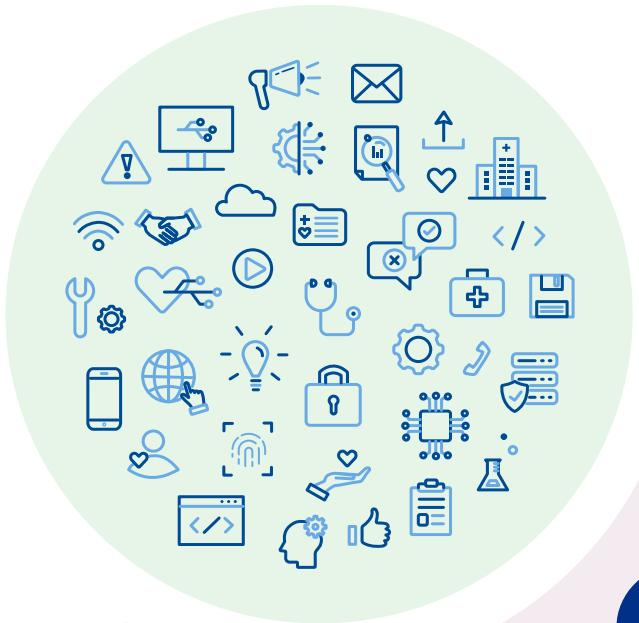
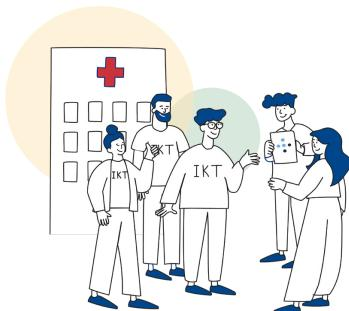
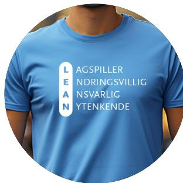
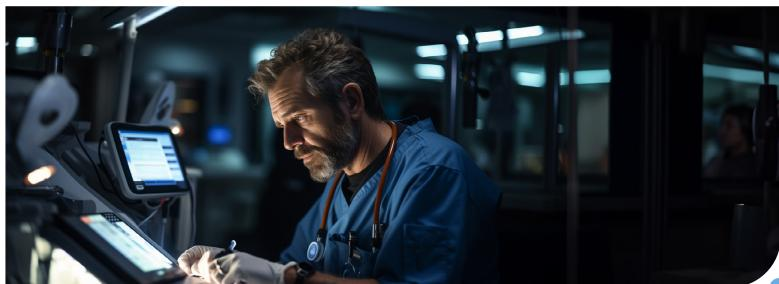
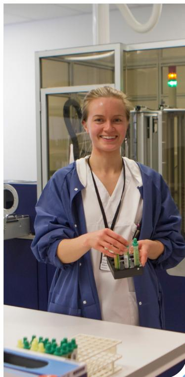
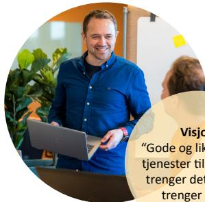
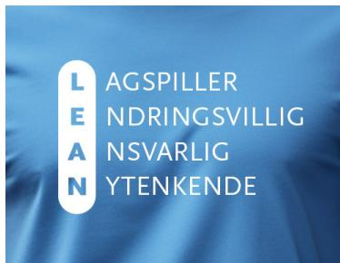
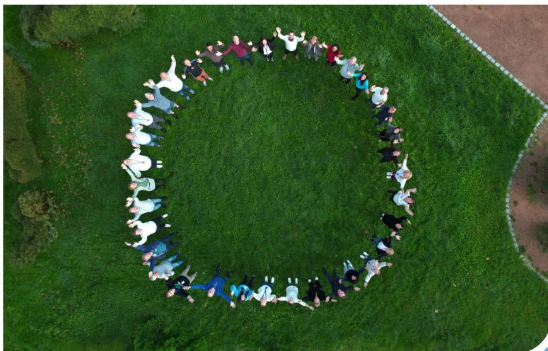
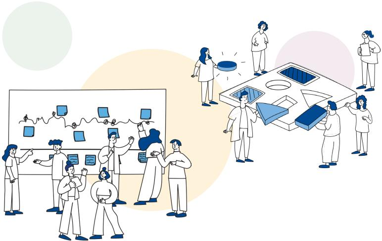

|     |                                                                   |       |
|-----|-------------------------------------------------------------------|-------|
| 01. | <b>INNLEDNING</b> .....                                           | s. 3  |
| 02. | <b>BAKGRUNN</b> .....                                             | s. 5  |
| 03. | <b>STRATEGISKE FØRINGER, TRENDER OG UTVIKLINGSTREKK</b> ..... | s. 6  |
|     | Strategiske føringer .....                                        | s. 6  |
|     | Trender og utviklingstrekk .....                                  | s. 7  |
|     | Kundebehov og -krav .....                                         | s. 8  |
| 04. | <b>ORGANISASJONSANALYSE</b> .....                                 | s. 10 |
| 05. | <b>MÅL FOR STRATEGIPERIODEN 2024 - 2028</b> .....             | s. 12 |
|     | Visjon, misjon og verdier .....                                   | s. 12 |
|     | Strategiske ambisjon og mål .....                                 | s. 14 |
|     | Strategiske satsningsområder .....                                | s. 15 |
| 06. | <b>STRATEGISKE KAPABILITETER</b> .....                            | s. 17 |
|     | Ledelse, organisasjon og kultur .....                             | s. 17 |
|     | Strategisk risikolelse .....                                      | s. 18 |

01.

02.

03.

04.

05.

06.

A conceptual graphic showing a hand reaching out to interact with a glowing digital interface. Below the hand are two rounded rectangular boxes. The left box contains a 'Shift left' icon (two arrows pointing left) and the text 'Shift left'. The right box contains a 'Digital transformator' icon (a stylized atom symbol) and the text 'Digital transformator'.

# INNLEDNING

Denne utviklingsplanen oppsummerer Sykehuspartner HF sin overordnede strategi og setter retningen for utviklingen av vår virksomhet og ønsket utvikling frem til 2028.

Helsetjenesten står ovenfor store utfordringer og vi har en nøkkelrolle i å bidra til å finne løsninger på disse. Det er derfor vesentlig at vi forstår utfordringsbildet, at vi relaterer oss til strategiske føringer for vår virksomhet, og at vi justerer vår strategi og utviklingsplan i takt med endringer i omgivelsene. Det har vært viktig i arbeidet med ny strategisk retning å høre ut hvilke forventninger og behov helseforetakene og Helse Sør-Øst RHF har til oss som virksomhet. I korte trekk så forventes det:

- at vi kan understøtte økt endringstakt
- at vi kan akselerere den digitale transformasjonen som helseforetakene står i
- at vi tilrettelegger for samhandling og gode arbeidsprosesser gjennom effektive, arbeidsbesparende og brukervennlige digitale løsninger samt deling av informasjon mellom systemer
- at vi kan bidra til at helse- og styringsdata kan nyttiggjøres i utviklingen av helsetjenesten.

Som en felles leverandør av IKT- og administrative tjenester til alle sykehusene i Helse Sør-Øst, spiller vi en viktig rolle ved å tilby sikre, riktige og fremtidsrettede digitale løsninger.

Det gjør vi imidlertid ikke alene. Utvikling av helseøkosystemet og vår rolle som del av det må derfor være i fokus fremover.

Hvordan vi utøver ledelse, utvikler vår fagkompetanse og ikke minst vår kultur, er vesentlig for realisering av strategien. Vi har derfor i tillegg til ny strategisk retning, også justert visjon, misjon og kjerneverdier. Dette for å sikre at vi har felles forståelse for hva vi må gjøre for å treffe på omgivelsenes behov og krav, og de endringene vi som organisasjon må gjennom for å lykkes med realisering av strategien.

«På samme lag» er valgt som slagord for vår nye strategiske retning, og innebærer at vi samles oss om det aller viktigste endringsbehovet, at vi innrette oss mot felles mål for virksomheten og for det vi gjør sammen med øvrige helseforetak i Helse Sør-Øst.

Vår ambisjon er at Sykehuspartner HF i 2028 *er en effektiv og brukernær leverandør med moderne tjenesteproduksjon, som bruker teknologier smart, og er en drivkraft for digital transformasjon i helseforetakene.*

Dette skal vi realisere gjennom to posisjoner med konkrete resultatmål.

## **Posisjon 1 – «Shift left»**

«Shift left» representerer kulturskiftet og begrepet skal minne oss på at vi må tenke

01.

annerledes, at vår kultur må utvikles, og at vi må øke vår toleranse for å endres. Vi må redesigne hvordan vi jobber og ta i bruk nye måter å jobbe på, mer smidig og raskere. Shift left skal bidra til at vi starter tidligst mulig med å tenke tverrfaglig for å sikre god forståelse av hva som skal gjøres.

missgivende rolle for utvikling av infrastruktur og teknologi. Vi forstår hvordan ny teknologi kan påvirke organisasjon og arbeidsprosesser, hvor vi tilegner oss kompetanse til å drive endring hos oss selv og ute hos helseforetakene. Dette innebærer at vi samhandler og bidrar i foretakenes digitale transformasjon.

02.

03.

Icon for Mål 1: A target symbol with an arrow in the center.

Mål  
1

«Vi skal optimalisere leveranse- og tjenesteproduksjonen ved å levere raskere og bedre på eksisterende kundebehov og -krav.» Resultatoppnåelse måles gjennom økt produktivitet.

Icon for Mål 3: A target symbol with an arrow in the center.

Mål  
3

«Vi skal utvikle kapabiliteter til å drive digital transformasjon.» Resultatoppnåelse måles gjennom raskere innovasjon.

04.

05.

06.

Icon for Mål 2: A target symbol with an arrow in the center.

Mål  
2

«Vi skal modernisere tjenesteproduksjonen for å møte eksisterende og nye kundebehov gjennom å ta i bruk fremvoksende teknologi.» Resultatoppnåelse måles gjennom økt adopsjonshastighet.

De ansatte i Sykehuspartner er den aller viktigste ressursen vi har og den viktigste bidragsyteren til å realisere strategien. Vi har nå tatt det første steget med å fastsette ambisjon og retning, realiseringen av strategien må vi stå sammen om gjennom konkretisering av mål og planer. Våre nye kjerneverdier Lagspiller, Endringsvillig, Ansvarlig og Nytenkende, skal hjelpe oss til å ta beslutninger og danne grunnlag for den kulturen vi ønsker å utvikle.

## **Posisjon 2 – «Digital transformatør»**

«Digital transformatør» stiller krav til kompetanse- og rolledefining i vår virksomhet. Begrepet skal minne oss på at vi skal ta en mer pre-

Med kunnskap om både helsesektoren og teknologi skal vi tilby effektive løsninger som bidrar til at helseforetak og helsepersonell kan konsentrere seg om mer og bedre pasientbehandling.

Image: Handwritten signature of Hanne Tangen Nilsen in blue ink.

Hanne Tangen Nilsen  
Administrerende direktør  
Sykehuspartner HF

01.

02.

03.

04.

05.

06.

# BAKGRUNN

Sykehuspartner HF ble etablert som felles tjenesteleverandør for helseforetakene i daværende Helse Sør i 2003. Fra starten fikk Sykehuspartner HF ansvaret for lønn- og personalfunksjonen og oppgaver innen innkjøp, og i 2007 ble ansvaret for IKT overført. Etter sammenslåingen av Helse Sør og Helse Øst ble Sykehuspartner HF valgt som felles tjenesteleverandør for hele den nye helseregionen. Sykehuspartner HF var først en avdeling i Helse Sør-Øst RHF og ble etablert som eget helseforetak fra 1. januar 2015.

I henhold til vedtektene skal Sykehuspartner HF skal drive tjenesteyting effektivt, med standardiserte løsninger og med høy kvalitet.

*Virksomheten skal drives med sikte på å bistå helseforetakene med kostnadseffektivt å nå nasjonale helsepolitiske mål og helseforetaksgruppens samlede sektorpolitiske målsetninger innenfor de mål, resultatkrav og rammer som fastsettes i helseforetakets vedtekter og beslutninger fattet av foretaksmøtet.*

Som felles tjenesteleverandør skal Sykehuspartner HF innen IKT, drifte og forvalte IKT-løsningene som benyttes av helseforetakene. Ved overføringen av ansvaret for IKT fra helseforetakene, fikk Sykehuspartner HF ansvaret for en portefølje med mye uønsket variasjon. Gjennom de senere årene har Helse Sør-Øst gjennomført et betydelig arbeid med å redusere uønsket variasjon gjennomsanering, standardisering og innføring av regionale

løsninger. Sykehuspartner HF har et spesielt ansvar for infrastrukturen, og det har vært en prioritert oppgave å standardisere og modernisere denne. Dette både for å sikre en mer effektiv drift og etablere en moderne infrastruktur som muliggjør målene om økt samhandling og økt bruk av IKT i pasientbehandling. Dette arbeidet er omfattende og vil fortsette gjennom strategiperioden.

Innen området administrative fellestjenester leverer Sykehuspartner HF lønns- og personaltjenester, regional ERP og er i gang med innføring av samhandlingsløsningen M365.

Sykehuspartner HF vedtok i 2021 sitt strategiske målbilde for 2025 hvor det ble definert fem strategiske innsatsområder; levere som avtalt, tett på, felles løft, solid kompetanse og fleksibel organisasjon. Det strategiske målbildet er fulgt opp gjennom årlige handlingsplaner, med tiltak på alle de fem områdene. Et viktig tiltak var bruk av markedet for å øke samlet leveransekapasitet. Arbeidet innebar å tydeliggjøre hva Sykehuspartner HF skulle levere med egne ressurser, kjernevirksomhet med tilhørende kjernekompetanse, og hva som kunne kjøpes i markedet. Det ble også pekt på behovet for å utvikle organisasjonen med bedre samhandling på tvers blant annet gjennom pilotering av tverrfaglige team.

I det nåværende strategiarbeid bygger vi videre på dette arbeidet, men har lagt vesentlig vekt på å bedre egen forståelse for hvilke kapabiliteter som må utvikles for å imøtekomme helseforetakenes behov. Dette har medført at vi nå også endrer vår misjon og våre verdier.

Illustrasjon av fire personer i helseforetakskjeller som diskuterer. En person i midten har 'IKT' skrevet på kjelet. I bakgrunnen er et panel med et rødt kors og flere tomme bokser.

Illustrasjon av en person som bærer en blå t-shirt. På t-shirten er det skrevet 'LEAN' i store bokstaver, og til høyre for det står 'AGSPILLER', 'NDRINGSVILLIG', 'NSVARLIG' og 'YTENKENDE' i mindre bokstaver.

01.

# STRATEGISKE FØRINGER, TRENDER OG UTVIKLINGSTREKK

02.

## Strategiske føringer

De samlede forventningene til Sykehuspartner HF kommer i all hovedsak gjennom de årlige oppdragsdokumentene fra Helse Sør-Øst RHF, føringene fra Regional utviklingsplan, som setter retningen for utviklingen av spesialist-helsetjenesten i Helse Sør-Øst, og delstrategi for Teknologi.

Regional utviklingsplan peker på ønsket utvikling på kort sikt og fram mot 2040. I planen er det konkretisert fire mål:

03.

Icon of a heart with a pulse line

- 1. Bedre helse i befolkningen, med sammenhengende innsats fra forebygging til spesialiserte helsetjenester

Icon of a first aid kit

- 2. Kvalitet i pasientbehandlingen og gode brukererfaringer

Icon of two people

- 3. Godt arbeidsmiljø for ansatte, utvikling av kompetanse og mer tid til pasient-behandling

Icon of a hand holding a plant

- 4. Bærekraftige helsetjenester for samfunnet

04.

05.

06.

Med seks tilhørende strategiske satsningsområder:

Icon of a building

- 1. Styrke pasienters og pårørendes helse-kompetanse og involvering

Icon of a lightbulb

- 2. Nye arbeidsformer og bedre bruk av teknologi

Icon of two hands shaking

- 2. Samarbeid om de som trenger det mest - vår felles helsetjeneste

Icon of a star

- 4. Redusere uønsket variasjon i kvalitet og forbruk av helsetjenester

Icon of a clock

- 5. Ta tiden tilbake - mer tid til pasientret-tet arbeid

Icon of a magnifying glass

- 6. Forskning og innovasjon for bedre helsetjenester

Alle satsningsområdene er viktige for oss å forstå, for best mulig å kunne understøtte disse med gode digitale løsninger. *Nye arbeidsformer og bedre bruk av teknologi* er spesielt viktig å ta inn over oss. Her understrekes det at teknologi og digitalisering ikke er et

mål, men et verktøy, som skal muliggjøre og understøtte nye måter å løse oppgaver på for både ansatte og pasienter og bidra til bedre pasientsikkerhet og kvalitet. Ikke bare innad i spesialisthelsetjenesten, men også på tvers av helsetjenestene. Det pekes også på behovet for å etablere nye arbeidsformer og ta i bruk teknologi, slik at pasienten eksempelvis kan behandles hjemme.

Helse Sør-Øst RHF har konkretisert den strategiske utviklingen av teknologiområdet i en delstrategi for teknologi. Teknologistrategien skal være et verktøy for strategisk porteføljestyring og skal brukes aktivt i prioritering, planlegging og budsjettering innenfor teknologiområdet i foretaksgruppen.

Planen beskriver mål innen syv områder:

|                                         |                                                    |                                  |
|-----------------------------------------|----------------------------------------------------|----------------------------------|
| Datadrevet utvikling av helse-tjenesten | Digital hjemmeoppfølging                           | Brukernær utvikling av teknologi |
|                                         | Kvalitet, kunstig intelligens og beslutningsstøtte |                                  |
|                                         | Digital samhandling                                |                                  |
|                                         | Enklere hverdag                                    |                                  |
| Effektive felles IKT-tjenester          |                                                    |                                  |

Figur 1: Syv strategiske innsatsområder

Delstrategien setter søkelyset på behovet for å benytte nye teknologiske muligheter som digital hjemmeoppfølging og kunstig intel-ligens for å frigjøre tid og øke kvalitet og kapasitet i pasientbehandlingen. I tillegg etterlyses mer brukernær utvikling styrt av helseforetakenes behov, økt endringsevne og økt gjennomføringstempo. Et viktig satsnings-område er å forbedre brukeropplevelse, ytelse og responstid ved IKT-tjenestene (redusere «plunder og heft»). I tillegg er det pekt på behov for å tydeliggjøre styringsmodellen og rolledelingen mellom Sykehuspartner HF, de øvrige helseforetakene og Helse Sør-Øst RHF.

Delstrategien beskriver et sett med drivere for endring som også er viktige for Sykehuspartner HFs strategi. Blant annet Helsepersonell-kommisjonens rapport «*Tid for handling*»,

01.

hvor det spesielt fremheves at teknologi vil være en viktig faktor for å avlaste helsepersonell. Som del av et økosystem som samlet skal levere en helhetlig helsetjeneste på tvers av primær- og spesialisthelsetjenesten har det også vært viktig å se til ny *Nasjonal strategi for e-helse og digitalisering*.

02.

I arbeidet med oppdragsdokumentet for 2024 pekes det på følgende hovedområder, i tillegg til å sørge for sikker og stabil drift:

- Bidra til å realisere regional delstrategi for teknologiområdet
- Forbedre egen leveranseevne
- Ivareta regional IKT-porteføljestyring
- Informasjonssikkerhet

Helse Sør-Øst strategiske mål og satsningsområder, så vel som oppdrag, innarbeides i våre mål og tiltak. Oppdragene fra Helse Sør-Øst blir oppdatert i dette dokumentet når endelig oppdrag er avklart etter foretaksmøte 2024.

03.

## Trender og utviklingstrekk

04.

Trender som påvirker samfunnsutviklingen nasjonalt og globalt, danner et bakteppe som har betydning også for Sykehuspartner HFs strategiarbeid, noe som også vektlegges i de overordnede strategiene.

05.

Klimaendringene stiller krav til hvordan varer og tjenester produseres, og den demografiske utviklingen fremover vil gi større konkurranse om arbeidskraften, også om teknologi- og sikkerhetskompetanse. Den teknologiske utviklingen går stadig raskere, med økt bruk av kunstig intelligens på full fart inn også i helsetjenesten. Teknologi har og vil få betydning for alle samfunnsområder, for verdikjeder og forretningsmodeller.

06.

I løpet av de neste tiårene vil teknologi og digitale løsninger bidra til å løse mange av utfordringene innenfor helsetjenesten, men også viktige samfunnsområder som transport, klima, energi og matproduksjon. Raskere teknologisk utvikling vil på sikt føre til at maskiner løser stadig flere oppgaver. Datamengdene blir større og kan nyttiggjøres på nye måter, mennesker samhandler mer med maskiner og fører til at grenseflatene mellom teknologi og biologi vil bli mer utydelige. Det setter krav

til at vi kan levere moderne infrastruktur og løsninger som tilrettelegger for at helseforetakene kan ta dette i bruk.

Sykehuspartner HF trenger å inneha ledende kompetanse innenfor ny teknologi som kunstig intelligens og Big data, digital tjenesteutvikling, skytjenester og moderne leveransemodeller. Det er omfattende og hurtig utvikling i helsetjenestenes bruk av nye arbeidsmetoder, der tekniske løsninger i stadig større grad innlemmes i pasientbehandlingen. Dette gir økte krav til sikker og stabil drift, og fordrer at vi tilpasser arbeidet for fortsatt å kunne ivareta samfunnets tillit til spesialisthelsetjenesten.

Den sikkerhetspolitiske situasjonen er markert endret de siste årene. Økt internasjonal spenning forsterker endringer også i handelsmønstre og i produksjonen av varer og tjenester, noe vi merket under koronapandemien. Moderne tjenesteproduksjon vil muliggjøre raskere leveranser gjennom nye leveransmodeller, og dette stiller økte krav til bevissthet og kunnskap om leverandørverdikjeder, vårt ansvar for å opprettholde samfunnssikkerhet, informasjonssikkerhet, pasientsikkerhet og personvern.

A male healthcare professional with a beard and short hair, wearing blue scrubs and a stethoscope, is focused on a medical device or computer screen in a clinical setting. The background is dark and blurred, showing medical equipment.

01.

*Nasjonal Sikkerhetsmyndighet Risiko 2023* trekker blant annet frem at lange og uoversiktlige leverandørkjeder fortsatt utgjør en sårbarhet som trusselaktører utnytter. Dette er risiko som i stor grad er gjeldende for Sykehuspartner HF og Helse Sør-Øst RHF. For å ivareta vårt ansvar med sikker og stabil drift, er vår evne og kompetanse til oppfølging av sikkerhet i leverandørkjeden sentralt for risiko-utviklingen i vår virksomhet. Dette gjelder alle faser fra en tjenesteetablering til -avvikling, hvor kontroll og oppfølging av hvordan leverandøren leverer på avtalte forpliktelser vil være av stor betydning.

02.

03.

04.

05.

06.

## Kundebehov og -krav

Helsetjenesten står ovenfor store utfordringer og dette legger sterke føringer for utviklingen av vår virksomhet. Det er vesentlig at vi forstår det totale utfordringsbildet og jobber tett og godt med helseforetakene for å sikre felles situasjonsforståelse og dermed også grunnlaget for å gjøre bedre prioriteringer sammen.

I oppsummeringen nedenfor gjengis de mest vesentlige drivere, behov og forventninger som helseforetakene og Helse Sør-Øst RHF har uttrykt gjennom strukturerte intervjuer med ledelsen for teknologimiljøene i helseforetakene og Helse Sør-Øst RHF. Dette har gitt Sykehuspartner HF en bedre forståelse av helseforetakenes og eiers forventninger og krav.

### Drivere for fremtidens helsetjeneste

Helsepersonell kommer til å være en mangelvare i fremtiden, samtidig som befolkningen aldres og det forventes strammere økonomiske rammer. Dette er viktige drivere for at helseforetakene og helseøkosystemet må utvikle seg for å levere mer helse innen de rammene de i dag har til rådighet. Teknologi vil være et svært viktig virkemiddel både som verktøy til å løse oppgaver som i dag utføres av helsepersonell, å utvikle nye arbeidsmåter og å bedre samarbeid på tvers av økosystemet.

Endringstakten forventes å øke. Nye arbeids-

Samtidig øker sjansen for at ny teknologi utnyttes av aktører som er ute etter å ramme oss. I Sykehuspartner HF må vi derfor sørge for at vår infrastruktur og de teknologivalgene som vi tar, gagner både samfunnet, helsetjenestene og nasjonale sikkerhetsinteresser. For å gjøre dette best mulig, må vi ha en helhetlig tilnærming til risiko- og sikkerhetsstyring basert på et bredt kunnskapsgrunnlag, der risikovurderinger suppleres med strategier for økt motstandsdyktighet, redundans og tilpasningsevne.

Situasjonen i verden øker usikkerheten i verdensøkonomien og påvirker norsk økonomi. Selv om Norge som nasjon har en god økonomi, forventes det strammere økonomiske rammer fremover med økt krav til effektivitet og omstilling. For Sykehuspartner HF betyr det at vi må bidra til økt produktivitet gjennom å omstille egen virksomhet så vel som å bidra til å finne gode økonomiske, effektive og arbeidsbesparende løsninger for helseforetakene.

A smiling woman in a blue lab coat and white apron, holding a black tray with several small green and blue vials, standing in a laboratory setting with glass equipment and a red light indicator in the background.

01.

former og nye behandlingsformer vil oppstå og endres raskere enn tidligere, og helseforetakene stiller krav om at Sykehuspartner HF må understøtte denne endringstakten på en smidig måte.

Basert på dette er det identifisert seks underområder som definerer hvilke drivere som setter sterke premisser på utviklingen:

02.

### **Transformasjon drevet av teknologi**

Sykehusene skal gjennom en transformasjon som i hovedsak er drevet av teknologi. Sykehusene er helt avhengig av en tjenesteleverandør som er fremtidsrettet og dynamisk og som kan både understøtte og være viktig driver inn i en slik transformasjon.

03.

### **Økt endringstakt**

Foretaksgruppen må utforske nye konsepter i en utviklingsfase der både behov og muligheter endres raskt, og kontinuerlig læring krever rask justering av kursen. Det må sikres at tjenestene og infrastrukturen samt leveranseevnen ikke blir en flaskehals for endring. Våre tjenester og infrastruktur må understøtte hyppig endring i sykehusenes arbeidsformer og prosesser.

04.

### **Helseøkosystemet**

Helse understøttes i økende grad av et helseøkosystem med samhandling på tvers av helsenivåer og offentlig/privat. Nye samhandlingsformer og samhandlingsarenaer for pasientbehandling vil sette nye krav til tjenester og sikkerhet.

05.

06.

### **Sykehusene som teknologiorganisasjoner**

Pasientbehandling og diagnostikk er i økende grad integrert i den understøttende teknologien, og skillet mellom helse og teknologi viskes ut. Klinikere og teknologer må kobles tettere sammen og det må skapes gode samhandlingsformer med felles behovsutvikling.

#### **Helsedata**

Det produseres store mengder helsedata med tilhørende store muligheter for bruk og misbruk. I dag er mye av dataene vanskelig tilgjengelig og uoversiktlig. Det må sikres gode strukturer for å ivareta og utnytte de tilgjengelige helsedataene og samtidig ivareta integritet, tilgjengelighet, konfidensialitet og personvern.

#### **Det utadvendte sykehus**

Utadvendte sykehus skal, både fysisk og virtuelt, yte mer helsehjelp hjemme hos pasienten, samarbeide mer med kommunale helse- og omsorgstjenester og jobbe tettere med andre sykehus. Diagnostikk, behandling og overvåking kan i økende grad gjennomføres hjemme hos pasienten. Dette endrer krav til infrastruktur og tjenester.

Helseforetakene ønsker en partner som er fremtidsrettet, dynamisk og som kan understøtte den digitale transformasjonen sykehusene skal gjennom. Forventningene til Sykehuspartner HF kan oppsummeres i fire kritiske behov:

1. Understøtte økt endringstakt
2. Akselerere digital transformasjon
3. Tilrettelegge for alle former for samhandling
4. Bidra til at helse- og styringsdata kan nyttiggjøres i utviklingen av helsetjenestene.

01.

02.

03.

04.

05.

06.

A woman in a red blazer smiling, representing a professional in the healthcare sector.

Two people, a man and a woman, working together on a laptop, representing a collaborative business environment.

# ORGANISASJONSANALYSE

En viktig del av strategiarbeidet har vært å forstå hvilket potensial som ligger i Sykehuspartner HF som organisasjon. Det har derfor blitt gjennomført en grundig organisasjonsanalyse for å sikre at vi har et felles ståsted for hva som er bra, hva som må blir bedre og hva som må endres. Det samlede analysegrunnlaget er deretter vurdert opp mot fremtidsperspektiver for å vurdere hvordan organisasjonen bør justeres for å møte fremtidige krav.

Sykehuspartner HF benyttet seg av McKinsey 7S organisasjonsanalyse for å kartlegge den interne situasjonen, potensial for høyere ytelse og vurdere implikasjoner ved endringer. Analysen ga innsikt i 3 harde variabler (strategi, struktur, system) og 4 myke variabler (verdier, kompetanse, ansatte og ledelse) som viste styrker og svakheter i organisasjonen. Innsikten fra arbeidet ble validert på alle ledernivåer og ga en omforent forståelse av kapabiliteter som må videreutvikles.

I tråd med regional delstrategi for teknologi, viser analysen et potensial for å tydeliggjøre styringsmodellen mellom eier (Helse sør-øst RHF), helseforetak og Sykehuspartner HF. En tydeliggjøring vil kunne effektivisere beslutningsstrukturer, roller og ansvarsforhold innenfor teknologiutvikling samt prioritering av tjenesteutvikling i regionen. Helse Sør-Øst RHF har gitt Sykehuspartner HF økt tillit ved å overta ansvaret for operativ porteføljestyring for regionale IKT-prosjekter. Dette gjør det mulig for Sykehuspartner HF, på sikt, å ta en mer strategisk tilnærming for leveranse- og porteføljestyring.

For å oppnå full effekt av strategi må, strukturer, systemer og prosesser justeres. Tydelige forretningstjenester vil gi en mer effektiv organisasjons- og styringsmodell og en bedre rolle- og ansvarsforståelse internt. Eksternt må Sykehuspartner HF ha en tett og løpende dialog med omgivelsene om forventningene de har til ønsket utvikling.

Organisasjonsanalysen indikerer at Sykehuspartner HF på selvstendig grunnlag har potensial til å øke produktivitet, adopsjonshastighet og innovasjon. Kritiske suksessfaktorer er helhetlig tilnærming til leveranser, dynamisk målstyring og koordinert organisasjonsutvikling. Dette vil kreve videreutvikling av en virksomhetskultur som ivaretar både utvikling og drift samtidig som det skapes mer effektive og smidige måter å jobbe på. For å få dette til viser innsikten at det er nødvendig med en tettere kobling mellom visjon, misjon og verdier og behovene fra Helse Sør-Øst RHF og helseforetakene.

I organisasjonsanalysen ble det pekt på potensial for høyere ytelse ved å ha kollektivt fokus på færre og mer konsentrerte mål. Fra 2022 til 2023 ble antall Sykehuspartner-mål derfor halvert for å sikre sterkere horisontal og vertikal målforpliktelse. For at Sykehuspartner HF raskere skal kunne tilpasse seg krav fra omgivelsene er det viktig at mål er dynamiske (Sykehuspartner HF har innført OKR – «Objectives and Key Results») og lar seg justere raskt i organisasjonen.

Oppsummering av strategisk analyse viser at

01.

Sykehuspartner HF har potensial til å bidra i flere deler av verdikjeden enn i dag. Fra både eier og helseforetak er det ønskelig med sterkere bidrag innenfor utvikling og videreutvikling av tjenester.

02.

Sykehuspartner HF sin største eksterne trussel knyttet til utvikling av organisasjonen er et stramt arbeidsmarked for IKT- og sikkerhets-

kompetanse og evne til å utvikle og tiltrekke seg fremtidens behov for kompetanse. Sykehuspartner HF er en av landets største IKT-virksomheter og har potensial for å kunne konkurrere med markedet basert på det beste tilbudet om kompetanse- og karriereutvikling i mengden av de varierte og komplekse oppgavene som ligger til vårt tjenesteansvar.

03.

04.

05.

06.

A photograph of two men in a professional office environment. In the foreground, a man with short brown hair, wearing an orange long-sleeved shirt, is seated at a light-colored wooden desk. He is smiling at the camera and has his hands on a silver laptop. On the desk in front of him are a white ceramic mug, a red notebook, and several colorful sticky notes (yellow and pink). Standing behind him is another man with short brown hair, wearing a blue button-down shirt. He is also smiling and holding a silver laptop. In the background, there is a large whiteboard with several yellow and pink sticky notes attached to it. The office has large windows with blinds, and the overall atmosphere is bright and professional.

Two men in a modern office setting. One man in an orange sweater is sitting at a desk with a laptop, smiling. The other man in a blue shirt is standing behind him, also smiling and holding a laptop. The desk has a white mug, a red notebook, and several yellow and pink sticky notes. A whiteboard with more sticky notes is in the background.

01.

## MÅL FOR STRATEGIPERIODEN 2024-2028

02.

## Visjon, misjon og verdier

Sykehuspartner HF er en teknologivirksomhet som preges av hyppige endringer og stadig nye behov fra omgivelsene. Fremtiden vil stille krav til nye, raskere og bedre måter å lede, treffe beslutninger og samhandle på. Vår overordnede retning er langsiktig og skal være tydelig nok til at våre ansatte og de vi samhandler med forstår hva vi har som mål på lang sikt.

04.

Sykehuspartner HF har historisk utviklet en sterk kultur med fokus på sikkerhet og stabil drift. Denne kulturen er nødvendig for stabil og sikker drift, men samtidig utfordrer den helseforetakene og eiers behov for økt endringstakt og digital transformasjon. Virkemidler for å skape drivkraft for endring av strukturer, systemer og prosesser er å revurdere hvorfor vi er til, hvilke verdier vi trenger for å kunne oppnå målene og hva vi skal levere.

05.

Visjon, misjon og kjerneverdier for strategiperioden 2024-2028 er bygget på behovene fra medarbeider-, eier- og helseforetak. Ved å skape en tett kobling mellom omgivelsenes behov og våre egne verdier er vi overbevist om at vår strategiske retning og mål bidrar til beslutninger som ivaretar en best mulig opplevelse for kunde-, eier- og medarbeider både på lang og kort sikt.

06.

A man in a blue shirt smiling and holding a laptop, standing next to a woman.

### Visjon

“Gode og likeverdige tjenester til alle som trenger det, når de trenger det.»

#### Misjon:

«Vi utgjør en forskjell for pasient og sykehus ved å levere bærekraftige, sikre og moderne digitale tjenester.»

A woman in a red blazer and a man in a dark suit sitting at a desk, looking at a laptop screen.

A woman in a brown top leaning over a desk, smiling and talking to a man in a suit and a woman in a blue jacket.

01.

### **Visjon**

Sykehuspartner HF sitt langsiktige mål er å understøtte HSØ sin visjon som er å levere *“gode og likeverdige tjenester til alle som trenger det, når de trenger.”* Vår visjon er den fremtidstilstanden vi søker å bidra til å oppnå.

02.

### **Misjon**

Vår misjon er at *«vi utgjør en forskjell for pasient og sykehus ved å levere bærekraftige, sikre og moderne digitale tjenester.»* Vår misjon er grunnlaget for vår eksistens og hva vi gjør for å oppnå visjonen.

03.

### **Kjerneverdier**

Sykehuspartner HF har fire kjerneverdier som vi ønsker å bli målt på blant de vi samhandler med. Våre verdier skal hjelpe oss til å ta beslutninger og danner grunnlag for den kulturen vi ønsker oss:

04.

**Lagspiller** betyr at vi skaper kundeverdi gjennom å samhandle, vise hverandre tillit og være lojale mot felles mål.

**Endringsvillig** betyr at vi er nysgjerrige, løsningsorienterte og tilegner oss nye måter å jobbe på.

**Ansvarlig** betyr at vi jobber tvverfaglig for å kunne forventningsstyre, prioritere og holde det vi lover.

**Nytenkende** betyr at vi er modige og setter oss utfordrende mål som skaper stolthet ved felles leveranser og innovasjon.

Visjon, misjon og verdier er retningsgivende for beslutninger på alle nivåer i organisasjonen og danner grunnlag for vår strategiske retning og kultur.

05.

A man in a suit and a woman in a white jacket sitting at a desk, smiling and looking at each other, representing a collaborative work environment.

06.

A blue background with the Lean values listed vertically: LAGSPILLER, ENDRINGSVILLIG, ANSVARLIG, NYTENKENDE. The letters L, E, A, N are highlighted in white circles.

A large group of people standing in a circle on a green lawn, with their arms raised, symbolizing unity and collaboration.

01.

## Strategisk ambisjon og mål

Vår ambisjon er at Sykehuspartner i 2028 er en effektiv og brukernær leverandør, med moderne tjenesteproduksjon, som bruker teknologier smart og er en drivkraft for digital transformasjon.

Dette skal vi realisere gjennom to posisjoner med konkrete resultatmål.

02.

### Posisjon 1 – «Shift left»

«Shift left» representerer kulturskiftet og begrepet skal minne oss på å tenke annerledes, på at vår kultur må utvikles og at vi må øke vår toleranse for å endres. Vi må redesigne hvordan vi jobber og ta i bruk nye måter å jobbe på, mer smidig og raskere. «Shift left» skal bidra til at vi starter tidligst mulig med å tenke tverrfaglig for å sikre en god forståelse av hva som skal gjøres eller oppnås.

03.

04.

Icon for Mål 1: A target symbol with an arrow in the center.

Mål  
1

«Vi skal optimalisere leveranse- og tjenesteproduksjonen ved å levere raskere og bedre på eksisterende kundebehov og -krav.»

Icon for Mål 2: A target symbol with an arrow in the center.

Mål  
2

«Vi skal modernisere tjenesteproduksjonen for å møte eksisterende og nye kundebehov gjennom å ta i bruk fremvoksende teknologi.»

Delmål:

1. Modne kjerne- og forretningsprosesser
2. Raskere leveranser
3. Økt utviklingskapasitet
4. Smidig tilnærming til drift og utvikling

Nøkkelresultat: Økt produktivitet.

Delmål:

1. Tydelige produkter og tjenester
2. Koordinert organisasjonsutvikling
3. Modernisert tjenesteproduksjon
4. Kompetanse møter teknologibehov

Nøkkelresultat: Økt adapsjonshastighet.

05.

06.

### Posisjon 2 – «Digital transformatør»

«Digital transformatør» stiller krav til kompetanse- og rolledefining, og begrepet skal minne oss på at vi skal ta en mer premissgivende rolle for utvikling av infrastruktur og teknologi. Vi forstår hvordan ny teknologi kan påvirke organisasjon og arbeidsprosesser, hvor vi tilegner oss kompetanse til å drive endring hos oss selv og ute hos helseforetakene. Dette innebærer at vi samhandler og bidrar i foretakenes digitale transformasjon.

Icon for Mål 3: A target symbol with an arrow in the center.

Mål  
3

«Vi skal utvikle kapabilitet til å drive digital transformasjon.»

Delmål:

1. I takt med trender og utviklingstrekk
2. Kultur for innovasjon og utvikling
3. Teknologi som forsterker strategigjennomføring
4. Systematisk kompetanseutvikling

Nøkkelresultat: Raskere innovasjon

Illustration showing a group of people working together. On the left, four people are standing and looking at a path that leads towards a sign that says 'MÅL' (Goal). On the right, three people are jumping joyfully. The background features large, overlapping circles in light blue and green.

01.

02.

03.

04.

05.

06.

A group of five healthcare professionals, three women and two men, are shown in teal-colored scrubs. They are smiling and engaged in a conversation in what appears to be a hospital corridor or a similar clinical setting. The background is slightly blurred, showing other people and hospital infrastructure.

A group of healthcare professionals in teal scrubs smiling and talking in a hospital hallway.

## Strategiske satsningsområder

Våre satsningsområder skal understøtte overordnede mål for strategiperioden.

Satsningen vil kreve systematisk arbeid med å identifisere og utvikle tiltak som beveger oss i riktig retning. Tydelig ledelse, fokus, evaluering av måloppnåelse, organisasjonsutvikling og læring er nøkkel for å lykkes.

### Styringsstruktur og kulturskifte

Vi har solid kompetanse, men må styrke vår organisatoriske modenhet for å kunne oppnå ønskede stordriftsfordeler og raskere endringstakt. Arbeid med strategi og målstyring skal skje strukturert, risikostyring skal være et ledelsesverktøy for utvikling, organisasjonsutvikling skal skje koordinert og vi skal jobbe systematisk med å kontinuerlig forbedre arbeidsprosesser og metodikk. Kompetanseutvikling skal skje basert på ønsket strategisk utvikling. Vi skal redusere byråkrati, og det skal være tydelig hvordan vi styrer og utvikler virksomheten.

### Smidig tilnærming

Vi må understøtte mer kontinuerlig utvikling med rask igangsetting, prøving, feiling og justering av kurs, t framfor de større prosjektene med lange utredninger. Vi skal levere raskere og bedre gjennom å flytte en større del av leveranse- og utviklingskapasiteten inn i smidige team. Vi skal utvikle smidig praksis og ledelse og utforske mer produktorientert organisering. Dette skal bidra til at fag- og driftsmiljøer kan

fokussere på optimalisering av tjenesteproduksjon og modernisering, noe som skal gi økt opplevd adopsjonshastighet hos omgivelsene.

### Forretningstjenestestrategier

Sykehuspartner HF har en stor og variert portefølje av tjenester og applikasjoner som ikke er standardisert. Kundene kan bestille nye og endrede tjenester uten en tydelig katalog å velge fra. Dette påvirker virksomhetens leveranse- og endringsevne og svekker kundeopplevelsen. Gjennom å utvikle og avstemme tjenestene våre med helseforetakene og eier, vil vi kunne drive tjenesteproduksjon og -styring i ønsket retning og effektivisere og videreutvikle konkurransedyktige tjenester. Alle kunderettede tjenester skal være avtaleregulert og med tydelig ansvarsdeling mellom Sykehuspartner HF og helseforetakene.

### Leveranse- og porteføljestyring

Vi må definere, balansere og styre virksomhetens samlede portefølje av prosjekter, leveranser og tjenesteproduksjoner slik at vi sikrer en bedre utnyttelse av både økonomiske ressurser samt kapasitet og kompetanse i Sykehuspartner HF.

Dette skal skje gjennom forbedret leveranse- og porteføljestyring og gjennom tydelige prosesser, funksjoner, roller og ansvar i virksomheten. Vi skal sikre en mer helhetlig oppfølging av den regionale IKT-prosjektporteføljen opp

01.

mot planlagte og pågående infrastrukturprosjekter og drifts-/forvaltningsoppgaver i Sykehuspartner HF sine teknologikapabiliteter.

02.

### **Automatisering og selvbetjening**

Sykehuspartner HF sine teknologikapabiliteter er kritiske og må videreutvikles for å kunne være i takt med trender og utviklingstrekk. Gjennom å realisere de mest sentrale moderniseringsprosjektene på nettverk og plattformssiden vil vi etablere en basis for å levere effektivt og automatisert, samtidig som vi legger til rette for økt bruk av skytjenester. Automatisering av arbeidsprosesser generelt skal vektlegges. Brukere og kunder skal i økende grad kunne betjene seg selv, enten det gjelder feilhåndtering, driftssituasjon, status utvikling eller veiledning.

03.

04.

### **Datadrevet utvikling av virksomhet og tjenester**

Digitalisering vil ha stor innvirkning på fremtidige leveranse- og tjenestemodeller. For å lykkes med dette er det avgjørende å utvikle en datadrevet kultur, sette opp prosesser og infrastruktur for å understøtte dette og sørge for å gi medarbeiderne de nødvendige mulighetene og ferdighetene. For å hente ut verdi av data må den analyseres og integreres i

strategiske forretningsprosesser og vi må ha en systematisk tilnærming til dataforvaltning. Informasjonsforvaltning må omfatte både strukturerte og ustrukturerte data, herunder også etablering av felles teknologikomponenter for effektiv datadeling. Dette vil være en sentral muliggjører for bruk av kunstig intelligens og maskinlæring både i våre egne og kundenes prosesser. Kunstig intelligens vil kunne anvendes for å forbedre sikker og stabil drift, understøtte sikkerhet og overvåkning, automatisere kundeservice, innen HR, samt annen planlegging og analyse.

### **Innovasjon, forskning og digital tjenesteutvikling**

Vi skal bidra til innovasjon, utvikling og adopsjon av ny teknologi som gir digitalisert arbeidsflyt og endrer måten helsetjenestene utføres og leveres på. Vi skal bruke designdrevet innovasjon som setter brukeren i sentrum og legger til rette for rask og effektiv utvikling av tjenester. Vi skal understøtte forskning med tilgang til relevante data, plattform og forskningsverktøy. Vi skal legge til rette for mer effektiv utvikling av digitale løsninger gjennom innovasjonsrådgivning og tilgang til utviklings- og innovasjonsverktøy.

05.

06.

![Illustrasjon av digital transformasjon i helsevesenet. En sentral figur i en hvit labkåpe og blå sko står på en digital plattform som representerer data og teknologier. Denne figuren holder en stor, lysblå penna og ser på en dataskrin. På plattformen er det også andre figurer: en person som jobber på en dataskrin, en person som holder en stor, lysblå penna, og en person som holder en stor, lysblå penna. I bakgrunnen er det flere figurer som representerer ulike roller i helsevesenet, som lege, sykepleier og administrasjon. De er alle engasjert i ulike aktiviteter knyttet til digital transformasjon. I bakgrunnen er det også flere dataskriner og teknologiske symboler, som en stethoskop og en dataskrin. Den hele illustrasjonen er omgitt av store, fargede sirkler i lyseblå, lysegrønne og lyseorange farger, som gir en følelse av dynamikk og energi.](sykehuspartner-hf-utviklingsplan-2024-2028/871d3b3fddcb9cf28158d7465c9ba652_img.jpg)

Illustrasjon av digital transformasjon i helsevesenet. En sentral figur i en hvit labkåpe og blå sko står på en digital plattform som representerer data og teknologier. Denne figuren holder en stor, lysblå penna og ser på en dataskrin. På plattformen er det også andre figurer: en person som jobber på en dataskrin, en person som holder en stor, lysblå penna, og en person som holder en stor, lysblå penna. I bakgrunnen er det flere figurer som representerer ulike roller i helsevesenet, som lege, sykepleier og administrasjon. De er alle engasjert i ulike aktiviteter knyttet til digital transformasjon. I bakgrunnen er det også flere dataskriner og teknologiske symboler, som en stethoskop og en dataskrin. Den hele illustrasjonen er omgitt av store, fargede sirkler i lyseblå, lysegrønne og lyseorange farger, som gir en følelse av dynamikk og energi.

01.

# STRATEGISKE KAPABILITETER

For å støtte opp om de strategiske målene har vi identifisert utviklingsområder som forsterker målene og som skal gi best avkastning for eier- og kunde basert på Sykehuspartner HF sine tilgjengelige ressurser, styrker, svakheter, muligheter og trusler.

02.

## Ledelse, organisasjon og kultur

03.

Våre strategiske organisatoriske kapabiliteter er evnen til å eksekvere på strategi og strategiske mål. Det er en tydelig kobling mellom strategi, visjon og kapabiliteter og evnen til å eksekvere på strategi som gir omgivelsene verdi. Strategiske kapabiliteter må utvikles systematisk og planmessig for å realisere strategiske mål i inneværende og kommende strategiperiode.

04.

Sykehuspartner HF vektlegger å utvikle organisatoriske kapabiliteter som er riktige og viktige på mellomlang og lang sikt. Dette for å balansere kortsiktige mål og gevinster opp mot eier- og kundenes behov for fremtidige kapabiliteter Sykehuspartner HF må utvikle.

05.

Sykehuspartner HF vil jobbe for å utvikle følgende kapabiliteter.

06.

### Strategisk engasjement

Ledere og medarbeidere forstår sin rolle i å støtte opp om strategien, og opplever den som viktig og er engasjert i å jobbe aktivt med forbedringer.

### Organisasjonskultur

Organisasjonskulturen støtter utvikling, lagspill, endring og fremmer tverrfaglig samarbeid og kommunikasjon. Kulturen gjør det enkelt for medarbeidere å prestere og prioritere.

### Ledelse

Ledere og fagledere kjennetegnes av å jobbe systematisk og planmessig mot felles mål. Våre ledere er forretningsorienterte, ansvarlige, skaper engasjement og stimulerer til kontinuerlig utvikling av sine medarbeidere og arbeidsmiljø. Ledelsen har eierskap til og felles forståelse av endringene, er utholdende og tør å stå i endring.

### Innovasjon

Fremtidsrettet og mulighetsorientert i nyutvikling og redesign av tjenester og hvordan vi leverer og produserer tjenester. Strukturert tilnærming til innovasjon.

### Brukernær

Tette og nære samarbeidsforhold der forretningsutvikling skjer i tverrfaglige team sammen med eller i nær tilknytning til kunde og brukere.

### Smidighet

Medarbeidere behersker smidige praksiser og utviser endringsvilje og tilpasningsdyktighet. Korte beslutningsprosesser kjennetegnet av proaktiv planlegging og god risikoforståelse. Vi er en lærende organisasjon som kontinuerlig forbedrer måten vi jobber på.

### Talentutvikling

Ansatte på alle nivåer er kompetente innenfor sine funksjoner i henhold til karriere- og kompetanserammeverk. Ansatte blir systematisk fulgt opp i forhold til prestasjon og utvikling. Vi jobber kontinuerlig med å sikre kjernekompetanse.

### Teknologi og arkitekturstyring

Teknologi- og arkitekturstyring skal sørge for at våre løsninger understøtter våre strategier og forretningsbehov. En god og modulær arkitektur skal sikre helhet, bærekraftig kostnadsbilde og gode kundeopplevelser. God arkitektur er en forutsetning for ende-til-ende automatisering. Arkitekturstyring skal skje i alle lag, fra forretningsarkitekturen ned til teknologien.

### Risiko- og sikkerhetsstyring

Vår praksis legger til rette for at risiko blir kjent, eid, kommunisert og håndtert basert på vedtatte risikoakseptkriterier. Risikostyring hjelper oss å realisere muligheter og å unngå negative konsekvenser. Kompetanse om beredskap og motstandsdyktighet, personvern, sikkerhet og sårbarheter i egne tjenester i kombinasjon med tverrfaglig vurdering av risikoer blir avgjørende for å realisere økt endringstakt.

01.

## Strategisk risikolelse

Sykehuspartner HF vil følge opp på strategisk risiko for å forsterke den langsiktige måloppnåelse samt sikre vellykket utvikling og justering av strategiske initiativ.

arbeide med analyse av fremoverskuende utviklingstrekk som grunnlag for evaluering og justering av initiativ og tiltak, herunder; 1) status strategiimplementering, 2) endringer i teknologi, 3) turnover nøkkelpersonell, 4) endringer i kundebehov, 5) mulige leverandørutfordringer og 6) endringer i økonomiske rammebetingelser.

02.

De overordnede målene for strategiperioden vil bli fulgt opp gjennom dynamisk målstyring hvor det gjennomføres periodisk evaluering av status og utviklingstrekk innenfor; 1) produktivitet, 2) adopsjonshastighet og 3) raskere innovasjon.

Balansert risikoappetitt er avgjørende for å lykkes med å oppnå økt produktivitet og adopsjonshastighet som innfrir fremtidige krav til tjenesteleveranser.

03.

For strategiske satsningsområder vil vi

04.

05.

06.

An illustration depicting a collaborative and innovative workspace. On the left, a group of people is gathered around a large whiteboard, discussing and pointing at various notes and diagrams. On the right, another group is working around a large, low-profile prototyping table with different geometric shapes and components laid out. The scene is set against a background of soft, overlapping circles in muted colors, suggesting a creative and dynamic environment.

Illustration of a collaborative workspace with people interacting with a large screen and a physical prototyping table.

A photograph of a man in a dark suit and glasses, focused on working on a laptop. The laptop screen displays a complex digital interface with various icons and data points. In the background, a large, glowing digital visualization of a network or data structure is projected onto a wall, creating a high-tech and futuristic atmosphere.

A man in a suit working on a laptop with a digital network visualization in the background.