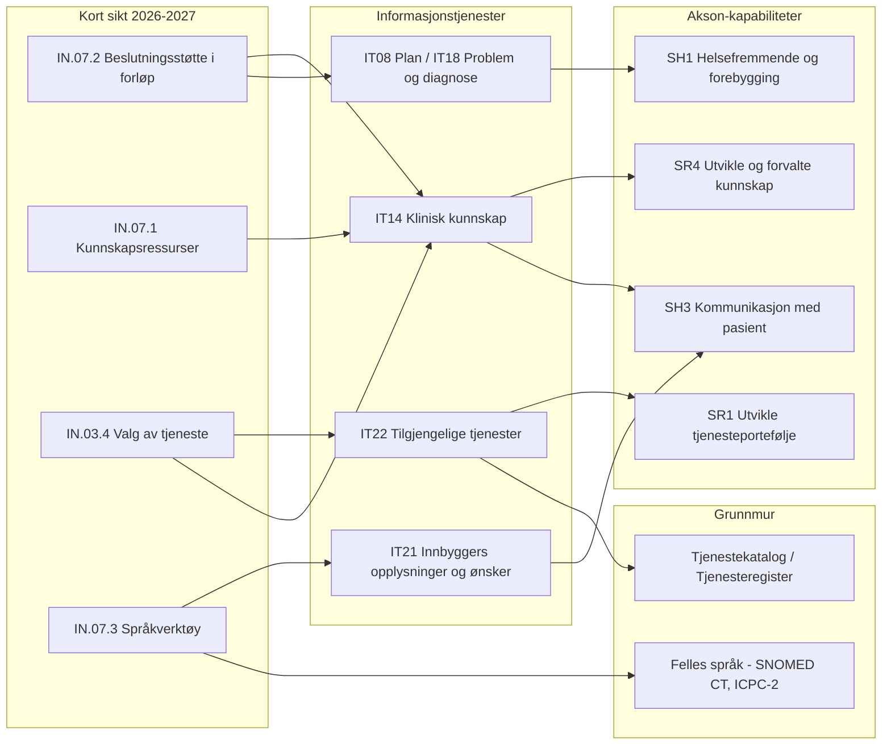

# Behovsanalyse for Digital førstelinje – med Akson-kapabiliteter

Kobler innbyggerbehovene i Akson (Bilag G2 kap. 3.3, IN.01–IN.07) mot mandatet i TB2026-17, prioriterer dem i tid, og identifiserer hvilke Akson-kapabiliteter som kan realisere kortsiktsbehovene.

Kilder:

- `background/akson/markdown/Bilag G2 Helhetlig samhandling.md`
- `background/akson/markdown/Bilag G1 Felles kommunal journalløsning.md`
- `background/akson/markdown/Vedlegg A Sentrale begreper.md`
- `background/annet/markdown/2026-Helsedirektoratet-tildelingsbrev.pdf.md` (TB2026-17)
- `background/df/markdown/Konsept digital førstelinje.md`
- `background/df/markdown/Målbilde for et sammenhengende økosystem av digitale selvhjelps- og behandlingsverktøy.md`

---

## Del 1 – Hvilke behov skal Digital førstelinje eie?

### Den mest sentrale behovsklassen

**IN.07 – Ha tilgang til prosess-, kunnskaps- og beslutningsstøtte.**

Dette er det eneste av de sju hovedområdene som treffer alle fem deloppdragene i TB2026-17, og Bilag G2 beskriver det som nesten helt udekket:

> «Det finnes lite digital støtte for veiledning om hva som er anbefalt neste steg i en gitt situasjon.» (IN.07.2, Dagens situasjon)

Det korresponderer direkte med deloppdrag 5 i TB2026-17:

> «Det skal etableres et første trinn av en digital veiviser inn til helsetjenestene som kan fungere på tvers av områdene 1-4 og nettlegen. Formålet på sikt er å bidra til at innbyggere enklere finner riktig tjeneste for deres behov.»

De øvrige seks hovedområdene (IN.01–IN.06) er i hovedsak samhandlings- og journalbehov som eies av Helsenorge, digital samhandling (TB2026-50) og journalløsningene. Digital førstelinje bør bruke dem, ikke bygge dem.

---

### Kort sikt (2026–2027) – «Vite hva jeg skal gjøre»

Fokus: beslutnings- og navigasjonsstøtte før inngang til tjenesten.

| Behov | Hvorfor Digital førstelinje | Belegg fra Bilag G2 |
|---|---|---|
| **IN.07.2** Beslutningsstøtte i forløp | Kjernen i veiviseren og KI-tjenesten for målrettede helseråd | «behov for å kunne rådføre meg rundt mine symptomer og anbefalt videre prosess» |
| **IN.07.1** Tilpassede kunnskapsressurser og opplæringsverktøy | TB2026-17 pkt. 4: forebygging, helsekompetanse, mestring | «behov for å finne fram til kvalitetssikret informasjon tilpasset min situasjon» |
| **IN.03.4** Valg av tjeneste | Veiviseren er verdiløs uten en tjenestekatalog å vise til | «¼ av respondentene svarer at de ikke vet om de tilbudene de har behov for finnes i kommunen de bor i» |
| **IN.07.3** Språkverktøy | Likeverdighetskrav; lav kostnad med språkmodell | «Andre språk enn engelsk er ikke tilgjengelig» |

Dette er også det eneste settet som kan realiseres uten personidentifiserbare data – altså uten å vente på rettslig grunnlag (jf. den juridiske utredningen i supplerende tildelingsbrev nr. 2 med frist 1.6.2026).

### Mellomlang sikt (2028–2030) – «Gjøre noe selv, og bli tatt imot»

Fokus: overgangen mellom egenmestring og helsehjelp.

| Behov | Hvorfor Digital førstelinje |
|---|---|
| **IN.06.1/06.2** Legge inn egne observasjoner og målinger | Datagrunnlaget selvhjelps- og behandlingsverktøy må levere tilbake til tjenesten |
| **IN.02.2** Opplyse om relevant informasjon til helsetjenesten | Uten dette blir selvhjelpsverktøy en blindvei: «Innbygger risikerer at opplysninger … ikke er tilgjengelig for annet helsepersonell» |
| **IN.04.1** Elektronisk dialog / **IN.04.2** Forespørre tjenester | Nettlegen og de integrerte digi-fysiske tjenestene i konseptskissen |
| **IN.07.4** Rettighetsveileder | «Det finnes ingen automatiske løsninger som opplyser om de rettighetene du har» |

Målbildet for selvhjelpsverktøy peker på samme sted: *«En innbygger som starter på egen hånd, kan gå videre til oppfølging hos helsepersonell med kontinuitet i forløpet.»*

### Lang sikt (2031+) – «Bli møtt før jeg selv vet at jeg trenger det»

Fokus: personalisering og proaktivitet.

| Behov | Hvorfor Digital førstelinje |
|---|---|
| **IN.05.3** Sammenstilling og visualisering | Forutsetning for «digital tvilling/helsearkiv» i konseptskissen |
| **IN.04.4** Motta henvendelse basert på pasientdata | Fra reaktiv til proaktiv førstelinje; TB2026-79 (påminnelse etter fødsel) er første konkrete instans |
| **IN.03.1/03.5** Plan og status på aktiviteter | Automatiserte helsetjenester må kunne skrive inn i og lese ut av forløpet |
| **IN.02.1** Administrere søknader | Automatisering av tildelingsprosessen – størst gevinst, tyngst juridisk og organisatorisk |

### Forutsetninger Digital førstelinje må sikre, men ikke eie

**IN.01.4 Samtykke og reservasjon** og **IN.01.5 Fullmakter** er ikke Digital førstelinje-behov i seg selv, men blokkerer alt fra mellomlang sikt. Personaliserte helseråd og deling mellom selvhjelpsverktøy og fagsystem krever at disse er på plass først. Samme gjelder **IN.02.4** (pårørende), som har eget oppdrag i TB2026-20.

### Anbefaling i én setning

Digital førstelinje bør eie **prosess-, kunnskaps- og beslutningsstøtte** (IN.07) fullt ut – altså beslutningsstøtte i forløp, tilpassede kunnskapsressurser, språkverktøy og rettighetsveileder – med **valg av tjeneste** (IN.03.4) som nødvendig forutsetning, bruke **tilgang til journalopplysninger og visualiseringer** (IN.05) og **innbyggerens egne observasjoner og målinger** (IN.06) som datakilder, og overlate **innbyggerens rettigheter** (IN.01), **administrere helsehjelp** (IN.02), **planlegge og koordinere med helsetjenesten** (IN.03 for øvrig) og **kommunikasjon** (IN.04) til Helsenorge og samhandlingsprogrammet – ellers utvides Digital førstelinje til å bli Akson på nytt.

---

## Del 2 – Akson-kapabiliteter som treffer kortsiktsbehovene

Akson beskriver dette i tre lag: **virksomhetskapabiliteter** (Bilag G1 kap. 2.2), **informasjonstjenester** (Bilag G2 kap. 4.4) og **grunnmur/felleskomponenter** (Vedlegg G).

### Det viktigste begrepsskillet

Vedlegg A definerer tre typer støtte som er sentrale for hele kortsiktsporteføljen:

| Begrep | Definisjon i Vedlegg A |
|---|---|
| **Kunnskapsstøtte** | «IT-verktøy som kan gi helsepersonell tilgang til forskningsbasert kunnskap. **Det er ingen støtte til automatisk oppslag ut fra helseopplysninger.**» |
| **Beslutningsstøtte** | «IT-verktøy som **kombinerer** medisinsk, helsefaglig og annen kunnskap **med individuelle pasientopplysninger** for å understøtte beslutninger i utredning, pleie og behandling av pasienter. Brukes også i forebygging av sykdom og i helsefremmende arbeid.» |
| **Prosesstøtte** | «Klinisk prosesstøtte er IT-verktøy som støtter planlegging, koordinering og gjennomføring av pasientrettede tiltak innen utredning, pleie og behandling.» |

Skillet er nøyaktig det som skiller Digital førstelinjes kortsikt fra mellomlang sikt: **kunnskapsstøtte krever ikke persondata, beslutningsstøtte gjør det.** Merk også at Akson konsekvent definerer disse som verktøy for *helsepersonell* – å løfte dem til innbyggerflaten er selve nyvinningen i Digital førstelinje.

### Aksons kapabilitetsmodell (Bilag G1 kap. 2.2)

```text
SH.  Yte helse- og omsorgshjelp
     SH1  Planlegge og utføre helsefremmende arbeid og forebygging
     SH2  Håndtere ulykker og andre akutte hendelser
     SH3  Håndtere effektiv og sikker kommunikasjon med pasient
     SH4  Vurdere, diagnostisere, behandle, pleie og evaluere pasient

SHS. Gi støtte til ytelse av helse- og omsorgshjelp
     SHS1 Administrere helsehjelp
     SHS2 Understøtte samhandling
     SHS3 Håndtere utstyr og hjelpemidler
     SHS4 Håndtere smittevern, risikoavfall og engangsutstyr
     SHS5 Gjennomføre velferdstiltak

AS.  Administrere kommunale helse- og omsorgstjenester
     AS1–AS5 (økonomi, personal, IKT, anskaffelse, eiendom)

SR.  Planlegge, utvikle og følge opp helse- og omsorgstjenester
     SR1  Utvikle tjenesteportefølje
     SR2  Styre helse- og omsorgstjenester
     SR3  Forbedre kvalitet og pasientsikkerhet
     SR4  Utvikle og forvalte kunnskap
     SR5  Håndtere kommunikasjon og samfunnskontakt
     SR6  Planlegge og lede beredskap
```

De fire kapabilitetene som bærer Digital førstelinje på kort sikt er **SH1**, **SH3**, **SR1** og **SR4**.

---

### IN.07.2 Beslutningsstøtte i forløp

| Lag | Element | Belegg |
|---|---|---|
| Kapabilitet | **SH2 Håndtere ulykker og andre akutte hendelser** – omfatter «legevakt, heldøgns medisinsk akuttberedskap … legevaktsentral». Triagering ligger her | Bilag G1 kap. 2.2.1 |
| Kapabilitet | **SH4 Vurdere, diagnostisere, behandle, evaluere og pleie pasient** | Bilag G1 kap. 2.2.1 |
| Informasjonstjeneste | **IT14 Klinisk kunnskap** – informasjonsbehovene **95.20.10 Beslutningsstøtte: regler og algoritmer**, **95.20.30 Prosesstøtte: protokoller, prosedyrer og veiledere** og **35.20.30 Tolkning av funn og symptomer** | Bilag G2 kap. 4.4.6.2 |
| Informasjonstjeneste | **IT18 Problem, diagnose og behov for helsehjelp**, **IT08 Plan** («forslag til betingede tiltaksplaner») | Bilag G2 kap. 4.4.1 |
| Standard | «Apollo API om kliniske veiledere fra Helsedirektoratet», FHIR Clinical Reasoning, FHIR Evidence-Based Medicine | Bilag G2, IT14 |

Akson sporer selv IT14 til dette behovet: *«Benyttes i følgende innbyggertjenester: … IN.07.2 … Ha tilgang til beslutningsstøtte i forløp»*.

### IN.07.1 Tilpassede kunnskapsressurser og opplæringsverktøy

| Lag | Element | Belegg |
|---|---|---|
| Kapabilitet | **SH3 Håndtere effektiv og sikker kommunikasjon med pasient** – «evne til å tilby pasienter og deres pårørende **informasjon og kunnskap for å kunne medvirke og ta eierskap til egen helse**» | Bilag G1 kap. 2.2.1 |
| Kapabilitet | **SR4 Utvikle og forvalte kunnskap** – «evnen til å samle, dele og effektivt ta i bruk kunnskap» | Bilag G1 kap. 2.2.4 |
| Kapabilitet | **SH1 Planlegge og utføre helsefremmende arbeid og forebygging** | Bilag G1 kap. 2.2.1 |
| Informasjonstjeneste | **IT14 Klinisk kunnskap** – hovedgruppen **35.20 Kunnskap tilpasset innbyggerens behov**: 35.20.20 Forberedelser før undersøkelser, 35.20.25 Praktiske forhold inkl. kostnader, 35.20.40 Utredning, behandling og prognose | Bilag G2 kap. 4.4.6.2 |

IT14 beskrives slik:

> «*Klinisk kunnskap* vil kunne tilby kunnskap som skal formidles til eller mellom helsepersonell eller til innbygger. Innholdet vil ha mange former, som gjenbrukbart undervisningsmateriale, tilgang til kunnskapsressurser, forslag til betingede tiltaksplaner eller strukturerte regler til bruk i prosess- og beslutningsstøtte.»

### IN.03.4 Valg av tjeneste

| Lag | Element | Belegg |
|---|---|---|
| Kapabilitet | **SR1 Utvikle tjenesteportefølje** | Bilag G1 kap. 2.2.4 |
| Kapabilitet | **SHS1 Administrere helse- og omsorgshjelp** (tildeling, kontakthåndtering) | Bilag G1 kap. 2.2.2 |
| Informasjonstjeneste | **IT22 Oversikt over tilgjengelige tjenester** | Bilag G2 kap. 4.4.6.1 |
| Informasjonstjeneste | **IT14** – behovene **35.20.10 Tilbud/tjenester egnet for innbyggerens behov, inkl. rettigheter** og **35.20.25 Praktiske forhold ved tjeneste eller behandling inkl. evt. kostnader** | Bilag G2 |
| Informasjonstjeneste | **IT23 Tjenester, ytelser og hjelpemidler** (hva innbygger allerede mottar) | Bilag G2 kap. 4.4.1.5 |
| Grunnmur | **Tjenestekatalog** – «Et register med beskrivelser av tjenester som skal gi informasjon om tjenestene samt de plikter som lovverket pålegger dem». IT22 henter fra **95.10.40 Tjenesteregister**, Adresseregisteret, Helsepersonellregisteret | Vedlegg A / Bilag G2 |
| Standard | FHIR `HealthcareService` og `Organization` | Bilag G2, IT22 |

IT22 beskrives slik:

> «*Oversikt over tilgjengelige tjenester og tilbud* vil inneholde oversikt over tilgjengelige tjenester og ytelser i ulike deler av helsetjenesten. … Hensikten er å gjøre det lettere å finne frem til riktig tjeneste, og å kunne bestille eller anmode om den. Informasjonstjenesten må derfor kunne lede til videre informasjon om tjenesten som kontaktinformasjon, kapasitet og kvalitetsindikatorer.»

### IN.07.3 Språkverktøy

| Lag | Element | Belegg |
|---|---|---|
| Kapabilitet | **SH3 Håndtere effektiv og sikker kommunikasjon med pasient** | Bilag G1 kap. 2.2.1 |
| Kapabilitet | **SR4 Utvikle og forvalte kunnskap** (terminologiforvaltning) | Bilag G1 kap. 2.2.4 |
| Informasjonstjeneste | **IT21 Innbyggeres opplysninger og ønsker** – **05.30.30.10 Kommunikasjon (syn, hørsel) og tolkebehov** | Bilag G2 kap. 4.4.4.3 |
| Grunnmur | **Felles språk** – «et økosystem for terminologi som skal anvendes til strukturert dokumentasjon av informasjon knyttet til helsehjelp … skal understøtte at informasjon som benyttes i pasientforløp skal kunne gjenbrukes etter å ha vært registrert én gang» (SNOMED CT, ICNP, ICD-10, ICPC-2) | Vedlegg A |

Akson dekker **maskinlesbar** terminologi godt, men har **ingen kapabilitet for oversettelse eller innbyggervennlig forklaring** av terminologien. Dette er et rent hull som Digital førstelinje må fylle.

---

## Del 3 – Aksons egen vurdering av modenhet

Begge de bærende informasjonstjenestene er merket **«0. Ikke dekket i dag»**:

| | IT14 Klinisk kunnskap | IT22 Oversikt over tilgjengelige tjenester |
|---|---|---|
| Er dekket i dag | Ikke dekket | Ikke dekket |
| Grad av strukturering | **Lav** | **Høy** |
| Omfang av informasjonselementer | **Høy** | **Lav** |
| Lagring i samhandlingsløsning | **Nei** | **Ja** |
| Foretrukket samhandlingsform | Slå opp og tilgjengeliggjøre | Endre og dele |

Det gir to helt ulike leveranseløp på kort sikt.

**IT14 – ustrukturert, stort volum, ikke lagret.** Akson skriver selv:

> «Det finnes allerede en rekke frittstående kunnskapskilder for helsepersonell og innbyggere på internett (for eksempel helsenorge.no) … Imidlertid er behovet større enn omfanget i disse kildene, og brukere må ofte søke i mange kilder før de finner det de trenger. En slik tjeneste må trolig kunne formidle søk i flere kunnskapskilder samtidig.»

Dette er nøyaktig problemstillingen KI-tjenesten i TB2026-17 skal løse. Akson beskrev behovet i 2020 uten å ha teknologien til å dekke det. Løses i dag med søk over kvalitetssikrede kilder – som er delleveransen med frist 15.6.2026 om å identifisere kildene.

**IT22 – strukturert, lite volum, må lagres.** Her er ikke teknologien problemet, men eierskapet:

> «Det hersker imidlertid usikkerhet om hvordan innholdet eventuelt kan forvaltes på en effektiv måte.»

> «Ulike aktører har forskjellig måte å organisere og navngi tjenestene sine på, selv om innholdet ofte er likt. I en katalog må dette fremstilles på en enhetlig måte. I tillegg vil utvalget av tjenester kunne endres hyppig, og forvaltningen av katalogen være krevende.»

Dette er en forvaltnings- og kodeverksoppgave, ikke en utviklingsoppgave. Den overlapper direkte med TB2026-38 (kodeverk og terminologi) og NHNs oppdrag 2026-05 / TB2026-91 om digital tjenestekatalog.

---

## Del 4 – Sammenstilling



## Konklusjon

Veiviseren i TB2026-17 deloppdrag 5 er i Akson-termer **IT14 Klinisk kunnskap + IT22 Oversikt over tilgjengelige tjenester løftet fra helsepersonellflaten til innbyggerflaten**, båret av kapabilitetene **SH3 Håndtere effektiv og sikker kommunikasjon med pasient** og **SR4 Utvikle og forvalte kunnskap**.

Akson leverte behovsbeskrivelsen, informasjonsmodellen og standardvalgene – men ingen av delene ble bygget, og ingen av dem var designet med innbygger som primærbruker. Digital førstelinje kan derfor gjenbruke Aksons analyse som kunnskapsgrunnlag, men må gjøre to selvstendige grep:

1. Snu perspektivet fra helsepersonell til innbygger i IT14 og IT22.
2. Skille tydelig mellom **kunnskapsstøtte** (kort sikt, ingen persondata) og **beslutningsstøtte** (mellomlang sikt, krever rettslig grunnlag og samtykke/fullmakt).
