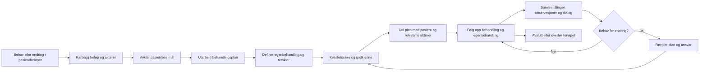

# Pasientplaner i helhetlige pasientforløp

## Kort svar

Ja. De tre rapportene gir et samlet grunnlag for å plassere behandlingsplan og egenbehandlingsplan som et felles, levende samhandlingsobjekt i pasientforløpet:

- **Pasientforløpet** beskriver hva som skjer med pasienten over tid.
- **Behandlingsplanen** beskriver mål, problemstillinger, behandlingstiltak, ansvar og status.
- **Egenbehandlingsplanen** beskriver den delen av planen som pasienten selv skal følge opp.
- **DHO** tilfører egenmålinger, skjema, dialog, video, varsler og triage.
- **Helsepersonell** kvalitetssikrer, følger opp og endrer planen.

Planen bør derfor ikke være et statisk dokument eller en separat app. Den bør være en delt og oppdatert del av pasientforløpet, med en tydelig kobling mellom pasientens mål, tiltak, observasjoner, ansvar og neste steg.

## Hva rapportene anbefaler

### 1. Start med pasientens mål og situasjon

EBP-rapporten legger «Hva er viktig for meg?» til grunn. Før planen skrives, bør pasient og helsepersonell avklare:

- pasientens mål og ønsker i hverdagen
- hvordan sykdom eller funksjon hindrer målene
- pasientens ressurser og barrierer
- hva pasienten selv kan og ønsker å gjøre
- hvilke tiltak som kan gi bedre mestring og livskvalitet

Dette gjør planen pasientorientert, og ikke bare en faglig liste over tiltak.

### 2. Skill mellom plantypene, men la dem henge sammen

DBEP-rapporten definerer:

| Plantype | Innhold og rolle |
| --- | --- |
| **Individuell plan** | Helhetlig og sektorovergripende plan med brukerens mål og tiltak, for eksempel helse, bolig, arbeid og utdanning |
| **Behandlingsplan** | Diagnoser/problemstillinger, brukerens mål eller behandlingsmål, og behandlingstiltak, uavhengig av hvem som følger dem opp |
| **Egenbehandlingsplan** | Den delen av behandlingsplanen som pasienten selv følger opp, med egenbehandlingstiltak |

Behandlings- og egenbehandlingsplaner kan inngå som delplaner i en individuell plan, men bør ikke blandes sammen. En behandlingsplan er helserettet; en individuell plan kan være sektorovergripende.

### 3. Etabler planen sammen med pasienten

EBP-rapporten anbefaler at oppfølgingstjenesten utarbeider et utkast sammen med pasienten. Planen bør deretter gjennomgås i et tverrfaglig møte med minst pasient, fastlege og sykepleier. Fastlegen eller annen medisinsk ansvarlig kvalitetssikrer den medisinske delen før planen blir gyldig.

Planen bør ha:

- navngitt medisinsk ansvarlig
- navngitt ansvarlig oppfølgingstjeneste
- oversikt over øvrige involverte helsepersonell
- avklart ansvar for hvert tiltak
- pasientens samtykke til deling
- tidspunkt for evaluering

### 4. Gjør planen handlingsrettet

Rapportene peker på en minimumsstruktur med:

1. problemstilling eller diagnose
2. pasientens mål og behandlingsmål
3. tiltak som helsepersonell skal følge opp
4. tiltak som pasienten selv skal følge opp
5. tegn, symptomer og målinger
6. terskler for endring eller eskalering
7. ansvarlig aktør
8. status og frist/tidspunkt
9. kontaktpunkt ved spørsmål eller forverring
10. dato for evaluering og revisjon

EBP-rapporten beskriver dette gjennom trafikklysmodellen:

- **Grønn:** vanlig/stabil tilstand og tiltak som skal opprettholde den
- **Gul:** forverring som krever moderate egenbehandlingstiltak
- **Rød:** større tiltak og kontakt med helsepersonell

Dette passer direkte med DHO-rapportens bruk av egenmålinger, grenseverdier og grønn-gul-rød triage.

## Viktige prosesser

### A. Før oppstart: kartlegging og forberedelse

DHO-rapporten anbefaler kartlegging av dagens og ønsket pasientforløp før implementering. Kartleggingen bør omfatte:

- pasientens situasjon, mål og behov
- aktuelle aktører og ansvarsoverganger
- hvilke tiltak som skjer fysisk og digitalt
- hvilke målinger og skjema som skal brukes
- hvilke hendelser som skal utløse oppfølging
- hvor informasjonen skal dokumenteres og deles
- hvordan pasienten kommer i kontakt med tjenesten
- hvilke løsninger som skal brukes, og når

Resultatet bør være et felles, tverrfaglig bilde av forløpet før selve planen opprettes.

### B. Utarbeidelse: dialog og planlegging

1. Pasient og helsepersonell avklarer hva som er viktig for pasienten.
2. Problemstillinger, mål og ønskede resultater formuleres.
3. Tiltak deles i helsepersonelltiltak og egenbehandlingstiltak.
4. Ansvarlig aktør, tidspunkt og status registreres.
5. Målinger, symptomer og observasjoner kobles til tiltak.
6. Terskler og regler for grønn, gul og rød oppfølging avtales.
7. Pasientens spørsmål, preferanser og samtykke dokumenteres.
8. Planen deles med relevante aktører.

### C. Kvalitetssikring og godkjenning

Før planen tas i bruk bør det kontrolleres at:

- planen er medisinsk faglig forsvarlig
- målene er forståelige og relevante for pasienten
- tiltakene er konkrete og gjennomførbare
- pasientens egenbehandling er tydelig avgrenset
- terskler for kontakt og eskalering er entydige
- ansvar og kontaktpunkter er navngitt
- informasjonen er oppdatert og ikke i konflikt med EPJ eller andre planer
- alle nødvendige aktører har riktig tilgang
- pasienten har forstått planen og vet hvor den finnes
- samtykke og deling er avklart

EBP-rapporten sier uttrykkelig at planen ikke har gyldighet før medisinsk ansvarlig har avstemt innholdet med de medisinske vurderingene.

### D. Bruk og oppfølging

I den løpende oppfølgingen bør pasienten kunne:

- lese planen på en enkel måte
- registrere egne målinger og observasjoner
- registrere egenbehandling og avvik
- få varsler og oppgaver
- kontakte helsepersonell ved behov
- se hvem som har ansvar
- se hva som er endret

Helsepersonell bør kunne:

- motta og triagere innrapporterte data
- vurdere om planen skal videreføres eller endres
- dokumentere vurderingen
- gi veiledning og tilbakemelding
- endre tiltak, terskler og ansvar
- dele oppdatert plan med relevante aktører

### E. Evaluering og revisjon

EBP-rapporten anbefaler at tidspunkt for evaluering avtales. Revisjon bør utløses av:

- planlagt evalueringsdato
- nye symptomer eller målinger
- forverring eller manglende effekt
- endring i diagnose eller behandling
- endring i pasientens mål eller livssituasjon
- endring i ansvarlig tjeneste eller aktør
- overgang mellom kommune, fastlege og spesialisthelsetjeneste

Etter revisjon bør planen versjoneres, og pasient og relevante aktører varsles om hva som er endret.

## Hva må være på plass for en generell løsning?

Rapportene peker samlet på disse nødvendige funksjonene:

| Område | Behov |
| --- | --- |
| **Planinnhold** | Problemstilling, mål, tiltak, egenbehandling, målinger, status og ansvar |
| **Pasientmedvirkning** | Pasienten kan lese, bidra og forstå planen |
| **Samhandling** | Flere aktører kan se og oppdatere samme plan |
| **DHO** | Skjema, målinger, varsler, triage, dialog og video kan kobles til planen |
| **Ansvar** | Medisinsk ansvarlig og oppfølgingsansvarlig er tydelige |
| **Kvalitet** | Faglig godkjenning, maler, standarder og revisjonsrutiner |
| **Integrasjon** | EPJ, Kjernejournal, DHO-apper og Helsenorge unngår dobbeltføring |
| **Tilgang og samtykke** | Pasient og riktige aktører får riktig tilgang |
| **Forvaltning** | Roller, finansiering, drift, support og videreutvikling er avklart |

DBEP-rapporten viser særlig at API-integrasjon mot EPJ er nødvendig for å redusere dobbeltføring. DHO-rapporten advarer samtidig mot «digitalt merarbeid» når helsepersonell må veksle mellom systemer eller registrere samme informasjon flere ganger.

## Anbefalt generell prosess

En generell pasientplan kan behandles gjennom denne livssyklusen:

1. **Kartlegg forløpet** – forstå dagens praksis, aktører, behov og ansvar.
2. **Avklar mål** – formuler pasientens mål og behandlingsmål.
3. **Utarbeid planen** – registrer problemstillinger, tiltak, egenbehandling og målinger.
4. **Kvalitetssikre planen** – medisinsk vurdering, pasientforståelse, ansvar og samtykke.
5. **Publiser og del** – gjør planen tilgjengelig for pasient og relevante aktører.
6. **Følg opp** – bruk målinger, dialog, varsler og triage.
7. **Evaluer og revider** – oppdater planen ved fastsatte eller utløste behov.
8. **Avslutt eller overfør** – dokumenter resultat og overfør ansvar ved behov.

## Diagram

Diagrammet i [pasientplan-forlop.puml](pasientplan-forlop.puml) viser denne prosessen som en ArchiMate-inspirert prosessbeskrivelse:

- **Pasientforløp** er den overordnede forretningsprosessen.
- **Behandle pasientplan** er en gjentakende delprosess som skjer ved oppstart, endring og evaluering.
- **Pasient**, **helsepersonell** og **tverrfaglig team** er aktører/roller.
- **Pasientplan** er forretningsobjektet som deles og oppdateres.
- **DHO-løsning**, **EPJ/Kjernejournal** og **Helsenorge** er applikasjonsstøtte.
- Målinger og observasjoner flyter inn i planen og kan utløse triage, revisjon eller kontakt.

## Kildegrunnlag

- [2021-Pasientens Egenbehandlingsplan (EBP) – en rask innføring.md](../../annet/markdown/2021-Pasientens%20Egenbehandlingsplan%20(EBP)%20%E2%80%93%20en%20rask%20innføring.md)
- [HelseNord-DHO-funksjonell-innsiktsrapport-v1.md](../../annet/markdown/HelseNord-DHO-funksjonell-innsiktsrapport-v1.md)
- [Prosjektrapport DBEP.md](../../annet/markdown/Prosjektrapport%20DBEP.md)
- [behovsanalyse-og-akson-kapabiliteter.md](behovsanalyse-og-akson-kapabiliteter.md)
