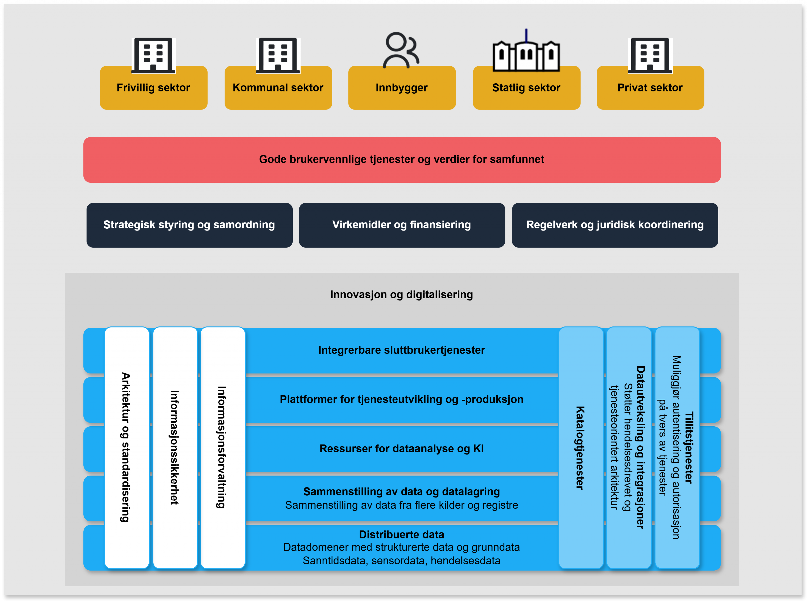
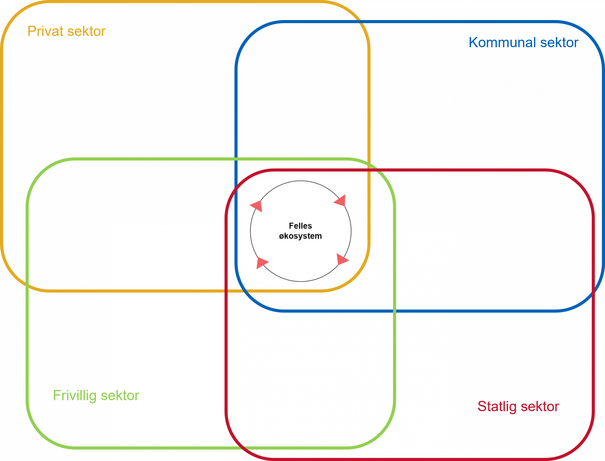
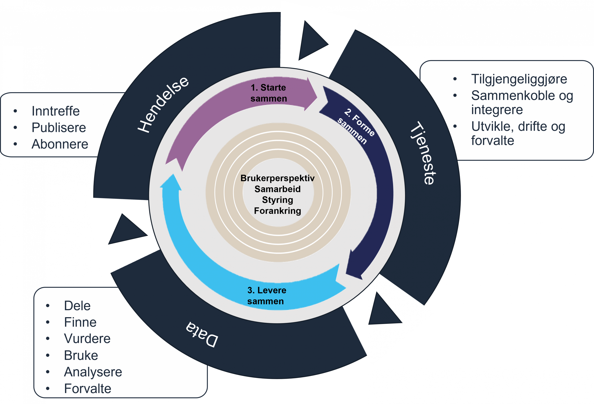

# Modell for felles økosystem

> Kilde: [Modell for felles økosystem | Digdir](https://www.digdir.no/digital-samhandling/modell-felles-okosystem/4167)

Ett viktig mål for felles økosystem er økt samhandling på tevers av sektorer og forvaltningsnivåer. Modellen vi har utarbeidet viser alle de områdene vi må ha kontroll på for å få et velfungerende digitalt økosystem.

Opprettet: 03. januar 2023  
Sist endret: 20. august 2025

Modellen skal bidra til å ivareta samhandling på juridisk, organisatorisk, semantisk og teknisk nivå. Den viser aktører, områder som setter rammebetingelser og områder som inneholder delte ressurser i form av tekniske løsninger og bestepraksisbeskrivelser, standarder, prinsipper osv.

Modellen viser ikke prosesser for hvordan verdiskaping i økosystemet kan foregå. Den viser heller ikke hvordan rammebetingelsene settes eller prosesser for styring i felles økosystem.

## Modell som PDF

[felles økosystem.pdf – Modell av felles økosystem som PDF](https://www.digdir.no/media/6089/download)

## Aktørene i felles økosystem

Aktørene som utvikler og tilbyr tjenester i felles økosystem er kommunal-, statlig-, privat- og frivillig sektor. Alle disse aktørene operer i flere økosystem.

I tillegg til å være en del av felles økosystem har aktørene egne økosystem innen hver sektor og hver virksomhet.

For å lykkes med sammenhengende tjenester må det etableres et samspill og en harmonisering mellom de ulike sektor-økosystemene. Dette samspillet vil skje i felles økosystem. Aktørene må samhandle, dele kunnskap og etablere felles forståelse. De må dele data og sikre kvalitet i informasjon, og de må jobbe sammen om å levere gode tjenester blant annet ved bruk av delte ressurser.

**Felles økosystem er bare en liten del av hver enkelt aktørs økosystem**

### Samhandlingsarenaer

Samhandlingsarenaene bidrar til økt samarbeid, felles forståelse og kunnskapsdeling. Der legges det til rette for at vi alle kan bidra til å utvikle økosystemet til felles beste. Det skapes forståelse for hvordan vi påvirker hverandre og hvordan vi alle har en rolle i å realisere én digital offentlig sektor.

### Strategisk styring og samordning

Aktørene i felles økosystem må ha en felles forståelse av reglene eller rammebetingelsene som gjelder. Styring kan bare skje gjennom rammebetingelsene, og ikke av selve økosystemet. Det må for eksempel etableres gode styringsmodeller for sammenhengende tjenester, et helhetlig regelverk for sammenhengende tjenester og vi må kunne styre porteføljen av nasjonale ressurser slik at de dekker fremtidens behov.

### Øvrige virkemidler, innovasjon og digitalisering

I felles økosystem finnes det en rekke virkemidler som skal stimulere til digitalisering og innovasjon. Dette er både finansiering, verktøy og metoder for å skape endring.

## Tjenestekjeder

Når vi setter sammen mange enkelttjenester i en helhetlig kjede får vi en tjenestekjede. En tjenestekjede består av tjenester som er levert av ulike aktører i økosystemet.

Tjenestekjeder kan være forhåndsdefinert eller orkestrert for å svare ut et behov som følger et bestemt mønster. Det vil også være mer dynamiske tjenestekjeder som tilpasses den enkelte brukers behov basert på hendelser og endringer som oppstår i innbyggerens liv.

Vi kan beskrive sammenhengende tjenester som *hendelser*, *tjenester* og *data*. En hendelse kan utløse behov for en tjeneste. Tjenesten bruker data og fører til endringer i data. Endring i data fører til en ny hendelse som igjen kan utløse behov for tjenester. Da snakker vi om en kjede av tjenester. Hvis *tjenestekjeden* fremstår sammenhengende for brukeren snakker vi om *sammenhengende tjenester*.

Slik lager vi sammenhengende tjenester:

## Delte ressurser

### Informasjonsforvaltning, informasjonssikkerhet, arkitektur og standardisering

En forutsetning for samhandling i felles økosystem er felles forståelse og felles kunnskap om hvordan samhandlingen bør foregå. I felles økosystem må vi ivareta samhandling både juridisk, organisatorisk, semantisk og teknisk. Vi må ha felles prinsipper, felles arkitekturer og benytte standarder det det kreves og der det er hensiktsmessig. Veiledninger og bestepraksisbeskrivelser innen informasjonsforvaltning, informasjonssikkerhet og arkitektur vil utarbeides gjennom deling av erfaringer og kunnskap i økosystemet.

### Integrerbare sluttbrukertjenester

Tjenester må kunne integreres med andre tjenester. Sluttbrukertjenestene må kunne benyttes som en komponent inn i andre tjenester eller som en del av en tjenestekjede. For at en tjeneste skal kunne overleve i fremtiden må den være modulbasert slik at det er muligheter for å kunne endre en tjeneste uten at alle de andre tjenestene den er en del av må designes på nytt. Tjenestene må bygges med standard grensesnitt slik at andre som integrerer tjenesten ikke trenger å vite hvordan selve tjenesten er «bygget». Sluttbruker trenger heller ikke vite tekniske detaljer om tjenesten, bare hvilket behov den svarer ut.

### Plattformer for tjenesteutvikling og -produksjon

Tjenesteutvikling og tjenesteproduksjon foregår i stor grad i sektorene og den enkelte virksomhet. Det vil allikevel være behov for fellesressurser for dette, enten i form av sektorplattformer eller i form av plattformer for hele offentlig sektor. Plattformene vil være modulære, dynamiske og skalerbare og vil gjøre det enklere for mindre virksomheter å komme i gang med sin tjenesteutvikling og tjenesteproduksjon.

### Sammenstilling av data og dataanalyse

Data i de tradisjonelle registrene må kunne kobles sammen med andre typer data og kunne sammenstilles for analyseformål. Det er behov for løsninger for sammenstilling av data, både innad i hver enkelt sektor og som fellesløsninger for alle i økosystemet. I tillegg til løsninger for sammenstilling av data vil det være behov for analyseressurser.

### Datakilder

I tillegg til felles offentlige registre, som folkeregisteret, enhetsregisteret, kontakt og reservasjonsregisteret, matrikkelen. Samt andre registre i virksomhetene blir vi mer og mer avhengige av sanntidsdata og sensordata. Disse dataene vil i stor grad være distribuerte.

### Katalogtjenester

Katalogtjenester beskriver datasett, datakvalitet, API, informasjonsmodeller, begreper, tjenester og hendelser. I tillegg er det behov for katalogtjenester som støtter innebygget arkivering.

### Datautveksling og integrasjoner

Nye tjenester bør utvikles med innebygget mulighet for deling av data og for sammenkobling med andre tjenester. Tjenestene bør være modulære og dynamiske. Tjenester kan kobles sammen i kjeder basert på hendelser. Datautveksling og integrasjoner må derfor støtte både tjenesteorientert og hendelsesdrevet arkitektur.

### Tillitstjenester

Tillitstjenester må muliggjøre autentisering og autorisasjon på tvers av tjenestekjeder, og støtte en distribuert arkitektur og føderering mellom ulike domener og tjenester.