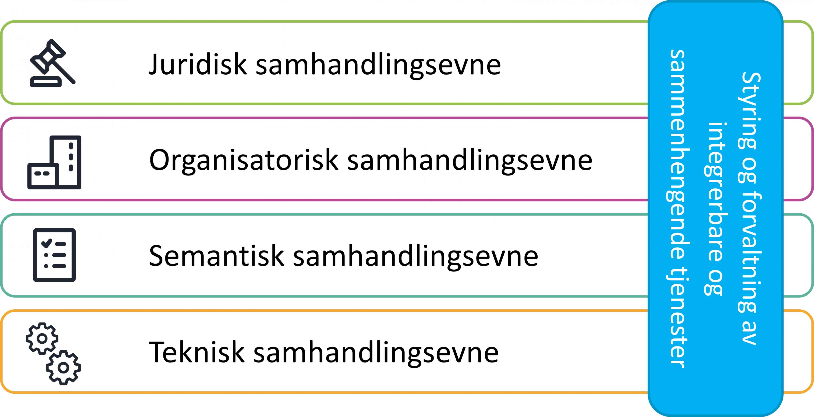
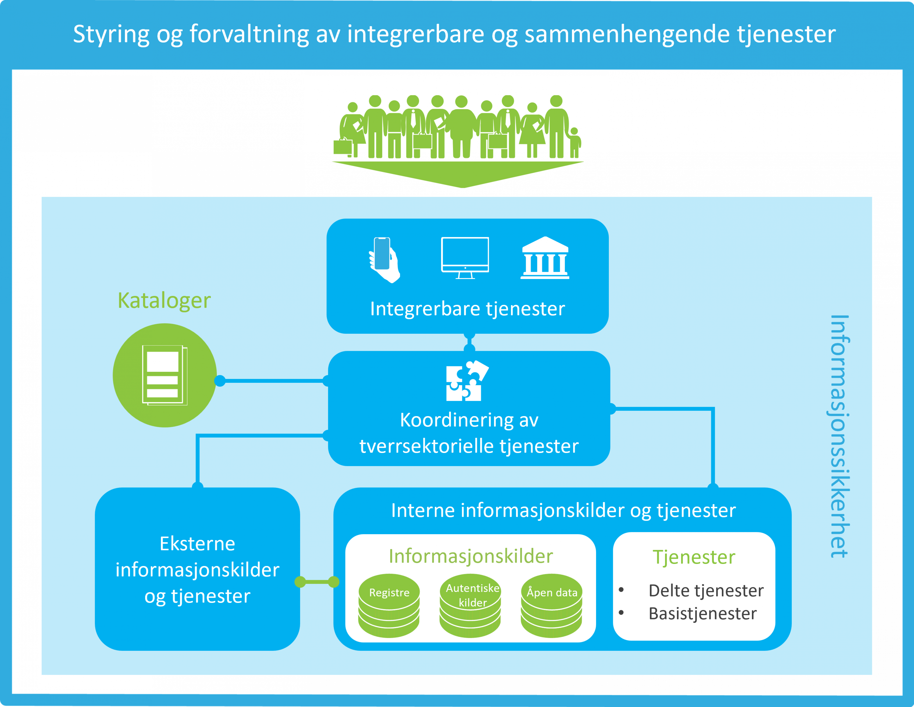

# Rammeverk for digital samhandling

> Kilde: [Rammeverk for digital samhandling | Digdir](https://www.digdir.no/digital-samhandling/rammeverk-digital-samhandling/2148)

Hvordan bygge digitale tjenester som kan samhandle? Dette rammeverket viser deg hvordan du kan jobbe systematisk og hvilke hensyn du må ta for at digitale tjenester skal kunne integreres, gjenbrukes og inngå i sammenhengende tjenester.

Opprettet: 03. desember 2020  
Sist endret: 21. august 2025

## Opprinnelsen til Rammeverk for digital samhandling

EU har utviklet [European Interoperability Framework (EIF)](https://ec.europa.eu/isa2/sites/isa/files/eif_brochure_final.pdf), et felles rammeverk for digital samhandling. Målet er å fremme digital samhandling på tvers av landegrenser og innenfor hvert enkelt land.

Norge forpliktet seg til å implementere EIF da vi undertegnet Tallinn-erklæringen i 2017, sammen med EU og andre EFTA-land.

Som et resultat har Norge etablert sitt eget nasjonale rammeverk for interoperabilitet (NIF- National Interoperability Framework), som i dag heter "Rammeverk for digital samhandling". Den første versjonen ble utarbeidet som et Skate-tiltak i 2018.

## Rammeverkets fire hoveddeler

1. [Overordnede arkitekturprinsipper](https://www.digdir.no/digital-samhandling/overordnede-arkitekturprinsipper/1065) for digital samhandling med anbefalinger.
2. Lagdelt modell for digital samhandling.
3. Konseptuell modell for styring og forvaltning av integrerbare og sammenhengende tjenester og kobling til felles økosystem.
4. [Veiledning i hvordan du kan bruke rammeverket ved endring og utvikling av digitale tjenester.](https://www.digdir.no/node/1689)

## Lagdelt modell

Rammeverket definerer digital samhandling som mer enn bare et teknisk spørsmål. Det er andre dimensjoner som er minst like viktige å ivareta når vi utvikler digitale offentlige tjenester. Den lagdelte modellen har som figuren under viser fem områder som vi må ta hensyn til:

**Juridisk samhandling** skal sikre at organisasjoner som arbeider under ulik lovgivning kan samhandle. For at organisasjoner på tvers i forvaltningen kan utvikle og bruke like tjenester og funksjonalitet må det rettslige grunnlaget for samhandling mellom aktørene være på plass.

*Se spesielt anbefalinger knyttet til [arkitekturprinsipp 3](https://www.digdir.no/node/1057) og [arkitekturprinsipp 7](https://www.digdir.no/node/1064).*

**Organisatorisk samhandling** handler om hvordan samhandlende virksomheter tilpasser tjenestekjeder/forretningsprosesser, ansvar og forventninger for å oppnå felles mål og fordeler. Området dekker også forventninger til å gjøre tjenester tilgjengelige og brukerorienterte, samt hvilke samhandlingsmodeller og avtaler virksomhetene etablerer knyttet til felles forvaltning.

*Se spesielt anbefalinger knyttet til [arkitekturprinsipp 2](https://www.digdir.no/node/1056) og [arkitekturprinsipp 6](https://www.digdir.no/node/1063).*

**Semantisk samhandlingsevne** har å gjøre med betydningen av dataelementer, relasjonen mellom dem og formatet informasjonen utveksles på. Det deles i syntaktisk og semantisk aspekt. Semantisk aspekt skal sikre dataenes betydningsinnhold og interne relasjon, som også innebærer begrepsavklaringer som sikrer at alle parter forstår kommunikasjonen. Syntaktisk aspekt refererer til eksakt format og struktur på data som utveksles.

*Se spesielt anbefalinger knyttet til [arkitekturprinsipp 4](https://www.digdir.no/node/1061).*

**Teknisk samhandlingsevne** sikrer at ulike systemer kan integreres. Dette krever teknisk standardisering, noe som i dag blant annet blir understøttet av forskrift om IT-standarder i offentlig forvaltning. Området dekker forhold knyttet til applikasjon, data, teknologi og sikkerhet.

*Se spesielt anbefalinger knyttet til [arkitekturprinsipp 1](https://www.digdir.no/node/1055) og [arkitekturprinsipp 5](https://www.digdir.no/node/1062).*

**Styring og forvaltning** av integrerbare og sammenhengende offentlige tjenester er det femte området, og løper på tvers av de andre samhandlingsområdene. Det er viktig å komme i gang med avklaringer rundt styring og forvaltning så tidlig som mulig i prosessen ved etablering av nye tjenester. I tillegg vil det være nødvendig å gå mer i dybden etter hvert.

Nasjonale offentlige tjenester er et resultat av felles arbeid fra den som etablerer tjenesten, og de som benytter den. Det må derfor opprettes styringsrutiner knyttet til kvalitet, pålitelighet, langsiktighet og endringsdyktighet når man etablerer samarbeid knyttet til sammenhengende offentlige tjenester.

Brukerne av de offentlige tjenestene – innbyggere, næringsliv, frivillige organisasjoner eller offentlige etater – er viktige premissgivere og deltakere. De forventer alle at offentlige tjenester fremstår sammenhengende, brukerorienterte, og at informasjon som det offentlige allerede har gjenbrukes. Offentlige tjenester bør derfor designes og tilbys integrerbare, slik at de kan skape sammenheng med andre tjenester.

## Konseptuell modell for styring og forvaltning

Den konseptuelle modellen, som er utarbeidet som en del av EIF-rammeverket, skal bidra til at tjenester designes for integrasjon og gjenbruk. Det betyr at vi aktivt skal legge til rette for digital samhandling helt fra start. Vi skal ivareta både de juridiske, organisatoriske, semantiske og tekniske aspektene. I tillegg må tjenester utvikles med innebygget personvern og informasjonssikkerhet må ivaretas. Dette er viktige forutsetninger for å skape og opprettholde tillit til innbyggerne, næringslivet og resten av forvaltningen. Informasjon, data, tjenester og APIer tilgjengeliggjøres i felles offentlige kataloger som data.norge.no slik at andre kan finne og gjenbruke dem.

### Digital samhandling og felles økosystem

[Modellen for felles økosystem](https://www.digdir.no/digital-samhandling/modell-felles-okosystem/4167) for nasjonal digital samhandling og tjenesteutvikling er en detaljering av den konseptuelle figuren over. Felles økosystemmodellen viser alle de områdene vi må ha kontroll på for å ivareta og muliggjøre digital samhandling på tvers av forvaltningsnivåer og sektorer. Den er en innholdsmodell for verktøy og løsninger som flere kan bruke for å utvikle digitale tjenester.

## Ta i bruk rammeverket

[Slik anvender du rammeverket for digital samhandling i praksis](https://www.digdir.no/digital-samhandling/slik-anvender-du-rammeverket-digital-samhandling-i-praksis/1689)

## Kontakt

### Nasjonal arkitektur

E-post: [nasjonalarkitektur@digdir.no](mailto:nasjonalarkitektur@digdir.no)