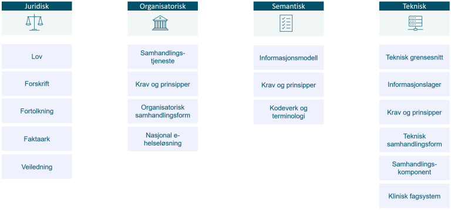

# Reguleringsplan for e-helse: innhold og ordforklaringer

Kilder:

- [Innholdet i reguleringsplanen](https://www.helsedirektoratet.no/digitalisering-og-e-helse/reguleringsplanen/innholdet-i-reguleringsplanen)
- [Ordforklaringer](https://www.helsedirektoratet.no/digitalisering-og-e-helse/reguleringsplanen/ordforklaringer)

## Innholdet i reguleringsplanen

Krav og anbefalinger i reguleringsplanen er strukturert i henhold til en informasjonsmodell.

Modellen er delt inn i henhold til [rammeverk for digital samhandling (digdir.no)](https://www.digdir.no/digital-samhandling/rammeverk-digital-samhandling/2148) i juridiske, organisatoriske, semantiske og tekniske krav og anbefalinger.

Innenfor hvert av disse områdene er det noen hovedgrupper av informasjonselementer:

- Juridisk - lover, forskrifter, faktaark og veiledere til Normen
- Organisatorisk - informasjonstjenester, organisatoriske krav og prinsipper, nasjonale e-helseløsninger, organisatoriske samhandlingsformer
- Semantisk - informasjonsmodeller, kodeverk og terminologi, semantiske krav og prinsipper
- Teknisk - samhandlingskomponenter, datalager, tekniske grensesnitt, teknisk samhandlingsform, tekniske krav og prinsipper

*Typer informasjon i reguleringsplanen.*

[Se reguleringsplanens ordliste for en forklaring av de ulike informasjonselementene](https://www.helsedirektoratet.no/digitalisering-og-e-helse/reguleringsplanen/ordforklaringer).

Informasjonsmodellen inneholder også flere elementer som reguleringsplanen kan utvides med senere etter behov.

Dataene i reguleringsplanen forvaltes i henhold til denne informasjonsmodellen.

I reguleringsplanens brukergrensesnitt kan informasjonen vises frem på ulike måter.

Først publisert: 17.01.2025  
Siste faglige endring: 18.12.2025

## Ord og begreper som brukes i reguleringsplan for e-helse

### Aktørtype

En type virksomhet eller gruppering av virksomheter / personer som spiller en aktiv rolle på et bestemt område.

### Anbefalt standard

Anbefalte standarder skal følges av målgruppen de er anbefalt for, med mindre det er svært gode grunner til å ikke gjøre det.

### Arbeidsprosess

Navn på en beskrivelse av en overordnet arbeidsprosess. En arbeidsprosess kan omfatte organisatoriske samhandlingsformer.

### Faktaark (bransjenorm)

Gir kort innføring i de viktigste kravene og anbefalingene som er relevante for avgrensede temaer.

### Informasjonslager

Et informasjonslager beskriver et lager for et avgrenset sett av data. Dette er knyttet til ansvar og ikke implementasjon. Elementet er kun aktuelt å benytte der det benyttes sentrallagring.

### Informasjonsmodell

En modell som beskriver innhold og kontekst av informasjonen det skal samhandles om. Gir regler for innholdet i en identifiserbar og klart avgrenset informasjonsmengde. Informasjonsmodeller kan også være profiler av mer generelle standarder, hvor profilen er en spesialisering og tilpasning for et gitt formål.

### Informasjonstjeneste

En informasjonstjeneste er en samling av informasjonsbehov innenfor et område, som beskriver hva innbyggere og helsepersonell har behov for å samhandle om, for å yte god helsehjelp.

### Klinisk fagsystem

Klinisk fagsystem er en samlebetegnelse på fagsystem som brukes av helsepersonell. Begrepet omfatter blant annet labsystemer, kurveløsninger, elektroniske pasientjournalsystemer, pasientadministrative systemer og andre integrerte løsninger som inneholder pasientinformasjon.

### Kodeverk

Samling med ord og uttrykk som brukes i helse- og omsorgstjenesten. Hvert ord eller uttrykk har en unik identifikator. De fleste kodeverk er avgrenset til ett eller flere fagfelt eller bruksområde.

### Krav og prinsipper (organisatoriske)

Krav og prinsipper som retter seg mot elementer på det organisatoriske laget.

### Krav og prinsipper (semantiske)

Krav og prinsipper som retter seg mot elementer på det semantiske laget.

### Krav og prinsipper (tekniske)

Krav og prinsipper som retter seg mot elementer på det tekniske laget.

### Nasjonal e-helseløsning

Samhandlingskomponent og / eller informasjonslager som er definert som en nasjonal e-helseløsning i pasientjournalloven § 8.

### Nasjonal faglig retningslinje

Normerende produkt utgitt av Helsedirektoratet. [Les mer om nasjonale faglige retningslinjer](https://www.helsedirektoratet.no/nasjonale-krav-og-anbefalinger/om-helsedirektoratets-normerende-produkter#nasjonalfagligretningslinje).

### Nasjonal veileder

Normerende produkt utgitt av Helsedirektoratet. [Les mer om nasjonale veiledere](https://www.helsedirektoratet.no/nasjonale-krav-og-anbefalinger/om-helsedirektoratets-normerende-produkter#nasjonalveileder).

### Nasjonale faglige råd

Normerende produkt utgitt av Helsedirektoratet. [Les mer om nasjonale faglige råd](https://www.helsedirektoratet.no/nasjonale-krav-og-anbefalinger/om-helsedirektoratets-normerende-produkter#nasjonalefagligeraad).

### Obligatorisk standard

Obligatoriske standarder er angitt i forskrift.

### Organisatorisk samhandlingsform

Helsepersonell trenger tjenester for å sende og motta informasjon, slå opp i informasjon fra andre eller benytte en felles kilde for informasjon. Hvordan informasjonstjenestene brukes kan beskrives som organisatoriske samhandlingsformer. Samhandlingsformene er en del av en arbeidsprosess. [Les mer om organisatoriske samhandlingsformer](https://www.helsedirektoratet.no/digitalisering-og-e-helse/nasjonal-arkitektur/oversikt-over-digitale-samhandlingsformer#organisatoriskesamhandlingsformer).

### Risikovurdering og DPIA

Risikovurdering og personvernkonsekvensvurdering (DPIA) i henhold til krav i personvernlovgivningen, se også Norm for informasjonssikkerhet og personvern i helse- og omsorgssektoren kapittel 3.4 og 3.5.

### Rundskriv, veiledninger og tolkninger

Føringer og anbefalinger fra et departement eller direktoratet om forståelse eller anvendelse av regelverk mv.

### Samhandlingskomponent

Samhandlingskomponenter er nasjonale eller regionale løsninger som understøtter utveksling og deling av informasjon og muliggjør samhandling mellom aktører som benytter ulike IKT-systemer. Samhandlingskomponenter kjennetegnes av at de først gir verdi når de brukes i samspill med andre løsninger.

### Samhandlingstjeneste

En samhandlingstjeneste gjør det mulig å dele informasjon mellom helsepersonell og med innbygger.

### Status: Udekkede behov

Område hvor det er dokumentert behov for krav eller anbefaling.

### Status: Under utvikling

Område hvor krav eller anbefaling er under utvikling.

### Status: Utfasing

Krav eller anbefaling som er besluttet utfaset.

### Teknisk grensesnitt

Et teknisk grensesnitt som gjør det mulig for maskiner og løsninger å kommunisere. Slike grensesnitt vil være realiseringer av grensesnittspesifikasjoner og kan være beskrevet som standarder.

### Teknisk samhandlingsform

Beskrivelse av hvordan samhandling skal løses teknisk. Den tekniske samhandlingsformen kan understøtte en eller flere organisatoriske samhandlingsformer. [Les mer om tekniske samhandlingsformer](https://www.helsedirektoratet.no/digitalisering-og-e-helse/nasjonal-arkitektur/oversikt-over-digitale-samhandlingsformer#tekniskesamhandlingsformer).

### Terminologi

En systematisk samling av begreper som brukes innenfor et fagfelt. En terminologi er en type kodeverk. En terminologi er utformet med tanke på at begrepene skal ha relasjoner til hverandre. Dette betyr at hvert begrep er koblet til andre relaterte begreper.

### Veileder (bransjenorm)

Gir utdypende tolkninger om kravene i Normens hoveddokument og utdypende anbefalinger om hvordan kravene kan oppfylles.

Først publisert: 18.11.2024  
Siste faglige endring: 14.01.2025