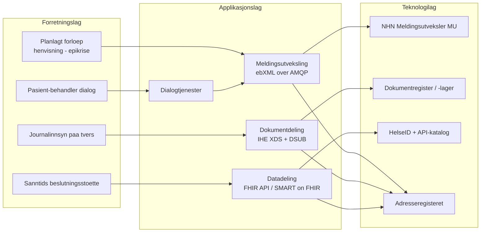
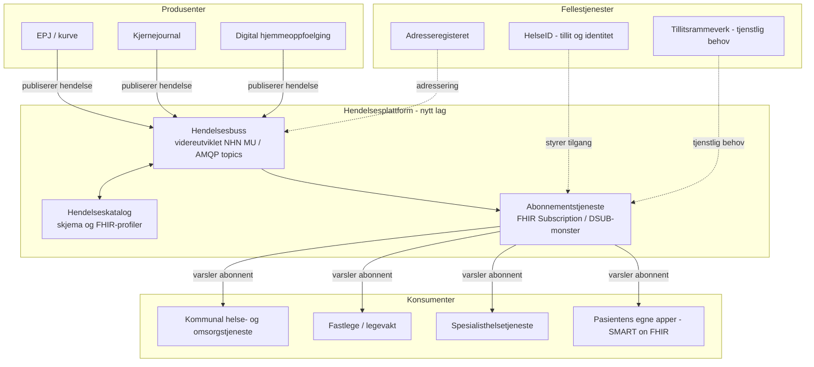

# Digitale samhandlingsformer i norsk helse- og omsorgssektor – og innlemming av hendelsesbasert arkitektur

*Kort virksomhetsarkitektonisk vurdering. Kilder er samlet i [Kilder](#kilder) nederst i dokumentet.*

## 1. Situasjonsbeskrivelse

Nasjonal helse- og samhandlingsplan (Meld. St. 9 2023–2024) peker på digital samhandling som ett av seks hovedgrep for en bærekraftig helse- og omsorgstjeneste, og viderefører ambisjonen fra «Én innbygger – én journal» om at informasjon skal følge pasienten, ikke systemet. Helsedirektoratet har siden 2019 bygget ut et sett med nasjonale referanse- og målarkitekturer som konkretiserer *hvordan* denne samhandlingen skal realiseres. Disse bygger igjen på Digdirs «Rammeverk for digital samhandling» (norsk tilpasning av EUs European Interoperability Framework, EIF).

I dag er norsk helsesektor i praksis bygget rundt **tre modne, standardiserte samhandlingsformer** (meldingsutveksling, dokumentdeling og datadeling) samt en fjerde, mindre formalisert form (dialog). Disse dekker i stor grad behovet for planlagt, forespørselsdrevet informasjonsutveksling («noen spør, noen svarer»). Det regulerings- og arkitekturarbeidet som er gjennomgått viser samtidig at **hendelsesbasert (event-driven) samhandling** – der systemer proaktivt varsler hverandre når noe skjer, uten at noen må spørre først – er lite utbredt, dårlig standardisert og i liten grad forstått som et selvstendig arkitekturmønster i sektoren, til tross for at Digdirs overordnede modell for felles økosystem eksplisitt sier at «datautveksling og integrasjoner må … støtte både tjenesteorientert og hendelsesdrevet arkitektur».

## 2. Dagens samhandlingsformer – kort sammenstilling

| Samhandlingsform | Hva den løser | Teknisk realisering i dag | Modenhet | Sentrale kilder |
|---|---|---|---|---|
| **Meldingsutveksling** | Asynkron, punkt-til-punkt overføring av strukturerte meldinger (henvisning, epikrise, PLO-meldinger, lab-/rekvirering) mellom kjente parter i et forløp | ebXML-meldinger over AMQP-køer via NHNs sentrale **Meldingsutveksler (MU)**. Hver aktør har egen kø for sanntid, asynkron og feilmeldinger + dead-letter-kø. Adresseregisteret gir teknisk adressering. | Svært høy – ryggraden i norsk samhandling siden tidlig 2000-tall | *Referansearkitektur for meldings- og dokumentutveksling* |
| **Dokumentdeling** | Gjøre journaldokumenter (epikriser, henvisninger, prøvesvar) søkbare og tilgjengelige på tvers av virksomheter, uavhengig av forløp | IHE XDS-baserte dokumentregistre/-lagre; «Pasientens journaldokumenter»; IHE-profilen **DSUB** (Document Metadata Subscription) finnes for å abonnere på nye/endrede dokumenter, men er lite tatt i bruk | Middels/høy for lesing; abonnement (DSUB) er beskrevet men **ikke realisert i stor skala** | *Målarkitektur for dokumentdeling*, *Referansearkitektur for dokumentdeling* |
| **Datadeling** | Sanntids lese-/skrivetilgang til strukturerte data (f.eks. kritisk info, legemiddelliste, målinger fra hjemmeoppfølging) via API | REST/FHIR-API-er, HelseID for autentisering/autorisasjon, felles API-katalog og API-management. Anbefalt realisert med **HL7 FHIR** og evt. **SMART on FHIR** for tredjepartsapper | Økende – FHIR er anbefalt standard, men fortsatt under utbredelse | *Referansearkitektur for datadeling*, *Målarkitektur for datadeling i helse- og omsorgssektoren*, *Anbefaling om bruk av HL7 FHIR for datadeling*, *Anbefaling om bruk av SMART on FHIR* |
| **Dialog** | Tidsavgrenset, toveis kommunikasjon mellom aktør og bruker/pasient (synkron video/tekst, asynkron melding) | Understøttes i dag i stor grad av meldingsutveksling (asynkron dialog) og videoløsninger (synkron dialog) – ikke en selvstendig teknisk plattform | Lav/middels – begrepsmessig definert, teknisk umoden | *Målarkitektur for datadeling i digital hjemmeoppfølging* |
| **(Hendelsesbasert varsling)** | Proaktiv, sanntids varsling til flere interesserte parter når en tilstand endrer seg (innleggelse/utskrivelse, ny kritisk informasjon, endret status) | **Ikke en egen nasjonal samhandlingsform.** Delvis dekket ad hoc av PLO-meldinger (meldingsutveksling) og DSUB (dokumentdeling), men ingen generell hendelses-/publish-subscribe-infrastruktur | **Lav** – erkjent behov, ikke realisert | Se kap. 3 |

Alle fire etablerte samhandlingsformene er forankret i samme sett arkitekturprinsipper (juridisk, organisatorisk, semantisk, teknisk samhandlingsevne per EIF-modellen) og deler felleskomponenter: HelseID (tillit/identitet), Adresseregisteret, felles kodeverk/terminologi (bl.a. via FHIR og IPS – International Patient Summary) og NHNs infrastruktur.

## 3. Hvorfor er hendelsesbasert samhandling lite brukt og forstått?

Analysen av arkitekturgrunnlaget peker på flere forklaringer:

1. **Arkitekturmodellen er forespørselsdrevet i bunn og grunn.** Både meldingsutveksling og datadeling er designet rundt kjente forløp og *en* aktiv part som spør (sender melding, kaller API). Det finnes ingen nasjonal "hendelseskatalog" eller publish/subscribe-plattform tilsvarende API-katalogen for datadeling.
2. **DSUB (dokumentabonnement) er standardisert, men ikke tatt i bruk i stor skala** – målarkitekturen for dokumentdeling nevner selv at abonnement på nye/endrede dokumenter er et identifisert behov («bør være mulig å abonnere på nye og endrede dokumenter»), men peker ikke på noen realisert nasjonal løsning.
3. **Meldingsutvekslerens køarkitektur er i praksis en enkel eventbuss, men brukes bare til punkt-til-punkt-varsling** langs forhåndsdefinerte forløp (f.eks. innleggelse/utskrivelse-meldinger, PLO). Den støtter ikke bredt abonnement (mange konsumenter på samme hendelsestype) eller hendelsestyper/-skjema som en felles ressurs.
4. **Semantisk grunnlag for hendelser mangler.** Datadeling har fått et felles språk gjennom FHIR og IPS. Det finnes ikke tilsvarende et nasjonalt vokabular for *hendelser* (event-typer, "topics", skjema for hendelsesnyttelast), noe som gjør det vanskelig å bygge gjenbrukbare abonnementstjenester.
5. **Styringsmodellen er innrettet mot dokumenterte tjenstlige behov per oppslag** (tillitsrammeverket), noe som passer datadeling og dokumentdeling, men er mindre utprøvd for "push"-varsling der mottakerens tjenstlige behov må vurderes *før* hendelsen inntreffer, ikke ved hvert enkelt oppslag.
6. **Konkret, udekket behov finnes allerede** – f.eks. behovet beskrevet i Akson-arbeidet: *"Som helsepersonell har jeg behov for å vite at innbygger er innlagt slik at jeg kan stoppe eventuelle kommunale tjenester."* Dette er et klassisk hendelsesbehov (ADT – admission/discharge/transfer) som i dag løses tungvint via PLO-meldinger og manuelle rutiner, ikke via automatisk varsling til alle relevante systemer.

Konklusjon: Ambisjonen om hendelsesdrevet arkitektur er uttrykt på overordnet nivå (Digdirs økosystemmodell), men er ikke brutt ned til noen konkret nasjonal referansearkitektur, standard eller felleskomponent for helsesektoren slik meldingsutveksling, dokumentdeling og datadeling er.

## 4. Hvordan kan hendelsesbasert samhandling innlemmes i den nasjonale samhandlingsplattformen?

Fremfor å introdusere en femte, frittstående samhandlingsform anbefales det å bygge hendelsesbasert samhandling som et **tverrgående mønster** som gjenbruker eksisterende felleskomponenter og standarder – i tråd med prinsippet om at nye tjenester skal støtte «både tjenesteorientert og hendelsesdrevet arkitektur».

### 4.1 Byggeklosser som allerede finnes og kan gjenbrukes

- **NHNs Meldingsutveksler (AMQP-køer)** kan videreutvikles fra ren punkt-til-punkt-meldingsformidling til en generell **hendelsesbuss**: samme kømodell, men med standardiserte hendelsestyper ("topics") og støtte for at flere konsumenter kan abonnere på samme hendelse.
- **IHE DSUB-profilen** for dokumentdeling er et eksisterende, IHE-standardisert publish/subscribe-mønster som kan tas i bruk i mye større skala, og brukes som mal for tilsvarende abonnement på datadelings-ressurser.
- **FHIR Subscription-rammeverket** (del av HL7 FHIR, som allerede er nasjonalt anbefalt standard for datadeling) gir en moden, internasjonalt utbredt måte å uttrykke "varsle meg når denne FHIR-ressursen endres" på – inkludert topic-basert abonnement (R5) som passer godt med IPS/FHIR-arbeidet som allerede pågår.
- **HelseID og tillitsrammeverket** kan gjenbrukes uendret for autentisering/autorisasjon av abonnenter, slik det allerede gjøres for datadeling og dokumentdeling.
- **Adresseregisteret og felles API-katalog** kan utvides til også å inneholde en **hendelseskatalog** (hvilke hendelsestyper finnes, hvem publiserer, hvilket skjema/FHIR-profil gjelder).

### 4.2 Foreslått målarkitektur (forenklet)

### 4.3 Konkrete, prioriterbare bruksområder

1. **Innleggelse/utskrivelse-varsel (ADT-hendelser):** Automatisk varsling til fastlege, hjemmetjeneste og pårørende-tjenester når en pasient legges inn/skrives ut – et konkret, udekket behov identifisert allerede i Akson-arbeidet.
2. **Nye/endrede kritiske opplysninger** i Kjernejournal (allergier, kritisk info): varsle behandlere som aktivt følger opp pasienten, ikke bare vise ved neste oppslag.
3. **Nye målinger utenfor normalområdet** i digital hjemmeoppfølging: hendelsesvarsel til ansvarlig klinisk personell i stedet for at systemet må spørres periodisk (polling).
4. **Nye/endrede delte dokumenter** (aktivere DSUB i stor skala) for henvisninger, epikriser og svarrapporter.

### 4.4 Forutsetninger og risikoer

- **Semantisk standardisering av hendelsestyper** må etableres først (i tråd med hvordan FHIR/IPS ble etablert for datadeling) – ellers får vi proprietære, ikke-gjenbrukbare hendelser per leverandør.
- **Personvern og tjenstlig behov ved "push":** abonnement må vurderes opp mot pasientjournalloven/helsepersonelloven – retten til å bli varslet må dokumenteres på forhånd, ikke bare ved hvert enkelt oppslag. Dette krever en presisering av tillitsrammeverket.
- **Idempotens, meldingstap og bakoverkompatibilitet** må håndteres teknisk (dead-letter-håndtering finnes allerede i NHNs MU og bør gjenbrukes/utvides).
- **Leverandørmodenhet:** mange kliniske fagsystemer (EPJ-er) har i dag ikke evne til å publisere hendelser proaktivt – dette må inn som krav i normerende produkter og kravspesifikasjoner.
- **Governance:** en hendelseskatalog krever forvaltning på linje med API-katalogen, med tydelig eierskap (naturlig kandidat: Helsedirektoratet/NHN, som allerede forvalter MU, Adresseregisteret og API-katalogen).

### 4.5 Alternativer vurdert

| Alternativ | Beskrivelse | Vurdering |
|---|---|---|
| **0: Videreføre dagens praksis** | Løse varslingsbehov ad hoc per prosjekt (som i dag) | Lav kostnad på kort sikt, men fører til fragmenterte, ikke-gjenbrukbare løsninger og fortsatt manuell/telefonbasert varsling ved uplanlagte hendelser |
| **A: Bygge egen, ny hendelsesplattform (f.eks. Kafka-basert) fra bunnen** | Etablere ny teknisk plattform uavhengig av eksisterende MU/DSUB | Teknisk fleksibelt, men gir dobbel infrastruktur, svakere gjenbruk av tillitsrammeverk og lengre vei til nasjonal forankring |
| **B (anbefalt): Videreutvikle eksisterende komponenter (MU, DSUB, FHIR Subscription) til et hendelsesmønster** | Gjenbruke NHNs meldingsplattform, IHE DSUB og FHIR Subscription/topics, supplert med en hendelseskatalog | Lavere gjennomføringsrisiko, bygger på kjent infrastruktur og etablert tillit/identitet, i tråd med Digdirs føring om hendelsesdrevet arkitektur som del av samme økosystem |

**Anbefaling:** Alternativ B. Hendelsesbasert samhandling bør ikke etableres som en separat "silo", men som en videreutvikling av eksisterende meldingsutvekslings- og dokumentdelingsinfrastruktur, standardisert gjennom FHIR Subscription/IHE DSUB, og styrt av samme tillits- og forvaltningsmodell som resten av økosystemet.

## 5. Neste steg

1. Kartlegge og prioritere 2–3 konkrete hendelsestyper med tydelig pasientsikkerhetsgevinst (f.eks. innleggelse/utskrivelse-varsel) for et pilotprosjekt.
2. Utrede juridisk grunnlag for "push"-varsling opp mot pasientjournalloven og tjenstlig behov-vurderinger, i regi av Helsedirektoratet.
3. Spesifisere en nasjonal profil for hendelser basert på FHIR Subscription/Topic, forankret i eksisterende arbeid med FHIR og IPS.
4. Vurdere om NHNs Meldingsutveksler kan utvides teknisk til å understøtte publish/subscribe med flere abonnenter per hendelsestype, eller om det trengs et supplerende hendelseslag.
5. Innarbeide krav til hendelsespublisering i kommende normerende produkter/kravspesifikasjoner for EPJ- og velferdsteknologileverandører.

## Kilder

- Meld. St. 9 (2023–2024) *Nasjonal helse- og samhandlingsplan 2024–2027*
- Digdir: *Rammeverk for digital samhandling* og *Modell for felles økosystem*
- Direktoratet for e-helse/Helsedirektoratet: *Referansearkitektur for datadeling*, *Referansearkitektur for dokumentdeling*, *Referansearkitektur for meldings- og dokumentutveksling*, *Målarkitektur for datadeling i helse- og omsorgssektoren*, *Målarkitektur for dokumentdeling*, *Målarkitektur for datadeling i digital hjemmeoppfølging*
- *Anbefaling om bruk av HL7 FHIR for datadeling*, *Anbefaling om bruk av SMART on FHIR*
- *Norm for informasjonssikkerhet og personvern i helse- og omsorgssektoren, versjon 7.0*
- Akson-forprosjektet: *Sentralt styringsdokument Akson*, *Bilag G1 Felles kommunal journalløsning*, *Bilag G2 Helhetlig samhandling*
