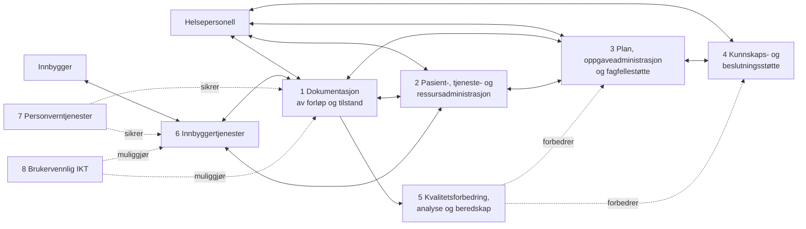

# E-helsekapabiliteter: prioriterte grupper

Dokumentet beskriver åtte e-helsekapabiliteter. Alle er relevante, men gruppene under er særlig viktige for innbyggerens forløp og helsepersonells arbeid.

| Gruppe | Betydning | Mer spesifikke kapabiliteter |
| --- | --- | --- |
| Dokumentasjon av forløp og tilstand | Sikrer at relevant klinisk informasjon fanges, lagres, leses og deles når den trengs. | Dokumentasjon fra helsepersonell; dokumentasjon fra teknisk utstyr; lesing og deling av informasjon. |
| Pasient-, tjeneste- og ressursadministrasjon | Støtter rettigheter, henvisning, prioritering og koordinering av tjenester. | Pasient- og rettighetsadministrasjon; tjeneste- og ressursadministrasjon. |
| Plan, oppgaveadministrasjon og fagfellestøtte | Gir helsepersonell felles plan, trygg oppgaveoverføring og støtte i gjennomføringen. | Plan- og prosesstøtte; tiltaks- og oppgaveadministrasjon; fagfellestøtte; legemiddelhåndtering. |
| Kunnskaps- og beslutningsstøtte | Støtter faglig riktige og prioriterte beslutninger i helsehjelpen. | Kunnskapsstøtte; beslutningsstøtte. |
| Kvalitetsforbedring, ledelse, helseanalyse, forskning og beredskap | Bruker data til forbedring, styring, analyse og beredskap. | Forvaltning av data; datafangst og lagring; tilgjengeliggjøring av data; gjennomføring av analyse. |
| Innbyggertjenester | Gir innbyggeren informasjon, innsyn, dialog og støtte til å mestre egen helse. | Administrative tjenester; tilgang til helseopplysninger og rettigheter; egenregistrering; dialog og samhandling; kunnskaps-, beslutnings- og prosesstøtte. |
| Personverntjenester | Gir kontroll, trygg tilgang og sporbarhet for innbygger og helsepersonell. | Innsyn; retting og sletting; samtykke, reservasjon og sperring; tilgangsstyring; logg og logganalyse. |
| Brukervennlig IKT | Gjør at funksjonaliteten kan brukes effektivt i ulike roller og arbeidssituasjoner. | Enkelhet i bruk; lokasjons- og flateuavhengighet; tilpasning til organisering, rolle og arbeidsprosess. |

## Verdiskapende mekanismer og e-helsekapabiliteter

Dokumentet beskriver helse- og omsorgstjenesten som et verdiverksted: problemer defineres, løsninger utredes og velges, gjennomføres og evalueres. Koblingen under er en faglig tolkning av hvordan e-helsekapabilitetene underbygger denne syklusen.

| Verdiskapende mekanisme | Hva mekanismen skal oppnå | Kapabiliteter som primært underbygger mekanismen | Viktige konkrete bidrag |
| --- | --- | --- | --- |
| Problemdefinisjon | Identifisere, analysere og beskrive helseproblemet og velge en generell tilnærming. | 1 Dokumentasjon av forløp og tilstand; 4 Kunnskaps- og beslutningsstøtte; 6 Innbyggertjenester | Samlet tilgang til relevant informasjon; registrering av symptomer og målinger; innbyggerens egenregistrering; faglig kunnskapsstøtte. |
| Problemløsning | Generere og vurdere alternative løsninger. | 3 Plan, oppgaveadministrasjon og fagfellestøtte; 4 Kunnskaps- og beslutningsstøtte; 6 Innbyggertjenester | Felles tverrfaglig plan; standardiserte forløp og prosedyrer; fagfellestøtte; beslutningsstøtte og støtte til egendiagnostisering. |
| Valg av løsning | Velge den vurderte løsningen som skal følges. | 2 Pasient-, tjeneste- og ressursadministrasjon; 4 Kunnskaps- og beslutningsstøtte; 6 Innbyggertjenester | Prioritering av henvisninger og søknader; oversikt over rettigheter og valgmuligheter; delt beslutningsstøtte og tilpasset informasjon. |
| Gjennomføring | Kommunisere løsningen, organisere ressurser og gjennomføre tiltaket. | 1 Dokumentasjon av forløp og tilstand; 2 Pasient-, tjeneste- og ressursadministrasjon; 3 Plan, oppgaveadministrasjon og fagfellestøtte; 6 Innbyggertjenester | Deling av informasjon; tjeneste- og ressursoversikt; arbeidslister og oppgaveoverføring; dialog, avtaler og digital helsehjelp. |
| Evaluering | Måle effekt og vurdere om ønsket effekt er oppnådd. | 1 Dokumentasjon av forløp og tilstand; 5 Kvalitetsforbedring, ledelse, helseanalyse, forskning og beredskap; 6 Innbyggertjenester | Registrerte utfall og målinger; datakvalitet og analyse; tilbakemeldinger, egenregistrering og innbyggerens erfaringer. |
| Tverrgående muliggjørere | Sikre at hele syklusen er trygg og anvendbar. | 7 Personverntjenester; 8 Brukervennlig IKT | Samtykke, tilgangsstyring og logg; enkelhet i bruk, tilgjengelighet og tilpasning til rolle og arbeidsprosess. |

```plantuml
@startuml
!include <archimate/Archimate>

skinparam backgroundColor white
skinparam defaultFontColor #333333
left to right direction

' Business actors and roles
Business_Actor(innbygger, "Innbygger") #ffff99
Business_Role(pasient, "Pasient") #ffff99
Business_Role(egenmestrer, "Egenmestrer") #ffff99
Business_Role(parorende, "Pårørende") #ffff99

Business_Actor(helsepersonell, "Helsepersonell") #ffff99
Business_Role(behandler, "Behandler og oppfølger") #ffff99
Business_Role(anbefaler, "Anbefaler og tildeler") #ffff99

' Value-creation mechanisms
Business_Process(problemdefinisjon, "Problemdefinisjon") #ffff99
Business_Process(problemlosning, "Problemløsning") #ffff99
Business_Process(valg, "Valg av løsning") #ffff99
Business_Process(gjennomforing, "Gjennomføring") #ffff99
Business_Process(evaluering, "Evaluering") #ffff99

' E-health capabilities
Strategy_Capability(c1, "1 Dokumentasjon") #F5DEAA
Strategy_Capability(c2, "2 Pasient-, tjeneste- og\nressursadministrasjon") #F5DEAA
Strategy_Capability(c3, "3 Plan og\noppgaveadministrasjon") #F5DEAA
Strategy_Capability(c4, "4 Kunnskaps- og\nbeslutningsstøtte") #F5DEAA
Strategy_Capability(c5, "5 Kvalitetsforbedring\nog analyse") #F5DEAA
Strategy_Capability(c6, "6 Innbyggertjenester") #F5DEAA
Strategy_Capability(c7, "7 Personverntjenester") #F5DEAA
Strategy_Capability(c8, "8 Brukervennlig IKT") #F5DEAA

' Assignment of actors to roles
innbygger --> pasient
innbygger --> egenmestrer
innbygger --> parorende
helsepersonell --> behandler
helsepersonell --> anbefaler

' Capability support for value-creation mechanisms
c1 --> problemdefinisjon
c4 --> problemdefinisjon
c6 --> problemdefinisjon
c3 --> problemlosning
c4 --> problemlosning
c6 --> problemlosning
c2 --> valg
c4 --> valg
c6 --> valg
c1 --> gjennomforing
c2 --> gjennomforing
c3 --> gjennomforing
c6 --> gjennomforing
c1 --> evaluering
c5 --> evaluering
c6 --> evaluering
c7 ..> problemdefinisjon : sikrer
c7 ..> gjennomforing : sikrer
c8 ..> problemdefinisjon : muliggjør
c8 ..> gjennomforing : muliggjør
@enduml
```

## Sammenheng mellom kapabilitetsgruppene



Kapabilitetene 1-4 utgjør helsepersonells arbeidsverktøy, mens 6 utgjør den digitale innbyggersiden. Kapabilitetene 5, 7 og 8 gir henholdsvis læring, tillit og brukbarhet på tvers.

Kilde: `background/samhandling/markdown/V3.1 E-helsekapabiliteter Én innbygger - én journal.md`.
