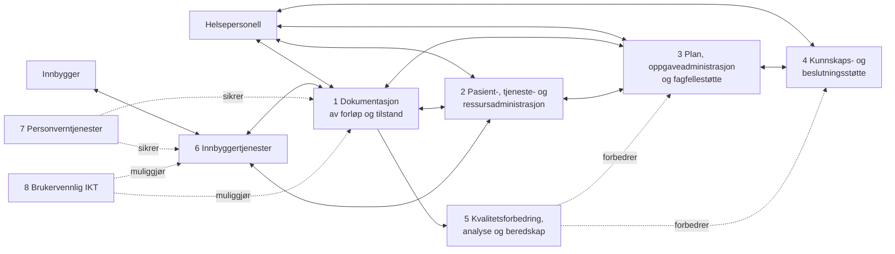

# E-helsekapabiliteter: prioriterte grupper

Dokumentet beskriver åtte e-helsekapabiliteter. Alle er relevante, men gruppene under er særlig viktige for innbyggerens forløp og helsepersonells arbeid.

| Gruppe | Betydning | Mer spesifikke kapabiliteter |
| --- | --- | --- |
| Dokumentasjon av forløp og tilstand | Sikrer at relevant klinisk informasjon fanges, lagres, leses og deles når den trengs. | Dokumentasjon fra helsepersonell; dokumentasjon fra teknisk utstyr; lesing og deling av informasjon. |
| Pasient-, tjeneste- og ressursadministrasjon | Støtter rettigheter, henvisning, prioritering og koordinering av tjenester. | Pasient- og rettighetsadministrasjon; tjeneste- og ressursadministrasjon. |
| Plan, oppgaveadministrasjon og fagfellestøtte | Gir helsepersonell felles plan, trygg oppgaveoverføring og støtte i gjennomføringen. | Plan- og prosesstøtte; tiltaks- og oppgaveadministrasjon; fagfellestøtte; legemiddelhåndtering. |
| Kunnskaps- og beslutningsstøtte | Støtter faglig riktige og prioriterte beslutninger i helsehjelpen. | Kunnskapsstøtte; beslutningsstøtte. |
| Kvalitetsforbedring, ledelse, helseanalyse, forskning og beredskap | Bruker data til forbedring, styring, analyse og beredskap. | Forvaltning av data; datafangst og lagring; tilgjengeliggjøring av data; gjennomføring av analyse. |
| Innbyggertjenester | Gir innbyggeren informasjon, innsyn, dialog og støtte til å mestre egen helse. | Administrative tjenester; tilgang til helseopplysninger og rettigheter; egenregistrering; dialog og samhandling; kunnskaps-, beslutnings- og prosesstøtte. |
| Personverntjenester | Gir kontroll, trygg tilgang og sporbarhet for innbygger og helsepersonell. | Innsyn; retting og sletting; samtykke, reservasjon og sperring; tilgangsstyring; logg og logganalyse. |
| Brukervennlig IKT | Gjør at funksjonaliteten kan brukes effektivt i ulike roller og arbeidssituasjoner. | Enkelhet i bruk; lokasjons- og flateuavhengighet; tilpasning til organisering, rolle og arbeidsprosess. |

## Sammenheng mellom kapabilitetsgruppene

Kapabilitetene 1-4 utgjør helsepersonells arbeidsverktøy, mens 6 utgjør den digitale innbyggersiden. Kapabilitetene 5, 7 og 8 gir henholdsvis læring, tillit og brukbarhet på tvers.

Kilde: `background/samhandling/markdown/V3.1 E-helsekapabiliteter Én innbygger - én journal.md`.
