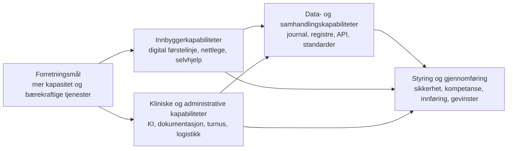

# Helsepersonellplan 2040: digitale kapabiliteter for gjennomføring

## Kort sammendrag

Helsepersonellplan 2040 peker på teknologi, digitalisering og kunstig intelligens (KI) som virkemidler for å redusere behovet for arbeidskraft og frigjøre mer tid til pasientarbeid. Tiltakene omfatter blant annet en digital førstelinje, offentlige KI-helseråd, nettlege, digitale selvhjelps- og behandlingsverktøy, KI-støttet planlegging og dokumentasjon, robotisering, bedre digital samhandling og automatisert datafangst.

Tiltakene kan ikke realiseres som enkeltstående apper eller pilotprosjekter. De krever felles kapabiliteter for data, identitet, integrasjon, sikkerhet, arbeidsprosesser, kompetanse og gevinstoppfølging. Den viktigste anbefalingen er derfor å prioritere en nasjonal, trinnvis gjennomføringsmodell der løsninger kobles til eksisterende journalløsninger og nasjonale e-helseløsninger, med tydelige krav til dokumentert effekt, brukervennlighet, personvern og klinisk forsvarlighet.

## 1. Tiltak i planen med tydelig teknologirelevans

| Tiltak i Helsepersonellplan 2040 | Forventet bidrag | Viktigste avhengigheter |
| --- | --- | --- |
| Digital førstelinje på Helsenorge | Selvbetjening, veiledning og bedre sortering av henvendelser hele døgnet | Felles inngang, kvalitetssikret innhold, innlogging, triage og sikker overgang til helsepersonell |
| Offentlig KI-basert helsetjeneste | Kvalitetssikrede helseråd, symptomvurdering og støtte til riktig tjenestenivå | Norsk kunnskapsgrunnlag, risikostyring, menneskelig eskalering, logging og løpende evaluering |
| Nettlege og digital tilgjengelighet hos fastlegen | Videobaserte konsultasjoner, tekst- og telefontjenester og timebestilling | Video, journaltilgang, prøvesvar, legemiddel- og vaksineopplysninger, arbeidsflyt og kapasitet |
| Digital verktøykasse for innbyggere og helsepersonell | Selvrapporterings-, egenbehandlings-, monitorerings- og oppfølgingsverktøy som del av behandlingen | Nasjonal struktur for kvalitet, prioritering, finansiering, integrasjon og universell utforming |
| Tidsbesparende teknologi og KI i sykehus og kommuner | Mindre dokumentasjon, bedre logistikk og planlegging, robotisering og mer tid til pasientarbeid | Integrasjon med arbeidsflater og journal, brukervennlighet, anskaffelse, opplæring og gevinstrealisering |
| KI-basert bemannings-, kompetanse- og turnusplanlegging | Jevnere arbeidsbelastning, bedre ressursutnyttelse og større mulighet til å ivareta ansattes ønsker | Korrekte bemannings- og kompetansedata, regelverk, medbestemmelse, forklarbarhet og menneskelig kontroll |
| Bedre digital samhandling mellom helsepersonell | Relevant informasjon tilgjengelig på tvers av fastlege, kommune og sykehus | Nasjonale samhandlingstjenester, standardiserte data, identitet, tilgangsstyring og innføring i hele sektoren |
| Automatisert datafangst og moderniserte helseregistre | Mindre dobbeltregistrering og rapportering, bedre styrings- og kvalitetsdata | Strukturert journal, felles variabler, integrasjoner, datakvalitet, metadata og tydelig formål |
| Digital kompetanseplanlegging og felles plattform i godkjenningsprosesser | Bedre oversikt over kompetanse, raskere godkjenning og bedre planlegging på tvers av nivåer | Felles datamodell, rolle- og tilgangsstyring, samhandlingsplattform og forpliktende prosesser |
| Personellmonitor for helse og omsorg | Oppdatert kunnskapsgrunnlag for bemanning, dimensjonering og årlig oppfølging | Sammenstilte datakilder, analyseplattform, indikatorer, datastyring og publiseringsløsninger |

## 2. Nødvendige digitale kapabiliteter

### 2.1 Digital inngang og tjenesteorkestrering

Tjenesten trenger en felles digital inngang som kan veilede innbyggeren til riktig informasjon, selvhjelp, konsultasjon eller fysisk tjeneste. Kapabiliteten må støtte hele forløpet, ikke bare en isolert chat eller videokonsultasjon.

Den må omfatte:

- sikker innlogging, representasjon og tilgang for innbygger, pårørende og helsepersonell
- symptom- og behovsvurdering med tydelig eskalering til menneskelig helsepersonell
- timebestilling, tekst, video og andre kontaktformer i samme forløp
- kobling mellom selvhjelp, oppfølging og ordinær helsehjelp
- universell utforming, klarspråk og ikke-digitale alternativer

### 2.2 Klinisk forsvarlig KI og beslutningsstøtte

KI må behandles som en styrt klinisk kapabilitet, ikke som en generell teknologikomponent. Tjenestene trenger:

- kvalitetssikrede norske kunnskapskilder og versjonsstyrte modeller
- risikoklassifisering, validering og dokumentasjon før produksjonsbruk
- forklarbarhet, kildehenvisning og tydelig markering av usikkerhet
- menneskelig kontroll og sikker overlevering når saken krever helsehjelp
- overvåking av kvalitet, skjevhet, feil, drift og endringer i modellens ytelse
- sporbar logging som ivaretar personvern og pasientsikkerhet

### 2.3 Sammenhengende data- og integrasjonskapabilitet

Tiltakene for nettlege, digital førstelinje, automatisert datafangst og digital samhandling er avhengige av at informasjon kan flyte sikkert mellom løsninger. Dette krever:

- strukturerte og standardiserte helseopplysninger
- API-er og nasjonale integrasjonsmønstre for journal, legemidler, prøvesvar, dokumenter, kritisk informasjon og måledata
- felles informasjonsmodeller, kodeverk, metadata og datakvalitetsregler
- hendelses- og samhandlingsmekanismer som reduserer behovet for manuelle oppslag
- sikker identitet, autentisering, autorisasjon og tilgang på minste privilegium

### 2.4 Arbeidsflate, automatisering og ressursstyring

For å frigjøre tid må teknologien være integrert i arbeidsprosessen der oppgaven utføres. Det innebærer en samlet kapabilitet for:

- rask og sikker tilgang til systemene helsepersonellet trenger
- mobil arbeidsflate og færre kontekstbytter
- tale-til-tekst, journalassistanse og automatisert dokumentasjon med kontrollpunkt
- bemannings-, kompetanse- og turnusplanlegging med forklarbare anbefalinger
- logistikk- og ruteplanlegging samt robotisering der oppgaven er egnet
- måling av faktisk spart tid, kvalitet og arbeidsbelastning

### 2.5 Digital verktøykjede for innbyggere og behandlere

Digitale selvhjelps- og behandlingsverktøy må kunne inngå i tjenesten på samme måte som andre helsetiltak. Det krever en nasjonal kapabilitet for:

- katalogisering og vurdering av verktøy med dokumentert kvalitet og effekt
- godkjenning, prioritering, finansiering og ansvar for forvaltning
- sikker distribusjon og kobling til pasientens forløp
- oppfølging av bruk, etterlevelse, effekt og uønskede hendelser
- støtte for leverandørsamarbeid uten å låse sektoren til enkeltleverandører

### 2.6 Automatisert datafangst og kunnskapsforvaltning

Rapportering skal i størst mulig grad skje som gjenbruk av data fra ordinær dokumentasjon. Kapabiliteten må sikre:

- strukturert registrering i journal og fagsystem uten unødvendig merarbeid
- automatisk uttrekk til registre og kvalitetsoppfølging
- felles variabler og integrasjonsløsninger på tvers av sektoren
- datalinje fra registrering til analyse med sporbarhet og datakvalitet
- gjenbruk av data bare når formål, tilgang og personvern er avklart

### 2.7 Innførings-, kompetanse- og gevinstkapabilitet

Planen forutsetter at kommuner og helseforetak kan ta løsningene i bruk, ikke bare kjøpe dem. Det trengs derfor:

- ledelsesforankret endringsledelse og lokal prosessutvikling
- digital grunnkompetanse og spesialisert kompetanse i KI, data og sikkerhet
- partssamarbeid og medvirkning ved endrede arbeidsprosesser og KI-bruk
- standardiserte metoder for utprøving, evaluering, skalering og avvikling
- nasjonal oversikt over løsninger, erfaringer, modenhet og dokumenterte gevinster
- finansiering som dekker både innføring, drift, forvaltning og gevinstrealisering

## 3. Arkitektursammenheng

Hovedpoenget er at gevinstene oppstår i arbeidsprosessene, mens teknologien bare muliggjør endringen. En digital førstelinje uten samhandling med tjenesten kan flytte arbeid i stedet for å redusere det. KI for turnusplanlegging uten gode kompetanse- og bemanningsdata kan gi presise, men dårlige anbefalinger. Automatisert datafangst uten strukturert dokumentasjon kan bare automatisere feil eller ufullstendige data.

## 4. Viktigste risikoer og arkitekturkrav

- **Pasientsikkerhet:** Alle løsninger som gir råd, triage eller beslutningsstøtte må ha tydelige grenser, menneskelig eskalering og dokumentert klinisk kvalitet.
- **Personvern og tillit:** Datadeling, KI og pårørendetilgang må bygge på formålsbegrensning, sporbar tilgang og forståelige kontrollmekanismer.
- **Digital ulikhet:** Digitale tjenester må suppleres med alternative kanaler og støtte for innbyggere med lav digital helsekompetanse.
- **Fragmentering:** En nasjonal verktøykatalog, standardiserte grensesnitt og felles krav er nødvendig for å unngå mange lokale særkoblinger.
- **Arbeidsmiljø:** KI-basert bemanningsplanlegging må være forklarbar og underlagt medbestemmelse. Effektivisering må ikke bare øke arbeidstempoet.
- **Gevinstforskyvning:** Gevinster kommer først når arbeidsprosesser, roller, opplæring og finansiering endres samtidig med teknologien.
- **Leverandøravhengighet:** Åpne standarder, portabilitet og nasjonale krav til eksport av data bør være forutsetninger for anskaffelser.

## 5. Anbefaling og neste steg

Det anbefales å etablere en samlet nasjonal kapabilitets- og innføringsplan for digitaliseringstiltakene i Helsepersonellplan 2040. Planen bør prioritere tre løp:

1. **Sammenhengende digital førstelinje:** koble Helsenorge, KI-helseråd, nettlege og digitale verktøy til sikker overgang til helsepersonell.
2. **Produktiv arbeidsflate og datagrunnlag:** prioritere samhandling, strukturert journal, automatisert datafangst, tale-til-tekst og KI-støtte der effekten kan dokumenteres.
3. **Skalering og styring:** etablere felles krav, verktøykatalog, risikostyring, kompetanseprogram, finansiering og gevinstmåling.

Før bred utrulling bør hvert tiltak ha en konkret målgruppe, definert arbeidsprosess, baseline for tidsbruk og kvalitet, ansvarlig eier, sikkerhets- og personvernvurdering, plan for medvirkning og kriterier for å skalere eller stoppe. Dette gir en gjennomførbar kobling mellom planens politiske mål og de digitale kapabilitetene som må bygges i virksomhetene.

## Kilder

- [Helsepersonellplan 2040 – regjeringen.no](https://www.regjeringen.no/no/dokumenter/meld.-st.-11-20252026/id3164917/)
- [Konvertert dokument i repositoryet](../../background/annet/markdown/stm202520260011000ddddocx.md), særlig kapittel 7 om digitalisering og kunstig intelligens og kapittel 10 om gjennomføring
- [Virksomhetsarkitekt-skill](https://raw.githubusercontent.com/hdir/architecture-by-ai/refs/heads/main/.claude/agents/virksomhetsarkitekt.md)
